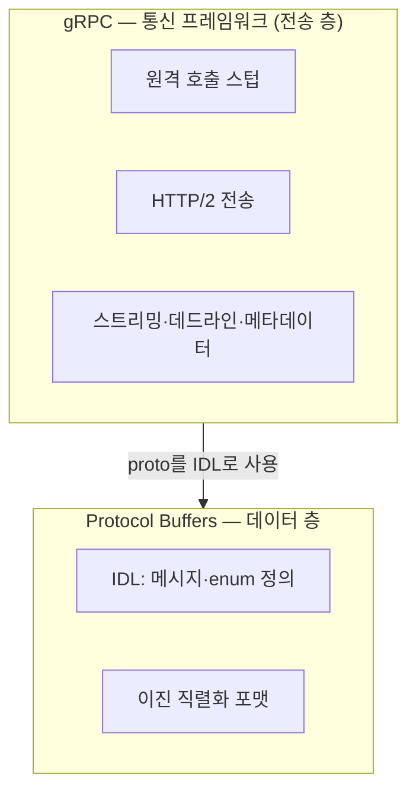
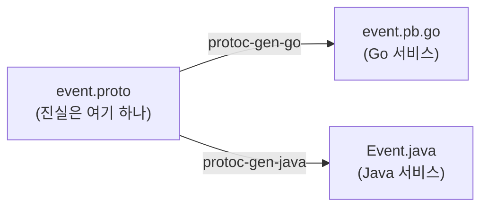

여러 서버가 각자 다른 언어로 돌아가는 백엔드를 보다 보면, 아무 비즈니스 로직도 없이 오직 **메시지·enum·서비스 정의만** 담은 저장소를 하나 만나게 된다. 이른바 "proto 계약 저장소"다. 서버 간에 주고받는 데이터의 모양이 전부 여기에 모여 있다.

이런 계약 저장소를 처음 봤을 때 자연스럽게 드는 질문이 있다. **"각 서버의 실제 코드를 안 보고, 이 계약만 읽어도 시스템을 이해할 수 있나?"** 계약이 한곳에 모여 있으니 그것만 읽으면 될 것 같다.

이 질문에 답하려다 보면 결국 **proto가 대체 무엇이고, gRPC와는 어떤 관계이며, 이 둘 말고 다른 선택지는 무엇인가**를 먼저 정리해야 한다. 이 글은 그 정리다.

이 글에서 쓰는 용어는 다음 뜻으로 읽으면 된다.

| 용어                                  | 이 글에서의 의미                                                             |
| ----------------------------------- | --------------------------------------------------------------------- |
| IDL (Interface Definition Language) | 언어에 독립적으로 데이터·서비스의 "모양"을 정의하는 언어. proto 파일이 이것                        |
| 직렬화(serialization)                  | 메모리 안의 객체를 네트워크로 보낼 수 있는 바이트열로 바꾸는 일. 반대는 역직렬화                        |
| Protocol Buffers (proto)            | Google이 만든 **IDL + 이진 직렬화 포맷**. 데이터를 정의하고 바이트로 인코딩한다. 그 자체로는 통신하지 않는다 |
| gRPC                                | proto를 IDL로 **써서** HTTP/2 위에서 원격 함수 호출을 구현하는 **RPC 프레임워크**            |
| RPC (Remote Procedure Call)         | 원격 서버의 함수를 로컬 함수처럼 호출하는 방식. 동기적, 요청-응답                                |
| wire format                         | 직렬화된 바이트가 실제로 어떤 규칙으로 배열되는가. proto의 경우 `[태그][값]`의 반복                  |
| varint                              | 작은 정수는 적은 바이트로 쓰는 가변 길이 정수 인코딩. proto가 정수를 압축하는 핵심                    |
| 스키마 진화(schema evolution)            | 필드를 추가·삭제해도 옛 데이터와 새 코드가 서로 호환되게 하는 규칙                                |
| 코드 자동 생성(codegen)                   | proto 정의 하나를 컴파일러에 넣어 각 언어의 클래스/구조체 코드를 기계가 찍어내는 것                    |

이번 학습에서 확인하고 싶은 질문은 다음과 같다.

1. proto와 gRPC는 같은 것의 다른 이름인가, 아니면 서로 다른 층위인가?
2. "코드 자동 생성"은 무엇을 생성하고, 어디에서 생성되는가?
3. proto 바이트는 왜 JSON보다 작고 빠른가 — 정확히 무엇을 버려서?
4. gRPC의 unary와 streaming은 언제 갈리고, 조회성 API는 왜 대개 unary인가?
5. 스키마가 바뀔 때 proto와 Avro는 무엇을 다르게 하는가?
6. proto/gRPC 말고 어떤 선택지가 있고, 그 선택지는 몇 개의 축으로 나뉘는가?
7. 그래서 결국, 계약만 보고 시스템을 이해할 수 있는가?

---

## 먼저 proto와 gRPC가 뭘까

proto와 gRPC는 같은 층위의 대안이 아니라 **서로 다른 층(layer)** 이다.



- **Protocol Buffers = IDL + 이진 직렬화 포맷.** 메시지의 모양을 정의하고, 그 객체를 바이트로 인코딩·디코딩한다. **네트워크 통신은 하지 않는다.** proto만 놓고 보면 그저 "데이터를 정의하고 압축하는 도구"다.
- **gRPC = RPC 프레임워크.** proto를 IDL로 **가져다 써서**, HTTP/2 위에서 "원격 함수 호출"을 구현한다. 클라이언트/서버 스텁, 스트리밍, 타임아웃(데드라인), 메타데이터 같은 것을 얹는다.

핵심 관계는 이 한 문장이다. **gRPC는 proto 위에 지어졌고, proto는 gRPC 없이도 혼자 쓸 수 있다.** proto로 직렬화한 바이트를 DB 컬럼에 넣든, 파일에 쓰든, 메시지 큐에 실든 그것은 gRPC와 무관하다.

gRPC 소개 문서에서는 *"By default, gRPC uses Protocol Buffers ... although it can be used with other data formats such as JSON"*(기본적으로 gRPC는 Protocol Buffers를 사용한다 … 다만 JSON 같은 다른 데이터 포맷과도 함께 쓸 수 있다)이라 적고, 이어 *"gRPC can use protocol buffers as both its Interface Definition Language (IDL) and as its underlying message interchange format"*(gRPC는 Protocol Buffers를 IDL이자 내부 메시지 교환 포맷으로 함께 쓸 수 있다)이라고 명시한다([gRPC · Introduction](https://grpc.io/docs/what-is-grpc/introduction/)). 두 문장을 뒤집어 읽으면 층 구분이 선명해진다. proto는 gRPC의 *기본* 짝일 뿐 유일한 짝이 아니고(그래서 JSON으로도 굴러간다), 반대로 gRPC라는 전송을 걷어내고 proto만 데이터 포맷으로 쓰는 것도 얼마든지 가능하다.

### 이 층 구분은 생성된 파일에서 눈으로 보인다

추상적인 이야기 같지만, proto 파일과 그 산출물의 이름이 이 개념을 그대로 드러낸다. proto 파일 중 어떤 것은 `message`/`enum`만 담고, 어떤 것은 `service`를 정의한다.

| 파일 예시 | 내용 | 층 |
| --- | --- | --- |
| `user.proto`, `order.proto` … | `message` / `enum`만, `service` 없음 | **proto만** (순수 데이터) |
| `search_service.proto` | `service { rpc Search(...) returns (...) }` 있음 | **gRPC** (proto 위의 서비스) |

Go로 코드를 생성하면 이 경계가 파일명으로 갈린다.

```text
user.pb.go               ← proto 메시지 (모든 파일에 생성됨)
order.pb.go              ← proto 메시지
search_service.pb.go     ← proto 메시지 (요청/응답 메시지)
search_service_grpc.pb.go ← gRPC 스텁 (service 있는 파일에만!)
```

`_grpc.pb.go`는 **`service`를 정의한 파일에만** 생긴다. 나머지는 전부 `.pb.go`(proto 메시지)만 있다. 즉 **"proto는 어디에나, gRPC는 service를 정의한 곳에만"**이라는 문장이, 파일 목록 한 장으로 증명된다.

### 역할 차이 정리

| | Protocol Buffers | gRPC |
| --- | --- | --- |
| 정체 | 데이터 정의 언어 + 직렬화 포맷 | RPC 프레임워크 |
| 답하는 질문 | "데이터를 어떻게 **표현**하나" | "서비스를 어떻게 **호출**하나" |
| 산출물 | 메시지 클래스/구조체 | 클라이언트/서버 스텁, 스트리밍, 데드라인 |
| 전송 관여 | 없음 (바이트만 생산) | HTTP/2 위 전송 담당 |
| 단독 사용 | 가능 (DB·파일·큐 payload) | IDL/스키마 없이는 무의미 |

---

## proto가 실제로 하는 일과 "코드 자동 생성"

proto 계약 저장소는 흔히 "여러 서버가 공유하는 계약, 비즈니스 로직 없음"을 표방한다. 그렇다면 계약은 구체적으로 무슨 일을 하는가. 넷으로 나뉜다.

1. **서버 간 공통 언어.** 여러 서버가 같은 데이터를 주고받는데, 각 서버가 그 구조체를 제 방식대로 따로 정의하면 필드 하나만 어긋나도 통신이 깨진다. proto는 이걸 한 파일에 한 번만 정의한다.
2. **직렬화 포맷.** 위 구조체를 네트워크로 보낼 바이트로 바꾸는 규칙.
3. **gRPC 서비스 시그니처.** "어떤 함수를 원격 호출할 수 있는가"(`service` 블록).
4. **버전 안전성의 강제 지점.** `buf breaking` 같은 도구가 CI에서 호환 깨는 변경을 기계적으로 막는다.

그리고 이 네 가지가 실제로 값을 하려면 **코드 자동 생성**을 거쳐야 한다. 이게 개념적으로 가장 자주 오해받는 지점이다.

### 몇 줄이 수백 줄이 되는 순간

내가 손으로 쓰는 것은 짧은 선언 하나다.

```proto
// event.proto — 사람이 쓴 것
message Event {
  string id = 1;
  string type = 2;        // "order.created"
  string aggregate_id = 3;
  google.protobuf.Timestamp occurred_at = 4;
}
```

이 선언에는 "id라는 문자열이 1번 필드"라는 **모양**만 있고, 프로그램에서 바로 쓸 수 있는 코드는 없다. 그래서 컴파일러(`protoc`/`buf`)를 돌리면 훨씬 긴 Go 코드가 나온다.

```go
// event.pb.go — 기계가 생성한 것
// Code generated by protoc-gen-go. DO NOT EDIT.
type Event struct {
    Id           string   // ← "string id = 1"이 이렇게 변신
    Type         string
    AggregateId  string   // ← "aggregate_id"가 Go 관례인 AggregateId로
    OccurredAt   *timestamppb.Timestamp
    // ... + 직렬화·파싱·필드 접근 함수 수백 줄
}
func (x *Event) Reset()          { /* ... */ }
func (x *Event) String() string  { /* ... */ }
```

첫 줄의 `DO NOT EDIT`가 요점이다. 사람이 관리하는 것은 짧은 proto 하나뿐이고, 나머지는 언제든 거기서 다시 뽑는다.

### 왜 이렇게 할까 - "한 번 쓰고 여러 언어로 뽑는다"

같은 `event.proto` 하나에서 Go도 Java도 나온다.



- **얻는 것**: 진실이 proto 한 곳에만 있다. 필드를 추가하려면 proto 한 줄을 고치고 재생성하면 모든 언어가 동시에 갱신된다. 사람이 수백 줄을 언어마다 손으로 짜고 동기화를 맞추는 지옥이 사라진다. 오타·불일치로 인한 통신 버그가 원천 차단된다.
- **내놓는 것**: 빌드 파이프라인에 codegen 단계가 붙는다. 그리고 생성 코드를 다루는 규율이 필요하다(뒤 「한계」 참고).

### 생성은 어디에서 일어날까

"코드 생성은 데이터를 만드는 특정 서버에서만 되는 것 아닌가"는 오해다. 더 정확히는 **생성의 입력은 계약 저장소의 proto이고, 실제 생성 시점은 팀의 배포 방식에 따라 달라진다.** 잘 정리된 계약 저장소는 언어별 생성 설정을 함께 둔다.

| 설정 | 무엇을 생성 | 방식 |
| --- | --- | --- |
| Go 생성 설정 | Go 코드 (`*.pb.go`) | 생성 결과를 커밋하거나 모듈/패키지로 배포 |
| Java 생성 설정 (Gradle/buf) | Java 클래스 + gRPC 스텁 | 빌드 때 생성하거나 jar 아티팩트로 배포 |

각 언어의 소비자는 계약 저장소의 proto를 기준으로 코드를 **가져다 쓰거나, 자기 빌드에서 생성한다**. Go는 생성 결과를 커밋해 공유하고, Java는 커밋하지 않고 빌드할 때마다 생성하는 식으로 관례가 갈리기도 한다. 핵심은 생성 위치가 어디든 **진실의 원천은 proto 계약**이라는 점이다.

**질문 2에 대한 답**: codegen은 proto 정의로부터 각 언어의 메시지 클래스(+`service`가 있으면 gRPC 스텁)를 만든다. 생성 결과를 중앙에서 배포하든 각 서비스가 빌드 시점에 만들든, 기준은 계약 저장소의 proto다.

---

## 이진 인코딩: 왜 JSON보다 작고 빠를까

proto가 "직렬화 포맷"이라는 말의 실체를 바이트로 확인하면 원리가 손에 잡힌다. 간단한 메시지를 하나 인코딩해 보자.

```proto
message Task {
  string id = 1;        // "T7"
  int32  priority = 2;  // 3
}
```

**JSON으로**: `{"id":"T7","priority":3}` → **24 바이트**
**Protobuf로**: `0A 02 54 37 10 03` → **6 바이트** (4배 차이)

### 이 6바이트를 한 바이트씩 해부해보면

proto는 각 필드를 `[태그][값]`의 반복으로 쓴다. 여기서 태그는 "이 값이 몇 번 필드이고 어떤 형태인가"를 한 덩어리로 눌러 담은 것이다. 공식 인코딩 문서는 그 공식을 이렇게 정의한다. 태그는 *"a varint formed from the field number and the wire type"*(필드 번호와 와이어타입으로 만들어진 varint)이며 `(field_number << 3) | wire_type` 로 계산된다([Protocol Buffers · Encoding](https://protobuf.dev/programming-guides/encoding/)). 즉 하위 3비트가 와이어타입(값의 형태), 그 위가 필드 번호다.

```text
0A ┐ 태그: 0000 1010
   │   하위 3비트 010 = 와이어타입 2 (길이 지정 = string)
   │   상위      0001 = 필드번호 1   ← "id"
02 ┘ 길이: 2바이트
54 37   값: "T7"  (T=0x54, 7=0x37)

10 ┐ 태그: 0001 0000
   │   하위 3비트 000 = 와이어타입 0 (varint = 정수)
   │   상위      0010 = 필드번호 2
03 ┘ 값: 3
```

### 작은 이유 세 가지

1. **필드 "이름"을 안 보낸다.** JSON의 `"id"`, `"priority"` 문자열이 통째로 사라지고 **숫자 1, 2**만 남는다. 이것이 proto에서 필드 번호가 계약의 핵심인 이유다 — 바이트에 이름이 없으니 필드 리네임은 공짜이고, 번호를 바꾸면 재앙이 된다.
2. **구조 문장부호가 없다.** `{ } " : ,`가 전부 불필요하다.
3. **정수를 varint로.** 숫자 3을 텍스트 `'3'`이 아니라 이진 `0x03`으로 쓴다.

### varint 곁들이기

varint는 작은 수를 적은 바이트로 쓰는 가변 길이 정수다. 공식 문서 표현으로는 "base 128" 인코딩으로, 7비트씩 끊어 담고 각 바이트의 최상위 비트를 "다음 바이트가 이어짐" 표시로 쓴다([Protocol Buffers · Encoding](https://protobuf.dev/programming-guides/encoding/)). 숫자 **300**을 예로:

```text
300 = 1 0010 1100 (2진수, 9비트)
7비트씩 (하위부터): 0101100 / 0000010
연속 비트 붙여 리틀엔디언:
  AC = 1010 1100  (최상위 1 = 계속)
  02 = 0000 0010  (최상위 0 = 끝)
→ 300 = AC 02  (2바이트)
```

대부분의 ID·카운터 같은 작은 수가 1~2바이트로 끝난다.

### 빠른 이유, 그리고 대가

빠른 이유는 두 갈래다. **텍스트 파싱이 없다**. JSON은 문자열을 스캔해 `"3"`을 숫자 3으로 변환하고 키 문자열을 매칭해야 하지만, proto는 태그를 읽고 곧장 필드로 점프한다. 그리고 **모르는 필드를 빠르게 건너뛴다** — 와이어타입이 값의 크기를 알려주므로, 신 버전이 추가한 필드를 구 버전 리더가 즉시 skip할 수 있다(이 성질은 뒤 스키마 진화에서 다시 나온다).

대가도 분명하다. **사람이 못 읽는다.** `0A 02 54 37`은 스키마 없이는 의미 불명이라, 로그·디버깅에는 JSON이 편하다. 그리고 **바이트만으로는 해석 불가**하다 — 저 바이트가 "필드 1은 id라는 string"임을 알려면 스키마가 있어야 한다. 이 "스키마 의존"이 다음 절의 주제다.

**질문 3에 대한 답**: proto는 필드 이름·구조 문장부호·정수의 텍스트 표현을 버려서 작아지고, 텍스트 파싱을 없애서 빨라진다. 그 대가로 사람이 읽는 능력과 자기 기술성(self-describing)을 버린다.

---

## gRPC의 4가지 스트리밍 모드 - 조회성 API는 왜 unary인가

gRPC는 HTTP/2(스트림 다중화) 위에 서서 네 가지 호출 방식을 제공한다. 이 넷은 내가 임의로 나눈 게 아니라 gRPC 공식 "Core concepts" 문서가 정의하는 목록 그대로다 - unary, server streaming, client streaming, bidirectional streaming([gRPC · Core concepts](https://grpc.io/docs/what-is-grpc/core-concepts/)). 넷을 가르는 구분자는 proto의 `stream` 키워드 하나다.

| 모드                   | proto 시그니처                                | 의미             | 예                |
| -------------------- | ----------------------------------------- | -------------- | ---------------- |
| **Unary**            | `rpc F(Req) returns (Resp)`               | 요청 1 → 응답 1    | 일반 함수 호출         |
| **Server streaming** | `rpc F(Req) returns (stream Resp)`        | 요청 1 → 응답 여러 개 | 구독, 대용량 목록 조각 전송 |
| **Client streaming** | `rpc F(stream Req) returns (Resp)`        | 요청 여러 개 → 응답 1 | 청크 업로드 후 요약      |
| **Bidirectional**    | `rpc F(stream Req) returns (stream Resp)` | 양쪽 동시 스트림      | 채팅, 실시간          |

### 조회성 Search를 보면

```proto
rpc Search(SearchRequest) returns (SearchResponse);   // stream 없음 → unary
```

검색은 "질문 하나 → 결과 묶음 하나"의 단발 왕복이다. `SearchResponse`가 결과를 한 번에 담아 돌려준다. 결과가 유한하고 시점 고정(point-in-time)이라, 스트리밍이 줄 이득이 없다. 만약 결과가 방대해 도착하는 대로 렌더링하고 싶거나("검색이 끝나는 대로 조각조각") 라이브 구독이었다면 server streaming이, 실시간 대화형이었다면 bidirectional이 맞았을 것이다. 조회는 그중 어느 것도 아니므로 unary가 자연스럽다.

### 관찰 하나

많은 시스템이 gRPC를 쓰면서도 **전부 unary만** 쓴다. 조회·명령·헬스체크가 죄다 유한한 요청-응답이기 때문이다. 이건 흔하고 정당한 사용법이다 — gRPC의 절반(스트리밍)을 안 써도 "언어 중립 함수 호출 + 계약 강제"만으로 충분히 값을 한다. HTTP/2 다중화 덕에 unary 여러 개가 한 커넥션을 공유하는 이점은 그대로 받는다.

**질문 4에 대한 답**: 스트리밍은 결과가 무한/연속이거나 실시간 상호작용일 때 갈린다. 조회성 호출은 유한한 요청-응답이라 unary만으로 충분하다.

---

## 스키마 진화: proto와 Avro는 무엇을 다르게 하는가

앞서 "proto는 스키마에 의존한다"고 했다. 그런데 스키마 기반 이진 직렬화는 proto만 있는 게 아니다. 대표적 경쟁자 **Apache Avro**와 비교하면, "스키마가 바뀔 때 무엇을 믿느냐"의 설계가 정반대라는 게 드러난다.

### Protobuf = 번호 기반 (tag-based)

- 필드의 정체성은 **영구 번호**다. 와이어에 이름이 없고 번호만 있다(앞의 바이트 해부에서 봤듯).
- 진화 규칙:
  - **추가** → 새 번호 부여. 구 리더는 모르는 번호를 skip하고, 신 리더가 구 데이터를 읽으면 그 필드는 기본값.
  - **삭제** → 번호를 `reserved`로 봉인, 절대 재사용 금지.
  - 번호·타입 변경은 **금지**.
- 핵심 성질: **리더는 자기 스키마만 있으면 된다.** 데이터에 스키마가 붙어 다니지 않는다. 번호로 매칭하고 나머지는 무시/기본값.

이 규칙들은 팀의 관례가 아니라 공식 문서의 명령이다. proto3 언어 가이드는 필드 번호를 두고 *"This number cannot be changed once your message type is in use"*(메시지 타입이 사용되기 시작하면 이 번호는 바꿀 수 없다), 그리고 *"Field numbers should never be reused"*(필드 번호는 절대 재사용해서는 안 된다)라고 분명히 적으며, 지운 번호는 `reserved`로 막아 재사용을 원천 봉쇄하라고 안내한다([Protobuf · Language Guide (proto3)](https://protobuf.dev/programming-guides/proto3/)). 잘 관리되는 proto 저장소의 버저닝 규칙(새 번호로만 추가, 리넘버 금지, `reserved` 봉인, `UNRECOGNIZED` 처리)은 이 문장들을 그대로 팀 규약으로 옮겨 적은 것이다.

### Avro = 스키마 해소 (schema resolution)

- 필드의 정체성은 **이름**(+스키마 내 위치)이다.
- 데이터만으로는 못 읽는다. 디코딩하려면 **"쓸 때 쓴 스키마(writer's schema)"**가 있어야 한다.
- 읽을 때 writer 스키마와 reader 스키마를 대조(resolution)한다. 이름으로 맞추고, 없는 필드는 기본값, 남는 필드는 무시.
- writer 스키마를 구하는 길은 둘. **컨테이너 파일**(파일 헤더에 스키마를 담아 자기완결적) 또는 **스키마 레지스트리**(Kafka + Confluent 등에서 메시지엔 작은 스키마 ID만 싣고 리더가 ID로 조회).

이 대조 규칙 전체 (어떤 스키마 쌍이 "match(일치)"하는지, 없는 필드를 기본값으로 어떻게 채우는지) 는 Avro 명세의 "Schema Resolution(스키마 해소)" 절에 성문화돼 있다([Apache Avro · Specification](https://avro.apache.org/docs/1.11.1/specification/)). proto의 진화 규칙이 언어 가이드 한 곳에 있듯, Avro의 호환성도 명세가 직접 정의한다.

### 정반대 대칭

| | Protobuf | Avro |
| --- | --- | --- |
| 필드 정체성 | **번호** | **이름** |
| 해석에 필요한 스키마 | **리더 자기** 스키마 | **writer** 스키마 (파일/레지스트리) |
| 필드 **리네임** | **공짜** (이름은 장식) | **aliases 필요** |
| 번호변경 / 재정렬 | 리넘버 = **치명적** | 이름 매칭이라 **무해** |
| 코드생성 | 보통 함 (컴파일 클래스) | 선택 (GenericRecord로 동적 처리 가능) |
| 스위트스팟 | **RPC·서비스 API·다국어 MSA** | **데이터 레이크·Kafka·분석** |

리네임과 재정렬이 서로 거울상이라는 게 핵심 통찰이다. proto는 이름을 자유롭게 바꿔도 번호가 정체성이고, Avro는 순서를 바꿔도 이름이 정체성이다.

설계가 갈린 이유는 목표가 달라서다. **Protobuf는 RPC/API용**이라, 리더와 라이터가 독립 배포되는 다른 서비스이고 스키마 버전을 맞춰줄 수 없다는 전제 위에 선다 → "리더 스키마 + 안정된 번호"만으로 해독되게 설계. **Avro는 대용량 저장/스트리밍용**이라, 스키마가 파일 헤더에 한 번 실리거나(수백만 레코드에 상각) 레지스트리에 산다는 전제 위에 선다 → 이름 기반의 더 유연한 진화를 허용.

**질문 5에 대한 답**: proto는 "번호로 매칭하고 리더 스키마만 믿는다", Avro는 "이름으로 매칭하고 writer 스키마를 함께 가져온다". 전자는 서비스 API에, 후자는 데이터 파이프라인에 유리하다.

---

## proto/gRPC 말고 다른 선택지

가장 중요한 정리는 이것이다. proto와 gRPC가 **다른 층**이므로, 대안도 **두 축으로 따로** 존재한다. 이 둘을 한 줄에 섞으면 논의가 엉킨다.

### 축 A: 직렬화/IDL 대안 (proto의 자리)

| 기술              | 특징                                                | 언제                |
| --------------- | ------------------------------------------------- | ----------------- |
| **JSON**        | 사람이 읽음, 스키마 없어도 됨, codegen 불필요. 대신 큼·느림·스키마 강제 없음 | REST, 설정, 로그, 디버깅 |
| **Apache Avro** | 스키마 기반, 스키마가 데이터와 함께(또는 레지스트리로) 이동, 진화 유연         | Kafka·데이터 파이프라인   |
| **FlatBuffers** | **zero-copy** — 파싱 없이 바로 접근. Google 작품            | 게임·초저지연           |
| **Cap'n Proto** | zero-copy, proto2 저자가 만듦                          | 극한 성능             |
| **MessagePack** | "바이너리 JSON", 스키마 없음                               | 가벼운 이진화           |

### 축 B: 서비스 호출/상호작용 대안 (gRPC의 자리)

| 기술                     | 특징                                                   |
| ---------------------- | ---------------------------------------------------- |
| **REST + JSON**        | 가장 보편, 브라우저 친화, 스키마 선택적. 대개 사용자용 API가 이것             |
| **GraphQL**            | 클라이언트가 필요한 필드를 질의. 다양한 화면·오버페칭 문제에 강함                |
| **ConnectRPC**         | buf 팀 제품. 같은 proto로 gRPC·gRPC-Web·HTTP/JSON 3종 동시 지원 |
| **gRPC-Web**           | 브라우저에서 gRPC 쓰게 하는 어댑터                                |
| **JSON-RPC / XML-RPC** | 단순·구식, 레거시                                           |

### 그리고 축 B에는 "RPC가 아닌 선택지"도 있다

RPC(동기 호출)의 대안으로 **메시징/이벤트(비동기)**가 있다.

| | RPC (gRPC 등) | 메시징 (Kafka·NATS·RabbitMQ·아웃박스) |
| --- | --- | --- |
| 방식 | "지금 이 함수 불러 답 받기" (동기) | "이벤트 던지고 잊기, 소비자가 나중에 처리" (비동기) |
| 결합도 | 호출 시점에 상대가 살아있어야 | 느슨함, 소비자가 제 속도로 |
| 예 | 즉답이 필요한 조회 | 상태 변경을 흘려보내는 이벤트 발행 |

한 시스템이 두 방식을 **동시에** 쓰는 경우가 흔하다. 즉답이 필요한 조회는 동기 RPC(gRPC)로, 상태 변경 전파는 비동기 메시징으로 흘려보낸다. 특히 "DB 트랜잭션과 이벤트 발행을 하나로 묶는" 아웃박스는 Chris Richardson이 정리한 Transactional Outbox 패턴으로 잘 알려져 있는데, 이 패턴에서 메시지는 *"if and only if the database transaction commits"*(데이터베이스 트랜잭션이 커밋될 때에만) 나간다([microservices.io · Transactional Outbox](https://microservices.io/patterns/data/transactional-outbox.html)). 요점은 이것이다 - **proto는 이 둘 모두의 직렬화를 담당할 수 있다.** gRPC 메시지도 proto, 아웃박스 이벤트 payload도 proto가 될 수 있다. 이것이 "proto는 gRPC 없이도 쓴다"의 실제 사례다.

### 한 장 요약 멘탈 모델

```text
질문 1: 데이터를 어떻게 표현?  ── proto / Avro / JSON / FlatBuffers ...    (축 A)
질문 2: 어떻게 주고받나?
        ├─ 동기 호출 필요 → RPC:   gRPC / ConnectRPC / REST / GraphQL      (축 B-RPC)
        └─ 느슨하게 흘림  → 메시징: Kafka / NATS / 아웃박스                 (축 B-메시징)

gRPC   = "축 A에서 proto + 축 B에서 동기 RPC"를 고른 하나의 조합.
Thrift = 축 A와 B를 한 세트로 묶어 제공하는 올인원 대안.
```

**Apache Thrift**는 IDL·직렬화·RPC를 한 세트로 제공해서, "proto+gRPC 조합 전체"에 대응하는 유일한 올인원 경쟁자다. 이 각도로 대비하면 선택지 지형이 한눈에 정리된다.

**질문 6에 대한 답**: 선택지는 두 축이다. 데이터를 표현하는 방식(축 A)과 주고받는 방식(축 B). gRPC는 두 축에서 하나씩 고른 조합일 뿐이고, 축 B에는 RPC뿐 아니라 메시징이라는 전혀 다른 갈래가 있다.

---

## 한계와 주의점

개념을 실제로 쓸 때 걸려 넘어지기 쉬운 지점들을 따로 모은다.

### 생성된 proto 클래스는 도메인 엔티티가 아니다

생성된 메시지 클래스를 JPA 엔티티나 서비스 도메인 모델로 그대로 쓰면 안 된다. 이건 **전송용 DTO**다. 경계에서 proto ↔ 도메인 매핑을 해줘야 하고, 이 매핑 코드는 공짜가 아니다. "모델을 공유해서 안 짜도 된다"는 이득에는 이 경계 비용이 붙는다.

### proto는 사용자용 REST를 하나도 정의하지 않는다

proto의 `service`는 대개 **서버-투-서버 내부 gRPC**다. 사용자(모바일·웹)에게 노출하는 REST 엔드포인트는 proto에 없다. 그건 별도의 계약(OpenAPI/Swagger 등)이 관장한다. 이 사실이 다음 절, 그러니까 처음의 질문으로 곧장 이어진다.

### 스키마 없이는 아무것도 아니다

이진 바이트는 자기 기술적이지 않다. 계약(proto 파일)을 잃으면 데이터도 해석 불능이 된다. proto를 쓴다는 것은 곧 "계약 저장소를 진실의 원천으로 관리한다"는 운영 책임을 진다는 뜻이다 — 버전, `reserved` 봉인, `buf breaking` 게이트, 소비자 동기화까지.

---

## 그래서, 계약만 보고 시스템을 이해할 수 있는가

이제 처음 질문으로 돌아온다. 답은 **"아니오"**이고, 이유는 지금까지의 정리에서 자연스럽게 나온다.

**proto는 계약이지 로직이 아니다.** 계약 저장소가 스스로 "비즈니스 로직 없음(no business logic)"이라 밝히듯, proto는 데이터가 어떤 **모양**으로 오가는지는 알려주지만, 각 서버가 그 데이터로 **무엇을 하는지**(검증·오케스트레이션·에러 처리·상태 전이)는 담지 않는다. 인터페이스는 구현이 아니다.

**게다가 사용자용 API는 애초에 proto가 정의하지 않는 영역이다.** proto가 담는 `service`는 서버 간 내부 통신인 경우가 대부분이고, 사용자에게 노출되는 계약의 진실은 proto가 아니라 REST 명세(OpenAPI/Swagger)에 있다. 그래서 사용자용 API 작업에 proto는 **필요조건도 아니고**, 종종 그 작업과 **직교(orthogonal)**한다.

정리하면 이렇다.

- proto만 보면 알 수 있는 것: 서버들이 주고받는 데이터의 *모양*과 도메인 경계.
- proto만 보면 모르는 것: 각 서버가 그 데이터로 *무엇을 하는지*, 그리고 사용자에게 노출하는 REST 계약.

**질문 7에 대한 답**: proto만으로는 안 된다. proto는 "무엇이 오가는가"를 주지만 "무엇을 하는가"와 "사용자에게 무엇을 노출하는가"는 각 서버의 로직과 REST 계약이 쥐고 있다. proto는 시스템의 지도가 아니라 지도 위의 범례다.

---

## 어떤 서비스가 proto를 도입하는 순간

순수 REST 서버는 proto가 없어도 잘 돌아간다. 그렇다면 이 계약이 한 서비스에 실제로 들어오는 순간은 언제일까. 세 트리거 중 하나가 현실이 될 때일 것 같다.

1. 다른 서버의 gRPC 서비스를 **호출**해야 할 때 → 동기 RPC, gRPC 클라이언트 스텁이 값을 한다.
2. 다른 서버가 만든 도메인 모델을 **읽어야** 할 때 → 공유 도메인 메시지가 값을 한다.
3. 이벤트를 아웃박스로 **발행/구독**해야 할 때 → proto가 **직렬화 포맷으로만** 쓰인다(gRPC 없이).

주목할 것은 세 트리거가 **서로 다른 층을 건드린다**는 점이다. 1은 gRPC(전송)를 2,3은 proto(데이터)만을 쓴다. 특히 3의 아웃박스 경로는 이 글 내내 강조한 "proto는 gRPC 없이도 쓴다"가 실제로 구현되는 자리다. 두 서비스가 공유 DB의 아웃박스 테이블로 통신하되, 그 이벤트의 **모양**만 proto가 지배하는 형태가 될 것이다.

---

## 참고 자료

이 글의 주장은 대부분 아래 1차 자료(공식 문서·명세)로 확인할 수 있다. 본문에 인용한 문장은 모두 이 문서들에서 그대로 가져왔다.

| 이 글에서 연결되는 지점 | 공식 자료 | 확인 포인트 |
| --- | --- | --- |
| 태그·varint·와이어타입 (6바이트 해부) | [Protocol Buffers · Encoding](https://protobuf.dev/programming-guides/encoding/) | 태그 공식 `(field_number << 3) \| wire_type`, base-128 varint |
| 필드 번호·`reserved`·진화 규칙 | [Protobuf · Language Guide (proto3)](https://protobuf.dev/programming-guides/proto3/) | *"...number cannot be changed once your message type is in use"*(사용 시작 후엔 번호 변경 불가), *"Field numbers should never be reused"*(번호 재사용 금지) |
| proto는 gRPC의 *기본* IDL(유일하진 않음) | [gRPC · Introduction](https://grpc.io/docs/what-is-grpc/introduction/) | *"By default, gRPC uses Protocol Buffers ..."*(기본은 Protocol Buffers, JSON 등 다른 포맷도 가능) |
| unary vs 3종 streaming | [gRPC · Core concepts](https://grpc.io/docs/what-is-grpc/core-concepts/) | unary / server / client / bidirectional streaming 정의 |
| proto vs Avro 진화 철학 | [Apache Avro · Specification](https://avro.apache.org/docs/1.11.1/specification/) | "Schema Resolution" 절 (writer/reader 스키마 대조) |
| 같은 proto로 gRPC·gRPC-Web·HTTP 동시 지원 | [ConnectRPC · Docs](https://connectrpc.com/docs/introduction/) | *"support three protocols: gRPC, gRPC-Web, and Connect's own protocol"*(gRPC·gRPC-Web·Connect 자체 프로토콜 3종 지원) |
| IDL+직렬화+RPC 올인원 (proto+gRPC 대응) | [Apache Thrift](https://thrift.apache.org/) | *"combines a software stack with a code generation engine to build services"*(소프트웨어 스택과 코드 생성 엔진을 결합해 서비스 구축) |
| zero-copy 직렬화 대안 | [FlatBuffers](https://flatbuffers.dev/) · [Cap'n Proto](https://capnproto.org/) | FlatBuffers *"Access the data directly without unpacking or parsing"*(언패킹·파싱 없이 데이터에 바로 접근), Cap'n Proto *"no encoding/decoding step"*(인코딩/디코딩 단계 없음; Protobuf v2 저자작) |
| RPC 대신 메시징 — 아웃박스·전달 보장 | [microservices.io · Transactional Outbox](https://microservices.io/patterns/data/transactional-outbox.html) · [Kafka · Delivery semantics](https://kafka.apache.org/documentation/#semantics) | 메시지는 트랜잭션 커밋 시에만 발행 / at-least-once·exactly-once |
