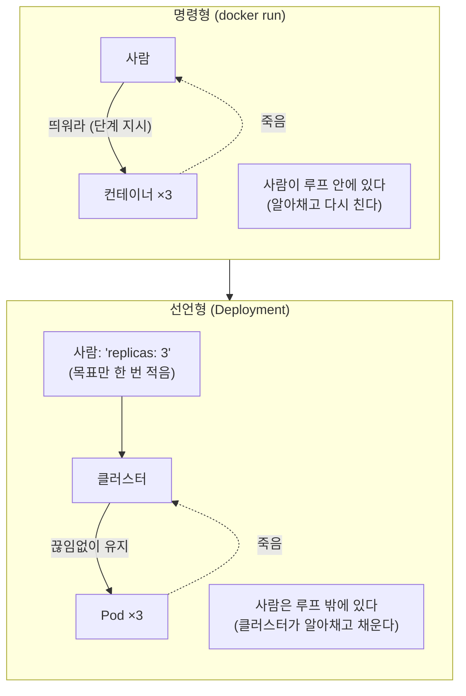
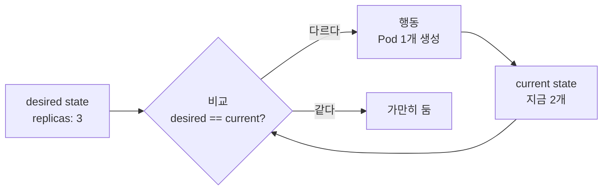
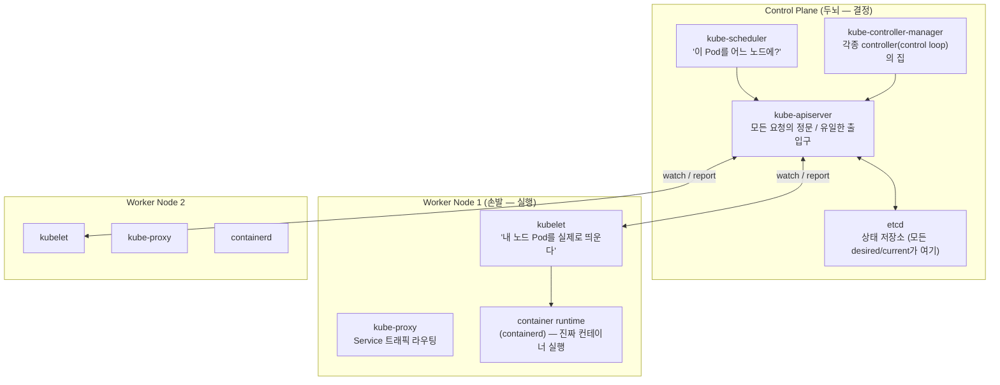
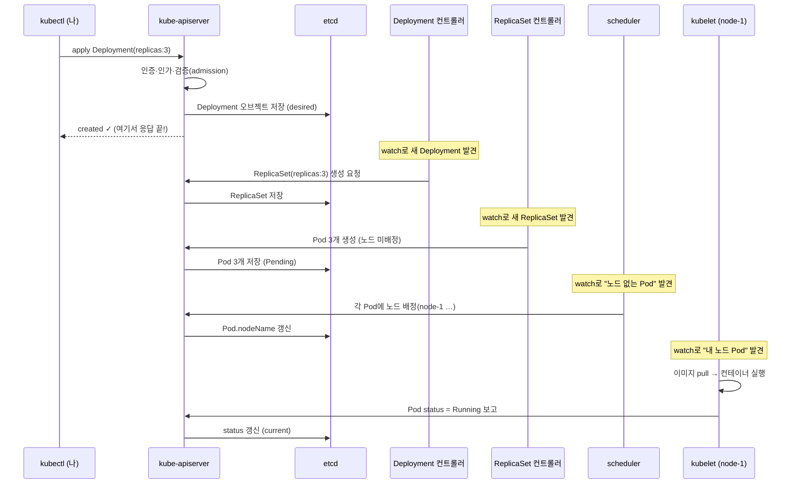
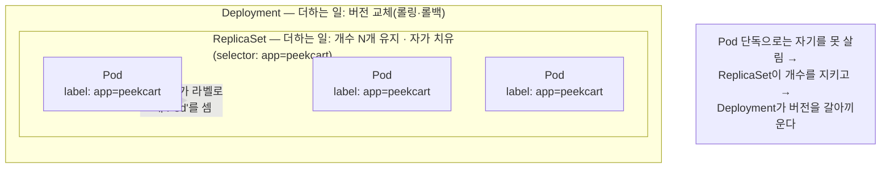
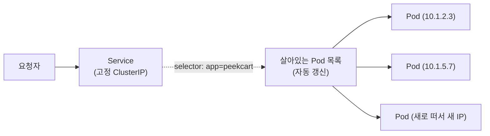
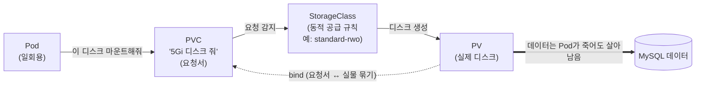

이 글에서 쓰는 용어는 다음 뜻으로 읽으면 된다.

| 용어 | 이 글에서의 의미 |
| --- | --- |
| desired state (원하는 상태) | 내가 YAML에 "이랬으면 좋겠다"고 적은 목표 상태. 오브젝트의 `spec` |
| current state (현재 상태) | 클러스터가 지금 실제로 그러한 상태. 오브젝트의 `status` |
| reconciliation (조정) | current를 desired에 *맞춰가는* 과정. 쿠버네티스의 심장 |
| control loop (제어 루프) | "현재를 보고 → 목표와 비교하고 → 차이를 줄이는 행동"을 끝없이 반복하는 루프 |
| controller (컨트롤러) | 특정 오브젝트 종류에 대해 control loop를 도는 프로그램. "Deployment 컨트롤러" 식 |
| control plane (제어 평면) | 클러스터의 두뇌. 결정을 내리는 컴포넌트 묶음(API server, etcd, scheduler, controller-manager) |
| node (노드) | 실제로 컨테이너가 도는 워커 머신(VM 또는 물리). Pod가 이 위에 올라간다 |
| kubelet | 각 노드에 상주하며 "내 노드에 배정된 Pod를 실제로 띄우는" 에이전트 |
| reconcile vs imperative | 선언형(원하는 상태를 적는다) vs 명령형(`docker run` 같은 단계별 지시) |
| object / resource | 쿠버네티스가 관리하는 한 덩어리(Pod, Deployment, Service…). etcd에 저장되는 레코드 |
| label / selector | 오브젝트에 붙이는 꼬리표(label)와, 그 꼬리표로 대상을 고르는 질의(selector) |

---

이 글에서 확인하고 싶은 질문은 다음과 같다.

1. "선언형(declarative)"은 정확히 어떤 메커니즘인가? `docker run`(명령형)과 무엇이 다른가?
2. `kubectl apply`를 누르면 Pod가 뜨기까지 *누가, 어떤 순서로* 움직이는가?
3. Deployment가 "Pod 개수를 유지"한다는데, 그 "유지"는 누가 어떻게 하는가?
4. Pod에 직접 IP가 있는데 왜 Service가 따로 필요한가?
5. 이 멘탈 모델이 잡히면, 14편의 base/overlays·probe·HPA가 왜 *그렇게* 생겼는지 다시 보이는가?

---

## 1. 출발점: 쿠버네티스는 결국 "원하는 상태를 지켜주는 기계"다

쿠버네티스를 한 문장으로 줄이면 이렇다. **"원하는 상태를 선언하면, 현재 상태를 거기에 끝없이 맞춰주는 시스템."** 나머지 컴포넌트는 전부 이 문장을 실현하는 부품이다.

이걸 `docker`와 대비하면 선명해진다. 컨테이너 하나를 띄울 때 Docker는 이렇게 시킨다.

```bash
docker run -d --name peekcart --restart=always -p 8080:8080 peekcart:latest
```

이건 **명령형(imperative)** 이다. "지금 이 컨테이너를 띄워라"는 *단계*를 내가 직접 내린다. 컨테이너가 죽으면 `--restart=always`가 *그 노드 안에서만* 되살린다. 그런데 노드(머신) 자체가 죽으면? 아무도 되살리지 않는다. "3개를 항상 유지"하고 싶으면 내가 3번 `docker run`을 치고 하나 죽을 때마다 내가 알아채고 다시 쳐야 한다. **"원하는 상태"를 지키는 책임이 사람에게 있다.**

이 차이를 한 그림으로 보면, 바뀌는 건 기능이 아니라 <strong>"유지 루프 안에 누가 들어가 있느냐"</strong>다.



쿠버네티스는 이걸 뒤집는다. 나는 *단계*가 아니라 *목표*를 적는다.

```yaml
apiVersion: apps/v1
kind: Deployment
metadata:
  name: peekcart
spec:
  replicas: 3            # ← "peekcart Pod가 항상 3개였으면 좋겠다"
  selector:
    matchLabels: { app: peekcart }
  template:
    metadata:
      labels: { app: peekcart }
    spec:
      containers:
        - name: peekcart
          image: peekcart:latest
```

여기 어디에도 "띄워라", "죽으면 살려라" 같은 *동사*가 없다. `replicas: 3`은 명령이 아니라 **사실에 대한 주장**이다. "이 클러스터에는 peekcart Pod가 3개 있는 상태가 맞다." 이게 desired state다. 그리고 쿠버네티스는 current state(지금 몇 개인가)를 이 주장에 *맞춘다*. 2개면 하나 더 만들고, 4개면 하나 죽이고, 노드가 통째로 죽어서 그 위 Pod가 사라지면 다른 노드에 다시 만든다.



이 루프가 <strong>reconciliation loop(조정 루프)</strong>다. "현재를 관찰 → 목표와 비교 → 차이를 줄이는 행동 → 다시 관찰"을 *끝없이* 돈다. 쿠버네티스의 거의 모든 동작은 이 루프의 인스턴스다. Deployment도, HPA도, 심지어 노드 상태 관리도 전부 "desired vs current를 좁히는 루프"다.

여기서 중요한 성질 하나. 이 루프는 **level-triggered**(상태 기반)이지 **edge-triggered**(이벤트 기반)가 아니다. "Pod가 죽었다는 *이벤트*에 반응"하는 게 아니라, "지금 개수가 목표와 다르다는 *상태*"를 보고 행동한다. 그래서 이벤트를 한 번 놓쳐도(알림이 유실돼도) 다음 루프에서 *현재 상태를 다시 보고* 교정한다. 명령형이라면 "죽었다"는 신호를 놓치는 순간 영영 못 살리지만, 선언형 + level-triggered는 신호를 놓쳐도 "지금 모자라네"를 다음 바퀴에 알아챈다. 자가 치유(self-healing)는 이 성질의 부산물인데, 그 정체는 3절 끝에서 더 또렷해진다.

> **이 글의 첫 번째 매듭**: 쿠버네티스가 해주는 일의 본질은 "컨테이너를 띄워주는 것"이 아니라 <strong>"내가 적은 목표 상태를 클러스터가 스스로 유지하게 만드는 것"</strong>이다. 컨테이너 실행은 그 목표를 이루는 *수단*일 뿐이다.

---

## 2. 클러스터 해부: 두뇌(control plane)와 손발(node)

그럼 그 reconciliation loop는 *어디서, 누가* 도는가? 클러스터를 열어보면 역할이 둘로 갈린다. <strong>결정하는 쪽(control plane)</strong>과 **실행하는 쪽(worker node)**.



**Control plane (결정)**

- **kube-apiserver**: 클러스터의 **유일한 정문**이다. `kubectl`, 컨트롤러, 노드의 kubelet *모두가* 상태를 읽고 쓸 때 반드시 apiserver를 거친다. 다른 컴포넌트끼리 직접 대화하지 않는다. 전부 apiserver를 *허브*로 통신한다. 그래서 apiserver는 인증(authn)·인가(authz)·검증(admission)이 걸리는 단일 관문이기도 하다.
- **etcd**: 분산 key-value 저장소. **클러스터의 모든 상태가 여기 산다**. 내가 적은 desired state(spec)도, 관찰된 current state(status)도. apiserver만 etcd에 접근한다. etcd가 곧 "클러스터의 진실(source of truth)"이다. 이게 날아가면 클러스터가 자기가 뭘 원했는지 잊는다.
- **kube-scheduler**: "아직 노드가 안 정해진 Pod"를 보고 <strong>"이 Pod를 어느 노드에 둘까"</strong>만 결정한다. CPU/메모리 요청량, 노드 여유, 제약(affinity 등)을 따져 노드를 고른 뒤, "이 Pod는 node-1에 배정"이라고 apiserver에 적는다. *띄우진 않는다.* 배정만 한다.
- **kube-controller-manager**: **수많은 controller(control loop)가 사는 집**이다. Deployment 컨트롤러, ReplicaSet 컨트롤러, Node 컨트롤러… 각자 자기 담당 오브젝트의 desired vs current를 좁히는 루프를 돈다. 1절의 그 루프들이 실제로 도는 곳이 여기다.

**Worker node (실행)**

- **kubelet**: 각 노드에 *상주*하는 에이전트. apiserver를 지켜보다(watch) <strong>"내 노드에 배정된 Pod"</strong>가 보이면, 컨테이너 런타임에게 "이 컨테이너 띄워"라고 시키고, 그 Pod의 실제 상태(살아있나, health 통과하나)를 *다시 apiserver에 보고*한다. desired("이 노드에 이 Pod")를 current(실제 실행)로 바꾸는 손이다.
- **container runtime (containerd 등)**: 진짜로 컨테이너를 실행하는 하위 엔진. 이미지를 pull하고 프로세스를 띄운다. kubelet이 시키고, 런타임이 한다.
- **kube-proxy**: Service로 들어온 트래픽을 살아있는 Pod로 흘려보내는 네트워크 규칙(iptables/IPVS)을 노드에 깐다.

핵심 관찰 하나 — **모두가 apiserver를 통해서만 대화한다.** scheduler가 kubelet에게 직접 "이거 띄워"라고 전화하지 않는다. scheduler는 apiserver(=etcd)에 "이 Pod는 node-1"이라고 *적기만* 하고, node-1의 kubelet이 apiserver를 *지켜보다* 그 글을 *발견*해서 행동한다. 컴포넌트들은 서로를 모른다. 그저 **"apiserver에 적힌 상태"를 보고 각자 자기 일을 할 뿐이다.** 이 느슨한 결합(상태 공유로만 협력)이 쿠버네티스가 부품 하나 죽어도 굴러가는 이유다.

---

## 3. `kubectl apply` 한 줄의 여정

이제 1절(reconciliation)과 2절(누가 있는가)을 합치면, 2절 첫머리의 질문에 답할 수 있다 — **"`apply`를 누르면 Pod가 뜨기까지 무슨 일이 일어나는가."** `replicas: 3` Deployment를 제출한다고 하자.



이 그림이 이 글의 중심이다. 풀어 읽으면:

1. **kubectl → apiserver**: 내 YAML이 apiserver로 간다. apiserver는 인증(누구냐)·인가(이걸 할 권한 있나)·검증(형식·정책 통과하나)을 거쳐 **etcd에 Deployment 오브젝트를 저장**한다. 그리고 곧바로 나에게 `created`를 응답한다 — **여기서 `kubectl` 명령은 끝난다.** Pod가 뜬 게 아니다! 단지 "이런 desired state를 원한다"는 *기록*이 etcd에 남았을 뿐이다. (그래서 `apply`가 성공해도 Pod가 안 뜰 수 있다. 이미지가 없거나 리소스가 부족하면 *그다음* 단계에서 막힌다.)
2. **Deployment 컨트롤러**: apiserver를 watch하다 새 Deployment를 발견한다. "Deployment가 있는데 그에 대응하는 ReplicaSet이 없네"(desired ≠ current) → **ReplicaSet을 만든다.** Deployment는 Pod를 직접 안 만든다. <em>버전 관리(롤링 업데이트·롤백)</em>를 담당하는 한 단계 위 추상이라, 실제 개수 유지는 ReplicaSet에 위임한다.
3. **ReplicaSet 컨트롤러**: 마찬가지로 watch하다 "replicas:3짜리 ReplicaSet인데 Pod가 0개"(desired ≠ current)를 본다 → **Pod 3개를 만든다.** 단, 이 Pod들은 아직 *어느 노드에 올릴지 안 정해진* `Pending` 상태다.
4. **scheduler**: "노드 미배정 Pod"를 watch하다 발견 → 각 Pod에 어울리는 노드를 골라 **배정만** 적는다(`Pod.nodeName = node-1`). 아직 컨테이너는 안 돈다.
5. **kubelet (node-1)**: 자기 노드에 배정된 Pod를 watch로 발견 → 컨테이너 런타임에 시켜 **이미지 pull → 컨테이너 실행** → "이 Pod 이제 Running"이라고 **apiserver에 보고**(current state 갱신).

여기서 2절의 "모두가 apiserver를 통해서만, 각자 watch로" 협력하는 그림이 그대로 보인다. **어떤 컴포넌트도 다음 컴포넌트를 직접 호출하지 않는다.** 각자 apiserver에 적힌 상태를 보고, 자기 담당의 "desired ≠ current"를 발견하면 한 걸음 줄이고, 그 결과를 다시 apiserver에 적는다. 그러면 *그게* 다음 컨트롤러에겐 새로운 desired가 된다. **연쇄적인 reconciliation의 릴레이**, 이게 선언형 시스템의 실제 작동 방식이다.

그래서 "Deployment가 Pod 개수를 유지한다"의 정확한 답은 이렇다. **유지하는 건 ReplicaSet 컨트롤러이고, 그게 가능한 이유는 그 컨트롤러가 control loop를 *끊임없이* 돌며 "지금 Pod가 3개 맞나?"를 계속 다시 확인하기 때문이다.** Pod 하나가 죽으면 죽었다는 *알림*에 반응하는 게 아니라 다음 루프에서 "어, 2개네, 목표는 3인데" 하고 하나를 더 만든다. 자가 치유는 마법이 아니라 그냥 **이 루프가 멈추지 않는다는 사실**이다.

---

## 4. 오브젝트 계층: 왜 Pod 위에 ReplicaSet, 그 위에 Deployment인가

3절에서 `Deployment → ReplicaSet → Pod`라는 층이 나왔다. 이 층이 왜 있는지 한 번 정리하면, 매니페스트를 볼 때 "이건 무슨 역할이지?"가 사라진다. 각 층은 *바로 아래 층이 못 하는 일 하나*를 더해준다.

| 층 | 책임 | 아래 층이 못 하는 것 |
| --- | --- | --- |
| **Pod** | 컨테이너 1개(+사이드카)를 담는 최소 실행 단위. IP·볼륨을 공유 | 자기 자신을 못 살린다. 죽으면 끝 |
| **ReplicaSet** | "이 Pod를 N개 유지" — 개수 보장, 자가 치유 | 무중단 업데이트를 못 한다 |
| **Deployment** | ReplicaSet을 *교체*하며 롤링 업데이트·롤백 | (앱 배포의 표준 단위) |

**Pod**는 최소 단위다. 컨테이너 하나(또는 같이 살아야 하는 사이드카 몇)를 담고, 그 안의 컨테이너들은 IP와 볼륨을 공유한다. 하지만 Pod는 *일회용*이다. 죽으면 스스로 못 일어난다. 그래서 Pod를 *직접* 만드는 일은 거의 없다.

**ReplicaSet**은 그 위에서 "이 모양의 Pod를 항상 N개"를 보장한다. 3절에서 본 그 개수 유지 루프의 주인이다. 자가 치유가 여기서 나온다. 그런데 ReplicaSet만으로는 *버전 교체*가 안 된다. 이미지를 `v1`에서 `v2`로 바꾸려면 기존 Pod를 다 죽이고 새로 만들어야 하는데, 그 과정을 *무중단으로* 조율할 주체가 없다.

**Deployment**가 그 조율을 한다. 새 버전을 배포하면 Deployment는 **새 ReplicaSet(v2)을 만들고, 옛 ReplicaSet(v1)을 점진적으로 줄이며** 트래픽이 끊기지 않게 갈아끼운다(롤링 업데이트). 문제가 생기면 옛 ReplicaSet으로 되돌린다(롤백). 그래서 **앱을 배포하는 표준 단위는 Pod도 ReplicaSet도 아닌 Deployment**다. 14편의 `deployment.yml`이 Deployment였던 이유가 이것이다.

세 층이 어떻게 포개지고, *무엇으로* 묶이는지 한 그림으로 보면 이렇다. 바깥 층은 안쪽 층이 못 하는 일을 하나씩 더하고, 안쪽 연결은 전부 **라벨**로 이뤄진다.



이 점선(라벨로 묶는 방식)이 바로 아래에서 이어 설명할 `selector`/`labels`의 정체다. 포인터가 아니라 *조건*으로 묶기 때문에, 둘이 어긋나면 ReplicaSet은 자기가 만든 Pod를 자기 것으로 못 알아본다.

이 세 층이 전부 같은 도구로 묶여 있다는 점을 놓치면 안 된다. **label과 selector**다. ReplicaSet은 "내 Pod"를 어떻게 알아볼까? Pod에 직접 포인터를 거는 게 아니라, **`selector: {app: peekcart}`로 *조건*을 걸고, 그 라벨을 단 Pod를 자기 것으로 센다.** 그래서 매니페스트에서 `spec.selector`와 `template.metadata.labels`가 *일치해야* 한다(안 맞으면 ReplicaSet이 자기가 만든 Pod를 자기 것으로 못 알아본다). 이 "라벨로 느슨하게 묶는" 방식이 다음 절 Service의 핵심이기도 하다.

---

## 5. Pod에 IP가 있는데 왜 Service가 필요한가

14편에서 Service를 "Pod 앞에 세운 고정 주소"라고 한 줄로 넘겼다. 이제 *왜* 그게 필요한지 정확히 말할 수 있다.

문제는 **Pod의 일회용성**이다. 4절에서 봤듯 Pod는 죽고 다시 태어난다(노드 장애, 롤링 업데이트, scale in/out). 그리고 **다시 태어난 Pod는 새 IP를 받는다.** 즉 Pod IP는 *언제든 바뀐다.* 그런데 다른 컴포넌트(또는 외부)가 이 Pod에 요청을 보내려면 주소가 있어야 한다. 매번 바뀌는 IP를 어떻게 추적하나? "지금 살아있는 peekcart Pod 3개의 IP는 10.1.2.3, 10.1.5.7, …"을 누가 관리하나?

**Service**가 그 문제를 푼다. Service를 만들면 <strong>절대 안 바뀌는 가상 IP 하나(ClusterIP)</strong>가 생긴다. 그리고 Service는 4절의 그 도구 <strong>(selector)</strong>로 "어떤 Pod들에게 트래픽을 보낼지"를 *조건*으로 정한다.

```yaml
apiVersion: v1
kind: Service
metadata:
  name: peekcart
spec:
  selector: { app: peekcart }   # ← 이 라벨 단 Pod들에게 보낸다
  ports:
    - port: 80
      targetPort: 8080
```

작동을 풀면:

1. Service는 `selector: {app: peekcart}`에 맞는 *살아있는* Pod들의 IP 목록을 **항상 최신으로 유지**한다(이 목록을 담는 오브젝트가 EndpointSlice다. 대규모 클러스터를 위해 목록을 여러 조각으로 나눠 담는다). Pod가 죽고 새로 뜨면 이 목록이 자동 갱신된다. 이것도 reconciliation loop다.
2. 각 노드의 **kube-proxy**(2절)가 이 목록을 받아, "Service IP로 오는 트래픽을 살아있는 Pod 중 하나로 보내라"는 네트워크 규칙(iptables/IPVS)을 노드에 깐다.
3. 그래서 누가 `peekcart` Service IP로 요청을 보내면, 그 뒤에 Pod가 몇 개든·IP가 어떻게 바뀌든 *상관없이* 살아있는 Pod 하나로 분배된다.



즉 Service가 주는 건 두 가지다. **(1) 변하지 않는 주소**(Pod IP 변동을 흡수)와 **(2) 부하 분산**(여러 Pod로 분배). "Pod에 IP가 있는데 왜?"의 답은 <strong>"Pod IP는 못 믿을 주소이기 때문"</strong>이다. Service는 *못 믿을 주소들 앞에 세운 믿을 수 있는 주소 하나*다.

여기에 **DNS** 한 겹이 더 얹힌다. ClusterIP도 숫자라 외우기 어려우니, 쿠버네티스는 Service에 이름을 준다. 클러스터 안에서는 그냥 `peekcart`(또는 `peekcart.<namespace>.svc.cluster.local`)라는 *이름*으로 부르면 CoreDNS가 ClusterIP로 풀어준다. PeekCart 앱이 설정(`application-k8s.yml`)에서 DB를 `jdbc:mysql://mysql:3306/...`으로, 즉 IP가 아니라 `mysql`이라는 *이름*으로 부를 수 있는 게 이 덕분이다. `mysql`이라는 Service 이름(`k8s/base/infra/mysql/mysql.yml`)이 곧 안정적인 주소다.

그리고 14편의 `ClusterIP / NodePort / LoadBalancer`가 여기서 정리된다. 셋은 <strong>"이 안정적인 주소를 <em>어디까지</em> 노출하나"</strong>의 차이다.

| 타입 | 닿는 범위 | 14편에서 |
| --- | --- | --- |
| **ClusterIP** | 클러스터 *내부*에서만 | base 기본값 (가장 보수적) |
| **NodePort** | 노드의 포트를 열어 *외부*에서 | minikube (`minikube service`로 접속) |
| **LoadBalancer** | 클라우드 LB를 붙여 외부에 | GKE (Internal LB) |

base를 ClusterIP로 두고 overlay가 NodePort/LoadBalancer로 덮은 건, <strong>"내부 연결이라는 공통 동작은 base, 외부 노출 범위라는 환경 차이는 overlay"</strong>라는 14편의 판단 그대로다. 이제 그게 *왜* 환경 차이인지 보인다. 노출 범위는 환경(로컬이냐 클라우드냐)에 따라 달라지지만, "Service가 Pod 앞 안정 주소"라는 본질은 어디서나 같으니까.

---

## 6. 한 조각 더: 상태는 어디에 남기나 (PV / PVC / StorageClass)

Pod가 일회용이라는 성질은 **데이터에도** 똑같이 적용된다. Pod 안에 쓴 파일은 Pod가 죽으면 같이 사라진다. MySQL 데이터처럼 *살아남아야* 하는 건 Pod 바깥의 디스크에 둬야 한다. 이 분리를 세 오브젝트가 맡는다.

- **PV (PersistentVolume)**: 실제 디스크 한 장. "이 클러스터에 쓸 수 있는 5Gi짜리 볼륨이 있다"는 *공급* 쪽 표현.
- **PVC (PersistentVolumeClaim)**: "나 5Gi짜리 디스크 한 장 필요해"라는 *요청서*. Pod는 PV를 직접 안 잡고 PVC로 요청한다.
- **StorageClass**: "PVC가 들어오면 *그때* 알아서 PV를 만들어주는" 자동 공급 규칙. 클라우드(GKE)에선 PVC만 내면 StorageClass가 디스크를 동적으로 만들어 붙여준다.



이것도 결국 reconciliation이다. PVC(desired: "디스크 줘")가 들어오면, StorageClass가 PV(current: 실제 디스크)를 만들어 둘을 묶는다(bind). 14편에서 gke overlay가 PVC에 `standard-rwo` StorageClass를 박은 게 이 동적 공급을 쓰겠다는 선언이었다. minikube는 자체 기본 StorageClass가 있어 명시가 필요 없었고, 또 한 번 "공통 동작 vs 환경 차이"의 갈림이다.

---

## 7. 한계 — 이 글이 일부러 다루지 않은 것

이 글은 "YAML → Pod"의 *세로 경로*(제출에서 실행까지)만 따라갔다. 쿠버네티스의 넓이를 생각하면 의도적으로 비운 칸이 많다. 멘탈 모델이 흐려질까 봐 미룬 것이지, 안 중요해서가 아니다.

- **Ingress / 게이트웨이**: 5절은 L4(IP:포트) 수준의 노출까지만 갔다. "경로(`/api/...`)나 호스트명으로 라우팅"하는 L7은 Ingress·Gateway API의 영역이고, Phase 4에서 API Gateway를 다룰 때 비로소 필요해진다.
- **RBAC / 보안 경계**: 2절에서 apiserver가 "인증·인가의 단일 관문"이라고만 했다. *누가 무엇을 할 수 있는가*(RBAC, ServiceAccount)는 통째로 비웠다.
- **StatefulSet / DaemonSet / Job**: 4절은 Deployment(무상태 앱)만 다뤘다. DB처럼 *정체성과 순서가 있는* 워크로드(StatefulSet)는 규칙이 다르다.
- **CRD / Operator의 깊이**: 14편에서 ServiceMonitor가 CRD라고 했지만, "어떻게 컨트롤러를 *직접 짜서* 새 reconciliation loop를 추가하는가"(Operator 패턴)는 이 글 밖이다. 다만 1·3절의 멘탈 모델이 잡혔다면 Operator는 "내가 만든 오브젝트에 대해 내가 control loop를 하나 더 다는 것"으로 곧장 읽힌다.
- **스케줄링·네트워킹의 내부**: scheduler가 노드를 *어떤 점수로* 고르는지, CNI 플러그인이 Pod 네트워크를 *어떻게* 까는지는 한 단계 더 들어가야 한다.

즉 이 글은 **"쿠버네티스의 작동 원리(reconciliation)"라는 한 축**만 세웠다. 그 축이 서면 위 항목들은 "이 축의 어디에 붙는 가지인가"로 읽히기 시작한다. 그게 이 글의 목적이었다.

---

## 8. 다시 14편으로 — 멘탈 모델이 서고 나면 보이는 것

이 글을 쓴 계기는 14편을 쓰다 느낀 공백이었다. 모델이 선 지금 14편을 되짚으면, 그때 *외워서* 적었던 것들이 *이유로* 보인다.

- **"선언형이라 base/overlays로 *겹쳐 쓴다*"** — Kustomize가 가능한 건 쿠버네티스가 선언형이라서다. 최종 YAML(desired state)을 *어떻게 조립하든* 클러스터는 "그 목표"에 맞출 뿐이라, base에 공통을 두고 overlay로 차이를 덮어 *합성된 목표 하나*를 만드는 게 성립한다. 명령형이었다면 "단계의 순서"를 겹쳐 쓸 수 없었다.
- **probe 세 개(startup/readiness/liveness)** — 전부 reconciliation의 입력이다. liveness 실패 → "이 Pod의 current가 desired에 못 미침" → 재시작. 단 이 재시작은 controller-manager의 컨트롤러가 아니라 **kubelet이 자기 노드에서 같은 모양의 루프(관찰→비교→행동)를 돌며** 한다 — reconciliation은 control plane의 전유물이 아니라 손발(kubelet)에도 같은 형태로 산다. readiness 실패 → 5절의 "살아있는 Pod 목록"에서 빠짐(트래픽 차단). probe는 *루프에게 current state를 알려주는 센서*다.
- **HPA 1→3** — HPA 자체가 하나의 reconciliation loop다. desired를 *고정 숫자*가 아니라 "CPU 60%를 유지하는 replica 수"로 잡고, current(실측 CPU)와 비교해 Deployment의 `replicas`를 *조정*한다. 3절의 릴레이에 한 칸이 더 붙는 셈이다. HPA가 `replicas`를 고치면, 그게 Deployment→ReplicaSet→Pod 릴레이를 다시 흐른다.
- **`apply -k overlays/gke/` 단독 실행이 실패하던 일** — 3절을 보면 당연하다. `apply`는 etcd에 desired를 *적는* 게 목표인데, ServiceMonitor라는 *종류*를 apiserver가 모르면(CRD 미설치) 그 종류에 대응하는 엔드포인트 자체가 없어 **etcd에 적기도 전에 정문(apiserver)에서 거부된다**(`no matches for kind "ServiceMonitor"`). "self-contained지만 무의존은 아니다"가 reconciliation 경로상 어디서 막히는지로 설명된다.

14편은 "매니페스트를 어떻게 나누는가"였고, 이 글은 "나뉜 매니페스트가 던져진 뒤 무슨 일이 일어나는가"였다. 둘을 합쳐야 비로소 "내가 `k8s/`에서 한 일"의 절반이 아니라 전부가 보인다.

---

## 자료는 어떤 질문에 연결해서 읽을까

| 질문 | 같이 읽을 자료 | 이 글에서 연결되는 지점 |
| --- | --- | --- |
| 선언형 API와 control loop의 원리 | Kubernetes 공식 문서, *Concepts / Controllers* | 1절 reconciliation, 3절 릴레이 |
| 클러스터 컴포넌트가 각각 무엇을 하나 | Kubernetes 공식 문서, *Cluster Architecture / Components* | 2절 control plane vs node |
| `apply` 이후 오브젝트가 생성되는 경로 | Kubernetes 공식 문서, *Objects / Object Management* | 3절 sequence diagram |
| Deployment·ReplicaSet·Pod의 관계 | Kubernetes 공식 문서, *Workloads / Deployments* | 4절 오브젝트 계층 |
| Service·EndpointSlice·kube-proxy·DNS | Kubernetes 공식 문서, *Services, Load Balancing, and Networking* | 5절 Service |
| PV/PVC/StorageClass 동적 공급 | Kubernetes 공식 문서, *Storage / Persistent Volumes* | 6절 상태 저장 |
| 이 개념들이 PeekCart에서 어떻게 조직됐나 | 본 연재 14편 (Kustomize base/overlays) | 8절 14편 재독 |
