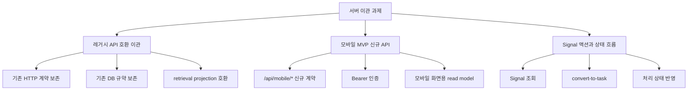
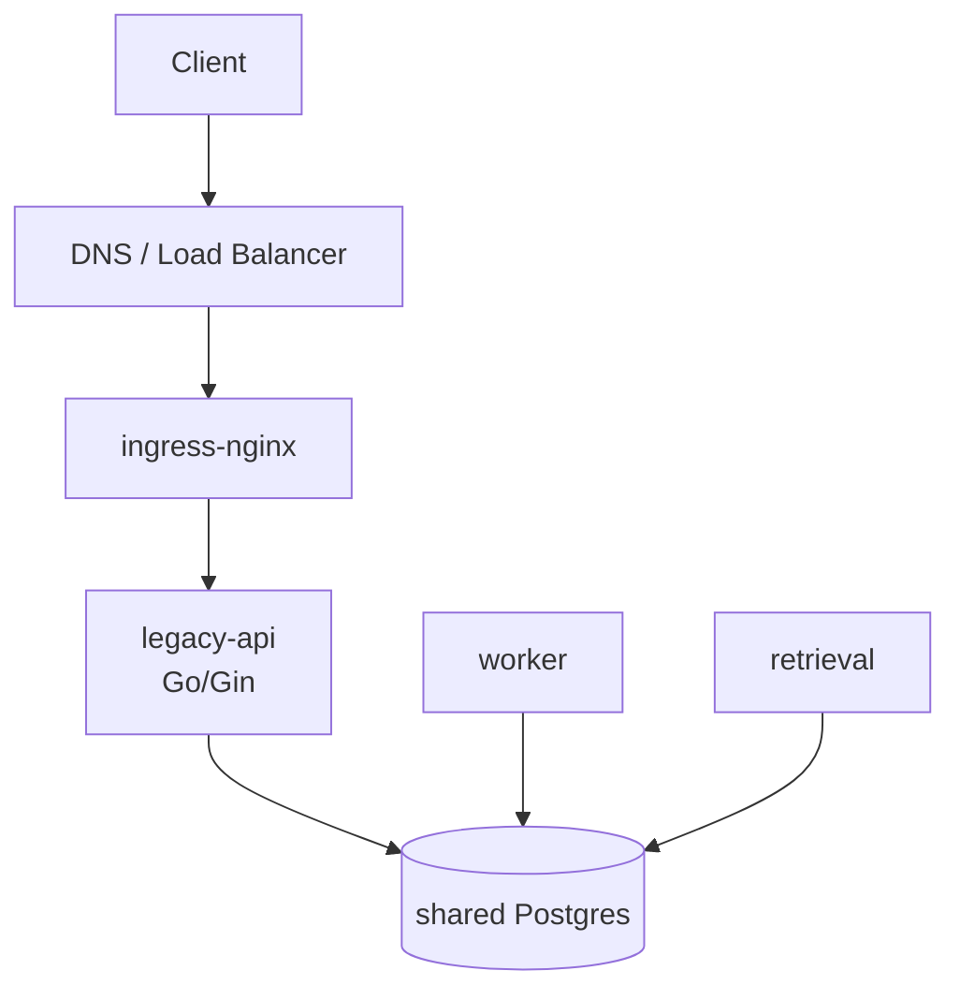
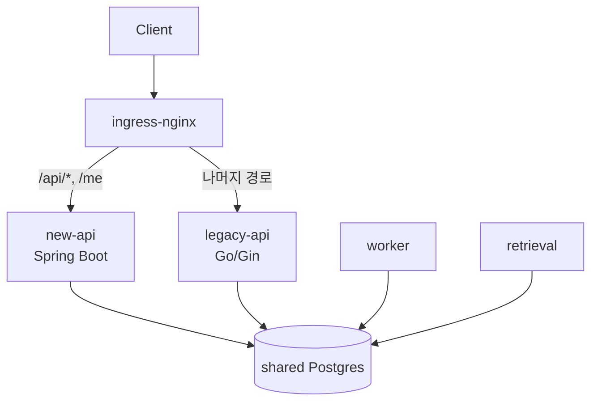
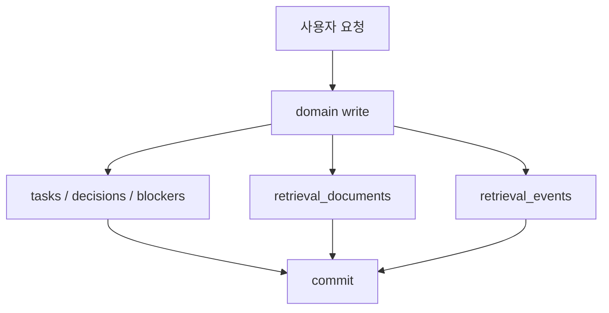

이 글은 Go/Gin으로 작성된 기존 제품 API 서버를 Java Spring Boot 서버로 이관하려고 하면서, 처음에 내가 어떤 생각을 했고, 어디서 계획이 틀렸다고 느꼈고, 왜 결국 빅뱅 방식이 아니라 무화과나무 패턴으로 방향을 바꾸게 됐는지 정리한 회고다.

이번에 프로젝트를 하면서 초기엔 단순하게 생각했다. 기존 서버를 분석하고, 새 Spring Boot 서버에 도메인과 API를 옮기고, 어느 시점에 한 번에 갈아끼우면 된다고 봤다. 새 서버의 구조도 더 명확했고, Java/Spring 쪽에서 장기적으로 가져가고 싶은 아키텍처도 있었다. 그래서 "이왕 옮기는 김에 제대로 옮기자"는 생각이 강했다.

그런데 계획을 세우다보니 현실적으로 어려운 부분이 보이기 시작했다.

레거시에는 HTTP 매핑이 76개, 비즈니스 API가 약 69개 있었다. Go 코드는 전체 2만 LOC가 넘었고, 프로덕션 코드만 1.4만 LOC 이상이었다. DB migration도 15개 이상, 테이블도 20개 이상이었다. 여기에 모바일 MVP를 위한 신규 API도 병행해야 했다.

그때부터 질문이 바뀌었다.

> 어떻게 전부 옮길까?

가 아니라,

> 무엇부터 옮겨야 팀 일정과 운영 리스크를 동시에 감당할 수 있을까?

가 됐다.

---

## 용어

| 용어 | 이 글에서의 의미 |
| --- | --- |
| 레거시 API | 기존 Go/Gin 기반 제품 API 서버 |
| 신규 서버 | 새 Java Spring Boot 기반 제품 API 서버 |
| 빅뱅 이관 | 새 서버를 거의 완성한 뒤 한 번에 운영 트래픽을 전환하는 방식 |
| 무화과나무 패턴 | 레거시 앞의 라우팅 계층을 이용해 기능 단위로 새 시스템으로 점진 전환하는 방식. Strangler Fig Pattern |
| path-based routing | `/api/*`, `/me` 같은 경로 단위로 어느 백엔드가 요청을 처리할지 결정하는 라우팅 |
| 공유 DB | 레거시 API, worker, retrieval, 신규 서버가 같은 운영 Postgres를 바라보는 구조 |
| 슬라이스 | 한 번에 이관하고 검증하고 롤백할 수 있는 기능 단위 |
| 컷오버 | 운영 트래픽을 기존 서버에서 새 서버로 넘기는 전환 |
| conformer | 운영 DB 스키마를 새 서버가 만들거나 바꾸지 않고, 기존 스키마에 매핑만 맞춰 동작하는 형태 |

---

## 이번 글의 질문

이 글에서 복기하고 싶은 질문은 다섯 가지다.

1. 처음에는 왜 빅뱅 이관이 가능하다고 생각했나?
2. 어떤 숫자와 제약을 보고 그 계획이 위험하다고 판단했나?
3. 왜 무화과나무 패턴이 이 상황에서 싸게 먹히는 선택이었나?
4. 기능을 어떤 순서로 옮기기로 했고, 그 기준은 무엇이었나?
5. 당시에는 보지 못했지만, 지금 돌아보면 고려할 수 있었던 선택지는 무엇이었나?

---

## 처음에 생각한 정석

처음 머릿속에 있던 이관 순서는 비교적 정석에 가까웠다.

```text
1. 레거시 시스템 분석
2. 목표 도메인 모델링
3. 상태와 라이프사이클 재설계
4. API 계약 설계
5. 데이터 마이그레이션 설계
6. 레거시 코드를 새 서버로 이관
7. 관측과 검증
8. 신규 모바일 기능 구현
```

이 흐름은 틀린 흐름은 아니다. 오히려 시간이 충분하고, 제품 요구사항이 안정적이고, 기존 운영 트래픽 전환을 한 번에 감당할 수 있다면 가장 깔끔한 접근일 수 있다.

문제는 지금 상황이 그렇지 않았다는 점이다.

새 서버는 단순한 포팅 대상이 아니었다. 장기적으로는 하나의 배포 가능한 Spring Boot 애플리케이션 안에서 모듈 경계를 명확히 두는 구조를 지향했다. 기능/도메인 단위 Gradle 모듈, Spring Modulith 검증, JPA/Flyway 기반의 스키마 관리, 표준 API 에러 규격 같은 것들이 있었다. 즉 Go 코드를 Java로 줄 단위 번역하는 일이 아니라, 새 서버의 규칙 안에서 레거시 동작을 보존해야 했다.

그래서 코드량도 단순히 1:1로 옮겨지지 않을 가능성이 컸다. 오히려 DTO, entity, repository, service, controller, test, OpenAPI 문서화까지 생각하면 Java 쪽 코드량은 레거시보다 더 늘어날 수 있었다.

처음 계획은 이 지점을 과소평가했다.

---

## 숫자를 세어 보니 계획이 달라졌다

레거시를 훑어보며 대략적인 볼륨을 세어 보니 다음과 같았다.

| 항목 | 규모 |
| --- | --- |
| HTTP 매핑 | 76개 |
| 비즈니스 API | 약 69개 |
| Go 전체 코드 | 20,000 LOC 이상 |
| Go 프로덕션 코드 | 14,000 LOC 이상 |
| DB migration | 15개 이상 |
| SQL | 600 LOC 이상 |
| 테이블 | 20개 이상 |
| 모바일 MVP 신규 API | 10개 이상 |

단순히 레거시 전체 이관만 있었다면 어떻게든 밀어붙일 수 있었을지도 모른다. 반대로 모바일 신규 API만 있었다면 그것도 감당 가능했을 수 있다. 문제는 둘이 동시에 있었다는 것이다.

모바일 팀은 일정에 맞춰 API 계약이 필요했고, 서버는 기존 웹 API도 언젠가 새 서버로 옮겨야 했다. 게다가 모바일 MVP의 핵심에는 기존 웹 API를 그대로 노출하는 것만으로 해결되지 않는 Signal 흐름이 있었다. Signal은 단순 조회가 아니라, 사용자가 신호를 보고 태스크로 전환하거나 의사결정으로 기록하는 액션까지 포함했다.

즉 해야 할 일은 세 갈래였다.



이걸 모두 완성한 뒤 한 번에 컷오버한다는 건, 일정 리스크와 운영 리스크를 한 지점에 몰아넣는 일이었다.

여기서 빅뱅 방식의 문제가 분명해졌다.

| 방식    | 좋아 보였던 점               | 실제 문제                |
| ----- | ---------------------- | -------------------- |
| 빅뱅 이관 | 종착 구조가 깔끔하다            | 완성 전까지 운영 가치가 없다     |
| 빅뱅 이관 | 한 번에 레거시를 제거할 수 있다     | 컷오버 시점에 장애 리스크가 집중된다 |
| 빅뱅 이관 | 새 서버 구조를 일관되게 설계할 수 있다 | 모바일 일정과 병행하기 어렵다     |
| 빅뱅 이관 | 중간 공존 상태가 짧다           | 롤백이 크고 무겁다           |

계획을 바꿔야 했다.

---

## 운영 구조를 다시 보니 다른 길이 있었다

처음에는 이관을 "코드 저장소 안에서"만 생각했다. 레거시 Go 코드를 새 Java 코드로 옮기는 문제로 본 것이다.

그런데 운영 구조를 같이 보니 다른 선택지가 보였다.

기존 시스템은 이미 Kubernetes 클러스터 위에서 동작하고 있었다. 외부 요청은 DNS와 LoadBalancer를 거쳐 ingress-nginx로 들어오고, 그 뒤에서 기존 API 서버가 요청을 처리했다. 내부에는 worker와 retrieval 서버도 있었고, 이들은 같은 운영 DB를 공유하고 있었다.

구조를 단순화하면 이랬다.



이 구조에서 중요한 점은 두 가지였다.

첫째, 이미 앞단에 라우팅 계층이 있었다. 즉 특정 path를 기존 서버가 아니라 새 서버로 보낼 수 있었다.

둘째, 운영 DB가 공유되어 있었다. 새 서버가 같은 DB를 바라볼 수 있다면, 데이터 전체를 새 DB로 옮기거나 CDC를 붙이는 작업 없이도 레거시와 새 서버가 공존할 수 있었다.

이 두 조건이 합쳐지면 무화과나무 패턴이 현실적인 선택지가 된다.



이제 이관은 "전체 서버를 한 번에 바꾸는 일"이 아니라 "경로를 하나씩 새 서버로 넘기는 일"이 된다.

슬라이스를 옮기고, 라우팅을 바꾸고, 문제가 있으면 path 규칙을 되돌린다. 이것이 빅뱅과 가장 크게 다른 점이었다.

---

## 왜 canary가 아니라 path-based였나

처음에는 Kubernetes에서 점진 전환이라고 하면 canary를 떠올리기 쉽다. 예를 들어 같은 요청 중 10%만 새 서버로 보내고, 괜찮으면 50%, 100%로 올리는 방식이다.

그런데 이 상황에서는 canary가 핵심 도구가 되기 어려웠다.

canary는 같은 path에 대해 두 서버가 완전히 같은 동작을 해야 유효하다. 같은 요청이 어떤 사용자에게는 레거시로 가고, 어떤 사용자에게는 새 서버로 갔을 때 응답 계약과 부작용이 같아야 한다.

하지만 우리는 기능을 한 조각씩 새 서버로 옮기려는 상황이었다. 어떤 path는 새 서버가 소유하고, 어떤 path는 아직 레거시가 소유한다. 이런 상황에서는 비율 기반 분산보다 경로 기반 전환이 더 안전하다.

| 라우팅 방식 | 적합한 상황 | 이관에서의 판단 |
| --- | --- | --- |
| canary | 같은 기능을 두 구현이 거의 동일하게 제공할 때 | like-for-like 교체 검증에는 유용 |
| path-based | 특정 기능 또는 path의 소유권을 넘길 때 | 이번 이관의 기본 방식 |

그래서 당시 결론은 명확했다.

> 기본 축은 path-based routing으로 둔다. canary는 같은 계약을 보존하는 일부 슬라이스에서 보조 안전장치로만 쓴다.

---

## 계약 전략: 전부 새 계약으로 바꿀 수도 없고, 전부 호환으로 둘 수도 없었다

다음 고민은 API 계약이었다.

새 서버는 `/api` prefix, Standard 에러 응답, access/refresh token 모델 같은 새 규칙을 갖고 있었다. 반면 레거시 API는 unprefixed path, `{ "error": "..." }` 형태의 에러, 쿠키 기반 세션 등 기존 웹 클라이언트가 기대하는 계약을 갖고 있었다.

선택지는 세 가지였다.

| 선택지       | 장점                                     | 단점                        |
| --------- | -------------------------------------- | ------------------------- |
| 신규 계약 중심  | 종착 구조가 깔끔하다                            | FE 변경이 매 슬라이스에 따라붙는다      |
| 레거시 호환 중심 | FE 수정 없이 라우팅만 바꿀 수 있다                  | 레거시 계약과 부채를 새 서버가 계속 승계한다 |
| 하이브리드     | read 경로는 조용히 옮기고, 신규 surface는 새 계약을 쓴다 | 전환기 동안 두 응답 모드가 공존한다      |

당시 선택은 하이브리드였다.

기존 웹 API를 이관하는 경우에는 HTTP status와 body shape를 최대한 보존한다. 그래야 path만 바꿔도 기존 클라이언트가 계속 동작한다. 반면 모바일처럼 새로 만드는 surface는 `/api/mobile/*`와 Standard 에러 응답을 사용한다.

이 결정은 깔끔함보다 이관 가능성을 우선한 결정이었다. 모든 것을 새 계약으로 밀어붙이면 기술적으로는 보기 좋지만, 프론트엔드 일정과 강하게 결합된다. 반대로 모든 것을 레거시 호환으로만 두면 새 서버의 종착 구조가 흐려진다.

그래서 둘을 섞었다.

```text
기존 웹 API 이관       → legacy-compatible 계약 보존
모바일 신규 API        → /api 기반 Standard 계약
인증처럼 이미 갈라진 영역 → 신규 계약 우선
```

이때 배운 점은, 마이그레이션에서 "일관성"이 항상 같은 모양을 뜻하지는 않는다는 것이다. 오히려 어떤 경로는 호환성을 우선하고, 어떤 경로는 새 계약을 우선한다고 명시하는 편이 더 일관된 전략이었다.

---

## 스키마 소유권: 공유 DB는 장점이면서 동시에 함정이었다

공유 DB는 무화과나무 패턴을 싸게 만들어 준 핵심 조건이었다. 새 서버가 기존 DB를 직접 읽을 수 있으니 대규모 데이터 이관이 필요 없었다.

하지만 공유 DB는 곧 스키마 소유권 문제를 만든다.

운영 DB에는 이미 레거시 migration이 적용되어 있다. 새 서버가 Flyway로 같은 테이블을 다시 만들려고 하면 충돌한다. 그렇다고 새 서버가 운영 스키마를 즉시 인수하면, 레거시와 worker가 기대하는 스키마 변경 흐름이 깨질 수 있다.

선택지는 세 가지였다.

| 선택지 | 장점 | 단점 |
| --- | --- | --- |
| 레거시가 운영 스키마 단일 소유 | 전환기 충돌이 가장 적다 | 새 서버는 운영에서 migration을 직접 못 한다 |
| 새 서버가 baseline으로 스키마 인수 | 종착 구조에 빨리 가까워진다 | 이미 적용된 레거시 migration과 충돌 관리가 어렵다 |
| 별도 DB + 동기화 | 소유권이 명확하다 | CDC/동기화 비용이 커지고 이번 규모에 과하다 |

당시 결론은 레거시가 운영 스키마를 계속 소유하는 것이었다.

신규 서버는 운영에서 Flyway를 끄고, Hibernate `ddl-auto=validate`로 기존 스키마에 매핑이 맞는지만 검증한다. 즉 운영에서는 schema owner가 아니라 conformer로 동작한다.

```text
운영 환경
  legacy-api  → schema owner
  new-api     → Flyway off + ddl-auto validate

로컬/테스트 환경
  new-api     → Flyway owner
```

진짜 신규 테이블이 필요하면 새 서버가 운영에서 직접 만들지 않고, 작은 레거시 migration PR로 먼저 추가한다. 새 서버가 DB 소유권을 완전히 가져오는 것은 레거시 폐기 시점으로 미룬다.

이 결정은 다소 불편했다. 새 서버 관점에서는 자기 migration을 운영에 적용하지 못하니 답답하다. 하지만 전환기에는 "누가 스키마를 소유하는가"가 명확한 것이 더 중요했다.

---

## 인증: 두 서버가 같은 사용자를 알아봐야 했다

다음 문제는 인증이었다.

path-based routing을 쓰면 어떤 요청은 새 서버로 가고, 어떤 요청은 레거시 서버로 간다. 그러면 사용자는 하나의 로그인 상태로 두 서버의 보호 API를 모두 호출할 수 있어야 한다.

다행히 당시 확인한 레거시 JWT 구조는 새 서버와 맞출 수 있는 형태였다. 둘 다 HS256 기반이고, subject에 userId가 들어가는 구조였다. 결정적인 차이는 토큰 검증 자체보다 "토큰을 어디서 읽느냐"였다.

레거시는 특정 세션 쿠키만 읽고 있었고, 새 서버는 Bearer header와 access/refresh 모델을 사용하려 했다.

선택지는 세 가지였다.

| 선택지                               | 장점            | 단점                  |
| --------------------------------- | ------------- | ------------------- |
| 레거시 미들웨어가 Bearer/access 쿠키도 읽게 한다 | 변경이 작다        | 레거시에 전환기 패치가 필요하다   |
| 새 서버를 facade로 두고 레거시에 신뢰 헤더 전달    | 구조적으로 정석에 가깝다 | 새 서버가 프록시 책임까지 떠안는다 |
| 두 세션 시스템을 병존한다                    | 각자 독립적이다      | 사용자 경험과 운영 복잡도가 커진다 |

당시 선택은 레거시 미들웨어를 작게 패치하는 것이었다.

검증 로직을 새로 만들 필요는 없었다. 같은 secret을 쓰고, 같은 방식으로 subject를 읽으면 된다. 레거시가 Bearer header 또는 새 access 쿠키를 읽을 수만 있으면 전환기 인증은 훨씬 단순해진다.

이 결정도 "새 서버를 순수하게 유지한다"보다 "전환 비용을 줄인다"에 가까웠다. 마이그레이션에서는 종종 새 코드보다 레거시의 작은 패치가 전체 위험을 더 크게 낮춘다.

---

## 슬라이스 경계는 파일도 도메인도 아니라 트랜잭션이었다

가장 중요했던 기준은 슬라이스 경계였다.

처음에는 레거시 패키지 기준으로 옮기면 된다고 생각하기 쉽다. `project`, `task`, `decision`, `memory` 같은 패키지를 하나씩 새 서버로 옮기는 식이다.

하지만 실제 코드를 보면 더 중요한 경계가 있었다.

레거시의 일부 write는 도메인 데이터와 retrieval projection을 같은 트랜잭션에 썼다. 예를 들어 task나 decision을 만들 때, 단순히 `tasks` 테이블만 쓰는 것이 아니라 검색 read model을 위한 `retrieval_documents`와 `retrieval_events`도 함께 기록했다.

이 경우 도메인 write만 새 서버로 옮기고 projection은 레거시에 남기는 식의 분리는 위험하다. 단일 DB 트랜잭션 안에서 함께 커밋되던 것을 두 서버에 나누면 부분 실패가 생길 수 있기 때문이다.

그래서 당시 세운 원칙은 이랬다.

> 레거시에서 한 트랜잭션에 묶여 있던 것은 같은 슬라이스에서 함께 옮긴다.

이 원칙 때문에 슬라이스는 생각보다 커졌다. 특히 project/task/decision/blocker는 단순 CRUD 묶음이 아니라 retrieval projection과도 연결되어 있었다.



이 그림에서 `tasks`만 떼어 새 서버로 옮기는 것은 쉬워 보이지만, 실제 안전한 단위는 commit 경계 전체였다.

---

## 모바일 우선 전략: 전체 이관보다 필요한 최소 기반

그렇다면 무엇부터 옮길 것인가.

당시에는 모바일 MVP 일정이 가장 강한 제약이었다. 그래서 "레거시 전체 이관 후 모바일"이 아니라 "모바일에 필요한 최소 이관 후 모바일 구현"으로 순서를 바꿨다.

```text
Phase 0 — 운영 리허설
Phase A — 모바일 최소 이관
Phase B — 모바일 구현 지원과 계약 안정화
Phase C — 레거시 전체 이관
Phase D — 레거시 폐기와 DB 소유권 인수
```

Phase 0은 새 도메인 코드를 많이 쓰는 단계가 아니었다. 이미 옮겨진 인증/사용자 흐름을 이용해 새 서버 배포, 공유 DB 연결, 인증 호환, ingress path split, 롤백 절차를 먼저 검증하는 운영 리허설에 가까웠다.

이게 중요했다. 도메인 코드가 복잡해진 뒤에 배포와 라우팅 문제를 처음 만나면 원인 분리가 어렵다. 반대로 기능이 단순할 때 운영 하니스를 먼저 검증하면, 이후 슬라이스 이관의 위험이 줄어든다.

Phase A는 모바일 MVP에 필요한 read model과 write action만 먼저 제공하는 단계였다. 모바일이 읽기만 하는 화면은 공유 DB를 직접 읽어 합성하고, 사용자가 실제로 확정하는 액션만 새 서버가 소유한다.

이렇게 생각하면 "전체 이관"이 아니라 "모바일이 지금 필요로 하는 서버 능력"이 우선순위가 된다.

---

## 당시 가장 어려웠던 선택: 모바일 write를 어디서 처리할 것인가

모바일에서 가장 중요한 액션은 Signal을 보고 task로 전환하는 흐름이었다. 여기서 선택지가 갈렸다.

### 선택지 A: 새 서버가 직접 처리한다

새 서버가 task 생성, Signal 처리 상태 반영, retrieval projection까지 소유한다.

장점은 원자성이다. 사용자가 Signal을 task로 전환했는데 task만 생기고 Signal 상태가 안 바뀌거나, 상태만 바뀌고 검색 projection이 빠지는 상황을 줄일 수 있다. 모바일 계약도 새 서버 기준으로 깔끔하게 가져갈 수 있다.

단점은 구현량이다. 레거시 projection 규약을 정확히 재현해야 한다. source reference, retrieval document, event 발행 순서, 결정적 ID, tokenizer까지 맞춰야 한다.

### 선택지 B: write는 레거시로 보낸다

모바일 API는 새 서버가 제공하되, 실제 task 생성은 레거시 API를 호출하거나 레거시 path로 라우팅한다.

장점은 Phase A가 작아진다는 것이다. 이미 동작하는 레거시 write를 재사용하니 모바일을 더 빨리 붙일 수 있다.

단점은 Signal action이 두 스택에 걸쳐 비원자적이 된다는 것이다. 예를 들어 task 생성은 레거시에서 성공했지만 새 서버의 Signal 상태 반영이 실패할 수 있다. 또한 신규 모바일이 다시 레거시 계약에 묶인다.

당시 결론은 A에 가까웠다.

> 모바일의 핵심 액션이 부분 실패할 수 있는 구조는 받아들이기 어렵다.

일정만 보면 B가 매력적이었다. 하지만 모바일 MVP의 핵심 경험이 Signal을 action으로 닫는 것이라면, 그 action의 정합성이 흔들리는 것은 위험하다고 봤다.

그래서 당시에는 새 서버가 모바일 write와 그에 필요한 projection까지 함께 가져오는 쪽으로 판단했다.

---

## 그때 생각하지 못한 선택지: outbox로 원자성의 범위를 다시 정의하기

지금 돌아보면, 위 선택지는 너무 "레거시의 원자성 모양"에 묶여 있었다.

당시에는 레거시가 domain write와 retrieval projection을 같은 트랜잭션에 썼기 때문에, 새 서버도 같은 모양을 재현해야 안전하다고 생각했다. 즉 원자성을 이렇게 봤다.

```text
task 생성 + signal 상태 + retrieval_documents + retrieval_events
```

하지만 다른 선택지도 있었다.

api-server가 사용자 관점의 확정 결과만 원자적으로 쓰고, projection은 outbox 이벤트를 통해 worker가 처리하게 하는 방식이다.

```text
api-server transaction:
  task 생성 + signal 처리 기록 + outbox event

worker:
  outbox event 소비 + retrieval projection write
```

이렇게 보면 원자성의 범위가 바뀐다.

사용자 요청에 대해 반드시 함께 커밋되어야 하는 것은 task 생성, Signal 처리 기록, 후속 처리 이벤트다. 반면 검색 read model 반영은 결과적 일관성으로 둘 수 있다. worker가 outbox를 소비해 projection을 쓰고, retrieval은 기존처럼 events를 polling한다.

이 선택지는 당시에는 충분히 크게 보지 못했다.

물론 이것도 공짜는 아니다. outbox 테이블, worker 소비자, 멱등키, 재시도, DLQ, payload 계약 같은 것들이 필요하다. 특히 worker/retrieval 담당자와의 계약이 필요하다. 하지만 장기적으로는 책임 경계가 더 자연스러울 수 있다.

| 관점            | 당시 생각                            | 나중에 볼 수 있는 대안                  |
| ------------- | -------------------------------- | ------------------------------ |
| 원자성           | domain write와 projection까지 같은 tx | 사용자 확정 결과와 outbox까지 같은 tx      |
| projection 소유 | 새 서버가 레거시 projection 재현          | worker가 outbox 소비 후 projection |
| 장점            | 레거시 동작과 유사                       | 책임 경계가 더 명확                    |
| 단점            | 새 서버가 retrieval 세부를 많이 안다        | worker 소비자와 재시도 설계 필요          |

이 회고에서 가장 크게 배운 지점이 이것이다.

레거시가 어떤 방식으로 원자성을 보장했다고 해서, 새 구조도 반드시 같은 범위로 원자성을 가져가야 하는 것은 아니다. 중요한 것은 "사용자에게 어떤 일관성을 보장해야 하는가"이고, 그 경계를 다시 정의할 수 있다.

---

## 또 다른 놓친 선택지들

outbox 외에도 당시 더 명시적으로 검토했으면 좋았을 선택지가 있었다.

### 1. Backend-for-Frontend를 임시로 두는 선택

모바일 MVP만을 위해 얇은 BFF를 두고, 내부적으로는 레거시와 새 서버를 조합하는 방식이다.

장점은 모바일 계약을 빠르게 안정화할 수 있다는 것이다. 모바일은 BFF만 보고, BFF 뒤에서 레거시와 새 서버를 섞어 호출한다.

하지만 단점도 크다. BFF가 임시라면 결국 나중에 다시 제거해야 하고, 임시 계층이 비즈니스 로직을 흡수하면 또 하나의 레거시가 된다. 당시 일정에서는 매력적이지만, 장기적으로는 조심해야 할 선택이었다.

### 2. API Gateway나 facade를 먼저 세우는 선택

새 서버를 앞단 facade로 두고, 아직 이관되지 않은 요청은 내부적으로 레거시로 프록시하는 방식도 가능했다.

이 방식은 클라이언트 관점에서 진입점을 더 빨리 통일할 수 있다. 인증과 공통 응답 처리도 새 서버 쪽으로 모을 수 있다.

하지만 새 서버가 너무 일찍 프록시 책임을 떠안는다. 아직 도메인 이관도 끝나지 않았는데, 라우터이자 API 서버이자 호환 계층이 된다. 당시에는 ingress가 이미 존재했기 때문에, 애플리케이션 facade보다 ingress path split이 더 단순했다.

### 3. 읽기 전용 read model부터 더 과감하게 여는 선택

모바일의 상당 부분은 조회 화면이다. 그렇다면 write action을 뒤로 미루고, 공유 DB를 읽는 모바일 read API부터 빠르게 열 수도 있었다.

이 선택은 모바일 화면 개발을 앞당기는 데 유리하다. 하지만 MVP의 핵심이 Signal을 보고 action으로 닫는 경험이라면, read만 먼저 여는 것은 제품 흐름의 절반만 제공한다.

그래도 지금 돌아보면 read API와 write action을 더 명확히 분리해서 일정 리스크를 낮추는 계획은 더 일찍 세울 수 있었을 것 같다.

---

## 이 결정의 핵심은 "마이그레이션 단위"를 바꾼 것이다

처음에는 이관 단위를 코드로 봤다.

```text
Go package → Java module
handler → controller
service → service
repository → repository
```

하지만 실제로 중요한 단위는 달랐다.

```text
라우팅 단위
트랜잭션 단위
롤백 단위
클라이언트 계약 단위
팀 일정 단위
```

무화과나무 패턴으로 바꾼 것은 단순히 배포 전략을 바꾼 게 아니었다. 이관의 단위를 다시 정의한 것이다.

빅뱅 방식에서는 성공 조건이 "새 서버가 전체 레거시를 대체한다"가 된다. 반면 path-based strangler에서는 성공 조건이 더 작아진다.

```text
이 path를 새 서버가 처리한다.
기존 클라이언트 계약이 깨지지 않는다.
공유 DB 규약을 깨지 않는다.
문제가 있으면 path 규칙을 되돌릴 수 있다.
```

이 작은 성공 조건이 중요했다. 일정에 쫓길수록 성공 조건은 작고 검증 가능해야 한다.

---

## 당시 결론

당시 내가 내린 결론은 다음과 같았다.

1. 빅뱅 이관은 일정과 운영 리스크가 한 지점에 몰리므로 기각한다.
2. 기존 Kubernetes ingress를 이용해 path-based strangler 방식으로 점진 이관한다.
3. 공유 운영 DB를 사용하되, 전환기 스키마 소유권은 레거시가 유지한다.
4. 신규 서버는 운영에서 Flyway를 끄고 schema validate만 수행하는 conformer로 둔다.
5. 기존 웹 API는 legacy-compatible 계약을 우선 보존하고, 모바일 신규 API는 `/api` 기반 Standard 계약을 사용한다.
6. auth/user처럼 이미 옮겨진 작은 영역으로 배포·라우팅·인증·롤백 하니스를 먼저 검증한다.
7. 모바일 MVP에 필요한 최소 read/write 슬라이스를 먼저 이관하고, 레거시 전체 이관은 뒤로 둔다.
8. 슬라이스 경계는 파일이나 패키지가 아니라 트랜잭션과 롤백 가능성을 기준으로 잡는다.

이 결론은 완벽한 설계라기보다, 당시 제약에서 가장 덜 위험한 실행 계획이었다.

---

## 회고: 무엇을 배웠나

### 1. 마이그레이션은 코드 변환이 아니라 리스크 이동이다

처음에는 Go 코드를 Java 코드로 옮기는 문제로 봤다. 하지만 실제 문제는 리스크가 어디에 모이는가였다.

빅뱅은 리스크를 컷오버 하루에 몰아넣는다. 무화과나무 패턴은 그 리스크를 path 단위로 쪼갠다. 같은 작업량이라도 실패하는 단위가 작아지면 운영 리스크는 크게 달라진다.

### 2. 기존 운영 구조는 제약이 아니라 자산일 수 있다

이미 떠 있는 Kubernetes 클러스터, ingress-nginx, 공유 DB는 처음에는 단순한 현재 상태로 보였다. 하지만 다시 보니 점진 이관을 가능하게 하는 자산이었다.

새로운 마이그레이션 도구를 도입하지 않아도, 이미 있는 라우팅 계층과 DB 구조만으로 충분히 다른 전략을 만들 수 있었다.

### 3. 공유 DB는 데이터 이관을 없애지만 소유권 문제를 만든다

공유 DB 덕분에 CDC나 대규모 데이터 복사가 필요 없어졌다. 하지만 대신 "누가 스키마를 바꾸는가", "두 writer가 같은 테이블을 건드려도 되는가", "projection 이벤트를 누가 발행하는가" 같은 질문이 생겼다.

즉 공유 DB는 비용을 없애는 것이 아니라 비용의 종류를 바꾼다.

### 4. 레거시의 원자성을 그대로 복제하는 것이 항상 정답은 아니다

당시에는 레거시가 domain write와 retrieval projection을 같은 트랜잭션에 넣었기 때문에 새 서버도 그래야 한다고 봤다.

지금은 이 판단을 더 조심스럽게 본다. 사용자의 확정 액션과 outbox 이벤트를 원자적으로 쓰고, projection은 worker가 결과적 일관성으로 처리하는 경계도 가능했다. 이건 당시 충분히 검토하지 못한 선택지였다.

원자성은 기술 구현의 모양이 아니라 제품이 필요로 하는 보장 범위에서 다시 정의해야 한다.

### 5. 일정이 빡빡할수록 "작은 완료"가 중요하다

빅뱅 계획에서는 완료가 너무 멀리 있었다. 모든 도메인, 모든 API, 모든 검증이 끝나야 가치가 생긴다.

무화과나무 패턴에서는 완료가 작아진다. 인증 path 하나, `/api` namespace 하나, 모바일 read API 하나씩 완료할 수 있다. 작게 완료할 수 있어야 팀이 병렬로 움직일 수 있다.

---

## 한계

이 회고는 당시 의사결정 과정을 복기한 글이다. 그래서 지금의 최종 설계와 일부 차이가 있을 수 있다.

특히 projection 소유권에 대해서는 당시에는 새 서버가 레거시 projection을 직접 재현하는 방향으로 생각했지만, 이후에는 outbox를 통해 worker가 projection을 처리하는 방향도 더 강하게 검토할 수 있다. 이 차이는 "당시 판단이 틀렸다"라기보다, 설계를 더 파고들며 원자성의 범위를 다시 정의하게 된 과정에 가깝다.

또한 이 글에서는 실제 서비스명, 도메인명, 인프라 제공자명은 공개하지 않았다. 대신 구조와 판단 기준만 남겼다.
