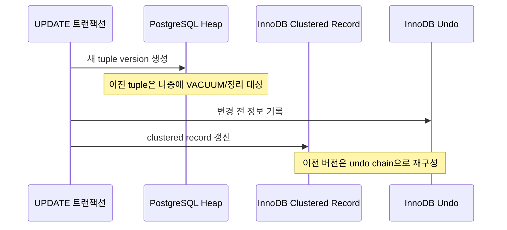

백엔드 면접에서 "MySQL과 PostgreSQL의 차이를 설명해보라"는 질문은 거의 고정 레퍼토리다. 그런데 막상 답하려고 하면 "PostgreSQL은 pgvector 같은 확장이 강하다", "엔터프라이즈 환경에 유리하다" 정도에서 멈추기 쉽다.

진짜 변별력은 그다음이다. MVCC를 어떻게 다르게 구현했는지, 그 구현 차이가 VACUUM이나 undo log 같은 운영 이슈로 어떻게 이어지는지, 그리고 워크로드와 팀의 운영 경험에 따라 선택이 어떻게 달라지는지까지 설명할 수 있어야 한다.

이 글에서 쓰는 용어는 다음 뜻으로 읽으면 된다.

| 용어 | 이 글에서의 의미 |
| --- | --- |
| MVCC | Multi-Version Concurrency Control. 같은 row의 여러 버전을 이용해 읽기와 쓰기의 충돌을 줄이는 동시성 제어 방식 |
| Undo Log | InnoDB가 변경 이전 값을 보관하는 로그. 이전 버전 조회와 롤백에 쓰인다 |
| Dead Tuple | PostgreSQL에서 UPDATE/DELETE 후 더 이상 어떤 트랜잭션에도 보이지 않는 row 버전 |
| VACUUM / autovacuum | dead tuple이 차지하던 공간을 재사용 가능하게 만들고, visibility map과 통계 일부를 관리하며, XID wraparound를 막는 PostgreSQL의 유지보수 작업. autovacuum은 VACUUM과 ANALYZE를 자동 실행한다 |
| Transaction ID Wraparound | PostgreSQL의 32비트 트랜잭션 ID 공간이 순환하면서 오래된 데이터의 가시성을 잘못 판단할 수 있는 위험 |
| Gap Lock / Next-Key Lock | InnoDB가 인덱스 레코드 사이 간격에 거는 락과, 레코드 락에 갭 락을 결합한 락 |
| Clustered Index | 인덱스의 리프 페이지에 row 데이터가 함께 저장되는 구조. InnoDB에서는 PK가 클러스터드 인덱스가 된다 |
| WAL | 변경된 데이터 페이지보다 로그를 먼저 영속화하는 Write-Ahead Log. PostgreSQL 복구와 물리 복제의 기반 |
| SSI | Serializable Snapshot Isolation. PostgreSQL이 SERIALIZABLE에서 직렬화 이상을 탐지하는 방식 |
| Table Bloat | 회수하거나 재사용하지 못한 공간이 누적되어 테이블·인덱스가 실제 유효 데이터보다 비대해진 상태 |

---

## 1. 아키텍처: 플러거블 스토리지 엔진과 통합형 구조

### MySQL: 스토리지 엔진 플러그인 구조

MySQL은 SQL 파서·옵티마이저 계층과 데이터 저장 계층인 스토리지 엔진이 분리되어 있다. 테이블마다 InnoDB, MyISAM, MEMORY 같은 엔진을 선택할 수 있다. 현재 일반적인 트랜잭션 워크로드의 기본값이자 사실상 표준은 **InnoDB**이므로, 이 글의 MySQL 비교도 InnoDB를 기준으로 한다.

### PostgreSQL: 기본 heap 엔진과 확장 중심 구조

PostgreSQL은 MySQL처럼 여러 범용 스토리지 엔진을 테이블마다 골라 쓰는 생태계가 중심은 아니다. 기본 heap table access method와 인덱스 access method가 코어에 긴밀히 통합되어 있다. 최신 PostgreSQL에는 table access method 확장 지점도 있지만, 실무에서 "PostgreSQL 엔진"이라고 하면 대개 기본 heap 구조를 뜻한다.

대신 PostgreSQL은 Extension과 사용자 정의 타입·연산자·인덱스 접근 방법을 통한 확장성이 강하다. PostGIS, pgvector, TimescaleDB 같은 기능은 이 확장 모델을 활용한다.

---

## 2. MVCC 구현 차이

같은 목표, 즉 읽기와 쓰기의 충돌을 줄이기 위해 여러 row 버전을 유지하지만, 두 DB는 이전 버전을 두는 위치와 정리 방식이 다르다.



### PostgreSQL의 MVCC

- UPDATE는 새로운 tuple version을 만들고 이전 tuple을 더 이상 최신 버전이 아니도록 표시한다.
- 오래된 버전의 공간은 다른 트랜잭션에서 더 이상 볼 수 없게 된 뒤 VACUUM이 재사용 가능하게 만든다.
- 인덱스 대상 컬럼이 바뀌지 않고 같은 페이지에 여유 공간이 있으면 HOT(Heap-Only Tuple) update로 인덱스 갱신 비용을 줄일 수 있다.
- 일반 `VACUUM`은 공간을 내부에서 재사용하게 하지만, 대개 파일 크기를 운영체제에 즉시 반환하지는 않는다. 파일 자체를 압축하려면 `VACUUM FULL`이나 테이블 재작성 계열 작업이 필요하고 더 강한 락과 추가 공간을 고려해야 한다.
- PostgreSQL은 undo chain으로 row의 이전 값을 되돌리는 대신 트랜잭션의 commit/abort 상태로 가시성을 판정한다. 그래서 큰 트랜잭션의 abort 과정이 InnoDB의 물리적 undo보다 유리할 수 있지만, 생성된 dead tuple의 후속 정리 비용까지 사라지는 것은 아니다.

PostgreSQL의 XID는 32비트 공간을 순환한다. 단순히 "40억 건을 넘는 순간 장애가 난다"기보다, 현재 XID와 약 21억 이상 떨어진 오래된 XID는 미래 값과 구분할 수 없기 때문에 VACUUM의 freeze가 필요하다고 이해하는 편이 정확하다. autovacuum에는 wraparound 방지용 강제 동작도 있지만, 오래 열린 트랜잭션이나 잘못된 운영으로 정리가 막히면 쓰기 작업을 중단시키는 보호 상태에 들어갈 수 있다.

### MySQL(InnoDB)의 MVCC

- clustered index record에는 최신 값과 트랜잭션 정보가 있고, consistent read에 필요한 이전 값은 undo log를 따라 재구성한다.
- UPDATE의 이전 값과 롤백에 필요한 정보는 undo tablespace의 rollback segment에 저장된다.
- 오래 열린 consistent read가 과거 버전을 필요로 하면 purge가 해당 undo 정보를 제거할 수 없어 history list와 undo 공간이 커질 수 있다.
- 대형 트랜잭션 롤백은 undo 작업을 실제로 적용해야 하므로 오래 걸릴 수 있다.
- "InnoDB 테이블에는 항상 최신 row만 있어 bloat가 없다"는 표현은 지나친 단순화다. DELETE는 먼저 delete-mark되고, 보조 인덱스 변경도 이전 레코드를 delete-mark한 뒤 purge한다. purge가 밀리면 InnoDB도 테이블과 인덱스가 커지고 성능이 저하될 수 있다.

두 방식의 공통 원리는 같다. 읽기가 쓰기를 막지 않도록 여러 버전을 유지한다. 차이는 이전 버전을 PostgreSQL은 heap의 tuple로, InnoDB는 주로 undo 정보로 관리한다는 점이다. 이 차이가 VACUUM과 purge, bloat와 undo history, 롤백 비용이라는 서로 다른 운영 포인트로 이어진다.

---

## 3. 트랜잭션 격리 수준과 락

두 DB 모두 SQL 표준의 네 격리 수준 이름을 받지만 실제 보장은 완전히 같지 않다. PostgreSQL의 `READ UNCOMMITTED`는 별도의 더 약한 동작이 아니라 `READ COMMITTED`처럼 처리된다.

| 항목 | MySQL InnoDB | PostgreSQL |
| --- | --- | --- |
| 기본 격리 수준 | REPEATABLE READ | READ COMMITTED |
| 일반 SELECT의 반복 읽기 | transaction snapshot 기반 consistent read | transaction snapshot 기반 |
| REPEATABLE READ의 phantom | consistent read는 같은 snapshot을 보며, 잠금 읽기·DML은 범위에 next-key lock을 사용할 수 있음 | 같은 snapshot을 보므로 phantom read는 발생하지 않지만 serialization anomaly는 가능 |
| 범위 잠금 | 인덱스 탐색 조건에 따라 gap/next-key lock 사용 | REPEATABLE READ에 InnoDB식 gap lock은 없음 |
| SERIALIZABLE | 일반 SELECT도 조건에 따라 공유 잠금 읽기로 강화 | SSI가 위험한 read/write dependency를 탐지하고 한 트랜잭션을 serialization failure로 중단 |

InnoDB의 next-key lock은 인덱스 레코드 락과 그 앞의 gap lock을 결합한다. 예를 들어 `SELECT ... FOR UPDATE`로 인덱스 범위를 읽으면 그 범위에 새 레코드가 삽입되는 것을 막을 수 있다. 다만 "REPEATABLE READ의 모든 SELECT가 gap lock을 건다"는 뜻은 아니다. 일반 consistent read는 잠금 없이 snapshot을 읽는다.

PostgreSQL도 row lock, table lock, SSI의 predicate lock 등 여러 락을 사용한다. 따라서 "PostgreSQL은 대상 row에만 락을 걸어 항상 경합이 좁다"는 식의 일반화는 피해야 한다. 핵심 차이는 PostgreSQL의 REPEATABLE READ가 InnoDB식 gap lock 대신 snapshot isolation으로 안정된 읽기 view를 제공한다는 점이다.

---

## 4. 인덱스 구조

### MySQL InnoDB

- PK가 클러스터드 인덱스이며 리프 페이지에 row 데이터가 함께 저장된다.
- 보조 인덱스의 리프에는 PK가 들어가므로, 필요한 컬럼이 보조 인덱스만으로 충족되지 않으면 PK를 통한 추가 lookup이 발생한다.
- PK가 모든 보조 인덱스에 포함되므로 지나치게 큰 PK는 저장 공간과 캐시 효율에도 영향을 준다.
- 단조 증가하는 좁은 PK는 쓰기 위치의 지역성이 좋다. 완전 랜덤 UUID는 페이지 분할과 캐시 효율 저하를 일으킬 수 있지만, UUIDv7 같은 시간 순서형 식별자는 이 단점을 완화한다.

### PostgreSQL

- 기본 구조는 heap table과 별도 인덱스다.
- 인덱스 엔트리는 heap tuple의 물리 위치인 TID를 가리킨다.
- `CLUSTER`로 한 시점의 물리 순서를 인덱스에 맞출 수 있지만 이후 변경에도 자동 유지되지는 않는다.
- B-tree, Hash, GiST, SP-GiST, GIN, BRIN 등 다양한 인덱스 접근 방법을 지원한다. GIN은 JSONB·배열·전문 검색에, BRIN은 물리적 순서와 값의 상관관계가 높은 매우 큰 테이블에 특히 유용하다.

---

## 5. 복제와 수평 확장

| 항목 | MySQL | PostgreSQL |
| --- | --- | --- |
| 기본 복제 기반 | binary log 기반 비동기 복제, semi-synchronous replication 지원 | WAL 기반 물리 streaming replication, 동기/비동기 지원 |
| 세밀한 논리 복제 | row-based binary log와 생태계 도구 활용 | 내장 publish/subscribe logical replication은 PostgreSQL 10부터 제공 |
| 고가용성 | InnoDB Cluster, Group Replication, Orchestrator 등 선택지 | Patroni, repmgr, 클라우드 관리형 서비스 등 선택지 |
| 샤딩 | Vitess 등 생태계 활용 | Citus 등 확장 활용 |

둘 다 단일 노드의 코어 기능만으로 모든 멀티 리전·멀티 라이터 요구를 해결하지는 않는다. 복제 지연 허용치, 장애 조치 방식, 일관성 요구, 운영 자동화 도구를 함께 보고 선택해야 한다.

---

## 6. 기능과 SQL

### PostgreSQL이 강한 영역

- JSONB, 배열, range type, 사용자 정의 타입처럼 풍부한 데이터 모델링 기능
- Partial Index, Expression Index
- GiST, GIN, BRIN과 Extension을 결합한 확장성
- 복잡한 실행계획을 분석할 수 있는 `EXPLAIN` 옵션과 풍부한 통계

```sql
-- ON_SALE 상태인 row만 포함하는 PostgreSQL partial index
CREATE INDEX idx_products_on_sale
    ON products (category_id)
    WHERE status = 'ON_SALE';

EXPLAIN (ANALYZE, BUFFERS)
SELECT *
FROM products
WHERE category_id = 3
  AND status = 'ON_SALE';
```

버퍼 hit/read 정보까지 보려면 단순 `EXPLAIN ANALYZE`가 아니라 위처럼 `BUFFERS` 옵션을 지정해야 한다.

### MySQL이 강한 영역

- 대규모 웹 서비스에서 축적된 운영 사례와 넓은 도구 생태계
- InnoDB Cluster, Group Replication, read replica 등 검증된 고가용성·확장 선택지
- PK lookup 중심 워크로드에서 클러스터드 인덱스가 주는 좋은 지역성
- `INSERT ... ON DUPLICATE KEY UPDATE` 같은 익숙한 upsert 문법

과거에는 Window Function과 CTE 지원 시점도 차이였지만 MySQL 8.0부터 둘 다 지원한다. 최신 버전을 비교할 때는 "PostgreSQL만 복잡한 SQL을 지원한다"기보다 옵티마이저 특성, 인덱스 선택지, 데이터 타입과 실제 쿼리 계획을 비교해야 한다.

---

## 7. 언제 무엇을 고를까

### MySQL을 우선 검토할 상황

- 팀이 InnoDB 복제, 장애 조치, 성능 튜닝 경험을 이미 갖고 있다.
- PK lookup과 단순한 OLTP 패턴이 중심이다.
- Vitess나 MySQL 호환 관리형 서비스처럼 채택하려는 인프라가 명확하다.

### PostgreSQL을 우선 검토할 상황

- JSONB, 배열, range, partial index, GIN/GiST/BRIN 같은 기능이 실제 요구사항에 잘 맞는다.
- PostGIS, pgvector 같은 Extension이 제품의 핵심 기능과 연결된다.
- 복잡한 질의와 데이터 무결성 규칙을 DB에서 적극적으로 표현하려 한다.

### 선택할 때 함께 봐야 할 운영 비용

- PostgreSQL은 UPDATE/DELETE가 많은 테이블의 autovacuum 설정, long-running transaction, bloat를 관찰해야 한다.
- InnoDB는 undo history와 purge lag, 대형 트랜잭션 롤백, gap lock이 포함된 deadlock을 관찰해야 한다.
- PostgreSQL은 연결마다 backend process를 사용하고 MySQL은 일반적으로 연결마다 thread를 사용하지만, 애플리케이션 connection pool은 양쪽 모두 중요하다. PgBouncer는 연결 수가 많거나 연결 churn이 큰 PostgreSQL 환경에서 유용하지만 모든 규모에서 무조건 필수인 것은 아니다.

정리하면, **운영 경험과 PK 중심 OLTP 생태계를 우선한다면 MySQL**, **풍부한 타입·인덱스·Extension과 복잡한 데이터 처리가 중요하다면 PostgreSQL**이 자연스러운 출발점이다. 하지만 최종 선택은 제품의 쿼리 패턴, 일관성 요구, 장애 복구 목표, 팀의 숙련도를 실제로 측정해 내려야 한다.

---

## 8. 추가 면접 질문

| 질문 | 핵심 답변 포인트 |
| --- | --- |
| InnoDB buffer pool과 PostgreSQL `shared_buffers`의 차이는? | 둘 다 페이지 캐시지만 InnoDB는 자체 buffer pool의 역할이 크고, PostgreSQL은 `shared_buffers`와 운영체제 page cache를 함께 활용하는 구조를 전제로 튜닝한다 |
| PostgreSQL이 프로세스 기반이고 MySQL이 주로 스레드 기반이면 어떤 차이가 생기는가? | 연결당 메모리, 연결 생성 비용, context switching, pooler 구성과 관측 방식에 영향을 준다 |
| 카디널리티가 낮은 컬럼에 단독 B-tree 인덱스를 걸면 왜 효과가 작을 수 있는가? | 많은 row를 다시 읽어야 해 순차 스캔이 더 저렴할 수 있고, 쓰기 시 인덱스 유지 비용은 계속 발생한다 |
| Deadlock은 어떻게 처리해야 하는가? | 두 DB 모두 순환 대기를 감지해 한 트랜잭션을 중단할 수 있으므로, 애플리케이션은 재시도 정책과 일관된 lock 획득 순서를 갖춰야 한다 |
| Read Replica의 replication lag은 어떤 문제를 만드는가? | 쓰기 직후 replica에서 이전 값을 읽는 read-your-writes 위반이 생길 수 있어 primary routing, session stickiness, LSN/GTID 기반 대기 같은 전략이 필요하다 |

---

## 관련 자료

- [PostgreSQL: Transaction Isolation](https://www.postgresql.org/docs/current/transaction-iso.html)
- [PostgreSQL: Routine Vacuuming](https://www.postgresql.org/docs/current/routine-vacuuming.html)
- [PostgreSQL: Heap-Only Tuples](https://www.postgresql.org/docs/current/storage-hot.html)
- [PostgreSQL 10 Release Notes: built-in logical replication](https://www.postgresql.org/docs/release/10.0/)
- [MySQL 8.4: InnoDB Multi-Versioning](https://dev.mysql.com/doc/refman/8.4/en/innodb-multi-versioning.html)
- [MySQL 8.4: Undo Logs](https://dev.mysql.com/doc/refman/8.4/en/innodb-undo-logs.html)
- [MySQL 8.4: InnoDB Locking](https://dev.mysql.com/doc/refman/8.4/en/innodb-locking.html)
- [MySQL 8.4: Phantom Rows and Next-Key Locking](https://dev.mysql.com/doc/refman/8.4/en/innodb-next-key-locking.html)
