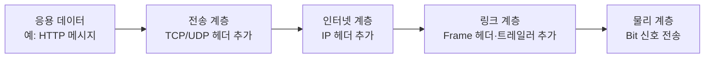
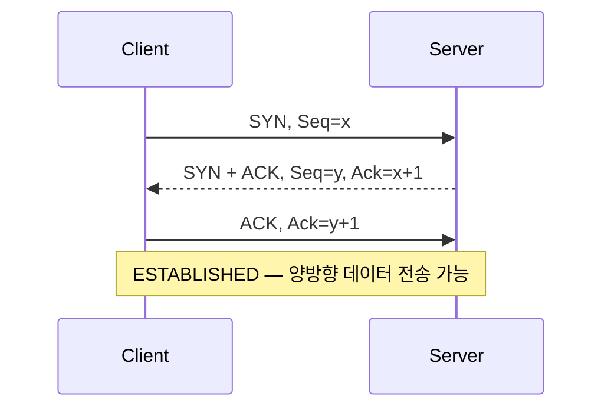
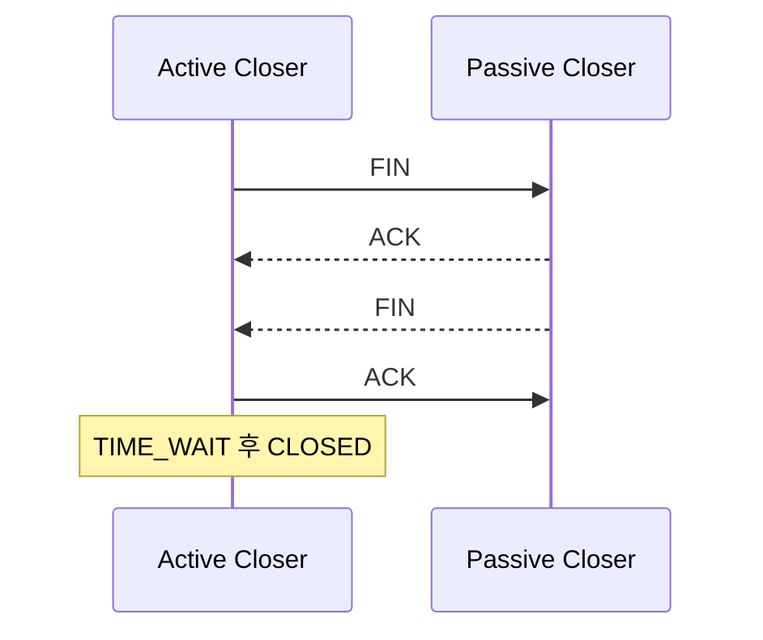

> OSI 7계층은 네트워크 기능을 7단계로 나눈 참조 모델이고, TCP/IP는 인터넷에서 실제로 사용하는 프로토콜 집합과 계층 구조다. IP가 목적지까지 패킷을 전달하고 그 위에서 TCP는 신뢰성 있는 바이트 스트림을, UDP는 단순한 데이터그램 서비스를 제공한다.

---

## 1. 왜 네트워크를 계층으로 나누는가
네트워크 통신에는 애플리케이션 데이터 표현, 연결 관리, 오류 처리, 라우팅, 프레임 전송, 전기·무선 신호 처리처럼 서로 다른 문제가 동시에 존재한다. 이를 한 덩어리로 구현하면 특정 기술을 바꿀 때 전체 시스템에 영향을 주기 쉽다. 계층화는 각 문제의 책임과 인터페이스를 분리한다.
- **추상화:** 상위 계층은 하위 계층의 상세 구현을 몰라도 서비스를 이용한다.
- **모듈성:** Ethernet을 Wi-Fi로 바꿔도 HTTP나 TCP의 기본 동작은 유지된다.
- **상호운용성:** 제조사와 운영체제가 달라도 같은 표준 프로토콜로 통신할 수 있다.
- **문제 해결:** 장애 범위를 물리 연결, IP 설정, 포트, 애플리케이션 등으로 좁힐 수 있다.

---

## 2. OSI 7계층

OSI(Open Systems Interconnection) 기본 참조 모델은 서로 다른 시스템의 통신 기능을 7개 계층으로 설명한다. ISO/IEC 7498-1은 이 모델이 표준 개발을 조정하기 위한 공통 기반이며, 특정 구현 명세 자체는 아니라고 설명한다.[[1]](https://www.iso.org/standard/20269.html)
| 계층 | 핵심 책임 | 대표 예시 | 전송 단위 |
| --- | --- | --- | --- |
| 7. 응용 Application | 사용자·애플리케이션에 네트워크 서비스 제공 | HTTP, DNS, SMTP, SSH | Data / Message |
| 6. 표현 Presentation | 데이터 형식 변환, 인코딩, 압축, 암호화 | UTF-8, JSON, JPEG, TLS의 관련 기능 | Data |
| 5. 세션 Session | 통신 세션 수립·유지·동기화·종료 | RPC 세션, 체크포인트 개념 | Data |
| 4. 전송 Transport | 프로세스 간 전달, 포트, 분할·재조립, 신뢰성·흐름 제어 | TCP, UDP | TCP Segment / UDP Datagram |
| 3. 네트워크 Network | 논리 주소와 서로 다른 네트워크 사이의 경로 선택·전달 | IPv4, IPv6, ICMP | Packet / IP Datagram |
| 2. 데이터 링크 Data Link | 같은 링크 안의 노드 간 전달, 프레이밍, MAC 주소, 오류 검출 | Ethernet, Wi-Fi, ARP | Frame |
| 1. 물리 Physical | 비트를 전기·광·무선 신호로 전송 | 케이블, 커넥터, 전파, 신호 규격 | Bit |
### 2.1 계층별 핵심 포인트
#### 1계층 - 물리 계층
0과 1을 어떤 신호로 표현하고 어느 매체로 보낼지를 다룬다. 케이블 단선, 신호 감쇠, 주파수, 전송 속도 같은 문제가 이 계층에 해당한다. 허브와 리피터는 전통적으로 1계층 장비로 분류한다.
#### 2계층 - 데이터 링크 계층
직접 연결되거나 같은 LAN에 속한 노드 사이에서 프레임을 전달한다. Ethernet 프레임에는 출발지·목적지 MAC 주소와 오류 검출용 FCS 등이 포함된다. 스위치는 MAC 주소 학습 테이블을 이용해 프레임을 적절한 포트로 전달한다.
#### 3계층 - 네트워크 계층
IP 주소를 사용해 출발지 네트워크에서 목적지 네트워크까지 패킷을 전달한다. 라우터는 목적지 IP와 라우팅 테이블을 보고 다음 홉을 정한다. IP는 기본적으로 최선형(best-effort) 전달을 제공하므로 손실, 중복, 순서 뒤바뀜을 자체적으로 완전히 해결하지 않는다.
#### 4계층 - 전송 계층
호스트 내부의 어떤 프로세스가 데이터를 받아야 하는지를 **포트 번호**로 구분한다. TCP는 연결, 순서, 재전송, 흐름 제어를 제공하고 UDP는 최소한의 기능으로 독립적인 데이터그램을 전달한다.
#### 5~7계층 - 세션·표현·응용 계층
OSI는 대화 상태 관리, 데이터 표현, 사용자 서비스를 별도 계층으로 나누지만 실제 인터넷 애플리케이션에서는 이 기능들이 응용 프로토콜이나 라이브러리 안에 함께 구현되는 경우가 많다. 예를 들어 HTTPS에서는 HTTP가 응용 메시지를 정의하고 TLS가 암호화와 인증을 담당하지만, TCP/IP 모델에서는 보통 모두 응용 계층 쪽으로 묶어 설명한다.

---

## 3. TCP/IP 모델
TCP/IP는 특정 프로토콜 하나가 아니라 인터넷 통신에 쓰이는 프로토콜 묶음(Internet Protocol Suite)이다. RFC 1122는 인터넷 호스트의 통신 계층을 Link, IP, Transport로 설명하고, RFC 1123은 응용·지원 프로토콜을 다룬다.[[2]](https://www.rfc-editor.org/rfc/rfc1122)[[3]](https://www.rfc-editor.org/rfc/rfc1123)
교재에 따라 TCP/IP를 4계층 또는 5계층으로 표현한다. 4계층 모델의 네트워크 액세스 계층을 데이터 링크와 물리 계층으로 나누면 5계층 모델이 된다. 층의 개수보다 **각 프로토콜이 어떤 책임을 가지는지**가 중요하다.
| OSI 7계층 | TCP/IP 4계층 | 대표 프로토콜·기술 |
| --- | --- | --- |
| 7 응용 + 6 표현 + 5 세션 | 응용 Application | HTTP(S), DNS, SMTP, SSH, TLS |
| 4 전송 | 전송 Transport | TCP, UDP |
| 3 네트워크 | 인터넷 Internet | IPv4, IPv6, ICMP |
| 2 데이터 링크 + 1 물리 | 네트워크 액세스 Link | Ethernet, Wi-Fi, ARP, 물리 매체 |

---

## 4. 캡슐화와 역캡슐화
송신 측에서는 상위 계층의 데이터에 각 계층의 제어 정보인 헤더가 붙는다. 수신 측에서는 반대 순서로 헤더를 해석하고 제거한다.

예를 들어 브라우저가 TCP를 통해 HTTP 요청을 보낼 때:
1. 애플리케이션이 HTTP 메시지를 만든다.
2. TCP가 출발지·목적지 포트, 순서 번호 등의 헤더를 붙여 세그먼트를 만든다.
3. IP가 출발지·목적지 IP 주소 등의 헤더를 붙여 패킷을 만든다.
4. Ethernet 또는 Wi-Fi가 현재 링크에서 필요한 주소·검사 정보를 붙여 프레임을 만든다.
5. 프레임이 비트 신호로 전송된다.
6. 수신 측은 링크 → IP → TCP → 애플리케이션 순서로 처리한다.
### 4.1 주소는 서로 다른 범위를 식별한다
| 식별자 | 주요 계층 | 식별 대상 |
| --- | --- | --- |
| MAC 주소 | 데이터 링크 | 현재 링크에서 사용할 네트워크 인터페이스 |
| IP 주소 | 인터넷/네트워크 | 인터넷상의 호스트·인터페이스 위치 |
| 포트 번호 | 전송 | 호스트 안의 통신 종단점·프로세스 |
| 도메인 이름 | 응용 | 사람이 읽기 쉬운 서비스 이름 |
라우터를 지날 때 IP 패킷은 다음 홉으로 계속 전달되지만, 링크 계층 프레임은 각 링크에서 새로 만들어진다. 따라서 최종 목적지 IP는 보통 유지되는 반면 출발지·목적지 MAC 주소는 홉마다 달라진다. NAT가 개입하면 IP 주소와 포트도 변환될 수 있다.
### 4.2 소켓과 연결 식별
소켓은 애플리케이션이 전송 계층 서비스를 사용하는 운영체제 인터페이스다. TCP 연결은 일반적으로 다음 4개 값의 조합으로 구분한다.
> 출발지 IP + 출발지 포트 + 목적지 IP + 목적지 포트
프로토콜까지 포함해 5-tuple이라고 부르기도 한다. 서버 하나가 같은 443번 포트에서 많은 클라이언트를 동시에 처리할 수 있는 이유는 각 연결의 원격 IP·포트 조합이 다르기 때문이다.

---

## 5. TCP
TCP(Transmission Control Protocol)는 애플리케이션 사이에 **신뢰성 있고 순서가 보장되는 전이중 바이트 스트림**을 제공하는 연결 지향 전송 프로토콜이다. 현재 TCP 명세는 RFC 9293이다.[[4]](https://www.rfc-editor.org/rfc/rfc9293)
[TCP(Transmission Control Protocol) \| 토스페이먼츠 개발자센터](https://docs.tosspayments.com/resources/glossary/tcp)
### 5.1 주요 특징
- **연결 지향:** 데이터 교환 전에 양 끝점이 연결 상태와 초기 순서 번호를 동기화한다.
- **신뢰성:** 순서 번호, ACK, 타이머, 재전송으로 손실과 중복을 처리한다.
- **순서 보장:** 애플리케이션에는 전송한 바이트 순서대로 전달한다.
- **바이트 스트림:** 메시지 경계를 보존하지 않는다.
- **전이중:** 양방향이 독립적으로 데이터를 보낼 수 있다.
- **흐름 제어:** 수신자의 처리·버퍼 능력을 넘지 않도록 조절한다.
- **혼잡 제어:** 네트워크가 감당하기 어려운 속도로 보내지 않도록 전송량을 조절한다.
> TCP의 “신뢰성”은 애플리케이션이 보낸 바이트를 상대 애플리케이션에 순서대로 전달하거나 연결 오류를 알리는 성질이다. 서버가 그 데이터를 실제로 저장했는지, 비즈니스 로직이 성공했는지까지 보장하지 않는다. 그런 확인은 응용 계층 응답으로 설계해야 한다.
### 5.2 TCP 헤더의 핵심 필드
```java
    0                   1                   2                   3
    0 1 2 3 4 5 6 7 8 9 0 1 2 3 4 5 6 7 8 9 0 1 2 3 4 5 6 7 8 9 0 1
   +-+-+-+-+-+-+-+-+-+-+-+-+-+-+-+-+-+-+-+-+-+-+-+-+-+-+-+-+-+-+-+-+
   |          Source Port          |       Destination Port        |
   +-+-+-+-+-+-+-+-+-+-+-+-+-+-+-+-+-+-+-+-+-+-+-+-+-+-+-+-+-+-+-+-+
   |                        Sequence Number                        |
   +-+-+-+-+-+-+-+-+-+-+-+-+-+-+-+-+-+-+-+-+-+-+-+-+-+-+-+-+-+-+-+-+
   |                    Acknowledgment Number                      |
   +-+-+-+-+-+-+-+-+-+-+-+-+-+-+-+-+-+-+-+-+-+-+-+-+-+-+-+-+-+-+-+-+
   |  Data |       |C|E|U|A|P|R|S|F|                               |
   | Offset| Rsrvd |W|C|R|C|S|S|Y|I|            Window             |
   |       |       |R|E|G|K|H|T|N|N|                               |
   +-+-+-+-+-+-+-+-+-+-+-+-+-+-+-+-+-+-+-+-+-+-+-+-+-+-+-+-+-+-+-+-+
   |           Checksum            |         Urgent Pointer        |
   +-+-+-+-+-+-+-+-+-+-+-+-+-+-+-+-+-+-+-+-+-+-+-+-+-+-+-+-+-+-+-+-+
   |                           [Options]                           |
   +-+-+-+-+-+-+-+-+-+-+-+-+-+-+-+-+-+-+-+-+-+-+-+-+-+-+-+-+-+-+-+-+
   |                                                               :
   :                             Data                              :
   :                                                               |
   +-+-+-+-+-+-+-+-+-+-+-+-+-+-+-+-+-+-+-+-+-+-+-+-+-+-+-+-+-+-+-+-+
```
| 필드 | 역할 |
| --- | --- |
| Source / Destination Port | 송수신 애플리케이션 종단점 식별 |
| Sequence Number | 세그먼트 데이터의 첫 바이트 위치 식별 |
| Acknowledgment Number | 다음에 받기를 기대하는 바이트 번호 |
| Flags | SYN, ACK, FIN, RST 등 연결·제어 상태 표현 |
| Window | 수신자가 추가로 받을 수 있다고 광고하는 범위 |
| Checksum | TCP 헤더와 데이터의 전송 중 오류 검출 |
| Options | MSS, Window Scale, SACK Permitted, Timestamp 등 기능 협상 |
### 5.3 연결 수립 - 3-way handshake
양쪽이 서로의 초기 순서 번호를 알고 확인해야 하므로 세 단계가 필요하다. SYN 자체도 순서 번호 공간 1을 소비한다.

1. **SYN:** 클라이언트가 자신의 초기 순서 번호 x를 알린다.
2. **SYN + ACK:** 서버가 x를 확인하고 자신의 초기 순서 번호 y를 알린다.
3. **ACK:** 클라이언트가 y를 확인한다.
3-way handshake의 목적은 단순히 “서버가 켜져 있는지 확인”하는 것이 아니라 양방향 통신 가능성과 양쪽 초기 순서 번호를 동기화하고 오래된 중복 연결 요청을 구분하는 데 있다.
### 5.4 신뢰성을 만드는 방법
- **Sequence Number:** 바이트의 위치를 추적해 순서를 맞추고 중복을 판별한다.
- **Cumulative ACK:** ACK 번호보다 앞선 바이트를 연속해서 받았음을 알린다.
- **Retransmission Timeout:** 일정 시간 ACK가 없으면 손실로 판단해 재전송한다.
- **Fast Retransmit:** 중복 ACK 등 손실 징후를 이용해 타임아웃 전 재전송할 수 있다.
- **Checksum:** 전송 중 비트 오류를 검출한다. 암호학적 무결성이나 악의적 변조 방지는 TLS 같은 상위 보안 계층의 역할이다.
- **Receive Buffer:** 순서가 뒤바뀐 데이터는 조건이 갖춰질 때까지 보관한 뒤 애플리케이션에 순서대로 제공한다.
TCP는 모든 세그먼트마다 반드시 ACK 하나를 즉시 보내는 방식만 쓰지 않는다. 누적 ACK, 지연 ACK, SACK 같은 메커니즘과 구현 정책이 함께 동작한다.
### 5.5 흐름 제어와 혼잡 제어
둘 다 송신 속도를 제한하지만 보호 대상이 다르다.
| 구분 | 목적 | 대표 기준 |
| --- | --- | --- |
| 흐름 제어 Flow Control | 빠른 송신자가 느린 수신자의 버퍼를 넘치게 하지 않도록 함 | 수신자가 광고한 수신 윈도우 rwnd |
| 혼잡 제어 Congestion Control | 송신자가 네트워크 경로에 과도한 트래픽을 넣지 않도록 함 | 혼잡 윈도우 cwnd, 손실·지연·ECN 등의 신호 |
실제 송신 가능량은 대략 `min(rwnd, cwnd)`의 제한을 받는다. 혼잡 제어의 대표 개념으로 Slow Start, Congestion Avoidance, Fast Retransmit, Fast Recovery가 있다. 세부 알고리즘은 운영체제와 TCP 구현에 따라 달라질 수 있다.[[5]](https://www.rfc-editor.org/rfc/rfc5681)
### 5.6 연결 종료와 TIME_WAIT
TCP는 전이중이므로 한 방향의 전송 종료와 반대 방향의 종료를 독립적으로 처리한다. 일반적인 정상 종료에서 각 방향의 FIN과 ACK가 오가므로 흔히 4-way handshake라고 부른다.

마지막 ACK를 보낸 능동 종료 측은 일정 시간 TIME_WAIT에 머문다. 이는 마지막 ACK가 손실되어 상대가 FIN을 다시 보낼 때 재응답할 수 있게 하고, 이전 연결의 지연된 세그먼트가 같은 연결 식별자를 재사용한 새 연결에 섞이는 위험을 줄인다. RST는 정상적인 양방향 종료 절차가 아니라 연결을 즉시 중단하는 제어 신호다.
### 5.7 TCP는 메시지 경계를 보존하지 않는다
애플리케이션이 `Hello`와 `World`를 두 번의 write로 보내도 수신 측 read가 같은 두 덩어리로 반환된다는 보장은 없다. `HelloWorld`로 한 번에 읽히거나 더 작은 조각으로 나뉠 수 있다. 따라서 응용 프로토콜은 다음 중 하나로 메시지 경계를 정의해야 한다.
- 고정 길이
- 길이 접두사(length prefix)
- 구분자(delimiter)
- HTTP처럼 헤더와 길이·종료 규칙을 갖는 프로토콜 형식

---

## 6. UDP
UDP(User Datagram Protocol)는 최소한의 전송 기능으로 애플리케이션 데이터그램을 전달하는 비연결형 프로토콜이다. RFC 768의 UDP 헤더는 Source Port, Destination Port, Length, Checksum 네 필드로 구성되며 기본 헤더 크기는 8바이트다.[[6]](https://www.rfc-editor.org/rfc/rfc768)
### 6.1 주요 특징
- 연결 수립 절차 없이 데이터그램을 보낼 수 있다.
- 메시지 경계를 보존한다. 한 번 보낸 데이터그램은 수신 시에도 하나의 데이터그램 단위다.
- 전달, 순서, 중복 제거, 재전송을 UDP 자체가 보장하지 않는다.
- TCP의 수신 윈도우 같은 흐름 제어와 TCP식 혼잡 제어를 기본 제공하지 않는다.
- 헤더와 상태가 작아 단순하지만, 애플리케이션 요구에 따라 신뢰성·혼잡 제어를 직접 설계해야 할 수 있다.
- 일대일 유니캐스트뿐 아니라 IP 멀티캐스트·브로드캐스트 환경에도 사용할 수 있다.
### 6.2 UDP 체크섬
UDP 체크섬은 헤더와 데이터의 전송 중 오류를 검출한다. IPv4에서는 제한적으로 체크섬 생략 표현이 가능하지만 기본적으로 사용하는 것이 권고되며, IPv6에서는 특수한 터널 예외를 제외하면 UDP 체크섬이 필수다. 체크섬은 암호학적 인증 수단이 아니므로 위변조 방지가 필요하면 별도 보안 프로토콜이 필요하다.[[7]](https://www.rfc-editor.org/rfc/rfc8085)
### 6.3 UDP를 사용하는 대표 상황
- **DNS:** 전통적인 짧은 질의·응답은 UDP를 많이 사용한다. 응답 크기, 재시도, 보안 요구 등에 따라 TCP나 암호화된 다른 전송도 사용한다.
- **실시간 음성·영상·게임:** 늦게 도착한 오래된 데이터보다 최신 데이터의 적시성이 중요한 경우가 많다. 다만 재전송·순서·혼잡 제어 정책을 애플리케이션이 별도로 설계할 수 있다.
- **DHCP, NTP, SNMP 등:** 단순 요청·응답이나 브로드캐스트가 필요한 프로토콜에 활용된다.
- **QUIC / HTTP/3:** UDP 위에서 보안, 연결 관리, 신뢰성 있는 스트림, 혼잡 제어를 구현한다. “UDP를 쓴다”가 “신뢰성이 없다”와 같은 뜻은 아니라는 대표 사례다.[[8]](https://www.rfc-editor.org/rfc/rfc9000)
UDP 기반 애플리케이션도 공용 네트워크에서 혼잡을 무시해서는 안 된다. RFC 8085는 UDP 애플리케이션에 혼잡 제어, 메시지 크기 관리, 재전송 타이머, 체크섬 사용 지침을 제시한다.[[7]](https://www.rfc-editor.org/rfc/rfc8085)

---

## 7. TCP와 UDP 비교

| 항목 | TCP | UDP |
| --- | --- | --- |
| 연결 | 연결 지향, 상태 유지 | 비연결형, 기본적으로 연결 상태 없음 |
| 데이터 모델 | 바이트 스트림 | 메시지/데이터그램 |
| 전달·순서 보장 | 보장하거나 오류를 알림 | 보장하지 않음 |
| 재전송 | 프로토콜이 수행 | 필요하면 애플리케이션이 수행 |
| 흐름 제어 | 제공 | 기본 제공하지 않음 |
| 혼잡 제어 | 제공 | UDP 자체는 제공하지 않음 |
| 헤더 크기 | 기본 20바이트, 옵션 사용 시 증가 | 8바이트 |
| 멀티캐스트·브로드캐스트 | 지원하지 않음 | IP 기능과 함께 사용 가능 |
| 대표 사용 | HTTP/1.1·2, SSH, 파일 전송, DB 연결 | DNS, 실시간 미디어, 게임, QUIC |
### 7.1 어떻게 선택하는가
- 모든 바이트가 순서대로 도착해야 하고 표준적인 신뢰성 제어가 필요하다 → **TCP**
- 메시지 단위가 중요하고 일부 손실을 허용하거나 맞춤형 전송 정책이 필요하다 → **UDP**
- “속도가 중요하니 UDP”처럼 한 조건만으로 결정하지 않는다.
- 허용 가능한 손실, 지연 상한, 순서 요구, 보안, NAT·방화벽 통과, 구현 복잡도, 혼잡 제어를 함께 고려한다.
- 현대 애플리케이션에서는 TCP와 UDP만 직접 비교하기보다 TLS over TCP, QUIC over UDP처럼 **전체 프로토콜 스택**을 비교해야 한다.

---

## 8. 통신 예시
사용자가 `https://example.com`에 접속한다고 가정한다.
1. 브라우저는 DNS로 도메인 이름에 대응하는 IP 주소를 구한다.
2. HTTP/1.1 또는 HTTP/2라면 보통 서버의 TCP 443번 포트에 연결한다.
3. TCP 3-way handshake로 연결과 초기 순서 번호를 동기화한다.
4. TLS handshake로 서버 인증, 암호 스위트와 키를 협상한다.
5. 암호화된 HTTP 요청과 응답을 TCP 바이트 스트림으로 교환한다.
6. 운영체제는 TCP 세그먼트를 IP 패킷에 넣고, 현재 링크의 프레임으로 캡슐화한다.
7. 각 라우터는 IP 목적지를 보고 다음 홉으로 전달하며 링크마다 프레임이 바뀐다.
HTTP/3라면 TCP 대신 UDP 위의 QUIC이 연결 수립, TLS 1.3 보안, 신뢰성 있는 스트림과 혼잡 제어를 제공한다. 따라서 “HTTP는 무조건 TCP”도 현재는 정확하지 않다.

---
