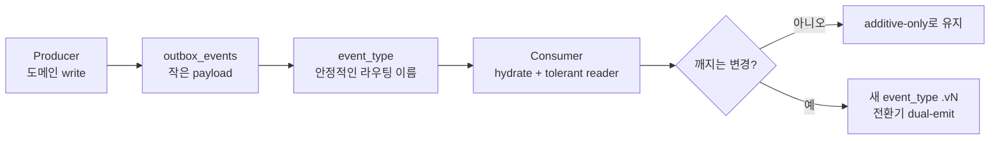

## 들어가며

지금 만들고 있는 서비스는 여러 개의 독립된 프로세스로 나뉘어 있습니다. 외부 소스를 수집·큐레이션하는 **worker**, 사용자 API를 담당하는 **api-server**, 검색 인덱스를 담당하는 **retrieval**. 이 셋이 하나의 흐름(신호가 생기고 → 사용자가 처리하고 → 검색/알림에 반영되는)을 이어가려면 서로를 어떻게 부를지 정해야 했습니다.

동기 호출로 다 엮으면 결합도가 너무 커집니다. 그래서 택한 게 **이벤트 기반 아키텍처(EDA)** 이고, 구체적으로는 **Transactional Outbox** 패턴입니다. 도메인 데이터를 쓰는 바로 그 트랜잭션 안에서 `outbox_events` 테이블에 이벤트 한 줄을 함께 append하고 다른 프로세스가 그걸 소비합니다. outbox를 쓰는 이유는 **이중 쓰기(dual-write) 문제**를 피하기 위해서입니다. "DB에는 커밋됐는데 메시지 발행은 실패"하거나 그 반대인 불일치를, 도메인 write와 이벤트 기록을 **한 트랜잭션**으로 묶어 원천 차단합니다.

여기서 중요한 전제는 **우리는 아직 카프카를 쓰지 않습니다.** 이벤트는 Postgres의 `outbox_events` 테이블 row이고, 소비자는 그 테이블을 **폴링**합니다. 그래서 "카프카 토픽을 어떻게 짓느냐" 같은 자료를 그대로 가져다 쓸 수 없었습니다. 토픽이 없으니까요. 대신 우리에게 있는 건 `event_type`이라는 **텍스트 컬럼 값** 하나입니다.

설계를 진행하면서 네 가지 질문에 만나게 됐습니다.

1. 이벤트 payload에 **무엇을 담을 것인가** (Zero Payload vs Full Payload)
2. 이벤트 이름을 **어떻게 지을 것인가** (네이밍 컨벤션)
3. 스키마가 바뀌면 **어떻게 안 깨지게 할 것인가** (하위호환성)
4. 그래도 깨져야 한다면 **어떻게 버전을 나눌 것인가** (버저닝 전략)

이 글은 각 질문을 국내외 사례로 저울질하며 우리 맥락의 답을 찾아간 기록입니다.

---

## Q1. Payload에 무엇을 담을까 - Zero vs Full

첫 갈림길은 "이벤트 본문에 데이터를 얼마나 실을까"였습니다. 두 선택지가 있습니다.

- **Full-Payload**: 이벤트에 관련 데이터를 전부 담는다. 소비자는 추가 조회 없이 즉시 처리한다.
- **Zero-Payload**: 이벤트에 **PK(ID)와 이벤트 타입만** 담는다. 소비자는 필요하면 최신 데이터를 별도로 다시 조회한다.

### 트레이드오프

|        | Full-Payload        | Zero-Payload  |
| ------ | ------------------- | ------------- |
| 소비자 조회 | 불필요(빠름)             | 필요(조회 비용)     |
| 최신성    | 발행 시점 스냅샷(오래될 수 있음) | 조회 시점 최신      |
| 스키마 변경 | 계약이 커서 변경에 취약       | 계약이 작아 변경에 둔감 |
| 결합도    | payload 구조에 소비자가 결합 | ID에만 결합       |

### 국내 사례는 뭐가 있을까

이 지점에서 국내 사례를 찾아보게 됐습니다.

우아한형제들 **배민스토어**는 상품 정보를 전파할 때 **Zero-Payload**를 택했습니다. 이유는 다음과 같습니다. "상품의 정보는 수시로 **스펙의 변화가 잦게 발생**될 수 있음"을 고려해, 이벤트에는 변경된 **Product ID만** 싣고 소비자가 실시간 HTTP API로 최신 데이터를 조회해 DynamoDB/Redis에 저장한다.[^baemin]

즉 "페이로드에 스냅샷을 실으면 스키마가 자주 바뀔 때 계약이 계속 깨진다 → 그러니 ID만 싣고 최신은 재조회한다"는 판단입니다. Youngho's Devlog도 Full/Zero를 같은 축으로 비교하며, Zero를 "PK값과 이벤트 타입만 넣어 전파하는 방식"으로 정리합니다.[^youngho]

### 우리의 결정

**Zero-Payload 계열을 택합니다.** 정확히는 "**ID 중심의 작은 payload + 소비자가 공유 DB에서 hydrate**".

- 우리 consumer(worker의 projection, api-server의 notification)는 **같은 공유 DB**를 읽을 수 있으니, 배민처럼 HTTP를 거칠 필요도 없이 **DB에서 직접 hydrate**하면 됩니다. 조회 비용 부담이 더 작습니다.
- 표시용 title/description 같은 값은 payload에 넣지 않습니다. 넣는 순간 최신성·계약 취약성 문제가 따라옵니다.
- Zero-Payload의 약점인 "재조회 대상이 아직 없거나 사라졌으면?"도 outbox 덕에 안전합니다. 이벤트 row와 도메인 row가 **같은 트랜잭션**에 커밋되므로, 소비자가 이벤트를 읽는 시점엔 원본이 **이미 보이는 상태**라 hydrate가 항상 성공합니다(race 없음).

여기서 짚어야 하는 반례: Full-Payload가 유리한 순간도 있습니다. 소비자가 **"발행 당시의 스냅샷"** 자체를 원할 때(예: 감사 로그, 시점 재현)입니다. 이건 최신성과 반대 방향의 요구라 hydrate로는 못 풉니다. 다만 우리 MVP엔 그 요구가 없어서 필요해지면 그때 해당 이벤트에만 스냅샷 필드를 더하기로 했습니다.

---

## Q2. 이벤트 이름을 어떻게 지을까 - 네이밍 컨벤션

payload를 작게 가져가기로 하니, 소비자가 라우팅에 쓰는 건 결국 **이벤트 이름(`event_type`)** 입니다. 이름 규칙이 곧 계약의 뼈대가 됩니다.

### 사례들이 말하는 원칙

- **과거형으로**: 이벤트는 "이미 일어난 사실"입니다. 명령(`CreateOrder`)이 아니라 사실(`OrderCreated`)로 씁니다. 국내 글도 "도메인 이벤트는 과거에 벌어진 일이라 **과거형**으로 표현한다(Post → `created`)"고 정리합니다.[^brunch]
- **구체적으로**: `CustomerUpdated`처럼 두루뭉술하게 말고 `CustomerEmailChanged`처럼 무엇이 바뀌었는지 담습니다. Confluent의 이벤트 설계 자료도 이름에 도메인·타입·버전 같은 맥락을 담아 발견성과 관리를 높이는 방향을 제안합니다.[^confluent-design]
- **소유·유일성을 이름에**: CloudEvents 표준은 `type`을 **reverse-DNS**(`com.example.order.placed`)로 지어 "이 이벤트의 의미를 정의하는 조직"을 드러내라고 권합니다.[^cloudevents]
- **토픽 구성 두 방식**: 카프카에선 (a) 이벤트별 토픽 분리, (b) 도메인별 통합 토픽 + 메시지에 `event_type`을 실어 소비자가 분기, 두 방식이 있습니다.[^youngho]

### 우리 맥락으로 번역하기

여기서 "카프카가 아니다"라는 전제가 다시 작동합니다.

- 우리는 **토픽이 없고** `outbox_events` 한 테이블에 `event_type` 컬럼으로 구분합니다. 이건 위 (b) **도메인별 통합 + 타입 분기** 방식에 그대로 해당합니다. 국내에서 흔히 쓰는 구성이라 안심이 됐습니다.
- **reverse-DNS(`com.momens...`)는 과합니다.** 조직 간 이벤트 교환이 아니라 사내 단일 시스템이니, 전역 유일성을 위한 도메인 프리픽스는 비용만 늘립니다.
- 이미 `aggregate_type`(예: `signal`, `task`) 컬럼이 도메인을 들고 있습니다.

### 우리의 결정

**`{aggregate}.{과거형 동사}` 형태**로 통일합니다. 현행이 이미 그렇습니다: `signal.created`, `task.created`, `signal.converted_to_task`, `signal.dismissed`. 규율만 명문화했습니다.

- 세그먼트 구분은 `.`, 세그먼트 내부 다단어는 `_` (`signal.converted_to_task`)
- 동사는 **항상 과거형** (`dismiss`가 아니라 `dismissed`)
- **구체적으로** (`signal.updated` 금지 → 무엇이 바뀌었는지)
- `aggregate_type`와 프리픽스가 중복되지만, `event_type` 단독으로 로그·라우팅에서 **자기설명**이 되도록 프리픽스를 유지

곁가지 결정 하나: 발행 주체를 담는 컬럼 이름을 `producer`에서 **`issued_by`** 로 바꿨습니다. `producer`는 카프카/메시징 **인프라 용어**라, "도메인이 인프라를 아는 느낌"이 든다는 지적을 받아들였습니다. `issued_by = 'worker'`처럼 문장으로 읽히고, 특정 메시징 스택에 묶이지 않습니다.

---

## Q3. 스키마가 바뀌면 어떻게 안 깨지게 할 것인가 - 하위호환성

이벤트는 한 번 계약을 맺으면 **소비자가 여럿**이고, 그들이 **동시에 업데이트되지 않습니다.** 그래서 스키마 변경은 "누가 먼저 바뀌어도 안 깨지는가"의 문제가 됩니다.

### 표준 렌즈: 호환성 모드

Confluent Schema Registry가 이 문제를 잘 정리해 뒀습니다.[^confluent-evo]

- **Backward**(기본·권장): 새 스키마로 **옛 데이터를 읽을 수 있다.** 소비자가 프로듀서보다 먼저 올라가도 안전.
- **Forward**: 옛 스키마로 새 데이터를 읽을 수 있다.
- **Full**: 둘 다.

기본이 Backward인 이유가 인상적이었습니다. 소비자를 **토픽 처음으로 되감아 재생**할 수 있게 하기 위해서입니다. 우리처럼 `outbox_events.id`를 watermark 삼아 폴링하는 구조에서, 소비자가 뒤처졌다가 따라잡거나 재처리하는 상황과 정확히 같은 그림입니다.

호환성을 지키는 대표 규칙도 단순합니다.[^conduktor]
- 필드 **추가는 default가 있는 optional만**
- 필드 **삭제는 required 필드가 아닌 것만**
- 기존 필드의 **타입·의미 변경 금지, rename 금지**

### 우리에겐 도구가 없다

여기서 현실을 마주했습니다. **우리는 Schema Registry도 Avro도 없습니다.** payload는 그냥 `jsonb`입니다. 그러니 호환성을 **도구가 강제해 주지 않습니다.** 규율과 코드로 지켜야 합니다.

그래서 두 가지를 정책으로 못 박았습니다.

1. **payload는 additive-only.** 기존 필드는 절대 재사용/재해석하지 않고, 새 필드는 optional로만 추가합니다.
2. **소비자는 tolerant reader.** 모르는 필드는 무시하고, 없는 필드는 견딥니다.

이 두 개만 지켜도 `jsonb` 위에서 Backward 호환의 실질을 얻습니다. 도구는 나중에 규모가 커지면(스키마가 정말 자주·복잡하게 바뀌면) 도입해도 늦지 않습니다. 국내에서도 스키마 레지스트리 + Protobuf로 이 문제를 푸는 사례가 있지만,[^haandol] 지금 우리 규모엔 오버킬이라고 판단했습니다.

---

## Q4. 그래도 깨져야 한다면 - 버저닝 전략

additive-only로 대부분 막을 수 있지만, 언젠가는 **정말 깨지는 변경**(필드 의미를 바꿔야 하거나 구조를 갈아엎어야 하는)이 옵니다. 그때를 위한 전략을 미리 정해 뒀습니다.

### 선택지

| 전략 | 방식 | 트레이드오프 |
| --- | --- | --- |
| **A. event_type에 버전** | 깨지는 변경 → `signal.created.v2` 신설, 전환기 dual-emit | 소비자가 이미 `event_type`으로 라우팅 → outbox+watermark와 궁합. 단 event_type 증식 |
| **B. 버전 필드** | envelope `schema_version` 컬럼 또는 `payload.v` | 단일 event_type 유지, 소비자가 분기. 단 공통 컬럼 추가 |
| **C. 암묵적** | 명시 버전 없음, Q3 규율만, 진짜 깨질 때만 A로 | 가장 단순, 초기에 적합 |

CloudEvents는 `type`에 버전 정보를 포함할 수 있다고 열어두고, Confluent의 이벤트 스트림 네이밍 자료도 breaking schema change가 생기면 `.v2` 같은 새 이름으로 갈라내는 예를 듭니다.[^cloudevents][^confluent-design] 버전 세그먼트를 처음부터 붙이라는 게 아니라, **필요할 때** 붙이는 선택지로 읽었습니다.

### 우리의 결정: 지금은 C, 메커니즘은 A로 예약

- **지금**은 버전 세그먼트를 붙이지 않습니다(전략 C). 사실 접미사 `.v1`을 붙이는 **비용은 거의 0**입니다(그냥 문자열이니까). 그런데도 미루는 건 비용이 아니라 **편익** 때문입니다. 지금은 소비자가 전부 사내라 깨지는 변경이 와도 **생산자·소비자를 같이 배포하고 재처리**하면 되고, Zero-Payload라 payload가 사실상 `{id}` 수준이라 **깨질 일 자체가 드뭅니다.** 버전이 값을 하는 건 '같이 배포하지 못하는 소비자'가 생길 때인데, 아직 그때가 아닙니다.
- 다만 **정책은 지금 글로 못 박습니다**(공짜인데 값집니다): "깨지는 변경이 오면 **event_type 접미사 버전**(`{aggregate}.{verb}.vN`)으로 신설하고, 전환기에 **dual-emit**한다(전략 A)."
- **접미사**를 택한 이유: 우리 라우팅은 프리픽스가 도메인이라, 버전을 **뒤에** 두는 게 파싱·정렬·라우팅에 덜 침습적입니다. 버전을 중간(`signal.v2.created`)에 끼우면 프리픽스 기반 필터가 어색해집니다.
- `schema_version` 컬럼(전략 B)은 **불채택**. 공통 필드는 "정말 모든 이벤트에 필요하다는 신호가 뚜렷할 때만" 늘린다는 원칙과 어긋납니다. 첫 breaking change가 임박하면 그때 A로 처리하면 컬럼을 안 늘려도 됩니다.

---

## 결국 "결합을 어디서 끊나"

네 질문을 지나고 보니, 전부 하나의 축으로 수렴했습니다. **소비자와 생산자의 결합을 어디서, 얼마나 끊을 것인가.**

- **Zero-Payload**: 데이터 구조에 대한 결합을 끊고 ID로만 잇는다.
- **네이밍**: 이름을 계약의 안정적 표면으로 삼아, 이름만 보고 라우팅하게 한다.
- **하위호환성**: 생산자와 소비자가 서로 다른 시점에 바뀌어도 되도록 additive-only + tolerant reader로 시간 결합을 끊는다.
- **버저닝**: 정말 끊어야 할 땐 새 이름으로 갈라, 옛/새를 공존시킨다.

| 질문 | 결정 |
| --- | --- |
| Payload | Zero-Payload 계열 (compact ID + DB hydrate) |
| 네이밍 | `{aggregate}.{과거형 동사}`, 발행 주체 컬럼 `issued_by` |
| 하위호환성 | additive-only + tolerant reader (도구 없이 규율로) |
| 버저닝 | 지금은 암묵(C), breaking 시 event_type 접미사 `.vN` + dual-emit(A) |

마지막으로 남은 메타 교훈 하나. 이 결정들의 상당수는 "**아직 우리 규모엔 필요 없다**"로 끝났습니다. Schema Registry도, 버전 세그먼트도, snapshot payload도 전부 "필요해지면"으로 미뤘습니다. EDA의 화려한 도구들을 다 끌어오는 게 아니라, **지금 계약을 안정적으로 만들 최소한의 규율**만 남기고 나머지는 신호가 올 때까지 기다리는 것, 그게 작은 팀이 EDA를 시작하는 현실적인 방법이라는 생각으로 정리를 마칩니다.

---

## 참고한 글

[^baemin]: 우아한형제들 기술블로그, [배민스토어에 이벤트 기반 아키텍처를 곁들인](https://techblog.woowahan.com/13101/) — Zero-Payload 채택 이유(스펙 변화가 잦음 → ID만 전달, 최신은 재조회).
[^youngho]: Youngho's Devlog, [MSA환경에서 Kafka를 활용한 데이터 동기화](https://jeonyoungho.github.io/posts/MSA%ED%99%98%EA%B2%BD%EC%97%90%EC%84%9C-Kafka%EB%A5%BC-%ED%99%9C%EC%9A%A9%ED%95%9C-%EB%8D%B0%EC%9D%B4%ED%84%B0-%EB%8F%99%EA%B8%B0%ED%99%94/) — Full/Zero-Payload 비교, 토픽 구성 두 방식.
[^brunch]: brunch, [분산 트랜잭션 대신에 도메인 이벤트 MSA 패턴](https://brunch.co.kr/@graypool/497) — 도메인 이벤트 과거형 네이밍.
[^haandol]: Haandol, [Kafka Schema Registry에서 Protobuf 사용하기](https://haandol.github.io/2022/12/29/use-kafka-schema-registry-for-protobuf.html) — 국내 스키마 레지스트리/버저닝 실무.
[^confluent-design]: Confluent Developer, [Designing Events and Event Streams — Best Practices](https://developer.confluent.io/courses/event-design/best-practices/) — 이벤트 스트림 이름에 도메인·타입·버전 맥락을 담는 방식.
[^confluent-evo]: Confluent Docs, [Schema Evolution & Compatibility Types](https://docs.confluent.io/platform/current/schema-registry/fundamentals/schema-evolution.html) — Backward/Forward/Full 호환성 모드.
[^conduktor]: Conduktor, [Schema Evolution: Kafka Best Practices](https://www.conduktor.io/glossary/schema-evolution-best-practices) — 필드 추가/삭제 규칙.
[^cloudevents]: CloudEvents, [Spec — `type` attribute](https://github.com/cloudevents/spec/blob/main/cloudevents/spec.md) — reverse-DNS 네이밍, `type` 값에 버전 정보를 포함할 수 있음.
