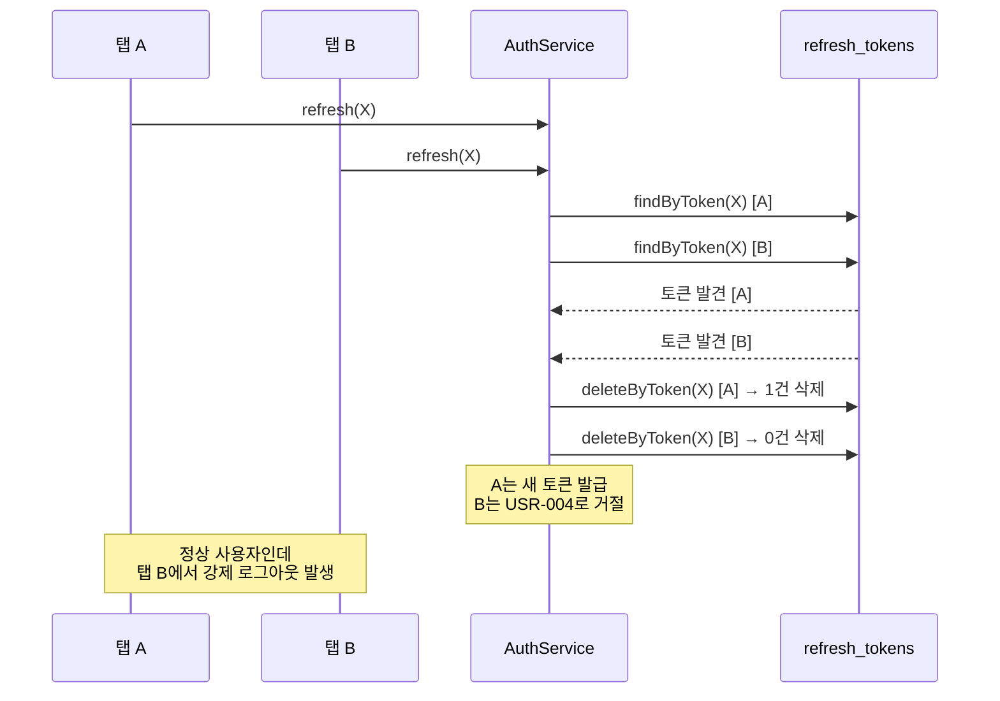
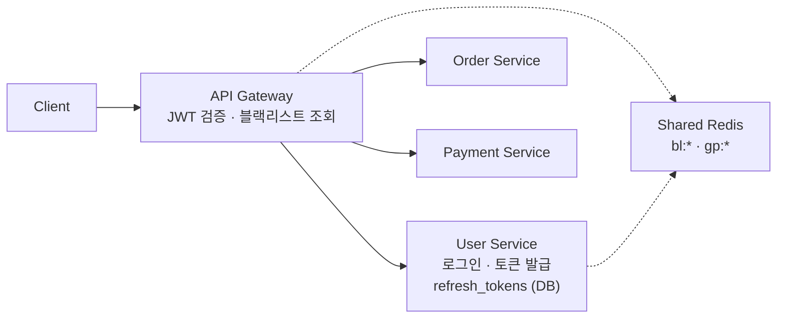

처음에는 인증을 공부 할 때는 단순하게 생각했다. "JWT 발급해서 헤더로 받고, 서명만 검증하면 끝 아닌가?" 그런데 인증/인가 자료를 조금만 읽어보면 갈림길이 많다. 토큰을 헤더에 둘지 쿠키에 둘지, 회수는 블랙리스트로 할지 화이트리스트로 할지, Refresh Token을 회전시킬지 슬라이딩으로 갈지, 인증 프로토콜은 자체로 짤지 OAuth2/OIDC를 쓸지, 인가는 역할로 할지 속성으로 할지. 각 갈림길마다 보안 권고, 운영 비용, 사용자 경험이 다르게 흔들린다.

PeekCart 코드를 읽기 전에 이 갈림길들을 먼저 정리하고 싶었다. 그래야 PeekCart의 선택이 "정답"이 아니라 "여러 가능성 중 어디에 위치한 선택"인지를 볼 수 있다.

이 글에서 사용하는 용어는 다음 뜻으로 읽으면 된다.

|용어|이 글에서의 의미|
|---|---|
|인증 (Authentication, AuthN)|"당신이 누구인가"를 확인하는 과정. 로그인이 대표 예|
|인가 (Authorization, AuthZ)|"당신이 무엇을 할 수 있는가"를 결정하는 과정. 권한 체크가 대표 예|
|액세스 토큰 (Access Token)|한 요청에 대한 인증을 증명하는 짧은 수명의 토큰|
|리프레시 토큰 (Refresh Token)|액세스 토큰을 다시 발급받기 위한 긴 수명의 토큰|
|토큰 회수 (Revocation)|발급된 토큰을 강제로 무효화하는 동작. 로그아웃, 탈취 대응이 대표 예|

이번 학습에서 확인하고 싶은 질문은 다음과 같다.

1. 인증과 인가는 어떻게 구분해서 봐야 하는가?
2. 비밀번호는 어떻게 저장하고 검증해야 하는가 — bcrypt, Argon2, salt, pepper?
3. 사용자 상태를 어디에 둘 것인가 — 서버, 클라이언트, 둘 다?
4. 토큰을 어디에 담아 보낼 것인가 — Authorization 헤더, 쿠키, 그 외?
5. 토큰을 어떻게 서명/암호화할 것인가 — HS256, RS256, ES256, JWE?
6. 토큰을 어떻게 회수할 것인가 — 블랙리스트, 화이트리스트, 짧은 만료?
7. 재발급 전략과 토큰 수명은 무엇이 있는가 — Rotation, Sliding, Reuse Detection, Grace Period?
8. 인증 프로토콜은 자체로 짤 것인가, OAuth2/OIDC/Passkey 같은 표준을 쓸 것인가?
9. 인가는 어떤 모델로 표현할 것인가 — RBAC, ABAC, ReBAC, Scope?
10. 서비스 간 신뢰는 어떻게 세울 것인가 — mTLS, API Key, Service Token, Gateway?
11. 이 갈림길들에서 PeekCart는 어떤 선택을 했고, 어떤 한계를 남겼는가?

---

## 인증과 인가는 어떻게 다른가

가장 먼저 분리해서 봐야 할 두 개념이다. 종종 같은 흐름 안에 묶여서 다뤄지기 때문에 헷갈리기 쉽다.

- **인증(Authentication, AuthN)**: 요청을 보낸 주체가 누구인지 확인하는 과정. "이 사람이 정말 user 42인가"에 답한다.
- **인가(Authorization, AuthZ)**: 그 주체가 특정 동작을 할 수 있는지 결정하는 과정. "user 42가 order 7을 취소할 수 있는가"에 답한다.

같은 시스템에서 두 동작이 거의 동시에 일어난다. JWT를 예로 들면 서명 검증은 인증에 가깝고, 클레임에 담긴 role을 보고 권한을 판단하는 부분은 인가에 가깝다. Spring Security의 `Authentication`과 `AccessDecisionManager`도 비슷한 방식으로 둘을 분리한다.

이 구분은 단지 용어 문제가 아니다. 인증과 인가는 **언제, 누가 책임지는가**가 다르게 설계될 수 있다.

- 인증은 보통 시스템 입구(Gateway, Filter) 한 곳에 모은다.
- 인가는 도메인 가까이에서, 때로는 데이터 레벨에서 결정해야 한다.

예를 들어 "주문은 본인만 취소할 수 있다"는 규칙은 인증이 끝난 뒤 도메인 로직에서 한 번 더 확인해야 한다. 토큰이 유효하다는 것이 곧 "이 주문에 접근할 권리"를 뜻하지는 않기 때문이다. OWASP의 [Authorization Cheat Sheet](https://cheatsheetseries.owasp.org/cheatsheets/Authorization_Cheat_Sheet.html)는 이 차이를 명시적으로 강조한다.

이번 글에서 다루는 비교는 대부분 인증 쪽이다. 인가는 PeekCart 범위에서 단순(`ROLE_USER`, `ROLE_ADMIN`)하기 때문에 후반부에 잠깐만 다룬다.

---

## 갈림길 1. 비밀번호를 어떻게 저장하고 검증할 것인가

인증의 가장 첫 갈림길은 자격증명을 어떻게 다룰 것인가다. 토큰이 발급되기 전에 비밀번호가 먼저 검증되어야 하고 그 비밀번호는 데이터베이스에 어떤 형태로든 저장된다. 평문 저장이 안 된다는 것은 누구나 안다. 그러면 어떻게 저장할 것인가에서 또 갈림길이 나뉜다.

|방식|핵심 아이디어|적합한 상황 / 문제|
|---|---|---|
|평문 저장|그대로 저장|사고 시 즉시 전체 유출, 적합한 상황은 없다|
|단순 해시 (MD5, SHA-1)|일방향 해시|레인보우 테이블 · GPU 무차별 대입에 무력|
|Salted Hash (SHA-256 + salt)|사용자별 salt 추가|레인보우 테이블 방어, GPU 무차별 대입은 여전|
|PBKDF2|해시 반복 (key stretching)|NIST 권고, FIPS 환경에서 자주 채택|
|bcrypt|적응형 해시, work factor 조정 가능|검증된 알고리즘, 메모리는 적게 사용|
|scrypt|메모리 강성 추가|GPU/ASIC 공격에 더 강함|
|Argon2id|메모리·시간·병렬성 모두 조정|OWASP 권고, 새로 짤 때의 기본값|

여기서 핵심 원리 두 가지가 모든 알고리즘에 깔려 있다.

**Salt**는 같은 비밀번호가 사용자마다 다른 해시값을 갖게 만들어, 한 번에 여러 계정을 깨지 못하게 한다. bcrypt와 Argon2는 salt를 해시 문자열 자체에 내장한다(예: `$2a$10$<salt><hash>` 형식).

**Work factor(cost)** 는 해시 계산을 일부러 느리게 만들어 무차별 대입 비용을 키운다. 하드웨어 성능이 좋아질수록 work factor를 올려야 하므로 알고리즘 자체가 "조정 가능"해야 한다. bcrypt의 `cost`, Argon2의 `memory/time/parallelism`이 그 파라미터다.

여기에 한 가지 더 짚어둘 개념이 있다. **Pepper**는 모든 비밀번호에 공통으로 적용되는 서버 측 시크릿이다. DB가 유출되더라도 pepper를 모르면 해시를 깰 수 없다. salt는 DB와 함께 유출되지만 pepper는 애플리케이션 시크릿 보관소(예: HSM, KMS)에 둔다. OWASP의 [Password Storage Cheat Sheet](https://cheatsheetseries.owasp.org/cheatsheets/Password_Storage_Cheat_Sheet.html)는 Argon2id + pepper(HSM 보관)를 가장 강한 조합으로 권고한다.

Spring Security는 이 영역에서 흥미로운 패턴을 제공한다. **`DelegatingPasswordEncoder`** 는 해시 문자열 앞에 `{bcrypt}`, `{argon2}` 같은 프리픽스를 붙여 알고리즘을 식별한다. 한 DB 안에 여러 알고리즘의 해시가 공존할 수 있고 사용자가 다음 로그인할 때 자연스럽게 새 알고리즘으로 마이그레이션된다. 이를 통해 알고리즘 회전을 지원하는 영리한 메커니즘이다.

PeekCart의 선택은 **bcrypt**다.

```java
// SecurityConfig.java
@Bean
public PasswordEncoder passwordEncoder() {
    return new BCryptPasswordEncoder();
}
```

`BCryptPasswordEncoder`는 기본 cost=10으로 동작한다(2^10 라운드). 호출부는 Application 레이어인 `AuthService`에 있지만, 비밀번호 검증의 도메인 의미는 `User` 엔티티에 모여 있다.

```java
// User.java
public boolean matchesPassword(String rawPassword, PasswordEncoder encoder) {
    return encoder.matches(rawPassword, this.passwordHash);
}
```

`User` 엔티티는 `PasswordEncoder` 인터페이스에만 의존하고 bcrypt 구현체는 모른다. 엔티티가 인코더를 필드로 들고 있지도 않고 메서드 매개변수로만 받는다. **비밀번호 비교는 도메인 규칙이지만 알고리즘은 Infrastructure 책임**이라는 분리가 자연스럽게 표현된다.

PeekCart가 의도적으로 안 한 것은 다음과 같다

- **Argon2id로 가지 않음**: bcrypt가 검증된 알고리즘이고 Spring 기본 인코더라서 학습 범위에서는 충분하다. OWASP 권고대로 Argon2id를 사용할 수도 있겠지만 Argon2id의 메모리 사용량이 성능에 주는 영향을 무시할 수 없다.
- **`DelegatingPasswordEncoder` 미사용**: 현재는 알고리즘 회전을 고려하지 않고 `BCryptPasswordEncoder`를 직접 빈으로 등록했다. 운영 시스템이라면 마이그레이션 여지를 위해 delegating encoder가 더 안전한 선택이다. 현재로서는 기술부채로 두고 추후 개선한다.
- **Pepper 미적용**: 시크릿 보관소가 분리되지 않아 일단 salt만 의지한다. JWT secret과 함께 KMS로 옮길 때 같이 도입할 후보이다.
- **비밀번호 정책**: 최소 길이, 유출된 비밀번호 차단(HIBP API)이 없다. OWASP 권고는 "길이만 강제, 복잡도 규칙은 완화, HIBP의 알려진 유출은 차단"이다.

---

## 갈림길 2. 사용자 상태를 어디에 둘 것인가

가장 큰 갈림길이다. 한 번 로그인한 사용자가 이후 수많은 요청을 보낼 때, 서버는 매번 그가 누구인지를 알아야 한다. 그 "기억"을 어디에 둘 것인가가 모든 다음 결정을 좌우한다.

|전략|핵심 아이디어|장점|단점|
|---|---|---|---|
|Session ID + 서버 저장|서버가 세션 상태를 보관, 클라이언트는 ID만 전달|즉시 회수 가능, 상태 변경 즉시 반영|매 요청마다 세션 저장소 조회, 수평 확장 시 세션 공유 비용|
|JWT only (순수 stateless)|서명된 토큰이 사용자 정보를 자체 포함|무상태, 빠른 검증, 서비스 간 전파 쉬움|회수 불가, 강제 로그아웃 불가, 만료까지 무한 유효|
|JWT + 회수 메커니즘 (하이브리드)|평소엔 stateless, 회수 시점만 stateful|빠른 검증 + 회수 가능|두 메커니즘 동기화 부담|
|Opaque Token + Introspection|토큰은 식별자, 검증은 인증 서버에 위임|OAuth2 표준, 토큰 자체에 민감 정보 없음|매 요청마다 introspection 호출 (캐싱 필요)|
|Token Binding / DPoP|토큰을 클라이언트 키에 묶음|탈취 시에도 사용 불가|클라이언트 구현 부담, RFC 9449 채택률 아직 낮음|

전통적으로 웹은 Session ID + 쿠키였다. JWT가 등장하면서 stateless가 매력적으로 보였지만, 실제로는 "회수 불가"라는 단점 때문에 대부분 시스템이 어떤 형태로든 stateful 요소를 끌어들였다. Sven Slootweg의 [Stop using JWT for sessions](http://cryto.net/~joepie91/blog/2016/06/13/stop-using-jwt-for-sessions/)는 이 지점을 강하게 비판한 글로 유명한데, 정리하면 "JWT로 세션을 흉내내려고 하지 말고, 회수가 필요하면 세션처럼 다뤄라"는 주장이다.

PeekCart의 선택은 세 번째다. JWT + 회수 메커니즘. 액세스 토큰은 stateless로 두되, 로그아웃과 재발급 같이 "회수가 필요한" 시점에만 저장소를 끌어들인다. 이게 왜 합리적인지는 다음 갈림길들을 따라가며 보인다.

참고로 OAuth2가 권고하는 표준 토큰 형식은 [RFC 7519 JWT](https://datatracker.ietf.org/doc/html/rfc7519)와 [RFC 6749의 opaque token](https://datatracker.ietf.org/doc/html/rfc6749) 두 가지 모두다. 어느 쪽이든 표준 위에 올라가 있다.

---

## 갈림길 3. 토큰을 어디에 담아 보낼 것인가

토큰을 발급한 다음 그것을 클라이언트가 매 요청에 어떻게 실어 보낼 것인가도 갈림길이 크다. 보안 모델과 공격 표면이 여기서 갈린다.

|전송 위치|사용 방식|장점|약점|
|---|---|---|---|
|`Authorization: Bearer` 헤더|클라이언트 JS가 명시적으로 헤더 추가|CSRF 무력화 (브라우저가 자동으로 안 붙임)|XSS에 취약 (localStorage에 저장 시 JS가 읽을 수 있음)|
|`Cookie` (httpOnly)|브라우저가 자동 전송|XSS로 토큰 탈취 불가 (JS가 못 읽음)|CSRF 방어 필요 (SameSite, CSRF 토큰)|
|`Cookie` + `SameSite=Strict`|브라우저가 자동 전송, 다른 사이트에선 안 붙음|XSS + CSRF 모두 강함|OAuth 리다이렉트 등 cross-site 흐름 제약|
|Custom Header (예: `X-Auth-Token`)|명시적 헤더, CORS preflight 트리거|헤더 자체로 cross-site 호출 차단 가능|표준이 아니라 SDK/툴 호환성 부족|
|URL Query Parameter|`?token=...`|가장 단순|로그/Referer/북마크로 유출, 거의 안티패턴|
|Body (POST 전용)|POST body에 포함|로그 노출 회피|GET 요청에서는 불가|

여기서 핵심 트레이드오프는 **XSS와 CSRF 사이의 선택**이다.

- 헤더(localStorage) 방식은 CSRF는 자연스럽게 방어된다. 브라우저가 헤더를 자동으로 붙이지 않으니까. 그러나 XSS가 발생하면 토큰이 그대로 털린다.
- 쿠키(httpOnly) 방식은 XSS에서 토큰이 안전하다. JS가 쿠키를 읽을 수 없으니까. 그러나 브라우저가 자동으로 붙이므로 CSRF 공격이 가능해 별도 방어가 필요하다.

OWASP의 [Session Management Cheat Sheet](https://cheatsheetseries.owasp.org/cheatsheets/Session_Management_Cheat_Sheet.html)는 일반적으로 `httpOnly` + `Secure` + `SameSite` 쿠키를 권고한다. Auth0의 [Token Storage 가이드](https://auth0.com/docs/secure/security-guidance/data-security/token-storage)도 비슷한 결론에 도달한다. 다만 SPA + REST API + 모바일 클라이언트가 섞인 환경에서는 Bearer 헤더가 더 흔하게 채택된다. 모바일 앱에서 쿠키 처리는 부자연스럽기 때문이다.

PeekCart는 `Authorization: Bearer` 헤더 방식이다.

```java
// JwtFilter.java
private String resolveToken(HttpServletRequest request) {
    String header = request.getHeader("Authorization");
    if (StringUtils.hasText(header) && header.startsWith("Bearer ")) {
        return header.substring(7);
    }
    return null;
}
```

이 선택의 이유는 PeekCart가 SPA + REST API를 가정하는 학습 프로젝트이기 때문이다. 만약 서버 사이드 렌더링이 섞인 전통적 웹 앱이라면 `httpOnly` 쿠키 방식이 더 자연스러웠을 것이다. 토큰이 헤더에 있다는 것은 XSS 대응을 별도 레이어(Content Security Policy, 입력 검증, 출력 인코딩)에서 강하게 해야 한다는 뜻이기도 하다.

쿠키 + httpOnly로 갔다면 무엇이 달라졌을까? 대략 이렇다.

- `JwtFilter`가 `Authorization` 헤더 대신 쿠키에서 토큰을 꺼낸다.
- 로그인 응답이 토큰을 body에 담는 대신 `Set-Cookie`로 내려준다.
- CSRF 방어로 `SameSite=Lax` 또는 `Strict`를 켜고, 필요 시 별도 CSRF 토큰을 추가한다.
- 토큰 회수 정책은 그대로다(쿠키든 헤더든 서버가 토큰 값을 보고 판단하는 건 같다).

이 차이를 명확히 짚어두는 이유는, 클라이언트 환경이 바뀌면 같은 인증 백엔드도 토큰 전송 방식만 따로 갈아끼울 수 있어야 하기 때문이다. 그래서 PeekCart는 `JwtFilter`에 토큰 추출 책임만 분리해두고 검증 로직은 그대로 재사용할 수 있게 짜여 있다.

마지막으로, 어떤 전송 위치를 고르든 **HTTPS는 전제조건**이다. 평문 HTTP로 토큰을 보내면 위의 모든 결정이 무의미해진다. 중간자(MITM)가 토큰을 그대로 가로채기 때문이다. 그래서 운영 환경에서는 [HSTS](https://datatracker.ietf.org/doc/html/rfc6797)로 HTTPS 강제, 쿠키에 `Secure` 플래그 부여, 모바일 앱에서는 인증서 핀닝 같은 추가 장치가 따라온다. PeekCart는 학습 범위에서 HTTP 로컬 테스트를 허용하지만, Phase 3 이후 Ingress/Gateway 진입 시 HTTPS만 받도록 정렬된다.

---

## 갈림길 4. 토큰을 어떻게 서명/암호화할 것인가

지금까지는 "토큰이 서버에서 발급되고 클라이언트가 가져온다"는 전제로 이야기했지만, 그 전제 안에는 또 하나의 결정이 숨어 있다. **이 토큰이 위조되지 않았다는 것을 어떻게 보장할 것인가**, 그리고 **토큰 안의 내용을 누가 읽을 수 있게 할 것인가**다.

JWT를 예로 들면 두 가지 표준이 갈라진다 ([RFC 7515 JWS](https://datatracker.ietf.org/doc/html/rfc7515), [RFC 7516 JWE](https://datatracker.ietf.org/doc/html/rfc7516)).

- **JWS (JSON Web Signature)**: 페이로드를 평문으로 두고 서명만 붙인다. 위조는 막을 수 있지만 내용은 누구나 base64 디코딩으로 읽을 수 있다.
- **JWE (JSON Web Encryption)**: 페이로드 자체를 암호화한다. 위조와 열람을 동시에 막지만 검증 비용이 늘고 디버깅이 어렵다.

대부분의 JWT 시스템은 JWS를 쓰고, 그 안에서 다시 어떤 서명 알고리즘을 쓸지 결정한다.

| 알고리즘                | 키 모델            | 특징                       | 적합한 상황                 |
| ------------------- | --------------- | ------------------------ | ---------------------- |
| HS256 (HMAC-SHA256) | 대칭키             | secret 하나를 발급자와 검증자가 공유  | 단일 서비스, 발급자=검증자        |
| HS384 / HS512       | 대칭키             | HS256의 해시 길이 변형          | 더 강한 무결성이 필요할 때        |
| RS256 (RSA-SHA256)  | 비대칭 (RSA 2048+) | 발급자만 개인키 보유, 누구나 공개키로 검증 | MSA, 외부 IdP, JWKS 공개   |
| ES256 (ECDSA P-256) | 비대칭 (타원곡선)      | RS256보다 키/서명 크기 작고 빠름    | 모바일, 트래픽 비용 민감한 환경     |
| EdDSA (Ed25519)     | 비대칭             | 최신 권고, 빠르고 사이드채널에 강함     | 새로 짤 때 권고되는 기본값        |
| `alg: none`         | 없음              | 서명 자체를 생략                | 절대 사용 금지 (역사적 취약점의 원인) |
| JWE                 | 대칭/비대칭          | 페이로드 자체를 암호화             | 클레임에 민감 정보를 담아야 할 때    |

여기서 가장 큰 갈림길은 **대칭(HS\_)이냐 비대칭(RS\_, ES\*, EdDSA)이냐**다.

대칭키는 단순하다. 하나의 secret을 들고 발급도 하고 검증도 한다. 단일 서비스에서는 가장 자연스럽다. 그러나 **검증자가 곧 발급자**라는 뜻이기도 하다. 검증을 위해 secret을 공유해야 한다면, 공유받은 쪽이 토큰을 위조할 수도 있다.

비대칭키는 이 문제를 분리한다. 발급자는 개인키로 서명하고, 검증자는 공개키로만 검증한다. 검증자가 공개키를 알아도 토큰을 만들 수는 없다. 그래서 **여러 서비스가 같은 토큰을 검증해야 하는 환경(MSA, OIDC IdP 분리)에서는 비대칭이 자연스럽다.** OIDC의 [JWKS 엔드포인트](https://openid.net/specs/openid-connect-discovery-1_0.html)도 이 모델 위에 서 있다 — IdP가 공개키를 JWKS로 노출하면 모든 서비스가 그것으로 토큰을 검증할 수 있다.

여기에 또 한 가지 짚어둘 위협이 있다. **알고리즘 confusion 공격**이다. 검증 측이 토큰 헤더의 `alg` 값을 무비판적으로 신뢰하면, 공격자가 RS256으로 발급된 토큰을 HS256으로 위조해 검증을 통과시킬 수 있다(검증자가 공개키를 HMAC secret으로 잘못 쓰면 가능하다). 그래서 검증 라이브러리는 **허용 알고리즘을 코드에서 명시적으로 고정**해야 한다. 2015년경 다수의 JWT 라이브러리가 이 문제로 패치됐고, `alg: none`을 허용하던 버그도 같은 시기에 정리됐다. Auth0의 [Critical Vulnerabilities in JSON Web Token Libraries](https://auth0.com/blog/critical-vulnerabilities-in-json-web-token-libraries/)가 그 이력을 잘 정리한다.

마지막으로 **클레임에 무엇을 담을 것인가**의 문제가 있다. JWS는 페이로드가 평문이므로 누구든 디코딩하면 읽힌다. 그래서 비밀번호 해시, 결제 정보 같은 민감 정보를 절대 넣으면 안 된다. 사용자 식별자와 권한 정도만 담는 게 일반적이다. 페이로드 자체를 숨겨야 한다면 JWE를 써야 하는데, 검증 비용과 디버깅 부담이 크다.

PeekCart의 선택은 **HS256(HMAC-SHA256) + JWS, 단일 secret**이다.

```java
// JwtProvider.java
@PostConstruct
private void init() {
    this.key = Keys.hmacShaKeyFor(secret.getBytes(StandardCharsets.UTF_8));
}

private String createAccessToken(Long userId, String role) {
    return Jwts.builder()
            .subject(String.valueOf(userId))
            .claim("role", role)
            .issuedAt(new Date())
            .expiration(new Date(System.currentTimeMillis() + accessTokenExpiry))
            .signWith(key)
            .compact();
}
```

`Keys.hmacShaKeyFor(...)`가 HS256/384/512 중 하나를 secret 길이에 따라 자동 선택한다. secret은 환경변수 `app.jwt.secret`으로 주입되며, 검증 측인 `JwtFilter`도 같은 secret으로 만든 같은 key 객체를 쓴다.

이 선택의 합리성은 Phase 1의 맥락에 있다. 발급자(`JwtProvider`)와 검증자(`JwtFilter`)가 같은 애플리케이션 안에 있고, secret을 공유한다는 사실이 곧 "같은 프로세스가 발급과 검증을 모두 한다"는 자연스러운 사실이다. 대칭키의 약점인 "공유 시 위조 가능"이 여기서는 문제가 되지 않는다.

문제는 Phase 4다. Gateway가 매 요청을 검증하고 User Service가 발급하는 구조로 가면, 두 서비스가 secret을 공유해야 한다. Gateway가 secret을 들고 있다는 것은 Gateway가 토큰을 위조할 수도 있다는 뜻이다. 신뢰 경계가 깨진다. 그래서 Phase 4 진입 시 자연스러운 전환은 **HS256 → RS256 또는 ES256**이다. User Service가 개인키로 서명하고, Gateway는 공개키로만 검증한다. 키 회전을 위해 `kid`(key ID) 헤더와 JWKS 엔드포인트를 도입한다. 이 전환은 이미 OIDC IdP가 표준화한 패턴이라 구현 부담이 크지 않다.

여기서 PeekCart의 또 한 가지 의식적인 결정이 보인다. **Refresh Token은 서명이 아니라 UUID(opaque token)다.**

```java
// JwtProvider.java
String refreshTokenValue = UUID.randomUUID().toString();
```

Refresh Token은 자체적으로 진위를 증명하지 않는다. 진위 확인은 DB의 `refresh_tokens` 테이블이 한다. 그래서 서명 알고리즘 결정과 무관하다. Phase 4에서 액세스 토큰을 RS256으로 갈아끼워도, Refresh Token은 그대로 UUID + DB 검증을 유지하면 된다. 두 토큰의 신뢰 모델이 다르게 설계된 덕분에 변경 비용이 한쪽에 격리된다.

키 관리 측면에서 의도적으로 안 한 것도 있다.

- **키 회전(Key Rotation)**: 현재는 단일 secret이라 secret이 유출되면 모든 토큰을 한 번에 무효화해야 한다. `kid` + JWKS로 가면 키를 점진적으로 회전시킬 수 있다.
- **키 보관소(KMS, Vault)**: 현재 secret은 환경변수에 있다. 운영 환경에서는 AWS KMS / HashiCorp Vault 같은 시크릿 저장소로 옮기는 게 권고된다.
- **JWE 적용**: 페이로드 평문 노출이 신경 쓰이는 클레임은 아예 안 담는 방식으로 회피했다. 클레임에 민감 정보가 들어가야 한다면 JWE를 검토해야 한다.

---

## 갈림길 5. 토큰을 어떻게 회수할 것인가

stateless 토큰의 가장 어려운 부분이 회수다. 사용자가 로그아웃하거나, 토큰이 탈취되거나, 관리자가 강제 로그아웃을 시켜야 하는 순간이 온다. 그때 발급된 토큰을 어떻게 막을 것인가가 또 하나의 갈림길이다.

|전략|핵심 아이디어|장점|단점|
|---|---|---|---|
|짧은 만료 시간만|토큰 수명을 짧게(예: 5분) 잡고 회수 자체를 포기|매우 단순, 저장소 없음|만료까지 강제 차단 불가|
|블랙리스트 (Deny List)|회수된 토큰만 별도 저장소에 기록|평소 비용 0, 회수 시점만 비용|저장소가 SPOF가 됨|
|화이트리스트 (Allow List)|발급된 토큰을 모두 저장하고 매 검증 시 조회|즉시 회수, 정밀한 추적|매 요청마다 저장소 조회, stateless의 장점 상실|
|만료 + 짧은 토큰의 조합|액세스 토큰 매우 짧게, Refresh 시점에만 검사|합리적 절충|만료 사이의 짧은 윈도우 동안 차단 불가|
|Version/Generation 기반|사용자 단위 토큰 버전을 두고 토큰의 버전과 비교|한 사용자 단위 일괄 회수 쉬움|사용자 정보 매 검증 시 조회 필요|

이 표를 보면 트레이드오프가 명확해진다. **회수의 정밀도와 매 요청 비용은 서로 반비례한다.**

블랙리스트는 평소엔 stateless의 장점을 거의 다 가져간다. 회수된 토큰은 소수이므로 저장소는 작고, 검증은 단일 키 조회(O(1))로 가볍다. 다만 저장소(보통 Redis)가 SPOF가 되며, 장애 시 회수된 토큰이 일시적으로 다시 유효해질 수 있다.

화이트리스트는 정반대다. 모든 발급된 토큰을 보유해야 하므로 저장소 부담이 크고 매 요청마다 조회가 필요하다. 하지만 토큰을 잃어버린 사용자, 의심스러운 디바이스만 골라서 정밀하게 회수할 수 있다. 금융 같은 고보안 환경에서 종종 선택된다. Curity의 [Phantom Token Pattern](https://curity.io/resources/learn/phantom-token-pattern/)이 이 방향의 변형으로, Gateway가 opaque 토큰을 받아 내부에서 JWT로 교환하면서 사실상 화이트리스트 검증을 한다.

만료 + 조합 전략은 OAuth2 권고에 가깝다. 액세스 토큰을 5~15분으로 짧게 잡고, 회수는 Refresh Token 회전 시점에만 적용한다. 액세스 토큰의 짧은 윈도우 동안 차단되지 않는 것은 받아들이고, 대신 매 요청 비용을 없앤다. Auth0의 [Refresh Token Rotation](https://auth0.com/docs/secure/tokens/refresh-tokens/refresh-token-rotation) 가이드가 이 모델을 자세히 다룬다.

PeekCart의 선택은 블랙리스트다. Redis에 회수된 액세스 토큰만 키로 두고, TTL을 토큰 잔여 유효 시간과 정확히 맞춘다.

```java
@Repository
public class TokenBlacklistRepository implements TokenBlacklistPort {

    private static final String BLACKLIST_PREFIX = "bl:";

    public void addToBlacklist(String token, long ttlSeconds) {
        redisTemplate.opsForValue()
                .set(BLACKLIST_PREFIX + token, "1", ttlSeconds, TimeUnit.SECONDS);
    }

    public boolean isBlacklisted(String token) {
        return Boolean.TRUE.equals(redisTemplate.hasKey(BLACKLIST_PREFIX + token));
    }
}
```

```java
// AuthService.logout()
long ttlSeconds = (claims.expiration().toEpochMilli() - System.currentTimeMillis()) / 1000;
if (ttlSeconds > 0) {
    tokenBlacklistPort.addToBlacklist(accessToken, ttlSeconds);
}
```

여기서의 트릭은 **TTL을 토큰 잔여 시간과 정확히 정렬**한 것이다. 토큰이 자연 만료되는 순간 Redis 키도 함께 사라지므로 별도 정리 배치가 필요 없다. 도메인의 시간 의미와 Redis TTL을 그대로 매핑한 사례다.

만약 화이트리스트로 갔다면 매 요청마다 Redis(또는 DB)를 한 번 더 쳤을 것이고 stateless 검증의 장점을 거의 다 잃었을 것이다. PeekCart의 부하 테스트 환경(1,000 VUser 동시 요청)에서 그 비용은 무시할 수 없다.

---

## 갈림길 6. 재발급 전략은 무엇이 있는가

액세스 토큰을 짧게 잡으면 자주 만료된다. 사용자에게 다시 로그인하라고 강요하지 않으려면 어떻게든 조용히 갱신해야 한다. 여기에도 갈림길이 여럿이다.

재발급 전략을 정하기 전에 더 작은 질문이 하나 있다. **액세스 토큰과 리프레시 토큰의 만료 시간을 각각 얼마로 잡을 것인가**다.

|토큰|너무 짧으면|너무 길면|일반적 권고|
|---|---|---|---|
|Access Token|재발급 빈도 증가, 사용자 끊김 위험|탈취 시 노출 시간 증가, 회수 어려움|5~15분|
|Refresh Token|자주 재로그인 강제|탈취 시 영구 사용 위험|1~30일 + Rotation|

여기에 또 한 가지 갈림길이 있다. **Sliding vs Absolute expiry**다.

- **Absolute**: 발급 시점부터 고정 만료. 30일이 지나면 무조건 재로그인. 보안은 강하지만 활성 사용자에게도 주기적 재로그인을 강제한다.
- **Sliding**: 사용할 때마다 만료 시점이 연장된다. 활성 사용자는 계속 로그인 유지. UX는 좋지만 탈취된 토큰이 계속 활성 상태로 남을 위험이 있다.

대부분의 시스템은 둘을 섞는다. Refresh Token에 sliding을 적용하되, "최초 발급 후 N일"이라는 absolute upper bound를 함께 둔다. PeekCart는 현재 absolute 모델만 쓰고 sliding은 안 한다. 학습 범위에서 의도적으로 단순함을 유지한 결정이다.

|전략|핵심 아이디어|보안|UX|
|---|---|---|---|
|Refresh Token 없음|액세스 토큰 만료 시 재로그인 강제|가장 강함|가장 불편|
|Refresh Token 영구|Refresh 만료 없음, 무한 재발급|약함 (탈취 시 영구)|가장 편함|
|Sliding Session|Refresh 사용 시마다 만료 시점 연장|활성 사용자만 유지됨|자연스러움|
|Refresh Rotation|Refresh 사용 시 새 토큰으로 교체, 구 토큰 무효화|강함 (탈취 감지 가능)|동시 요청 시 race condition|
|Rotation + Grace Period|회전 직후 짧은 유예 윈도우|강함 (윈도우만큼만 약화)|동시 요청 허용|
|Rotation + Reuse Detection|회전된 토큰이 다시 쓰이면 패밀리 전체 무효화|가장 강함 (탈취 즉시 감지)|좋음|

OAuth2 Working Group이 발행한 [Best Current Practice (BCP)](https://datatracker.ietf.org/doc/html/draft-ietf-oauth-security-topics)는 Public Client(SPA, 모바일)에 대해 **Refresh Token Rotation + Reuse Detection**을 명시적으로 권고한다. Auth0, Okta, IdentityServer 같은 상용 ID 서비스도 모두 이 조합을 기본값으로 둔다.

그러나 Rotation을 엄격히 적용하면 정상 사용자 환경에서 race condition이 생긴다.

```
사용자가 같은 사이트를 탭 두 개로 열어둠
    ↓
탭 A: 액세스 토큰 만료 → 재발급 요청 (Refresh Token X)
탭 B: 액세스 토큰 만료 → 재발급 요청 (Refresh Token X)
    ↓
거의 동시에 같은 X로 두 요청이 서버에 도착
```



비슷한 시나리오는 네트워크 재시도, 모바일 앱의 백그라운드/포그라운드 전환, SPA의 동시 API 호출에서도 생긴다. 즉, "Rotation을 엄격히 지키면 정상 사용자가 튕긴다"는 문제가 보안 정책과 UX 사이에 끼어 있다.

PeekCart는 **Rotation + Grace Period**를 선택했다. Reuse Detection까지는 가지 않았다.

```java
public TokenResult refresh(String oldRefreshToken) {
    return refreshTokenRepository.findByToken(oldRefreshToken)
            .map(token -> rotateToken(token, oldRefreshToken))
            .orElseGet(() -> refreshViaGracePeriod(oldRefreshToken));
}

private TokenResult rotateToken(RefreshToken token, String oldRefreshToken) {
    if (token.isExpired()) {
        refreshTokenRepository.deleteByToken(oldRefreshToken);
        throw new UserException(ErrorCode.USR_005);
    }
    User user = userRepository.findById(token.getUserId())
            .orElseThrow(() -> new UserException(ErrorCode.USR_003));
    tokenBlacklistPort.addGracePeriod(oldRefreshToken, user.getId(), 10);
    boolean deleted = refreshTokenRepository.deleteByToken(oldRefreshToken);
    if (!deleted) {
        // 동시 요청이 먼저 처리됨 — 이중 발급 방지
        throw new UserException(ErrorCode.USR_004);
    }
    return issueTokens(user);
}

private TokenResult refreshViaGracePeriod(String oldRefreshToken) {
    Long userId = tokenBlacklistPort.consumeGracePeriod(oldRefreshToken)
            .orElseThrow(() -> new UserException(ErrorCode.USR_004));
    User user = userRepository.findById(userId)
            .orElseThrow(() -> new UserException(ErrorCode.USR_003));
    refreshTokenRepository.deleteByUserId(userId);
    return issueTokens(user);
}
```

흐름은 이렇다.

1. `refresh()`는 두 갈래다. DB에 토큰이 있으면 회전 경로(`rotateToken`), 없으면 grace period 경로(`refreshViaGracePeriod`).
2. 회전 경로는 (a) Redis에 grace period 키를 먼저 심고, (b) DB에서 토큰을 삭제한다. 삭제 결과가 0건이면 다른 요청이 먼저 처리한 것이므로 거절한다.
3. 두 번째로 도착한 요청은 DB 조회에서 빈 결과를 받고 grace period 경로로 떨어진다. 거기서 Redis `GETDEL`로 userId를 가져와 새 토큰을 발급한다.

여기에 **두 겹의 동시성 안전망**이 있다.

```java
// TokenBlacklistRepository.java
public Optional<Long> consumeGracePeriod(String token) {
    String value = redisTemplate.opsForValue().getAndDelete(GRACE_PERIOD_PREFIX + token);
    return Optional.ofNullable(value).map(Long::parseLong);
}
```

첫째는 DB의 `deleteByToken` 반환값이다. UK가 걸린 같은 토큰을 두 트랜잭션이 동시에 삭제하려고 하면 한쪽은 1건, 다른 쪽은 0건이 된다. 0건을 받은 쪽은 자기가 "졌다"는 것을 안다. 이게 회전 경로의 이중 발급을 막는다.

둘째는 Redis `GETDEL`의 원자성이다. 만약 두 요청이 거의 동시에 grace period 경로로 떨어졌다면, `GETDEL`은 처음 호출한 쪽에만 값을 반환하고 즉시 키를 지운다. 두 번째 호출은 빈 결과를 받고 USR-004로 거절된다. 이게 grace period 경로의 이중 발급을 막는다.

대안과 비교해서 grace period의 위치를 다시 보면 이렇다.

|전략|동시 요청에서의 동작|PeekCart 적용 가능성|
|---|---|---|
|즉시 무효화만|두 번째 요청이 실패 → 사용자 튕김|보안은 강하나 UX 손상|
|Rotation + Grace Period (채택)|두 번째 요청도 새 토큰 발급|짧은 유예 윈도우(10s)만 보안 약화|
|Rotation + Reuse Detection|두 번째 요청을 "재사용"으로 판단해 패밀리 전체 무효화|가장 강하지만 토큰 패밀리 트래킹 필요|
|Sliding Session|만료 시점 연장만 함, 토큰 자체는 안 바꿈|UX 좋으나 탈취 시 영구 사용 위험|

PeekCart의 grace period는 일종의 "회전과 즉시 무효화 사이의 절충"이다. 10초라는 짧은 윈도우는 정상 사용자의 우연한 동시 요청(수십~수백ms)을 흡수하기엔 충분하고, 실제 탈취 공격이 활용하기엔 좁다. 다만 Reuse Detection까지는 가지 않았기 때문에 "탈취된 토큰이 회전 이후 10초 안에 다시 쓰였을 때 그것을 공격 신호로 감지하고 사용자 전체 토큰을 무효화"하는 강한 대응은 못 한다. Phase 4에서 추가 후보다.

---

## 갈림길 7. 인증 프로토콜을 자체로 짤 것인가 표준을 쓸 것인가

여기서 또 다른 큰 갈림길이 있다. 토큰을 직접 발급하는 자체 인증 서버를 만들 것인가, 아니면 OAuth2/OIDC 같은 표준을 따를 것인가다.

|프로토콜|핵심 아이디어|적합한 상황|
|---|---|---|
|자체 인증 (Custom)|직접 토큰 발급/검증 로직 구현|단일 시스템, 외부 IdP 없음|
|OAuth 2.0|자원 소유자가 클라이언트에게 권한을 위임하는 표준 ([RFC 6749](https://datatracker.ietf.org/doc/html/rfc6749))|"Login with Google" 같은 위임 흐름|
|OpenID Connect (OIDC)|OAuth2 위에 인증 정보(ID Token) 추가|사용자 인증까지 위임 (SSO 등)|
|SAML 2.0|XML 기반 SSO 표준|엔터프라이즈 SSO, 레거시 시스템|
|Passkey / WebAuthn|비밀번호 없는 공개키 기반 인증|피싱 저항, 사용자 디바이스 인증|
|Magic Link / OTP|이메일/SMS의 일회용 링크/코드|비밀번호 없는 간편 인증|

OAuth2와 OIDC의 차이를 자주 헷갈리는데, 한 줄로 정리하면 OAuth2는 **인가 위임** 프로토콜이고 OIDC는 그 위에 **인증**까지 얹은 확장이다. "Google 계정으로 PeekCart에 로그인" 같은 흐름이 OIDC다.

자체 인증을 짜는 것의 장점은 **단순함과 통제력**이다. 외부 의존이 없고, 토큰 형식과 정책을 자유롭게 정할 수 있다. 단점은 **표준의 검증된 보안 권고를 직접 따라가야 한다**는 점이다. OAuth2 BCP, OIDC, RFC 9449(DPoP) 같은 문서가 다루는 위협 모델을 자체 구현에서도 똑같이 고려해야 한다.

표준을 쓰는 것의 장점은 **위협 모델이 잘 정리돼 있고, 클라이언트 SDK가 풍부하다**는 점이다. 단점은 **자체 시스템과 매핑하는 데 학습 비용이 들고** 단일 시스템에는 과한 구조가 될 수 있다는 점이다.

PeekCart는 자체 인증이다. 회원가입과 로그인을 직접 받고, JWT 액세스 토큰과 UUID 리프레시 토큰을 직접 발급한다.

```java
@Component
public class JwtProvider implements TokenIssuer {

    @Override
    public IssuedTokens issue(Long userId, String role) {
        String accessToken = createAccessToken(userId, role);
        String refreshTokenValue = UUID.randomUUID().toString();
        LocalDateTime refreshTokenExpiresAt =
                LocalDateTime.now().plusSeconds(refreshTokenExpiry / 1000);
        return new IssuedTokens(accessToken, refreshTokenValue, refreshTokenExpiresAt);
    }

    private String createAccessToken(Long userId, String role) {
        return Jwts.builder()
                .subject(String.valueOf(userId))
                .claim("role", role)
                .issuedAt(new Date())
                .expiration(new Date(System.currentTimeMillis() + accessTokenExpiry))
                .signWith(key)
                .compact();
    }
}
```

여기서 짚어둘 디테일은 **액세스 토큰은 JWT지만 리프레시 토큰은 JWT가 아니라 UUID**라는 점이다. 리프레시 토큰의 역할은 자신을 자체적으로 검증하는 게 아니라, "DB에 저장된 이 토큰의 소유자가 누구인지를 가져오는 키"다. 그래서 서명·페이로드가 필요 없는 식별자(opaque token)면 충분하다. 굳이 JWT로 만들면 검증 비용만 늘어나고 얻는 것이 없다. 이건 OAuth2가 권고하는 "Refresh Token은 opaque로 두라"는 방향과도 일치한다.

PeekCart가 OIDC로 갔다면 어떻게 됐을까? Keycloak이나 Authelia 같은 IdP를 띄우고, PeekCart는 Resource Server로만 남았을 것이다. 토큰 발급/회수 책임이 IdP로 이동하고, PeekCart는 토큰 검증만 한다. 학습 프로젝트 범위에서는 자체로 짜는 편이 토큰 생명주기를 직접 보고 만지기에 좋다. 운영 시스템이라면 IdP를 따로 두는 게 보안 권고에 더 가깝다.

---

## 갈림길 8. 인가 모델은 무엇으로 표현할 것인가

지금까지는 모두 인증(AuthN) 이야기였다. 인가(AuthZ) 쪽에도 갈림길이 있다.

|모델|핵심 아이디어|예시|
|---|---|---|
|ACL (Access Control List)|자원마다 허용된 주체 목록|"이 파일은 user 42와 43이 읽을 수 있다"|
|RBAC (Role-Based)|사용자에게 역할 부여, 역할이 권한 보유|"관리자 역할은 상품 등록 가능"|
|ABAC (Attribute-Based)|주체/자원/환경의 속성 조합으로 결정|"본인 주문이고, 결제 전 상태이고, 24시간 이내면 취소 가능"|
|ReBAC (Relationship-Based)|주체와 자원 사이의 관계로 결정|"이 문서의 작성자의 팀원은 편집 가능" (Google Zanzibar 모델)|
|Scope (OAuth2)|토큰이 허용하는 동작 범위를 명시|`read:orders write:orders`|
|Policy as Code|외부 정책 엔진이 결정 (OPA, Cedar 등)|Rego/Cedar로 정책 표현, 런타임 평가|

여기서도 트레이드오프는 분명하다. **단순한 모델은 빠르게 구현되지만 복잡한 규칙을 표현하기 어렵고, 풍부한 모델은 유연하지만 도구와 운영 비용이 든다.**

RBAC은 가장 자주 채택되는 모델이다. Spring Security의 `@PreAuthorize("hasRole('ADMIN')")`이 RBAC을 그대로 표현한다. 그러나 RBAC만으로는 "본인 주문만 조회 가능" 같은 데이터 레벨 규칙을 표현하기 어렵다. 그래서 실무에서는 RBAC + 데이터 레벨 검증(ABAC의 일부)을 함께 쓰는 게 일반적이다.

PeekCart는 단순한 RBAC + 데이터 레벨 검증 조합이다.

```java
// JwtFilter.java
UsernamePasswordAuthenticationToken authentication = new UsernamePasswordAuthenticationToken(
        claims.userId(), null,
        List.of(new SimpleGrantedAuthority("ROLE_" + claims.role()))
);
```

JWT 클레임의 `role`을 그대로 Spring Security의 권한으로 매핑한다. 역할은 `USER`, `ADMIN` 둘뿐이다. 단순한 권한 검사(예: 관리자만 상품 등록)는 Spring Security의 메서드 어노테이션으로 처리하고, "본인 주문만 취소 가능" 같은 규칙은 도메인 레벨에서 직접 확인한다.

```java
// OrderRepositoryImpl
Optional<Order> findByIdAndUserId(Long id, Long userId);
```

여기서 `userId`를 함께 받는 것이 단순한 RBAC을 넘는 데이터 레벨 검증의 흔적이다. ROLE만으로는 "이 주문이 이 사용자의 것인가"를 표현할 수 없으므로, 도메인 쿼리에서 직접 본인 여부를 확인한다.

만약 PeekCart의 권한 규칙이 더 복잡해진다면(예: 판매자 등급별 상품 등록 한도, 시간 정책별 취소 가능 여부) ABAC이나 정책 엔진(OPA 등)으로 이동하는 게 자연스럽다. Phase 4 단계에서 결정할 후보다.

---

## 갈림길 9. 서비스 간 신뢰는 어떻게 세울 것인가

여기는 Phase 1보다는 Phase 4에서 더 무거워지는 갈림길이지만, 미리 정리해둘 가치가 있다.

|전략|핵심 아이디어|적합한 상황|
|---|---|---|
|토큰 전달 (Token Propagation)|사용자 토큰을 서비스 간에 그대로 전달|단순, 사용자 컨텍스트 유지|
|Header 신뢰 (Gateway 검증)|Gateway가 검증 후 `X-User-Id` 헤더로 전달|내부 서비스 부담 적음, 네트워크 경계 필수|
|mTLS|서비스끼리 클라이언트 인증서 교환|강한 서비스 신뢰, 운영 복잡|
|Service Account 토큰|서비스별 자체 토큰 발급|사용자 컨텍스트와 서비스 컨텍스트 분리|
|Service Mesh (예: Istio)|인프라가 mTLS와 정책을 자동 적용|K8s 환경, 운영 인력 보유|

Phase 1의 PeekCart는 모놀리스라 이 질문이 아직 명시적으로 나오지 않는다. 그러나 Phase 4에서 Gateway + 여러 Service로 갈라지는 순간 결정해야 한다.

가장 흔한 패턴은 **Gateway가 토큰 검증을 끝내고, 내부 서비스에는 `X-User-Id` 같은 신뢰된 헤더로 전달**하는 것이다. 그러면 각 서비스는 토큰 검증 비용을 안 들이고 사용자 ID만 신뢰하면 된다. 단, 외부에서 직접 서비스를 호출할 수 없도록 네트워크 경계가 확실해야 한다. 그러지 않으면 누구나 헤더를 위조해 다른 사용자로 변장할 수 있다.

mTLS는 더 강한 모델이다. 서비스끼리 인증서를 교환하므로 네트워크 경계가 뚫리더라도 다른 서비스를 흉내 내려면 인증서를 훔쳐야 한다. 운영 비용이 크지만, 금융이나 헬스케어 같은 환경에서는 종종 필수다.

PeekCart Phase 4에서는 Gateway 검증 + 헤더 전달 모델이 일차 후보다. 학습 범위에서 mTLS까지 가는 건 과해 보인다. 다만 mTLS의 위협 모델은 같이 학습하고, 필요 시 Service Mesh를 얹는 형태로 단계적으로 강화하는 게 자연스럽다.

---

## PeekCart의 선택을 한 번에 보면

지금까지 본 갈림길에서 PeekCart는 다음 위치에 있다.

|갈림길|PeekCart의 선택|이유 요약|
|---|---|---|
|비밀번호 저장|bcrypt(cost=10), `User.matchesPassword`가 `PasswordEncoder`만 알게|Spring 기본, 검증된 알고리즘, 도메인-인프라 분리|
|사용자 상태 저장|JWT + 회수 메커니즘(하이브리드)|stateless 검증 비용 + 회수 가능성 동시 확보|
|토큰 전송 위치|`Authorization: Bearer` 헤더 (HTTPS 전제)|SPA + REST 가정, CSRF 자연 방어|
|토큰 서명/암호화|HS256(HMAC-SHA256) + JWS, 단일 secret|발급자=검증자인 단일 서비스에 자연스러움, Phase 4에서 RS256으로 전환 예정|
|토큰 회수 방식|블랙리스트 (Redis)|평소 비용 0, TTL이 토큰 잔여시간과 정렬|
|재발급 전략|Rotation + Grace Period (10s), absolute expiry|보안 정책 유지 + 동시 요청 흡수|
|인증 프로토콜|자체 인증 (JWT + UUID Refresh)|학습 범위, 토큰 생명주기 직접 다룸|
|인가 모델|단순 RBAC + 데이터 레벨 검증|역할이 적고 규칙이 단순|
|서비스 간 신뢰|Phase 1은 N/A, Phase 4는 Gateway + 헤더 예정|학습 범위|

이 선택들은 서로 맞물려 있다. 예를 들어 헤더 방식(갈림길 2)을 골랐기 때문에 CSRF 걱정 없이 블랙리스트(갈림길 3)에 집중할 수 있고, 블랙리스트(갈림길 3)와 grace period(갈림길 4)가 같은 Redis를 공유하면서도 prefix(`bl:`, `gp:`)로 책임을 나눈다.

```java
// TokenBlacklistRepository.java
private static final String BLACKLIST_PREFIX = "bl:";
private static final String GRACE_PERIOD_PREFIX = "gp:";
```

그리고 1편에서 본 4-Layered + DDD가 여기에서도 그대로 적용된다. Application(`AuthService`)은 `TokenBlacklistPort` 인터페이스에만 의존하고, Redis 구현체는 Infrastructure에 격리되어 있다.

```java
// AuthService.java
private final TokenBlacklistPort tokenBlacklistPort;
```

```java
// TokenBlacklistRepository.java (infrastructure/redis)
public class TokenBlacklistRepository implements TokenBlacklistPort {
    ...
}
```

블랙리스트와 grace period를 한 인터페이스에 함께 둔 것은 두 개념이 모두 "토큰 상태 키-값 저장소"라는 같은 추상에 속하기 때문이다. 만약 grace period가 다른 저장소(예: 인메모리 캐시)로 옮겨가야 한다면 인터페이스를 나누는 게 자연스럽다. 지금은 함께 두는 편이 호출부도 단순하고 구현체 위치도 깔끔하다.

---

## 한계와 트레이드오프

PeekCart의 인증 구조에서 의도적으로 안 한 것, 미해결로 남은 것을 정리한다.

**Redis SPOF**. 분산 락은 Redis 장애 시 DB 낙관적 락이 fallback이 되지만, JWT 블랙리스트와 grace period에는 fallback이 없다(deep-dive §10-6). Redis가 다운되면 로그아웃된 토큰이 만료 전까지 일시적으로 유효해질 수 있고, 동시 재발급 요청에서 한쪽이 튕긴다. Phase 4의 Redis Sentinel/Cluster 도입 동기 중 하나다.

**DB와 Redis의 정합성 윈도우**. `rotateToken`은 grace period를 먼저 심고 DB를 삭제한다. 그 사이 프로세스가 죽으면 grace period 키만 남는 고아 상태가 된다. 다만 이 키도 TTL=10s로 자동 정리되므로 영향이 짧다. 트랜잭션으로 두 저장소를 묶을 방법이 없다는 한계를 짧은 TTL로 무력화한 패턴이다.

**Phase 1 범위에서 의도적으로 안 한 것:**

- **Refresh Token Reuse Detection**: 회전된 토큰이 다시 사용되면 패밀리 전체를 무효화하는 강한 탐지. PeekCart는 grace period 만료 이후 사용은 USR-004로 거절할 뿐, 사용자 단위 강제 로그아웃은 하지 않는다.
- **디바이스별 토큰 격리**: 현재는 사용자당 한 활성 디바이스만 가정한다(`refreshTokenRepository.deleteByUserId`가 매 로그인마다 호출됨). 모바일 + 웹 동시 접속을 지원하려면 `(userId, deviceId)`로 키를 확장해야 한다.
- **MFA**: 비밀번호 외 이중 인증. WebAuthn/Passkey와도 연결되는 영역.
- **계정 잠금 / 무차별 대입 방어**: 로그인 실패가 누적돼도 잠금이 없다. exponential backoff, IP/디바이스 단위 레이트 리미트, 캡차가 모두 비어 있다. Gateway 또는 WAF 레벨 책임으로 본다.
- **계정 열거(Account Enumeration) 방지 미흡**: 회원가입 시 "이메일 중복(USR-001)"과 로그인 실패 시 "인증 실패(USR-002)"가 응답으로 구분된다. 공격자가 이메일 존재 여부를 확인할 수 있는 단서가 된다. 운영 시스템이라면 회원가입도 "확인 메일을 보냈습니다"로 통일하는 게 권고된다.
- **레이트 리미트**: 같은 IP에서 로그인/재발급을 무한히 시도할 수 있다. Gateway 레벨 책임으로 본다.
- **PKCE / state / nonce**: 자체 인증에서는 직접 영향이 없지만, OIDC IdP로 이행할 때 SPA·모바일 클라이언트에 대해 [PKCE (RFC 7636)](https://datatracker.ietf.org/doc/html/rfc7636)와 OIDC nonce가 필수가 된다.
- **DPoP / Token Binding**: 토큰을 클라이언트 키에 묶어 탈취 시에도 사용 불가하게 만드는 강한 보호 ([RFC 9449](https://datatracker.ietf.org/doc/html/rfc9449)). 모바일/SPA 클라이언트와 함께 설계해야 하므로 학습 범위에서는 미적용.
- **보안 감사 로그와 이상 행동 탐지**: 발급/회전/실패 이력을 별도 저장. Phase 3에서 일부 Prometheus 메트릭으로 들어왔지만, 본격적인 보안 감사 로그와 IP/디바이스/지역 기반 이상 행동 탐지(risk-based authentication)는 없다. OWASP [ASVS](https://owasp.org/www-project-application-security-verification-standard/)의 인증 관련 요구사항을 체크리스트로 사용하면 어느 위치에 있는지 측정 가능하다.

이 항목들은 모두 "추가하면 더 강해진다"는 게 자명하다. Phase 1의 목표는 인증 구조의 골격과 동시성 절충안을 구현해보는 것이고, 위 항목들은 Phase 4에서 같이 다뤄질 후보다.

---

## 자료는 어떤 질문에 연결해서 읽을까

|질문|같이 읽을 자료|이 글에서 연결되는 지점|
|---|---|---|
|비밀번호는 어떻게 저장해야 안전한가?|OWASP, [Password Storage Cheat Sheet](https://cheatsheetseries.owasp.org/cheatsheets/Password_Storage_Cheat_Sheet.html), Troy Hunt, [Have I Been Pwned: Pwned Passwords](https://haveibeenpwned.com/Passwords)|bcrypt/Argon2id 선택과 유출 비밀번호 차단을 볼 때|
|평문 전송은 왜 모든 결정을 무력화하는가?|IETF, [RFC 6797: HSTS](https://datatracker.ietf.org/doc/html/rfc6797), OWASP, [Transport Layer Security Cheat Sheet](https://cheatsheetseries.owasp.org/cheatsheets/Transport_Layer_Protection_Cheat_Sheet.html)|HTTPS 강제와 인증서 핀닝 정책을 볼 때|
|JWT는 무엇이고 어떤 한계가 있는가?|IETF, [RFC 7519: JSON Web Token](https://datatracker.ietf.org/doc/html/rfc7519), Sven Slootweg, [Stop using JWT for sessions](http://cryto.net/~joepie91/blog/2016/06/13/stop-using-jwt-for-sessions/)|stateless의 매력과 회수 불가의 함정을 동시에 보고 싶을 때|
|JWT 서명·암호화는 어떻게 동작하는가?|IETF, [RFC 7515: JWS](https://datatracker.ietf.org/doc/html/rfc7515), [RFC 7516: JWE](https://datatracker.ietf.org/doc/html/rfc7516), [RFC 7518: JWA](https://datatracker.ietf.org/doc/html/rfc7518), Auth0, [Critical Vulnerabilities in JWT Libraries](https://auth0.com/blog/critical-vulnerabilities-in-json-web-token-libraries/)|HS256/RS256 선택과 알고리즘 confusion 위협을 볼 때|
|비대칭 키와 키 회전은 어떻게 운용하는가?|OpenID Foundation, [OIDC Discovery (JWKS)](https://openid.net/specs/openid-connect-discovery-1_0.html), IETF, [RFC 7517: JWK](https://datatracker.ietf.org/doc/html/rfc7517)|MSA에서 공개키 배포와 키 회전 흐름을 설계할 때|
|OAuth2와 OIDC의 차이는?|IETF, [RFC 6749: OAuth 2.0](https://datatracker.ietf.org/doc/html/rfc6749), OpenID Foundation, [OIDC Core](https://openid.net/specs/openid-connect-core-1_0.html)|자체 인증과 표준 위임의 갈림길을 볼 때|
|토큰을 어디에 저장해야 하는가?|OWASP, [Session Management Cheat Sheet](https://cheatsheetseries.owasp.org/cheatsheets/Session_Management_Cheat_Sheet.html), Auth0, [Token Storage](https://auth0.com/docs/secure/security-guidance/data-security/token-storage)|헤더 vs 쿠키 트레이드오프를 판단할 때|
|Refresh Token Rotation은 왜 권고되는가?|Auth0, [Refresh Token Rotation](https://auth0.com/docs/secure/tokens/refresh-tokens/refresh-token-rotation), IETF, [OAuth 2.0 Security BCP](https://datatracker.ietf.org/doc/html/draft-ietf-oauth-security-topics)|회전과 재사용 감지의 위협 모델을 이해할 때|
|토큰을 클라이언트 키에 묶으려면?|IETF, [RFC 9449: DPoP](https://datatracker.ietf.org/doc/html/rfc9449), Curity, [Phantom Token Pattern](https://curity.io/resources/learn/phantom-token-pattern/)|Bearer 토큰의 탈취 위험을 줄이는 강한 대안을 볼 때|
|비밀번호 없는 인증은 어떻게 동작하는가?|W3C, [Web Authentication API](https://www.w3.org/TR/webauthn/), FIDO Alliance, [Passkeys](https://fidoalliance.org/passkeys/)|자체 인증의 다음 단계 후보를 볼 때|
|인가는 어떤 모델로 표현할 수 있는가?|OWASP, [Authorization Cheat Sheet](https://cheatsheetseries.owasp.org/cheatsheets/Authorization_Cheat_Sheet.html), Google, [Zanzibar](https://research.google/pubs/pub48190/), OpenPolicyAgent, [Rego](https://www.openpolicyagent.org/docs/latest/policy-language/)|RBAC을 넘어 ABAC/ReBAC/Policy as Code를 볼 때|
|서비스 간 인증은 어떻게 세우는가?|Istio, [Security](https://istio.io/latest/docs/concepts/security/), Cloud Native Computing Foundation, [Workload Identity](https://github.com/spiffe/spiffe)|mTLS, SPIFFE, Service Mesh의 위치를 볼 때|
|운영 보안 요구사항은 어디까지인가?|OWASP, [Application Security Verification Standard](https://owasp.org/www-project-application-security-verification-standard/)|"이 구조에 무엇이 빠져 있는가"를 체크리스트로 점검할 때|

이 자료들을 다 읽어야 PeekCart의 선택을 이해할 수 있다는 뜻은 아니다. 다만 갈림길마다 정리된 위협 모델이 이미 잘 알려져 있으므로 자체 인증을 짤 때도 이 자료들의 결론을 참고해서 "어디까지 갔고 어디는 안 갔는지"를 분명히 의식하는 게 학습에 도움이 된다.

---

## Phase 4 MSA에서는 어떻게 바뀌는가

Phase 4에서는 MSA로 분리되며, 인증/인가 책임도 재배치된다.



책임이 이렇게 나뉜다.

- **API Gateway**: 매 요청마다 JWT 서명 검증과 블랙리스트 조회. 현재 `JwtFilter`가 하던 일을 Gateway가 가져간다. 각 서비스는 인증된 요청만 받는다.
- **User Service**: 로그인/회원가입/재발급/로그아웃 같은 토큰 발급 책임. 현재 `AuthService`가 하던 일을 그대로 가져간다. `refresh_tokens` 테이블의 소유권도 User Service의 DB로 간다.
- **Shared Redis**: 블랙리스트와 grace period는 Gateway가 매 요청마다 읽어야 하고, User Service가 회전/로그아웃 시점에 써야 한다. 두 서비스가 같은 Redis를 공유하는 구조가 자연스럽다.

여기서 새로 생기는 질문들이 있다.

- **각 서비스가 사용자 ID를 어떻게 신뢰할 것인가**: 갈림길 9에서 본 대로 Gateway가 검증한 후 `X-User-Id` 헤더로 전달하는 게 일반적이다. 내부 서비스는 그 헤더를 신뢰한다. 외부에서 직접 서비스를 호출할 수 없도록 네트워크 경계를 막아야 한다.
- **블랙리스트를 공유 Redis로 둘 것인가, 서비스별 로컬 캐시로 둘 것인가**: 공유 Redis는 정합성은 좋지만 SPOF가 된다. 로컬 캐시는 빠르지만 로그아웃 전파에 지연이 생긴다.
- **Refresh Token Reuse Detection을 도입할 자리**: 분산 환경에서 토큰 탈취 시나리오가 더 무서워지므로 이 단계에서 본격적으로 추가하는 게 합리적이다.
- **자체 인증을 그대로 둘 것인가, OIDC IdP를 분리할 것인가**: 별도 IdP를 두면 User Service의 책임이 더 좁아지고, "Login with Google" 같은 위임 흐름을 추가하기 쉬워진다.

핵심은, 1편에서 본 도메인/레이어 경계가 Phase 4에서 서비스 경계로 옮겨갈 때 **`TokenBlacklistPort` 인터페이스가 그대로 살아남는다**는 점이다. 구현체만 "로컬 Redis 호출"에서 "공유 Redis 호출" 또는 "Gateway가 검증한 결과를 신뢰"로 바뀐다. Application 코드는 같은 계약에 의존한다.

이게 1편에서 강조했던 4-Layered + DDD의 학습 효과다. 지금 구조가 완벽해서가 아니라, **나중에 서비스를 나눌 때 어떤 책임이 어디로 가야 하는지를 추적할 수 있게 해주기 때문에** 의미가 있다.
