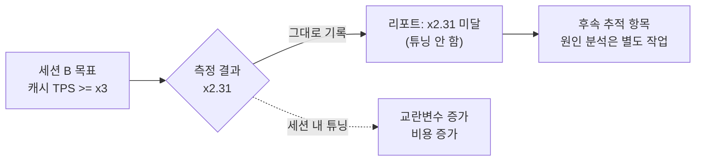
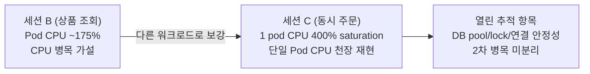
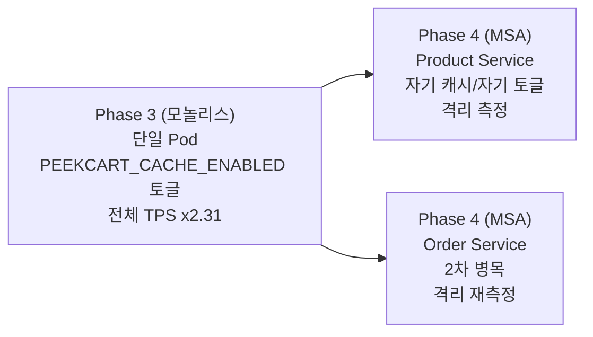

  
8편에서 상품 조회를 Redis Cache Aside 구조로 옮겼다. `@Cacheable`을 붙이고, 캐시별 TTL을 정하고, `@CacheEvict`로 무효화 경로도 잡았다.  
  
코드는 준비됐다. 남은 질문은 하나였다.  
  
> **그래서 실제로 빨라졌나?**  
  
"캐시를 붙였으니 빨라졌을 것"이라는 말은 추정이다. 이 프로젝트의 성능 요구사항은 추정이 아니라 측정을 요구한다.  
  
| 측정 항목 | 목표 | 검증 방법 |  
| --- | --- | --- |  
| 상품 목록 API 응답시간 | p99 <= 100 ms | nGrinder 부하 테스트 |  
| Redis 캐싱 개선 효과 | 캐시 미적용 대비 **TPS 3배 이상** | 캐싱 전/후 TPS 비교 (동일 GKE 환경) |  
  
이 글은 부하 테스트 **세션 B(2026-04-09)**에서 위 요구사항을 숫자로 검증하려 한 기록이다.  
  
결론부터 말하면, 목표에는 못 미쳤다.  
  
| 비교 | 결과 |  
| --- | ---: |  
| 캐시 OFF 평균 TPS | 265.0 |  
| 캐시 ON 평균 TPS | 612.7 |  
| 개선 배율 | **x2.31** |  
| 목표 | **x3 이상** |  
  
중요한 점은 이 실패를 세션 안에서 억지로 고치지 않았다는 것이다. 이 글의 핵심은 "목표 미달" 자체가 아니라, 그 미달 값을 **오염되지 않은 측정 결과**로 남기기 위해 지킨 세 가지 규율이다.  
  
1. **단일 변수 격리**: 캐시 ON/OFF만 바꾸고 이미지, 시드, 부하, 노드, 시나리오는 고정했다.  
2. **개선 비율 중심 해석**: 절대 TPS보다 같은 환경에서의 before/after 배율을 봤다.  
3. **환경 스펙 동봉**: x2.31이 어떤 조건에서 나온 값인지 함께 기록했다.  
  
---  
  
## 용어  
  
| 용어 | 이 글에서의 의미 |  
| --- | --- |  
| TPS | Transactions Per Second. 초당 처리한 요청 수. 처리량 지표 |  
| MTT | Mean Test Time. nGrinder가 측정한 평균 테스트 수행 시간(ms). p95/p99가 아니라 평균 |  
| VUser | Virtual User. 부하 발생기가 흉내 내는 동시 가상 사용자 |  
| nGrinder | Groovy 스크립트로 시나리오를 작성하고 controller/agent로 부하를 거는 도구 |  
| warm-up | 본측정 전 짧게 부하를 흘려 JIT, 커넥션 풀, 캐시 적재를 끝내는 단계 |  
| baseline | 비교 기준선. 이 글에서는 캐시 OFF 측정값 |  
| 단일 변수 실험 | 한 가지 변수만 바꾸고 나머지 조건은 모두 고정하는 실험 |  
| saturation | CPU 같은 자원이 한계에 가까워져 더 이상 처리량이 늘지 않는 상태 |  
| 가드레일 | 측정을 오염시키지 않기 위해 미리 정한 금지 규칙 |  
| histogram bucket | 응답시간을 구간별 누적 카운트로 쪼갠 시계열. p95/p99 계산에 필요 |  
  
---  
  
## 이번 글의 질문  
  
1. "캐시가 효과 있다"를 어떻게 숫자로 바꿀 수 있을까?  
2. 무엇을 고정하고 무엇만 바꿔야 측정이라고 부를 수 있을까?  
3. 왜 절대 TPS가 아니라 **개선 배율(x2.31)**을 중심으로 해석했을까?  
4. 캐시를 켰는데도 목표 x3에 못 미친 원인은 어디까지 좁혔을까?  
5. 왜 측정 결과에 환경 스펙을 같이 기록해야 할까?  
6. p95/p99 패널이 No data였는데 응답시간 근거는 어떻게 다뤘을까?  
7. 이 측정 방식은 Phase 4 MSA에서 어떻게 다시 쓰일까?  
  
---  
  
## 문제 상황: 캐시는 깔았지만 효과는 아직 추정이었다  
  
Phase 2의 첫 작업으로 상품 목록/상세 조회를 Redis Cache Aside 뒤로 옮겼다(8편). 로컬에서는 빨라졌다는 느낌이 있었지만, 느낌은 포트폴리오의 근거가 되기 어렵다.  
  
요구사항은 명확했다.  
  
> **동일 GKE 환경에서 캐시 미적용 대비 TPS 3배 이상**  
  
문제는 캐시 효과 측정이 생각보다 쉽게 오염된다는 점이다.  
  
"캐시를 켜고 부하를 걸었더니 빠르더라"는 측정이 아니라 일화에 가깝다. 측정이 되려면 두 실행 사이에서 **캐시 하나만 바뀌어야** 한다.  
  
다음 중 하나라도 달라지면 결과를 캐시 효과라고 말하기 어려워진다.  
  
- 이미지 버전  
- 시드 데이터  
- 부하 시나리오  
- VUser 수  
- 노드 스펙  
- 부하 발생기 위치  
- 애플리케이션 리소스 제한  
  
이런 값이 달라지면 TPS 상승이 캐시 덕분인지, 더 좋은 노드 덕분인지, 다른 데이터 분포 덕분인지 분리할 수 없다.  
  
게다가 세션 B는 **과금되는 1회성 GKE 세션**에서 진행했다. 클러스터를 띄운 채 디버깅과 튜닝을 반복하면 비용이 늘고, 더 큰 문제로 측정 중간에 교란변수를 직접 주입하게 된다.  
  
그래서 세션 B는 시작 전부터 범위를 분리했다.  
  
> 세션 A: 로컬 준비 → 세션 B: 상품 조회 캐시 TPS 측정 → 세션 C: 동시 주문/Kafka Lag 측정  
  
이 글은 그중 **세션 B**만 다룬다.  
  
---  
  
## 실험 설계  
  
### 1. 캐시 하나만 토글한다  
  
세션 B에서 바꾼 변수는 오직 하나다.  
  
```text  
PEEKCART_CACHE_ENABLED=false  
PEEKCART_CACHE_ENABLED=true  
```  
  
나머지는 모두 고정했다.  
  
| 항목 | 고정값 |  
| --- | --- |  
| 이미지 | `peekcart:3352c14` |  
| 시드 | 동일 `seed.sql` |  
| 시나리오 | 동일 nGrinder Groovy 스크립트 |  
| 부하 | 본측정 50 VUser |  
| 환경 | 동일 GKE 클러스터/노드 |  
  
이 구조를 가능하게 한 코드는 `CacheConfig`의 조건부 빈 등록이다.  
  
```java  
// global/config/CacheConfig.java  
@Bean  
@ConditionalOnProperty(  
    name = "peekcart.cache.enabled",
    havingValue = "true",
    matchIfMissing = true
)  
public RedisCacheManager cacheManager(RedisConnectionFactory cf) {  
    ...
}  
  
@Bean  
@ConditionalOnProperty(  
    name = "peekcart.cache.enabled",
    havingValue = "false"
)  
public CacheManager noOpCacheManager() {  
    return new NoOpCacheManager();
}  
```  
  
핵심은 캐시 OFF를 `NoOpCacheManager`로 구현했다는 점이다.  
  
캐시를 끄기 위해 `@Cacheable`을 제거하거나 캐시 모듈을 빼면 두 측정의 코드 경로가 달라진다. 그러면 캐시 외의 차이가 생긴다.  
  
반면 `NoOpCacheManager`는 `@Cacheable`과 AOP 경로를 그대로 둔 채, 캐시가 항상 miss처럼 동작하게 만든다. 즉 두 실행의 차이는 **캐시 레이어가 값을 돌려주느냐 아니냐**로 좁혀진다.  
  
### 2. 배포는 환경변수만 바꾼다  
  
캐시 OFF 측정은 다음 절차로 실행했다.  
  
```text  
kubectl set env deployment/peekcart PEEKCART_CACHE_ENABLED=false  
rollout 완료 확인  
readiness 확인  
warm-up 실행  
본측정 실행  
```  
  
캐시 ON 측정도 같은 절차를 반복했다. 이미지와 시나리오는 그대로 두고 환경변수만 바꿨다.  
  
완전히 동일한 JVM 프로세스에서 캐시만 토글한 것은 아니다. `set env` 후 rollout이 일어나기 때문이다. 대신 warm-up으로 cold-start 영향을 줄이고, 실용적으로 통제 가능한 수준에서 단일 변수 실험을 구성했다.  
  
---  
  
## 측정 환경  
  
측정 리포트는 수치보다 환경 스펙을 먼저 적었다.  
  
| 항목 | 값 |  
| --- | --- |  
| 노드 | e2-standard-4 x 1 (4 vCPU / 16 GiB) |  
| peekcart Pod | req 500m/1Gi, lim 2000m/2Gi, replicas=1 |  
| 부하 발생기 | loadgen VM (e2-standard-2, 동일 zone) |  
| nGrinder | 3.5.9-p1, agent 1, VUser 50 |  
| 이미지 | `peekcart:3352c14` |  
  
환경 스펙이 중요한 이유는 간단하다.  
  
**TPS는 환경에 종속된다.**  
  
612.7 TPS라는 숫자는 e2-standard-4 노드 1대, 앱 Pod 2 vCPU limit, 같은 zone의 loadgen VM, Internal LB 경로에서 나온 값이다. 노드를 키우거나 Pod 수를 늘리면 달라질 수 있다.  
  
따라서 이 글에서 가장 중요한 값은 절대 TPS가 아니라 다음 문장이다.  
  
> 같은 환경에서 캐시 하나만 켰더니 평균 TPS가 **x2.31**이 됐다.  
  
이 문장은 캐시라는 변수의 효과를 비교적 잘 분리한다. 다만 x2.31이 다른 환경에서도 그대로 반복된다는 뜻은 아니다. 병목이 CPU인지, DB인지, Redis인지에 따라 캐시의 개선 배율은 달라질 수 있다.  
  
---  
  
## 부하 시나리오  
  
nGrinder 스크립트는 일반적인 이커머스 조회 패턴을 근사했다.  
  
```groovy  
// 80% 목록, 20% 상세  
if (random.nextInt(100) < 80) {  
    queryList()    // GET /api/v1/products?categoryId={1..5}&page={0..49}&size=20
} else {  
    queryDetail()  // GET /api/v1/products/{id}, id in [1, 1000]
}  
```  
  
의도는 두 가지다.  
  
| 설계 | 이유 |  
| --- | --- |  
| 목록 80%, 상세 20% | 실제 조회 트래픽은 목록 비중이 더 높다 |  
| category/page/productId 랜덤 분산 | 같은 키만 반복해서 캐시 효과가 과대평가되는 것을 막는다 |  
  
측정 절차는 다음과 같이 나눴다.  
  
| 단계 | 부하 | 목적 |  
| --- | --- | --- |  
| warm-up | 1분 / 10 VUser | JIT, 커넥션 풀, 캐시 적재 |  
| 본측정 | 5분 / 50 VUser | 정상 상태 처리량 측정 |  
  
warm-up 구간은 본측정에 포함하지 않았다. 초기 cold-start 비용이 섞이면 캐시 효과가 흐려지기 때문이다.  
  
---  
  
## 측정 결과  
  
| 지표 | Baseline (캐시 OFF) | 개선 후 (캐시 ON) | 변화 |
| --- | ---: | ---: | ---: |
| TPS (평균) | 265.0 | 612.7 | **x2.31 (+131%)** |
| TPS (최고) | 328.0 | 783.0 | x2.39 (+139%) |
| 평균 테스트시간(MTT) | 188.38 ms | 81.87 ms | **-56.5%** |
| 총 실행 테스트 | 76,361 | 175,330 | x2.30 |
| 에러율 | 0% | 0% | - |
  
캐시 효과는 분명했다.  
  
- 평균 TPS는 265.0에서 612.7로 증가했다.  
- MTT는 188.38 ms에서 81.87 ms로 줄었다.  
- 에러율은 두 실행 모두 0%였다.  
  
하지만 요구사항은 "TPS 3배 이상"이었다. 측정 결과는 **x2.31**이므로 목표 미달이다.  
  
여기서 중요한 판단이 있었다.  
  
> 세션 B에서는 목표를 맞추기 위한 튜닝을 하지 않는다.    
> 나온 숫자를 그대로 기록하고, 원인 분석은 별도 작업으로 분리한다.  
  
---  
  
## 왜 x2.31을 그대로 남겼나  
  
목표 미달이 나오면 바로 튜닝하고 싶어진다.  
  
- 커넥션 풀을 키운다.  
- Redis 직렬화 방식을 바꾼다.  
- Pod 리소스를 늘린다.  
- JVM 옵션을 조정한다.  
  
하지만 세션 B의 목적은 튜닝이 아니라 **캐시 ON/OFF 비교 측정**이었다. 세션 중간에 여러 값을 바꾸면 마지막에 x3이 나오더라도 무엇이 그 결과를 만들었는지 알 수 없다.  
  
그래서 시작 전에 두 가지 가드레일을 정했다.  
  
| 가드레일 | 내용 |  
| --- | --- |  
| 1. 클러스터 안에서 디버깅하지 않는다 | 이상이 보여도 GKE 위에서 고치지 않고 로컬 재현/별도 Task로 분리한다 |  
| 2. 목표 미달도 유효한 결과로 기록한다 | 세션 중 튜닝하지 않고 나온 숫자를 그대로 남긴다 |  
  
이 판단은 비용 때문이기도 하다. GKE는 띄워 둔 시간만큼 과금된다. 하지만 더 중요한 이유는 측정 위생이다.  
  

  
측정과 튜닝을 한 세션에 섞지 않았기 때문에, x2.31은 이후 원인 분석의 깨끗한 baseline으로 남았다.  
  
---  
  
## p95/p99는 직접 검증하지 못했다  
  
요구사항의 첫 줄은 "상품 목록 API p99 <= 100 ms"였다. 이 값은 세션 B에서 직접 검증하지 못했다.  
  
Grafana `PeekCart - API & JVM` 대시보드의 API Response Time p95/p99 패널이 **No data**였기 때문이다.  
  
원인은 당시 기준으로 다음 중 하나로 추정했다.  
  
- histogram metric 미활성화  
- PromQL label 불일치  
  
세션 B에서는 이 문제를 클러스터에서 고치지 않았다. 가드레일에 따라 별도 작업으로 분리했다. 대신 nGrinder가 제공한 **MTT(평균 테스트시간)**를 응답시간의 간접 근거로 사용했다.  
  
다만 MTT에는 한계가 있다.  
  
| 한계 | 의미 |  
| --- | --- |  
| 평균이다 | p99처럼 꼬리 지연을 보여 주지 못한다 |  
| 전체 시나리오 평균이다 | 목록 80%와 상세 20%가 섞여 있다 |  
  
따라서 세션 B가 직접 증명한 것은 "p99 <= 100 ms"가 아니다.  
  
세션 B가 말할 수 있는 것은 다음 정도다.  
  
> 캐시 ON에서 평균 테스트시간이 188.38 ms에서 81.87 ms로 줄었고, TPS도 x2.31 증가했다.    
> 따라서 캐시가 응답시간과 처리량에 긍정적인 영향을 준 정황은 강하다.  
  
이 No data 문제는 이후 15편의 출발점이 됐다. 세션 B에서 빈 패널을 발견했고, 그 원인인 histogram bucket 부재를 후속 작업으로 분리했으며, 15편에서 관측성 계약을 정리했다.  
  
---  
  
## x3 미달 원인은 어디까지 좁혔나  
  
세션 B의 Grafana 스크린샷은 한 가지 단서를 줬다.  
  
| 관측 | 값 |  
| --- | --- |  
| peekcart Pod CPU 피크 | 약 175% |  
| Pod CPU limit | 2 vCPU |  
| Memory | 약 640 MiB, 안정 |  
| Pod Restarts | 0 |  
| 노드 CPU | 스파이크는 있으나 노드 전체 포화는 아님 |  
  
해석은 이렇다.  
  
캐시 히트로 DB 왕복은 줄었을 가능성이 높다. MTT가 절반 이하로 줄었고 TPS도 크게 올랐기 때문이다. 하지만 50 VUser 부하에서 앱 Pod CPU가 이미 2코어 limit 근처까지 올라갔다.  
  
즉 캐시가 DB I/O를 줄여도, 요청을 처리하는 앱 CPU가 병목이면 처리량은 더 이상 선형으로 늘지 않는다.  
  
후보는 다음과 같다.  
  
- Redis 직렬화/역직렬화 비용  
- JSON 응답 직렬화 비용  
- 커넥션 풀 대기  
- 단일 Pod CPU 한계  
  
세션 B만으로는 이 중 하나를 확정하지 못했다. 그래서 결론은 **CPU 병목 가설**로 남겼다.  
  
이 가설은 세션 C(2026-04-29)에서 강하게 보강됐다. 단, 세션 C는 상품 조회가 아니라 동시 주문 워크로드였으므로 세션 B의 원인을 그대로 확증한 것은 아니다.  
  
그래도 세션 C에서 다음 사실이 확인됐다.  
  
- 1 pod cold-start 상태에서 CPU가 400% saturation에 도달했다.  
- HPA가 1 -> 3 pod로 scale-out하자 처리량이 회복됐다.  
  
따라서 "단일 Pod 조건에서 CPU saturation이 실제로 발생한다"는 점은 다른 워크로드에서도 재현됐다.  
  

  
---  
  
## 측정하지 못한 것  
  
| 항목 | 왜 못 봤나 | 영향 |  
| --- | --- | --- |  
| p99 직접 검증 | p95/p99 패널 No data | 요구사항 첫 줄을 직접 증명하지 못함 |  
| 캐시 적중률 | `CacheMeterBinder` 미등록 | TPS/MTT로만 간접 추정 |  
| x3 미달의 확정 원인 | 세션 중 튜닝/디버깅 금지 | CPU 병목 가설까지만 좁힘 |  
| 단일 노드 한계 이후 처리량 | e2-standard-4 x 1, 단일 Pod 조건 | scale-out 이후 성능은 세션 B 범위 밖 |  
  
특히 캐시 적중률을 보지 못한 점은 아쉽다.  
  
실제 hit/miss 메트릭이 있었다면 다음 질문에 더 직접적으로 답할 수 있었다.  
  
- `@CacheEvict(allEntries=true)`가 적중률을 얼마나 깎는가?  
- 목록/상세 각각의 hit rate는 얼마인가?  
- `disableCachingNullValues()`가 기대대로 동작하는가?  
  
이 공백은 별도 학습 부채로 남겼고, 15편에서도 같은 지점을 짚었다.  
  
---  
  
## 이 측정이 보장한 것과 못한 것  
  
### 보장한 것  
  
- **캐시 효과의 정량화**: 추정을 x2.31(TPS), -56.5%(MTT)라는 숫자로 바꿨다.  
- **단일 변수 격리**: `NoOpCacheManager`로 캐시 외 코드 경로를 최대한 동일하게 유지했다.  
- **재현 가능한 조건 기록**: 노드, Pod, 도구, 이미지, 시드, 시나리오를 함께 남겼다.  
- **정직한 baseline 확보**: x3 미달을 튜닝으로 덮지 않고 후속 분석의 기준선으로 남겼다.  
  
### 보장하지 못한 것  
  
- **p99 <= 100 ms 직접 검증**: histogram bucket 부재로 p99를 계산하지 못했다.  
- **캐시 적중률 실시간 가시성**: hit/miss 메트릭이 없었다.  
- **x3 미달 원인의 단정**: CPU 병목 가설은 강하지만 세션 B만으로 확정하진 못했다.  
- **scale-out 이후 처리량**: 단일 Pod/단일 노드 조건 밖의 성능은 측정하지 않았다.  
  
요약하면, 세션 B는 캐시 효과의 정량화에는 성공했다. 하지만 p99, hit rate, x3 미달의 세부 원인은 후속 작업으로 남겼다.  
  
---  
  
## 관련 자료를 읽는 순서  
  
| 질문 | 같이 읽을 자료 | 이 글에서 연결되는 지점 |  
| --- | --- | --- |  
| `@ConditionalOnProperty`로 빈을 토글하는 법 | Spring Boot Reference, Condition Annotations | 단일 변수 실험 |  
| `NoOpCacheManager`의 동작 | Spring Framework Reference, Cache Abstraction | 캐시 OFF 구현 |  
| Cache Aside와 무효화 결정 | 학습 기록 8편 | 캐시 설계 배경 |  
| p95/p99 패널이 왜 비었나 | 학습 기록 15편 | No data와 histogram bucket |  
| 캐시 적중률을 메트릭으로 보는 법 | Micrometer `CacheMeterBinder` 문서 | 측정하지 못한 것 |  
| 평균과 p95/p99의 차이 | Google SRE Book, Monitoring Percentiles | MTT 대체의 한계 |  
| steady-state와 warm-up | nGrinder 문서 / Google SRE Book Load Testing | 부하 시나리오 |  
| 동시 주문/HPA/2차 병목 | 학습 기록 17편(예정) | x3 미달 분석 보강 |  
  
---  
  
## Phase 4 MSA에서는 어떻게 바뀌나  
  
세션 B는 모놀리스 한 덩어리의 처리량을 잰 것이다. Phase 4에서 서비스가 분리되면 측정 단위도 서비스별로 쪼개진다.  
  

  
### 그대로 가져갈 것  
  
- **단일 변수 실험**: 서비스마다 `@ConditionalOnProperty`와 `NoOpCacheManager` 토글을 복제한다.  
- **비율 중심 해석**: 서비스별 리소스 프로파일이 다르므로 절대 TPS보다 before/after 배율을 본다.  
- **환경 스펙 동봉**: 서비스마다 req/lim이 달라지므로 스펙 기록은 더 중요해진다.  
  
### 달라질 것  
  
- **측정 단위가 서비스별로 나뉜다**: Product Service 조회 TPS와 Order Service 주문 TPS를 따로 본다.  
- **2차 병목을 더 쉽게 분리한다**: 모놀리스에서 엉켜 있던 CPU, DB pool, lock contention을 서비스 단위로 나눠 볼 수 있다.  
- **캐시 hit rate가 필수 지표가 된다**: 서비스별 캐시 효과를 비교하려면 TPS뿐 아니라 hit/miss 메트릭이 필요하다.  
  
Phase 4에 들어가기 전에는 다음 세 가지를 준비해야 한다.  
  
1. 15편에서 정리한 p95/p99 histogram metric을 기본 측정 세트에 포함한다.  
2. `CacheMeterBinder`로 캐시 hit/miss를 수집한다.  
3. HikariCP wait, Redisson lock latency, Pod readiness 전이를 함께 수집해 2차 병목을 분리한다.  
  
세션 B가 남긴 결론은 단순하다.  
  
> 캐시 효과는 있었다. 평균 TPS는 x2.31 증가했다.    
> 하지만 목표 x3에는 못 미쳤고, 그 미달을 숨기지 않았기 때문에 다음 실험의 기준선이 생겼다.
