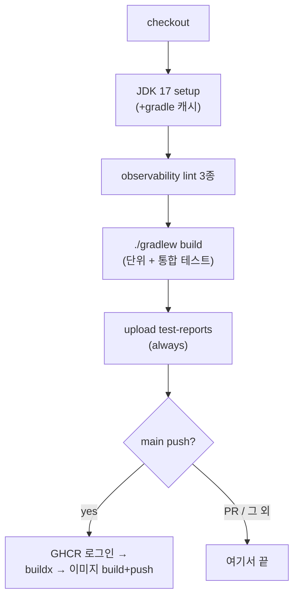
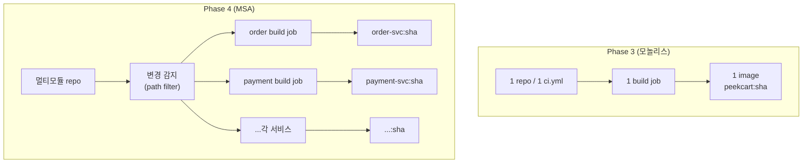

12편까지(도메인 구현 → 성능·정합성 보강)는 "무엇을 어떻게 구현했는가"가 주제였다. 인프라를 본격적으로 다루는 Phase 3부터는 질문이 바뀐다. **"이 코드가 정말 동작하는지를 내 노트북 바깥에서 어떻게 증명하는가"**, 그리고 **"검증된 코드를 어떻게 배포 가능한 한 덩어리로 만드는가"** 를 다룬다.

문제의식은 단순하다. 로컬에서 `./gradlew build`(프로젝트를 빌드·테스트하는 명령)가 초록불이어도 그건 *내 머신의 JDK, 내 Docker 데몬* 위에서의 성공일 뿐이다. 동료의 머신이나 깨끗한 서버에서도 같다는 보장은 없다. 게다가 빌드의 산출물인 `app.jar`(실행 가능한 자바 패키지 한 개)은 그 자체로는 "어디서나 똑같이 뜨는 무언가"가 아니다 — 실행에 필요한 JRE 버전, OS 라이브러리, 실행 계정이 환경마다 다르기 때문이다.

그래서 두 가지가 필요하다. **CI**는 앞 문제(검증 자동화·강제)를, **Docker 이미지**는 뒤 문제(실행 환경까지 함께 묶은 산출물)를 맡는다. 이 둘은 `ci.yml`이라는 설정 파일 하나에서 만난다. **테스트를 통과한 코드만 이미지로 만들어 레지스트리에 올린다.**

이 글에서 쓰는 용어는 다음 뜻으로 읽으면 된다.

| 용어 | 이 글에서의 의미 |
| --- | --- |
| CI (Continuous Integration) | 코드를 합칠 때마다 자동으로 빌드·테스트를 돌려 "합쳐도 깨지지 않음"을 기계가 검증하는 것. PeekCart에선 GitHub Actions가 push/PR마다 `ci.yml`을 실행 |
| 워크플로우 / job / step | GitHub Actions 단위. 워크플로우(`ci.yml`) 안에 job(`build`)이 있고, job은 step(체크아웃, JDK 설치, 빌드…)의 순차 나열 |
| runner | job이 실제로 도는 가상 머신. PeekCart는 `ubuntu-latest`(GitHub 호스티드, amd64). Docker 데몬이 미리 깔려 있다 |
| 품질 게이트(quality gate) | "이걸 통과 못 하면 머지 못 한다"는 자동 관문. 여기선 lint + 단위/통합 테스트 |
| 멀티스테이지 빌드 | 한 `Dockerfile`을 빌드 단계(JDK로 jar 생성)와 런타임 단계(JRE로 jar 실행)로 나눠, 최종 이미지에 빌드 도구를 남기지 않는 기법 |
| 레이어 캐싱(Docker) | Dockerfile의 각 명령이 만드는 이미지 레이어를, 입력이 바뀌지 않으면 재사용하는 것. 의존성 설치를 소스 변경과 분리하면 매 빌드 의존성 재다운로드를 피한다 |
| Testcontainers | 테스트 시작 시 실제 MySQL/Redis/Kafka를 Docker 컨테이너로 띄우는 라이브러리. "mock이 아니라 진짜 DB"로 통합 테스트(8~12편의 `*IntegrationTest`) |
| `@ServiceConnection` | Testcontainers가 띄운 컨테이너의 접속 정보를 Spring `DataSource`/Redis/Kafka 설정에 자동 주입하는 Spring Boot 애너테이션. 수동 `@DynamicPropertySource` 배선을 없앤다 |
| GHCR | GitHub Container Registry (`ghcr.io`). 빌드한 Docker 이미지를 올려 두는 저장소 |
| 이미지 태그 | 이미지의 이름표. `:latest`(최신 편의용)와 `:<git sha>`(커밋 추적용)를 함께 단다. 둘 다 덮어쓸 수 있는 가변 포인터라 *추적*은 되지만 *바이트 동일성*은 보장하지 않는다(그건 digest의 몫) |
| concurrency (GHA) | 같은 ref에 워크플로우가 겹쳐 돌 때 이전 실행을 자동 취소하는 설정. top-level이면 PR뿐 아니라 main push에도 적용된다 |

이번 학습에서 확인하고 싶은 질문은 다음과 같다.

1. "로컬 빌드 성공"과 "검증됨"은 왜 다른가? CI는 그 간극의 *무엇*을 닫는가?
2. CI를 단일 job으로 둔 이유는 무엇인가? test와 이미지 push를 분리하지 않은 트레이드오프는?
3. Testcontainers 통합 테스트를 CI에서 **추가 설정 없이** 돌릴 수 있는 이유는 무엇인가?
4. 멀티스테이지 Dockerfile은 무엇을 분리하는가? 빌드 단계와 런타임 단계를 나누면 무엇이 좋아지는가?
5. Dockerfile의 COPY 순서와 의존성 레이어 캐싱은 무슨 관계인가? 왜 파일명을 `app.jar`로 고정했나?
6. 이미지 빌드를 **main push에서만** 하는 결정은 무엇을 보호하고, 무엇을 검증하지 못하게 하는가?
7. D-009(통합 테스트 인프라 분산)는 왜 생겼고, 1차 해결은 무엇을 고쳤으며 무엇을 남겼는가?
8. Phase 4에서 서비스가 N개로 나뉘면 이 단일 파이프라인은 어떻게 바뀌어야 하는가?

---

## 문제 상황: "빌드가 된다"가 증명하지 못하는 것

`./gradlew build`가 로컬에서 성공한다고 하자. 이 초록불이 *증명하지 못하는* 것부터 짚어 보자.

- **환경 독립성**: 내 머신엔 JDK 17이 깔려 있고 Docker 데몬이 떠 있어, 통합 테스트가 Testcontainers로 MySQL/Redis/Kafka를 붙인다(미리 띄워 둔 compose MySQL이 아니라, 그건 앱 로컬 실행용이다). 동료 머신, 혹은 깨끗한 서버에서도 같은 결과인지는 모른다. "내 머신에선 되는데"는 여기서 출발한다.
- **합쳤을 때의 정합성**: 내 브랜치 단독으로는 통과해도, main에 합친 상태에서 통과하는지는 별개다. 두 PR이 각자 통과해도 합치면 깨지는 충돌이 있다.
- **검증의 강제성**: 통합 테스트를 *돌렸는지* 자체가 사람 손에 달려 있다. 바쁘면 단위 테스트만 돌리고 통합은 건너뛴 채 PR을 올린다. "통과했다"는 자기 보고이지 기계 검증이 아니다.

CI는 이 세 간극을 닫는다. **깨끗한 runner**(매번 새로 뜨는 ubuntu VM)에서, **PR과 push마다 빠짐없이**, **사람 개입 없이** 빌드와 전체 테스트를 실행한다. PeekCart의 CI 트리거는 이렇다.

```yaml
# .github/workflows/ci.yml
on:
  push:
    branches: [ main ]
  pull_request:
    branches: [ main ]

concurrency:
  group: ci-${{ github.ref }}
  cancel-in-progress: true
```

`pull_request`로 **머지 전** 게이트를, `push`(main)로 **머지 후** 산출물 생성을 잡는다. `concurrency`는 같은 ref에 커밋이 연이어 올라오면 이전 실행을 취소해 runner 낭비를 막는다. PR 브랜치에서는 최신 커밋만 검증하면 되기 때문이다. 다만 이 설정은 **top-level**이라 그룹 키가 `ci-${{ github.ref }}`로 PR 브랜치뿐 아니라 `refs/heads/main`에도 똑같이 적용된다. 즉 **main에 push가 연이어 발생하면 앞선 커밋의 실행(이미지 발행 포함)이 취소될 수 있다.** 「한계」절에서 이 설정이 이미지 정책과 충돌하는 이유를 본다.

그런데 검증된 코드를 손에 쥐어도 문제가 하나 더 남는다. **그 코드를 어떻게 "어디서나 똑같이 뜨는 한 덩어리"로 만드는가.** `app.jar` 하나만으로는 부족하다. 실행하려면 JRE가 필요하고, JRE 버전·OS 라이브러리·실행 유저가 환경마다 다르면 또 "내 머신에선 되는데"가 재발한다. 그래서 jar를 **JRE·OS·실행 유저까지 함께 묶은 Docker 이미지**로 만든다. CI가 "이 코드는 검증됐다"를 보장하고, 이미지가 "검증된 코드를 어디서나 같은 환경에서 실행한다"를 보장한다. `ci.yml`은 이 둘을 한 줄로 잇는다. **테스트를 통과한 커밋만 이미지로 만들어 GHCR에 push**.

---

## 선택한 설계

### 1. 단일 job. 조건부 step으로 단순하게 유지한다

CI를 설계할 때 흔한 갈림길은 "test job과 build/push job을 나눌까"이다. 관심사를 분리하려면 둘로 나눌 수 있다. PeekCart는 **단일 `build` job**을 선택했다.



당시 작업 할 때 그 이유를 **"test와 Docker push를 분리하면 artifact 전달이 필요해 복잡도가 증가한다. 조건부 step으로 해결."** 이라 적었다. 이 근거는 한 가지 분리 방식 — test job이 만든 jar를 `upload-artifact`/`download-artifact`로 image job에 넘기는 *jar 전달형* 분리 — 을 가정한 것이다. job 간에는 새 runner가 뜨고 워크스페이스를 공유하지 않으므로 배선이 늘어난다. 그런데 **엄밀히 따지면 artifact 전달은 필수가 아니다.** 현재 `Dockerfile`은 stage 1에서 소스로부터 jar를 *다시 빌드*하므로(`bootJar`), image job이 checkout 후 `docker build`만 해도 된다. jar를 넘길 필요가 없다(대신 빌드를 두 번 하는 낭비는 생긴다). 그래서 단일 job의 실질적인 근거는 "artifact 전달 회피"라기보다 **"조건부 step 하나로 끝나는 구성의 단순함이, 분리로 얻는 병렬성·관심사 분리보다 지금 규모에서는 이득"**이라고 보는 편이 정확하다. 이미지 관련 step에 `if: github.ref == 'refs/heads/main' && github.event_name == 'push'`를 달아, PR에서는 빌드·테스트까지만 실행하고 이미지 step은 모두 건너뛴다.

### 2. Testcontainers를 CI에서 추가 설정 없이 실행한다

PeekCart의 통합 테스트(8~12편의 `ProductCacheIntegrationTest`, `OutboxKafkaIntegrationTest`, `ShedLockIntegrationTest` 등)는 mock이 아니라 **실제 MySQL/Redis/Kafka**를 Testcontainers로 띄운다. 보통 CI에서는 Docker-in-Docker(DinD) 설정이 필요한지 고민하게 되지만, PeekCart에는 추가 설정이 **하나도 없다**. 이유는 둘이다.

- `ubuntu-latest` runner엔 **Docker 데몬이 이미 깔려 있다.** Testcontainers가 그 데몬에 바로 컨테이너를 띄운다. 별도 DinD는 필요하지 않다.
- 테스트가 `@ServiceConnection`을 쓴다. Testcontainers가 띄운 컨테이너의 host/port를 Spring 설정에 **자동 주입**하므로, "CI에선 접속 정보가 다르다" 같은 환경 분기 코드가 없다.

그래서 `ci.yml`엔 Testcontainers를 위한 step이 따로 없다. `./gradlew build` 한 줄이 단위 테스트와 통합 테스트를 함께 실행하고, 통합 테스트가 알아서 컨테이너를 띄운다. "CI 환경 = 로컬 환경"이 거의 그대로 성립하는 셈이다. Testcontainers가 *테스트 코드 안에* 인프라 요구사항을 선언하기 때문에 가능한 구조다. CI YAML은 인프라를 알 필요가 없다.

### 3. 멀티스테이지 Dockerfile — 런타임에는 실행 파일만 남긴다

이미지를 만드는 가장 단순한 방법은 "JDK 이미지 하나에서 빌드하고 그대로 실행"하는 것이다 — 단일 stage에서 `./gradlew bootJar`를 실행한 뒤 같은 이미지에 `ENTRYPOINT`를 거는 식이다. 하지만 그러면 최종 이미지에 **Gradle, 소스코드, JDK 컴파일러, 빌드 캐시**가 모두 남는다. 실행에는 필요 없지만 이미지 크기와 공격 표면을 키운다. (참고로 JDK 베이스에 jar *만* COPY하면 Gradle·소스는 남지 않지만, JRE 대신 JDK를 사용하므로 컴파일러 등 런타임에 불필요한 요소는 여전히 남는다.) 멀티스테이지는 빌드와 런타임을 두 stage로 나눈다.

```dockerfile
# Stage 1: Build — JDK로 jar를 만든다
FROM eclipse-temurin:17-jdk AS build
WORKDIR /app
COPY gradlew settings.gradle build.gradle ./
COPY gradle/ gradle/
RUN chmod +x gradlew && ./gradlew dependencies --no-daemon   # ← 의존성만 먼저
COPY src/ src/
RUN ./gradlew bootJar -x test --no-daemon

# Stage 2: Runtime — JRE로 jar만 실행한다
FROM eclipse-temurin:17-jre
WORKDIR /app
COPY --from=build /app/build/libs/app.jar app.jar           # ← stage 1 산출물만 가져옴
RUN groupadd -r appgroup && useradd -r -g appgroup appuser
USER appuser                                                 # ← non-root 실행
EXPOSE 8080
ENTRYPOINT ["java", "-jar", "app.jar"]
```

핵심은 `COPY --from=build`다. 최종 이미지(stage 2)는 stage 1에서 **`app.jar` 한 파일만** 가져온다. Gradle도 소스도 JDK도 따라오지 않는다. 베이스도 `jdk`가 아니라 `jre`(실행 전용, 컴파일러 없음)라 더 가볍다. 결과 이미지는 약 193MB로 측정됐다.

설계 결정 세 가지를 짚는다.

- **`jre` 베이스, 그러나 alpine은 아니다.** 더 작은 `jre-alpine`을 쓰지 않은 것은 의도된 타협이다. Alpine 자체가 ARM64를 지원하지 않는 것은 아니지만, **`eclipse-temurin:17-jre-alpine` 공식 태그가 amd64만 제공**해 Apple Silicon(ARM64) 맥에서는 로컬 빌드가 불가능하다. CI(amd64)에서는 빌드할 수 있지만, 로컬 개발 호환성을 우선해 non-alpine을 선택했다. 이미지 크기 수십 MB보다 "개발자가 자기 맥북에서 이미지를 빌드해 볼 수 있는가"를 우선했다.
- **non-root 실행.** `appuser`를 만들어 `USER appuser`로 전환한다. 컨테이너가 침해되더라도 root가 아니라 권한이 제한된다 — 컨테이너 보안의 기본기다.
- **stage 1에서 `bootJar -x test`로 테스트를 건너뛴다.** 이미지 빌드 경로는 테스트를 *다시* 돌리지 않는다. 테스트 책임은 CI의 `./gradlew build`가 이미 맡았으므로, 이미지 빌드에서 또 실행하면 중복이고 느리다. **"테스트는 CI가, 패키징은 Dockerfile이"** 책임을 나눈 것이다.

### 4. 의존성 레이어 캐싱과 `.dockerignore`

Dockerfile의 COPY 순서는 우연이 아니다. `build.gradle`/`gradlew`를 먼저 COPY하고 `./gradlew dependencies`를 **소스 COPY 전에** 실행한 뒤, `src/`를 COPY한다. Docker는 각 명령을 레이어로 캐싱하고, **입력이 바뀌지 않은 레이어는 재사용**한다. 소스만 수정하고 `build.gradle`은 그대로라면, 이 의존성 레이어가 캐시에 적중해 **대부분의 의존성 재다운로드를 건너뛴다.** 다만 `dependencies` 태스크는 본래 의존성 트리를 출력·해석하는 리포트 태스크라 `bootJar`가 실제로 쓰는 모든 artifact를 100% 선다운로드한다고 보장하지는 않는다. 그래서 이는 **부분적인 캐시 최적화**다. 그래도 소스는 자주 바뀌고 의존성은 드물게 바뀌므로, 변하는 것을 뒤로 미루는 배치만으로도 적중률이 크게 오른다.

`.dockerignore`는 빌드 컨텍스트를 줄인다. Docker는 빌드 시작 시 디렉터리 전체를 데몬에 보내는데, `.git`·`build`·`docs`·`k8s`·`*.md`처럼 이미지에 불필요한 것을 제외한다.

```text
.git
.github
.gradle
.idea
build
docs
k8s
docker-compose.yml
*.md
```

여기에 더해 CI는 GitHub Actions 캐시로 Docker 레이어를 **빌드 간에도** 공유한다(`cache-from: type=gha`, `cache-to: type=gha,mode=max`). runner는 매번 새로 뜨므로 로컬 레이어 캐시가 없는데, GHA 캐시가 그 공백을 메운다.

마지막으로 **JAR 파일명을 `app.jar`로 고정**했다. `build.gradle`에서 `bootJar { archiveFileName = 'app.jar' }`로 지정하고, `jar { enabled = false }`로 plain JAR을 끈다. Dockerfile의 `COPY --from=build /app/build/libs/app.jar`이 **글로브(`*.jar`) 없이 정확한 한 파일**을 가리키게 하기 위해서다. 버전이 붙은 파일명(`peekcart-0.0.1-SNAPSHOT.jar`)이나 plain JAR까지 섞이면 `*.jar`가 복수 매칭돼 빌드가 깨진다. 이름을 고정해 그 모호성을 원천 제거했다.

---

## 구현 구조: `ci.yml` 한 줄씩

전체 흐름을 step 단위로 따라가 보자.

```yaml
jobs:
  build:
    runs-on: ubuntu-latest
    permissions:
      contents: read
      packages: write          # ← GHCR push에 필요한 최소 권한
    steps:
      - uses: actions/checkout@v4
      - uses: actions/setup-java@v4
        with:
          distribution: temurin
          java-version: 17
          cache: gradle         # ← Gradle 의존성/래퍼 캐시
      - run: chmod +x gradlew
```

먼저 코드를 받고(`checkout`), JDK 17을 설치하고(`setup-java`, `cache: gradle`로 Gradle 의존성 캐싱), `gradlew`에 실행 권한을 준다. `permissions`를 `contents: read` + `packages: write`로 **최소화**한 점이 핵심이다. 이 job이 할 수 있는 일은 코드 읽기와 패키지(이미지) 쓰기뿐이다.

```yaml
      - name: Install lint dependencies
        run: python3 -m pip install --user pyyaml
      - name: Set up kubectl (for ServiceMonitor lint)
        uses: azure/setup-kubectl@v4
      - name: Run observability lints
        run: |
          bash scripts/observability-ssot-lint.sh
          bash scripts/servicemonitor-selector-lint.sh
          bash scripts/observability-promql-lint.sh
```

`./gradlew build` **앞에** "관측성 lint" 스크립트 3종이 있다. lint는 코드를 실행하지 않고 설정 파일만 훑어 규칙 위반을 찾는 정적 검사를 뜻하고, 여기서 검사 대상은 **모니터링 설정**이다(메트릭 수집·대시보드·알림 설정이 서로 어긋나지 않는지 확인). 이는 D-005라는 부채 — 모니터링 관련 설정이 여러 파일에 흩어져 한 곳만 고치면 전체 일관성이 깨지기 쉬웠던 문제 — 를 막기 위해 추가했다(자세한 내용은 관측성을 다루는 **15편**으로 넘긴다).

여기서 이 글의 관심사는 검사 내용이 아니라 **배치 순서**다. lint는 몇 초면 끝나고 빌드·테스트는 몇 분이 걸린다. 그러니 **싸고 빠른 검사를 비싼 빌드 앞에 두면**, 설정 규칙을 어겼을 때 빌드 비용을 치르기 전에 바로 실패한다. 이것이 앞서 말한 fail-fast이고, 비싼 단계일수록 뒤로 미루는 배치다.

```yaml
      - run: ./gradlew build --no-daemon
        env:
          SPRING_PROFILES_ACTIVE: test
      - uses: actions/upload-artifact@v4
        if: always()              # ← 테스트가 실패해도 리포트는 올린다
        with:
          name: test-reports
          path: build/reports/
```

이 한 줄(`./gradlew build`)이 **단위 테스트와 통합 테스트를 함께** 실행한다(통합 테스트는 Testcontainers로 실제 인프라 기동). 바로 뒤 `upload-artifact`의 `if: always()`가 중요하다. 빌드가 **실패해도** 테스트 리포트를 아티팩트로 올린다. 실패했을 때야말로 리포트가 필요하기 때문이다. 성공 시에만 올리면 정작 디버깅이 필요한 순간 리포트를 확인할 수 없다.

```yaml
      - uses: docker/login-action@v3
        if: github.ref == 'refs/heads/main' && github.event_name == 'push'
        with: { registry: ghcr.io, username: ${{ github.actor }}, password: ${{ secrets.GITHUB_TOKEN }} }
      - uses: docker/setup-buildx-action@v3
        if: github.ref == 'refs/heads/main' && github.event_name == 'push'
      - name: Set image name lowercase
        if: github.ref == 'refs/heads/main' && github.event_name == 'push'
        run: echo "IMAGE_NAME_LC=${IMAGE_NAME,,}" >> "$GITHUB_ENV"
      - uses: docker/build-push-action@v5
        if: github.ref == 'refs/heads/main' && github.event_name == 'push'
        with:
          context: .
          push: true
          cache-from: type=gha
          cache-to: type=gha,mode=max
          tags: |
            ${{ env.IMAGE_NAME_LC }}:latest
            ${{ env.IMAGE_NAME_LC }}:${{ github.sha }}
```

이미지 관련 step 4개는 모두 같은 `if`로 묶여 **main push에서만** 실행된다. PR에서는 모두 건너뛴다. `${IMAGE_NAME,,}`는 bash의 소문자화 문법이다. GHCR은 이미지 경로를 소문자로만 받으므로 owner 이름을 소문자로 바꾼다. 태그는 `:latest`(편의용 최신 표식)와 `:<sha>`(그 이미지를 만든 git 커밋 해시)를 **함께** 단다. 운영에서 "지금 떠 있는 이미지가 어느 커밋인가"를 SHA로 역추적할 수 있게 하는 추적성 장치다(이후 부하 측정에서 실제로 이 SHA 태그로 "이 측정 결과가 어느 빌드였나"를 되짚었다. 16~17편의 부하 테스트 편에서 다룬다).

정리하면 `ci.yml`의 멘탈 모델은 이렇다. **PR은 "게이트"까지(lint + build + test), main push는 "게이트 + 산출물"까지(+ 이미지 build/push).** 같은 파일이 두 역할을 조건부 step으로 겸한다.

---

## 한계와 트레이드오프

### Dockerfile은 PR에서 검증되지 않는다 — 가장 큰 사각지대

이것이 단일 job + 조건부 step 설계에서 가장 먼저 짚어야 할 공백이다. 이미지 빌드 step은 `if: ... == 'main' && push`라 **PR에서는 실행되지 않는다.** 그래서 누군가 Dockerfile을 깨뜨리는 PR(예: COPY 경로 오타, 베이스 이미지 변경 실수)을 올려도 **PR CI는 초록불**이다 — Dockerfile을 검증하지 않았기 때문이다. 문제는 그 PR이 main에 머지되고 **push가 트리거된 뒤에야** 드러난다. 즉 "main이 깨지는" 가장 피하고 싶은 형태로 늦게 발견된다.

게다가 Dockerfile의 빌드 경로(`bootJar -x test`)는 CI의 `./gradlew build`와 **다른 명령**이다. CI가 검증하는 것은 "테스트 포함 빌드가 되는가"이고, Dockerfile이 하는 일은 "테스트 없이 jar를 패키징하는가"다. 둘은 겹치지만 같지 않아서, **CI가 초록불이어도 이미지 빌드가 깨질 수 있다**(반대도 가능). 이 공백을 닫으려면 PR에서도 `docker build`를(push 없이) 한 번 실행해 Dockerfile 자체를 검증하는 step이 필요하지만, 현재는 없다. Dockerfile이 거의 바뀌지 않아 비용 대비 우선순위를 낮췄지만, **명백한 검증 공백**으로 남아 있다.

### top-level concurrency가 "모든 main 커밋 = 이미지 1개"를 깬다

`concurrency`가 top-level이고 그룹 키가 `ci-${{ github.ref }}`라, main에 대한 모든 push가 `refs/heads/main`이라는 **하나의 그룹**을 공유한다. `cancel-in-progress: true`와 합쳐지면, 커밋 A의 워크플로우가 이미지 빌드 step에 도달하기 전에 커밋 B가 push될 경우 **A의 실행이 모두 취소된다** — A의 이미지는 GHCR에 올라가지 않는다. 그래서 "main push마다 이미지가 남는다"는 보장이 없다. 이는 곧 **이미지 정책 결정**과 직결된다.

- **"최신 main만 배포하면 된다"**면 지금 설정이 맞다 — 앞선 커밋의 이미지는 남기지 않아도 된다.
- **"모든 main 커밋의 이미지를 추적·보존해야 한다"(롤백·재현)**면 지금 설정은 버그다. concurrency를 빌드/테스트 step에만 한정하고 이미지 push는 취소 대상에서 빼거나, 그룹 키에 `github.sha`를 섞어 push 단위로 격리해야 한다.

뒤의 「증명」절에서 말하는 SHA 태그 추적성은 *이미지가 일단 올라갔을 때* 유효한 이야기다. 반면 이 절은 *그 이미지가 애초에 올라가지 않을 수도 있다*는, 한 단계 더 앞의 공백이다. 이 둘을 함께 봐야 "추적 가능한 이미지를 빠짐없이 남긴다"가 비로소 성립한다.

### 이미지가 "실제로 뜨는가"는 CI가 검증하지 않는다

CI는 이미지를 **빌드하고 레지스트리에 올리기(push)**까지만 한다. 그 이미지를 실제로 실행해 `/actuator/health`(앱이 살아 있는지 알려주는 상태 점검 엔드포인트)가 200을 응답하는지, 앱이 정말 부팅되는지는 **확인하지 않는다.** 작업 기록에도 "이미지 기능성 미검증 — 실제 환경에서 뜨는지는 한참 뒤 부하 테스트 때 처음으로 확인"이라고 남아 있다. 즉 빌드 성공 ≠ 런타임 정상이다. ENTRYPOINT가 틀렸거나 런타임에만 필요한 설정이 빠져도 이미지 빌드는 성공한다. smoke test(컨테이너를 띄우고 health를 한 번 호출하기)를 CI에 넣으면 이 공백을 닫을 수 있지만, 지금은 그 책임이 배포 시점으로 미뤄져 있다.

### D-009 — Testcontainers의 편의성이 만든 부채

「선택한 설계」에서 "Testcontainers를 CI에서 추가 설정 없이 실행한다"는 점을 장점으로 들었다. 그 편의성의 대가가 D-009다(D-xxx는 이 프로젝트가 발견한 기술 부채에 매기는 추적 번호다). 통합 테스트가 *각자* 인프라를 선언하기 쉽다 보니, **통합 테스트 7개가 클래스마다 따로 MySQL/Redis/Kafka 컨테이너를 띄우게** 됐다. 공통 베이스 클래스가 없어 설정도 제각각이고, 그 결과 **Spring 컨텍스트 캐시가 적중하지 않는다.** 풀어 쓰면 — Spring은 테스트가 같은 설정을 쓰면 무거운 애플리케이션 컨텍스트(스프링이 띄우는 객체 묶음)를 한 번만 만들어 여러 테스트가 재사용하게 해 주는데, 테스트마다 설정이 달라 재사용하지 못하고 **테스트 클래스마다 컨텍스트를 처음부터 새로 띄운다**는 뜻이다. 통합 테스트가 늘수록 CI 시간과 유지보수 비용이 함께 악화될 구조다.

**1차 해결(2026-04-16)**에서는 `AbstractIntegrationTest`(cleanup 규약: `cleanDatabase()` FK 역순 DELETE + `cleanCaches()`)와 `IntegrationTestConfig`(no-op `SlackPort` mock)를 도입해 7개 테스트를 마이그레이션했다. inner TestConfig 2개를 제거하고 cleanup·mock 규약을 단일화했다(244건 전체 통과).

| 1차에서 고친 것 | 1차에서 *안* 고친 것 (2차 목표로 남음) |
| --- | --- |
| cleanup 정책 단일화(`cleanDatabase`/`cleanCaches`) | **컨테이너 수명 모델** — 여전히 per-class 기동 |
| SlackPort mock 공통화 | **Spring 컨텍스트 캐시 적중** — `@Import`/`@TestPropertySource` 차이로 미적중 |
| 신규 테스트 작성 규약 확립 | unit/integration job 분리, 병렬 전략 |

이 작업을 시작하기 전 "지금 손볼 가치가 있는가"를 검토한 내부 리뷰 문서에 한 원칙을 명시했다. **"컨테이너 재사용과 컨텍스트 재사용을 한 번에 하지 말 것."** 
테스트마다 설정과 정리(cleanup) 방식이 달라서 처음부터 모든 테스트를 하나의 완전 공유 구조로 밀어붙이면 속도를 얻기는커녕 flaky 테스트(실행할 때마다 결과가 달라지는 불안정 테스트) 위험만 커진다. 
그래서 1차에서는 *규약 표준화*만 하고 *공유 최적화*는 2차로 미뤘다. 이는 "덜 끝낸 것"이 아니라 **불안정을 피하기 위해 의도적으로 단계를 나눈 것**이다. 12편에서도 ShedLock 테스트가 "락이 배선돼 동작한다"까지만 검증하고 "여러 인스턴스 중 하나만 실행된다"는 핵심 보장은 공백으로 남겼다. 여기서도 마찬가지로 "표준화됨"은 달성하되 "최적화됨"은 후속 과제로 놔두었다.

### 단일 job의 비용 — fail-fast가 약하다

단위 테스트와 통합 테스트가 한 `test` 태스크에서 함께 실행된다. 그래서 **단위 테스트만 먼저 빠르게 실행해 일찍 실패시키는** fail-fast가 약하다. 단위 테스트가 실패하더라도, 느린 통합 테스트(컨테이너 기동 포함)가 끝나야 결과를 확인할 수 있다. job을 unit/integration으로 나누면 개선되지만, 이는 D-009 2차 목표에 묶여 있다. 단일 job은 현재 규모에는 충분하지만, 규모가 커지면 비용이 커지는 구조다.

### Gradle 캐시와 Docker 레이어 캐시는 별개다

`setup-java`의 `cache: gradle`은 **Gradle 의존성**을 캐싱한다(테스트·빌드 단계용). Docker `type=gha` 캐시는 **이미지 레이어**를 캐싱한다(이미지 빌드 단계용). 둘은 서로 다른 캐시이며, 작동하는 단계도 다르다. 게다가 이미지 빌드는 Dockerfile stage 1에서 **Gradle 의존성을 다시 받는다** — `setup-java` 캐시는 runner의 Gradle 홈에 있고 빌드 컨텍스트 안에는 없으므로, Dockerfile의 `./gradlew dependencies`에는 쓰이지 않는다. 그래서 main push 시에는 의존성을 (CI 빌드용 + 이미지 빌드용) 사실상 두 번 받는 비효율이 있다. Docker 레이어 캐시가 두 번째 다운로드를 보완하지만, "한 빌드 안에서 Gradle이 두 맥락으로 실행되는" 중복은 단일 job + 멀티스테이지 조합의 구조적 비용이다.

---

## CI가 증명한 것 (과 못한 것)

CI 파이프라인을 "테스트"의 관점에서 보면, 보장하는 것과 보장하지 못하는 것이 갈린다.

**증명하는 것**

- **깨끗한 환경에서의 빌드·테스트 검증.** 매번 새 ubuntu runner에서 단위 + 통합 테스트(실제 MySQL/Redis/Kafka) 전체가 통과함을 PR·push마다 자동 실행한다(D-009 1차 마이그레이션 시점 244건, 이후 증가). "내 머신에선 되는데"의 환경 의존을 닫는다.
- **머지 전 가시성(단, 차단은 아직 아니다).** PR마다 CI가 실행돼 빌드·테스트·lint 결과를 빨간불/초록불로 *보여준다.* 그러나 현재 main에는 branch protection·ruleset이 설정돼 있지 않아(`protected: false`), 빨간불이어도 머지를 **기계적으로 막지는 못한다** — 막으려면 `build`를 required status check로 지정해야 한다. 지금은 "검증을 보여주는" 단계이지 "검증을 강제하는" 단계가 아니다.
- **검증된 커밋의 산출물 추적성.** push된 main 커밋에 `:latest` + `:<sha>` 태그로 이미지를 GHCR에 올려, "어느 커밋이 어느 이미지냐"를 SHA로 역추적할 수 있다. 단 이건 **추적성**이지 **재현성**이 아니다 — `:<sha>` 태그도, `eclipse-temurin:17-jre` 같은 base 태그도 덮어쓸 수 있는 가변 포인터다. "이 이미지가 바이트 단위로 그 빌드와 동일함"을 보장하려면 image digest(`@sha256:...`)나 base image digest 고정이 따로 필요하다(현재 미적용). 게다가 「한계」절의 concurrency 때문에 **모든** main 커밋이 이미지를 남긴다는 보장도 없다.

**증명하지 못하는 것**

- **Dockerfile의 정상성** — PR에서 실행하지 않으므로, 깨져도 main push 전에는 모른다.
- **이미지의 런타임 기동** — 빌드만 하고 실행하지 않으므로, "뜨는가"는 배포 시점까지 검증하지 않는다.
- **통합 테스트의 효율적 구조** — 통과는 하지만 per-class 컨테이너·컨텍스트 미적중으로, 테스트가 늘면 시간이 비선형으로 악화될 여지(D-009 2차).

11편(중복 메시지를 한 번만 처리하는 멱등성)·12편(스케줄러 중복 실행 방지)에서도 본 패턴이 여기서 반복된다: **핵심 동작은 단단히 검증하되, 가장 중요한 보장의 일부는 테스트 공백으로 정직하게 남겨 둔다.** CI에서 그 공백은 "Dockerfile·런타임·테스트 효율" 세 가지다.

---

## 자료는 어떤 질문에 연결해서 읽을까

| 질문 | 같이 읽을 자료 | 이 글에서 연결되는 지점 |
| --- | --- | --- |
| CI 워크플로우 문법(트리거/job/step/if) | GitHub Actions 공식 문서, *Workflow syntax* | `ci.yml` 전반 |
| 멀티스테이지 빌드와 레이어 캐싱 | Docker 공식 *Multi-stage builds* / *Build cache* | Dockerfile 절 |
| Testcontainers + `@ServiceConnection` | Spring Boot Reference, *Testcontainers at Development Time* | "추가 설정 없이 실행한다" 절 |

---

## Phase 4 MSA에서는 어떻게 바뀌는가

지금까지의 단일 파이프라인은 "모놀리스 하나를 빌드해 이미지 하나를 만든다"는 전제 위에 섰다. Phase 4에서 서비스가 N개로 나뉘면 이 전제도 달라진다.



**그대로 가는 것**

- **멀티스테이지 + non-root + `.dockerignore`의 이미지 빌드 패턴.** 서비스가 늘어도 각 서비스 이미지를 만드는 방식 자체는 동일하다. Dockerfile 한 벌을 서비스마다 재사용하거나 공통 base 이미지로 추출한다.
- **"테스트는 CI가, 패키징은 Dockerfile이"의 책임 분리.** 서비스별로 나뉘어도 이 원칙은 유지된다.
- **SHA 태그 추적성.** 오히려 더 중요해진다 — 서비스 N개의 버전 조합이 늘어나, "지금 운영의 order-svc는 어느 커밋, payment-svc는 어느 커밋"을 SHA로 묶어 추적해야 롤백·디버깅이 가능하다.

**바뀌는 것**

- **빌드가 멀티모듈로 갈라진다.** 여러 서비스가 공통으로 쓰는 코드를 모으는 `common` 모듈에 무엇을 넣느냐가 빌드에 직결된다(이 학습 로드맵의 Phase 4 점검 항목에 해당). `common`이 바뀌면 *모든* 서비스를 다시 빌드해야 하고, `order` 모듈만 바뀌면 `order`만 빌드하면 된다. 이를 구분하려면 **변경된 경로의 서비스만 골라 빌드하는 방식**(path filter)이나 빌드 의존 그래프 기반의 선택 빌드가 필요하다 — 지금처럼 "무조건 전체 빌드"는 서비스가 여럿이면 너무 느리다.
- **단일 job → 서비스별 job.** 단일 job은 더 이상 맞지 않는다. 서비스마다 독립 job으로 병렬 빌드·테스트하고, 변경된 서비스만 골라 실행하는 구조(한 정의로 여러 대상을 병렬 실행하는 GitHub Actions의 matrix 기능)가 필요하다. 앞서 미룬 D-009 2차 목표(unit/integration 분리)도 여기서 자연스럽게 합류한다.
- **이미지가 N개, 레지스트리 경로도 N개.** `peekcart:sha` 하나가 `order-svc:sha`, `payment-svc:sha`…로 늘어난다. 태그 전략·캐시 공유·이미지 크기 관리의 부담도 서비스 수만큼 늘어난다.

**그래서 Phase 4 진입 전 짚을 점**

- **Dockerfile·런타임 검증 공백을 닫고 가야 한다.** 모놀리스 하나일 때는 "main이 깨지면 바로 안다"로 대응할 수 있었지만, 서비스가 N개일 때는 한 서비스 이미지가 뜨지 않아도 다른 서비스에 가려 늦게 발견된다. PR에서 `docker build`(push 없이) + smoke test(health 200 확인)를 게이트에 넣는 것이 18편(부채 정리)에서 챙길 항목이다.
- **D-009 2차(컨텍스트 재사용)를 멀티모듈 전환과 묶는다.** 모듈이 갈라지면 각 모듈의 통합 테스트도 갈라지므로, 지금 per-class 컨테이너·컨텍스트 미적중을 그대로 가져가면 서비스 수만큼 CI 시간이 급증한다. 멀티모듈 분리 시점이 컨텍스트 재사용 구조를 도입할 자연스러운 지점이다.
- **`common` 모듈 변경의 폭발 반경을 관리한다.** `common`을 한 줄 바꿀 때마다 모든 서비스가 다시 빌드·배포되면 모놀리스보다 나을 게 없다. 무엇을 `common`에 넣고 무엇을 서비스 안에 가두는가가 곧 CI 빌드 시간과 배포 단위를 결정한다 — Phase 4 진입 전 부채를 정리하는 18편의 핵심 질문과 직결된다.
