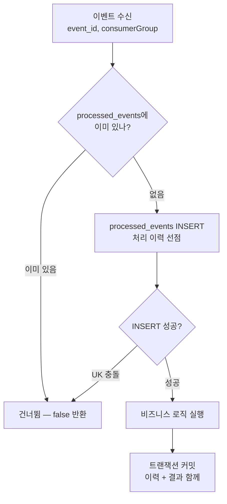
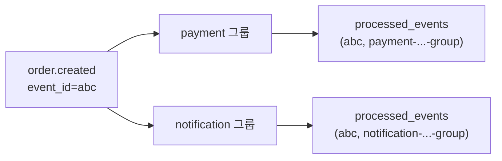
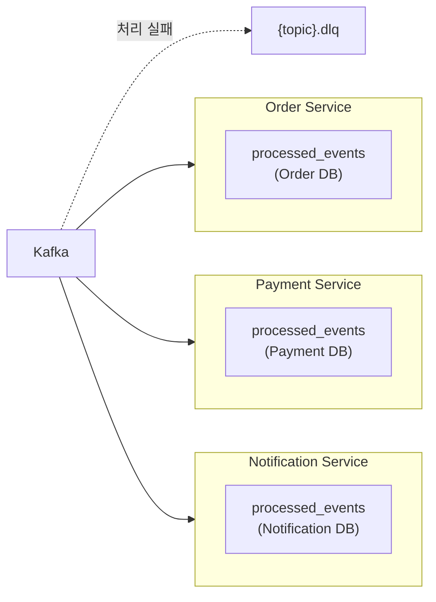

10편은 Producer 쪽 이야기였다. Outbox 패턴으로 "DB 저장과 이벤트 발행"을 한 번의 DB 쓰기로 묶어 **유실**을 막았다. 그런데 그 대가로 정확히 한 가지를 내놓았다고 적었다. **중복**이다. "발행은 성공했는데 `PUBLISHED` 표시 직전에 죽으면" 다음 폴링이 같은 이벤트를 또 보낸다. 이게 at-least-once의 본질이고 그 중복을 받아내는 책임을 Consumer로 넘긴다고 했다.

이번 글은 그 넘겨진 책임을 받는 쪽이다. Kafka Consumer가 같은 이벤트를 두 번(혹은 그 이상) 받을 수 있다는 사실을 **버그가 아니라 전제로 받아들이고**, 그 위에서 "결과적으로 한 번만 처리한 것과 같은" 상태(effectively-once)에 도달하는 방법이다. PeekCart는 이걸 `processed_events` 테이블 하나와 `(event_id, consumer_group)` 복합 UK로 푼다.

그리고 멱등성이 막지 못하는 실패가 있다. **비즈니스 로직 자체가 잘못된 메시지**. 파싱 안 되는 페이로드, 존재하지 않는 주문 ID, 정합성 위반은 몇 번을 다시 시도해도 똑같이 실패한다. 이런 "재시도해도 안 되는" 메시지를 무한 재시도로 파티션을 막아 두는 대신 격리해 두고 운영자를 부르는 곳이 DLQ(Dead Letter Queue)다. 멱등성이 "같은 걸 두 번 처리하지 않기"라면 DLQ는 "못 삼키는 걸 영원히 씹지 않기"다. 둘 다 at-least-once 세계를 운영 가능하게 만드는 장치다.

이 글에서 쓰는 용어는 다음 뜻으로 읽으면 된다.

| 용어                      | 이 글에서의 의미                                                                          |
| ----------------------- | ---------------------------------------------------------------------------------- |
| at-least-once           | "최소 한 번" 전달. 발행 성공이 불확실하면 다시 보내므로 같은 이벤트가 **두 번 이상** 도착할 수 있다.                     |
| 멱등성(idempotency)        | 같은 연산을 여러 번 해도 결과가 한 번 한 것과 같음. 여기서는 "같은 이벤트를 두 번 받아도 비즈니스 로직은 한 번만 실행"            |
| effectively-once        | at-least-once 전달 + Consumer 멱등성으로 도달하는 "결과적으로 정확히 한 번" 상태. 전달 자체가 정확히 한 번인 건 아니다   |
| `processed_events`      | "이 이벤트는 이 consumer group이 이미 처리했다"를 기록하는 테이블. `(event_id, consumer_group)` 복합 UK   |
| Consumer Group          | 같은 토픽을 독립적으로 소비하는 단위. 그룹마다 자기 오프셋을 따로 갖는다. PeekCart 네이밍: `{service}-{topic}-group` |
| DLQ (Dead Letter Queue) | Consumer가 재시도해도 못 처리한 메시지를 보내는 별도 토픽(`{원본토픽}.dlq`). 여기 모이면 자동 처리는 멈추고 수동 개입을 기다린다  |
| `DefaultErrorHandler`   | Spring Kafka의 Consumer 에러 핸들러. 재시도(backoff)를 돌리고, 소진되면 recoverer(여기선 DLQ 발행)를 호출   |
| Outbox `FAILED` vs DLQ  | 전자는 **Producer**가 Kafka에 못 보낸 발행 실패, 후자는 **Consumer**가 받아서 처리하다 난 실패. 완전히 다른 단계    |

이번 학습에서 확인하고 싶은 질문은 다음과 같다.

1. Consumer가 같은 이벤트를 두 번 받으면 구체적으로 무엇이 깨지는가? (재고 이중 차감, 결제 이중 생성)
2. 멱등성 키를 왜 `event_id` 단독이 아니라 `(event_id, consumer_group)` 복합으로 잡았는가?
3. "처리 이력 먼저 기록하고 비즈니스 로직 실행"(save-first)은 "비즈니스 로직 먼저 하고 기록"과 무엇이 다른가?
4. 처리가 실패하면 처리 이력은 어떻게 되는가? 왜 그래야 재처리가 안전한가?
5. 멱등성으로 못 막는 실패는 무엇이고, 그걸 DLQ가 어떻게 받는가?
6. Outbox `FAILED`와 DLQ는 왜 같은 Slack 채널을 쓰면서도 다른 문제인가? (10편에서 표로만 봤던 걸 코드로)
7. 통합 테스트는 "중복을 한 번만 처리한다"를 정말 증명했는가?

---

## 문제 상황: 두 번 받으면 두 번 한다

10편 말미의 시퀀스를 다시 떠올리자. Outbox 폴러가 이벤트를 Kafka에 보내는 데 성공했는데 그 행을 `PUBLISHED`로 바꾸기 직전에 프로세스가 죽는다. 재기동하면 그 행은 여전히 `PENDING`이라 폴러가 **같은 `event_id`를 다시 발행**한다. Kafka 입장에서는 똑같이 생긴 메시지가 토픽에 두 번 들어온 것이고, Consumer는 그걸 두 번 받는다.

문제는 PeekCart의 Consumer가 하는 일이 하나같이 **부수효과(side effect)를 일으키는 일**이라는 데 있다. 멱등성 장치가 *없다고 가정하면*, 같은 이벤트를 두 번 받을 때 아래가 **시도**된다.

| 토픽                  | Consumer               | 멱등성이 없다면 시도되는 일                  |
| ------------------- | ---------------------- | -------------------------------- |
| `order.created`     | `PaymentEventConsumer` | `Payment(PENDING)` 두 번째 생성 시도    |
| `order.created`     | `NotificationConsumer` | "주문이 생성되었습니다" 알림 두 번째 발송         |
| `payment.completed` | `OrderEventConsumer`   | 주문 상태 `PAYMENT_COMPLETED` 재전이 시도 |
| `payment.failed`    | `OrderEventConsumer`   | 주문 재취소 + 재고 재복구 시도               |

여기서 "시도된다"와 "실제로 커밋된다"를 구분하는 게 중요하다. PeekCart에는 멱등성 말고도 **두 번째 방어선**이 깔려 있기 때문이다(9편의 분산 락 ⊃ 낙관적 락 이중 방어와 같은 결의 구조다). `Payment`는 `order_id`에 UNIQUE 제약이 있어(`Payment.java`) 같은 주문으로 두 번째 결제를 INSERT하면 DB가 막는다. `Order`는 이미 `CANCELLED`면 `cancel()`이 `ORD-002`를, 허용되지 않은 전이면 `transitionTo()`가 `ORD-003`을 던진다(`Order.java`). 즉 결제·주문 쪽 중복은 멱등성이 없더라도 **double-commit이 아니라 예외**가 되고, 그 예외는 재시도를 거쳐 DLQ로 떨어진다 — 정합성은 지키지만 시끄럽다.

진짜로 조용히 이중 반영되는 곳은 **알림**이다. `notifications`에는 그런 자연 UK가 없고, 게다가 `createNotification`은 DB 저장에 더해 외부 `slackPort.send`까지 부른다(뒤 「부수효과의 경계」 절). 받쳐줄 도메인 가드가 없어, 멱등성이 빠지면 알림 행이 둘 생기고 Slack도 두 번 나간다.

그래서 멱등성의 역할은 둘이다. (1) UK·도메인 가드가 막아줄 수 있는 중복을 **예외/DLQ 소음 없이 깨끗하게** 걸러내고, (2) 알림처럼 자연 방어선이 없는 경로의 이중 반영을 **유일하게** 막는다. 설계 단계에서 멱등성을 "선택"이 아니라 "필수"로 못 박은 이유다. at-least-once를 택한 이상, 중복은 **반드시 온다고 가정**하고 Consumer가 흡수해야 한다. 연산마다 "이건 원래 멱등인가"를 따로 판단하는 건 일관성도 없고 빠뜨리기 쉬워서, **연산이 멱등이든 아니든 진입 지점에서 한 번 걸러내는** 공통 장치를 둔 것이다.

---

## 선택한 설계: "이미 처리했다"를 DB 한 행으로 증명한다

발상은 Outbox와 데칼코마니다. Outbox가 "발행할 이벤트를 DB 한 행으로 저장"했다면, 멱등성은 "처리한 이벤트를 DB 한 행으로 저장"한다. Consumer는 이벤트를 받으면 먼저 묻는다 — **"이 `event_id`를, 내 consumer group이, 이미 처리한 적 있나?"** 있으면 건너뛰고, 없으면 처리 이력을 적고 비즈니스 로직을 돌린다.



이 설계의 핵심 결정 두 가지를 짚는다.

### 왜 `(event_id, consumer_group)` 복합 키인가

멱등성 키를 `event_id` 단독으로 잡으면 안 된다. **같은 이벤트를 여러 consumer group이 정당하게 각자 처리**하기 때문이다.

`order.created` 하나를 보자. 이걸 받는 그룹은 둘이다.

- `payment-svc-order-created-group` → `Payment(PENDING)` 생성
- `notification-svc-order-created-group` → 주문 생성 알림 발송

두 그룹은 같은 이벤트를 받지만 **다른 일을 한다.** 만약 멱등성 키가 `event_id` 단독이라면, Payment 그룹이 먼저 처리해 이력을 적는 순간 Notification 그룹은 "이미 처리됨"으로 판단하고 알림을 건너뛴다. 한쪽의 정당한 처리가 다른 쪽을 막아버린다. 그래서 키는 반드시 **"누가(consumer group) 그 이벤트를 처리했나"**까지 포함해야 한다. 같은 `event_id`라도 consumer group이 다르면 다른 행이고, 각자 독립적으로 한 번씩 처리된다.



이건 단순한 구현 디테일이 아니라 **Phase 4 설계의 토대**다. 서비스가 쪼개지면 같은 이벤트를 N개 서비스가 각자 소비하는 fan-out이 더 흔해진다. consumer group별 멱등성은 그 fan-out을 안전하게 만든다. 뒤의 "수동 재처리" 절에서 이 키가 한 번 더 값을 한다.

### 왜 save-first인가. 처리 이력을 비즈니스 로직 앞에 적는다

순서가 중요하다. 두 가지 선택지가 있다.

- **act-first**: 비즈니스 로직 먼저 실행 → 성공하면 처리 이력 기록
- **save-first**: 처리 이력 먼저 기록(선점) → 그 다음 비즈니스 로직 실행

PeekCart는 **save-first**를 택했다(`IdempotencyChecker.executeIfNew`). 이유는 동시성이다. Kafka 리밸런스 등으로 같은 메시지가 거의 동시에 두 번 소비되는 순간을 생각해 보자. act-first라면 두 소비자가 "아직 이력 없음"을 동시에 확인하고 **둘 다 비즈니스 로직을 실행**한 뒤 이력을 적으려다 충돌한다. 이미 이중 처리가 끝난 뒤다. save-first는 비즈니스 로직 **전에** UK가 걸린 INSERT로 자리를 선점하므로, 하나만 INSERT에 성공하고 나머지는 거기서 막힌다. 비즈니스 로직은 선점에 성공한 하나만 실행한다.

여기서 흔한 오해 하나를 정리하면, 진입부의 `exists()` 조회는 **정확성의 근거가 아니라 빠른 경로(fast path)**일 뿐이다. 정확성은 전적으로 **UK 제약**이 보장한다. `exists()`는 "대부분의 중복은 이미 이력이 있으니 INSERT까지 안 가고 싸게 걸러내자"는 최적화고, `exists()`와 `save()` 사이의 좁은 틈으로 들어온 동시 중복은 INSERT 시점의 UK 충돌이 받아낸다. 이 둘을 분리해서 이해하는 게 중요하다. `exists()`를 지워도 정확하고(느려질 뿐), UK를 지우면 틀린다.

---

## 구현 구조

### 1. `processed_events` 테이블과 엔티티

테이블은 단순하다. "어떤 이벤트를, 어떤 그룹이, 언제 처리했나" 셋이 전부다.

```sql
CREATE TABLE processed_events (
    id              BIGINT AUTO_INCREMENT PRIMARY KEY,
    event_id        VARCHAR(36)  NOT NULL,
    consumer_group  VARCHAR(100) NOT NULL,
    processed_at    DATETIME(6)  NOT NULL,
    CONSTRAINT uk_processed_event_consumer UNIQUE (event_id, consumer_group)
) ENGINE=InnoDB DEFAULT CHARSET=utf8mb4;
```

`event_id`는 10편에서 본 `outbox_events.event_id`(UUID)와 **같은 값**이다. Outbox가 발행 시 부여한 UUID가 `KafkaEventEnvelope`에 실려 토픽을 거쳐 Consumer까지 그대로 흐르고, 그게 멱등성 키가 된다. 즉 "이 이벤트의 신원"은 발행부터 처리까지 하나의 UUID로 관통한다. 엔티티는 그 신원을 받아 한 행을 만든다.

```java
@Entity
@Table(name = "processed_events",
        uniqueConstraints = @UniqueConstraint(
                name = "uk_processed_event_consumer",
                columnNames = {"event_id", "consumer_group"}))
public class ProcessedEvent {
    @Id @GeneratedValue(strategy = GenerationType.IDENTITY)
    private Long id;
    private String eventId;
    private String consumerGroup;
    private LocalDateTime processedAt;

    public static ProcessedEvent create(String eventId, String consumerGroup) { /* ... */ }
}
```

여기서 `GenerationType.IDENTITY`는 우연이 아니라 **동작에 기여하는 선택**이다. IDENTITY는 PK를 DB의 AUTO_INCREMENT로 받으므로, Hibernate가 `save()` 시점에 INSERT를 **즉시 실행**해야 생성된 id를 알 수 있다. 덕분에 UK 충돌이 트랜잭션 커밋 시점까지 미뤄지지 않고 `save()` 호출 시점에 `DataIntegrityViolationException`으로 바로 튀어나온다. 아래 `IdempotencyChecker`의 try-catch가 그 예외를 잡을 수 있는 건 이 즉시 INSERT 덕이다. (만약 INSERT가 flush까지 지연됐다면 충돌이 try 블록 바깥의 커밋 시점에 터졌을 것이다.)

### 2. `IdempotencyChecker` — 멱등성의 심장

전체 로직이 메서드 하나에 들어간다.

```java
@Component
public class IdempotencyChecker {

    public boolean executeIfNew(String eventId, String consumerGroup, Runnable action) {
        if (processedEventRepository.exists(eventId, consumerGroup)) {   // (1) fast path
            return false;                                                //     이미 처리 → 건너뜀
        }
        try {
            processedEventRepository.save(ProcessedEvent.create(eventId, consumerGroup));  // (2) 선점 INSERT
        } catch (DataIntegrityViolationException e) {                    // (3) 동시 중복 → UK가 막음
            return false;
        }
        action.run();                                                    // (4) 비즈니스 로직
        return true;
    }
}
```

네 줄에 설계가 다 들어 있다.

- **(1) fast path**: 대부분의 중복(이미 한참 전에 처리된 재발행)은 여기서 `false`로 빠진다. INSERT까지 안 가니 싸다.
- **(2) 선점 INSERT**: 비즈니스 로직 *전에* 자리를 맡는다. save-first의 핵심.
- **(3) UK 충돌 흡수**: `exists()`와 `save()` 사이를 비집고 들어온 동시 중복은 여기서 막힌다. 예외를 `false`로 변환해 "이긴 쪽이 처리하니 나는 빠진다"로 처리한다. (다만 이 catch-and-continue가 정말 깨끗한지는 짚을 데가 있다 — 「한계」의 'UK 충돌을 잡고 같은 트랜잭션을 이어가도 되는가' 참고.)
- **(4) 비즈니스 로직**: 선점에 성공한 하나만 실행한다.

이 메서드에서 가장 중요한 건 주석에도, 코드에도 안 보이는 **트랜잭션 경계**다. `IdempotencyChecker`는 자기 트랜잭션을 열지 않는다. **호출자(Consumer)의 `@Transactional`에 그대로 참여**한다. 그래서 `(2) 처리 이력 INSERT`와 `(4) 비즈니스 로직`이 **같은 트랜잭션**이다. 이게 다음 성질을 공짜로 만든다.

### 3. Consumer — 얇은 진입점

Consumer는 메시지를 파싱하고, `eventId`를 꺼내, `executeIfNew`에 비즈니스 로직을 람다로 넘긴다. 그게 전부다.

```java
@KafkaListener(topics = "payment.failed", groupId = GROUP_PAYMENT_FAILED)
@Transactional                                                    // ← 멱등성 + 비즈니스 로직을 한 트랜잭션으로
public void handlePaymentFailed(String message) {
    JsonNode root = kafkaMessageParser.parse(message);            // 파싱 (실패 시 DLQ 경로로)
    String eventId = root.get("eventId").asText();
    JsonNode payload = root.get("payload");

    idempotencyChecker.executeIfNew(eventId, GROUP_PAYMENT_FAILED, () -> {
        Long orderId = payload.get("orderId").asLong();
        Order order = orderRepository.findById(orderId)
                .orElseThrow(() -> new OrderException(ErrorCode.ORD_001));
        order.cancel();
        for (var item : order.getOrderItems()) {
            productPort.restoreStock(item.getProductId(), item.getQuantity());  // 재고 복구 — 두 번 하면 안 됨
        }
    });
}
```

세 Consumer(`PaymentEventConsumer`, `OrderEventConsumer`, `NotificationConsumer`)의 7개 메서드가 전부 이 골격을 따른다. `consumerGroup` 상수만 다르고 구조는 동일하다. 메시지 파싱은 `KafkaMessageParser`로 공통화돼 있고, 멱등성은 `IdempotencyChecker`로 공통화돼 있어 Consumer 본문에는 "이 이벤트로 무엇을 하는가"만 남는다.

### 4. 실패하면 처리 이력도 함께 사라진다 — 재처리 안전성

여기가 save-first + 같은 트랜잭션이 주는 가장 우아한 성질이다. `action.run()`이 예외를 던지면 어떻게 될까?

처리 이력 INSERT(2)와 비즈니스 로직(4)이 **같은 트랜잭션**이므로, 비즈니스 로직이 실패하면 **트랜잭션 전체가 롤백**된다. 방금 선점한 `processed_events` 행도 **함께 사라진다.** 즉 "처리했다고 기록은 됐는데 실제로는 실패한" 어정쩡한 상태가 원천적으로 안 생긴다.

이게 왜 중요한가. 비즈니스 로직 실패 → Spring Kafka의 에러 핸들러가 **재시도**한다(다음 절). 재시도 시 그 이벤트는 `processed_events`에 이력이 없는 상태(롤백됐으니)라, 멱등성 체크를 정상 통과해 **다시 처리된다.** 만약 실패해도 이력이 남는 구조였다면, 재시도가 "이미 처리됨"으로 잘못 판단해 영영 건너뛰었을 것이다.

정리하면 책임이 깔끔하게 나뉜다.

| 상황 | processed_events 행 | 결과 |
| --- | --- | --- |
| 처리 성공 | 커밋되어 남음 | 이후 중복은 차단됨 |
| 처리 실패 | 롤백되어 사라짐 | 재시도가 정상 진행됨 |
| 동시 중복 | 한쪽만 INSERT 성공 | 이긴 쪽만 처리 |

"성공한 것만 기록에 남는다"는 불변식이, 멱등성과 재시도를 **모순 없이** 공존시킨다.

### 5. DLQ — 재시도해도 안 되는 메시지를 격리한다

멱등성은 "같은 걸 두 번 처리하지 않기"를 보장하지, "처리에 실패한 걸 어떻게든 처리하기"를 보장하지 않는다. 4번에서 본 재시도는 일시적 실패(DB 락 경합, 순간적 네트워크)에는 잘 듣지만, **구조적으로 못 처리하는 메시지**에는 무한히 실패만 반복한다.

- 파싱 불가능한 페이로드 (`KafkaMessageParser.parse`가 `IllegalArgumentException`)
- 존재하지 않는 주문 ID (`orElseThrow(ORD_001)`)
- 도메인 규칙 위반 (불가능한 상태 전이)

이런 "독이 든 메시지(poison message)"를 무한 재시도하면 그 파티션의 뒤 메시지들이 영영 막힌다. 그래서 **유한 번 재시도하고, 그래도 안 되면 별도 토픽(DLQ)으로 치워** 두고 다음 메시지로 넘어간다. 이걸 Spring Kafka의 `DefaultErrorHandler` + `DeadLetterPublishingRecoverer`로 구성했다(`KafkaConfig`).

```java
@Bean
public CommonErrorHandler kafkaErrorHandler(KafkaTemplate<String, String> kafkaTemplate) {
    DeadLetterPublishingRecoverer dlqRecoverer = new DeadLetterPublishingRecoverer(
            kafkaTemplate,
            (record, ex) -> new TopicPartition(record.topic() + ".dlq", -1)  // order.created → order.created.dlq
    );

    return new DefaultErrorHandler((record, exception) -> {
        log.error("[DLQ] topic={} ...", record.topic(), exception);
        dlqRecoverer.accept(record, exception);     // 원본 레코드를 .dlq 토픽으로 발행
        try {
            slackPort.send(message);                // 운영자 통지
        } catch (Exception e) {
            log.warn("DLQ Slack 알림 발송 실패", e);  // Slack 실패는 흡수 (DLQ 발행을 막지 않음)
        }
    }, new FixedSequenceBackOff(1_000, 5_000, 30_000));   // 1s → 5s → 30s, 3회 후 STOP
}
```

동작을 따라가면.

1. Consumer가 메시지 처리에 실패(예외)하면 `DefaultErrorHandler`가 받는다.
2. `FixedSequenceBackOff`가 정한 간격(1초 → 5초 → 30초)으로 **3회 재시도**한다. 배열을 소진하면 `BackOffExecution.STOP`을 반환해 재시도를 끝낸다.
3. 재시도가 소진되면 recoverer가 원본 레코드를 **`{원본토픽}.dlq`로 발행**한다. `TopicPartition(..., -1)`의 `-1`은 "파티션은 Kafka가 알아서 고르라"는 뜻이다(DLQ 토픽은 파티션 1개라 사실상 0번).
4. Slack으로 운영자에게 알린다. Slack 발송 실패는 try-catch로 흡수한다. 10편의 Outbox `FAILED` Slack 격리와 **같은 처리 철학**이다(통지 실패가 DLQ 발행 자체를 막으면 안 된다).
5. DLQ로 보낸 레코드는 "복구됨(recovered)"으로 간주되어 **오프셋이 커밋**된다. 그래서 poison message가 파티션을 영구히 막지 않고, Consumer는 다음 메시지로 넘어간다. (단, 여기엔 "DLQ 발행이 정말 성공했나"를 확정하지 않는 함정이 있다. 「한계」의 'DLQ 발행 성공을 확인하지 않는다' 참고.)

`FixedSequenceBackOff`는 직접 만든 작은 구현체다. Spring이 기본 제공하는 `ExponentialBackOff`/`FixedBackOff` 대신 "1초, 5초, 30초"라는 **명시적 간격 배열**을 쓰고 싶었기 때문이다(설계 §8-3에 못 박힌 값). 배열을 다 쓰면 `STOP`을 돌려주는 게 전부인, 의도적으로 단순한 클래스다.

### 6. DLQ로 가도 추적 끈은 끊기지 않는다

`DeadLetterPublishingRecoverer`는 원본 레코드를 DLQ로 옮길 때 **헤더를 자동 복사**한다. 그래서 10편에서 Outbox가 발행 시 심어둔 `X-Trace-Id`/`X-User-Id` 헤더(ADR-0008, D-010)가 DLQ 메시지에도 살아남는다. "HTTP 요청 → Outbox 저장 → 발행 → Consumer 처리 실패 → DLQ"까지 **단일 traceId로 묶인다.** 장애 대응에서 "이 DLQ 메시지가 원래 어느 요청에서 비롯됐나"를 로그로 역추적할 수 있다는 뜻이다. `DlqIntegrationTest.dlqPreservesTraceHeaders`가 정확히 이걸 검증한다.

`MdcRecordInterceptor`는 한 발 더 나간다. Consumer 진입 시 헤더의 traceId를 MDC에 넣고, **에러 핸들러(DLQ 발행 + Slack)가 다 끝난 뒤에야** MDC를 정리한다(`afterRecord`). Spring Kafka 호출 순서상 `failure()` → `CommonErrorHandler`(DLQ 발행) → `afterRecord`이므로, DLQ 발행 로그까지 traceId가 살아 있게 의도적으로 맞춘 것이다.

---

## 한계와 트레이드오프

### `processed_events`가 무한히 쌓인다 (그리고 청소하면 멱등성 창이 좁아진다)

설계 문서에서는 "운영 환경에서는 `processed_at` 기준 30일 이상 경과 데이터를 배치 삭제하거나 파티셔닝"이라고 적어두었다. 그런데 **코드에는 그 삭제 로직이 없다.**  Consumer가 이벤트를 처리할 때마다 행이 하나씩 쌓이고, 영원히 안 지워진다.
흥미로운 건 단순 누적 문제가 아니라는 점이다. processed_events를 30일로 청소하면 **멱등성 보장 창도 30일로 줄어든다.** 30일 넘게 지나 도착한 초유의 지각 중복(이론상 Outbox 재발행이 그렇게 늦을 일은 거의 없지만)은 이력이 이미 삭제돼 다시 처리된다. 즉 "테이블 크기"와 "중복 방어 기간"이 한 손잡이의 양면이다. 보존 기간은 "최대 지각 중복이 얼마나 늦게 올 수 있나"를 상한으로 잡아야 한다. 현재는 청소가 아예 없어 이 트레이드오프를 **미루고** 있다.

### UK 충돌을 잡고 같은 트랜잭션을 이어가도 되는가

`IdempotencyChecker`는 동시 중복 시 `save()`에서 터지는 `DataIntegrityViolationException`을 잡고 `false`를 돌려준 뒤, **같은 트랜잭션을 그대로 커밋**시킨다(비즈니스 로직은 안 돌렸으니 빈 커밋). 그런데 JPA/Hibernate에서는 영속성 예외가 한 번 발생하면 그 세션·트랜잭션이 rollback-only로 마킹될 수 있어, 예외를 잡았더라도 이후 커밋이 `UnexpectedRollbackException`으로 실패할 수 있다. 즉 "예외를 잡았으니 깨끗하게 빠져나간다"가 보장은 아니다. 다행히 깨져도 파국은 아니다. 커밋이 실패하면 그 레코드는 다시 재시도되고, 그때는 이긴 쪽이 이미 커밋해 둔 이력이 있어 `exists()` fast path로 조용히 걸러진다. 결국 결과는 같지만 "한 번에 조용히"가 아니라 "한 번 더 시끄럽게 돌고 나서" 수렴하는 셈이다. 더 견고한 길은 애초에 예외를 안 만드는 선점이다 — MySQL `INSERT ... ON DUPLICATE KEY UPDATE`(또는 `INSERT IGNORE`)로 충돌을 예외 없이 흡수하면 세션 상태를 건드리지 않는다. 어느 쪽이든, 이 동시 충돌 경로는 아래 「검증」 절에서 보듯 통합 테스트로 실제 동작이 박혀 있지 않다는 점이 진짜 약한 고리다.

### 멱등성은 "전달"을 정확히 한 번으로 만들지 못한다. 부수효과의 경계

`IdempotencyChecker`의 롤백 기반 보장은 **DB 트랜잭션 안의 부수효과**에만 성립한다. 비즈니스 로직과 처리 이력이 같은 트랜잭션이라 함께 롤백되기 때문이다. 그런데 트랜잭션이 되돌릴 수 없는 **외부 호출**은 이 보장 밖이고, PeekCart에는 그런 호출이 실제로 하나 있다. `NotificationConsumer`가 부르는 `NotificationCommandService.createNotification`은 알림을 DB에 저장하고 **곧바로 `slackPort.send(message)`로 Slack에 직접 발송**한다(둘 다 Consumer 트랜잭션에 합류).

```java
public void createNotification(Long userId, NotificationType type, String message) {
    notificationRepository.save(notification);   // 트랜잭션 안 — 롤백 가능
    slackPort.send(message);                      // 외부 호출 — 롤백 불가
}
```

그래서 좁지만 실재하는 틈이 있다. `slackPort.send`가 나간 **뒤** 커밋이 실패하거나(예: 커밋 시점 DB 오류), 발송 직후 커밋 전에 프로세스가 죽으면, 트랜잭션은 미완으로 끝나 `processed_events` 행이 남지 않지만 **Slack 메시지는 이미 나갔다.** 이후 재시도가 그 이벤트를 다시 처리하면서 Slack을 **또** 보낸다 — 알림 중복이다. 다만 이게 무한 루프나 정합성 붕괴로 번지지는 않는데, Slack 클라이언트가 자기 예외를 내부에서 흡수하기 때문이다(L-004). 즉 `send` 자체가 실패해도 예외를 던지지 않아 롤백을 유발하지는 않고, 중복은 "커밋이 다른 이유로 깨지는" 드문 경로에서만 생긴다. 그럼에도 결론은 분명하다. effectively-once는 **DB 상태에 대해서만** 성립하고, Slack 같은 외부 전달까지 정확히 한 번으로 만들어주지는 않는다. DB 안의 결제·주문·재고는 멱등하게 닫혀 있지만, 알림 발송은 그 경계 밖에 있다.

### DLQ 재시도가 파티션을 블록한다

`DefaultErrorHandler`의 재시도는 **블로킹**이다. 1초 + 5초 + 30초 = 약 36초 동안 그 Consumer 스레드가 해당 파티션의 다음 메시지를 처리하지 못한다. poison message 하나가 36초간 뒤 메시지들을 세워둔다는 뜻이다. 평상시엔 무해하지만, poison message가 연달아 오면 처리 지연이 쌓인다. 대안은 non-blocking retry(`@RetryableTopic`으로 재시도를 별도 토픽에 위임)인데, 그건 토픽이 재시도 단계만큼 늘고 순서 보장이 깨지는 새 복잡도를 들인다. 현재 프로젝트 범위에선 블로킹 재시도의 단순함을 택했다.

### DLQ 발행 성공을 확인하지 않는다

`DeadLetterPublishingRecoverer`는 재시도 소진된 레코드를 DLQ로 보내고, 그게 끝나면 원본을 "복구됨"으로 간주해 오프셋을 넘긴다. 문제는 현재 `KafkaConfig`가 `dlqRecoverer.setFailIfSendResultIsError(true)`를 켜지 않았다는 점이다. 이 옵션이 꺼져 있으면 recoverer는 DLQ로의 **비동기 발행 결과를 끝까지 확인하지 않고** 복구를 마친 것으로 처리한다. 그래서 DLQ 발행 자체가 실패하면(브로커 장애 등) 그 실패가 예외로 올라오지 않은 채 원본 오프셋만 커밋되어, **메시지가 원본에서도 DLQ에서도 사라지는** 유실이 생길 수 있다. Spring 공식 문서도 발행 실패를 예외로 다루려면 이 옵션을 켜라고 안내한다. 한 줄 설정으로 닫을 수 있는 하드닝 갭이고, Phase 4에서 DLQ가 보상 흐름의 마지막 안전망이 되는 만큼 그 전에 켜두는 게 좋다.

### DLQ 이후는 자동 복구가 없다 (현재 모놀리스 vs Phase 4는 양상이 다르다)

DLQ에 메시지가 도착하면 **자동 처리는 거기서 끝**이고, 운영자의 수동 재처리를 기다린다. 여기서 현재 모놀리스와 Phase 4를 정확히 갈라야 한다.

**현재(모놀리스)**: `OrderEventConsumer.handlePaymentFailed`는 `order.cancel()`과 재고 복구(`restoreStock` 루프)를 **하나의 트랜잭션**에서 처리한다. 재고 복구가 실패하면 주문 취소도 함께 롤백된다. 둘은 all-or-nothing이다. 그래서 이 메시지가 DLQ로 빠지면 결과는 "취소도 안 됐고 재고도 그대로"인 **일관된 미반영** 상태다. 결제는 실패했는데 그 후속(취소+복구)이 통째로 멈춰 있는 것이고, 적어도 "취소됐는데 재고만 안 맞는" 어긋남은 생기지 않는다.

**Phase 4(서비스 분리)**: 재고 복구가 Order Service가 아니라 별도 Product Service의 `order.cancelled` Consumer로 옮겨가면 이야기가 달라진다(설계 §10-4). 주문 취소(Order Service)는 커밋됐는데 재고 복구(Product Service)가 DLQ로 빠지면, **주문은 취소됐지만 재고는 복구되지 않은** split-brain이 수동 재처리 전까지 지속된다. 설계 문서가 보완책으로 "`status=CANCELLED`인데 재고가 예상보다 낮은 경우를 탐지하는 정합성 검사 쿼리"를 제시하는 건 바로 이 분산 시나리오를 겨냥한 것이다(아직 구현은 없다). Choreography Saga의 본질적 한계. 중앙 조율자가 없으니 "어디까지 진행됐나"를 한곳에서 알기 어렵다는 서비스가 쪼개진 뒤에야 비로소 드러난다.

### 수동 재처리는 어떻게 안전한가 (복합 키가 다시 값을 한다)

DLQ 메시지를 **원본 토픽으로 재발행**한다고 하자. 같은 이벤트를 여러 그룹이 fan-out으로 받던 경우, **이미 성공한 그룹은 재처리하면 안 되고 실패한 그룹만 다시 해야 한다.** `(event_id, consumer_group)` 복합 키가 정확히 이걸 해결한다. `order.created`를 재발행하면, 이미 처리한 Notification 그룹은 자기 이력 행이 있어 건너뛰고, DLQ로 빠졌던(=이력 롤백됐던) Payment 그룹만 재처리한다. **부분 실패를 부분 재처리**할 수 있는 건 멱등성 키에 consumer group이 들어 있기 때문이다. `event_id` 단독 키였다면 재발행이 멀쩡한 그룹까지 막거나 통과시켜 엉켰을 것이다.

여기엔 전제가 하나 붙는다. 이 "안전함"은 **고친 내용이 실패했던 그룹에만 영향을 줄 때** 성립한다. 만약 페이로드의 어떤 필드를 바로잡았고 그 수정이 **이미 성공한 그룹에도 반영돼야 한다면**, 같은 `event_id` 재발행은 그 그룹에서 (이력이 있으니) 그냥 건너뛰어진다. 수정이 먹지 않는다. 이 경우엔 새 `event_id`로 보정 이벤트를 따로 발행하거나 별도 보상 처리가 필요하다. 복합 키 멱등성은 "같은 이벤트의 부분 재시도"를 안전하게 해주는 것이지, "내용이 바뀐 재처리"를 자동으로 전파해주지는 않는다.

### 관측성 공백 — DLQ 적재량이 메트릭으로 안 보인다

DLQ 도달은 Slack 단발 알림으로만 통지된다. "지금 DLQ에 몇 건이 쌓여 있나", "어느 토픽의 DLQ가 늘고 있나"를 보는 메트릭이 없다. 10편에서 본 Outbox `FAILED`도 같은 Slack 채널을 쓴다(L-004). 운영자 입장에서 "발행이 안 된 건가(Outbox FAILED), 처리가 안 된 건가(DLQ)"를 알림 문구로만 구분해야 한다. 둘은 대응이 정반대(전자는 브로커 복구 후 재발행, 후자는 데이터 수정 후 원본 토픽 재투입)라, Phase 4 전에 채널/메트릭 분리가 필요한 지점이다.

---

## 통합 테스트로 검증된 것 (과 못한 것)

`IdempotencyIntegrationTest`와 `DlqIntegrationTest`는 Testcontainers로 MySQL + Redis + Kafka를 띄우고 실제 발행→소비를 돌린다.

**1. 같은 이벤트 2회 소비 → 1회만 처리** (`duplicateEvent_sameConsumerGroup_processedOnce`)

```java
orderOutboxEventPublisher.publishOrderCreated(order);
String payload = outboxEventRepository.findPendingEvents(100).get(0).getPayload();
outboxPollingService.pollAndPublish();                          // 정상 발행 → 처리
await()...untilAsserted(() -> assertThat(paymentRepository.findByOrderId(order.getId())).isPresent());

long paymentCountBefore = countPaymentsByOrderId(order.getId());
kafkaTemplate.send("order.created", order.getId().toString(), payload);   // 동일 payload 재전송 (중복 모방)

await().during(3, SECONDS)...untilAsserted(() ->                // 3초간 지켜봐도
    assertThat(countPaymentsByOrderId(order.getId())).isEqualTo(paymentCountBefore));  // Payment 안 늘어남
```

핵심은 `during(3, SECONDS)`다. "변화가 없음"을 증명하려면 일정 시간 지켜봐야 한다. 같은 payload(같은 `event_id`)를 다시 보내도 Payment/Notification 수가 그대로임을 단언한다.

**2. 같은 이벤트, 다른 그룹 → 각자 독립 처리** (`sameEvent_differentConsumerGroups_processedIndependently`)

```java
List<ProcessedEvent> processedEvents = ...filter(pe -> pe.getEventId().equals(eventId)).toList();
assertThat(processedEvents).hasSize(2);                          // 같은 eventId로 2건
assertThat(processedEvents).extracting(ProcessedEvent::getConsumerGroup)
    .containsExactlyInAnyOrder("payment-svc-order-created-group", "notification-svc-order-created-group");
```

복합 키 설계를 직접 검증한다 — 같은 `event_id`가 서로 다른 두 그룹의 행으로 공존하고, 둘 다 처리됐다.

**3. 처리 실패 → 재시도 소진 → DLQ + Slack** (`consumerFailure_routesToDlqAndSendsSlack`)

```java
kafkaTemplate.send("order.created", "test-key", "invalid-json-message");   // 파싱 불가
await().atMost(15, SECONDS).untilAsserted(() -> {
    assertThat(dlqTestListener.records).hasSize(2);             // 2개 그룹 모두 DLQ로
    assertThat(TestConfig.slackCallCount.get()).isEqualTo(2);  // Slack 2회
});
assertThat(dlqTestListener.records).allSatisfy(r -> {
    assertThat(r.topic()).isEqualTo("order.created.dlq");
    assertThat(r.value()).isEqualTo("invalid-json-message");   // 원본 보존
});
```

`order.created`를 받는 두 그룹(payment, notification)이 둘 다 파싱에 실패해 각자 DLQ로 가고, DLQ 메시지가 원본을 그대로 보존함을 확인한다. **4. 트레이스 헤더 보존**(`dlqPreservesTraceHeaders`)은 §6에서 본 D-010 검증이다.

**이 테스트들이 증명하지 못하는 것**도 분명히 해야 한다.

- **동시 중복(UK 충돌 경로)은 재현하지 않는다.** 1번 테스트는 첫 처리가 끝난 *뒤* 재전송하므로 `exists()` fast path로 걸린다. `exists()`와 `save()` 사이를 비집고 들어와 `DataIntegrityViolationException`을 발생시키는 진짜 동시 경로 — 즉 save-first가 act-first보다 나은 이유 그 자체 — 는 통합 테스트로 박혀 있지 않다. 두 스레드가 같은 메시지를 동시에 소비하도록 강제하는 시나리오가 없다. 단일 consumer group은 파티션을 한 인스턴스가 잡으므로 이 경합은 주로 리밸런스 창에서만 생기는데, 그 창을 테스트로 재현하지 않았다.
- **실패 후 재처리 안전성을 음성으로 검증하지 않는다.** "비즈니스 로직 실패 → 트랜잭션 롤백 → processed_events 행도 사라짐 → 재시도가 정상 통과" 흐름(§4)은 설계 논증이지, "실패시킨 뒤 행이 없는지 + 재시도가 처리하는지"를 단언하는 테스트는 없다. 멱등성 보장의 가장 우아한 부분이 정작 테스트 공백이다.
- **30초 backoff 전체를 돌리지 않는다.** DLQ 테스트는 `FixedSequenceBackOff(100, 100, 100)`으로 간격을 줄여 빠르게 돌린다. 프로덕션의 1s/5s/30s 타이밍 자체는 검증 대상이 아니다(합리적 — 테스트에서 36초를 기다릴 순 없다).
- **중복 테스트의 기준값 포착이 타이밍에 취약하다.** `duplicateEvent_...`는 Payment 생성만 `await`로 기다린 뒤 `notificationCountBefore`를 찍는다. 그 순간 Notification Consumer가 아직 첫 메시지를 처리 중이면, 중복과 무관하게 알림 수가 사후에 늘어 기준값이 어긋날 수 있다(간헐 실패 소지). 두 그룹의 `processed_events` 기록이 모두 남은 걸 확인한 뒤 기준값을 잡는 편이 견고하다.

요약하면, 테스트는 **"정상 재전송 중복 차단", "그룹별 독립 처리", "DLQ 라우팅 + 헤더 보존"**은 단단히 잡지만, **동시성 경합과 실패-롤백-재처리**라는 설계의 핵심 논증은 코드 읽기에 맡겨두고 있다.

---

## 자료는 어떤 질문에 연결해서 읽을까

| 질문 | 같이 읽을 자료 | 이 글에서 연결되는 지점 |
| --- | --- | --- |
| at-least-once는 왜 중복을 허용하는가 | Kafka 공식 문서, *Message Delivery Semantics* | "두 번 받으면 두 번 한다" 절 |
| effectively-once를 멱등 Consumer로 만드는 패턴 | Chris Richardson, *Microservices Patterns* — Idempotent Consumer | save-first 절 |
| save-first vs act-first 동시성 | `IdempotencyChecker` 코드 + `04-design-deep-dive.md` §9-7 | (2)(3) 선점 INSERT / UK 충돌 |
| JPA IDENTITY 전략과 즉시 INSERT | Hibernate 문서, *Identifier generation strategies* | `ProcessedEvent` 엔티티 절 |
| DLQ와 에러 핸들러 | Spring for Apache Kafka, *Dead-Letter Topics / DefaultErrorHandler* | DLQ 구현 절 |
| DLQ 헤더 전파 / trace context | `docs/adr/0008-outbox-trace-context-propagation.md`, TASKS D-010 | §6 추적 끈 |
| Producer 실패 vs Consumer 실패 | `04-design-deep-dive.md` §9-3, §8-3 / 10편 표 | `FAILED` vs DLQ 구분 |
| Saga DLQ 이후 정합성 | `04-design-deep-dive.md` §10-4 | "DLQ 이후 자동 복구 없음" 절 |

---

## Phase 4 MSA에서는 어떻게 바뀌는가

멱등성과 DLQ는 모놀리스 단계에서 만들었지만, 사실 **분산 환경에서야 본래 값을 한다.** 한 프로세스 안에서는 굳이 안 거쳐도 됐을 위험들이, 서비스가 쪼개지면 일상이 된다.



**그대로 가는 것**

- **`(event_id, consumer_group)` 복합 키.** 서비스 분리는 곧 fan-out 증가다. 같은 이벤트를 더 많은 서비스가 각자 소비하므로, "그룹별 독립 처리 + 부분 재처리"를 가능케 하는 복합 키는 더 본질적이 된다. 모놀리스에서 미리 이렇게 잡아둔 게 그대로 산다.
- **save-first + 같은 트랜잭션 = 실패 시 이력 롤백.** 서비스마다 자기 DB 안에서 "멱등성 INSERT + 비즈니스 로직"을 한 로컬 트랜잭션으로 묶는 원리는 변하지 않는다. 분산 트랜잭션을 안 쓰기로 한 이상, 각 서비스의 로컬 원자성이 유일하게 믿을 수 있는 보장이다(10편 Outbox와 같은 논리).
- **DLQ 토픽 네이밍과 수동 재처리 흐름.** `{원본토픽}.dlq` 규칙과 "고쳐서 원본 토픽 재투입"은 서비스 경계를 넘어도 동일하다.

**바뀌는 것**

- **`processed_events`가 서비스별로 분산된다.** 단일 테이블이 N개가 된다. 각 서비스가 자기 consumer group의 이력만 들고 있으면 되므로(다른 서비스 그룹 행을 가질 일이 없으니) 오히려 테이블이 가벼워지고, 청소 정책도 서비스별로 정한다.
- **DLQ가 Saga 보상의 실패 지점이 된다.** Phase 4의 `payment.failed → order.cancelled → inventory restore` Choreography Saga(§8-5)에서, 한 단계가 DLQ로 빠지면 **보상 체인이 거기서 끊긴다.** §10-4의 "재고 정합성 검사 쿼리" 같은 감지 보완책이 모놀리스에선 미뤄도 됐지만 분산에선 사실상 필수가 된다 — 어느 서비스의 어느 Consumer가 멈췄는지 한곳에서 알 수 없기 때문이다.
- **Outbox `FAILED`와 DLQ의 채널 분리가 운영 어휘가 된다.** 서비스가 늘면 "발행이 막혔나(Producer/Outbox), 처리가 막혔나(Consumer/DLQ)"를 빠르게 가르는 게 장애 대응 속도를 좌우한다. 지금처럼 둘을 같은 Slack에 섞는 구조(L-004)는 그 전에 분리해야 한다.

**그래서 Phase 4 진입 전 짚을 점**

- **`processed_events` 청소 정책**을 실제로 구현해야 한다(§9-7은 문서만, 코드는 없음). 보존 기간 = 멱등성 창이라는 트레이드오프를 명시적으로 정한다. 12편의 ShedLock 스케줄러 패턴을 재사용하면 outbox 청소(L-008)와 한 작업으로 묶을 수 있다.
- **DLQ 적재량을 메트릭으로** 노출해야 한다. Slack 단발 알림만으로는 "지금 얼마나 밀렸나"가 안 보인다(L-004와 같은 관측성 공백).
- **동시 중복·실패-재처리를 카오스 테스트로** 박아야 한다. 지금은 정상 재전송과 DLQ 라우팅만 검증하지만, 분산에선 "리밸런스 중 동시 소비에서 UK가 정말 하나만 통과시키는가", "처리 실패 후 재시도가 깨끗이 재처리하는가"가 선택이 아니라 필수 검증이 된다. 10편 말미에서 "그 절반(Consumer 멱등성)이 11편"이라 했는데, 그 검증의 절반은 여전히 카오스 테스트로 남아 있다.
