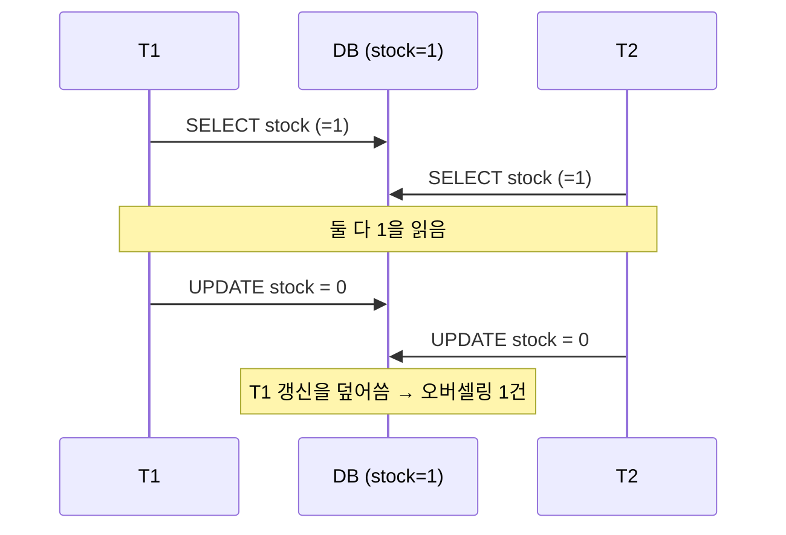
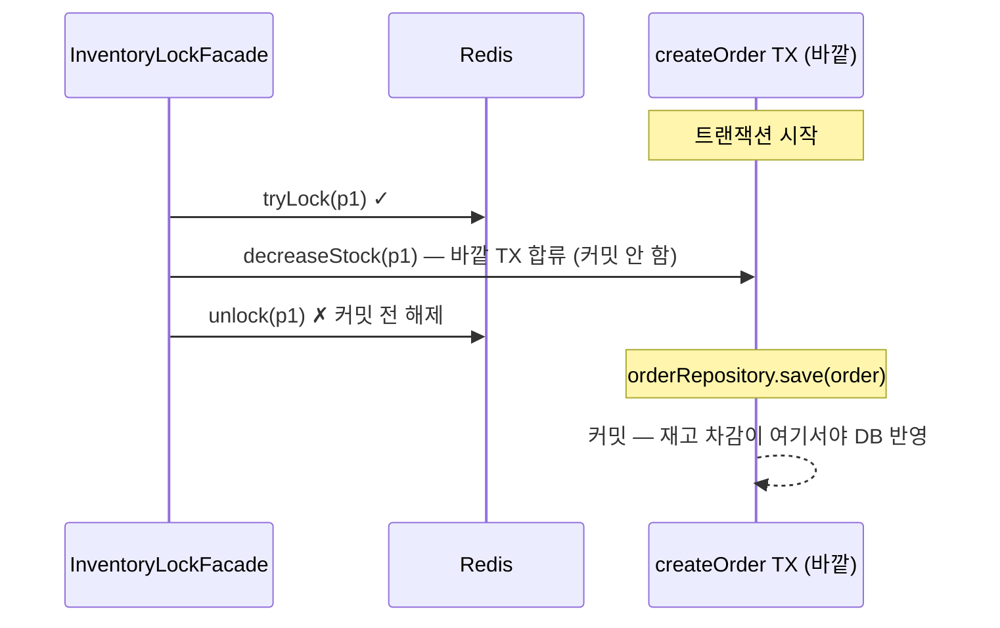
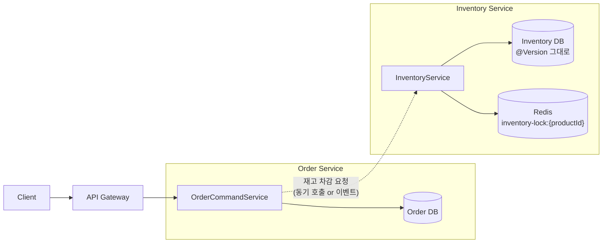

Phase 1의 주문은 단일 스레드 가정 위에 서 있었다. 재고 100개짜리 상품에 주문이 들어오면 `inventory.decrease()`로 재고를 차감하는 것으로 끝났다. 테스트도 한 번에 한 건씩 주문하니 통과했다. 
하지만 이커머스에서 무서운 시나리오는 정확히 그 가정이 깨지는 순간, 즉 한정 수량 상품에 동시 주문이 몰리는 플래시 세일 상황이다. 재고가 1개 남았는데 동시에 들어온 두 요청이 둘 다 "1개 남았네, 깎아도 되겠다"를 읽으면, DB 재고는 0인데 주문은 2건 성공할 수 있다. 실제 판매 가능 수량보다 1개를 더 판 셈이다. Phase 2의 두 번째 과제는 이 **오버셀링(overselling)** 을 막는 일이었다. 이번 글은 그 방어를 왜 한 겹이 아니라 두 겹으로 쌓았는지, 그리고 그 두 겹이 실제 주문 경로에서 어디까지 보장하고 어디서부터 보장하지 않는지를 정리한다.  
  
이 글에서 쓰는 용어는 다음 뜻으로 읽으면 된다.  
  
| 용어                     | 이 글에서의 의미                                                           |
| ---------------------- | ------------------------------------------------------------------- |
| 오버셀링(Overselling)      | 실제 재고보다 많이 판매되는 것. 동시 차감에서 lost update가 발생하면 생긴다                    |
| Lost Update            | 두 트랜잭션이 같은 값을 읽고 각자 갱신해, 한쪽의 갱신이 사라지는 현상                            |
| 분산 락(Distributed Lock) | 여러 프로세스/Pod가 공유하는 외부 저장소(여기선 Redis)를 통해 임계 구역을 직렬화하는 락              |
| Redisson `RLock`       | Redisson이 제공하는 분산 락 구현. `tryLock(wait, lease, unit)`으로 대기/임대 시간을 준다 |
| 낙관적 락(Optimistic Lock) | 충돌이 드물다고 가정하고, 커밋 시점에 `@Version` 비교로 충돌을 사후 감지하는 방식                 |
| `@Version`             | JPA가 UPDATE 시 `WHERE version = ?`를 붙여 stale 갱신을 막는 낙관적 락 컬럼         |
| `leaseTime`            | 분산 락의 자동 만료 시간. 이 시간이 지나면 락이 풀려 다른 스레드가 획득할 수 있다                    |
| 락 범위 ⊃ 트랜잭션 범위         | 락 획득 → 트랜잭션 시작 → 커밋 → 락 해제 순서. 커밋 전에 락을 풀면 안 된다는 불변식                |
  
이번 학습에서 확인하고 싶은 질문은 다음과 같다.  
  
1. 분산 락 하나면 직렬화가 되는데, 왜 DB 낙관적 락을 한 겹 더 두었는가?  
2. "락 범위가 트랜잭션 범위보다 커야 한다"는 말은 무슨 뜻이고, 왜 Facade와 Service를 둘로 쪼개야 했는가?  
3. Redis가 죽으면 `tryLock`이 `true`를 반환하도록 만든 이유는 무엇인가? 그건 위험하지 않은가?  
4. 50스레드 동시 차감 테스트는 무엇을 증명했고, 무엇은 증명하지 못했는가?  
5. 단위 테스트와 동시성 테스트는 통과하는데, 실제 주문 경로에서는 이 불변식이 정말 지켜지는가?  
  
---  
  
## 문제 상황: 같은 재고를 동시에 읽으면  
  
재고 차감은 본질적으로 read-modify-write다. `SELECT stock → 검증 → stock - quantity → UPDATE`. 이 세 단계 사이에 다른 스레드가 끼어들면 lost update가 난다.  
  

  
이걸 막는 표준적인 길은 셋이다.  
  
- **비관적 락(`SELECT ... FOR UPDATE`)**: DB 행에 배타 락을 걸어 다른 트랜잭션을 대기시킨다. 확실하지만 락이 DB 커넥션과 묶여 트래픽이 몰리면 커넥션 풀이 마르고 단일 DB에 부하가 집중된다.  
- **낙관적 락(`@Version`)**: 일단 진행하고 커밋 시점에 충돌을 감지한다. 가볍지만 충돌이 잦으면 재시도 폭풍이 된다.  
- **분산 락(Redis)**: DB 바깥에서 임계 구역을 직렬화한다. DB 부하를 덜지만 Redis라는 외부 의존이 새로 생기고 그게 죽으면 어떻게 되느냐는 질문이 따라온다.  
  
PeekCart는 셋 중 하나를 고르는 대신, **분산 락을 1차 방어선으로, 낙관적 락을 최후 방어선으로 겹쳐 쌓는** 길을 택했다. 다음 절에서 그 이유를 본다.  
  
---  
  
## 왜 두 겹인가. 정상 경로와 장애 경로를 따로 막는다  
  
핵심은 "분산 락이 있으면 낙관적 락은 불필요하지 않은가?"라는 질문에 대한 답이다. 평상시에는 맞다. 분산 락이 동시 요청을 한 줄로 세우면,
각 요청이 차례로 들어와 차감하므로 `@Version` 충돌은 거의 안 난다. 문제는 **Redis가 죽거나 락이 만료되는 순간**이다. 그 순간 분산 락은 없는 것이나 마찬가지가 되고, 직렬화가 풀린다. 두 겹의 역할 분담은 이렇게 정리된다.  
  
|             | 분산 락 (Redis)              | 낙관적 락 (`@Version`)                        |
| ----------- | ------------------------- | ----------------------------------------- |
| 일하는 시점      | 정상 상황 - 동시 요청을 직렬화        | Redis 장애·락 만료 - 직렬화가 풀린 순간                |
| 막는 방식       | 임계 구역 진입 자체를 차단 (사전 예방)   | 커밋 시점에 stale 갱신을 거부 (사후 감지)               |
| 실패 시 사용자 응답 | 락 획득 실패 → `PRD-004` (409) | 충돌 감지 → 낙관적 락 예외 → 차감 실패 |
| 비용          | Redis 락 획득·해제 요청               | UPDATE의 `WHERE version = ?` 조건과 버전 증가          |
  
두 겹을 쌓는 추가 비용은 비교적 작다. 낙관적 락은 `Inventory` 엔티티에 `@Version int version` 필드를 두면 JPA가 UPDATE에 자동으로 `WHERE version = ?` 조건을 붙이고 버전을 증가시킨다. 정상 상황에서 충돌이 없으면 재시도 비용도 발생하지 않는다. Redis가 무너진 비상 상황에서는 이 조건이 stale 갱신을 거부해 오버셀링을 막는다. "거의 안 쓰이지만 없으면 치명적인" 안전벨트다.  
  
```java
@Entity
@Table(name = "inventories")
public class Inventory {
    @Column(nullable = false)
    private int stock;

    @Version
    private int version;        // 낙관적 락

    public void decrease(int quantity) {
        if (this.stock < quantity) {
            throw new ProductException(ErrorCode.PRD_002);   // 재고 부족
        }
        this.stock -= quantity;
    }
}
```  
  
---  
  
## 락 범위 ⊃ 트랜잭션 범위 — Facade와 Service를 쪼갠 이유  
  
분산 락은 반드시 트랜잭션 커밋 **이후에** 풀어야 한다.  
  
```text
올바른 순서: 락 획득 → 트랜잭션 시작 → 재고 변경 → 커밋 → 락 해제
잘못된 순서: 락 획득 → 트랜잭션 시작 → 재고 변경 → 락 해제 → 커밋   ✗
```  
  
왜 이 순서가 중요한가? 락을 커밋 전에 풀면 변경이 아직 DB에 반영되지 않은 상태에서 다음 스레드가 락을 잡고 들어온다. 그 스레드는 아직 커밋되지 않은(즉 옛날) 재고를 읽고 차감한다. 분산 락으로 직렬화했는데도 두 스레드가 같은 값을 읽는, 락을 안 건 것과 똑같은 상황이 된다.  
  
이 순서를 코드로 강제하기 위해 **락 관리와 트랜잭션 로직을 두 클래스로 분리**했다. 만약 `@Transactional` 메서드 안에서 락을 잡고 풀면 메서드가 끝나는 시점(=커밋 시점)에 자바 코드는 이미 락 해제 라인을 지난 뒤다. 즉 한 메서드 안에서는 "커밋 후 해제"를 표현할 수 없다. 그래서 트랜잭션이 없는 바깥 계층(Facade)이 락을 잡고, 그 안에서 트랜잭션 메서드(Service)를 호출하고, 트랜잭션이 끝나(커밋되) 돌아온 **뒤에** 락을 푼다.  
  
```java
// InventoryLockFacade — 트랜잭션 없음. 락 → (트랜잭션) → 락 해제 순서를 강제
@Component
public class InventoryLockFacade {

    public void decreaseStock(Long productId, int quantity) {
        String lockKey = LOCK_KEY_PREFIX + productId;   // inventory-lock:{id}
        boolean locked = lockManager.tryLock(lockKey, LOCK_WAIT_TIME, LOCK_LEASE_TIME, TimeUnit.SECONDS);
        if (!locked) {
            throw new ProductException(ErrorCode.PRD_004);   // 락 획득 실패 → 409
        }
        try {
            inventoryService.decreaseStock(productId, quantity);   // ← 이 호출이 커밋까지
        } finally {
            lockManager.unlock(lockKey);                  // ← 커밋 후에 해제
        }
    }
}

// InventoryService — @Transactional. DB 연산만, 락은 모른다
@Service
@Transactional
public class InventoryService {

    public void decreaseStock(Long productId, int quantity) {
        Inventory inventory = inventoryRepository.findByProductId(productId)
                .orElseThrow(() -> new ProductException(ErrorCode.PRD_001));
        inventory.decrease(quantity);
    }
}
```  
  
`InventoryLockFacade`에는 `@Transactional`이 없고, `InventoryService`에는 있다. 이 분리는 단순한 패키지 취향이 아니라 "커밋 후 해제"라는 시간 순서를 타입 구조로 고정한 것이다. Facade가 `inventoryService.decreaseStock()`을 호출하면, 그 호출이 별도 트랜잭션으로 열렸다가 닫히고(커밋), 제어가 Facade로 돌아온 다음에야 `finally`의 `unlock`이 실행된다. **단, Facade를 트랜잭션 바깥에서 호출했을 때만 그렇다.** 이 단서가 나중에 「한계」 절의 핵심이 된다.  
  
---  
  
## DistributedLockManager. Redis 장애를 어떻게 받아들이는가  
  
락 자체의 획득/해제는 `global/lock/DistributedLockManager`가 Redisson `RLock`으로 처리한다. 이 클래스에서 가장 논쟁적인 줄은 `catch` 블록이다.  
  
```java
public boolean tryLock(String key, long waitTime, long leaseTime, TimeUnit unit) {
    try {
        RLock lock = redissonClient.getLock(key);
        return lock.tryLock(waitTime, leaseTime, unit);
    } catch (InterruptedException e) {
        Thread.currentThread().interrupt();
        return false;
    } catch (Exception e) {
        log.warn("Redis 분산 락 획득 실패 (Redis 장애), DB 낙관적 락으로 fallback: {}", key, e);
        return true;     // ← Redis가 죽으면 "락을 잡았다"고 거짓말한다
    }
}
```  
  
Redis 연결이 실패하면 `true`를 반환한다. "락을 못 잡았는데 잡았다고 하다니" 싶지만 이게 의도된 **fail-open** fallback이다. 선택지는 둘이었다.  
  
- **fail-closed (`return false`)**: Redis가 죽으면 모든 재고 차감이 `PRD-004`로 막힌다. 정합성은 완벽하지만, Redis 장애가 곧 **주문 전면 중단**이다. 캐시용으로 켜둔 Redis 하나가 죽었다고 매출이 0이 된다.  
- **fail-open (`return true`)**: Redis가 죽어도 차감은 진행된다. 대신 직렬화가 풀리니 동시 요청이 같은 재고를 읽을 수 있다. 바로 그 순간을 **낙관적 락이 받는다.** 충돌하면 한쪽이 낙관적 락 예외로 떨어지고, 오버셀링은 여전히 0이다.  
  
PeekCart는 fail-open을 택했다. 근거는 "Redis는 가용성을 위한 최적화 계층이고, 정합성의 최후 보루는 DB"라는 역할 구분이다. Redis 장애 시 낙관적 락 충돌률이 올라가 일부 주문이 충돌로 실패할 수는 있지만, **팔면 안 되는 물건을 파는 일은 없다.** 가용성을 일부 양보해도 정합성은 양보하지 않는다.
  
`unlock`도 방어적이다. `isHeldByCurrentThread()`로 **내가 잡은 락만** 푼다. leaseTime이 만료돼 락이 이미 다른 스레드로 넘어간 상황에서 내가 그 락을 풀어버리면 남의 임계 구역을 깨므로, 소유권을 확인하고 해제한다.  
  
---  
  
## 한계와 트레이드오프  

### 주문 경로의 바깥 트랜잭션이 "락 ⊃ 트랜잭션" 불변식을 깬다
  
`InventoryLockFacade`는 "트랜잭션 바깥에서 락을 잡고, 안쪽 트랜잭션이 커밋된 뒤 푼다"를 전제로 설계됐다. 이 전제는 **Facade를 트랜잭션 없는 컨텍스트에서 호출할 때만** 성립한다. 그런데 실제 주문 생성 경로는 그렇지 않다.  
  
```java
@Service
@Transactional                       // ← 클래스 레벨. createOrder 전체가 한 트랜잭션
public class OrderCommandService {

    public OrderDetailDto createOrder(Long userId, CreateOrderCommand command) {
        // ...
        List<OrderItemData> itemDataList = cart.getItems().stream()
            .map(cartItem -> {
                long unitPrice = productPort.decreaseStockAndGetUnitPrice(   // → InventoryLockFacade
                        cartItem.getProductId(), cartItem.getQuantity());
                return new OrderItemData(cartItem.getProductId(), cartItem.getQuantity(), unitPrice);
            })
            .toList();
        orderRepository.save(order);
        // ... createOrder가 리턴될 때 비로소 커밋
    }
}
```  
  
`OrderCommandService.createOrder`는 클래스 레벨 `@Transactional`이라 이미 트랜잭션이 열린 상태다. 이 안에서 `ProductPortAdapter → InventoryLockFacade → InventoryService.decreaseStock`로 내려가는데, `InventoryService`의 트랜잭션 전파는 기본값 `REQUIRED`다. 즉 **새 트랜잭션을 열지 않고 바깥 `createOrder` 트랜잭션에 합류**한다. 그러면 실행 순서는 이렇게 된다.  
  

  
Facade가 의도했던 "커밋 후 해제"가, 바깥 트랜잭션 때문에 **"커밋 전 해제"로 뒤집힌다.** 결과적으로 주문 경로에서는 분산 락이 의도한 "깔끔한 직렬화"를 제공하지 못하고, 같은 상품에 동시 주문이 몰리면 1차 방어선(분산 락)을 우회해 곧장 2차 방어선(낙관적 락) 충돌로 떨어질 수 있다.  
  
다행히 **오버셀링이라는 결과는 여전히 막힌다**. `@Version`이 받아주기 때문이다. 이중 방어를 쌓아둔 보람이 여기서 나온다. 하지만 "분산 락으로 충돌 자체를 예방한다"는 1차 방어선의 가치는 주문 경로에서 상당 부분 무력화된다. 정확히는, 단독 호출 경로(아래 동시성 테스트가 검증하는 경로)에서는 불변식이 지켜지지만, 실 서비스의 주문 경로에서는 안 지켜진다. **테스트가 통과하는 것과 프로덕션에서 보장되는 것이 다른** 전형적인 사례다.  
  
이 글을 쓰면서 발견한 결함이라 기술 부채로 기록해 두었고 추후 수정할 예정이다. 해소 방향은 두 가지로 생각 중이다. 

- (a) `InventoryService.decreaseStock`을 `REQUIRES_NEW`로 분리해 차감만 즉시 커밋하고 락 안에서 닫히게 한다.
- (b) 주문 단위로 모든 상품 락을 먼저 잡고 한 트랜잭션으로 처리한 뒤 마지막에 모두 푼다.

(a)는 부분 커밋의 보상 문제가, (b)는 다중 락 동시 보유에 따른 데드락 문제가 새로 생긴다. 
다만 Phase 4에서 Order/Inventory가 별도 서비스·별도 DB로 분리되면 바깥 트랜잭션이 차감 트랜잭션을 감쌀 수 없어 이 결함은 자연 소멸하므로, 모놀리스 단계에서 (a)/(b)를 선제 적용할지는 부하 테스트에서 충돌률이 실제로 문제가 되는지를 보고 결정한다.  
  
### leaseTime 5초 < 트랜잭션 시간이면 락이 먼저 풀린다  
  
`tryLock`의 `leaseTime`은 5초다. Redisson은 leaseTime을 명시하면 watchdog 자동 연장을 끄므로 락은 5초 뒤 **무조건** 만료된다. 만약 재고 차감을 감싼 트랜잭션이(또는 위처럼 바깥 주문 트랜잭션이) 5초를 넘기면, 트랜잭션이 끝나기 전에 락이 풀려 다른 스레드가 들어온다. 정상 부하에서 재고 차감은 수 ms라 문제가 안 되지만, DB 지연이나 긴 주문 트랜잭션에서는 leaseTime이 직렬화 보장의 상한이 된다. 여기서도 최종 안전망은 `@Version`이다.  
  
### restoreStock에는 락이 없다. 의도된 비대칭  
  
재고 복구(`restoreStock`)는 분산 락을 거치지 않고 `InventoryService`로 직행한다. 증가 연산이라 즉시 오버셀링을 만드는 위험 방향은 아니기 때문이다. 복구 경로에도 `@Version`은 그대로 걸려 있어 lost update 자체는 감지된다. 다만 낙관적 락 충돌이 난 복구 요청을 그대로 버리면 재고가 적게 복구되어 판매 가능 수량이 줄어든다. 따라서 복구 이벤트에는 재시도와 멱등성 보장이 필요하다. 차감에만 분산 락을 거는 비대칭은 가능하지만, 복구 실패를 무시해도 된다는 뜻은 아니다.  
  
---  
  
## 통합 테스트로 검증된 것과 검증하지 못한 것  
  
`InventoryConcurrencyTest`는 Testcontainers로 MySQL + Redis + Kafka를 띄우고 두 가지를 검증한다.  
  
**1. 낙관적 락 단독 동작** — 분산 락을 거치지 않고 `EntityManager`로 10스레드가 같은 재고를 동시에 깎는다. `CountDownLatch`로 10개 스레드를 같은 출발선에 세운 뒤 동시에 커밋시킨다.  
  
```java  
assertThat(successCount.get() + conflictCount.get()).isEqualTo(threadCount);  // 성공+충돌=전체  
assertThat(conflictCount.get()).isGreaterThanOrEqualTo(1);                    // 충돌 최소 1건  
assertThat(result.getStock()).isEqualTo(100 - successCount.get());           // lost update 없음  
```  
  
여기서 핵심은 "충돌이 **나야** 한다"는 단언이다. 충돌이 0건이면 낙관적 락이 일을 안 했거나 동시성이 재현되지 않은 것이다. 그리고 최종 재고가 정확히 `100 - 성공 횟수`라는 건, 실패한 차감이 재고를 건드리지 않았다는 뜻 — lost update가 없다는 증거다.  
  
**2. 분산 락으로 오버셀링 0건** — 50스레드가 `InventoryLockFacade.decreaseStock(productId, 1)`을 동시에 호출한다.  
  
```java
assertThat(successCount.get()).isEqualTo(threadCount);   // 50건 전부 성공
assertThat(failCount.get()).isZero();                    // 실패 0
assertThat(result.getStock()).isEqualTo(100 - 50);       // 정확히 50 남음
```  
  
분산 락이 50개 요청을 한 줄로 세웠기 때문에 충돌 없이 전부 성공하고 재고가 정확히 50 남는다. 1번 테스트(낙관적 락만)에서는 충돌이 났는데, 2번(분산 락)에서는 충돌이 0이라는 대비가 "분산 락이 1차 방어선으로서 충돌을 예방한다"를 보여준다.  
  
**이 테스트가 증명하지 못하는 것**도 분명히 해야 한다.  
  
- 두 테스트 모두 **주문 트랜잭션이 Facade를 감싸는 경로**를 건드리지 않는다. test 1은 `InventoryLockFacade`를 아예 거치지 않고 `EntityManager`로 직접 차감하고, test 2는 Facade를 바깥 트랜잭션 없이 직접 호출한다(Facade가 의도한 이상적 경로). 「한계」 절에서 본 "주문 경로의 바깥 트랜잭션" 시나리오는 둘 다 재현하지 않는다. 그래서 테스트는 초록불인데 실제 주문 경로의 불변식은 깨질 수 있다.  
- Redis 장애 fallback(`tryLock`이 `true`를 뱉는 경로)은 이 테스트에 없다. Redis를 강제로 끊고 낙관적 락만으로 오버셀링이 막히는지는 별도 시나리오가 필요하다.  
- 데드락은 한 개씩 잡고 푸는 현재 구조상 발생 조건이 없어 검증 대상이 아니다.  
  
---  
  
## 자료는 어떤 질문에 연결해서 읽을까  
  
| 질문 | 같이 읽을 자료 | 이 글에서 연결되는 지점 |  
| --- | --- | --- |  
| 분산 락은 왜 한 겹으로 부족한가 (장애 시나리오) | Martin Kleppmann, "How to do distributed locking" / Redlock 논쟁 | "왜 두 겹인가" 절 |  
| Redisson `RLock`의 wait/lease/watchdog 동작 | Redisson 공식 위키, *Distributed locks and synchronizers* | `tryLock` / leaseTime 5초 한계 |  
| `@Transactional` 전파(`REQUIRED` vs `REQUIRES_NEW`) | Spring 공식 문서, *Transaction Propagation* | 주문 경로 불변식 위반 절 |  
| 낙관적 락 충돌이 애플리케이션에 던지는 예외 계층 | Spring Data JPA, `ObjectOptimisticLockingFailureException` / Hibernate `StaleObjectStateException` | Redis 장애 fallback 테스트 보강 |  
| 데드락과 락 정렬(global ordering) | *Operating Systems* - Coffman 조건(hold-and-wait) | 다중 락 동시 보유 대안 |  
| fail-open vs fail-closed 가용성 트레이드오프 | Release It! (Nygard) — Stability Patterns | Redis 장애 fallback 결정 |  
  
---  
  
## Phase 4 MSA에서는 어떻게 바뀌는가  
  
지금은 Order와 Inventory가 같은 프로세스, 같은 DB, 같은 트랜잭션 안에 있다. 그래서 `@Version` 낙관적 락이 "최후 방어선"으로 성립한다 — 차감이 결국 한 트랜잭션 안에서 커밋되니까. Phase 4에서 Inventory가 별도 서비스, 별도 DB로 떨어지면 이 그림이 통째로 바뀐다.  
  

  
**그대로 가는 것**  
  
- **`@Version` 낙관적 락**. Inventory DB 안의 동시성 제어라서 서비스가 쪼개져도 그대로 산다. 오히려 더 중요해진다 — 분산 트랜잭션이 사라지면서 "한 DB 안의 원자성"이 유일하게 믿을 수 있는 보장이 되기 때문이다.  
- **분산 락 키(`inventory-lock:{productId}`)와 Redisson 구조**. Inventory Service 내부의 동시성 제어로 이동할 뿐, 메커니즘은 동일하다.  
  
**바뀌는 것 — 그리고 오히려 깔끔해지는 것**  
  
- **「한계」에서 본 불변식 위반이 자연 소멸한다.** Order와 Inventory가 다른 서비스가 되면, Order의 트랜잭션이 Inventory의 차감 트랜잭션을 더 이상 감쌀 수 없다. `InventoryService.decreaseStock`은 자기 서비스 안에서 독립 트랜잭션으로 열리고 닫히므로, Facade가 의도한 "락 → 트랜잭션 → 커밋 → 락 해제"가 다시 성립한다. 모놀리스에서 바깥 트랜잭션이 깨뜨렸던 불변식이, 서비스 경계가 트랜잭션 경계를 강제하면서 복원되는 셈이다.  
- **재고 차감의 원자성이 사라진다.** 지금은 "재고 차감 + 주문 저장"이 한 트랜잭션이라 둘 다 되거나 둘 다 안 된다. 서비스가 분리되면 Order는 자기 DB에, Inventory는 자기 DB에 따로 커밋한다. 재고는 깎였는데 주문 저장이 실패하는(또는 그 반대) 부분 실패가 가능해진다. 여기서 **Saga**가 등장한다 - `payment.failed → order.cancelled → inventory restore`의 보상 흐름(`restoreStock`이 보상 트랜잭션의 핵심 연산이 된다). 이때 복구 이벤트 중복 수신에 대비한 멱등성 보장도 필요하다.  
- **동기 호출이냐 이벤트냐**의 결정이 새로 생긴다. Order가 Inventory를 동기 호출하면 책임은 명확하지만 Inventory 장애가 주문을 막는다. 이벤트로 비동기 차감하면 결합은 느슨해지지만 "주문은 받았는데 재고가 모자랐던" 사후 보상이 필요하다.  
  
**그래서 Phase 4 진입 전 짚을 점**  
  
- 「한계」 절에서 발견한 불변식 위반(결함)은 **모놀리스 특유의 문제**이고 MSA 분리로 해소되는 쪽이다. 다만 Phase 4까지 모놀리스로 운영하는 동안에도 동시 주문 충돌률이 문제가 되면, `REQUIRES_NEW` 분리로 먼저 막을지 결정해야 한다. 이 결함은 기술 부채 L-007로 기록해 두었고, 추후 수정할 예정이다.  
- 분산 락의 의미가 "한 프로세스 안 스레드 직렬화"에서 "여러 Inventory Pod 간 직렬화"로 확장된다. 단일 Pod일 땐 사실 JVM 락으로도 충분했지만, HPA로 Pod가 늘면(17편) 분산 락이 비로소 본질적으로 필요해진다.  
- `@Version` 낙관적 락은 Saga 보상까지 포함한 정합성 모델의 토대다. "분산 환경에서 진실의 원자 단위는 한 서비스의 한 DB"라는 원칙을, 지금의 두 겹 방어가 미리 연습시키고 있다.
