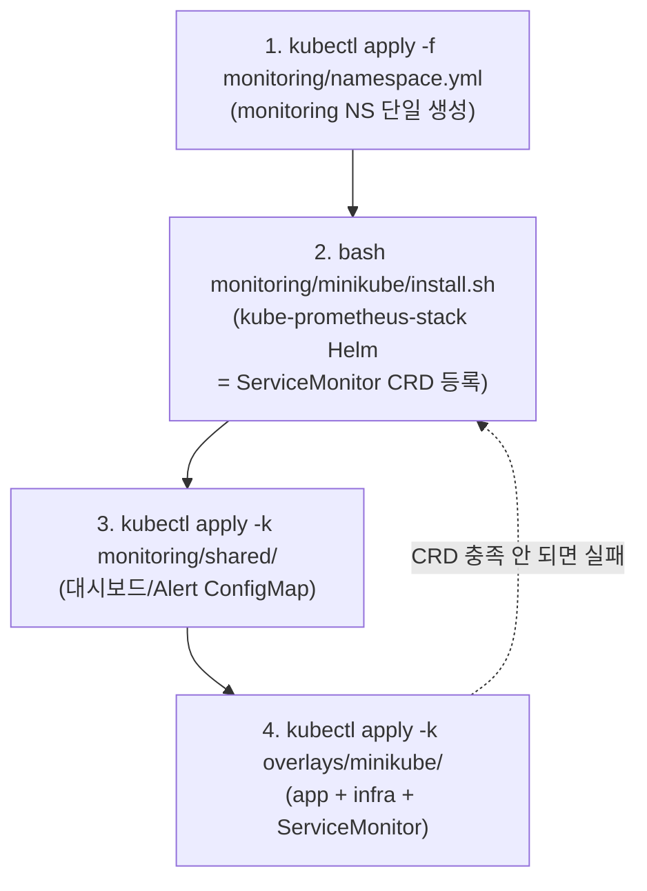
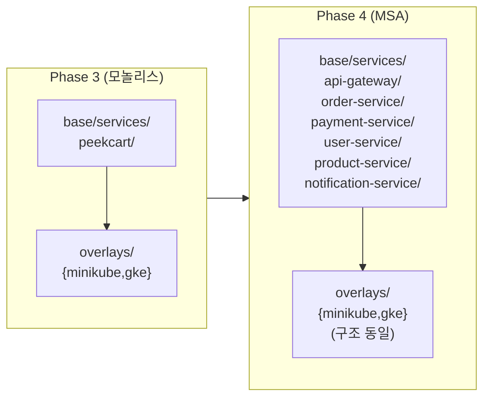

13편에서 CI가 "검증된 이미지"를 GHCR에 올리는 데까지 왔다. 그런데 이미지 하나가 레지스트리에 있다고 서비스가 뜨는 건 아니다. 그 이미지를 *어디에, 어떤 환경 설정으로 어떤 방식으로 외부에 노출해서* 띄울지를 선언해야 한다. 그게 Kubernetes 매니페스트의 몫이다.

문제는 환경이 하나가 아니라는 데 있다. PeekCart는 **로컬 minikube에서 매니페스트를 시행착오로 다듬고 부하 측정은 GKE에서** 했다. 두 환경은 이미지를 가져오는 방법도, 외부 노출 방식도, 리소스 예산도 다르다. 가장 쉬운 길은 `k8s/minikube/`와 `k8s/gke/`에 매니페스트를 통째로 두 벌 복사하는 것이다. 하지만 그 길은 곧 "한쪽만 고치고 다른 쪽을 깜빡하는" drift로 무너진다. 이번 글은 그 drift를 막기 위해 **Kustomize base/overlays**로 "공통은 한 번, 차이만 patch로" 선언한 구조와, **minikube에서 시작해 GKE로 옮겨간 환경 진화**, 그리고 그 과정에서 **monitoring 스택을 base에서 떼어낸** 결정을 정리한다.

이 글에서 쓰는 용어는 다음 뜻으로 읽으면 된다.

| 용어                                  | 이 글에서의 의미                                                                      |
| ----------------------------------- | ------------------------------------------------------------------------------ |
| 매니페스트(manifest)                     | K8s에 "이 리소스를 이 상태로 둬라"라고 선언하는 YAML. Deployment, Service, PVC 등                 |
| Kustomize                           | 매니페스트를 템플릿 없이 *겹쳐 쓰는* 도구. base를 두고 overlay에서 patch로 차이만 덮는다. `kubectl -k`에 내장  |
| base                                | 환경과 무관한 공통 매니페스트 묶음. 어느 환경에서도 똑같은 부분                                           |
| overlay                             | 특정 환경(minikube/gke)이 base에 적용하는 차이(patch)의 묶음                                  |
| patch                               | base의 일부 필드만 덮어쓰는 조각. strategic merge(gvk+name 기준 병합)와 JSON6902(경로 기준 조작) 두 방식 |
| drift                               | 같아야 할 두 설정이 시간이 지나며 서로 어긋나는 것. 매니페스트 복제의 고질병                                   |
| minikube                            | 로컬 머신에 단일 노드 K8s를 띄우는 도구. 빠른 반복엔 좋지만 리소스가 host에 묶임                             |
| GKE                                 | Google Kubernetes Engine. 관리형 K8s. PeekCart는 부하 측정용으로 사용                       |
| NodePort / LoadBalancer / ClusterIP | Service의 외부 노출 방식. 순서대로 "노드 포트 직접 / (클라우드)LB / 클러스터 내부 전용"                     |
| HPA                                 | HorizontalPodAutoscaler. CPU 같은 지표로 Pod 수를 자동 조절                               |
| ServiceMonitor                      | Prometheus Operator의 CRD. "이 서비스의 메트릭을 긁어가라"를 선언. CRD가 먼저 깔려 있어야 적용됨           |
| CRD                                 | CustomResourceDefinition. K8s 기본에 없는 리소스 타입을 추가하는 정의. ServiceMonitor는 이 위에 산다  |

### 쿠버네티스가 처음이라면

이 글은 "이미 띄운 서비스를 K8s로 옮긴다"가 아니라 "K8s에 **어떻게 올릴지를 선언**한다"가 주제다. 그래서 먼저 등장 인물 몇만 아는게 중요하다.

- **컨테이너 / Pod**: 우리 앱(`app.jar`를 담은 Docker 이미지, 13편 참고)이 실제로 도는 단위. K8s에서 컨테이너는 **Pod**라는 봉투에 담겨 뜬다. Pod는 언제든 죽거나 다시 뜰 수 있는 *일회용*이라고 생각하면 된다.
- **Deployment**: "이 Pod를 몇 개 띄우고, 죽으면 다시 살려라"를 K8s에 맡기는 선언. 우리가 Pod를 직접 만들지 않고 Deployment에 "peekcart Pod 1개 유지해줘"라고 적으면 K8s가 알아서 그 개수를 지킨다.
- **Service**: Pod는 죽고 살며 IP가 계속 바뀐다. 그 앞에 **고정된 주소 하나**를 세워 "이 이름으로 오는 요청을 살아있는 Pod 중 하나로 연결"해 주는 게 Service. 외부에 어떻게 노출하느냐(ClusterIP / NodePort / LoadBalancer)가 환경마다 갈리는 대표 지점이다.
- **PVC (PersistentVolumeClaim)**: Pod가 일회용이라 그 안에 쌓은 데이터도 Pod와 함께 사라진다. MySQL 데이터처럼 살아남아야 하는 것은 **PVC**라는 별도 디스크에 둔다. "디스크 한 장 주세요"라는 요청서라고 보면 된다.
- **Namespace**: 리소스를 담는 *구획(폴더)*. PeekCart는 앱·인프라를 `peekcart`, 모니터링 도구를 `monitoring` 구획에 나눠 담는다.
- **매니페스트(manifest)와 `kubectl apply`**: 위 모든 것을 YAML 파일(=매니페스트)에 "원하는 상태"로 적고 `kubectl apply`로 제출하면, K8s가 현재 상태를 그 선언에 *맞춘다*. "이렇게 해라(명령형)"가 아니라 "이런 상태였으면 좋겠다(선언형)"라고 적는 게 핵심이다. 이 글의 base/overlays는 결국 **그 YAML을 환경별로 어떻게 조직하느냐**의 이야기다.

---

이번 학습에서 확인하고 싶은 질문은 다음과 같다.

1. 환경별로 매니페스트를 복사하는 대신 base/overlays로 나눈 이유는 무엇인가? 무엇을 base에 두고 무엇을 overlay에 두는가?
2. minikube는 왜 초기 검증에는 충분했고, 부하 측정에는 부족했는가?
3. minikube → GKE 전환에서 *실제로* 바뀌는 매니페스트는 어디인가? (이미지, 노출, 리소스, 스토리지)
4. monitoring 스택을 base에서 떼어낸 이유는 무엇인가? base가 "환경 무관"이 아니었다는 건 무슨 뜻인가?
5. "self-contained overlay"라면서 왜 `apply -k overlays/gke/` 단독 실행은 실패하는가?
6. Phase 4에서 서비스가 N개로 늘면 이 구조는 "파일 추가"만으로 확장되는가?

---

## 문제 상황: 환경은 둘인데 매니페스트는 하나여야 한다

Phase 1·2까지 PeekCart의 인프라는 `docker-compose.yml` 하나였다. MySQL/Redis/Kafka를 컴포즈로 띄우고 Spring Boot는 로컬에서 `bootRun`으로 실행했다. Phase 3의 과제는 이걸 **K8s 위에 올리는 것**이고, 여기서 "환경이 둘"이라는 문제가 처음 생긴다.

- **minikube (로컬)**: K8s 매니페스트는 한 번에 맞지 않는다. `apply → describe → 로그 확인 → 수정 → 다시 apply`를 수십 번 왕복하며 다듬어야 한다. 이 반복을 클라우드에서 하면 느리고 돈이 든다. 그래서 Task 3-1~3-3(CI, 매니페스트 작성, 관측성 스택)은 로컬 minikube에서 했다(ADR-0004 §Context).
- **GKE (클라우드)**: 부하 테스트(Task 3-4)와 HPA 검증(Task 3-5)은 *측정의 정확도*가 핵심이다. minikube는 host 16GB 안에 앱·인프라·Prometheus·부하 도구가 전부 공존해 서로 간섭하고, 부하 발생기 자체가 병목이 돼 수치를 왜곡한다(ADR-0004 §한계). 그래서 측정은 GKE로 옮겼다.

두 환경은 다음이 다르다.

| 항목     | minikube               | GKE                   |
| ------ | ---------------------- | --------------------- |
| 이미지 출처 | 로컬 빌드 (레지스트리 pull 안 함) | Artifact Registry     |
| 외부 노출  | NodePort 30080         | Internal LoadBalancer |
| 앱 리소스  | base 기본값 (작게)          | e2-standard-4 기준 상향   |
| 스토리지   | minikube 기본 SC         | `standard-rwo` 명시     |
| HPA    | 없음                     | min=1 / max=3         |

이 차이를 다루는 가장 단순한 방법은 `k8s/minikube/`와 `k8s/gke/`에 **전체 매니페스트를 두 벌** 두는 것이다. 하지만 그러면 공통 부분(예: probe 설정, Service 포트, 컨테이너 환경변수)을 고칠 때마다 *두 곳을 동기화*해야 한다. 한쪽만 고치고 다른 쪽을 깜빡하는 순간 두 환경이 미묘하게 달라지고("minikube에선 되는데 GKE에선…"), 이는 13편에서 CI로 닫으려 했던 "내 머신에선 되는데"가 인프라 레이어에서 재발하는 것과 같다. Phase 4에서 서비스가 늘면 이 drift 비용은 `서비스 수 × 환경 수`로 폭증한다.

그래서 필요한 건 **"공통은 한 번만 쓰고, 환경 차이만 따로 선언"**하는 구조다. 이게 Kustomize base/overlays다.

---

## 선택한 설계

### 1. base/overlays — 공통은 base, 차이만 patch

Kustomize는 템플릿 엔진(Helm의 Go template 같은)이 아니다. base 매니페스트를 그대로 두고, overlay가 **그 위에 patch를 겹쳐** 일부 필드만 덮어쓴다. PeekCart의 `k8s/` 구조는 이렇다.

```
k8s/
├── base/                          # 환경 무관 공통 (ADR-0005)
│   ├── namespace.yml
│   ├── infra/{mysql,redis,kafka}/ # 디렉토리당 단일 통합 파일
│   ├── services/peekcart/         # Phase 3: 모놀리스 단일 서비스
│   │   ├── deployment.yml         # Deployment + Service (ClusterIP)
│   │   ├── configmap.yml
│   │   ├── secret.yml
│   │   └── servicemonitor.yml
│   └── kustomization.yml
├── overlays/
│   ├── minikube/                  # 로컬 검증
│   │   ├── kustomization.yml
│   │   └── patches/               # imagePullPolicy: Never, NodePort
│   └── gke/                       # 부하 테스트 / 운영
│       ├── kustomization.yml      # patches + images + hpa
│       ├── hpa.yml
│       ├── README.md
│       └── patches/               # LoadBalancer, 리소스 상향, PVC SC
└── monitoring/                    # base에서 분리 (ADR-0006, 아래 3절)
```

판단 기준은 단순하다. **"환경이 달라도 똑같은가 → base, 환경마다 달라야 하는가 → overlay patch."**  base의 `deployment.yml`을 보면 환경과 무관한 것만 들어 있다.

```yaml
# k8s/base/services/peekcart/deployment.yml (발췌)
spec:
  replicas: 1
  template:
    spec:
      containers:
        - name: peekcart
          image: ghcr.io/kimgyuilli/peakcart:latest
          resources:
            requests: { cpu: 250m, memory: 512Mi }   # ← 보수적 기본값
            limits:   { cpu: 1000m, memory: 1Gi }
          startupProbe:    { httpGet: { path: /actuator/health/liveness, port: 8080 }, failureThreshold: 30, periodSeconds: 5 }
          readinessProbe:  { httpGet: { path: /actuator/health/readiness, port: 8080 }, periodSeconds: 10 }
          livenessProbe:   { httpGet: { path: /actuator/health/liveness,  port: 8080 }, periodSeconds: 10 }
---
apiVersion: v1
kind: Service
spec:
  type: ClusterIP        # ← 가장 보수적인 노출. 환경별로 overlay가 바꾼다
```

잠깐 — **probe**는 K8s가 Pod에게 주기적으로 던지는 *건강검진*이다. 셋의 역할이 다르다. **startupProbe**는 "느린 첫 부팅이 끝났는지"를 보고(끝날 때까지 아래 두 검사를 미뤄, 부팅 중인 앱을 성급히 죽이지 않는다), **readinessProbe**는 "지금 요청을 받아도 되는지"를 보며(실패하면 Service가 그 Pod로 트래픽을 *안* 보낸다), **livenessProbe**는 "죽었는지"를 본다(실패하면 컨테이너를 *재시작*한다). 셋 다 앱의 `/actuator/health`(Spring Boot가 제공하는 상태 엔드포인트)에 물어본다. 이 건강검진 규칙은 어느 환경에서도 같으니 base에 둔다.

반면 `image`·`resources`·`Service.type`은 환경마다 달라야 하므로, base에는 **가장 보수적인 기본값**(GHCR 이미지, 작은 리소스, ClusterIP)만 두고 overlay가 덮는다. base가 그 자체로도 (가장 작은 환경에선) 동작하도록 두는 게 핵심이다 — overlay는 "차이"만 표현하면 된다.

### 2. minikube overlay와 gke overlay — patch가 표현하는 차이

overlay의 `kustomization.yml`은 `resources: [../../base]`로 base를 통째로 가져온 뒤 `patches:`로 차이만 얹는다. 두 환경의 patch를 나란히 보면 "무엇이 환경 차이인가"가 그대로 드러난다.

**minikube** — 로컬 빌드 이미지를 쓰고(레지스트리에서 pull하지 않음), `minikube service`로 접속할 NodePort를 연다.

```yaml
# overlays/minikube/patches/peekcart-deployment.yml — JSON6902
- op: add
  path: /spec/template/spec/containers/0/imagePullPolicy
  value: Never            # ← 로컬에 빌드된 이미지만 사용, pull 시도 안 함

# overlays/minikube/patches/peekcart-service.yml
- op: replace
  path: /spec/type
  value: NodePort
- op: add
  path: /spec/ports/0/nodePort
  value: 30080
```

**gke** — Artifact Registry 이미지, VPC 내부 전용 LoadBalancer, e2-standard-4에 맞춘 리소스 상향, 명시적 StorageClass, 그리고 HPA.

```yaml
# overlays/gke/patches/peekcart-deployment.yml — strategic merge
apiVersion: apps/v1
kind: Deployment
metadata:
  name: peekcart                               # ← 이 name 으로 base 의 Deployment 를 찾는다
  namespace: peekcart
spec:
  template:
    spec:
      containers:
        - name: peekcart                       # ← 컨테이너도 이름으로 매칭 (인덱스 아님)
          resources:
            requests: { cpu: 500m,  memory: 1Gi }
            limits:   { cpu: 2000m, memory: 2Gi }

# overlays/gke/patches/peekcart-service.yml — strategic merge
apiVersion: v1
kind: Service
metadata:
  name: peekcart                               # ← gvk + name 으로 base 의 Service 매칭
  namespace: peekcart
  annotations:
    networking.gke.io/load-balancer-type: "Internal"
spec:
  type: LoadBalancer
```

여기서 설계 결정 하나를 짚어야 한다. **gke patch는 strategic merge, minikube patch는 JSON6902를 섞어 쓴다.** 둘의 차이는 "어떻게 대상을 찾고 어떻게 덮는가"다.

- **JSON6902**(`op/path/value`)는 JSON Pointer 경로로 대상을 가리킨다. 경로가 항상 인덱스인 건 아니지만, 이 예시처럼 **리스트 안의 항목**(`/spec/template/spec/containers/0/...`)을 찍을 때 인덱스 취약성이 생긴다. `containers/0`은 "0번째 컨테이너"라, base에 사이드카가 추가돼 순서가 바뀌면 엉뚱한 컨테이너에 patch가 붙는다.
- **strategic merge**는 patch의 `apiVersion`+`kind`+`metadata.name`(gvk + name)으로 base 리소스를 찾고, annotations 같은 map은 **키 단위로 병합**한다. 그래서 gke patch는 헤더에 `kind: Deployment` / `name: peekcart`를 명시하고(그 덕에 `target:` 지정도 불필요), 컨테이너도 `name`으로 매칭한다. base에 다른 컨테이너나 annotation이 추가돼도 안전하다.

gke patch 주석에 그 의도가 적혀 있다. *"strategic merge: container는 name(`peekcart`)으로 매칭되므로 base에 sidecar가 추가되어도 잘못된 컨테이너에 resources가 붙지 않음 (과거 JSON6902 `containers/0` 인덱스 방식 대비 개선)."* 즉 **Phase 4에서 서비스 메시 사이드카 등이 끼어들 가능성**을 내다보고, 리소스·노출처럼 구조가 진화할 부분은 인덱스 의존을 버린 것이다. 반면 PVC의 StorageClass 일괄 적용은 "PVC 종류 전체"를 대상으로 해야 해서 JSON6902 + target이 더 맞는다.

```yaml
# overlays/gke/patches/pvc-storageclass.yml — JSON6902 + target
- op: add
  path: /spec/storageClassName
  value: standard-rwo
# kustomization.yml에서 target: { kind: PersistentVolumeClaim } 으로
# base의 mysql/redis/kafka PVC 3건에 한 번에 적용
```

이미지 경로도 overlay가 바꾼다. gke `kustomization.yml`의 `images:` 필드가 GHCR 경로를 Artifact Registry로 치환한다(`PROJECT_ID_PLACEHOLDER`는 apply 직전 `kustomize edit set image`로 로컬에서만 채우고 커밋하지 않는다 — 「한계」절에서 다룬다).

### 3. monitoring을 base에서 떼어낸다. base의 "환경 무관"을 진짜로 만들기

ADR-0005가 base/overlays를 도입했을 때, monitoring 스택(Prometheus Helm values, Grafana 대시보드/Alert, ServiceMonitor)도 `base/monitoring/` 아래 있었다. 그런데 머지 직후 리뷰에서 **base가 사실은 환경 무관이 아니었다**는 게 드러났다.

- `values-prometheus.yml`이 첫 줄부터 "minikube 경량 설정"이었다. `retention: 6h`, Prometheus `memory 512Mi`, Grafana `NodePort 30030`. 전부 minikube 8GB 예산에 정해진 값이라 GKE에선 과소하거나 부적합했다.
- ServiceMonitor는 `peekcart` 네임스페이스인데 디렉토리는 `base/monitoring/`(나머지는 `monitoring` 네임스페이스). "디렉토리 = 관심사"와 "디렉토리 = 네임스페이스" 두 축이 섞여 혼란스러웠다.
- `install.sh`가 Helm으로 `monitoring` 네임스페이스를 만들고 base가 그 네임스페이스에 의존하는 ConfigMap을 포함했다. Helm이 만든 걸 Kustomize가 재사용하는 순환 의존.

결정은 **monitoring 전체를 base에서 분리**하는 것이었다. 결과 구조:

```
k8s/monitoring/
├── namespace.yml          # monitoring NS 생성의 단일 주체 (ADR-0006 불변식 5)
├── shared/                # 환경 무관 — 대시보드 JSON, Grafana Alert
│   └── kustomization.yml  # configMapGenerator가 *.json → ConfigMap
├── minikube/
│   ├── values-prometheus.yml   # retention 6h, NodePort 30030, 경량 limits
│   └── install.sh
└── gke/
    ├── values-prometheus.yml   # retention 24h, Internal LB, PVC standard-rwo, 상향 limits
    └── install.sh
```

이 분리로 두 가지를 동시에 얻는다. (1) base는 이제 진짜로 환경 무관이 됐다 — `peekcart` 네임스페이스 앱/인프라만 남는다. (2) ServiceMonitor는 "앱이 자기 메트릭을 노출하는 방법"이라는 관심사를 따라 `base/services/peekcart/`로 이동했다. 서비스에 속한 것은 서비스 디렉토리에 둔다는 원칙이 생겼고, 이건 Phase 4에서 서비스마다 ServiceMonitor를 동봉하는 패턴으로 자연 확장된다.

---

## 구현 구조: fresh 클러스터에 4단계로 올린다

base/overlays/monitoring이 나뉘어 있으니, fresh 클러스터 배포는 한 줄이 아니라 **순서 있는 4단계**다. minikube 기준:



순서가 강제되는 이유는 **CRD 의존성**이다. CRD(CustomResourceDefinition)는 쉽게 말해 **쿠버네티스에게 새로운 리소스 종류를 가르치는 일**이다. `Deployment`·`Service`는 K8s가 처음부터 아는 단어지만, `ServiceMonitor`는 기본에 없는 단어 — Prometheus가 추가하는 종류라, Prometheus 도구를 먼저 설치해야 K8s가 그 단어를 알아듣는다. 그 설치를 2단계가 **Helm**으로 한다. Helm은 여러 매니페스트를 한 묶음(차트)으로 설치해 주는 패키지 매니저로, Prometheus/Grafana처럼 구성요소가 많은 도구를 통째로 깔 때 쓴다(우리 앱·인프라는 Kustomize로 직접 관리하고, 덩치 큰 모니터링 도구만 Helm에 맡긴다 — 이 도구 혼재의 트레이드오프는 「한계」절에서 다룬다). 그래서 2단계를 건너뛰고 4단계를 치면, K8s가 `ServiceMonitor`라는 단어 자체를 몰라 `no matches for kind "ServiceMonitor"`로 깨진다. GKE도 같은 4단계이고, install 진입점(`monitoring/gke/install.sh`)만 환경별로 다르다.

여기서 "self-contained overlay"라는 말의 정확한 의미가 나온다. ADR-0006은 overlay가 self-contained라고 했지만, 그게 **`apply -k overlays/minikube/` 단독으로 fresh 클러스터에 성공한다는 뜻은 아니다.** ServiceMonitor의 CRD 선행 의존은 cert-manager·Istio·ArgoCD(각각 인증서·서비스메시·배포 자동화 도구로, 모두 자기 CRD를 먼저 깔아야 쓸 수 있다) 같은 K8s 생태계의 흔한 패턴과 똑같다. overlay가 self-contained라는 건 **"monitoring 네임스페이스 리소스를 포함하지 않고, 외부 상태를 만들거나 변형하지 않는다"**는 의미다 — 즉 overlay를 적용해도 monitoring 스택을 건드리지 않는다는 *격리* 보장이지, *무의존* 보장이 아니다. 이 구분을 흐리면 "왜 단독 apply가 실패하지?"에서 헤맨다.

base `kustomization.yml`에는 의도적으로 빠진 게 하나 있다 — `namespace:` 필드다.

```yaml
# k8s/base/kustomization.yml (발췌)
# kustomize `namespace:` 필드는 사용하지 않습니다 — 모든 리소스를 한 NS 로 강제하기 때문.
resources:
  - namespace.yml
  - infra/mysql/mysql.yml
  - ...
  - services/peekcart/servicemonitor.yml
```

Kustomize의 `namespace:` 필드는 *모든* 리소스를 한 네임스페이스로 강제 변환한다. 이 필드를 안 쓰기로 한 결정의 **출발점은 ADR-0005 시점**이다 — 그때 base는 `peekcart`(앱 리소스)와 `monitoring`(Grafana ConfigMap/Alert) 두 네임스페이스에 걸쳐 있어서, 한 NS로 강제하는 필드를 쓸 수 없었다. 이후 ADR-0006이 monitoring을 base에서 떼어내면서 **현재 base는 전부 `peekcart` 단일 네임스페이스**다(`base/kustomization.yml`도 "모든 리소스는 peekcart NS"라고 선언한다). 즉 *지금은* `namespace:` 필드를 쓸 수도 있게 됐지만, base는 여전히 그 필드 대신 **각 매니페스트가 `metadata.namespace`를 직접 명시**하는 방식을 유지한다. 이 선택이 「한계」절의 위험과 직결된다.

GKE 전용으로 추가되는 `hpa.yml`은 overlay의 `resources:`에 더해진다.

```yaml
# overlays/gke/hpa.yml (발췌)
spec:
  minReplicas: 1
  maxReplicas: 3
  metrics:
    - type: Resource
      resource: { name: cpu, target: { type: Utilization, averageUtilization: 60 } }
  behavior:
    scaleUp:   { stabilizationWindowSeconds: 30 }    # 빨리 늘리고
    scaleDown: { stabilizationWindowSeconds: 300 }   # 천천히 줄인다
```

이 선언을 풀면 "peekcart Pod의 평균 CPU 사용률이 **60%를 넘으면** Pod 수를 **최대 3개까지 자동으로 늘리고**(min=1), 부하가 빠지면 다시 줄여라"는 뜻이다. 즉 트래픽에 따라 Pod 수가 스스로 1↔3 사이를 오간다. HPA가 gke overlay에만 있는 건 의도다. minikube는 8GB 예산상 max=3 scale-out을 받아낼 여유가 없어(Pod를 늘리다 메모리가 부족하면 기존 Pod가 쫓겨나는 eviction 위험), HPA 검증 자체가 GKE의 일이기 때문이다. scaleUp 30초 / scaleDown 300초의 비대칭은 "부하엔 빠르게(30초) 대응해 늘리되, 줄일 땐 천천히(300초) — 잠깐 부하가 출렁일 때마다 Pod를 늘렸다 줄였다 하는 flapping을 막는다"는 표준 운영 감각이다. 이 HPA가 실제로 1→3으로 떴는지는 17편(부하 테스트 세션 C)에서 검증한다.

---

## 한계와 트레이드오프

### `metadata.namespace` 누락이 default 네임스페이스로 새는 위험

base가 `namespace:` 필드를 안 쓰는 대가다. 각 매니페스트가 `metadata.namespace: peekcart`를 직접 적어야 하는데, **새 리소스를 추가하면서 이 줄을 깜빡하면** 그 리소스는 조용히 `default` 네임스페이스로 간다. Kustomize의 `namespace:` 필드를 썼다면 자동으로 교정됐을 실수가, 여기선 안전망 없이 통과한다. ADR-0005도 이 위험을 명시했다 — *"신규 리소스에서 `metadata.namespace` 누락 시 default NS로 새는 위험. Kustomize의 안전망 없음. 리뷰어가 명시적으로 확인해야 함 (자동 lint 미도입)."* Phase 4에서 서비스가 늘수록 이 수동 확인의 부담이 커지므로, lint 도입이 18편(부채 정리)의 후보다.

### 이미지 경로 치환과 운반이 수동이다 — GitOps가 아니다

gke overlay의 이미지 경로는 `PROJECT_ID_PLACEHOLDER`다. apply 직전에 operator가 로컬에서 채워야 한다.

```bash
cd k8s/overlays/gke
kustomize edit set image \
  ghcr.io/kimgyuilli/peakcart=asia-northeast3-docker.pkg.dev/<YOUR_PROJECT>/peekcart/peekcart:latest
kubectl kustomize .               # ← 렌더링 확인
kubectl apply -k .                # ← 배포 순서 4단계 (cwd = overlays/gke)
git restore kustomization.yml     # ← apply 후 반드시 원복 (커밋하면 안 됨)
```

게다가 이미지를 GHCR에서 Artifact Registry로 옮기는 것도 수동(`crane copy`)이다. 13편의 CI는 GHCR까지만 push하고, 거기서 GKE 레지스트리로의 운반은 파이프라인 밖이다. README에 그 이유가 적혀 있다 — *"Phase 3 부하 테스트는 측정 빈도가 낮아 CI 자동화 대신 수동 복사를 사용."* 측정이 드물고 일회성이라 자동화 우선순위를 낮춘 *의도된* 수동이지만, 결과적으로 **이 구조는 GitOps가 아니다.** "git에 선언된 상태 = 클러스터 상태"가 성립하지 않고, `git restore`를 깜빡하면 placeholder가 그대로 커밋되거나 로컬 치환이 누출될 여지가 있다. Phase 4에서 서비스가 N개면 N번의 수동 운반·치환이 되므로, 여기서 ArgoCD/Flux 같은 GitOps 도구나 CI 자동 운반이 필요해진다.

### minikube 수치와 GKE 수치는 비교할 수 없다

환경 진화 서사("로컬 검증 → 클라우드 측정")의 비용이다. minikube와 GKE는 CPU·메모리·네트워크·스토리지가 전부 달라, 같은 부하를 줘도 TPS를 **같은 축에서 비교할 수 없다.** 다만 ADR-0004가 짚듯 minikube 단계에서 실제 부하 측정을 한 기록 자체가 없어(거긴 매니페스트 시행착오용이었다) 비교 대상이 애초에 없다 — 실질 피해는 없지만, "환경을 바꾸면 이전 수치와 단절된다"는 건 측정 설계에서 늘 기억할 트레이드오프다. 그래서 16~17편의 부하 리포트는 항상 "GKE / asia-northeast3 / e2-standard-4"라는 환경 스펙을 함께 박아 둔다.

### Helm과 Kustomize가 한 트리에 섞여 있다

monitoring 스택(kube-prometheus-stack)은 Helm으로, 앱/인프라는 Kustomize로 관리한다. 한 `k8s/` 아래 두 도구가 공존하는 셈이다. ADR-0005는 Helm 단일화(Alternative A)도 검토했지만, "환경 차이가 patch 3~4개 수준"인데 Helm의 Go template은 과하다고 봤다. 대신 kube-prometheus-stack은 직접 작성하기엔 너무 크니 Helm 차트를 그대로 쓴다. `install.sh`가 `helm upgrade --install`로 이 복잡성을 감추지만, **"왜 어떤 건 `apply -k`이고 어떤 건 `bash install.sh`인가"**를 배포 순서로 외워야 하는 인지 비용은 남는다.

### 운영 정리가 사람 손에 달려 있다 — 크레딧 누수 리스크

GKE는 측정할 때만 띄우고 끝나면 지운다(비용 최소화). 그런데 클러스터를 지워도 **PD(영구 디스크)나 예약 IP는 orphan으로 남아** 계속 과금될 수 있다. ADR-0004의 운영 체크리스트가 이걸 막지만 전부 수동이다.

```bash
# 실제 정리 스크립트(loadtest/cleanup.sh) 기준 — zone/이름은 asia-northeast3-a 단일 zone
gcloud container clusters delete peekcart-loadtest --zone=asia-northeast3-a
gcloud compute instances delete peekcart-loadgen   --zone=asia-northeast3-a
gcloud compute disks list     --filter="zone:(asia-northeast3-a)"   # orphan PD 확인
gcloud compute addresses list --filter="region:(asia-northeast3) OR global"  # 예약 IP 확인
```

billing alert를 ₩50,000에 걸어 안전망을 두긴 했지만, 체크리스트를 빠뜨리면 크레딧이 새는 구조다. 이건 "측정 시에만 기동"이라는 비용 전략이 떠안는 본질적 리스크다.

---

## 이 구조가 보장한 것 (과 못한 것)

배포 구조를 "무엇을 보장하는가"의 관점에서 보면 명확해진다.

**보장하는 것**

- **공통 매니페스트의 단일 소스.** probe·포트·환경변수 같은 공통 설정은 base 한 곳에만 있다. minikube/gke를 따로 고칠 일이 없으니 복제 drift가 구조적으로 차단된다. 환경 차이는 overlay patch에 국소화돼 "이 환경이 base와 무엇이 다른가"를 patch 파일만 보면 안다 — 리뷰·롤백 단위가 명확하다.
- **두 환경의 실제 배포 검증.** minikube에서 Task 3-1~3-3(CI·매니페스트·관측성 스택)을 끝까지 돌렸고, GKE에서 부하 테스트와 HPA 검증을 수행했다. base/overlays가 "이론상 분리"가 아니라 **두 환경에서 실제로 떠봤다**는 게 핵심이다.
- **Phase 4 확장이 파일 추가로 끝나는 구조.** 서비스를 늘릴 때 `base/services/` 아래 형제 디렉토리를 추가하고 `base/kustomization.yml`에 경로 한 줄만 더하면 된다. 기존 파일 수정이 없어 PR 리뷰가 단순하다(ADR-0005 §긍정적 영향).

**보장하지 못하는 것**

- **단독 `apply -k`의 self-contained 배포** — ServiceMonitor의 CRD 선행 의존 때문에 4단계 순서를 지켜야 한다. overlay는 *격리*는 보장하지만 *무의존*은 아니다.
- **선언 = 상태(GitOps)** — 이미지 경로 치환과 운반이 수동이라, git에 적힌 것이 곧 클러스터 상태인 모델이 아니다.
- **환경 간 수치 비교** — minikube와 GKE는 다른 축이라 성능 수치를 잇대어 볼 수 없다.
- **자동 정리** — orphan 리소스 정리가 수동 체크리스트에 의존한다.

13편 CI에서 본 패턴("핵심은 단단히, 가장 중요한 보장의 일부는 공백으로 정직하게")이 여기서도 반복된다. 배포 구조의 공백은 "self-contained 자동화·GitOps·자동 정리" 세 가지다.

---

## 자료는 어떤 질문에 연결해서 읽을까

| 질문 | 같이 읽을 자료 | 이 글에서 연결되는 지점 |
| --- | --- | --- |
| base/overlays와 patch(strategic merge vs JSON6902)의 동작 | Kustomize 공식 가이드, *Introduction / Patches* | "base/overlays" · patch 방식 선택 절 |
| Service 노출 방식(ClusterIP/NodePort/LoadBalancer)의 차이 | Kubernetes 공식 문서, *Service* | minikube NodePort vs GKE Internal LB |
| HPA가 지표로 Pod 수를 조절하는 원리와 stabilization window | Kubernetes 공식 문서, *Horizontal Pod Autoscaling* | gke `hpa.yml` scaleUp/scaleDown 비대칭 |
| CRD와 Operator 패턴, ServiceMonitor의 CRD 의존 | Prometheus Operator 문서, *Design / ServiceMonitor* | 4단계 배포 순서 · self-contained 해석 |
| GitOps에서 "선언 = 상태"가 의미하는 것 | Argo CD 문서, *Core Concepts* | 이미지 수동 치환이 GitOps가 아닌 이유 |
| GKE의 Internal LoadBalancer와 StorageClass(`standard-rwo`) | Google Cloud 문서, *GKE Networking / Storage* | gke patch의 LB annotation · PVC SC |

---

## Phase 4 MSA에서는 어떻게 바뀌는가

지금 `k8s/`는 "모놀리스 한 덩어리(`services/peekcart/`)를 두 환경에 배포"하는 구조다. Phase 4에서 서비스가 N개로 갈라지면 이 그림이 확장된다.



**그대로 가는 것**

- **base/overlays/monitoring의 3분할 구조.** 서비스가 늘어도 "공통은 base, 환경 차이는 overlay, 관측성은 별도 트리"라는 경계는 유지된다. ADR-0006이 ServiceMonitor를 `base/services/peekcart/`로 옮긴 결정이 여기서 빛난다 — 각 서비스가 자기 `servicemonitor.yml`을 동봉하는 패턴으로 자연 확장된다.
- **공통 인프라 base.** mysql/redis/kafka는 서비스가 갈라져도 (Phase 4 초기엔) 공통 인프라로 base에 남는다. 서비스별 DB 분리는 그 위에서 점진적으로 일어난다.
- **strategic merge 우선 결정.** 사이드카가 끼어들 가능성을 내다보고 인덱스 의존을 버린 결정이, 서비스 메시가 들어올 Phase 4에서 실제로 보상받는다.

**바뀌는 것**

- **`services/peekcart/` 하나 → 서비스별 디렉토리 N개.** `order-service/`, `payment-service/`, `api-gateway/`… 각자 `deployment.yml` + `service.yml` + `servicemonitor.yml`을 base에 둔다. base/overlays 패턴 덕에 이건 *파일 추가*이지 *구조 변경*이 아니다.
- **이미지가 N개, 운반·치환도 N배.** 「한계」에서 본 수동 이미지 운반·`PROJECT_ID` 치환이 서비스 수만큼 늘어난다. 모놀리스에선 "측정이 드물어 수동"이 통했지만, 서비스 N개에선 수동이 한계에 부딪힌다. **여기서 GitOps(ArgoCD/Flux) 또는 CI 자동 운반이 비로소 본질적으로 필요해진다.**
- **HPA가 서비스마다 따로 — 단, 위치는 여전히 환경 쪽.** 지금은 peekcart 하나에 HPA 하나가 GKE overlay에만 있다(minikube는 예산상 제외). Phase 4에선 트래픽 특성이 다른 서비스마다 독립 HPA가 필요해지지만 — 주문 서비스와 알림 서비스의 scale 기준은 같을 수 없다 — HPA는 "환경마다 켜고 끄는" 관심사라 base가 아니라 Phase 3과 동일하게 `overlays/gke/` 쪽에 서비스별로 추가된다. 즉 *서비스 수만큼* 늘되, *base가 아니라 overlay에서* 늘어난다.

**그래서 Phase 4 진입 전 짚을 점**

- **`metadata.namespace` 누락 lint를 도입하고 가야 한다.** 서비스가 N개면 수동 리뷰로 default 네임스페이스 누출을 막는 건 비현실적이다. `kubectl apply --dry-run=server -k overlays/<env>`(서버 검증)나 `kubectl kustomize overlays/<env> | kubeconform`(렌더 결과를 스키마 검사)처럼 렌더 산출물을 자동 검증하는 단계를 게이트에 넣는 게 18편(부채 정리)의 항목이다.
- **이미지 운반·치환을 자동화해야 한다.** 수동 `crane copy` + `kustomize edit set image` + `git restore`의 3단 수동은 서비스 1개라 견딘 것이다. N개에선 GitOps로 "선언 = 상태"를 회복하는 게 배포 안정성의 전제가 된다.
- **base의 "공통 인프라" 경계를 다시 그어야 한다.** 서비스별 DB 분리가 시작되면 mysql 하나를 base에 두는 가정이 깨진다. 무엇을 끝까지 공통으로 두고 무엇을 서비스 안으로 넣을지는, Phase 4에서 `common` 모듈에 무엇을 둘지(13편·18편)와 같은 결의 질문이다.
