PeekCart는 이커머스 도메인을 예제로 삼아 회원, 상품, 재고, 장바구니, 주문, 결제, 알림을 구현하는 학습 프로젝트다. 목표는 처음부터 마이크로서비스를 만드는 것이 아니라, 단일 애플리케이션에서 출발해 성능, 정합성, 운영 문제를 겪어본 뒤 서비스 분리까지 이어지는 흐름을 이해하는 것이다.

이번 글에서는 그 출발점인 단일 Spring Boot 모놀리스 구조를 본다. 하나의 애플리케이션으로 배포되지만, 내부까지 하나의 덩어리로 둔 것은 아니다. 각 도메인은 `presentation`, `application`, `domain`, `infrastructure` 네 레이어로 나뉘어 있다.

이 글에서 사용하는 프로젝트 단계는 다음 뜻으로 읽으면 된다.

|표현|이 글에서의 의미|
|---|---|
|Phase 1|단일 Spring Boot 애플리케이션으로 핵심 도메인을 구현한 단계|
|Phase 2|Redis, Kafka, Outbox, 분산 락 등을 추가해 성능과 정합성을 보강하는 단계|
|Phase 3|Kubernetes, 모니터링, 부하 테스트로 운영 관점을 검증하는 단계|
|Phase 4|Gradle 멀티모듈과 MSA를 고민하며 서비스를 분리하는 단계|
|ADR|Architecture Decision Record의 약자. 왜 특정 설계를 선택했는지 기록한 내부 의사결정 문서|

따라서 이 글은 내부 문서나 코드를 모르는 독자도 "왜 지금은 모놀리스인데 내부 구조는 나눠두었는가"를 이해할 수 있도록 정리하는 글이다.

이번 학습에서 확인하고 싶은 질문은 다음과 같다.

1. 왜 전통적인 Controller-Service-Repository 구조가 아니라 4-Layered + DDD 구조를 선택했을까?
2. Application Service와 Domain Entity는 어떤 책임을 나눠 갖는가?
3. JPA Entity를 Domain Entity로 함께 쓰는 절충안은 어떤 장단점이 있는가?
4. 멀티모듈, Clean Architecture, Hexagonal Architecture와 비교하면 현재 구조는 어디쯤에 있을까?
5. 이 구조가 나중에 서비스 분리 단계로 이어질 수 있을까?

---

## 처음에는 어떤 문제가 있었을까

이커머스 도메인은 단순 CRUD만으로 끝나지 않는다.

상품은 등록, 수정, 삭제만 있으면 되는 것처럼 보이지만 재고가 붙는 순간 동시성 문제가 생긴다. 주문은 생성만 하는 것이 아니라 결제 요청, 결제 성공, 결제 실패, 배송 준비, 배송 완료, 취소 같은 상태 전이를 가진다. 결제 실패나 타임아웃이 발생하면 주문 상태와 재고도 함께 맞춰야 한다.

이런 규칙이 모두 Service 클래스에 모이면 처음에는 편해 보여도 점점 읽기 어려워진다. Controller는 요청을 받고, Service는 모든 판단을 하고, Repository는 DB만 보는 전통적인 구조에서는 비즈니스 규칙이 Service에 집중되기 쉽다.

초기 문제 정의 당시에 이 문제를 다음처럼 보았다.

- 주문 상태 전이, 재고 차감 같은 핵심 규칙이 여러 곳에 흩어지면 유지보수하기 어렵다.
- Presentation이 DB에 직접 의존하는 식의 레이어 위반을 막아야 한다.
- 도메인 순수성을 지키고 싶지만, JPA Entity와 Domain Entity를 완전히 분리하면 매핑 코드가 크게 늘어난다.

그래서 PeekCart는 4-Layered 구조와 DDD 전술 패턴을 부분적으로 적용했다.

---

## 다른 구조와 비교하며 읽기

이번 글의 목적은 "PeekCart가 선택한 구조가 정답이다"를 주장하는 것이 아니다. 오히려 여러 구조가 어떤 문제를 해결하려고 생겼는지 비교하면서 지금 프로젝트 단계에 맞는 절충선을 찾는 것이 목표다.

참고한 글 중 하나는 [지속 성장 가능한 소프트웨어를 만들어가는 방법](https://geminikims.medium.com/%EC%A7%80%EC%86%8D-%EC%84%B1%EC%9E%A5-%EA%B0%80%EB%8A%A5%ED%95%9C-%EC%86%8C%ED%94%84%ED%8A%B8%EC%9B%A8%EC%96%B4%EB%A5%BC-%EB%A7%8C%EB%93%A4%EC%96%B4%EA%B0%80%EB%8A%94-%EB%B0%A9%EB%B2%95-97844c5dab63)이다. 이 글에서 특히 인상 깊었던 관점은 세 가지다.

- 비즈니스 로직은 상세 구현을 모두 읽지 않아도 흐름을 이해할 수 있어야 한다.
- 레이어는 폴더 이름이 아니라 참조 방향과 제약으로 통제되어야 한다.
- 모듈화는 기술 의존성을 상위 비즈니스 코드로 전파하지 않기 위한 장치가 될 수 있다.

이 관점으로 PeekCart를 다시 보면 현재 구조는 "완전한 정답"이라기보다 다음 단계로 성장하기 위한 중간 형태에 가깝다.

|구조|핵심 관심사|PeekCart에 적용한다면|부담|
|---|---|---|---|
|전통적 3-Layered|빠른 CRUD 구현|Controller-Service-Repository로 단순하게 시작한다|Service가 비대해지기 쉽다|
|Package by Feature|기능 단위 응집|`order`, `payment` 같은 도메인 패키지를 먼저 나눈다|패키지만 나누면 의존성 제약은 약하다|
|Business 중심의 Layered Architecture|비즈니스 흐름 가시화와 구현 도구 분리|Presentation-Business-Implement-Data Access로 나누고 Business가 상세 기술을 모르게 한다|Implement 레이어를 어디까지 둘지 기준이 필요하다|
|4-Layered + DDD|도메인 규칙 응집|상태 전이, 재고 차감 같은 규칙을 Entity/Domain Service에 모은다|레이어 책임을 계속 의식해야 한다|
|Hexagonal Architecture|외부 시스템 격리|Toss, Slack, Kafka, Redis를 Port/Adapter로 감싼다|Port와 Adapter가 많아져 구조가 무거워질 수 있다|
|Clean Architecture|프레임워크 독립성|UseCase와 Entity를 Spring/JPA 바깥에 두고 Adapter가 감싼다|엔티티/매퍼/DTO가 크게 늘 수 있다|
|Onion Architecture|도메인 중심 의존 방향|Domain을 가장 안쪽에 두고 Application, Infrastructure가 바깥에서 의존한다|Clean/Hexagonal과 구분이 흐려질 수 있다|
|Vertical Slice Architecture|유스케이스 단위 변경 용이성|`CreateOrder`, `CancelOrder`처럼 기능 흐름별로 코드를 묶는다|공통 도메인 규칙이 흩어질 수 있다|
|CQRS|읽기와 쓰기 모델 분리|주문 생성 Command와 상품/주문 조회 Query를 다른 모델로 최적화한다|동기화 지연과 모델 중복이 생긴다|
|Event Sourcing|상태 변경 이력 보존|주문 상태를 최종 row가 아니라 이벤트 흐름으로 복원한다|구현과 운영 난도가 높고 조회 모델이 별도로 필요하다|
|멀티모듈 모놀리스|모듈 단위 의존성 통제|Gradle 의존성으로 기술 전파를 막고 도메인 경계를 강제한다|모듈 경계 설계와 빌드 관리 비용이 생긴다|
|MSA|배포와 데이터까지 분리|Order, Payment, Notification을 독립 배포/DB 단위로 나눈다|분산 트랜잭션, 관측성, 운영 복잡도가 커진다|

이 표를 기준으로 보면 PeekCart의 첫 단계 선택은 "MSA를 흉내 낸 구조"가 아니다. 단일 애플리케이션 안에서 도메인 책임과 기술 책임을 구분해두고 나중에 멀티모듈이나 MSA로 갈 때 어떤 경계를 뽑아낼지 관찰하는 구조다.

---

## 비교군을 어떻게 분류할 수 있을까

아키텍처 이름이 많아지면 헷갈리기 쉽다. 그래서 이름보다 "무엇을 통제하려는가"로 나눠서 보는 편이 좋다.

|분류 기준|대표 구조|통제하려는 것|
|---|---|---|
|레이어 분리|3-Layered, 4-Layered, 제미니 글의 Layered Architecture|요청 처리, 비즈니스 흐름, 상세 구현, 데이터 접근의 책임|
|도메인 중심|DDD, Onion, Clean Architecture|비즈니스 규칙이 기술 세부사항에 끌려가지 않게 하는 것|
|외부 연동 격리|Hexagonal Architecture, Ports & Adapters|DB, Kafka, Redis, Toss, Slack 같은 외부 시스템 의존성|
|기능 흐름 중심|Vertical Slice Architecture|하나의 유스케이스를 변경할 때 건드리는 범위|
|읽기/쓰기 분리|CQRS|쓰기 정합성과 읽기 성능을 서로 다른 모델로 최적화하는 것|
|상태 이력 중심|Event Sourcing|현재 상태가 아니라 상태 변화의 원인과 순서|
|모듈/배포 경계|멀티모듈 모놀리스, MSA|컴파일, 배포, 데이터, 장애, 확장 단위|

PeekCart의 현재 선택은 이 중에서 `레이어 분리`, `도메인 중심`, `외부 연동 격리`를 가볍게 섞은 형태다.

- 4-Layered로 요청 처리와 기술 구현 위치를 나눈다.
- DDD 전술 패턴으로 주문 상태 전이 같은 규칙을 도메인에 둔다.
- Repository 인터페이스, `ProductPort` 같은 포트 형태로 Hexagonal의 일부 장점을 가져온다.
- 다만 Clean Architecture처럼 도메인과 JPA Entity를 완전히 분리하지는 않는다.
- 멀티모듈 모놀리스처럼 Gradle 수준의 강제력도 아직 없다.

따라서 이 글에서 현재 구조를 평가할 때는 "왜 완전한 Clean Architecture가 아닌가", "왜 처음부터 Hexagonal이나 멀티모듈이 아닌가"까지 같이 질문해야 한다. 그래야 지금 구조가 단순한 타협인지 단계에 맞춘 선택인지 구분할 수 있다.

---

## 자료는 어떤 질문에 연결해서 읽을까

아키텍처 자료는 이름만 외우면 금방 섞인다. 그래서 이번 글에서는 각 자료를 "어떤 질문에 답하기 위해 읽는가"에 연결해서 본다.

|질문|같이 읽을 자료|이 글에서 연결되는 지점|
|---|---|---|
|전통적인 레이어 구조는 무엇을 나누려는가?|Martin Fowler, [Presentation Domain Data Layering](https://martinfowler.com/bliki/PresentationDomainDataLayering.html)|Controller, Application, Domain, Infrastructure의 책임을 비교할 때|
|DDD에서 경계는 왜 중요한가?|Eric Evans, [DDD Reference](https://www.domainlanguage.com/ddd/reference/), Martin Fowler, [Bounded Context](https://martinfowler.com/bliki/BoundedContext.html)|`user`, `product`, `order`, `payment`가 단순 패키지인지 서비스 후보인지 판단할 때|
|Hexagonal은 왜 Port와 Adapter를 강조하는가?|Alistair Cockburn, [Hexagonal Architecture](https://alistair.cockburn.us/hexagonal-architecture)|`ProductPort`, Repository 인터페이스, Toss/Slack/Kafka 연동을 해석할 때|
|Clean Architecture와 Onion은 무엇이 다른가?|Robert C. Martin, [The Clean Architecture](https://blog.cleancoder.com/uncle-bob/2012/08/13/the-clean-architecture.html), Jeffrey Palermo, [The Onion Architecture: Part 1](https://jeffreypalermo.com/2008/07/the-onion-architecture-part-1/)|JPA Entity와 Domain Entity를 분리하지 않은 절충안을 평가할 때|
|레이어가 아니라 유스케이스별로 묶으면 어떨까?|Jimmy Bogard, [Vertical Slice Architecture](https://www.jimmybogard.com/vertical-slice-architecture/)|`CreateOrder`, `CancelOrder`처럼 기능 흐름 중심 구조를 비교할 때|
|CQRS와 Event Sourcing은 언제 필요한가?|Martin Fowler, [CQRS](https://martinfowler.com/bliki/CQRS.html), [Event Sourcing](https://www.martinfowler.com/eaaDev/EventSourcing.html), [What do you mean by “Event-Driven”?](https://martinfowler.com/articles/201701-event-driven.html)|서비스 분리 후 조회 모델, 이벤트, 로컬 캐시를 고민할 때|
|모놀리스 안에서 모듈 경계를 어떻게 강제할까?|Spring, [Spring Modulith Reference](https://docs.spring.io/spring-modulith/reference/index.html), Gradle, [Java Library Plugin](https://docs.gradle.org/current/userguide/java_library_plugin.html)|패키지 분리와 Gradle 멀티모듈의 차이를 볼 때|
|왜 처음부터 MSA로 가지 않을까?|Martin Fowler, [Monolith First](https://martinfowler.com/bliki/MonolithFirst.html), [Microservice Trade-Offs](https://martinfowler.com/articles/microservice-trade-offs.html)|첫 단계에서 모놀리스로 시작한 이유를 설명할 때|
|모놀리스를 서비스로 나눌 때 무엇을 기준으로 삼을까?|Martin Fowler, [How to break a Monolith into Microservices](https://martinfowler.com/articles/break-monolith-into-microservices.html), AWS, [Decompose by subdomain](https://docs.aws.amazon.com/prescriptive-guidance/latest/modernization-decomposing-monoliths/decompose-subdomain.html), Microsoft Learn, [CQRS and DDD in a microservice](https://learn.microsoft.com/en-us/dotnet/architecture/microservices/microservice-ddd-cqrs-patterns/eshoponcontainers-cqrs-ddd-microservice)|Order, Payment, Notification을 독립 서비스 후보로 볼 때|

---

## 의존성 흐름으로 비교하기

구조를 비교할 때 가장 먼저 볼 것은 "어느 코드가 어느 코드를 알아도 되는가"다. 아래 도식은 실제 구현을 모두 표현한 것이 아니라, 각 아키텍처가 통제하려는 의존 방향을 단순화한 것이다.

### 3-Layered

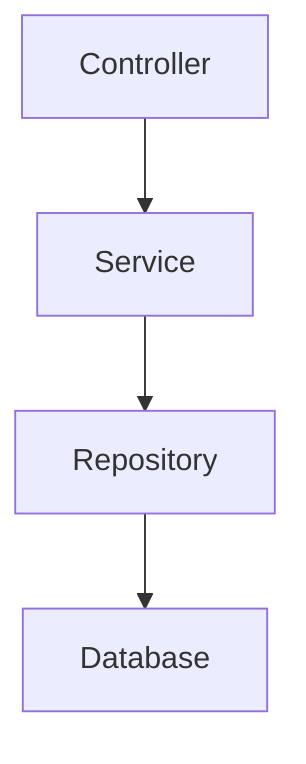

가장 익숙하고 단순하다. 다만 이 구조를 Transaction Script 방식으로 사용하면 Service가 Repository 여러 개를 직접 알고 검증, 계산, 상태 변경까지 모두 처리하면서 Fat Service가 되기 쉽다.

### Package by Feature

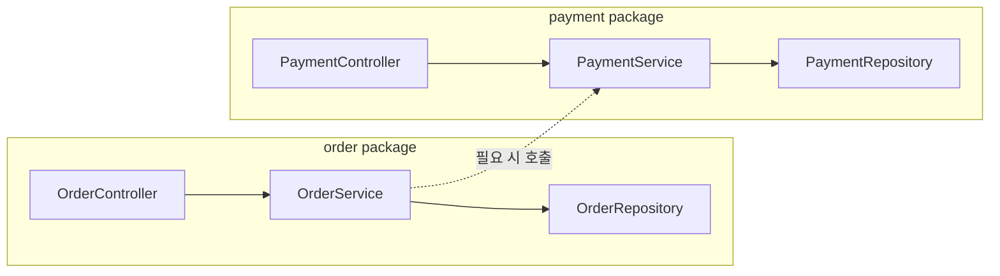

도메인별 응집을 만들기 쉽다. 다만 단일 모듈 안에서는 `order`가 `payment` 내부 구현을 직접 호출해도 컴파일 수준에서 막기 어렵다.

### Business 중심의 Layered Architecture

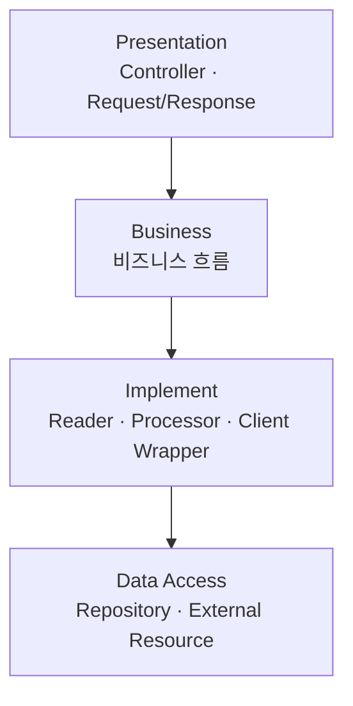

Business 레이어는 상세 구현을 직접 알지 않고 Implement 레이어의 협력 객체를 통해 흐름을 표현한다. 핵심은 "비즈니스 흐름은 읽히고 상세 구현은 아래로 숨긴다"는 점이다.

### PeekCart의 4-Layered + DDD

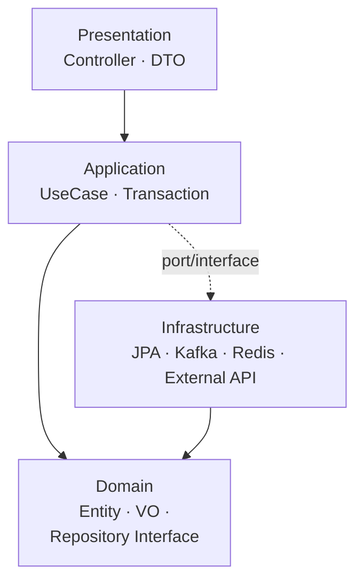

PeekCart의 현재 구조다. Application은 UseCase 흐름을 조율하고 Domain은 상태 전이와 핵심 규칙을 가진다. Infrastructure는 Domain의 인터페이스를 구현한다.

### Hexagonal Architecture

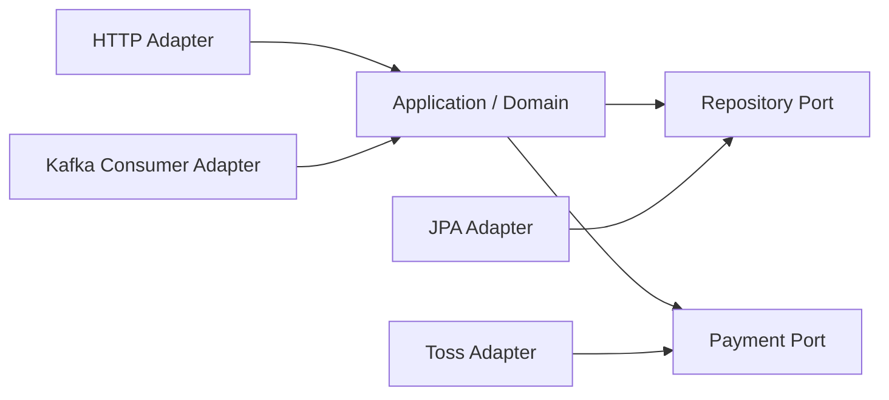

중심에는 Application/Domain이 있고, 외부 입출력은 Adapter가 맡는다. Toss, Slack, Kafka, Redis처럼 외부 연동이 많은 PeekCart에서는 일부 개념을 이미 사용하고 있다.

### Clean Architecture

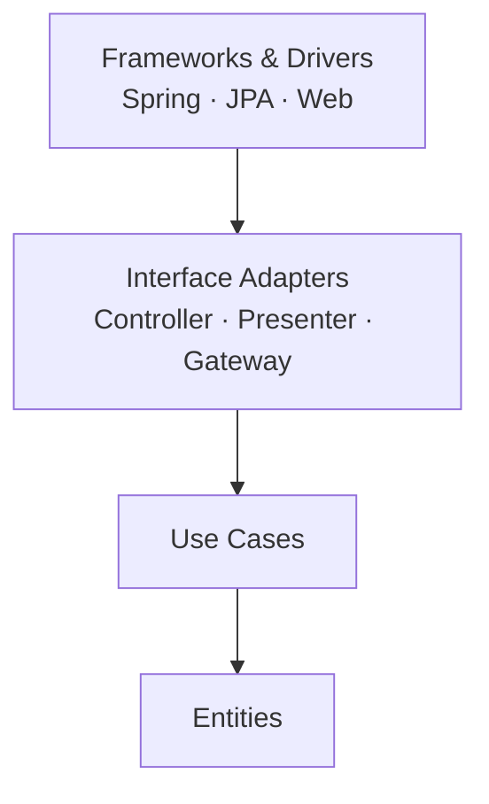

의존성은 안쪽으로만 향한다. Entity와 UseCase가 Spring, JPA를 몰라야 하므로 순수성은 높지만 DTO와 매핑 코드가 늘어난다.

### Onion Architecture

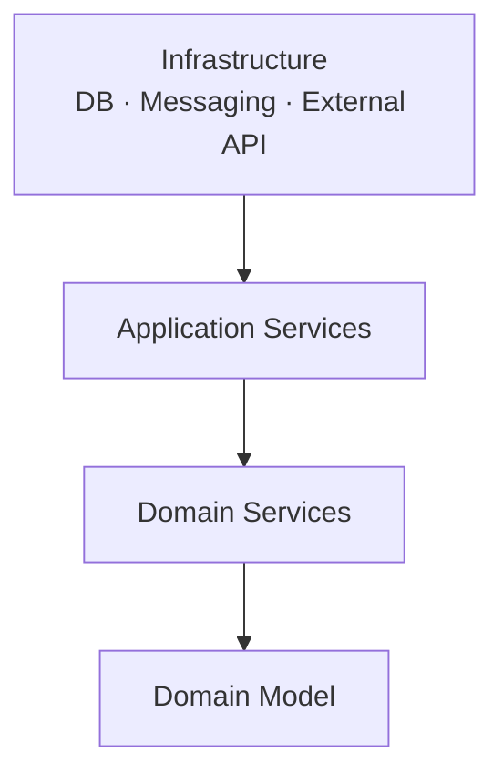

도메인 모델을 가장 안쪽에 둔다. Clean Architecture와 비슷하게 기술은 바깥으로 밀어내지만, 설명의 중심이 UseCase보다 Domain Model에 더 가깝다.

### Vertical Slice Architecture

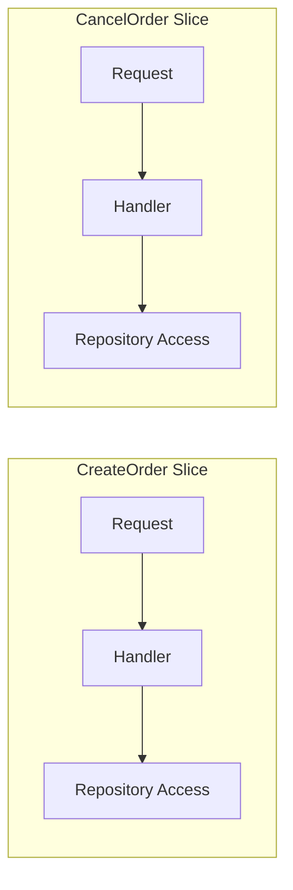

레이어보다 유스케이스 단위 변경을 우선한다. `CreateOrder`, `CancelOrder`처럼 흐름별 응집은 좋아지지만 주문 상태 전이 같은 공통 도메인 규칙을 어디에 둘지 별도 기준이 필요하다.

### CQRS

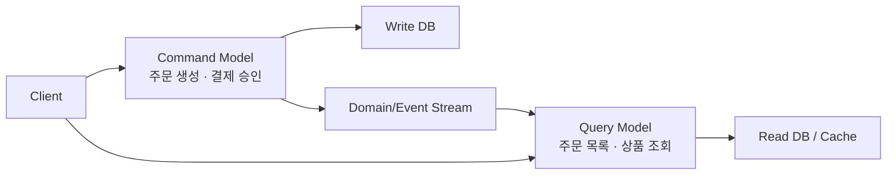

쓰기 모델과 읽기 모델을 분리한다. 서비스 분리 이후 Order가 Product 정보를 직접 조회하지 않고 로컬 캐시나 조회 모델을 사용할 때 연결될 수 있다.

### Event Sourcing

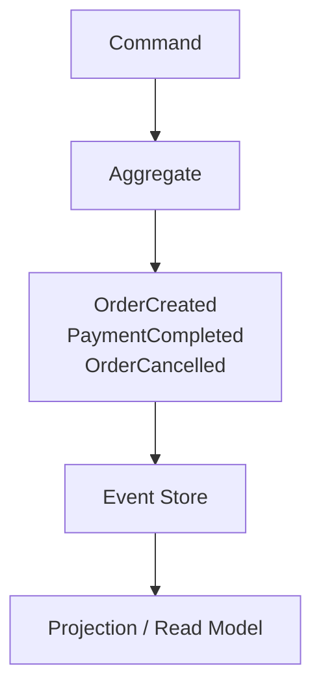

현재 상태를 row로 덮어쓰는 대신 상태 변경 이벤트를 저장한다. 주문 상태 이력을 강하게 남길 수 있지만, 일반 CRUD보다 구현과 운영 난도가 높다.

### 멀티모듈 모놀리스

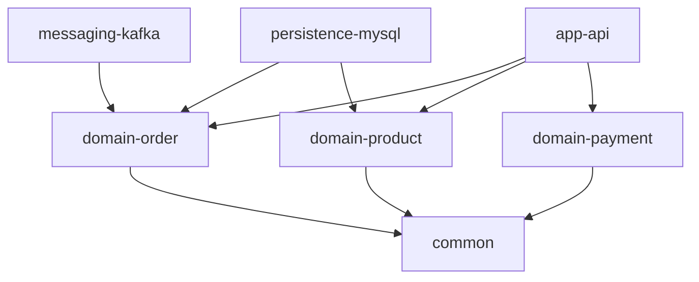

단일 배포는 유지하지만 Gradle 모듈로 의존성을 강제한다. 패키지 규칙보다 강하게 "어떤 모듈이 어떤 기술을 알아도 되는가"를 통제할 수 있다.

### MSA

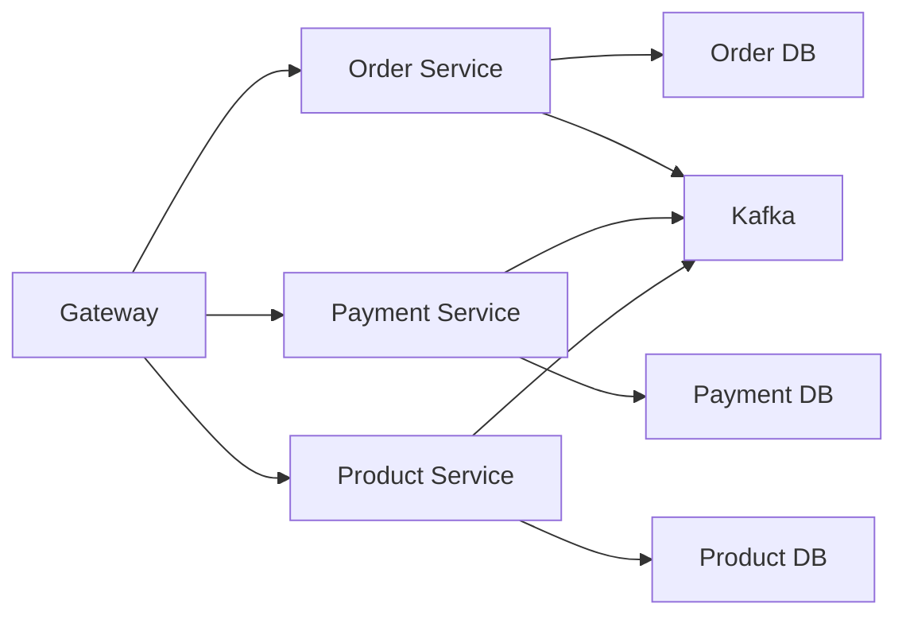

배포, 데이터, 장애 경계까지 분리한다. 대신 트랜잭션과 조회, 장애 대응을 네트워크와 이벤트 기반으로 다시 설계해야 한다.

---

## PeekCart의 4개 레이어

PeekCart에서 각 도메인은 아래 네 레이어를 가진다.

|레이어|패키지|책임|
|---|---|---|
|Presentation|`presentation/`|Controller, Request/Response DTO, HTTP 요청/응답 처리|
|Application|`application/`|UseCase 조율, 트랜잭션 경계, 도메인 객체 호출 순서 관리|
|Domain|`domain/`|Entity, VO, Domain 규칙, Repository 인터페이스|
|Infrastructure|`infrastructure/`|Repository 구현체, JPA, Redis, Kafka, Toss, Slack 같은 외부 연동|

의존 방향은 대략 이렇게 읽을 수 있다.

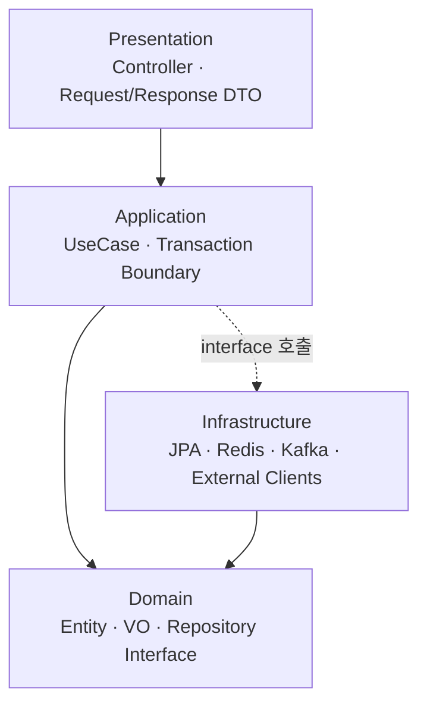

여기서 중요한 점은 Infrastructure가 Domain에 정의된 인터페이스를 구현한다는 것이다. Application은 구체적인 JPA Repository 구현체가 아니라 Domain의 Repository 인터페이스에 의존한다.

이 구조를 단순히 폴더 규칙으로 보면 별 의미가 없다. 핵심은 "비즈니스 판단이 어디에 있어야 하는가"다.

---

## Order 도메인으로 구조 읽기

Order 도메인은 레이어 책임을 보기 좋은 예시다.

파일을 보면 대략 아래처럼 나뉜다.

```
src/main/java/com/peekcart/order/
├── presentation/
│   ├── OrderController.java
│   └── CartController.java
├── application/
│   ├── OrderCommandService.java
│   ├── OrderQueryService.java
│   ├── CartCommandService.java
│   ├── CartQueryService.java
│   └── port/ProductPort.java
├── domain/
│   ├── model/Order.java
│   ├── model/OrderItem.java
│   ├── model/OrderStatus.java
│   ├── model/Cart.java
│   └── repository/OrderRepository.java
└── infrastructure/
    ├── OrderRepositoryImpl.java
    ├── OrderJpaRepository.java
    ├── kafka/OrderEventConsumer.java
    ├── outbox/OrderOutboxEventPublisher.java
    └── scheduler/OrderTimeoutScheduler.java
```

이 구조에서 내가 먼저 봐야 할 것은 Controller가 아니다. 주문의 핵심 규칙이 어디 있는지다.

---

## Domain: 주문 상태 전이는 Entity와 Enum이 가진다

`Order` 엔티티에는 주문 취소와 상태 전이 규칙이 들어 있다.

```java
public void cancel() {
    if (this.status == OrderStatus.CANCELLED) {
        throw new OrderException(ErrorCode.ORD_002);
    }
    if (!this.status.canTransitionTo(OrderStatus.CANCELLED)) {
        throw new OrderException(ErrorCode.ORD_003);
    }
    this.status = OrderStatus.CANCELLED;
}

public void transitionTo(OrderStatus target) {
    if (!this.status.canTransitionTo(target)) {
        throw new OrderException(ErrorCode.ORD_003);
    }
    this.status = target;
}
```

상태 전이 가능 여부는 `OrderStatus` enum이 직접 판단한다.

```java
PAYMENT_REQUESTED {
    @Override
    public boolean canTransitionTo(OrderStatus target) {
        return target == PAYMENT_COMPLETED || target == PAYMENT_FAILED || target == CANCELLED;
    }
}
```

이 부분이 중요하다. 주문이 어떤 상태로 바뀔 수 있는지는 단순한 데이터 변경이 아니라 도메인 규칙이다. 이 규칙을 Service에 흩어놓지 않고 `Order`와 `OrderStatus`에 둔 덕분에, 주문 상태 전이를 테스트할 때 HTTP나 DB를 몰라도 된다.

즉 Domain 레이어는 "데이터 모양"만 갖는 곳이 아니라, 비즈니스 규칙이 모이는 곳이다.

---

## 상태 전이 로직은 Order 밖으로 분리해야 할까

Order 도메인을 읽다 보면 이런 질문이 생긴다.

> 주문 취소나 상태 전이 로직을 `Order` 엔티티 안에 두는 것이 맞을까? 아니면 `OrderTransitionPolicy`, `OrderStateMachine`, `OrderLifecycleService` 같은 별도 클래스로 분리하는 것이 더 좋을까?

현재 PeekCart 구조는 상태 전이를 완전히 `Order` 혼자 처리하는 구조는 아니다. 역할은 대략 이렇게 나뉘어 있다.

```
Application Service / Event Consumer / Scheduler
        |
        v
Order.cancel()
Order.transitionTo(...)
        |
        v
OrderStatus.canTransitionTo(...)
```

- `OrderCommandService`, Kafka Consumer, Scheduler는 "어떤 상황에서 상태를 바꿀지"를 결정한다.
- `Order`는 실제 상태 변경을 수행하고, 이미 취소된 주문인지 같은 애그리거트 불변식을 확인한다.
- `OrderStatus`는 현재 상태에서 목표 상태로 갈 수 있는지 판단한다.

이 정도의 상태 전이라면 `Order`와 `OrderStatus`에 두는 편이 자연스럽다. 주문 상태는 주문 애그리거트의 핵심 생명주기이기 때문이다. `DELIVERED` 상태의 주문이 `CANCELLED`로 갈 수 없다는 규칙은 외부 Service가 대신 지켜줘야 하는 규칙이 아니라, `Order` 자신이 반드시 지켜야 하는 규칙이다.

반대로 아래처럼 상태 전이 조건이 `Order` 안의 값만으로 판단되지 않기 시작하면 분리를 고려할 수 있다.

```
배송 준비 상태라도
- 이미 송장 번호가 발급됐고
- 물류 시스템에 출고 요청이 들어갔고
- 결제 승인 후 24시간이 지났고
- 판매자 정책상 특정 상품군은 취소가 제한된다면
취소할 수 없다.
```

이런 규칙은 `Order` 하나만의 책임으로 보기 어렵다. 배송, 결제, 판매 정책 같은 외부 조건이 섞이기 때문이다. 이때는 다음과 같은 분리가 더 읽기 쉬울 수 있다.

```
OrderCancellationPolicy
OrderTransitionPolicy
OrderStateMachine
OrderLifecycleService
```

분리 기준을 표로 정리하면 이렇다.

|판단 기준|`Order` 안에 둔다|별도 정책/상태 머신으로 분리한다|
|---|---|---|
|규칙의 성격|주문 자신의 생명주기와 불변식|여러 도메인 정책이 섞인 판단|
|필요한 정보|`Order.status`, `OrderItem` 등 애그리거트 내부 값|결제, 배송, 외부 시스템, 시간 정책|
|복잡도|상태 전이 수가 적고 단순하다|상태와 조건 조합이 많다|
|재사용성|Order에만 필요한 규칙|여러 UseCase나 서비스에서 공유되는 정책|
|테스트 초점|`OrderTest`, `OrderStatusTest`로 충분하다|정책 객체 단위 테스트가 필요하다|

현재 PeekCart에서는 분리보다 `Order` 안에 유지하는 쪽이 더 적절하다. 주문 상태 전이가 아직 주문 애그리거트의 내부 규칙에 가깝고, 별도 객체로 빼면 오히려 파일과 호출 경로만 늘어날 가능성이 크다.

다만 개선 여지는 있다. 현재 `transitionTo(OrderStatus target)`은 범용적이라 호출부만 보면 어떤 비즈니스 사건이 일어난 것인지 덜 드러난다. 나중에 상태 전이가 더 중요해지면 아래처럼 도메인 언어에 가까운 메서드로 바꿀 수 있다.

```java
order.requestPayment();
order.completePayment();
order.failPayment();
order.startPreparing();
order.ship();
order.deliver();
order.cancel();
```

이렇게 하면 Application Service나 Event Consumer는 단순히 상태 값을 넘기는 것이 아니라, "결제가 완료됐다", "배송을 시작했다" 같은 비즈니스 사건을 표현하게 된다.

그래서 현재는 이렇게 판단했다.

> 상태 전이가 `Order`의 생명주기 자체라면 `Order`와 `OrderStatus`에 둔다. 여러 도메인 정책과 외부 조건이 섞이기 시작하면 `OrderTransitionPolicy`나 `OrderStateMachine`으로 분리한다.

---

## Application: UseCase를 조율하고 트랜잭션을 잡는다

`OrderCommandService`는 주문 생성 UseCase를 조율한다.

주문 생성 시 흐름은 대략 다음과 같다.

1. 사용자의 장바구니를 조회한다.
2. 장바구니가 비어 있는지 확인한다.
3. 상품 재고를 차감하고 주문 시점 가격을 가져온다.
4. `Order.create(...)`로 주문 엔티티를 생성한다.
5. 주문을 저장한다.
6. 장바구니를 비운다.
7. `order.created` Outbox 이벤트를 저장한다.

여기서 Application Service가 모든 비즈니스 규칙을 직접 판단하는 것은 아니다. 예를 들어 주문 생성 시 총액 계산이나 취소 가능 여부는 `Order` 쪽에 있다. Application은 여러 도메인 객체와 포트를 어떤 순서로 호출할지 조율한다.

이 레이어를 "얇은 Service"로만 보면 아쉬울 수 있다. 하지만 트랜잭션 경계와 UseCase 흐름이 여기에 모인다는 점이 중요하다.

```java
@Service
@Transactional
public class OrderCommandService {
    ...
    public OrderDetailDto createOrder(Long userId, CreateOrderCommand command) {
        Cart cart = cartRepository.findByUserId(userId)
                .orElseThrow(() -> new OrderException(ErrorCode.ORD_006));

        if (cart.isEmpty()) {
            throw new OrderException(ErrorCode.ORD_004);
        }

        ...
        Order order = Order.create(...);
        orderRepository.save(order);
        cart.clear();
        outboxEventPublisher.publishOrderCreated(order);

        return OrderDetailDto.from(order);
    }
}
```

여기서 학습 포인트는 "Application Service에 로직이 전혀 없어야 한다"가 아니다. UseCase 판단과 도메인 규칙을 구분해서 보는 것이다.

- 장바구니가 비어 있으면 주문을 만들 수 없다는 흐름 검증은 UseCase에 가깝다.
- 주문 상태가 `DELIVERED`에서 `CANCELLED`로 갈 수 없다는 규칙은 Domain에 가깝다.
- 재고 차감은 Product 도메인의 책임이므로 `ProductPort`를 통해 호출한다.

---

## Infrastructure: Domain 인터페이스를 구현한다

`OrderRepository`는 Domain 레이어에 인터페이스로 존재한다. 실제 JPA 구현은 Infrastructure에 있다.

```java
@Repository
@RequiredArgsConstructor
public class OrderRepositoryImpl implements OrderRepository {

    private final OrderJpaRepository orderJpaRepository;

    @Override
    public Order save(Order order) {
        return orderJpaRepository.save(order);
    }

    @Override
    public Optional<Order> findByIdAndUserId(Long id, Long userId) {
        return orderJpaRepository.findByIdAndUserId(id, userId);
    }
}
```

이 패턴은 처음에는 파일이 늘어나는 것처럼 보인다. 하지만 장점도 있다.

Application은 Spring Data JPA의 세부 구현을 몰라도 된다. 테스트에서는 Domain Repository 인터페이스를 mock으로 대체할 수 있다. 나중에 서비스별 DB로 분리하더라도, 도메인에서 필요한 저장소 계약과 실제 구현을 나눠서 생각할 수 있다.

Infrastructure에는 Repository 구현체뿐 아니라 Kafka Consumer, Outbox Publisher, Scheduler 같은 외부 기술 연동도 들어간다. 이들은 도메인 흐름에 필요하지만 도메인 규칙 그 자체는 아니다.

---

## JPA 절충안 이해하기

PeekCart는 Clean Architecture처럼 Domain Entity와 JPA Entity를 완전히 분리하지 않았다.

`Order`에는 `@Entity`, `@Table`, `@Id`, `@OneToMany` 같은 JPA 어노테이션이 붙어 있다. 이 선택은 도메인 순수성을 일부 포기하는 대신, 매핑 레이어를 줄이고 학습과 구현의 복잡도를 낮춘다.

중요한 것은 "JPA 어노테이션이 붙었으니 DDD가 아니다"라고 단순히 보는 것이 아니다. 이 프로젝트의 절충선은 다음과 같다.

|허용|금지|
|---|---|
|Domain Entity에 `@Entity`, `@Id`, `@Column` 사용|Domain Entity가 `EntityManager`, `Session` 같은 JPA API 직접 사용|
|JPA 연관관계 매핑 사용|Controller나 Application이 JPA 구현 세부사항에 직접 의존|
|Entity 안에 비즈니스 메서드 작성|모든 비즈니스 판단을 Service에 몰아넣기|

이 절충은 포트폴리오 프로젝트에서 현실적이다. 도메인과 영속성 모델을 완전히 분리하면 이론적으로는 깔끔하지만, 엔티티와 매퍼가 크게 늘어난다. 이 프로젝트에서는 그 비용보다 도메인 규칙을 Entity에 응집하는 이득을 더 크게 본 것이다.

---

## 멀티모듈로 갔다면 무엇이 달라졌을까

현재 PeekCart의 첫 단계 구조는 단일 Gradle 모듈이다. `user`, `product`, `order`, `payment`, `notification`이 패키지로 나뉘어 있지만, 빌드 관점에서는 하나의 애플리케이션이다.

만약 처음부터 멀티모듈 모놀리스로 갔다면 구조는 대략 이렇게 바뀔 수 있다.

```
peekcart/
├── app-api/
├── domain-user/
├── domain-product/
├── domain-order/
├── domain-payment/
├── domain-notification/
├── support-jpa/
├── support-redis/
├── support-kafka/
└── common/
```

또는 도메인보다 기술 격리를 더 강하게 보고 아래처럼 나눌 수도 있다.

```
peekcart/
├── bootstrap-api/
├── core-domain/
├── persistence-mysql/
├── messaging-kafka/
├── client-toss/
├── client-slack/
└── common/
```

멀티모듈의 장점은 패키지 규칙보다 강한 제약을 걸 수 있다는 점이다. 예를 들어 `app-api`가 `support-jpa`의 내부 구현을 직접 참조하지 못하게 만들 수 있고, `implementation` 의존성을 사용하면 하위 모듈의 기술 의존성이 상위 모듈로 전파되는 것도 막을 수 있다.

이것은 위에서 말한 모듈화의 핵심과 닿아 있다. 상위 비즈니스 모듈은 "JPA를 쓰는지", "Feign을 쓰는지", "어떤 Kafka Client를 쓰는지"를 몰라도 되고, 하위 모듈이 제공하는 개념과 인터페이스만 사용하게 된다.

하지만 첫 단계에서 바로 멀티모듈을 채택하지 않은 것도 이유가 있다.

|선택지|얻는 것|잃는 것|
|---|---|---|
|단일 모듈 + 패키지 레이어|구현 속도, 단순한 빌드, 낮은 진입 비용|컴파일 수준의 강제력은 약하다|
|멀티모듈 모놀리스|의존성 전파 차단, 모듈별 책임 강화|모듈 설계, 순환 의존성 관리, 테스트 설정 비용이 생긴다|
|MSA|독립 배포, 독립 DB, 장애 격리|네트워크, 이벤트 계약, 분산 트랜잭션, 운영 복잡도가 생긴다|

따라서 현재 구조는 "멀티모듈을 몰라서 선택하지 않은 구조"가 아니라, 첫 단계의 목표에 맞춘 낮은 비용의 출발점으로 볼 수 있다. 먼저 패키지 레벨에서 레이어와 도메인 책임을 설계하고, 이후 Gradle 멀티모듈로 넘어가며 그 경계를 더 강하게 고정하는 흐름이다.

---

## Product 도메인에서도 같은 구조가 반복된다

Product 도메인도 비슷하게 읽을 수 있다.

```
src/main/java/com/peekcart/product/
├── presentation/
│   ├── ProductController.java
│   └── AdminProductController.java
├── application/
│   ├── ProductCommandService.java
│   ├── ProductQueryService.java
│   ├── InventoryService.java
│   └── InventoryLockFacade.java
├── domain/
│   ├── model/Product.java
│   ├── model/Category.java
│   ├── model/Inventory.java
│   └── repository/*Repository.java
└── infrastructure/
    ├── ProductRepositoryImpl.java
    ├── InventoryRepositoryImpl.java
    └── adapter/ProductPortAdapter.java
```

여기서 `Inventory`는 재고 수량과 낙관적 락 버전을 가진다. 이후 성능과 동시성 보강 단계에서 Redis 분산 락이 들어오더라도, 최종 재고 변경 규칙은 Product 도메인의 책임으로 남는다.

Order 도메인은 Product를 직접 구현체로 호출하지 않고 `ProductPort`를 통해 재고 차감과 가격 조회를 요청한다. 지금은 모놀리스 안에서 adapter가 연결하지만, 서비스 분리 이후에는 이 경계가 서비스 간 통신 또는 CQRS 로컬 캐시로 바뀔 수 있다.

이 점이 중요하다. 4-Layered + DDD 구조는 단지 "예쁜 패키지 구조"가 아니라, 나중에 서비스 경계를 볼 수 있게 해주는 관찰 도구이기도 하다.

---

## 서비스 분리 단계와 어떻게 연결될까

나중에 서비스를 나눌 때 갑자기 경계를 발명하는 것이 아니다. 단일 모놀리스, 성능 보강, 운영 검증을 거치면서 이미 다음 경계가 보인다.

|현재 도메인|독립 서비스 후보|분리 근거|
|---|---|---|
|User|User Service|인증, 회원, Refresh Token 관리|
|Product|Product Service|상품과 재고의 원천 데이터|
|Order|Order Service|주문 폭주 시 독립 스케일아웃 필요|
|Payment|Payment Service|외부 결제 연동과 실패 격리|
|Notification|Notification Service|Kafka Consumer 중심의 비동기 처리|

물론 패키지가 나뉘어 있다고 해서 그대로 서비스가 되는 것은 아니다. 서비스별 DB, 이벤트 계약, Gateway 인증, Saga 보상 트랜잭션, 관측성 계약 같은 문제가 새로 생긴다.

다만 4-Layered + DDD 구조 덕분에 적어도 "어떤 책임이 어느 도메인에 있었는가"를 추적할 수 있다. 이 추적 가능성이 서비스 분리를 학습하는 출발점이 된다.

이 흐름을 단계로 나누면 이렇게 볼 수 있다.

```
패키지 분리
  → 코드 안에서 도메인과 레이어 책임을 구분한다.

Gradle 멀티모듈
  → 빌드와 의존성 수준에서 경계를 강제한다.

MSA
  → 배포, 데이터, 장애, 확장 단위까지 분리한다.
```

현재 PeekCart는 첫 번째 단계에 가깝다. 바로 MSA만 보는 것이 아니라, 그 사이에 멀티모듈 모놀리스라는 학습 지점을 두면 "서비스를 나눈다"는 말을 더 구체적으로 이해할 수 있다. 서비스 분리는 단순히 프로젝트를 여러 개 만드는 일이 아니라, 이미 통제하고 있던 의존성과 책임 경계를 더 강한 운영 경계로 올리는 일이기 때문이다.
