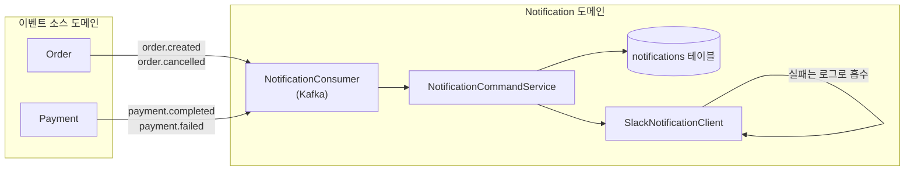
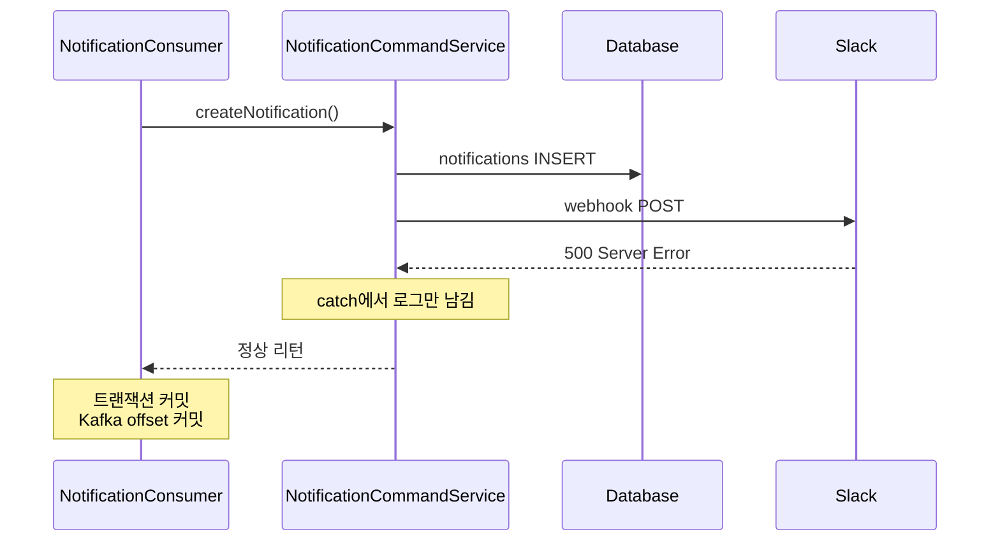
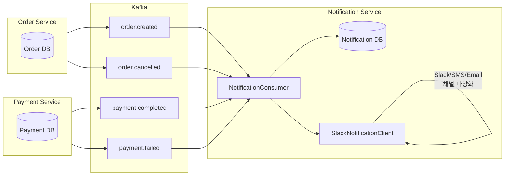

알림 도메인이 흥미로운 이유는, 비즈니스적으로 "꼭 성공해야 하는 일"이 아니라는 점이다. 결제는 실패하면 안 된다. 재고는 틀리면 안 된다. 그런데 알림은 한 번쯤 늦게 가거나 못 가도 주문이 잘못된 건 아니다. 이 비대칭이 설계에 그대로 드러난다. Notification 도메인은 "다른 도메인의 트랜잭션을 절대 방해하지 않는다"는 제약 위에서 만들어진다.

이 글에서 사용하는 용어는 다음 뜻으로 읽으면 된다.

| 용어                     | 이 글에서의 의미                                                                          |
| ---------------------- | ---------------------------------------------------------------------------------- |
| 도메인 이벤트                | 다른 도메인에 "이런 일이 일어났음"을 알리는 메시지. 로컬 이벤트(JVM 내부) 또는 Kafka 이벤트로 전달                     |
| Slack Incoming Webhook | Slack 채널에 메시지를 보내기 위한 단방향 HTTP 엔드포인트                                               |
| Port / Adapter         | 외부 시스템과의 경계를 인터페이스로 추상화하는 패턴. Application은 Port를, Infrastructure가 Adapter(구현체)를 제공 |
| Consumer Group         | 같은 Kafka 토픽을 소비하는 논리적 그룹. 그룹마다 오프셋이 독립적으로 관리된다                                     |
| 멱등성 키                  | 같은 이벤트가 두 번 처리되지 않도록 식별하는 키. PeekCart에서는 `(event_id, consumer_group)`              |

이번 학습에서 확인하고 싶은 질문은 다음과 같다.

1. 알림 발송 실패가 주문/결제 트랜잭션을 망치면 왜 안 되는가?
2. Phase 1에서는 알림을 어떻게 격리했고, 왜 그것만으로는 부족했는가?
3. Phase 2에서 Kafka Consumer로 전환하면서 무엇이 어떻게 바뀌었는가?
4. `SlackPort`는 왜 `notification/`이 아니라 `global/port`에 있는가?
5. Slack Webhook 호출 실패는 어디서 어떻게 흡수되는가?
6. Phase 4에서 Notification Service는 왜 가장 분리하기 쉬운가?

---

## Notification 도메인의 책임 범위

Notification은 다른 도메인이 발생시킨 사건을 사용자/운영자에게 전달하는 역할만 한다. 자신이 비즈니스 상태를 바꾸지 않고, 자신이 실패해도 다른 도메인의 상태에 영향이 가지 않는다.



소비하는 이벤트는 네 개다.

| 이벤트                 | 소비 후 행동                | NotificationType    |
| ------------------- | ---------------------- | ------------------- |
| `order.created`     | 주문 생성 알림 저장 + Slack 발송 | `ORDER_CREATED`     |
| `payment.completed` | 결제 완료 알림 저장 + Slack 발송 | `PAYMENT_COMPLETED` |
| `payment.failed`    | 결제 실패 알림 저장 + Slack 발송 | `PAYMENT_FAILED`    |
| `order.cancelled`   | 주문 취소 알림 저장 + Slack 발송 | `ORDER_CANCELLED`   |

그리고 외부에 노출하는 API는 한 개뿐이다.

```java
@GetMapping
public ResponseEntity<ApiResponse<Page<NotificationResponse>>> getNotifications(
        @CurrentUser LoginUser loginUser,
        @ParameterObject @PageableDefault(size = 20) Pageable pageable
) { ... }
```

`GET /api/v1/notifications` — 내가 받은 알림 목록을 페이징 조회한다. 알림 생성 API는 없다. 사용자가 직접 알림을 만들 일이 없기 때문이다. 알림은 항상 다른 도메인의 이벤트에서 유래한다.

이 한정된 책임 범위가 Phase 4에서 Notification Service를 가장 깔끔하게 떼낼 수 있는 이유가 된다. 다른 도메인의 상태를 읽지도, 쓰지도 않는다.

---

## Notification 엔티티: 상태 전이가 없는 도메인

```java
@Entity
@Table(name = "notifications")
public class Notification {

    @Id
    @GeneratedValue(strategy = GenerationType.IDENTITY)
    private Long id;

    @Column(name = "user_id", nullable = false)
    private Long userId;

    @Enumerated(EnumType.STRING)
    @Column(nullable = false)
    private NotificationType type;

    @Column(nullable = false, length = 500)
    private String message;

    @Column(name = "is_read", nullable = false)
    private boolean isRead;

    @Column(name = "created_at", nullable = false, updatable = false)
    private LocalDateTime createdAt;

    public static Notification create(Long userId, NotificationType type, String message) {
        return new Notification(userId, type, message);
    }
}
```

4편의 `Order`(8개 상태, 11개 전이)나 5편의 `Payment`(3개 상태, 2개 전이)와 비교하면 Notification에는 사실상 상태 전이가 없다. `is_read` 플래그가 있지만 이를 토글하는 도메인 메서드(`markAsRead()`)는 Phase 2에서 호출처가 없어 제거됐다(PHASE2.md 기록). 명세상 알림 읽음 처리 API가 정의되지 않았기 때문이다.

이 단순함은 Notification이 "쓰여진 뒤로는 거의 바뀌지 않는" 로그성 데이터에 가깝다는 것을 보여준다. 도메인 규칙이 거의 없으니 `create()` 정적 팩토리 하나로 끝난다.

`NotificationType`도 네 가지 enum 값만 가진다.

```java
public enum NotificationType {
    ORDER_CREATED,
    PAYMENT_COMPLETED,
    PAYMENT_FAILED,
    ORDER_CANCELLED
}
```

각 enum 값은 Notification이 어떤 이벤트에서 유래했는지를 기록한다. 같은 `payment.completed` 토픽에서 만들어진 알림을 나중에 별도로 필터링하거나, Phase 4에서 알림 채널을 type별로 분리할 때(예: 결제 실패만 SMS) 식별자로 쓸 수 있다.

---

## NotificationCommandService: 두 줄짜리 UseCase

```java
@Service
@Transactional
@RequiredArgsConstructor
public class NotificationCommandService {

    private final NotificationRepository notificationRepository;
    private final SlackPort slackPort;

    public void createNotification(Long userId, NotificationType type, String message) {
        Notification notification = Notification.create(userId, type, message);
        notificationRepository.save(notification);
        slackPort.send(message);
    }
}
```

UseCase는 두 줄이다. 알림 엔티티를 저장하고, Slack으로 메시지를 보낸다. 4편/5편에서 본 `OrderCommandService.createOrder()`나 `PaymentCommandService.confirmPayment()`와 비교하면 압도적으로 단순하다.

여기서 짚을 점은 의존하는 대상이 `SlackPort` 인터페이스라는 것이다. 구현체인 `SlackNotificationClient`가 아니다. 이 의존 역전이 의도하는 효과는 두 가지다.

- **테스트 격리**: 단위 테스트에서 `SlackPort`를 Mock으로 교체하면 실제 Slack을 호출하지 않고도 "발송이 호출됐는가"만 검증할 수 있다.
- **위치의 자유**: 구현체가 Slack이든, 이메일이든, 향후 SMS든 Application은 모른다.

```java
@Test
@DisplayName("createNotification: Slack 메시지가 발송된다")
void createNotification_sendsSlackMessage() {
    given(notificationRepository.save(any(Notification.class))).willAnswer(inv -> inv.getArgument(0));

    notificationCommandService.createNotification(
            NotificationFixture.DEFAULT_USER_ID, NotificationType.ORDER_CREATED, NotificationFixture.DEFAULT_MESSAGE);

    then(slackPort).should().send(NotificationFixture.DEFAULT_MESSAGE);
}
```

테스트는 `SlackPort`만 Mock으로 끼우고 `SlackNotificationClient`는 전혀 로드하지 않는다. Application은 외부 시스템의 존재를 모른 채로 검증된다.

---

## SlackPort는 왜 `global/port`에 있는가

처음 보면 직관에 어긋난다. Slack은 Notification이 쓰는 외부 시스템처럼 보이는데, 왜 인터페이스가 `notification/application/port/`가 아니라 `global/port/`에 있을까?

```java
package com.peekcart.global.port;

/**
 * Slack 알림 발송 포트.
 * Outbox, Notification 등 여러 도메인에서 사용하는 횡단 관심사이므로 global에 위치한다.
 */
public interface SlackPort {
    void send(String message);
}
```

처음에는 실제로 `notification/application/port/SlackPort`로 만들었다(Phase 1). 그런데 Phase 2 작업 중 `OutboxPollingService`(`global/outbox/`)가 발행에 5회 이상 실패한 이벤트를 운영자에게 알리기 위해 `SlackPort`를 참조하면서 문제가 드러났다. `global`이 특정 도메인 패키지(`notification`)를 참조하게 된 것이다. 4-Layered + DDD 원칙에서 의존 방향은 `domain → infrastructure ← infrastructure`이며, 횡단 관심사를 담는 `global`은 어떤 도메인에도 의존하지 않아야 한다.

이동 이후 `SlackPort`의 호출처는 다음 세 곳으로 늘어났다.

| 호출처 | 위치 | 목적 |
| --- | --- | --- |
| `NotificationCommandService` | `notification/application/` | 사용자에게 보내는 알림 |
| `OutboxPollingService` | `global/outbox/` | Outbox 발행이 5회 실패한 이벤트의 운영자 통보 |
| `KafkaConfig` | `global/config/` | DLQ 도달 메시지의 운영자 통보 |

세 호출처 중 둘이 `global` 패키지에 있다. "Slack은 Notification의 전유물"이라는 초기 가정이 더 이상 유효하지 않다는 사실이 호출 분포로 드러난다.

해결은 두 가지 선택지였다.

| 선택 | 효과 | 트레이드오프 |
| --- | --- | --- |
| (A) Outbox 쪽에 별도 알림 인터페이스를 만든다 | 도메인 경계가 더 명확 | 같은 일을 하는 인터페이스가 둘이 됨 |
| (B) `SlackPort`를 `global/port/`로 끌어올린다 | 횡단 관심사라는 정체성을 인정 | "Slack은 Notification의 전유물"이라는 가정이 깨짐 |

(B)를 택했다. Slack 메시지 발송이라는 행위가 더 이상 한 도메인의 책임이 아니라 프로젝트 전체에서 쓰는 운영 통보 채널이 되었기 때문이다.

판단의 일반화: **두 개 이상의 도메인이 같은 외부 시스템을 호출하기 시작하면 그 Port는 도메인 패키지를 떠나야 한다.** 그렇지 않으면 "왜 Outbox가 Notification에 의존하지?"라는 의문이 영원히 남는다.

---

## SlackNotificationClient: 실패를 흡수하는 책임

```java
@Slf4j
@Component
public class SlackNotificationClient implements SlackPort {

    private final RestClient restClient;
    private final String webhookUrl;

    public SlackNotificationClient(@Value("${slack.webhook.url}") String webhookUrl) {
        this.webhookUrl = webhookUrl;
        this.restClient = RestClient.create();
    }

    @Override
    public void send(String message) {
        try {
            restClient.post()
                    .uri(webhookUrl)
                    .contentType(MediaType.APPLICATION_JSON)
                    .body(Map.of("text", message))
                    .retrieve()
                    .toBodilessEntity();
        } catch (Exception e) {
            log.error("Slack 알림 발송 실패: {}", e.getMessage());
        }
    }
}
```

이 클래스의 핵심은 `try-catch (Exception e)` 한 줄이다. 어떤 예외가 나오든 로그만 남기고 삼킨다.

5편에서 봤던 `TossPaymentClient`와 비교하면 정반대의 설계다. Toss는 호출 실패가 곧 결제 실패이므로 예외를 그대로 전파해서 `Payment.fail()`을 트리거해야 했다. Slack은 호출 실패가 비즈니스적으로 의미를 갖지 않는다. Slack이 잠깐 죽었다고 해서 사용자의 주문이 취소되어서는 안 된다.

이 "예외를 삼킨다"는 결정의 결과를 따라가보자.



Slack이 500을 반환해도 `NotificationCommandService`는 정상 리턴한다. 그러면 Consumer 메서드가 정상 종료되어 트랜잭션이 커밋되고, Kafka offset도 진행된다. 즉, "DB에는 알림이 저장됐지만 Slack 메시지는 못 갔다"는 상태가 영구화된다.

이게 옳은가? 두 가지 시각이 있다.

- **현재 선택**: Slack은 운영자 편의 채널이다. DB의 `notifications` 테이블이 진실의 출처(source of truth)이고, Slack은 보조 알림이다. Slack을 못 받으면 사용자는 어차피 앱에서 알림 목록을 보면 된다.
- **다른 선택**: Slack 발송 실패도 Outbox에 기록해서 재시도해야 한다.

현재는 첫 번째 시각을 채택했다. 다만 이 선택의 한계는 명확하다: Slack을 일종의 "운영자 대시보드"로 쓰고 있는 상황에서, Slack이 장시간 다운되면 운영자가 신호를 놓친다. Phase 4에서 운영 알림과 사용자 알림을 분리하면(예: 운영 알림은 PagerDuty 같은 별도 채널) 이 트레이드오프를 다시 검토할 가치가 있다.

---

## Phase 1: `@TransactionalEventListener(AFTER_COMMIT)`

Phase 1의 알림은 로컬 이벤트 기반이었다. 아래는 `phase1-events-snapshot` 태그 시점의 `NotificationEventListener` 코드다.

```java
@TransactionalEventListener(phase = TransactionPhase.AFTER_COMMIT)
@Transactional(propagation = Propagation.REQUIRES_NEW)
public void handleOrderCreated(OrderCreatedEvent event) {
    String message = String.format("주문이 생성되었습니다. [주문번호: %s, 금액: %,d원]",
            event.orderNumber(), event.totalAmount());
    notificationCommandService.createNotification(event.userId(), NotificationType.ORDER_CREATED, message);
}
```

두 개의 어노테이션 조합이 핵심이다.

**`@TransactionalEventListener(phase = AFTER_COMMIT)`**: 이벤트를 발행한 트랜잭션이 커밋된 뒤에 리스너가 실행된다. 즉, 주문 트랜잭션이 롤백되면 알림도 자동으로 생성되지 않는다. "성공한 주문에만 알림"이라는 원칙이 자연스럽게 강제된다.

**`@Transactional(propagation = REQUIRES_NEW)`**: 리스너가 자기만의 새 트랜잭션을 연다. `AFTER_COMMIT` 시점에는 원본 트랜잭션이 이미 커밋되어 종료된 상태이므로, 리스너에서 DB 쓰기를 하려면 어떤 식으로든 새 트랜잭션이 필요하다. `REQUIRED`만 붙여도 새 트랜잭션이 열리는 경우가 있지만, `REQUIRES_NEW`는 "원본과 분리된 독립 트랜잭션 경계"를 명시적으로 보장한다. 알림 저장의 성공/실패가 원본 흐름의 후처리와 섞이지 않게 하려는 의도다.

이 조합은 4편/5편의 `Order`나 `Payment`가 자기 도메인의 모든 일을 한 트랜잭션 안에 묶었던 것과 정확히 반대다. 알림은 "주문 트랜잭션과 분리된 별개의 트랜잭션"으로 처리된다. 알림 저장이 실패해도 주문은 살아남는다.

### 그런데 왜 부족했는가

이 구조는 단일 JVM 안에서는 완벽하게 동작한다. 문제는 다음 두 가지다.

**(1) 단일 인스턴스 가정.** 리스너가 같은 JVM 안에서만 호출되므로, 알림 처리는 주문을 만든 그 인스턴스에서만 실행된다. Phase 3에서 HPA로 Pod이 1→3으로 늘어나면 이 모델은 자연스럽게 분산되지 않는다. 어떤 Pod에서 주문이 만들어졌느냐에 따라 알림 부하가 한 Pod에 쏠릴 수 있다.

**(2) Notification만의 문제가 아님.** Outbox 도입의 핵심 이유는 알림이 아니라 결제였다. "주문은 커밋됐는데 결제 이벤트가 유실되면 결제가 영원히 안 일어난다"는 문제 때문에 Outbox + Kafka가 필수가 됐다(자세한 흐름은 이후에 다룬다). 일단 Kafka가 들어오면, 알림만 로컬 이벤트로 남길 이유가 없어진다. 이벤트 통신 방식을 통일하는 게 운영적으로도 단순하다.

---

## Phase 2: NotificationConsumer + Kafka

Phase 2에서는 같은 일을 Kafka Consumer가 한다.

```java
@KafkaListener(topics = "order.created", groupId = GROUP_ORDER_CREATED)
@Transactional
public void handleOrderCreated(String message) {
    JsonNode root = kafkaMessageParser.parse(message);
    String eventId = root.get("eventId").asText();
    JsonNode payload = root.get("payload");

    idempotencyChecker.executeIfNew(eventId, GROUP_ORDER_CREATED, () -> {
        Long userId = payload.get("userId").asLong();
        String orderNumber = payload.get("orderNumber").asText();
        long totalAmount = payload.get("totalAmount").asLong();
        String msg = String.format("주문이 생성되었습니다. [주문번호: %s, 금액: %,d원]", orderNumber, totalAmount);
        notificationCommandService.createNotification(userId, NotificationType.ORDER_CREATED, msg);
    });
}
```

네 개의 토픽에 대해 동일한 형태의 메서드가 네 번 반복된다(`order.created`, `payment.completed`, `payment.failed`, `order.cancelled`). 각 메서드는 자기만의 Consumer Group을 가진다.

```java
private static final String GROUP_ORDER_CREATED       = "notification-svc-order-created-group";
private static final String GROUP_PAYMENT_COMPLETED   = "notification-svc-payment-completed-group";
private static final String GROUP_PAYMENT_FAILED      = "notification-svc-payment-failed-group";
private static final String GROUP_ORDER_CANCELLED     = "notification-svc-order-cancelled-group";
```

### 왜 토픽마다 Consumer Group을 따로 두는가

가장 큰 이유는 **Consumer Group 단위로 오프셋과 멱등성 처리가 독립적**이라는 점이다.

`payment.completed`는 `OrderEventConsumer`도 소비하고 `NotificationConsumer`도 소비한다. 만약 두 Consumer가 같은 Group을 공유한다면 한쪽만 메시지를 받게 된다. 그래서 Group은 도메인 단위가 아니라 "도메인 × 토픽" 단위로 쪼개진다. `notification-svc-payment-completed-group`이라는 이름이 그 사실을 그대로 드러낸다.

또 한 가지 효과는 멱등성 키의 범위다. 11편에서 다룰 `processed_events` 테이블은 `(event_id, consumer_group)` 복합 UK를 가진다. Order가 한 번 처리한 `payment.completed`와 Notification이 한 번 처리해야 할 `payment.completed`는 같은 event_id를 갖지만 group이 다르므로 별개의 처리 이력으로 기록된다. 같은 이벤트를 여러 도메인이 각자 "한 번씩" 처리하는 것을 보장하는 메커니즘이다.

### 멱등성 + at-least-once

```java
idempotencyChecker.executeIfNew(eventId, GROUP_ORDER_CREATED, () -> {
        // 알림 생성 로직
        });
```

Kafka는 기본적으로 at-least-once delivery다. 같은 메시지가 두 번 이상 올 수 있다. `executeIfNew()`는 `processed_events`에 `(eventId, groupId)` 행이 이미 있으면 람다를 실행하지 않는다.

이 보장이 알림 도메인에서 갖는 의미는 단순하다. **사용자가 같은 주문에 대해 "주문이 생성되었습니다" 알림을 두 번 받지 않는다.** 운영자가 Slack 채널에 같은 메시지가 도배되는 것도 방지된다. 작아 보이지만 사용자 경험에 직결되는 보장이다.

### Phase 1 → Phase 2 변화 정리

| 측면         | Phase 1 (`NotificationEventListener`)                        | Phase 2 (`NotificationConsumer`)       |
| ---------- | ------------------------------------------------------------ | -------------------------------------- |
| 이벤트 전달     | 같은 JVM 내 Spring ApplicationEvent                             | Kafka 토픽                               |
| 트랜잭션 분리    | `@TransactionalEventListener(AFTER_COMMIT)` + `REQUIRES_NEW` | Consumer 메서드의 독립 트랜잭션 (애초에 다른 프로세스 가능) |
| 멱등성        | 단일 처리이므로 불필요                                                 | `(event_id, consumer_group)` UK로 보장    |
| 다중 인스턴스    | 인스턴스마다 같은 이벤트 처리 (중복 위험)                                     | Consumer Group이 자동 파티션 분배              |
| Phase 4 분리 | 같은 JVM 가정이 깨짐 → 불가                                           | 그대로 별 프로세스로 이동 가능                      |

---

## 통합 테스트로 검증된 것

PHASE2.md의 E2E 통합 테스트가 검증하는 시나리오 중 알림과 직접 연결된 것은 다음과 같다.

1. `order.created` E2E — Outbox 저장 → Kafka 발행 → Payment(PENDING) 생성 + `Notification(ORDER_CREATED)` 생성
2. `payment.completed` E2E — 주문 상태 PAYMENT_COMPLETED 전이 + `Notification(PAYMENT_COMPLETED)` 생성
3. `payment.failed` E2E — 주문 취소 + 재고 복구(100→98→100) + `Notification(PAYMENT_FAILED)` 생성
4. `order.cancelled` E2E — NotificationConsumer만 소비, Payment 미생성 확인
5. 동일 이벤트 중복 발행 시 Notification 수 변화 없음

특히 (4)와 (5)가 흥미롭다.

(4)는 토픽별 Consumer Group 분리가 실제로 동작함을 보여준다. `order.cancelled`는 Notification만 소비해야 하는데, Payment 쪽 Consumer는 이 토픽을 구독하지 않으므로 Payment 레코드가 만들어지지 않는다. 토픽-도메인 매핑이 코드대로 동작한다는 증명이다.

(5)는 멱등성이 작동함을 보여준다. 같은 `eventId`로 Kafka에 메시지를 두 번 보내도 알림은 한 번만 생성된다. `processed_events` 테이블의 UK가 두 번째 처리를 차단한다.

테스트 환경에서는 `SlackPort`를 no-op stub으로 교체한다(`@TestConfiguration`). 실제 Slack을 호출하면 외부 의존이 생기고, 무엇보다 테스트마다 Slack 채널에 노이즈 메시지가 쌓이는 운영 문제도 생긴다. Port로 추상화해둔 덕분에 한 줄짜리 빈 구현체로 갈아끼울 수 있다.

---

## 한계와 트레이드오프

### Slack 실패가 정말 안전한가

`SlackNotificationClient.send()`에서 예외를 삼키는 결정은 "Slack은 보조 채널"이라는 가정에 기댄다. 그런데 현재 운영에서는 `OutboxPollingService`가 발행 5회 실패 시, 그리고 Kafka Consumer가 DLQ에 메시지를 흘릴 때 모두 Slack으로 알림을 보낸다. 즉, 운영자가 비동기 파이프라인 장애를 감지하는 1차 경로가 Slack인 셈이다.

만약 (a) Outbox가 망가지고 (b) Slack도 동시에 다운되면, 운영자는 두 신호를 모두 놓친다. 현재는 Grafana Alert이 백업 채널이지만, "Slack 발송 실패 자체를 메트릭으로 노출하고 별도 알람 룰을 두는" 안전망은 아직 없다. Phase 4에서 운영 알림 채널을 다중화할 때 검토할 항목이다.

### 알림 메시지 포맷이 Consumer에 박혀 있다

```java
String msg = String.format("주문이 생성되었습니다. [주문번호: %s, 금액: %,d원]", orderNumber, totalAmount);
```

알림 문구 포맷팅이 `NotificationConsumer` 안에 있다. 네 개 핸들러가 각각 `String.format(...)`을 인라인으로 들고 있어, 문구를 바꾸려면 같은 패턴의 코드 네 곳을 함께 손봐야 한다. 다국어/메시지 템플릿 분리가 필요해지면 별도 `NotificationMessageFactory`가 등장해야 한다. 현재 범위에서는 yet-not-needed로 두는 게 맞다.

### `is_read` 토글 API가 없다

Notification 엔티티에 `is_read` 컬럼이 있지만 이를 갱신하는 API/UseCase가 없다. 클라이언트는 알림 목록을 받아도 "읽음 처리"를 할 수 없다. 명세상 기능 요구사항이 없어서 미구현이지만, 클라이언트가 실제 알림 UX를 구현하기 시작하면 가장 먼저 필요해질 API다.

### 의도적으로 안 한 것

- **알림 채널 다양화**: SMS, 이메일, 푸시 알림 등. Slack 하나로 PoC 완료
- **알림 우선순위/필터링**: 사용자별 "결제 알림만 받기" 같은 환경설정
- **Slack 메시지 템플릿화**: 현재는 String.format 인라인. 외부 템플릿 엔진 미도입
- **운영자 알림과 사용자 알림 채널 분리**: 같은 Slack 채널을 공유

---

## 자료는 어떤 질문에 연결해서 읽을까

| 질문 | 같이 읽을 자료 | 이 글에서 연결되는 지점 |
| --- | --- | --- |
| 도메인 이벤트는 무엇이고 왜 쓰는가? | Vaughn Vernon, *Implementing Domain-Driven Design* — Domain Events 장 | Notification이 Order/Payment에 직접 의존하지 않는 이유 |
| Spring의 `@TransactionalEventListener`는 어떻게 동작하는가? | Spring Framework 공식 문서, Transaction-bound Events | Phase 1 `NotificationEventListener`의 `AFTER_COMMIT + REQUIRES_NEW` 조합 |
| Kafka Consumer Group은 어떻게 동작하는가? | Confluent, [Consumer Group Protocol](https://docs.confluent.io/platform/current/clients/consumer.html) | "왜 토픽마다 Group을 따로 두는가" 절 |
| at-least-once delivery는 어떻게 안전하게 받아들이는가? | Martin Kleppmann, *Designing Data-Intensive Applications* — 메시지 처리 챕터 | `executeIfNew(eventId, group)` 멱등성 처리 |
| Hexagonal Architecture에서 Port의 위치 결정 기준은? | Alistair Cockburn, [Hexagonal Architecture](https://alistair.cockburn.us/hexagonal-architecture/) | `SlackPort`가 `global/port/`로 이동한 이유 |
| Slack Incoming Webhook의 스펙과 한계는? | Slack API 공식, [Incoming Webhooks](https://api.slack.com/messaging/webhooks) | `SlackNotificationClient` 구현 디테일 |

---

## Phase 4 MSA에서는 어떻게 바뀌는가

Notification은 PeekCart 도메인 중에서 **분리가 가장 쉬운 도메인**이다. 이유는 명확하다.

- 외부에서 들어오는 API가 사실상 조회 하나(`GET /api/v1/notifications`)뿐이다.
- 다른 도메인의 데이터를 동기적으로 읽지 않는다. Kafka payload에 필요한 정보가 다 들어 있다.
- 다른 도메인의 데이터를 쓰지 않는다. 자기 테이블만 INSERT한다.
- 자기 테이블(`notifications`)은 어떤 도메인도 참조하지 않는다.



Phase 4 분리 시 변하는 것과 안 변하는 것을 정리하면 다음과 같다.

**그대로 가는 것**

- `NotificationConsumer`, `NotificationCommandService`, `Notification` 엔티티는 코드 한 줄 안 고치고 그대로 옮긴다.
- Consumer Group 이름이 이미 `notification-svc-*`로 prefix되어 있다. 서비스가 분리되어도 그룹 ID는 동일하다.
- 멱등성 처리(`processed_events`)도 그대로 따라간다. `(event_id, consumer_group)` UK는 서비스 단위가 아니라 그룹 단위라 영향이 없다.

**바뀌는 것**

- `notifications` 테이블이 Notification Service의 전용 DB로 옮겨간다. `user_id` FK는 사라지고, 사용자 존재 여부 검증은 Order/Payment 이벤트가 도착한 시점에 이미 끝나 있다는 신뢰로 대체된다(이벤트가 왔다는 건 유효한 user가 주문/결제를 했다는 뜻).
- `SlackPort` 구현체 위치가 바뀐다. Outbox는 자기 서비스에 따라 분리되고, Notification Service만 사용자 알림용으로 Slack을 쓴다. 두 책임이 분리되면 `SlackPort`를 다시 `notification/`으로 끌어내릴지 검토할 가치가 있다.
- 알림 채널이 늘어난다. Phase 4에서 SMS/이메일을 도입하면 `SlackPort` 단일 추상이 `NotificationChannelPort`로 확장되거나, 채널별 Port 여러 개로 분화될 수 있다.

**왜 가장 먼저 떼낼 후보인가**

MSA 분리는 "도메인 간 결합도가 낮은 곳"부터 시작하는 게 안전하다. Notification은 (a) 다른 도메인의 데이터를 동기 조회하지 않고, (b) 다른 도메인을 동기 호출하지 않으며, (c) 자기 실패가 다른 도메인 트랜잭션에 영향을 주지 않는다. 이 세 조건 덕분에 Notification Service를 떼낸다고 해서 Order/Payment 코드를 손댈 필요가 거의 없다.
