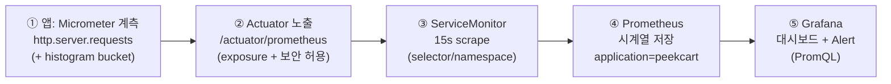
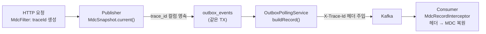
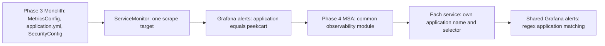

이 글의 출발점은 한 장의 빈 그래프다. Phase 3 부하 테스트 중 Grafana의 API Response Time p95/p99 패널이 **"No data"**로 떴다. scrape는 정상이었고 HTTP 메트릭 일부(`_count`/`_sum`)도 들어오고 있었는데, 하필 **p95 계산에 필요한 입력 series만 비어 있었다**. 원인은 코드 버그가 아니라 **설정을 YAML 어디에 두느냐**였다. 같은 설정이 커맨드라인에선 동작하는데 YAML 경로에선 런타임에 적용되지 않았다. 이 한 사건이 이 글의 두 축 (**YAML 설정 배치 원칙**과 **관측성 계약을 한 곳에서 관리하는 법**)을 낳았고 "관측성은 패널을 예쁘게 그리는 일이 아니라 *계약*을 지키는 일"이라는 관점을 만들었다.  
  
이번 글은 (1) **애플리케이션 메트릭이 Grafana 알림까지 도달하는 경로**를 끝까지 따라가고, (2) 그 경로의 각 지점이 **어느 파일에 단일 출처(SSOT)로 자리잡고 있는지**를 9개 지점으로 쪼개 정리하고, (3) 메트릭과 짝을 이루는 **로그 추적(MDC) 경로**가 Outbox·Kafka를 건너 어떻게 이어지는지를 본다. 마지막으로 이 계약이 Phase 4에서 서비스마다 복제될 때 무엇이 위험한지를 짚는다.  
  
이 글에서 쓰는 용어는 다음 뜻으로 읽으면 된다.  
  
| 용어 | 이 글에서의 의미 |
| --- | --- |
| Actuator | Spring Boot가 앱 상태(health)·메트릭(prometheus) 등을 HTTP 엔드포인트로 노출해 주는 모듈. `/actuator/*` |
| Micrometer | 앱 안에서 메트릭을 *수집*하는 계측 라이브러리. SLF4J가 로깅의 추상화이듯, Micrometer는 메트릭의 추상화 |
| 메트릭(metric) | 시간에 따라 변하는 수치 시계열. 예: `http_server_requests_seconds_count`(요청 수), `_bucket`(응답시간 분포) |
| histogram bucket | 응답시간을 구간(le=0.1s, 0.5s, …)별 누적 카운트로 쪼갠 시계열. p95/p99는 이 bucket이 있어야 *계산*된다 |
| Prometheus | 메트릭을 주기적으로 긁어와(scrape) 시계열 DB에 저장하고 PromQL로 질의하게 해 주는 도구 |
| scrape | Prometheus가 대상의 `/metrics`(여기선 `/actuator/prometheus`)를 주기적으로 HTTP GET 해 수치를 가져오는 것 |
| ServiceMonitor | Prometheus Operator의 CRD. "이 Service를 이 주기·경로로 scrape 하라"를 K8s 리소스로 선언(14편) |
| Grafana | Prometheus의 시계열을 *그래프*로 그리고 *임계 초과 시 알림(Alert)*을 발화하는 시각화/경보 도구 |
| PromQL | Prometheus 질의 언어. `histogram_quantile(0.95, ...)`처럼 시계열을 가공해 p95 등을 계산 |
| MDC | Mapped Diagnostic Context. SLF4J가 스레드마다 들고 다니는 키-값 가방. 로그 한 줄마다 `traceId`를 적어 두는 데 쓴다 |
| SSOT | Single Source of Truth. "이 설정의 정본은 *이 파일의 이 줄* 하나뿐"이라는 단일 출처 원칙 |
| surface | 관측성 계약을 이루는 개별 설정 지점. 이 글에서는 S1~S6.d 9개로 쪼개 다룬다 |
  
### 관측성이 처음이라면
  
이 글은 "기능을 어떻게 만드는가"가 아니라 "**돌고 있는 앱을 어떻게 들여다보는가**"가 주제다. 그래서 먼저 등장 인물 몇 가지만 알면 나머지가 읽힌다. 핵심은 메트릭이 **앱 안에서 만들어져 → 밖으로 노출되고 → 긁혀가서 → 저장되고 → 그려진다**는 다섯 손바뀜이다.  
  
- **Micrometer (앱 안)**: 우리 앱이 요청을 처리할 때마다 "방금 요청, 200으로 21ms 걸림" 같은 사실을 *숫자로 적어 두는* 라이브러리. Spring Boot가 기본으로 `http.server.requests` 같은 메트릭을 Micrometer로 모은다. 개발자가 코드를 거의 안 써도 자동으로 쌓인다.  
- **Actuator (앱의 창구)**: Micrometer가 모은 숫자를 *바깥에서 읽을 수 있게* HTTP로 내주는 창구. `/actuator/prometheus`로 GET 하면 Prometheus가 알아먹는 텍스트 포맷으로 현재 메트릭이 쏟아진다. 단, **아무 엔드포인트나 다 열면 위험**하니(예: `/actuator/env`엔 비밀이 있을 수 있다) 무엇을 열지 화이트리스트로 고른다.  
- **Prometheus (수집·저장소)**: 그 창구를 *주기적으로*(우린 15초마다) 두드려 숫자를 긁어와 시계열로 쌓는다. "지금 값"이 아니라 "시간에 따른 값의 변화"를 갖게 되는 게 핵심 — 그래야 "최근 5분 에러율" 같은 걸 물을 수 있다.  
- **Grafana (눈과 경보)**: Prometheus에 PromQL로 물어 그래프를 그리고, "에러율 5% 넘으면 알려라" 같은 규칙으로 *알림*을 쏜다. 사람이 보는 면(대시보드)과 사람을 깨우는 면(Alert) 둘 다 Grafana의 일이다.  
- **MDC / traceId (로그 쪽)**: 위 다섯이 *메트릭*(숫자 통계) 이야기라면, MDC는 *로그* 쪽 관측성이다. "이 에러 로그가 *어느 요청*에서 났는가"를 잇기 위해 요청마다 16자리 `traceId`를 붙여 로그 줄마다 적는다. 메트릭이 "전체가 얼마나 아픈가"라면 로그/trace는 "이 한 건이 어디서 막혔나"다. 둘은 다른 기둥이고, 이 글은 둘 다 다룬다.  
  
메트릭과 로그를 굳이 한 글에 묶는 이유가 있다. 둘 다 "앱이 *동작 규약*으로서 외부에 약속하는 계약"이고, 그 계약이 **여러 파일에 흩어져 한 곳만 어긋나도 조용히 깨진다**는 같은 병을 앓기 때문이다. 앞서 말한 빈 그래프가 바로 그 병의 첫 발현이었다.  
  
---  
  
이번 학습에서 확인하고 싶은 질문은 다음과 같다.  
  
1. 메트릭이 정상 수집됐는데도 Grafana 그래프가 비는 게 어떻게 가능한가?  
2. 같은 `management.*` 설정을 base에 둘 때와 프로파일에 둘 때 결과가 왜 달라지는가? (YAML 병합)  
3. 애플리케이션 메트릭이 Grafana 알림까지 가는 경로의 *각 지점*은 어느 파일에 있는가?  
4. 관측성 계약을 "9개 surface"로 쪼개 SSOT를 명시하면 무엇이 좋아지는가?  
5. `up == 0`과 `absent(up)`은 무엇이 다르길래 alert를 둘로 나눴는가?  
6. 메트릭과 별개인 로그 추적(MDC)은 Outbox·Kafka를 건너 어떻게 한 `traceId`로 이어지는가?  
7. 이 계약이 Phase 4에서 서비스마다 복제될 때 무엇이 위험한가?  
  
---  
  
## 문제 상황: 수집은 됐는데 그래프가 비어 있다  
  
Phase 3에서 kube-prometheus-stack을 띄우고(14편) 대시보드를 붙였을 때, 대부분의 패널은 정상이었다. 그런데 **API Response Time의 p95/p99 패널만 "No data"** 였다. 직관과 어긋난다. Prometheus를 열어 보면 `http_server_requests_seconds_count`·`_sum`은 분명히 들어와 있었다. scrape 대상이 막힌 것도, HTTP 메트릭 전체가 안 들어온 것도 아니다.  
  
원인은 **메트릭의 *타입***이었다. p95/p99는 "95%의 요청이 몇 초 안에 끝났나"인데, 이걸 계산하려면 응답시간을 구간별로 쪼갠 **histogram bucket**(`..._seconds_bucket{le="0.1"}`, `le="0.5"` …)이 있어야 한다. PromQL `histogram_quantile()`은 이 bucket을 입력으로 받아 분위수를 *역산*한다. 그런데 우리 앱은 `http_server_requests_seconds`를 **bucket 없는 `summary` 타입**으로만 내보내고 있었다. 입력 시계열 자체가 없으니 `histogram_quantile()`은 NaN을 뱉고, Grafana는 그걸 "No data"로 표시한다.  
  
histogram bucket을 켜는 설정은 한 줄이다. `management.metrics.distribution.percentiles-histogram[http.server.requests]: true`. 문제는 **이 한 줄을 YAML 어디에 넣어도 동작하지 않았다**는 것이다.
  
```  
시도 1) application-k8s.yml 에 추가      → 동작 안 함  
시도 2) application.yml(base) 에 추가     → 동작 안 함  
시도 3) 커맨드라인 프로퍼티로 주입         → 동작함 (!)
```  
  
3번이 동작했다는 건 설정 *값*은 맞고 **YAML 바인딩/병합 경로**가 범인이라는 뜻이다. 즉 같은 설정이 커맨드라인에선 먹고 YAML(base든 프로파일이든)에선 런타임에 적용되지 않는 상태가 재현됐다. 정확한 바인딩 원인을 더 파고들기보다, 우리는 이 경로를 **YAML에서 들어내 Java Config로 옮겨** 회피했다 — `management.metrics` 트리가 base(`application.yml`)와 환경 프로파일(`application-k8s.yml`)에 동시에 선언돼 있던 점이 의심 지점이었고(최상위 키 기준으로 맵이 병합될 때 프로파일 쪽이 우선해 base의 하위 키가 가려질 수 있다), 어느 쪽이든 *동작 규약을 YAML에 두는 한 재발 위험이 남는다*는 게 핵심이었다. 설정은 파일에 분명히 적혀 있는데 *런타임엔 없는* 상태 — 디버깅이 가장 괴로운 종류의 버그다.  
  
> Spring Boot 공식 문서는 프로파일 프로퍼티가 같은 키를 *override*하고 Map은 여러 property source에서 바인딩될 수 있다고만 설명한다. 그러니 `tags.application`이 `distribution.*`을 가린다는 건 *일반 규칙*이 아니라 **이 특정 YAML 구성에서 관측·재현된 현상**으로 읽는 게 안전하다. 우리가 택한 해법(Java Config 이전)은 그 원인 규명과 무관하게 재발 경로 자체를 없앤다.  
  
여기서 한 발 물러서 보면, 이 사건은 단발 사고가 아니라 **구조적 신호**였다. 관측성을 켜는 설정이 `application.yml`, `application-k8s.yml`, `SecurityConfig.java`, `servicemonitor.yml`, `grafana-alerts.yml` **다섯 군데에 흩어져 있었고**, 그중 한 곳의 병합 한 번이 어긋나자 전체 관측 그래프가 침묵했다. 메트릭은 "수집됐나/안 됐나"의 이진 문제가 아니라, **여러 파일에 걸친 계약이 *전부* 정합해야 비로소 그래프가 그려지는** 사슬 문제다. 이 사슬을 누가 어디서 책임지는가 — 그게 이 글의 핵심 설계 질문이다.  
  
---  
  
## 선택한 설계  
  
### 1. 메트릭이 알림까지 가는 경로 — 다섯 지점, 다섯 파일  
  
먼저 "수집됐는데 안 보인다"를 다시 안 겪으려면, 메트릭이 거치는 경로를 *지점별로* 명확히 그려야 한다. PeekCart에서 한 번의 HTTP 요청이 Grafana 알림이 되기까지는 다섯 손바뀜이다.  
  

  
각 지점은 **서로 다른 파일에 SSOT로 자리잡고 있고**, 하나라도 어긋나면 사슬이 끊긴다. 지점별로 "무엇이, 어디에" 있는지를 정리한 게 아래 surface 표다(S1~S6.d).  
  
| 지점 | 무엇을 보장하나 | SSOT 위치 (파일) | surface |  
| --- | --- | --- | --- |  
| ① histogram bucket | p95/p99 *계산 가능성* | `MetricsConfig.java` (MeterFilter) | S1 |  
| ① application 태그 | 모든 series에 `application="peekcart"` 라벨 | `application.yml:38-40` | S2 |  
| ② 노출 화이트리스트 | `/actuator/prometheus`가 scrape 가능 | `application.yml:33-37` | S3 |  
| ② 보안 허용 | actuator가 401 없이 200 응답 | `SecurityConfig.java:47-48` | S4 |  
| ③ scrape 설정 | 15초마다 긁어감, 대상 매칭 | `servicemonitor.yml:6-20` | S5 |  
| ⑤ alert 규칙 | 임계 초과 시 발화 | `grafana-alerts.yml` | S6.a~d |  
  
이 표가 말하는 바는 단순하지만 강력하다 — **"메트릭이 안 보인다"는 신고가 들어오면 이 6칸을 순서대로 짚으면 된다.** bucket이 없나(S1)? 태그가 빠졌나(S2)? 노출이 막혔나(S3)? 보안이 401인가(S4)? scrape 대상이 안 잡혔나(S5)? alert PromQL이 틀렸나(S6)? 앞의 빈 그래프는 S1의 실패였고, 그 진단을 다음에 5분 만에 끝내려고 이 표를 결정 문서로 남겼다.  
  
### 2. YAML이 아니라 Java Config — 빈 그래프를 고친 방법  
  
빈 그래프를 고치는 *값*은 한 줄이지만, *어디에 두느냐*가 결정이었다. YAML에 두는 한 병합 충돌이 재발하므로, 해결은 **Java Config로 이동**이었다(`MetricsConfig.java`).  
  
```java  
// com.peekcart.global.config.MetricsConfig (S1의 SSOT)
@Configuration  
public class MetricsConfig {  
    @Bean
    public MeterRegistryCustomizer<MeterRegistry> httpHistogramCustomizer() {
        return registry -> registry.config().meterFilter(new MeterFilter() {
            @Override
            public DistributionStatisticConfig configure(
                    Meter.Id id,
                    DistributionStatisticConfig config
            ) {
                if (id.getName().equals("http.server.requests")) {
                    return DistributionStatisticConfig.builder()
                            .percentilesHistogram(true)   // ← bucket 활성화
                            .build()
                            .merge(config);
                }
                return config;
            }
        });
    }
}  
```  
  
이게 단순한 위치 이동이 아니라 *원칙*이 된 이유가 있다. 이 사건을 일반화해 우리는 **"환경마다 달라지는 연결 정보·자격증명만 `application-{profile}.yml`에 두고, 런타임 *동작*을 바꾸는 정책은 base나 Java Config로 관리한다"** 는 규칙을 세웠다. 판단 기준 한 줄: *"환경마다 달라야 하는 값인가(→ 프로파일), 아니면 동작 규약인가(→ base/Java Config)?"*  
  
histogram bucket은 **모든 환경에서 똑같이 켜져야 하는 동작 규약**이다. minikube든 GKE든 p95는 같은 방식으로 계산돼야 한다. 그러니 환경별 프로파일에 둘 이유가 없고, 오히려 거기 두면 병합 충돌에 노출된다. 반대로 `application=peekcart` 태그(S2)나 노출 화이트리스트(S3)는 *동작 규약*이라 base `application.yml`에 두되, **프로파일엔 절대 재선언하지 않는다**.
  
특히 이 원칙은 *"최상위 키 트리(`management.*`)에 base/프로파일 병합 충돌 가능성이 있으면 Java Config로 가라"*를 명시 케이스로 둔다.
  
### 3. 관측성을 "계약"으로 본다 — 9 surface를 한 표로  
  
YAML 원칙은 *값을 어디에 두나*를 풀었지만, 더 큰 질문이 남았다 — **9개 지점이 흩어져 있다는 사실 자체**를 어떻게 관리하나? 그게 이 절의 주제다.  
  
결정은 의외로 "통합하지 않는다"였다. 모든 설정을 한 `ObservabilityConfig` 클래스로 모으는 길도 검토했지만, 코드 통합 자체가 위험·검증 비용을 동반하는 별도 변경이라 *결정*과 *코드 이동*을 한 작업에 묶으면 둘 다 품질이 깎인다고 봤다. 대신 **"각 surface가 지금 어디에 있고, Phase 4에서 어느 모듈로 가고, 무엇을 검증하는가"를 표로 분명히 정해 두었다.** 9 surface를 요약하면
  
| surface | 무엇 | 의존 | 깨지면 |  
| --- | --- | --- | --- |  
| S1 | histogram bucket | — | p95 패널·latency alert만 NaN (error-rate는 무관) |  
| S2 | `application=` 태그 | — | alert의 `{application="peekcart"}` 필터가 시계열을 못 잡음 |  
| S3 | exposure 화이트리스트 | — | `/actuator/prometheus` scrape 불가 |  
| S4 | actuator 보안 허용 | — | scrape가 401, Probe 실패 |  
| S5 | scrape 설정 | — | **모든 S6 alert가 발화 불가** (또는 S6.d가 absent 발화) |  
| S6.a | error-rate alert (5xx>5%) | S2, S5 | `_count` 사용 → S1 무관 |  
| S6.b | latency alert (p95>2s) | S1, S2, S5 | `_bucket` 사용 → S1 직접 의존 |  
| S6.c | target-down (`up==0`) | S5 | scrape label만 의존 |  
| S6.d | scrape-absent (`absent(up)`) | S5 | selector 미스매치/리소스 삭제 |  
  
이 표의 가치는 **의존 방향**에 있다. 예를 들어 "error-rate alert는 멀쩡한데 latency alert만 NaN"이면 S1(bucket)만 의심하면 된다 — error-rate는 `_count`를 쓰므로 S1과 무관하기 때문이다. 반대로 "alert가 *전부* 안 뜬다"면 공통 의존인 S5(scrape)를 먼저 본다. 흩어진 계약을 *통합하지 않고도* "어디를 보면 되는지"를 결정론적으로 만든 게 이 표다.  
  
이 SSOT 표는 앞의 YAML 원칙을 **대체하는 게 아니라 확장**한다. YAML 원칙이 "동작 정책 → Java Config"라는 *일반 규칙*이라면, 이 표는 그 규칙을 관측성의 9 surface에 *구체화*하고, 특히 일반 규칙만으론 도출되지 않는 **manifest 측 surface(S5 ServiceMonitor, S6 Grafana alert)**의 위치까지 정한다.  
  
### 4. 메트릭의 짝 — 로그 추적(MDC)이 Outbox·Kafka를 건너는 법  
  
여기까지가 *메트릭*(전체 통계)이다. 그런데 "5xx 에러율이 올랐다"는 alert가 떴을 때, 운영자는 곧장 "*어느 요청*이 터졌나"를 알고 싶어 한다. 그게 *로그/trace* 쪽 관측성이고, PeekCart는 이를 **MDC `traceId`**로 푼다.  
  
시작은 단순하다. `MdcFilter`가 16자리 `traceId`와(SecurityContext가 있으면) `userId`를 MDC에 적는다. 단 위치가 중요하다. 이 필터는 `JwtFilter` 뒤에 등록돼(`SecurityConfig`의 `addFilterAfter(new MdcFilter(), JwtFilter.class)`), userId를 채우려면 JWT 인증이 먼저 끝나 있어야 하기 때문이다. 그래서 traceId가 붙는 범위는 정확히는 **JwtFilter 이후의 애플리케이션 처리 구간**이고, JwtFilter 내부 로그나 그 전에 끝나는 보안 실패 로그는 이 traceId 밖이다.  
  
```java  
// global/filter/MdcFilter.java  
MDC.put("traceId", UUID.randomUUID().toString().replace("-", "").substring(0, 16));  
Authentication auth = SecurityContextHolder.getContext().getAuthentication();  
if (auth != null && auth.getPrincipal() instanceof Long userId) {  
    MDC.put("userId", userId.toString());
}  
```  
  
이러면 그 요청이 (필터 통과 이후) 동기적으로 찍는 로그 줄에 같은 `traceId`가 붙어, 로그를 `traceId`로 grep 하면 한 요청의 처리 흐름이 모인다. **문제는 비동기 경계다.** PeekCart의 핵심 흐름(주문→결제→알림)은 Outbox + Kafka로 도메인을 건넌다(10·11편). 그런데:  
  
1. `OutboxPollingService`는 `@Scheduled` *별도 스레드*에서 돈다 — 그 스레드의 MDC는 비어 있다(`MDC.get("traceId")`는 항상 null).  
2. Consumer가 메시지를 받을 땐 원본 HTTP 요청의 MDC가 이미 사라진 지 오래다.  
  
그대로 두면 "HTTP 요청 → Outbox 저장 → Kafka publish → Consumer 처리 → DLQ"의 5단계가 *서로 다른 traceId*로 흩어져, 정작 장애 분석이 필요한 비동기 경로에서 추적이 끊긴다. 그래서 택한 방법은 **traceId를 메시지에 *실어 보내는*** 것이다.  
  

  
핵심은 **MDC를 캡처하는 시점**이다. 폴링 스레드엔 MDC가 없으니, *원본 HTTP 요청 스레드*에서 Outbox 이벤트를 저장할 때 `MdcSnapshot.current()`로 traceId/userId를 떠서 **엔티티 컬럼(`outbox_events.trace_id`, `user_id`)에 같은 트랜잭션으로 영속**한다(`V4__outbox_trace_context.sql`). 나중에 폴링 스레드는 MDC 대신 *컬럼에 저장된 값*을 읽어 Kafka 헤더에 싣는다.  
  
```java  
// global/outbox/OutboxPollingService.java — 폴링 스레드는 컬럼에서 읽어 헤더로  
private ProducerRecord<String, String> buildRecord(OutboxEvent event) {  
    ProducerRecord<String, String> record = new ProducerRecord<>(...);
    addHeaderIfPresent(record, KafkaTraceHeaders.TRACE_ID, event.getTraceId()); // X-Trace-Id
    addHeaderIfPresent(record, KafkaTraceHeaders.USER_ID, event.getUserId());   // X-User-Id
    return record;
}  
```  
  
Consumer 쪽 `MdcRecordInterceptor`는 이미 **헤더 우선 → payload `eventId` → 신규 UUID**의 fallback 사다리를 갖고 있어(Consumer 측 trace 복원은 이 글보다 앞선 단계에서 먼저 만들어졌다), 헤더가 오면 그대로 복원하고 없으면 eventId로 묶는다.  
  
```java  
// global/kafka/MdcRecordInterceptor.java  
String traceId = headerValue(record, KafkaTraceHeaders.TRACE_ID);  // ① 헤더 (Producer가 실어 보냄)  
if (traceId == null) traceId = extracted.eventId();                // ② payload eventId (재시도/DLQ까지 동일)  
if (traceId == null) traceId = UUID.randomUUID()...;               // ③ 방어적 fallback
MDC.put(MDC_TRACE_ID, traceId);  
```  
  
이 설계에서 눈여겨볼 결정 두 가지. (1) **헤더가 null이면 헤더 자체를 안 넣는다**(빈 문자열 헤더 금지) — Consumer의 `value.isBlank() ? null` 분기와 정합시켜, "있다"와 "비었다"가 같은 의미가 되게 했다. (2) **payload envelope을 안 건드렸다** — trace를 메시지 본문(JSON)에 넣었으면(Alt B) Consumer 파서를 고쳐야 하고 기존 메시지 호환이 깨진다. 헤더 경로를 택해 **스키마 불변 + 기존 Consumer 인프라 재활용**을 동시에 얻었다. 그리고 이게 Phase 4 OpenTelemetry 도입 시 표준 헤더 `traceparent`를 *한 단계 더 끼우기만* 하면 되는 forward-compatible 구조다.  
  
> 짚을 점: 이 MDC 추적은 **메트릭이 아니라 로그 상관관계**다. Prometheus/Grafana엔 안 보인다. 진짜 분산 추적(span, sampling, 서비스 간 전파)은 Phase 4에서 micrometer-tracing/OpenTelemetry로 별도 도입한다. 지금은 "모놀리스 안에서 로그를 한 traceId로 묶는" 최소 추적이고, 위 작업은 그 *컬럼·헤더 인프라*를 미리 깔아 둔 것이다.  
  
---  
  
## 구현 구조: 네 개의 알림과 한 개의 회귀 테스트  
  
### 네 개의 Grafana Alert — 무엇이 침묵을 깨우나  
  
경로의 종착점은 Grafana Alert다. `grafana-alerts.yml`은 ConfigMap 하나에 **4개 룰**을 담는다(S6.a~d). 넷이 *서로 다른 실패*를 감지하도록 설계됐다.  
  
| uid | 감지 | PromQL 핵심 | severity | 의존 surface |  
| --- | --- | --- | --- | --- |  
| `peekcart-high-error-rate` | 5xx 비율 > 5% | `rate(..._count{status=~"5.."}) / rate(..._count)` | critical | S2, S5 |  
| `peekcart-slow-response` | p95 > 2s | `histogram_quantile(0.95, rate(..._bucket[5m]))` | warning | S1, S2, S5 |  
| `peekcart-target-down` | `up == 0` | `count(up{...} == 0) or on() vector(0)` | critical | S5 |  
| `peekcart-scrape-absent` | `absent(up{...})` | `absent(up{...}) or on() vector(0)` | critical | S5 |  
  
여기서 가장 배울 게 많은 건 **target-down(S6.c)과 scrape-absent(S6.d)를 왜 둘로 나눴나**다. 둘 다 "메트릭이 안 들어온다"처럼 보이지만 원인이 다르다.  
  
- **`up == 0` (target-down)**: Prometheus가 scrape 대상을 *알고는 있는데*(ServiceMonitor 매칭 성공) 막상 긁으니 *실패*했다 — 네트워크 단절, 401, `/actuator/prometheus`가 500 등. `up` 시계열은 **존재하되 값이 0**이다.  
- **`absent(up)` (scrape-absent)**: `up` 시계열이 **아예 없다** — ServiceMonitor selector가 미스매치거나, 네임스페이스·서비스가 삭제됐거나, scrape 대상으로 등록된 적이 없다.  
  
이 구분이 실무적으로 중요한 이유: `up == 0`은 "서비스가 떠 있는데 응답을 못 한다"(앱/네트워크 문제)고, `absent(up)`은 "그 서비스를 *감시하고 있다는 사실 자체*가 사라졌다"(설정/배포 문제)다. 전자는 앱을 보고 후자는 매니페스트(S5)를 본다. 알림 하나로 뭉뚱그렸으면 둘을 구분하느라 새벽에 헤맸을 것이다. `grafana-alerts.yml`의 description이 *"up 시계열은 존재하되 0 … Error Rate 패널의 강제 0% 표시와 구분하는 신호"*라고 그 의도를 적어 둔다.  
  
또 하나의 디테일 — error-rate는 `_count`를, latency는 `_bucket`을 쓴다. 그래서 **histogram bucket(S1)이 깨져도 error-rate alert는 멀쩡히 돈다.** 앞의 빈 그래프가 p95 패널만 죽이고 에러율 패널은 살려 둔 게 이 때문이다. surface 의존 표(S6.a는 S1 무관, S6.b는 S1 의존)가 이 동작을 정확히 예측한다.  
  
모든 룰은 `datasourceUid: prometheus`로 datasource를 *명시 참조*한다. 여기엔 함정이 하나 있다 — 원래 이 UID는 kube-prometheus-stack Helm 차트가 *자동 프로비저닝*하는 기본값에 의존하고 있어, 차트 업그레이드로 UID가 바뀌면 그 UID를 참조하는 대시보드·alert가 한꺼번에 datasource를 잃을 수 있었다(`uid: prometheus` 참조가 대시보드 JSON 14곳, alert 룰 4개의 쿼리 5곳). 그래서 values에 `grafana.sidecar.datasources.uid: prometheus`를 **명시 pin**해 차트 기본값 의존을 끊었다(dashboard/alert YAML은 0건 변경 — 기존 `uid: prometheus` 참조를 그대로 살림).  
  
### 한 개의 회귀 테스트 — 계약이 깨지는 걸 CI에서 잡는다  
  
surface 표로 SSOT를 정리해 둬도, 표는 사람이 안 보면 그만이다. 그래서 *동작* 회귀만이라도 자동으로 잡으려고 `ObservabilityMetricsIntegrationTest`를 둔다.  
  
```java  
@SpringBootTest(webEnvironment = RANDOM_PORT)  
@AutoConfigureObservability   // ← 이게 없으면 테스트에서 메트릭이 안 켜진다  
class ObservabilityMetricsIntegrationTest extends AbstractIntegrationTest {  
  
    @Test // S1 + S2 동시 검증  
    void prometheusEndpoint_exposesHistogramBucketAndApplicationTag() {  
        restTemplate.getForEntity("/api/v1/products", String.class);          // 비즈니스 호출로 메트릭 유발  
        String body = restTemplate.getForEntity("/actuator/prometheus", ...).getBody();  
  
        assertThat(body).contains("application=\"peekcart\"");                // S2: 태그  
        assertThat(body).containsPattern(                                      // S1: bucket
            "http_server_requests_seconds_bucket\\{[^}]*uri=\"/api/v1/products\"[^}]*le=\"[^\"]+\"[^}]*\\}"
        );  
    }  
}  
```  
  
`@AutoConfigureObservability`가 핵심 장치다 — Spring Boot는 테스트에서 노이즈를 줄이려 기본적으로 메트릭 export를 *끈다*. 이 어노테이션으로 명시적으로 켜야 실제 운영과 같은 메트릭 노출을 검증할 수 있다. 테스트는 비즈니스 엔드포인트를 한 번 때려 `http.server.requests`를 유발한 뒤, `/actuator/prometheus` 응답에 (S1) `_bucket{...le=...}`과 (S2) `application="peekcart"`가 **둘 다** 있는지 본다. bucket이 사라지거나 태그가 빠지면 이 테스트가 빨개진다 — 즉 **빈 그래프와 태그 누락의 재발을 CI에서 막는다**. 여기에 exposure 화이트리스트 정확도(info·env가 노출되지 않는지)와 `/actuator/health/**` 무인증 접근까지 검증 범위가 넓어졌다.  
  
다만 이 테스트가 잡는 건 **동작 회귀**이지 **위치 위반**이 아니다. 누가 `application=` 태그를 base가 아닌 프로파일에 *복제*해도, 런타임 동작이 같으면 이 테스트는 통과한다. 그 위치/복제 위반은 **별도의 정적 lint**(`scripts/observability-ssot-lint.sh`)가 CI에서 잡는다 — base `application.yml`이 SSOT인 키가 다른 프로파일에 재선언됐는지, `MeterFilter`나 `application=` 태그가 둘 이상 파일에 중복 선언됐는지를 grep/yaml 파싱으로 검사한다. 즉 *동작*은 통합 테스트가, *위치/복제*는 정적 lint가 나눠 맡는다.  
  
---  
  
## 한계와 트레이드오프  
  
### SSOT 강제는 lint로 구현됐다 — 다만 *정적* 검증의 한계가 남는다  
  
9 surface 표는 *결정*이고, 그 결정을 코드로 강제하는 lint와 테스트가 **이미 CI에서 돈다.** 이 글을 쓰는 시점의 실제 상태는 다음과 같다.  
  
| 검증 대상 | 강제 수단 | 검사 내용 |  
| --- | --- | --- |  
| SSOT 위치·복제 | `scripts/observability-ssot-lint.sh` (CI) | SSOT 키의 타 프로파일 재선언·`MeterFilter`/태그 중복 선언 정적 검출 |  
| exposure 정확도 | `ObservabilityMetricsIntegrationTest` | exposure가 정확히 `health,prometheus`만 노출(info·env는 200 아님) |  
| health 무인증 | `ObservabilityMetricsIntegrationTest` | `/actuator/health/**` 무인증 200 |  
| ServiceMonitor selector | `scripts/servicemonitor-selector-lint.sh` (CI) | 두 overlay의 `kubectl kustomize` 산출물에서 ServiceMonitor selector ↔ Service label/port 매칭 |  
| alert PromQL 라벨 | `scripts/observability-promql-lint.sh` (CI) | alert uid별 required-label + S2/S5 실제 설정값 일치 |  
  
즉 "위치 위반은 수동 리뷰에 의존"하던 단계는 지났다. 다만 **이 강제는 전부 *정적*이다** — 세 lint는 YAML·kustomize 산출물을 파싱해 *구조·라벨·배선*을 검사할 뿐, Prometheus를 실제로 띄워 *런타임 의미*를 검증하지는 않는다.  
  
### 정적 lint가 못 보는 것 — 런타임 의미는 여전히 사각  
  
Phase 3 통합 테스트엔 Prometheus가 없다(Testcontainers로 MySQL/Redis/Kafka는 띄우지만 Prometheus는 아니다). 그래서 다음은 lint·테스트를 통과해도 *실제로는* 깨질 수 있다.  
  
- **PromQL이 문법상·라벨상 맞아도 결과가 틀릴 수 있다.** `observability-promql-lint.sh`는 alert `expr`의 required-label presence와 S2/S5 ground truth *값 일치*까지 본다. 하지만 `histogram_quantile`이 실제 bucket 분포에서 *말이 되는 수치*를 내는지, rate 윈도우가 적절한지 같은 **의미**는 Prometheus가 돌아야 안다.  
- **selector가 매칭돼도 scrape가 실패할 수 있다.** `servicemonitor-selector-lint.sh`는 label/port가 *문서상* 맞는지 보지만, 실제 Pod가 그 포트로 메트릭을 *응답하는지*는 클러스터에서만 확인된다 — 그건 런타임의 `peekcart-target-down`(S6.c) alert가 맡는다.  
- **happy-path 회귀 테스트의 범위.** exposure 정확도·health 무인증 테스트는 "정확히 health/prometheus만 노출", "health 무인증 200"을 보지만, 모든 endpoint·모든 경로의 조합을 망라하지는 않는다.  
  
정리하면 *위치/복제/배선*은 CI에서 해소됐고, 남은 사각은 **Prometheus를 실제로 띄워야 보이는 런타임 의미**다. 이건 단위/정적 검증의 본질적 경계이지 미구현 부채가 아니다.  
  
### MDC는 분산 추적이 아니다 — span도 sampling도 없다  
  
이 trace 인프라는 "로그를 한 traceId로 묶는" 최소 상관관계지, OpenTelemetry 같은 *분산 추적*이 아니다. span(구간별 소요시간), sampling(부하 시 일부만 추적), baggage(컨텍스트 전파) 같은 게 전부 없다. 모놀리스 단일 컨텍스트에선 그 인프라 비용이 가치 대비 과해서 의도적으로 미뤘다. 대신 헤더 우선순위 사다리를 forward-compatible하게 만들어 둬서, Phase 4에서 `traceparent` 한 단계만 끼우면 되도록 했다. 즉 *지금의 한계*는 *Phase 4의 작업*으로 명시적으로 이연돼 있다.  
  
### 관측성에도 사각이 남아 있다 — 메트릭이 *없는* 영역  
  
지금 메트릭은 HTTP(`http.server.requests`)와 JVM 중심이고, **비즈니스/파이프라인 내부 메트릭이 비어 있다.** 학습 부채 후보로 이미 등록된 것만:  
  
- **캐시 적중률 부재**: `RedisCacheManager`가 `CacheMeterBinder`에 안 붙어 `cache.gets{result=hit/miss}`가 없다. 캐시 효과를 부하 TPS로 *간접* 측정할 뿐 운영 중 실시간 적중률이 안 보인다(8편).  
- **Outbox 발행 메트릭 부재**: `OutboxPollingService`에 Micrometer 계측이 전무해 PENDING backlog 크기·발행 지연·실패율이 메트릭으로 안 나온다. 운영자의 유일한 신호는 MAX_RETRY 소진 시 Slack 단발 알림뿐(10편).  
- **Slack 발송 가시성 부재**: 운영 알림 3종이 같은 Slack Webhook에 의존하는데 `SlackNotificationClient.send()`가 예외를 `log.error`로만 흡수해 발송 실패가 메트릭/알람으로 안 뜬다(6편).  
  
셋 다 surface 표에 **cache·outbox 행 자체가 빈 칸**이라는 같은 구조다. "관측성 옵션 가치" 형 부채 — 지금은 안 아프지만 Phase 4에서 서비스 비교가 필요할 때 비로소 비용이 드러난다.  
  
---  
  
## 이 설계가 보장한 것 (과 못한 것)  
  
**보장하는 것**  
  
- **메트릭 경로의 결정론적 진단.** "안 보인다"는 신고가 들어오면 S1~S6 6칸을 의존 순서대로 짚어 원인을 좁힌다. error-rate는 멀쩡한데 latency만 NaN → S1, alert가 전부 죽음 → S5. surface 표가 추측을 진단으로 바꾼다.  
- **빈 그래프·태그 누락 재발의 CI 차단.** `ObservabilityMetricsIntegrationTest`가 histogram bucket(S1)·application 태그(S2)·exposure(S3)·health 무인증(S4)의 *동작 회귀*를 매 빌드 검사한다.  
- **병합 충돌의 구조적 차단.** 동작 규약을 Java Config/base로 격리해, `management.*` 트리의 YAML 병합 충돌이 다시 그래프를 죽이는 경로를 없앴다.  
- **두 실패의 분리 감지.** `up==0`(앱/네트워크)과 `absent(up)`(설정/배포)을 별 alert로 나눠, 새벽 호출 시 어디를 볼지가 알림 자체에 담겨 있다.  
- **비동기 경계를 건너는 traceId.** HTTP→Outbox→Kafka→Consumer→DLQ 5단계가 한 traceId로 묶여 로그 grep으로 한 요청을 따라갈 수 있다.  
  
**보장하지 못하는 것**  
  
- **런타임 PromQL 의미** — 정적 lint(selector·PromQL 라벨)는 매칭·라벨·설정값을 보지만, Prometheus를 띄워 실제 쿼리 *결과*가 맞는지는 검증하지 않는다.  
- **분산 추적** — MDC는 로그 상관관계지 span·sampling이 있는 OpenTelemetry가 아니다.  
- **비즈니스/파이프라인 가시성** — 캐시 적중률·Outbox backlog·Slack 발송 실패가 메트릭에 없다.  
- **surface의 물리적 이전** — 9 surface는 아직 모놀리스 한 곳에 모여 있다. Phase 4 모듈/서비스로의 이전은 surface 표의 "Phase 4 owner"대로 그때 수행된다.  
  
14편 K8s에서 본 패턴("핵심은 단단히, 가장 중요한 보장의 일부는 공백으로 정직하게")이 여기서도 반복된다. *위치·복제·배선*의 공백은 lint/테스트로 이미 해소됐고, 남은 공백은 "런타임 의미 검증·분산 추적·파이프라인 메트릭·Phase 4 물리 이전" 넷이다.  
  
---  
  
## 자료는 어떤 질문에 연결해서 읽을까  
  
| 질문 | 같이 읽을 자료 | 이 글에서 연결되는 지점 |  
| --- | --- | --- |  
| Micrometer/Actuator가 메트릭을 노출하는 원리 | Spring Boot Reference, *Actuator / Metrics* | 경로 ①② · `MetricsConfig` |  
| histogram bucket과 `histogram_quantile()`의 관계 | Prometheus 문서, *Histograms and summaries* | 빈 그래프 · S1 |  
| Spring Boot YAML 프로파일 병합 규칙 | Spring Boot Reference, *Externalized Configuration: Merging YAML* | 문제 상황 · YAML 원칙 |  
| ServiceMonitor가 scrape 대상을 매칭하는 방식 | Prometheus Operator 문서, *ServiceMonitor* | 경로 ③ · S5 |  
| `up` 메트릭과 `absent()`의 의미 | Prometheus 문서, *Querying / up* | target-down vs scrape-absent |  
| MDC 기반 로그 상관관계와 분산 추적의 차이 | Micrometer Tracing 문서, *Introduction* | MDC 절 · Phase 4 OTel |  
| SSOT/계약을 한 곳에서 강제하는 패턴 | Google SRE Book, *Monitoring Distributed Systems* | 9 surface 표 |  
  
---  
  
## Phase 4 MSA에서는 어떻게 바뀌는가  
  
지금 관측성 계약은 **모놀리스 한 덩어리**의 것이다. 9 surface가 한 앱·한 ServiceMonitor·한 alert 파일에 모여 있다. Phase 4에서 서비스가 N개로 갈라지면 이 계약이 *서비스 수만큼 복제*되는데, 여기서 앞서 본 "계약 분산"이 모듈 경계를 따라 더 깊어질 위험이 있다. surface 표의 "Phase 4 owner"는 바로 이 복제를 *미리 설계*해 둔 것이다.  
  

  
**그대로 가는 것**  
  
- **9 surface의 의존 구조.** "S6은 S5에 의존, latency는 S1에 의존" 같은 의존 방향은 서비스가 늘어도 동일하다. 진단 표가 서비스마다 한 장씩 늘 뿐 논리는 같다.  
- **모니터링 스택의 위치 분담.** S5(ServiceMonitor)는 앱 레포 `base/services/<svc>/`, S6(alert)는 `monitoring/shared/`로 가는 분담이 유지된다. ServiceMonitor를 서비스 디렉토리에 동봉하는 14편 패턴이 그대로 N배로 확장된다.  
- **헤더 기반 trace 사다리.** Consumer 측 헤더 우선순위와 Outbox Producer 측 헤더 주입의 `헤더 → eventId → UUID` 우선순위가 cross-service에서 `traceparent`를 맨 위에 끼우는 것만으로 확장된다.  
  
**바뀌는 것**  
  
- **공통 surface는 모듈로, 식별 surface는 서비스로.** S1(histogram), S3(exposure), S4(보안 허용)는 *모든 서비스가 똑같이* 필요하므로 `peekcart-common-observability` 모듈에 두고 각 서비스가 import-only로 가져간다 — `MeterFilter`를 서비스마다 재선언하면 계약 분산이 재발한다. 반면 S2(`application=`)는 **서비스마다 자기 이름**(`order-service`, `payment-service` …)이어야 하므로 각 서비스 `application.yml`에 두되 공통 모듈에 default를 넣지 않는다.  
- **alert가 cross-service 정규식으로.** 지금 `application="peekcart"`인 alert 필터가 Phase 4에선 `application=~"order-service|payment-service|..."` 정규식이 된다. alert는 여전히 `monitoring/shared/` 한 곳 — 서비스별로 복제하지 않는다.  
- **MDC가 진짜 분산 추적으로.** 모놀리스의 "로그 상관관계"가 micrometer-tracing/OpenTelemetry의 *span 기반 분산 추적*으로 격상된다. `MdcFilter`를 tracer와 결합하고 `traceparent`를 헤더 우선순위에 추가하는 작업이 그 시점에 더해진다.  
  
**그래서 Phase 4 진입 전 짚을 점**  
  
- **이미 있는 SSOT lint를 서비스별로 확장해야 한다.** 지금의 정적 lint는 모놀리스 한 곳을 검사하도록 짜여 있다. 서비스 N개에서 "MeterFilter가 공통 모듈 1개소에만 있는가", "`application=`가 각 서비스 base 외에 재선언 안 됐는가"를 보려면 lint의 검사 범위를 모듈 트리에 맞춰 넓혀야 한다. *새로 도입*이 아니라 *기존 lint의 확장*이 과제다.  
- **공통 관측성 모듈의 경계를 surface 표대로 그어야 한다.** 무엇이 `peekcart-common-observability`로 가고(S1/S3/S4) 무엇이 서비스에 남는가(S2/S5)는 이미 표에 정해져 있다 — Phase 4 계획은 이 모듈을 *자기 결정 항목에서 제외*하고 표를 그대로 따른다. 이건 13·18편의 "`common` 모듈에 무엇을 둘 것인가"와 같은 결의 질문이다.  
- **정적 lint를 넘어 런타임 검증으로 갈지 결정해야 한다.** 서비스가 늘수록 selector 미스매치·PromQL *결과* 오류의 표면이 N배가 된다. 지금의 정적 lint가 *구조*는 막지만, Prometheus를 띄워 실제 쿼리 결과까지 보는 통합 검증을 어디까지 도입할지가 부채 정리(18편)의 판단 항목이다.
