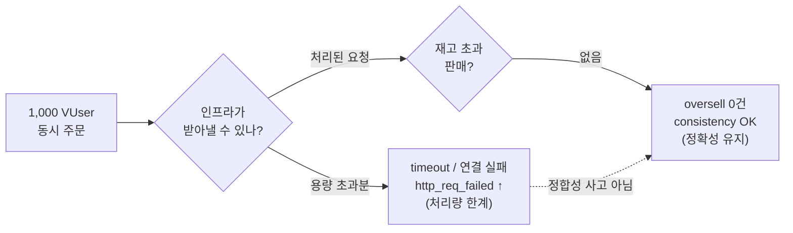
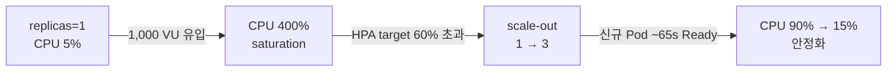
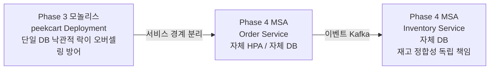

  
16편(세션 B)은 상품 **조회** 워크로드였다. 캐시 ON/OFF만 토글해 TPS ×2.31을 측정했고, 목표 ×3 미달의 원인을 "CPU 병목 가설"까지만 좁힌 뒤 그대로 남겼다.  
  
조회는 읽기만 한다. 같은 데이터를 100명이 동시에 읽어도 서로를 망치지 않는다.  
  
하지만 **주문**은 다르다.  
  
> 재고가 빠듯한 상품에 주문이 한꺼번에 들어오면 재고만큼만 팔리고 나머지는 정확히 실패해야 한다.  
  
이 한 문장이 세션 C(2026-04-29)의 핵심 질문이다. 1,001번 상품부터 1,010번까지, 각 재고 100개(총 1,000개)에 1,000명의 가상 사용자가 동시에 주문을 시도한다. 검증하려는 것은 처리량이 아니라 **정합성**이다.  
  
결론부터 말하면 두 가지를 동시에 얻었다. 하나는 깔끔한 성공 하나는 솔직한 미달이다.  
  
| 축                                    | 결과                                   | 판정   |
| ------------------------------------ | ------------------------------------ | ---- |
| 정합성 (오버셀링)                           | 0건 (Run 1·Run 2 모두 `consistency=OK`) | PASS |
| HPA 자동 증설                            | replicas 1 → 3, 신규 Pod 65초 내 Ready   | PASS |
| Kafka Consumer Lag                   | steady-state 0, peak 후 5분 내 0 복귀     | PASS |
| throughput (`http_req_failed < 0.1`) | Run 1 60.59%, Run 2 35.90%           | FAIL |
  
이 글의 핵심은 이 표의 마지막 줄과 첫 줄이 **동시에 참**이라는 점이다. http 실패율이 60%인데 어떻게 "정합성 PASS"라고 말할 수 있는가? 그리고 그 정합성을 실제로 지킨 것은 무엇이었나?  
  
---  
  
## 용어  
  
| 용어               | 이 글에서의 의미                                                                                               |
| ---------------- | ------------------------------------------------------------------------------------------------------- |
| VU / VUser       | Virtual User. k6가 흉내 내는 동시 가상 사용자                                                                       |
| 오버셀링(oversell)   | 재고보다 많이 팔리는 정합성 사고. 재고 100인데 101개 이상 판매되면 발생                                                            |
| 정합성(consistency) | 판매량 == 재고 소진량, 그리고 총 판매량 <= 초기 재고. 본 글의 1차 합격 기준                                                        |
| HPA              | Horizontal Pod Autoscaler. CPU 사용률 기준으로 Pod 수를 자동 조절하는 쿠버네티스 컨트롤러                                       |
| scale-out        | 부하가 오를 때 Pod 수(replicas)를 늘려 처리량을 확보하는 것                                                                |
| saturation       | CPU 같은 자원이 한계에 도달해 더 못 처리하는 상태. 본 글에선 Pod CPU limit(2 vCPU) 도달                                          |
| HPA utilization  | HPA가 보는 CPU 사용률. **노드가 아니라 Pod CPU request 기준**(`usage/request`). request 500m일 때 400% = 2000m = 2 vCPU |
| cold-start       | 1개 Pod로 시작해 부하를 받으며 증설되는 출발 조건                                                                          |
| pre-warmed       | 측정 전에 미리 3개 Pod로 띄워 둔 출발 조건                                                                             |
| Consumer Lag     | Kafka에서 발행된 메시지 수와 consumer가 처리한 수의 차이. 밀림의 양                                                           |
| steady-state     | 부하가 없거나 안정된 정상 상태 구간                                                                                    |
| Threshold        | k6에서 합격/불합격을 자동 판정하는 기준선                                                                                |
| p95              | 응답시간 분포의 95퍼센타일. 느린 쪽 꼬리를 보는 지표                                                                         |
| `@Version` 낙관적 락 | 행 버전이 갱신 시점에 바뀌면 충돌로 보고 실패시키는 DB 차원의 최후 방어선                                                             |
  
---  
  
## 이번 글의 질문  
  
1. 조회 부하(세션 B)와 주문 부하(세션 C)는 무엇이 본질적으로 다른가?  
2. 1,000 VUser 동시 주문 시나리오를 어떻게 "정합성 실험"으로 설계했나?  
3. http 실패율 60%인데 "정합성 PASS"라고 말할 수 있는 근거는 무엇인가?  
4. 오버셀링 0건을 실제로 지킨 것은 분산 락인가, 낙관적 락인가?  
5. HPA 1→3 scale-out은 throughput 문제를 해결했나, 아니면 옮겼을 뿐인가?  
6. Run 1과 Run 2를 나눠 측정해서 무엇을 분리할 수 있었나?  
7. Kafka Lag이 0으로 돌아왔다는 것은 무엇을 보장하나?  
8. 이 측정은 Phase 4 MSA에서 어떻게 다시 쓰이나?  
  
---  
  
## 문제 상황: 조회는 충돌하지 않지만 주문은 충돌한다  
  
세션 B에서 검증한 것은 읽기 처리량이었다. 캐시가 잘 동작하면 빨라진다. 정합성이라는 단어는 등장할 자리가 없었다. 두 사용자가 같은 상품을 동시에 조회해도 서로의 결과를 깨뜨리지 않기 때문이다.  
  
주문은 다르다. 주문은 재고라는 **공유 자원을 줄인다**. 같은 상품에 동시에 주문이 집중되면 다음 사고가 가능해진다.  
  
```text  
재고 100, 동시 주문 1,000건  
  
[정상]   100개 판매, 900건 실패 (재고 부족)  
[사고]   101개 이상 판매 → 오버셀링 → 팔 수 없는 물건을 팔아버림  
```  
  
오버셀링은 "성능이 좀 느린" 수준의 문제가 아니다. 이미 결제된 주문을 취소해야 하고 고객 신뢰를 잃는 **데이터 정합성 사고**다. Phase 2에서 분산 락과 낙관적 락을 이중으로 둔 이유가 바로 이걸 막기 위해서였다(9편).  
  
문제는 이중 방어선이 **실제 동시 부하에서도 버티는지**는 단위 테스트로 증명되지 않는다는 점이다. `InventoryConcurrencyTest`는 스레드 몇십 개로 경합을 흉내 내지만, 1,000 VUser가 실제 GKE 클러스터의 단일 Pod에 HTTP로 동시에 요청하는 상황과는 다르다. CPU 포화, Pod readiness 전이, 커넥션 풀 고갈 같은 운영 변수는 통합 테스트에 없다.  
  
그래서 세션 C의 목표는 명확했다.  
  
> **실제 분산 환경의 동시 주문에서 오버셀링이 0건인가?**  
> 그리고 그때 인프라(CPU, HPA, Kafka)는 어떻게 반응하는가?  
  
---  
  
## 세션을 왜 B와 C로 쪼갰나  
  
세션 B 글에서 이미 다뤘듯, GKE는 **과금되는 1회성 세션**이다. 클러스터를 띄운 채 측정과 디버깅을 섞으면 비용도 늘고 측정도 오염된다. 그래서 시작 전부터 세 세션으로 범위를 나눴다.  
  
```text  
세션 A: 로컬 준비 (무과금)  
세션 B: 상품 조회 캐시 TPS 측정 (2026-04-09)  → 16편  
세션 C: 동시 주문 정합성 + HPA + Kafka Lag (2026-04-29)  → 이 글  
```  
  
세션 C는 시나리오 1(상품 조회)을 **재측정하지 않는다**. 세션 B 수치를 인용만 한다. 같은 측정을 두 번 하면 과금만 늘 뿐, 새로 알게 되는 것이 없기 때문이다. 대신 세션 C는 네 가지를 한 번의 과금으로 묶었다.  
  
| 대상       | 내용                               |
| -------- | -------------------------------- |
| 시나리오 2   | 1,000 VUser 동시 주문 정합성            |
| 시나리오 3   | Kafka Consumer Lag               |
| Task 3-5 | HPA 1→3 런타임 검증                   |
| D-002    | 세션 B의 ×3 미달 원인(CPU 병목) 보강 데이터 수집 |
  
---  
  
## 실험 설계: 정합성을 어떻게 "측정"으로 바꿨나  
  
### 1. VU 1명 = 주문 시도 1회  
  
정합성을 재려면 "총 몇 번의 주문이 들어왔는가"가 통제되어야 한다. k6 스크립트는 VU 당 정확히 한 번만 주문하도록 가드를 걸었다.  
  
```javascript  
// loadtest/scripts/order-concurrency.js  
export default function () {  
  if (__ITER > 0) {    sleep(10);   // 1m hold 구간 동안 추가 주문 없이 VU만 살려둠  
    return;  }  // ...login → cart → order (단 1회)  
}  
```  
  
`__ITER === 0` 가드 덕분에 각 VU는 구매 플로우를 **최대 1회**만 밟는다. 1m hold 구간은 Grafana 타임라인 관찰용으로 VU를 살려둘 뿐, 주문을 더 발생시키지 않는다.  
  
여기서 주의할 점: **"1,000 VU"가 곧 "POST /orders 1,000회"는 아니다.** login → cart를 통과한 요청만 실제 주문(재고 차감)까지 도달한다. 그래서 재고 차감 경로에 닿은 건 Run 1 146건, Run 2 512건뿐이다(아래 표). 그래도 "VU당 주문 1회" 가드 덕분에 **팔릴 수 있는 최대치는 1,000을 넘지 않는다**는 상한 불변식이 성립하고, 끝나고 DB를 세어 정합성을 판정할 수 있다.  
  
### 2. 경합을 일부러 만든다  
  
타깃은 `product_id 1001..1010`, 각 재고 100개(총 1,000)다. VU는 이 10개 중 하나를 랜덤으로 고른다.  
  
```javascript  
const productId = 1001 + Math.floor(Math.random() * 10);  
```  
  
상품을 1,000개로 분산시키면 경합이 거의 없어 정합성 사고가 나기 어렵다. 일부러 10개 상품에 1,000명을 집중시켜 **경합을 최대화**했다. 이게 핵심이다. 정합성 테스트는 "사고가 나기 쉬운 조건"을 만들어야 의미가 있다.  
  
### 3. 3-step 실제 플로우  
  
주문은 단일 API가 아니다. 실제 사용자 경로를 그대로 따라간다.  
  
```text  
login  POST /api/v1/auth/login   → accessToken 획득  
cart   POST /api/v1/cart/items   → 장바구니에 상품 1개 담기  
order  POST /api/v1/orders       → 주문 생성 (재고 차감 발생)  
```  
  
각 단계가 실패하면 다음 단계로 가지 않는다. 그래서 뒤에서 보겠지만 login 실패율이 깊은 단계의 성공 수를 좌우한다.  
  
### 4. 합격을 자동 판정한다  
  
```javascript  
thresholds: {  
  'http_req_failed{scenario:contention}': ['rate<0.1'],   // 처리량  
  'peekcart_auth_failures': ['count<10'],                  // 로그인 안정성  
},  
```  
  
그리고 부하가 끝나면 SQL로 정합성을 직접 센다.  
  
```sql  
-- loadtest/sql/verify-concurrency.sql (요약)  
-- A. 상품별: (초기재고 100 - 현재재고) == 실제 판매량 인가?  
CASE WHEN (100 - i.stock) = COALESCE(SUM(oi.quantity), 0) THEN 'OK' ELSE 'MISMATCH' END  
-- B. 전체: 총 판매량 <= 1000 인가?  
CASE WHEN SUM(oi.quantity) <= 1000 THEN 'OK' ELSE 'OVERSELL' END  
```  
  
> 검증 쿼리에도 함정이 하나 있다. A 쿼리는 상태 필터를 `LEFT JOIN orders o ON ... AND o.status NOT IN ('CANCELLED','PAYMENT_FAILED')` 의 **ON 절에만** 둔다. 그러면 취소·결제실패 주문은 `o`만 NULL이 되고 `oi.quantity`는 `SUM`에 그대로 합산돼 판매량이 과대 집계될 수 있다(반면 B 쿼리는 `INNER JOIN`이라 상태 필터가 정상 작동한다). 이번 세션은 모든 주문이 PENDING이라 결과에 영향이 없었고, 정식 수정(필터를 `SUM(CASE WHEN o.id IS NOT NULL THEN ... END)` 으로 이동)은 별도 개선 항목으로 남겨두었다.  
  
즉 합격 기준이 **두 종류**다. k6의 throughput Threshold(자동)와 DB의 정합성 검증(부하 종료 후). 이 둘이 갈린 것이 세션 C 결과의 핵심이다.  
  
---  
  
## 측정 환경  
  
세션 B와 마찬가지로 수치보다 환경 스펙을 먼저 적는다. TPS든 실패율이든, 환경이 빠지면 숫자는 해석 불가능하기 때문이다.  
  
| 항목 | 값 |  
| --- | --- |  
| 노드 | e2-standard-4 × 1 (4 vCPU / 16 GiB) |  
| peekcart Pod | req 500m/1Gi, lim 2000m/2Gi |  
| 이미지 | `peekcart:f7ea932` |  
| MySQL / Redis / Kafka | base 매니페스트 리소스 (각 PVC 1Gi) |  
| 부하 발생기 | loadgen VM e2-standard-2 (동일 zone) |  
| k6 | v0.55.0, `experimental-prometheus-rw` output |  
| 캐시 상태 | `PEEKCART_CACHE_ENABLED=true` (세션 B 캐시 ON과 동일) |  
  
여기서 미리 짚을 점: **노드 1대, MySQL CPU 250m~500m**이라는 작은 인프라에 1,000 VUser 동시 주문은 본질적으로 처리 불가능한 부하다. 이건 결함이 아니라 의도다. 우리가 보려는 건 "이 인프라가 1,000명을 다 받아내는가"가 아니라, **받아내지 못하는 상황에서도 정합성이 깨지지 않는가**이기 때문이다.  
  
---  
  
## 두 번 측정한 이유: Run 1 vs Run 2  
  
세션 C는 동일 시나리오를 **두 가지 출발 조건**으로 측정했다. 이 분할이 D-002(병목 분석)의 핵심 도구다.  
  
| | Run 1 | Run 2 |  
| --- | --- | --- |  
| 출발 | replicas=1 (cold-start), HPA 활성 | replicas=3 (pre-warmed), HPA 일시 제거 |  
| 보려는 것 | 단일 Pod가 부하를 받으면 무슨 일이 나는가 + HPA가 반응하는가 | CPU를 미리 분산하면 병목이 사라지는가 |  
  
변수를 하나만 바꿨다. **Pod 수(=CPU capacity)**다. 나머지(이미지, 시드, 시나리오, VU 수)는 고정했다. 세션 B의 "단일 변수 실험" 규율을 그대로 가져왔다.  
  
### Run 1 — 단일 Pod cold-start  
  
| 지표 | 값 | 판정 |  
| --- | ---: | :---: |  
| http_reqs | 1,609 | |  
| http_req_failed{contention} | 60.59% (975/1609) | ❌ |  
| peekcart_auth_failures | 537 | ❌ |  
| http_req_duration p95 | 24.74s | |  
| login 성공 | 463/1000 = 46.3% | |  
| cart 성공 | 146/463 = 31.5% | |  
| order 성공 | 27/146 = 18.5% | |  
| 5xx 응답 | **0건** | ✅ |  
| 정합성 / 오버셀링 | `consistency=OK` / **0건** | ✅ |  
| 처리 완료 주문 | 25 PENDING | |  
  
login조차 46.3%만 성공했다. 절반 이상의 사용자가 로그인 단계에서 실패했다. 그런데 5xx는 0건이고 오버셀링도 0건이다. 이 조합이 핵심 단서다 — **5xx 사고(서버 에러)는 없었고, 실패의 대부분은 timeout·연결 계열**이었다. 서버가 잘못된 응답을 내려준 게 아니라, CPU 포화로 제때 응답하지 못한 요청들이 timeout된 것이다.  
  
> **Run 1 수치 신뢰 등급**: Run 1의 k6 원본 측정 파일(요약 JSON·실행 로그)은 Run 2 시작 직전 백업 단계에서 디렉토리 미생성으로 이동에 실패해 보존되지 못했다. 위 표의 k6 메트릭(60.59%, 537, 24.74s 등)은 **측정 중 콘솔에 출력된 값을 라이브로 받아 적은 것**이며 원본 파일로 재검증되지 않는다. 반면 정합성 검증 결과와 HPA 타임라인(`kubectl get hpa -w` 로그 + 스크린샷)은 별도로 보존돼 검증 가능하다. 따라서 throughput 판정의 1차 근거는 보존된 Run 2 측정 파일을 쓰고, Run 1 수치는 보조 증거로만 쓴다.  
  
### Run 2 — 3 pods pre-warmed  
  
| 지표                          | Run 1 (1 pod) | Run 2 (3 pods) |              변화 |     |
| --------------------------- | ------------: | -------------: | --------------: | --- |
| http_reqs                   |         1,609 |          2,479 |            +54% |     |
| http_req_failed{contention} |        60.59% |         35.90% | -24.7pp (여전히 ❌) |     |
| peekcart_auth_failures      |           537 |             33 |    -94% (여전히 ❌) |     |
| http_req_duration p95       |        24.74s |         30.21s |      +5.5s (악화) |     |
| login 성공                    |         46.3% |      **96.7%** |       +50.4pp ✅ |     |
| 처리 완료 주문 (DB PENDING)       |            25 |        **110** |            ×4.4 |     |
| 정합성 (오버셀링)                  |       OK (0건) |        OK (0건) |            유지 ✅ |     |
  
CPU capacity를 미리 3배로 확보했더니 login 성공률이 46.3% → 96.7%로 뛰었다. **로그인 실패의 1차 원인이 인증 로직이 아니라 CPU capacity 부족이었기 때문이다**. (다만 Pod 수 증가는 CPU뿐 아니라 endpoint 수·readiness·LB 분산도 함께 바꾸므로, CPU만의 단일 효과로 단정하지는 않는다.) 처리 완료 주문도 25 → 110건으로 4.4배 늘었다.  
  
그런데 p95는 오히려 24.74s → 30.21s로 **악화**됐다. 직관과 반대로 보이지만 설명이 된다: Run 1에서는 대부분 login 단계에서 일찍 실패했다. Run 2에서는 login을 통과한 요청들이 더 깊은 단계(cart insert, 재고 차감)까지 도달했고, **거기서 더 무거운 병목(DB/락)을 만나 오래 대기하다 timeout**됐다. 즉 병목이 사라진 게 아니라 **앞에서 뒤로 이동**했다.  
  
> **138 vs 110 차이**: Run 2에서 k6의 `order 201|409|400` check 통과는 138건인데 DB PENDING은 110건이다. 전자는 **HTTP 응답 코드가 허용 범위로 돌아온 횟수**(409 재고부족 포함, timeout/연결끊김은 제외), 후자는 **트랜잭션이 커밋까지 도달한 주문 수**다. 차이 28건은 응답은 받았지만(예: 409) row가 생성되지 않았거나, 응답 후 롤백된 케이스로 추정한다. 정합성 판정의 1차 근거는 DB PENDING 110 + oversell 0이다.  
  
---  
  
## 핵심 질문: 실패율 60%인데 어떻게 정합성 PASS인가  
  
이게 이 글에서 가장 중요한 부분이다.  
  
`http_req_failed 60.59%`와 `oversell 0건`은 모순처럼 보인다. 하지만 둘은 **다른 것을 측정**한다.  
  
| 지표 | 측정 대상 | 실패가 의미하는 것 |  
| --- | --- | --- |  
| `http_req_failed` | 요청이 정상 응답을 받았는가 | timeout, 연결 끊김(EOF/refused) — **처리량 한계** |  
| `oversell_check` | 팔린 양이 재고를 넘었는가 | 재고 정합성이 깨졌는가 — **데이터 정확성** |  
  
작은 인프라는 1,000명을 동시에 **처리하지 못한다**. 그래서 많은 요청이 timeout되거나 거절됐다(실패율 60%). 하지만 **거절은 정합성 사고가 아니다.** 핵심은 이것이다.  
  
> 서버에 **도달해 실제로 처리된** 주문들 안에서, 재고를 넘겨 판 경우가 단 한 건도 없었다.  
  
받아들인 부하만큼은 정확하게 처리했고, 처리 못 할 부하는 (graceful 거절이 아니라) 포화로 인해 timeout·연결 실패가 됐다. 어느 쪽이든 **오버셀링은 만들지 않았다**. 이것이 "정합성 PASS이면서 throughput FAIL"의 정체다. 부하 한계와 정확성은 별개의 품질 속성이고, 작은 인프라에서도 **정확성은 양보하지 않았다**.  
  

  
---  
  
## 그 정합성을 실제로 지킨 것은 무엇인가  
  
여기서 한 발 더 들어가면 솔직하게 적어야 할 뉘앙스가 있다. 9편에서 우리는 "Redis 분산 락 + DB 낙관적 락" 이중 방어를 설명했다. 그렇다면 세션 C의 오버셀링 0건은 분산 락이 막은 것일까?  
  
엄밀히는 **아니다.**  
  
분산 락(`InventoryLockFacade`)은 "트랜잭션 바깥에서 락 획득 → 안쪽 트랜잭션 커밋 → 락 해제" 순서를 전제로 설계됐다. 그런데 실제 주문 경로에서는 `OrderCommandService`가 클래스 레벨 `@Transactional`이라, 그 안에서 호출되는 재고 차감이 **바깥 주문 트랜잭션에 합류(`REQUIRED`)**한다. 그 결과 facade의 `finally` 락 해제가 **바깥 커밋 이전에** 실행된다. 즉 "락 해제 → 커밋" 순서가 되어, 분산 락의 1차 방어선(직렬화·충돌 예방)이 주문 경로에서는 사실상 무력화된다.  
  
그러면 무엇이 오버셀링을 막았나? **`@Version` 낙관적 락**이다. 동시에 같은 재고 행을 갱신하려는 요청 중 하나만 성공하고 나머지는 버전 충돌로 실패(`OptimisticLockingFailureException` → `PRD-004`, 409)한다. 세션 C의 오버셀링 0건은 이 **최후 방어선이 실제로 작동했다**는 증거다.  
  
이것을 솔직히 기록하는 이유는 두 가지다.  
  
1. 동시성 테스트(`InventoryConcurrencyTest`)는 facade를 바깥 트랜잭션 **없이** 단독 호출하므로, 위 경로(바깥 트랜잭션이 불변식을 깨는 경로)를 검증하지 못한다. 테스트가 green이어도 프로덕션 주문 경로의 락 순서는 다르다.  
2. 그래서 세션 C 같은 **실측이 의미를 갖는다.** "분산 락이 막는다"는 설계 의도와 "실제로는 낙관적 락이 막고 있다"는 런타임 사실을, 부하 테스트가 드러낸다.  
  
다만 정합성 자체는 유지되므로(낙관적 락이 받아냄) 당장의 결함은 아니다. 저경합·상품 분산 환경에서 실측 영향은 작고, Phase 4에서 Order/Inventory가 별도 서비스·별도 DB로 분리되면 바깥 트랜잭션이 차감 트랜잭션을 감쌀 수 없게 되어 이 불변식은 자연 복원된다. (이 락 순서 문제는 별도 개선 항목으로 남겨두었다.)  
  
---  
  
## Task 3-5 — HPA가 실제로 1→3으로 늘었나  
  
Run 1은 HPA 검증을 겸했다. `kubectl get hpa peekcart -w` 로그가 scale-out의 순간을 그대로 찍었다.  
  
| 시점 (HPA AGE) | CPU TARGETS | REPLICAS | 상태 |  
| --- | ---: | ---: | --- |  
| 137m | 5% | 1 | 부하 전 |  
| 138m | **269%** | 1 | saturation 시작 |  
| 138m | **400%** | 1 | max-out (Pod CPU limit 2 vCPU 도달) |  
| 138m | 400% | **3** | scale-out 발생 |  
| 139m | 90% | 3 | capacity 확보 후 안정화 |  
| 140m | 15% | 3 | 부하 종료 |  
  
먼저 숫자의 단위를 짚어야 한다. HPA의 CPU utilization은 **노드 스펙이 아니라 Pod의 CPU request 대비 사용량**(`usage/request`)이다. 이 Pod의 request는 500m이므로, TARGETS의 `400%`는 약 2000m(= 2 vCPU) = **Pod의 CPU limit(2000m) 도달**을 뜻한다. 즉 노드(4 vCPU) 전체를 다 쓴 게 아니라, 단일 Pod가 자기 limit에 도달해 throttle된 것이다.  
  
그 위에서 해석은 단순하다. 단일 Pod가 자기 CPU limit에 도달하자, HPA가 target 60%를 한참 초과한 것을 보고 replicas를 1 → 3으로 늘렸다. 신규 Pod 2개는 ~65초 만에 Ready가 됐고, capacity가 확보되자 CPU가 90% → 15%로 떨어졌다.  
  

  
`hpa.yml`의 설정과도 정확히 맞아떨어진다.  
  
```yaml  
# k8s/overlays/gke/hpa.yml  
minReplicas: 1  
maxReplicas: 3  
metrics:  
  - type: Resource
    resource:
      name: cpu
      target:
        type: Utilization
        averageUtilization: 60
behavior:  
  scaleUp:   { stabilizationWindowSeconds: 30 }   # 빠르게 늘리고  
  scaleDown: { stabilizationWindowSeconds: 300 }  # 천천히 줄인다  
```  
  
→ **Task 3-5 PASS.** replicas 1→3 전이가 로그와 Grafana 스크린샷 양쪽으로 확인됐다.  
  
### 하지만 HPA가 처리량을 "해결"하진 못했다  
  
여기서 중요한 한계가 있다. HPA는 작동했지만, Run 1의 실패율은 여전히 60%였다. 두 가지 이유다.  
  
1. **반응 지연**: HPA가 CPU를 인식하고 → scale-out 결정 → 신규 Pod Ready까지 ~60초가 걸린다. 그 60초 동안 1,000 VU의 요청이 단일 Pod에 집중되며 timeout이 급증한다(login 실패 537건). cold-start 급증 부하에서 HPA는 본질적으로 한 박자 늦다.  
2. **상한 도달**: maxReplicas=3, 노드 1대(4 vCPU)라는 상한이 있다. 3개로 늘려도 같은 노드의 CPU를 나눠 쓸 뿐, 1,000 동시 주문을 다 받기엔 부족하다. Run 2(미리 3개)에서도 실패율 35.90%로 여전히 미달이었던 이유다.  
  
HPA는 **지속적인 부하 상승**에는 좋은 답이지만, **순간 spike**의 완충재는 아니다.  
  
---  
  
## D-002 — 1차 병목은 CPU, 2차 병목은?  
  
세션 B는 ×3 미달의 원인을 "CPU 병목 가설"로 남겼다(16편). 세션 C는 이를 데이터로 보강했다.  
  
### 1차 병목 — CPU saturation (확증)  
  
- Run 1에서 단일 Pod CPU가 **400% saturation**(request 500m 대비 = 2 vCPU = Pod CPU limit)에 도달했다.  
- HPA 1→3 scale-out 후 CPU가 90% → 15%로 안정화됐고, Run 2(미리 3 pod)에서 login 성공률이 46.3% → 96.7%로 뛰었다.  
- → CPU가 명백한 **1차 병목**이다. 세션 B의 가설이 다른 워크로드(주문)에서도 재현·확증됐다.  
  
### 2차 병목 — DB/락 또는 연결 안정성 (가설, 단정 불가)  
  
CPU를 풀어줬더니 병목이 뒤로 이동했다. Run 2에서 login은 96.7% 성공했지만 cart 실패율 47%, order 실패율 73%가 남았고 p95는 오히려 악화됐다. k6 실행 로그의 실패 원인 분포는 이렇다.  
  
| 원인 | 건수 | 의미 |  
| --- | ---: | --- |  
| `EOF` | 519 | 서버가 요청 도중 연결을 끊음 |  
| `connection refused` | 173 | Pod listener 미수신 (readiness 손실 / LB endpoint 이탈 의심) |  
| `dial: i/o timeout` | 130 | 연결 수립 자체 실패 |  
  
여기서 후보가 둘로 갈린다.  
  
- **(a) DB 커넥션 풀 / Redis 분산 락 contention** — 깊은 단계(cart insert, 재고 차감)까지 도달한 요청들이 자원 경합으로 오래 대기함. D-002 원본 가설에 부합.  
- **(b) Pod readiness / 연결 안정성** — `connection refused`/`dial timeout`이 다수. Pod가 overload되면 readinessProbe가 일시 fail → endpoint에서 빠지는 패턴 가능.  
  
세션 C만으로는 둘을 분리하지 못한다. 분리하려면 HikariCP wait time, Redisson lock acquisition latency, Pod readiness 전이 로그를 **동시에** 수집해야 하는데, 이는 본 세션 범위 밖이다. 그래서 결론은 "2차 병목 후보 2종으로 좁힘, 단정 보류"로 남겼다. 세션 B가 ×3 미달을 튜닝으로 덮지 않았던 것과 같은 규율이다.  
  
---  
  
## Kafka Consumer Lag — 비동기 흐름은 밀리지 않았나  
  
동시 주문이 집중되면 `order_created`, `payment_completed` 같은 이벤트도 급증한다. consumer가 이를 제때 못 따라가면 Lag(밀림)이 쌓인다. 시나리오 3은 시나리오 2 부하 구간에 별도 부하 없이 Prometheus로 Lag을 관측했다.  
  
```promql  
# steady-state 합격 검증 (k6 종료 후 5분 시점)  
kafka_consumer_fetch_manager_records_lag_max{  
  application="peekcart",  client_id=~"consumer-payment-svc-order-created-group.*|..."} > 0  
```  
  
| 구간 | Lag |  
| --- | --- |  
| 부하 시작 전 | NaN (첫 fetch 미발생) — ✅ 안전 |  
| Run 1/2 부하 구간 | 일부 client에서 작은 spike |  
| k6 종료 후 5분 (`... > 0`) | **빈 결과** — ✅ 모든 lag 0 또는 NaN |  
  
→ **시나리오 3 PASS.** peak 때 잠깐 밀렸지만 5분 내 0으로 복귀했다. 이것이 보장하는 것은 "consumer 처리 속도가 발행 속도를 장기적으로 따라잡는다"는 점이다. 즉 비동기 이벤트 파이프라인이 부하 spike를 흡수하고 회복할 수 있다.  
  
측정에서 배운 운영 디테일도 있다.  
  
- kafka-exporter를 배포하지 않아 `kafka_consumergroup_lag`(exporter 패턴)은 없었다. 대신 **Micrometer-Kafka client metric** `kafka_consumer_fetch_manager_records_lag_max`를 썼다.  
- consumer group 정보가 별도 label이 아니라 `client_id`에 임베디드돼 있었다(`consumer-order-svc-payment-completed-group-4` 식). 그래서 계획서의 placeholder PromQL을 당일 실제 metric/label로 치환해야 했다. 대시보드 legend `{{kafka_consumer_group_id}}`는 해당 label 부재로 빈 문자열로 렌더됐다(별도 수정 안건).  
  
계획과 실제 metric이 다른 것은 흔하다. 측정 당일 `/actuator/prometheus`로 실제 노출되는 이름을 확인하는 절차를 세션 C가 한 번 더 검증한 셈이다.  
  
---  
  
## 측정하지 못한 것  
  
| 항목 | 왜 못 봤나 | 영향 |  
| --- | --- | --- |  
| Run 1 k6 원본 | 백업 디렉토리 미생성으로 mv 실패 | Run 1 수치는 라이브 전사 → 보조 증거 |  
| throughput Threshold 통과 | 인프라(노드 1대) 대비 부하 과대 | Run 1 60.59% / Run 2 35.90% 미달 |  
| 2차 병목의 확정 | HikariCP/Redisson/readiness 동시 수집 안 함 | 후보 2종으로만 좁힘 |  
| 1,000 VU를 다 받는 처리량 | maxReplicas=3, 노드 1대 상한 | scale-out 너머 성능은 범위 밖 |  
  
작은 인프라에 과대 부하를 준 것은 결함이 아니라, 정합성을 stress 조건에서 확인하려는 설계였다. throughput 합격을 원했다면 노드를 키우거나 maxReplicas를 올렸을 것이다. 하지만 세션 C의 1차 목표는 처리량이 아니라 정합성이었고, 그 목표는 달성됐다.  
  
---  
  
## 이 측정이 보장한 것과 못한 것  
  
### 보장한 것  
  
- **정합성**: 1,000 VUser가 동시에 진입한 주문 플로우, 최대 경합(10개 상품)에서 재고 차감까지 도달한 요청 중 오버셀링 0건, `consistency=OK` (Run 1·2 모두).  
- **CPU가 1차 병목임을 확증**: Run 1/Run 2 분할로 CPU capacity 하나만 바꿔 login 46.3% → 96.7%를 입증.  
- **HPA 자동 증설 실증**: replicas 1→3, 신규 Pod 65초 내 Ready, CPU 90%→15% 안정화.  
- **Kafka 파이프라인 회복력**: Lag steady-state 0, peak 후 5분 내 복귀.  
  
### 보장하지 못한 것  
  
- **throughput**: 작은 인프라에 1,000 VU는 처리 불가. 실패율 미달은 인프라 변경 없이는 해결 불가.  
- **2차 병목의 단정**: DB/락 contention인지 readiness 불안정인지 분리 못 함.  
- **분산 락의 직렬화 효과**: 오버셀링을 실제로 막은 건 `@Version` 낙관적 락. 분산 락은 주문 경로에서 무력화됐다.  
- **scale-out 너머의 한계**: maxReplicas=3, 노드 1대 조건 밖 성능은 측정 안 함.  
  
요약하면, 세션 C는 **정합성과 운영 반응(HPA·Kafka)의 검증에는 성공**했고, **처리량과 2차 병목 분리는 후속 과제로 남겼다.**  
  
---  
  
## 관련 자료를 읽는 순서  
  
| 질문 | 같이 읽을 자료 | 이 글에서 연결되는 지점 |  
| --- | --- | --- |  
| 조회 부하는 어떻게 쟀나 | 학습 기록 16편 (세션 B) | 세션 분할 / CPU 병목 가설 |  
| 오버셀링을 막는 이중 방어 | 학습 기록 9편 | 정합성을 지킨 것의 정체 |  
| 단일 행 차감에 분산 락이 과방어인가 | 학습 기록 09a편 | `@Version` vs 분산 락 |  
| 트랜잭션 전파가 락 순서를 바꾸는 원리 | Spring `@Transactional` Propagation 문서 | 정합성을 지킨 것의 정체 |  
| 작은 인프라 / 큰 부하의 의미 | Google SRE Book, Load Testing | throughput 미달 해석 |  
| HPA 반응 지연과 spike | k8s HPA 문서 (behavior) | HPA가 spike를 못 막는 이유 |  
| Consumer Lag 측정 | Micrometer Kafka client metrics | kafka-exporter 미배포 대안 |  
---  
  
## Phase 4 MSA에서는 어떻게 바뀌나  
  
세션 C는 **모놀리스 한 덩어리**의 동시 주문을 쟀다. Phase 4에서 서비스가 쪼개지면 측정 단위도, 정합성 보장 방식도 바뀐다.  
  

  
### 그대로 가져갈 것  
  
- **정합성 우선 stress 설계**: 처리량 합격보다 "사고 안 나는가"를 먼저 본다. 서비스가 쪼개져도 동일.  
- **Run 분할 실험**: capacity 변수 하나만 바꿔 병목을 분리하는 방식은 서비스별로 반복한다.  
- **환경 스펙 동봉**: 서비스마다 req/lim이 다르므로 스펙 기록은 더 중요해진다.  
  
### 달라질 것  
  
- **정합성 보장 위치가 바뀐다**: 단일 DB의 `@Version`으로 막던 오버셀링을, Order/Inventory가 별도 DB로 분리되면 **이벤트 기반 Saga**로 막아야 한다. `payment.failed → order.cancelled → inventory restore` 흐름이 정합성의 새 골격이 된다.  
- **락 순서 문제가 자연 소멸한다**: 바깥 주문 트랜잭션이 재고 차감 트랜잭션을 감쌀 수 없게 되어, "락 해제 → 커밋" 역순 문제가 사라진다. 대신 분산 트랜잭션의 결과적 일관성(eventual consistency)을 새로 다뤄야 한다.  
- **2차 병목을 격리 측정한다**: 모놀리스에서 엉켜 있던 CPU/DB pool/lock contention을 Order Service 단위로 분리해 볼 수 있다. 세션 C가 단정하지 못한 2차 병목을, 서비스 격리가 풀어준다.  
- **HPA가 서비스별로 분리된다**: Order Service만 spike에 맞춰 증설하고, Inventory Service는 다른 프로파일로 조절한다.  
  
Phase 4 진입 전 준비해야 할 것은 명확하다.  
  
1. 동시 주문 정합성 검증을 Order/Inventory **서비스 경계**에 맞춰 다시 설계한다.  
2. 2차 병목 분리를 위해 HikariCP wait / 분산 락 latency / Pod readiness 전이를 기본 측정 세트에 넣는다(D-002 후속).  
3. Saga 기반 보상 흐름의 정합성을, 단일 DB `@Version`을 대체하는 새 기준으로 검증한다.  
  
세션 C가 남긴 결론은 단순하다.  
  
> 1,000명이 같은 소수 상품에 동시에 주문 플로우로 진입했고, 재고 차감까지 도달한 요청 중 오버셀링은 0건이었다.  
> 인프라는 그 부하를 다 받아내지 못했지만(throughput 미달), 받아낸 것은 정확히 처리했다.  
> 그리고 그 정확성을 실제로 지킨 것은 설계가 의도한 분산 락이 아니라 최후 방어선인 `@Version`이었다 — 부하 테스트가 아니었다면 몰랐을 사실이다.
