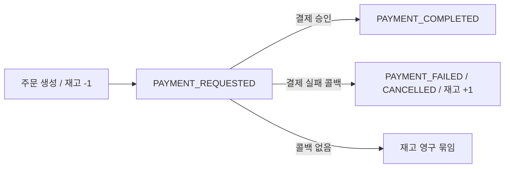
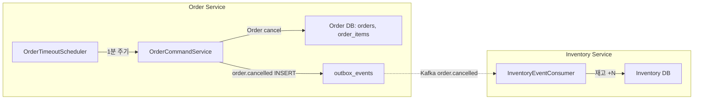

주문은 만들었는데 결제는 끝내지 않은 사용자가 있다. 결제 위젯을 열어둔 채 탭을 닫았을 수도 있고, 결제 도중 카드사 인증에서 막혔을 수도 있다. 문제는 이 미완료 주문이 살아 있는 동안 재고가 묶여 있다는 점이다. 4편에서 본 "전략 A — 주문 생성 시점에 재고를 즉시 차감"을 선택한 순간부터, "그러면 결제를 안 끝낸 주문의 재고는 누가 풀어주는가"라는 질문이 따라붙는다. 그 답이 이번 글의 주제, 결제 타임아웃 스케줄러다.

이 글에서 사용하는 용어는 다음 뜻으로 읽으면 된다.

| 용어                       | 이 글에서의 의미                                                                       |
| ------------------------ | ------------------------------------------------------------------------------ |
| 결제 타임아웃                  | 주문이 `PAYMENT_REQUESTED` 상태로 진입한 후 일정 시간(PeekCart 기준 15분) 내 결제가 끝나지 않은 상태       |
| 재고 묶임(stock holding)     | 차감은 되었으나 아직 매출로 확정되지 않은 재고. 결제 완료 또는 취소까지의 임시 점유 상태                            |
| `@Scheduled(fixedDelay)` | 이전 실행이 끝난 시점을 기준으로 다음 실행까지의 간격. `fixedRate`(시작 시점 기준)와 다름                      |
| 건별 독립 트랜잭션               | 여러 건을 한 번에 처리할 때 각 건마다 자기만의 트랜잭션 경계를 두는 방식. Spring에서 `REQUIRES_NEW`로 구현        |
| 상태 경합(state race)        | 스케줄러가 조회한 주문이, 처리 직전에 다른 흐름(예: 결제 콜백)에 의해 상태가 바뀌어 있는 상황                        |
| ShedLock                 | 다중 인스턴스 환경에서 같은 스케줄러가 동시에 여러 곳에서 돌지 않도록 DB 락으로 단일 실행을 보장하는 라이브러리 (Phase 2 도입) |

이번 학습에서 확인하고 싶은 질문은 다음과 같다.

1. 왜 결제 실패와 결제 타임아웃을 같은 "취소" 흐름으로 묶으면 안 되는가?
2. 만료 주문을 한 트랜잭션에 묶어 한꺼번에 처리하면 무엇이 문제인가?
3. `REQUIRES_NEW` 건별 트랜잭션과 `try-catch` 실패 격리는 각각 무엇을 막아주는가?
4. `findByStatusAndOrderedAtBefore`의 인덱스와 JOIN FETCH는 어떤 비용을 줄이는가?
5. 단일 Pod에서는 잘 돌던 이 스케줄러가, 다중 Pod에서는 왜 새로운 문제를 만드는가?

---

## 문제 상황: 결제하지 않은 주문이 점유한 재고

4편에서 정리한 주문 생성 트랜잭션을 다시 떠올려보자. 한 트랜잭션 안에서 (a) `Order` 저장, (b) `Inventory.decrease()` 호출, (c) Outbox 이벤트 저장이 한꺼번에 일어난다. 트랜잭션이 커밋되는 순간 재고는 이미 빠져 있고, 주문 상태는 `PAYMENT_REQUESTED`로 진입한다. 이후 사용자가 Toss 결제 위젯에서 승인을 누르면 결제 콜백이 와서 `PAYMENT_COMPLETED`로 전이되고, 실패하면 `PAYMENT_FAILED → CANCELLED`로 떨어지면서 재고가 복구된다(5편).

문제는 사용자가 위젯을 열어두고 아무 행동도 하지 않는 경우다. 결제 콜백이 영원히 오지 않으면 주문은 `PAYMENT_REQUESTED` 상태로 박제되고, 그 주문이 차감한 재고는 절대 풀리지 않는다. 인기 상품이라면 단 한 명의 망설이는 사용자가 다른 100명의 구매 가능 여부를 막을 수 있다.



이 빈자리를 채우는 것이 결제 타임아웃 스케줄러다. Toss Payments의 결제창 세션이 15분이라는 점에 맞춰, 같은 15분을 컷오프로 잡고 그 이상 머무른 주문을 자동 취소한다.

---

## OrderTimeoutScheduler

```java
@Component
@RequiredArgsConstructor
@Slf4j
public class OrderTimeoutScheduler {

    private final OrderRepository orderRepository;
    private final OrderCommandService orderCommandService;

    @Scheduled(fixedDelay = 60_000)
    @SchedulerLock(name = "orderTimeoutCancelJob", lockAtMostFor = "PT10M", lockAtLeastFor = "PT30S")
    public void cancelExpiredOrders() {
        LocalDateTime cutoff = LocalDateTime.now().minusMinutes(15);
        List<Order> expiredOrders = orderRepository.findByStatusAndOrderedAtBefore(
                OrderStatus.PAYMENT_REQUESTED, cutoff);

        for (Order order : expiredOrders) {
            cancelSafely(order.getId(), order.getOrderNumber());
        }
    }

    private void cancelSafely(Long orderId, String orderNumber) {
        try {
            orderCommandService.cancelExpiredOrder(orderId);
            log.info("타임아웃 주문 취소: orderId={}, orderNumber={}", orderId, orderNumber);
        } catch (OrderException e) {
            log.warn("타임아웃 주문 취소 스킵 (상태 경합): orderId={}, reason={}", orderId, e.getMessage());
        } catch (Exception e) {
            log.error("타임아웃 주문 취소 실패: orderId={}", orderId, e);
        }
    }
}
```

이 클래스가 가진 책임은 세 가지로 정리된다.

1. **시간 컷오프 결정**: "지금으로부터 15분 이전에 시작된 `PAYMENT_REQUESTED`"를 찾는다.
2. **건별 위임**: 찾은 주문을 하나씩 `OrderCommandService.cancelExpiredOrder()`로 넘긴다.
3. **실패 격리**: 한 건이 실패해도 나머지 건은 계속 처리한다.

스케줄러는 "재고 복구"나 "이벤트 발행" 같은 비즈니스 로직을 직접 가지지 않는다. 그 책임은 `OrderCommandService.cancelExpiredOrder()`로 위임되어 있다. 스케줄러는 "주기적으로 깨워서 후보를 찾는 트리거"의 역할만 한다. 4-Layered 관점에서 infrastructure에 위치하는 것이 자연스러운 이유다.

---

## 결제 실패와 결제 타임아웃은 같은 취소인가

겉으로 보면 둘 다 "주문을 `CANCELLED`로 만들고 재고를 복구한다"는 같은 일을 한다. 4편/5편을 따라온 입장에서 보면 5편의 `payment.failed` 흐름을 그대로 재활용해도 되지 않을까 싶다. 그런데 PeekCart는 굳이 별도의 진입점(`cancelExpiredOrder`)을 두었다. 차이를 정리해보면 왜 분리했는지가 드러난다.

| 측면       | 결제 실패 (5편)                    | 결제 타임아웃 (7편)               |
| -------- | ----------------------------- | -------------------------- |
| 트리거      | Toss 결제 콜백 또는 사용자 명시적 실패      | 스케줄러가 깨어났을 때               |
| 트리거 시점   | 결제 시도 직후 (수초~수분)              | 주문 시작 15분 후, 그리고 그 이후 계속   |
| 컨텍스트     | 결제 요청 ID, 실패 사유 코드 등 외부에서 들어옴 | 외부 컨텍스트 없음. "오래됐다"는 사실만 있음 |
| 단건 vs 배치 | 단건 (한 결제 = 한 주문)              | 배치 (여러 만료 주문을 한 번에 발견)     |
| 실패 시 사용자 | 사용자가 화면에서 응답을 기다리고 있음         | 사용자 부재. 스케줄러만 결과를 봄        |
| 트랜잭션 경계  | 결제 요청 흐름의 일부 (자연스러운 단일 트랜잭션)  | 건별 독립 트랜잭션이 강제됨            |

특히 마지막 두 줄이 분리의 본질이다. 결제 실패는 "이 한 건"의 동기 흐름이라 트랜잭션 경계가 명확하다. 반면 타임아웃은 "여러 건"이 한 번에 후보가 되고, 한 건 실패가 다른 건에 영향을 주면 안 된다. 같은 메서드 시그니처로 둘을 묶었다면 이 차이를 흡수하기 위해 매번 분기 처리를 해야 했을 것이다.

분리해서 얻는 또 다른 효과는 로깅과 메트릭이다. "결제 실패로 취소된 주문"과 "타임아웃으로 취소된 주문"은 운영 관점에서 의미가 다르다. 전자는 결제 시스템의 문제 신호이고, 후자는 사용자 이탈 신호다.

---

## cancelExpiredOrder: REQUIRES_NEW 건별 트랜잭션

`OrderCommandService.cancelExpiredOrder(Long)`는 이렇게 생겼다.

```java
@Transactional(propagation = Propagation.REQUIRES_NEW)
public void cancelExpiredOrder(Long orderId) {
    MDC.put("orderId", orderId.toString());
    Order order = orderRepository.findById(orderId)
            .orElseThrow(() -> new OrderException(ErrorCode.ORD_001));

    order.cancel();

    for (var item : order.getOrderItems()) {
        productPort.restoreStock(item.getProductId(), item.getQuantity());
    }

    outboxEventPublisher.publishOrderCancelled(order);
}
```

핵심은 `Propagation.REQUIRES_NEW`. 호출자(`OrderTimeoutScheduler.cancelSafely`)에서 트랜잭션이 열려 있든 없든, 이 메서드는 항상 새 트랜잭션을 시작한다.

만약 이걸 `REQUIRES_NEW` 없이 단일 트랜잭션으로 묶었다면 어떻게 되었을까? 시나리오를 그려보자.

```
스케줄러 트랜잭션 1개 안에서:
  - 주문 A 취소: 성공 (재고 복구, Outbox 저장)
  - 주문 B 취소: 성공 (재고 복구, Outbox 저장)
  - 주문 C 취소: 실패 → RuntimeException

결과: 트랜잭션 전체 롤백
      → 주문 A, B 의 취소도 같이 사라짐
      → 다음 1분 뒤 스케줄러가 깨어나 A, B, C 를 다시 후보로 봄
      → 또 C 에서 실패하면 또 전체 롤백 (무한 루프)
```

100건 중 99건이 멀쩡한데 1건의 데이터 이상 때문에 99건이 한 시간째 못 풀리는 상황이 가능하다. `REQUIRES_NEW`는 이 시나리오를 차단한다. C의 실패는 C의 트랜잭션만 롤백시키고, A와 B의 커밋된 상태는 안전하게 남는다.

부가 효과 하나 — `MDC.put("orderId", ...)`. 로그 라인마다 `orderId`가 자동으로 따라붙는다. 1분 주기로 깨어나는 스케줄러가 같은 시간대에 여러 주문을 처리할 때, 어느 로그가 어느 주문에 대한 것인지 추적하려면 이런 컨텍스트 키가 필요하다. 15편(관측성)에서 다룰 `MdcFilter`와 동일한 흐름이며, Phase 3 분산 추적의 토대다.

---

## 그래도 try-catch가 필요한 이유

`REQUIRES_NEW`가 트랜잭션 격리는 해결하지만, 예외 전파까지 막아주지는 않는다. C 트랜잭션이 롤백되면서 던진 예외는 호출자(스케줄러)로 전달되고, 스케줄러가 그걸 받아주지 않으면 `for` 루프가 중간에 깨진다. C 이후의 D, E, F가 처리되지 않은 채 다음 주기를 기다리게 된다.

그래서 `cancelSafely`는 두 단계로 잡는다.

```java
private void cancelSafely(Long orderId, String orderNumber) {
    try {
        orderCommandService.cancelExpiredOrder(orderId);
        log.info("타임아웃 주문 취소: orderId={}, orderNumber={}", orderId, orderNumber);
    } catch (OrderException e) {
        log.warn("타임아웃 주문 취소 스킵 (상태 경합): orderId={}, reason={}", orderId, e.getMessage());
    } catch (Exception e) {
        log.error("타임아웃 주문 취소 실패: orderId={}", orderId, e);
    }
}
```

`OrderException`을 별도 `catch`로 분리한 이유는 단위 테스트에서 명시적으로 검증한다.

```java
@Test
@DisplayName("상태 경합(OrderException)이 발생해도 나머지는 처리된다")
void cancelExpiredOrders_orderExceptionSkipsAndContinues() {
    // order1 처리 시 ORD-003 (잘못된 상태 전이) 발생
    willThrow(new OrderException(ErrorCode.ORD_003))
        .given(orderCommandService).cancelExpiredOrder(order1.getId());

    orderTimeoutScheduler.cancelExpiredOrders();

    // order2 는 정상 처리됨
    then(orderCommandService).should(times(1)).cancelExpiredOrder(order2.getId());
}
```

상태 경합(state race)이란 이런 상황이다. 스케줄러가 `findByStatusAndOrderedAtBefore`로 주문 A를 가져온 그 찰나에, Toss로부터 늦은 결제 콜백이 도착해서 A의 상태가 `PAYMENT_COMPLETED`로 이미 바뀌어 있다. 스케줄러가 `order.cancel()`을 호출하면 `Order.cancel()` 내부의 상태 전이 가드(4편에서 다룬 상태 전이도)가 `OrderException(ORD_003)`을 던진다. 이건 **버그가 아니라 정상 동작**이다. 결제는 이미 끝났으므로 취소하면 안 된다.

`WARN` 로그로 떨어뜨리고 다음 주문으로 넘어가는 게 정답이다. 그래서 `OrderException`은 `ERROR`가 아니라 `WARN`이고, 두 번째 `catch`(예상치 못한 예외)는 `ERROR`다. 같은 try-catch 안에서 로그 레벨을 분리하는 작은 결정에 "정상 동작인가 / 진짜 장애인가"를 가르는 운영 의도가 들어있다.

---

## findByStatusAndOrderedAtBefore: 인덱스와 JOIN FETCH

스케줄러가 1분마다 실행한다는 건, 이 쿼리가 1분마다 한 번씩 돌아간다는 뜻이다. 그리고 `orders` 테이블은 운영 환경에서 가장 빠르게 부푸는 테이블 중 하나다. 인덱스가 없으면 풀스캔으로 시작된다.

```java
@Query("SELECT o FROM Order o JOIN FETCH o.orderItems " +
       "WHERE o.status = :status AND o.orderedAt < :cutoff")
List<Order> findByStatusAndOrderedAtBefore(
        @Param("status") OrderStatus status,
        @Param("cutoff") LocalDateTime cutoff);
```

대응하는 인덱스는 `V1__init_schema.sql`에 함께 박혀 있다.

```sql
KEY idx_orders_status_ordered_at (status, ordered_at),
```

복합 인덱스의 컬럼 순서가 `(status, ordered_at)`이지 `(ordered_at, status)`가 아니라는 점에 의도가 있다. `status`는 카디널리티가 낮지만(8개 enum 값) 가장 선택적으로 좁혀준다. 전체 주문의 대부분은 `PAYMENT_COMPLETED` 이후 상태이고, `PAYMENT_REQUESTED`만 골라내면 후보 집합이 급격히 줄어든다. 그 뒤에 `ordered_at < cutoff`로 범위 스캔을 하면 인덱스 트리 한쪽 끝만 훑으면 된다.

JOIN FETCH는 N+1 회피용이다. `Order` 한 건당 `OrderItem`이 평균 N개 있는데, JOIN FETCH 없이 `for (var item : order.getOrderItems())`를 돌리면 주문 수 × 1번의 추가 쿼리가 발생한다. 만료 주문이 100건이면 101개의 SELECT가 나간다. JOIN FETCH로 1개로 압축한다.

> JOIN FETCH는 페이징과 함께 쓰면 메모리에서 페이징하는 함정이 있지만, 이 쿼리는 페이징이 없다. "지금까지 만료된 모든 주문"을 한 번에 가져온다. 컷오프가 15분이고 1분 주기라 정상 운영 시 한 번에 누적되는 건수가 많지 않다는 가정에 기댄 선택이다. 운영 부하가 커지면 LIMIT을 두는 페이지네이션이 필요해질 수 있다.

---

## 단일 인스턴스 가정과 그것이 깨질 때

지금까지 본 코드는 단일 JVM, 단일 Pod 환경에서 완벽하게 동작한다. 1분마다 한 번 깨어나고, 만료 주문을 모아서 건별로 안전하게 취소하고, 다음 주기를 기다린다.

문제는 Phase 3에서 HPA로 Pod이 1→3으로 늘어나는 순간 발생한다. 같은 `@Scheduled` 메서드가 세 Pod에서 동시에 깨어난다. 세 Pod이 같은 쿼리로 같은 만료 주문 목록을 가져오고, 같은 주문에 대해 동시에 `cancelExpiredOrder()`를 호출한다.

이 상황에서 무엇이 잘못될 수 있는가? 두 가지 안전장치가 이미 들어있다.

- **재고 복구의 동시성**: `productPort.restoreStock()`은 내부적으로 `@Version` 낙관적 락 또는 행 단위 락으로 보호된다. 같은 재고가 동시에 +1 두 번 되는 일은 없다.
- **상태 전이 가드**: `Order.cancel()`은 현재 상태에서 `CANCELLED`로의 전이가 허용되어 있을 때만 통과한다. 첫 Pod이 `CANCELLED`로 바꿔놓으면, 두 번째 Pod의 호출은 `OrderException(ORD-002 "이미 취소된 주문입니다.")`로 막힌다. 결제 콜백이 먼저 도착해 `PAYMENT_COMPLETED`로 전이된 경우라면 `ORD-003 "유효하지 않은 주문 상태 전이입니다."`가 던져진다.

그러니까 데이터 정합성은 무너지지 않는다. 다만 비효율은 남는다. 세 Pod이 같은 일을 시도하고 두 Pod이 예외를 받아 `WARN` 로그를 찍는다. 1분마다 같은 노이즈가 쌓이고, 만료 주문 100건이면 200개의 불필요한 트랜잭션 시도(SELECT + 상태 검증)가 추가된다. 두 번째 Pod은 `Order.cancel()` 단계에서 막혀 `restoreStock()`이나 Outbox 발행까지 도달하지 않으므로 재고/이벤트 측 정합성은 안전하지만, Pod 수에 비례해 늘어나는 헛스윙 자체가 운영상의 잡음이 된다.

깨지지는 않지만 깨끗하지도 않다. 그래서 Phase 2의 12편에서 다룰 ShedLock이 등장한다. 코드 위쪽에 이미 보였던 한 줄이 그것이다.

```java
@SchedulerLock(name = "orderTimeoutCancelJob",
               lockAtMostFor = "PT10M", lockAtLeastFor = "PT30S")
```

ShedLock은 DB의 `shedlock` 테이블에 락 행을 INSERT/UPDATE해서 "지금 이 작업은 한 인스턴스만 들고 있다"는 사실을 보장한다. `lockAtMostFor`는 그 인스턴스가 죽었을 때 락이 풀리는 최대 시간이고, `lockAtLeastFor`는 작업이 빨리 끝나더라도 최소한 이 시간 동안은 다른 인스턴스가 다시 잡지 못하게 막아준다. 후자가 왜 필요한지는 이후 깊이 다룬다.

여기서 짚을 점은 시간 순서다. **이 스케줄러는 Phase 1에서 ShedLock 없이 먼저 도입되었고, Phase 2에서 ShedLock이 덧붙여졌다**(2026-03-26 Task 1-7, 그 뒤 Phase 2의 Task 2-6). 다시 말해 코드 한 줄(`@SchedulerLock`)을 추가하는 작업이 Phase 2의 별도 태스크였다. 단일 인스턴스에서는 ShedLock이 노옵이라 동작에 차이가 없지만, Phase 3 분산 환경에 진입할 때 추가 비용 없이 그대로 살아남으려는 의도다.

---

## 한계와 트레이드오프

### 컷오프 시점이 코드에 박혀 있다

```java
LocalDateTime cutoff = LocalDateTime.now().minusMinutes(15);
```

15분이라는 숫자가 메서드 안에 리터럴로 들어있다. Toss Payments의 세션 만료 시간을 기준으로 잡았지만, 결제 PSP를 바꾸거나 결제 수단별로 다른 타임아웃을 두고 싶어지면 이 값을 외부화해야 한다. 현재 범위에서는 yet-not-needed로 두는 게 맞지만, "어떤 값이 외부 시스템의 계약에 묶여 있는가"는 ADR 한 줄로라도 남겨둘 가치가 있다.

### 60초 주기의 의미

`fixedDelay = 60_000`은 "이전 실행이 끝난 시점으로부터 60초 후"다. 만료 주문이 많아서 한 사이클이 3분 걸렸다면, 다음 사이클은 그로부터 60초 뒤다. `fixedRate`를 썼다면 시작 시점 기준이라 사이클이 겹칠 수 있고, 단일 인스턴스에서 같은 메서드가 중첩 실행되는 상황을 막기 위해서라도 `fixedDelay`가 안전하다.

15분 컷오프와 60초 주기 사이의 관계도 짚을 만하다. 사용자 입장에서 보면 결제 위젯을 닫은 시점부터 실제 취소까지의 지연이 최대 15분 59초가 된다. 사용자 경험상으로는 충분히 빠르고, DB 부하 측면에서 보면 60초마다 한 번씩만 쿼리하므로 가벼운 편이다. 만약 컷오프를 1분으로 줄이면(예: 외부 마켓에서 카운트다운 결제) 주기도 비례해서 짧아져야 한다.

### "왜 안 취소됐는가"의 가시성

타임아웃 취소가 `OrderException`으로 스킵된 경우 `WARN` 로그만 남는다. 운영자가 "이 주문은 왜 30분이 지나도 PAYMENT_REQUESTED인가"를 추적하려면 로그를 뒤져야 한다. Phase 3의 메트릭(15편) 관점에서 보면 `scheduler.skip.count` 같은 카운터가 있어도 좋다. 현재는 운영 규모상 로그로 충분하지만, 분산 환경 + 다중 도메인 스케줄러가 늘어나면 메트릭 표면이 필요해질 영역이다.

### 의도적으로 안 한 것

- **사용자 통보**: 자동 취소된 사용자에게 "결제가 완료되지 않아 주문이 취소되었습니다" 같은 알림 발송. 현재는 `order.cancelled` 이벤트만 Outbox로 발행하고 알림 도메인이 그걸 받아 Slack으로 보내지만, 사용자 직접 통보 채널(SMS/이메일)은 미구현.
- **재시도 결제 유도**: 만료 직전 "결제를 마저 진행하시겠습니까?" 같은 푸시. 결제 이탈률을 줄이는 흔한 패턴이지만 현재 범위 외.
- **컷오프 시간 사용자/상품별 차등**: 모든 주문이 일률적으로 15분.

---

## 통합 테스트로 검증된 것

`OrderTimeoutSchedulerTest`는 4건의 단위 테스트로 동작을 박제한다.

1. 만료 주문 2건이 있으면 각각 `cancelExpiredOrder`가 한 번씩 호출된다.
2. 만료 주문이 없으면 `cancelExpiredOrder`가 호출되지 않는다.
3. 첫 번째 주문이 `RuntimeException`을 던져도 두 번째는 정상 처리된다 (예상치 못한 장애 격리).
4. 첫 번째 주문이 `OrderException`을 던져도 두 번째는 정상 처리된다 (상태 경합 격리).

(3)과 (4)가 같은 형태의 테스트지만 별도로 분리되어 있다는 점이 중요하다. 같은 try-catch라도 분기 두 개를 각각 검증한다는 뜻이다. 추후 누가 "어차피 같은 catch니까 통합하자"고 리팩토링하려고 할 때, 이 테스트가 "두 분기는 의도적으로 다르다"는 시그널을 준다.

서비스 측에서는 `OrderCommandServiceTest`에 `cancelExpiredOrder` 성공/주문 미존재(ORD-001) 2건이 추가되어 있어, 스케줄러 → 서비스 → 도메인의 호출 사슬이 한 단위씩 끊어서 검증된다.

---

## 자료는 어떤 질문에 연결해서 읽을까

| 질문                                  | 같이 읽을 자료                                                                                | 이 글에서 연결되는 지점                  |
| ----------------------------------- | -------------------------------------------------------------------------------------- | ----------------------------- |
| Spring `@Scheduled`의 fixedDelay와 fixedRate, cron의 차이는? | Spring Framework 공식 문서, [Task Execution and Scheduling](https://docs.spring.io/spring-framework/reference/integration/scheduling.html) | 60초 주기 선택의 의미                 |
| `Propagation.REQUIRES_NEW`는 정확히 어떻게 동작하는가?                | Spring Framework 공식 문서, [Transaction Propagation](https://docs.spring.io/spring-framework/reference/data-access/transaction/declarative/tx-propagation.html) | 건별 독립 트랜잭션 절                  |
| 결제 PSP의 세션 만료 정책은 어떻게 설계되는가?           | Toss Payments 개발자 문서, [결제 위젯 가이드](https://docs.tosspayments.com/guides/v2/payment-widget/integration) | 15분 컷오프의 근거                   |
| 배치 작업의 "건별 격리" 패턴은 어떤 책에서 다루는가?      | Robert C. Martin, *Clean Code* — Error Handling 장 / Spring Batch 공식 문서의 skip/retry 정책 | `cancelSafely`의 try-catch 구조  |
| 다중 인스턴스 스케줄러 락 패턴 비교 (DB / Redis / ZooKeeper)? | ShedLock 공식 README, [Distributed Lock Comparison](https://github.com/lukas-krecan/ShedLock) | "단일 인스턴스 가정과 그것이 깨질 때" 절       |
| 복합 인덱스 컬럼 순서 결정 기준?                  | High Performance MySQL (Schwartz et al.) — Indexing for High Performance 장            | `idx_orders_status_ordered_at`의 컬럼 순서 |

---

## Phase 4 MSA에서는 어떻게 바뀌는가

타임아웃 스케줄러는 Phase 4에서 가장 자연스럽게 Order Service로 이동한다. 핵심 데이터(`orders.status`, `orders.ordered_at`)가 Order Service의 DB로 떨어지고, 스케줄러는 그 DB를 1분마다 폴링하면 된다.



**그대로 가는 것**

- `OrderTimeoutScheduler`와 `cancelExpiredOrder()`의 흐름은 거의 그대로 옮긴다. 컷오프 결정 → 후보 조회 → 건별 위임 → 실패 격리.
- `REQUIRES_NEW` + try-catch 패턴, 그리고 그 의미는 변하지 않는다. 오히려 서비스가 분리되면서 한 인스턴스의 트랜잭션 경계가 더 명확해진다.
- ShedLock은 Phase 4에서도 그대로 유효하다. Order Service가 여러 Pod으로 뜨는 한 같은 문제가 남는다.

**바뀌는 것**

- 재고 복구가 **동기 메서드 호출에서 비동기 이벤트로** 전환된다. 현재는 `productPort.restoreStock()`이 같은 트랜잭션 안에서 직접 호출되지만, 서비스 분리 후에는 `OrderCancelledEvent`를 Outbox에 박고 Kafka로 Inventory Service에 알리는 형태가 된다. 4편/5편에서 결제 실패 시 재고 복구가 보상 트랜잭션(Saga) 단계로 바뀌는 흐름과 정확히 같다.
- 이 비동기화는 "취소 발생 → 재고 실제 복구"까지의 지연을 만든다. 사용자 입장에서는 보이지 않지만, 운영 모니터링에서는 `order.cancelled` Kafka Lag을 보고 있어야 재고가 제때 풀리고 있는지 확인할 수 있다.
- Order Service가 더 이상 `Inventory`의 데이터 모델을 알지 않는다. `OrderItem.productId`와 수량만 이벤트에 실어 보내면, 재고를 어떻게 풀지는 Inventory Service의 책임이 된다.

**그래서 Phase 4 진입 전 짚을 점**

- 스케줄러 자체는 분리하기 쉽다. 의존하는 외부 도메인이 사실상 재고(Inventory)뿐이고, 그 호출은 이벤트로 대체 가능하다.
- 주의해야 할 부분은 **타임아웃 컷오프의 일관성**이다. Order Service의 컷오프(15분)와 Payment Service가 들고 있는 결제 세션 타임아웃이 어긋나면, "결제 세션은 살아있는데 주문은 이미 취소됨" 또는 그 반대의 상태가 만들어질 수 있다. 분리 후에는 두 서비스가 공유하는 계약 상수로 끌어내거나 ADR로 박제할 필요가 있다.
