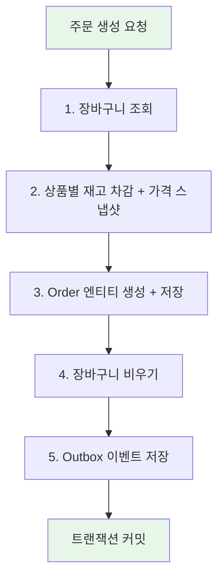
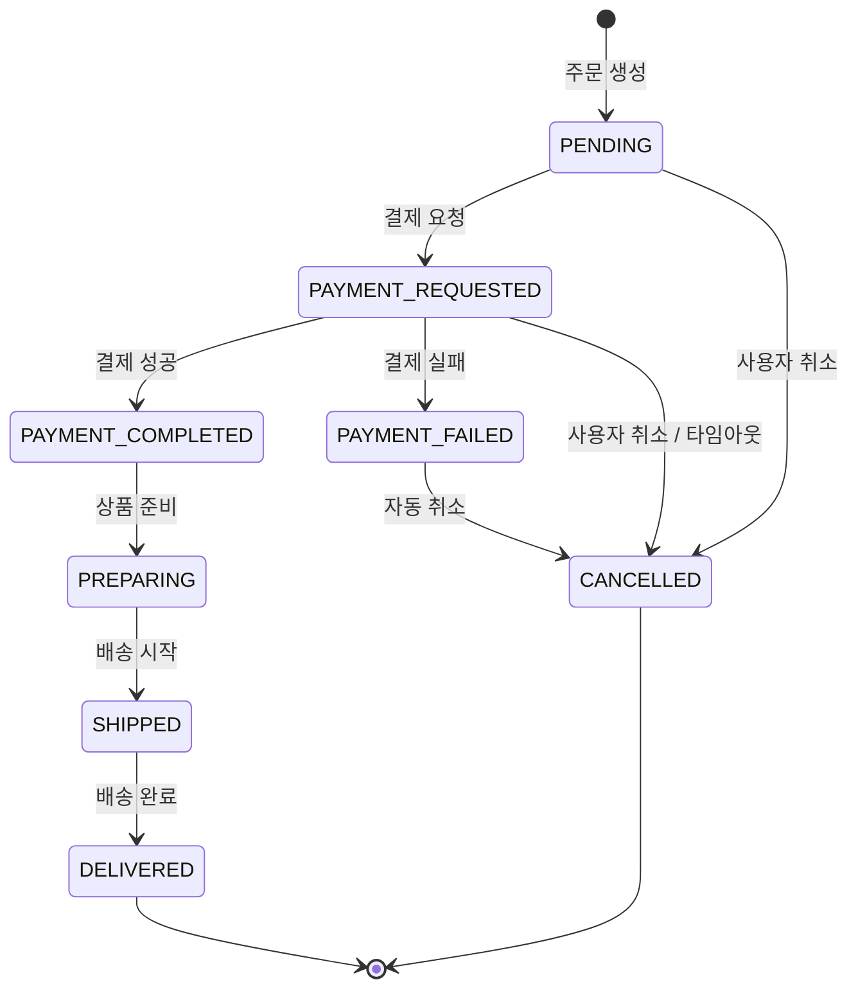
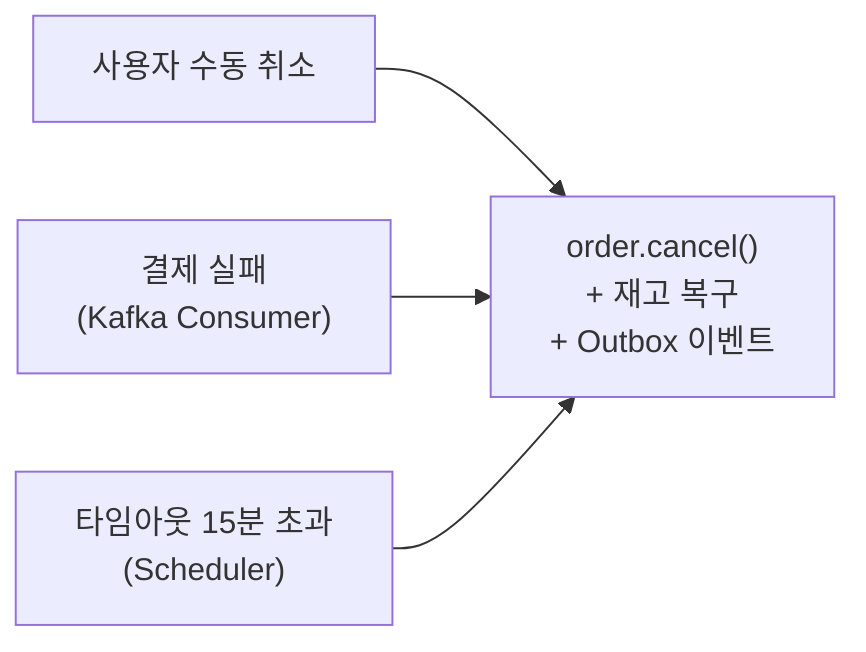
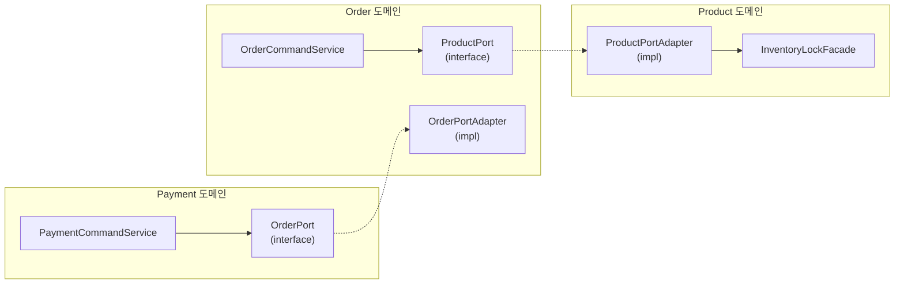
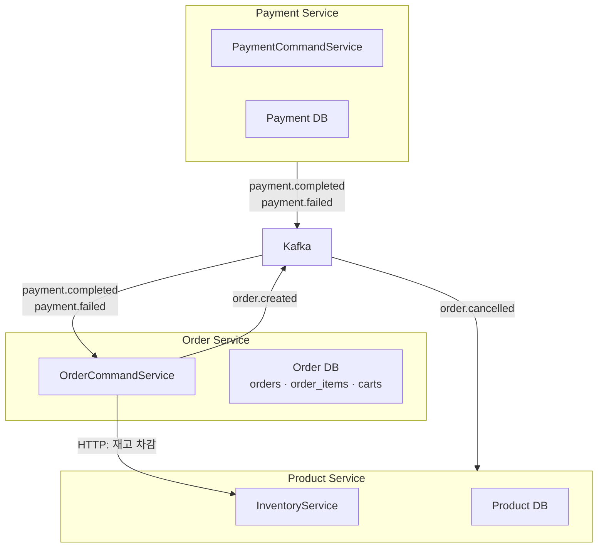

주문은 단순한 INSERT가 아니다. 장바구니에서 아이템을 꺼내고, 각 상품의 재고를 차감하면서 주문 시점 가격을 스냅샷으로 저장하고, 주문을 생성하고, 장바구니를 비우고, 후속 처리를 위한 이벤트를 저장한다. 이 모든 것이 하나의 트랜잭션 안에서 일어나야 한다. 한 단계라도 실패하면 전부 롤백되어야 하기 때문이다.

그리고 주문이 생성된 이후에도 이야기는 끝나지 않는다. 결제 요청, 결제 성공, 결제 실패, 배송 준비, 배송 완료, 취소. 주문 상태는 여러 갈래로 전이하고, 어떤 상태에서는 취소가 가능하고 어떤 상태에서는 불가능하다. 이 전이 규칙을 누가 갖고 있느냐에 따라 코드의 유지보수성이 크게 달라진다.

이 글에서 사용하는 용어는 다음 뜻으로 읽으면 된다.

| 용어                                 | 이 글에서의 의미                                                 |
| ---------------------------------- | --------------------------------------------------------- |
| 애그리거트 (Aggregate)                  | 하나의 트랜잭션으로 일관성을 보장하는 엔티티 묶음. Order가 OrderItem을 포함하는 것이 예시 |
| 상태 전이 (State Transition)           | 주문 상태가 한 값에서 다른 값으로 바뀌는 것. 모든 전이가 허용되지는 않는다               |
| 스냅샷 (Snapshot)                     | 특정 시점의 값을 복사해 보존하는 것. 주문 시점의 상품 가격을 저장하는 것이 예시            |
| 보상 트랜잭션 (Compensating Transaction) | 이미 커밋된 변경을 되돌리기 위한 별도 트랜잭션. 결제 실패 시 재고를 복구하는 것이 예시        |
| Outbox 이벤트                         | DB 트랜잭션과 함께 저장되어 이벤트 유실을 방지하는 패턴. 10편에서 상세히 다룰 예정         |

이번 학습에서 확인하고 싶은 질문은 다음과 같다.

1. 장바구니에서 주문까지의 전체 흐름은 어떻게 이어지는가?
2. 주문 생성 트랜잭션 안에서 어떤 일이 함께 일어나는가?
3. 주문 시점 가격 스냅샷은 왜 필요한가?
4. 주문 상태 전이 규칙은 어디에 있어야 유지보수하기 쉬운가?
5. 주문 취소에는 몇 가지 경로가 있고, 각각 어떻게 다른가?
6. 결제 타임아웃은 어떻게 처리하는가?
7. Phase 4 MSA에서 Order Service의 경계는 어떻게 바뀌는가?

---

## 장바구니: 주문의 출발점

주문 생성은 장바구니에서 시작한다. 사용자가 상품을 장바구니에 담고, 수량을 조정하고, 주문 버튼을 누르면 장바구니 내용이 주문으로 변환된다.

### Cart 애그리거트

```java
@Entity
@Table(name = "carts")
public class Cart extends BaseTimeEntity {

    @Id
    @GeneratedValue(strategy = GenerationType.IDENTITY)
    private Long id;

    @Column(name = "user_id", nullable = false)
    private Long userId;

    @OneToMany(mappedBy = "cart", cascade = CascadeType.ALL, orphanRemoval = true)
    private List<CartItem> items = new ArrayList<>();

    public void addItem(Long productId, int quantity) {
        items.stream()
                .filter(item -> item.getProductId().equals(productId))
                .findFirst()
                .ifPresentOrElse(
                        item -> item.addQuantity(quantity),
                        () -> items.add(CartItem.create(this, productId, quantity))
                );
    }

    public void clear() {
        items.clear();
    }

    public boolean isEmpty() {
        return items.isEmpty();
    }
}
```

`Cart`는 `CartItem`을 포함하는 애그리거트 루트다. 여기서 주목할 비즈니스 규칙이 하나 있다. `addItem()`은 동일 상품이 이미 장바구니에 있으면 수량을 합산하고, 없으면 새 항목을 추가한다. 이 판단이 Application Service가 아니라 `Cart` 엔티티 안에 있다.

```java
// CartTest.java
@Test
void addItem_existingProduct_mergesQuantity() {
    Cart cart = OrderFixture.cart();
    cart.addItem(10L, 2);
    cart.addItem(10L, 3);

    assertThat(cart.getItems()).hasSize(1);
    assertThat(cart.getItems().get(0).getQuantity()).isEqualTo(5);
}
```

장바구니에는 가격 정보가 없다. `cart_items`에는 `product_id`와 `quantity`만 있고, `unit_price`는 없다. 장바구니는 "무엇을 얼마나 담았는가"만 기억하고, "얼마인가"는 주문 시점에 Product 도메인에서 가져온다. 이 설계는 상품 가격이 변경되었을 때 장바구니에 stale 가격이 남지 않게 한다.

### CartCommandService: Application이 흐름을 조율한다

```java
@Service
@Transactional
@RequiredArgsConstructor
public class CartCommandService {

    private final CartRepository cartRepository;
    private final ProductPort productPort;

    public CartDetailDto addItem(Long userId, AddCartItemCommand command) {
        productPort.verifyProductExists(command.productId());

        Cart cart = cartRepository.findByUserId(userId)
                .orElseGet(() -> cartRepository.save(Cart.create(userId)));
        cart.addItem(command.productId(), command.quantity());
        return CartDetailDto.from(cart);
    }
}
```

장바구니에 상품을 담을 때 `productPort.verifyProductExists()`로 상품 존재 여부를 먼저 확인한다. 3편에서 본 `ProductPort`가 여기서도 도메인 간 경계를 만들고 있다. `CartCommandService`는 Product 엔티티를 직접 알지 못하고, "이 상품이 존재하는가?"라는 질문만 인터페이스를 통해 던진다.

장바구니가 없으면 자동으로 생성한다(`orElseGet`). 사용자가 처음 상품을 담을 때 별도로 "장바구니 생성" API를 호출할 필요가 없다.

---

## 주문 생성: 하나의 트랜잭션 안에서 일어나는 일

주문 생성은 Order 도메인에서 가장 복잡한 UseCase다. 하나의 트랜잭션 안에서 다섯 가지 일이 일어난다.



### OrderCommandService.createOrder()

```java
@Service
@Transactional
@RequiredArgsConstructor
public class OrderCommandService {

    private final OrderRepository orderRepository;
    private final CartRepository cartRepository;
    private final ProductPort productPort;
    private final OrderOutboxEventPublisher outboxEventPublisher;

    public OrderDetailDto createOrder(Long userId, CreateOrderCommand command) {
        // 1. 장바구니 조회
        Cart cart = cartRepository.findByUserId(userId)
                .orElseThrow(() -> new OrderException(ErrorCode.ORD_006));

        if (cart.isEmpty()) {
            throw new OrderException(ErrorCode.ORD_004);
        }

        // 2. 상품별 재고 차감 + 가격 스냅샷
        List<OrderItemData> itemDataList = cart.getItems().stream()
                .map(cartItem -> {
                    long unitPrice = productPort.decreaseStockAndGetUnitPrice(
                            cartItem.getProductId(), cartItem.getQuantity());
                    return new OrderItemData(
                            cartItem.getProductId(), cartItem.getQuantity(), unitPrice);
                })
                .toList();

        // 3. Order 엔티티 생성 + 저장
        Order order = Order.create(
                userId, generateOrderNumber(),
                command.receiverName(), command.phone(),
                command.zipcode(), command.address(),
                itemDataList);
        orderRepository.save(order);

        // 4. 장바구니 비우기
        cart.clear();

        // 5. Outbox 이벤트 저장
        outboxEventPublisher.publishOrderCreated(order);

        return OrderDetailDto.from(order);
    }
}
```

각 단계를 하나씩 보겠다.

**1단계: 장바구니 조회와 검증.** 장바구니가 없거나 비어 있으면 주문을 만들 수 없다. 이 검증은 UseCase 흐름에 가깝기 때문에 Application Service에 있다.

**2단계: 재고 차감과 가격 스냅샷.** 장바구니의 각 아이템마다 `productPort.decreaseStockAndGetUnitPrice()`를 호출한다. Order 도메인은 이 메서드 뒤에서 재고를 어떤 락 전략으로 차감하는지 알지 않는다. 다만 호출 결과로 "재고 차감이 성공했다"는 사실과 주문 시점의 상품 가격을 함께 받는다.

여기서 중요한 것은 가격을 장바구니가 아니라 이 시점에 가져온다는 점이다. 사용자가 장바구니에 상품을 담은 지 3일이 지났다면 그 사이에 가격이 바뀌었을 수 있다. 주문 시점의 최신 가격을 가져와야 정확하다.

**3단계: Order 엔티티 생성.** `Order.create()`는 `OrderItemData` 리스트를 받아 `Order`와 `OrderItem`들을 한 번에 만든다. 총액은 엔티티 생성 시점에 아이템 소계의 합으로 계산된다.

**4단계: 장바구니 비우기.** 주문이 성공적으로 만들어졌으므로 장바구니를 비운다. `orphanRemoval = true`가 설정돼 있어 `clear()` 호출 시 DB에서도 `cart_items`가 삭제된다.

**5단계: Outbox 이벤트 저장.** `order.created` 이벤트를 `outbox_events` 테이블에 저장한다. 이 이벤트는 별도 폴링 스케줄러가 Kafka로 발행한다. DB 저장과 이벤트 저장이 같은 트랜잭션이므로, 주문은 저장됐는데 이벤트는 유실되는 상황이 방지된다. Outbox 패턴은 10편에서 상세히 다룰 예정이다.

이 다섯 단계가 모두 하나의 `@Transactional` 안에 있다. 2단계에서 재고 부족으로 예외가 발생하면 3~5단계는 실행되지 않는다. 재고 차감이 같은 트랜잭션에 참여하는 구조라면 이미 차감된 다른 상품의 재고도 롤백으로 함께 복원된다. 반대로 재고 차감을 별도 트랜잭션으로 분리한다면, 주문 저장 실패 시 보상 복구가 필요하다. 이 차이는 3편에서 본 락 범위와 트랜잭션 범위 문제와 연결된다.

---

## 주문 시점 가격 스냅샷은 왜 필요한가

`order_items` 테이블에는 `unit_price` 컬럼이 있다. 이 값은 주문 생성 시점에 Product에서 가져온 가격이 복사된 것이다.

```java
// OrderItem.java
@Column(name = "unit_price", nullable = false)
private long unitPrice;
```

왜 `product_id`만 저장하고 조회할 때 Product 테이블을 조인하지 않을까?

| 전략 | 동작 | 장점 | 단점 |
| --- | --- | --- | --- |
| FK 조인 | 주문 조회 시 `products.price`를 조인 | 항상 최신 가격 | 가격 변경 시 과거 주문 금액이 바뀜 |
| 스냅샷 저장 | 주문 시점 가격을 `order_items.unit_price`에 복사 | 과거 주문 금액 불변 | 저장 공간 약간 증가 |

이커머스에서 "주문 당시 10,000원에 샀는데, 가격이 8,000원으로 내려갔더니 주문 내역에도 8,000원으로 보인다"는 결함이 된다. 반대로 가격이 올라가면 사용자에게 더 많은 금액을 청구한 것처럼 보인다. 주문 시점의 가격을 스냅샷으로 보존하는 것이 비즈니스적으로 맞다.

이 패턴은 Phase 4에서도 중요해진다. MSA에서 Order Service와 Product Service가 별도 DB를 갖게 되면, FK 조인 자체가 불가능하다. 스냅샷이 이미 저장되어 있으므로 Order Service는 Product Service 없이도 주문 금액을 조회할 수 있다.

`cart_items`에는 가격 스냅샷이 없는 것과 대비된다. 장바구니는 "다음에 주문할 때 뭘 살지"를 기억하는 것이고, 가격은 주문하는 순간에 확정되어야 한다.

---

## Order 애그리거트: 생성 규칙

```java
@Entity
@Table(name = "orders")
public class Order {

    private Order(Long userId, String orderNumber, String receiverName, String phone,
                  String zipcode, String address, List<OrderItemData> itemDataList) {
        if (itemDataList == null || itemDataList.isEmpty()) {
            throw new OrderException(ErrorCode.ORD_004);
        }
        this.userId = userId;
        this.orderNumber = orderNumber;
        this.status = OrderStatus.PENDING;
        this.receiverName = receiverName;
        this.phone = phone;
        this.zipcode = zipcode;
        this.address = address;
        this.orderedAt = LocalDateTime.now();

        for (OrderItemData data : itemDataList) {
            this.orderItems.add(
                    new OrderItem(this, data.productId(), data.quantity(), data.unitPrice()));
        }
        this.totalAmount = this.orderItems.stream()
                .mapToLong(OrderItem::getSubtotal)
                .sum();
    }
}
```

`Order.create()`에서 일어나는 일을 정리하면 이렇다.

1. 아이템 목록이 비어 있으면 ORD-004 예외를 던진다.
2. 초기 상태를 `PENDING`으로 설정한다.
3. 각 `OrderItemData`로 `OrderItem`을 생성해 내부 리스트에 추가한다.
4. 총액을 `OrderItem.getSubtotal()`의 합으로 계산한다.

여기서 `OrderItemData`라는 record가 중간 전달 객체 역할을 한다.

```java
public record OrderItemData(Long productId, int quantity, long unitPrice) {}
```

이 record가 없으면 `Order.create()`가 `CartItem`이나 `ProductPort`를 직접 알아야 한다. `OrderItemData`가 있어서 Order 도메인은 "상품 ID, 수량, 단가"라는 순수한 값만 받고, 그 값이 어디서 왔는지는 모른다.

`OrderItem`의 생성자는 package-private이다.

```java
OrderItem(Order order, Long productId, int quantity, long unitPrice) {
    if (quantity < 1) throw new OrderException(ErrorCode.ORD_005);
    if (unitPrice < 0) throw new IllegalArgumentException("단가는 0 이상이어야 합니다.");
    this.order = order;
    this.productId = productId;
    this.quantity = quantity;
    this.unitPrice = unitPrice;
}
```

외부에서 `new OrderItem()`을 호출할 수 없다. `OrderItem`은 반드시 `Order.create()` 내부에서만 만들어진다. 이것이 Order를 애그리거트 루트로 만드는 장치다. 아이템이 주문 없이 독립적으로 존재하는 것은 비즈니스적으로 의미가 없기 때문이다.

---

## 주문 상태 전이: 규칙은 어디에 있어야 하는가

이 질문은 1편에서도 다뤘지만, 이번 글에서 더 깊이 들어간다. 실제 전이 규칙과 그것을 사용하는 코드를 함께 보겠다.

### 상태 전이도



8개 상태, 11개 전이. 터미널 상태는 `DELIVERED`와 `CANCELLED` 두 가지다.

### OrderStatus: enum이 전이 규칙을 갖는다

```java
public enum OrderStatus {

    PENDING {
        @Override
        public boolean canTransitionTo(OrderStatus target) {
            return target == PAYMENT_REQUESTED || target == CANCELLED;
        }
    },
    PAYMENT_REQUESTED {
        @Override
        public boolean canTransitionTo(OrderStatus target) {
            return target == PAYMENT_COMPLETED
                    || target == PAYMENT_FAILED
                    || target == CANCELLED;
        }
    },
    PAYMENT_COMPLETED {
        @Override
        public boolean canTransitionTo(OrderStatus target) {
            return target == PREPARING;
        }
    },
    PAYMENT_FAILED {
        @Override
        public boolean canTransitionTo(OrderStatus target) {
            return target == CANCELLED;
        }
    },
    // ... PREPARING, SHIPPED, DELIVERED, CANCELLED
    DELIVERED {
        @Override
        public boolean canTransitionTo(OrderStatus target) {
            return false;
        }
    },
    CANCELLED {
        @Override
        public boolean canTransitionTo(OrderStatus target) {
            return false;
        }
    };

    public abstract boolean canTransitionTo(OrderStatus target);
}
```

각 상태가 `canTransitionTo()`를 직접 구현한다. 이 설계의 장점은 전이 규칙이 흩어지지 않는다는 것이다. "PAYMENT_REQUESTED에서 어디로 갈 수 있는가?"라는 질문에 답하려면 `OrderStatus.PAYMENT_REQUESTED`만 보면 된다.

### 전이 규칙을 다른 곳에 둔다면?

| 위치 | 구현 방식 | 장점 | 단점 |
| --- | --- | --- | --- |
| enum 내부 (현재) | `canTransitionTo()` 추상 메서드 | 상태별 규칙이 응집, 간결 | 상태가 많아지면 enum이 비대 |
| 별도 Map/Table | `Map<OrderStatus, Set<OrderStatus>>` | 외부 설정 가능, 테스트 쉬움 | 규칙과 상태가 분리되어 추적 어려움 |
| State Machine 라이브러리 | Spring Statemachine 등 | 복잡한 전이/가드/액션 지원 | 학습 비용, 프레임워크 의존 |
| Application Service | `if-else`로 전이 판단 | 없음 | 여러 Service에 규칙이 흩어짐 |

PeekCart에서는 현재 8개 상태와 11개 전이 정도라 enum 내부가 가장 간결하다. 전이가 30개 이상으로 늘어나거나 전이 시 조건(가드)이 복잡해지면 State Machine이나 별도 정책 객체로 분리할 수 있다.

### Order.cancel()과 Order.transitionTo()

`Order`는 두 가지 상태 변경 메서드를 갖고 있다.

```java
public void cancel() {
    if (this.status == OrderStatus.CANCELLED) {
        throw new OrderException(ErrorCode.ORD_002);
    }
    if (!this.status.canTransitionTo(OrderStatus.CANCELLED)) {
        throw new OrderException(ErrorCode.ORD_003);
    }
    this.status = OrderStatus.CANCELLED;
}

public void transitionTo(OrderStatus target) {
    if (!this.status.canTransitionTo(target)) {
        throw new OrderException(ErrorCode.ORD_003);
    }
    this.status = target;
}
```

`cancel()`은 "이미 취소된 주문을 다시 취소"하는 경우(ORD-002)와 "취소 불가 상태에서 취소"하는 경우(ORD-003)를 구분해 다른 에러 코드를 던진다. `transitionTo()`는 범용적이라 어떤 상태로든 전이를 시도할 수 있지만, `canTransitionTo()`가 거부하면 ORD-003을 던진다.

1편에서 언급했던 것처럼, `transitionTo()`보다 도메인 언어에 가까운 메서드(`requestPayment()`, `completePayment()` 등)로 바꾸면 호출부의 의도가 더 명확해질 수 있다. 현재는 상태 전이가 단순하므로 `transitionTo()` + `cancel()`로 충분하지만, 개선 후보로 남겨둔다.

### 테스트: 모든 전이를 검증한다

```java
// OrderStatusTest.java
@Test
void pending_toPaymentRequested_allowed() {
    assertThat(OrderStatus.PENDING.canTransitionTo(OrderStatus.PAYMENT_REQUESTED))
            .isTrue();
}

@Test
void paymentCompleted_toCancelled_denied() {
    assertThat(OrderStatus.PAYMENT_COMPLETED.canTransitionTo(OrderStatus.CANCELLED))
            .isFalse();
}

@ParameterizedTest
@EnumSource(OrderStatus.class)
void delivered_isTerminal(OrderStatus target) {
    assertThat(OrderStatus.DELIVERED.canTransitionTo(target)).isFalse();
}

@ParameterizedTest
@EnumSource(OrderStatus.class)
void cancelled_isTerminal(OrderStatus target) {
    assertThat(OrderStatus.CANCELLED.canTransitionTo(target)).isFalse();
}
```

터미널 상태(`DELIVERED`, `CANCELLED`)는 `@ParameterizedTest`로 모든 상태에 대해 전이가 거부됨을 검증한다. 새 상태가 추가되더라도 이 테스트가 자동으로 커버한다.

---

## 주문 취소: 세 가지 경로

주문 취소는 하나의 결과(`CANCELLED`)에 도달하지만 경로가 세 가지다.



### 경로 1: 사용자 수동 취소

```java
// OrderCommandService.java
public void cancelOrder(Long userId, Long orderId) {
    Order order = orderRepository.findByIdAndUserId(orderId, userId)
            .orElseThrow(() -> new OrderException(ErrorCode.ORD_001));

    order.cancel();

    for (var item : order.getOrderItems()) {
        productPort.restoreStock(item.getProductId(), item.getQuantity());
    }

    outboxEventPublisher.publishOrderCancelled(order);
}
```

`findByIdAndUserId()`로 본인 주문만 취소할 수 있다. 2편에서 본 데이터 레벨 인가가 여기서도 적용된다. `order.cancel()`이 상태 전이 규칙을 확인하고, `productPort.restoreStock()`으로 재고를 복구하고, Outbox 이벤트를 저장한다.

### 경로 2: 결제 실패 (Kafka Consumer)

```java
// OrderEventConsumer.java
@KafkaListener(topics = "payment.failed", groupId = GROUP_PAYMENT_FAILED)
@Transactional
public void handlePaymentFailed(String message) {
    JsonNode root = kafkaMessageParser.parse(message);
    String eventId = root.get("eventId").asText();
    JsonNode payload = root.get("payload");

    idempotencyChecker.executeIfNew(eventId, GROUP_PAYMENT_FAILED, () -> {
        Long orderId = payload.get("orderId").asLong();
        Order order = orderRepository.findById(orderId)
                .orElseThrow(() -> new OrderException(ErrorCode.ORD_001));
        order.cancel();
        for (var item : order.getOrderItems()) {
            productPort.restoreStock(item.getProductId(), item.getQuantity());
        }
    });
}
```

Payment 도메인이 결제 실패 이벤트를 Kafka로 발행하면, Order의 Consumer가 이를 소비해 주문을 취소하고 재고를 복구한다. `idempotencyChecker.executeIfNew()`로 같은 이벤트가 중복 소비되더라도 한 번만 처리한다.

여기서 도메인 간 통신 방식이 보인다. Payment → Order 사이에 직접 메서드 호출이 없다. Kafka 이벤트로 연결되어 있다. Payment 도메인은 "결제가 실패했다"는 사실만 발행하고, Order 도메인이 "그러면 주문을 취소해야 한다"는 판단을 독립적으로 한다.

### 경로 3: 결제 타임아웃 (Scheduler)

```java
// OrderTimeoutScheduler.java
@Scheduled(fixedDelay = 60_000)
@SchedulerLock(name = "orderTimeoutCancelJob",
        lockAtMostFor = "PT10M", lockAtLeastFor = "PT30S")
public void cancelExpiredOrders() {
    LocalDateTime cutoff = LocalDateTime.now().minusMinutes(15);
    List<Order> expiredOrders = orderRepository.findByStatusAndOrderedAtBefore(
            OrderStatus.PAYMENT_REQUESTED, cutoff);

    for (Order order : expiredOrders) {
        cancelSafely(order.getId(), order.getOrderNumber());
    }
}

private void cancelSafely(Long orderId, String orderNumber) {
    try {
        orderCommandService.cancelExpiredOrder(orderId);
    } catch (OrderException e) {
        log.warn("타임아웃 주문 취소 스킵 (상태 경합): orderId={}", orderId);
    } catch (Exception e) {
        log.error("타임아웃 주문 취소 실패: orderId={}", orderId, e);
    }
}
```

3편에서 다룬 "재고 묶임" 문제의 해결책이 여기 있다. 주문 생성 시 즉시 재고를 차감하면(전략 A) 결제가 되지 않아도 재고가 묶여 있다. 스케줄러가 60초마다 `PAYMENT_REQUESTED` 상태가 15분을 초과한 주문을 찾아 자동 취소한다.

여기서 두 가지 설계 포인트가 있다.

**건별 독립 트랜잭션**: `cancelExpiredOrder()`는 `@Transactional(propagation = Propagation.REQUIRES_NEW)`다. 한 건의 취소가 실패해도 다른 건에 영향을 주지 않는다.

```java
@Transactional(propagation = Propagation.REQUIRES_NEW)
public void cancelExpiredOrder(Long orderId) {
    Order order = orderRepository.findById(orderId)
            .orElseThrow(() -> new OrderException(ErrorCode.ORD_001));
    order.cancel();
    for (var item : order.getOrderItems()) {
        productPort.restoreStock(item.getProductId(), item.getQuantity());
    }
    outboxEventPublisher.publishOrderCancelled(order);
}
```

**실패 격리**: `cancelSafely()`가 각 건의 예외를 catch한다. `OrderException`(상태 경합 — 이미 취소됐거나 결제가 완료된 경우)은 warn 로그로 건너뛰고, 예상 못한 예외는 error 로그를 남긴다. 이 방식이 없으면 한 건의 실패가 루프 전체를 멈출 수 있다.

**ShedLock**: `@SchedulerLock`으로 다중 Pod에서 스케줄러가 동시에 실행되는 것을 방지한다. 12편에서 상세히 다룰 예정이다.

### 세 경로의 비교

| 경로 | 트리거 | 트랜잭션 | 멱등성 | 재고 복구 |
| --- | --- | --- | --- | --- |
| 사용자 취소 | HTTP API | 기본 `@Transactional` | `cancel()` 중복 호출 시 ORD-002 | 있음 |
| 결제 실패 | Kafka Consumer | Consumer `@Transactional` | `processed_events` UK | 있음 |
| 타임아웃 | Scheduler | `REQUIRES_NEW` (건별) | `cancelSafely()` catch + 상태 확인 | 있음 |

세 경로 모두 `order.cancel()`과 `productPort.restoreStock()`을 호출한다는 점에서 동일하다. 차이는 트리거와 실패 처리 방식이다.

---

## 도메인 간 경계: Port가 만드는 계약

Order 도메인은 두 개의 Port를 통해 다른 도메인과 소통한다.

### ProductPort: Order → Product

```java
// Order 도메인의 application/port에 정의
public interface ProductPort {
    void verifyProductExists(Long productId);
    long decreaseStockAndGetUnitPrice(Long productId, int quantity);
    void restoreStock(Long productId, int quantity);
}
```

### OrderPort: Payment → Order

```java
// Payment 도메인의 application/port에 정의 (구현은 Order infrastructure에)
public interface OrderPort {
    void transitionToPaymentRequested(Long orderId);
    void verifyOrderOwner(Long userId, Long orderId);
}
```

```java
// OrderPortAdapter.java
@Component
@RequiredArgsConstructor
public class OrderPortAdapter implements OrderPort {

    private final OrderRepository orderRepository;

    @Override
    public void transitionToPaymentRequested(Long orderId) {
        Order order = orderRepository.findById(orderId)
                .orElseThrow(() -> new OrderException(ErrorCode.ORD_001));
        order.transitionTo(OrderStatus.PAYMENT_REQUESTED);
    }

    @Override
    public void verifyOrderOwner(Long userId, Long orderId) {
        orderRepository.findByIdAndUserId(orderId, userId)
                .orElseThrow(() -> new OrderException(ErrorCode.ORD_001));
    }
}
```

이 구조를 도식으로 보면 이렇다.



Port 인터페이스는 호출하는 쪽의 도메인에 정의되고, 구현체는 호출받는 쪽의 infrastructure에 위치한다. 이 방향이 중요하다. Order가 Product를 호출하지만, Order가 Product의 구현에 의존하지 않는다. Order는 "재고를 차감해주세요"라는 계약만 알고, 그것이 분산 락으로 처리되는지, 비관적 락으로 처리되는지는 모른다.

---

## 한계와 트레이드오프

### 주문 생성 트랜잭션이 너무 많은 일을 한다

현재 주문 생성 흐름은 재고 차감, 주문 저장, 장바구니 비우기, Outbox 이벤트 저장을 모두 포함한다. 이 작업들을 하나의 트랜잭션 경계 안에 두면 원자성은 단순해지지만, 트랜잭션이 길어질수록 DB 커넥션 점유 시간이 늘어난다. 장바구니 아이템이 많을수록 상품별 재고 확인과 차감 대기도 누적된다.

Phase 4에서 Order Service와 Product Service가 분리되면 이 트랜잭션은 유지될 수 없다. 서비스 간 통신(HTTP 또는 이벤트)으로 전환되며, 재고 차감이 실패했을 때 이미 차감된 다른 상품의 재고를 복구하는 Saga 보상 로직이 필요해진다.

### 장바구니 아이템이 많을 때 부분 실패

장바구니에 5개 상품이 있는데 3번째 상품의 재고가 부족하면 전체 주문이 실패한다. 같은 트랜잭션 안에서 처리된 1, 2번째 상품의 재고 차감은 롤백되지만, 사용자 입장에서는 "어떤 상품이 부족한지" 알기 어렵다. 이커머스에서 흔히 보는 "일부 상품이 품절되었습니다"라는 부분 주문 기능은 현재 구현되어 있지 않다.

### 주문번호 생성의 유일성

```java
private String generateOrderNumber() {
    String date = LocalDate.now().format(DateTimeFormatter.BASIC_ISO_DATE);
    String suffix = UUID.randomUUID().toString().replace("-", "")
            .substring(0, 8).toUpperCase();
    return "ORD-" + date + "-" + suffix;
}
```

UUID의 앞 8자리를 사용하므로 충돌 확률은 매우 낮지만 0은 아니다. DB의 `order_number` UK가 최종 방어선이다. 충돌 시 `DataIntegrityViolationException`이 발생하고 트랜잭션이 롤백된다. 현재 볼륨에서는 충분하지만, 트래픽이 크게 늘면 시퀀스 기반이나 Snowflake ID 같은 유일성이 보장되는 방식으로 전환할 수 있다.

### 의도적으로 안 한 것

- **부분 주문**: 일부 상품만 재고가 있을 때 부분 주문을 허용하는 기능
- **주문 수정**: 주문 생성 후 수량이나 배송지를 변경하는 기능. 현재는 취소 후 재주문만 가능
- **결제 완료 후 취소**: `PAYMENT_COMPLETED` 이후에는 `CANCELLED`로 전이할 수 없다. 환불은 별도 비즈니스 흐름으로, 포트폴리오 범위에서는 미구현
- **`transitionTo()`의 도메인 언어화**: `order.requestPayment()`, `order.completePayment()` 같은 명시적 메서드로 전환하면 호출부 가독성이 올라가지만, 현재 복잡도에서는 범용 `transitionTo()` + `cancel()`로 충분

---

## 자료는 어떤 질문에 연결해서 읽을까

| 질문 | 같이 읽을 자료 | 이 글에서 연결되는 지점 |
| --- | --- | --- |
| 애그리거트는 어떤 기준으로 나누는가? | Vaughn Vernon, [Effective Aggregate Design](https://www.dddcommunity.org/library/vernon_2011/) | Order-OrderItem, Cart-CartItem의 경계를 왜 이렇게 잡았는가 |
| 상태 머신을 도메인에서 어떻게 모델링하는가? | Martin Fowler, [State Machine](https://www.martinfowler.com/eaaDev/state.html) | OrderStatus enum의 상태 전이 설계를 볼 때 |
| 이벤트 기반 보상 트랜잭션은 어떻게 동작하는가? | AWS, [Saga Pattern](https://docs.aws.amazon.com/prescriptive-guidance/latest/modernization-data-persistence/saga-pattern.html), Chris Richardson, [Sagas](https://microservices.io/patterns/data/saga.html) | 결제 실패 → 재고 복구 흐름을 Saga 관점에서 볼 때 |
| Outbox 패턴은 왜 필요한가? | Chris Richardson, [Transactional Outbox](https://microservices.io/patterns/data/transactional-outbox.html) | 주문 생성과 이벤트 저장이 같은 트랜잭션인 이유 |
| 가격 스냅샷은 언제 필요한가? | Martin Fowler, [Temporal Patterns](https://www.martinfowler.com/eaaDev/timeNarrative.html) | order_items.unit_price가 왜 products.price를 복사하는가 |
| 스케줄러 중복 실행은 어떻게 막는가? | ShedLock, [GitHub README](https://github.com/lukas-krecan/ShedLock) | 타임아웃 스케줄러가 다중 Pod에서 안전하게 동작하는 이유 |

---

## Phase 4 MSA에서는 어떻게 바뀌는가

Phase 4에서 Order Service는 독립 배포 단위가 된다. 현재 모놀리스 안에서 `ProductPort`와 `OrderPort`로 분리해둔 경계가 서비스 간 통신으로 올라간다.



여기서 가장 큰 변화는 **주문 생성 트랜잭션이 분산된다**는 것이다.

현재 모놀리스에서는 재고 차감과 주문 저장이 하나의 DB 트랜잭션에 있다. MSA에서는 Order DB와 Product DB가 별도이므로 이것이 불가능하다. 두 가지 접근이 가능하다.

**동기 HTTP 호출**: Order Service가 Product Service의 재고 차감 API를 호출한 뒤 주문을 저장한다. 재고는 차감됐는데 주문 저장이 실패하면 보상 API로 재고를 복구해야 한다.

**비동기 Saga**: 주문을 먼저 "예약" 상태로 만들고 이벤트를 발행한다. Product Service가 재고를 차감하고 결과를 이벤트로 돌려보낸다. 실패하면 주문을 취소한다.

현재 코드에서 이미 `ProductPort` 인터페이스와 Outbox + Kafka Consumer 구조가 갖춰져 있어, 두 접근 모두로 전환할 수 있는 기반이 마련되어 있다.

나머지 변화들

- **장바구니 소유권**: `carts`와 `cart_items`는 Order DB에 남는다. 장바구니에서 상품 정보(이름, 가격)를 보여주려면 Product Service API를 호출하거나 CQRS 로컬 캐시를 유지해야 한다.
- **`OrderPort` → HTTP API**: Payment Service가 주문 상태를 `PAYMENT_REQUESTED`로 전이할 때, `OrderPortAdapter`의 메서드 호출이 HTTP API 호출로 바뀐다.
- **이벤트 계약 강화**: `order.created`, `order.cancelled`의 payload가 서비스 간 계약이 된다. 현재 `OrderOutboxEventPublisher`가 정의하는 payload 구조가 그대로 API 계약의 출발점이다.
