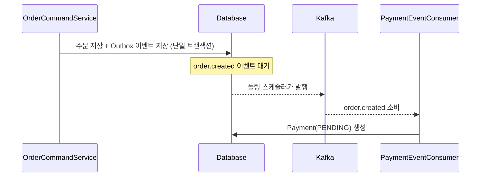
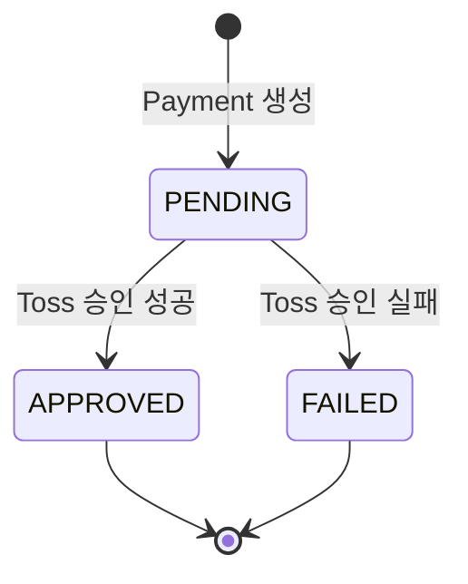
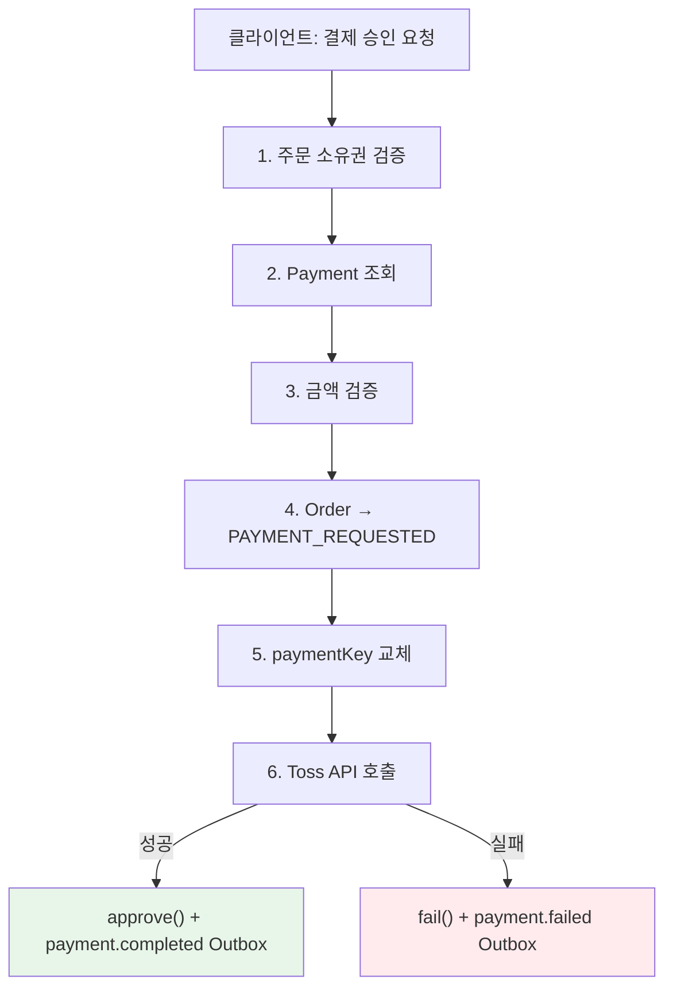
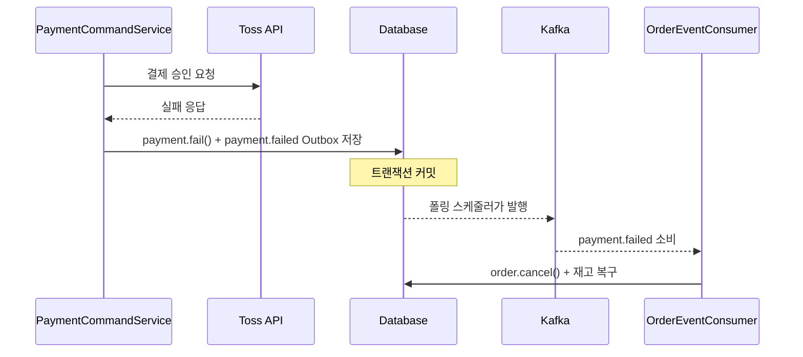
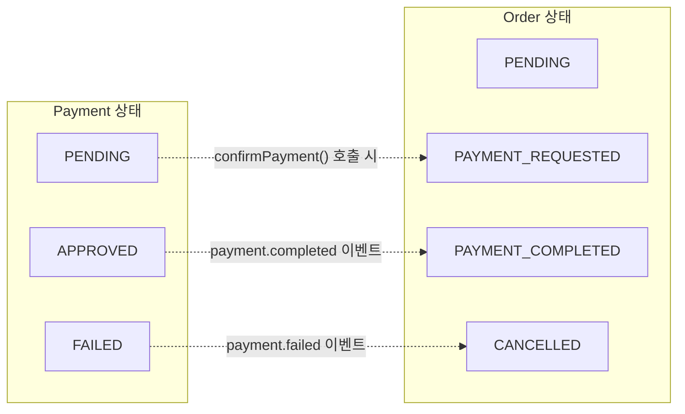
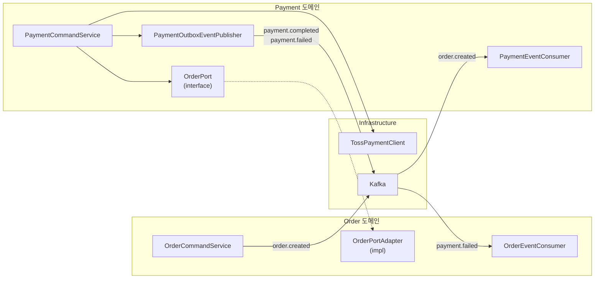
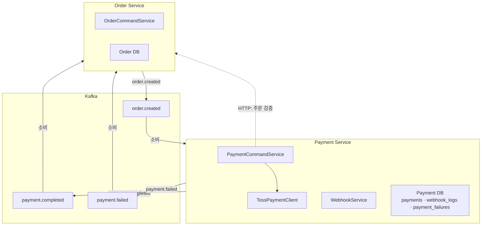

[4편](/blog/peekcart-order-transaction-flow/)에서는 주문 생성 트랜잭션의 다섯 단계와 세 가지 취소 경로를 학습했다. 그중 결제 실패 취소(경로 2)는 "Kafka Consumer가 `payment.failed` 이벤트를 소비해 주문을 취소한다"고만 언급했다. 이번 글에서는 그 이벤트가 어떻게 만들어지는지, 즉 Payment 도메인 쪽을 본다.

결제는 외부 시스템(Toss Payments)과의 경계에 있다. 주문이나 재고처럼 우리가 완전히 통제할 수 있는 도메인이 아니다. 외부 API가 실패할 수 있고, 응답이 늦을 수 있고, 같은 이벤트를 두 번 보낼 수도 있다. 그래서 Payment 도메인의 설계에서 반복적으로 등장하는 질문은 "실패했을 때 어떻게 되는가"와 "중복이 들어오면 어떻게 되는가"다.

이 글에서 사용하는 용어는 다음 뜻으로 읽으면 된다.

| 용어 | 이 글에서의 의미 |
| --- | --- |
| paymentKey | Toss Payments가 발급하는 결제 고유 키. 결제 승인 요청 시 클라이언트가 전달한다 |
| 결제 승인 (confirm) | 클라이언트가 Toss 위젯에서 결제를 완료한 뒤, 서버가 Toss API에 최종 승인을 요청하는 단계 |
| 웹훅 (Webhook) | 외부 시스템이 이벤트 발생 시 우리 서버의 특정 URL로 HTTP 요청을 보내는 방식 |
| HMAC-SHA256 | 공유 비밀키로 메시지의 무결성과 출처를 검증하는 서명 알고리즘 |
| 멱등성 (Idempotency) | 같은 요청을 여러 번 보내도 결과가 한 번 보낸 것과 같은 성질 |
| Outbox 이벤트 | DB 트랜잭션과 함께 저장되어 이벤트 유실을 방지하는 패턴. 10편에서 상세히 다룰 예정 |

이번 학습에서 확인하고 싶은 질문은 다음과 같다.

1. Payment는 언제, 누가 생성하는가?
2. 결제 승인 흐름에서 어떤 일이 순서대로 일어나는가?
3. Toss API 호출이 실패하면 Payment와 Order에 어떤 일이 일어나는가?
4. Payment 상태 전이는 Order 상태 전이와 어떻게 연결되는가?
5. 외부 결제 API를 Infrastructure로 격리하면 무엇이 좋아지는가?
6. 웹훅 중복 수신은 어떻게 방어하는가?
7. Phase 4 MSA에서 Payment Service는 어떻게 바뀌는가?

---

## Payment는 언제 생성되는가

주문이 생성되면 Outbox 이벤트(`order.created`)가 저장되고, 폴링 스케줄러가 이를 Kafka로 발행한다고 했다. Payment의 생성은 이 이벤트를 소비하는 것에서 시작한다.



### PaymentEventConsumer: Kafka에서 주문 생성 이벤트를 소비한다

```java
@KafkaListener(topics = "order.created", groupId = GROUP_ORDER_CREATED)
@Transactional
public void handleOrderCreated(String message) {
    JsonNode root = kafkaMessageParser.parse(message);
    String eventId = root.get("eventId").asText();
    JsonNode payload = root.get("payload");

    idempotencyChecker.executeIfNew(eventId, GROUP_ORDER_CREATED, () -> {
        Long orderId = payload.get("orderId").asLong();
        long totalAmount = payload.get("totalAmount").asLong();
        Payment payment = Payment.create(orderId, totalAmount);
        paymentRepository.save(payment);
        log.debug("Payment(PENDING) 생성 — orderId={}", orderId);
    });
}
```

`order.created` 이벤트에는 `orderId`와 `totalAmount`가 들어 있다. Consumer는 이 정보로 `PENDING` 상태의 Payment를 생성한다. `idempotencyChecker.executeIfNew()`로 같은 이벤트가 중복 소비되더라도 Payment가 두 개 만들어지는 것을 방지한다.

여기서 주목할 점은, Payment를 만드는 주체가 Order 도메인이 아니라 Payment 도메인 자신이라는 것이다. Order는 "주문이 생성됐다"는 사실만 이벤트로 알리고, "그러면 결제 레코드를 만들어야 한다"는 판단은 Payment가 독립적으로 한다.

### PaymentEventListener: Phase 1의 로컬 이벤트 버전

코드베이스에는 Kafka Consumer 외에 로컬 이벤트 리스너도 남아 있다.

```java
@TransactionalEventListener(phase = TransactionPhase.AFTER_COMMIT)
@Transactional(propagation = Propagation.REQUIRES_NEW)
public void handleOrderCreated(OrderCreatedEvent event) {
    Payment payment = Payment.create(event.orderId(), event.totalAmount());
    paymentRepository.save(payment);
}
```

Phase 1에서는 `@TransactionalEventListener(AFTER_COMMIT)`으로 주문 트랜잭션 커밋 이후 Payment를 생성했다. Phase 2에서 Kafka + Outbox로 전환하면서 `PaymentEventConsumer`가 이 역할을 대체했다. 로컬 이벤트 방식의 한계는 이후 상세히 다룰 예정이지만, 핵심은 "주문 커밋은 됐는데 Payment 생성이 실패하면 이벤트가 유실된다"는 것이다. Outbox 패턴은 이벤트 저장을 주문 트랜잭션 안에 포함시켜 이 문제를 해결한다.

---

## Payment 애그리거트: 상태 전이와 금액 검증

### Payment 엔티티

```java
@Entity
@Table(name = "payments")
public class Payment {

    @Id
    @GeneratedValue(strategy = GenerationType.IDENTITY)
    private Long id;

    @Column(name = "order_id", nullable = false, unique = true)
    private Long orderId;

    @Column(name = "payment_key", nullable = false, unique = true)
    private String paymentKey;

    @Column(nullable = false)
    private long amount;

    @Enumerated(EnumType.STRING)
    @Column(nullable = false)
    private PaymentStatus status;

    @Column
    private String method;

    @Column(name = "approved_at")
    private LocalDateTime approvedAt;

    @Column(name = "created_at", nullable = false, updatable = false)
    private LocalDateTime createdAt;

    private Payment(Long orderId, long amount) {
        this.orderId = orderId;
        this.paymentKey = UUID.randomUUID().toString();
        this.amount = amount;
        this.status = PaymentStatus.PENDING;
        this.createdAt = LocalDateTime.now();
    }
}
```

Payment의 구조에서 몇 가지 설계 결정이 있었다.

**`order_id`는 UK다.** 하나의 주문에 하나의 결제만 존재한다. 부분 결제(한 주문에 여러 결제 수단)는 현재 범위에서 지원하지 않는다.

**`paymentKey`는 두 번 설정된다.** 생성 시에는 UUID로 임시 키를 부여하고, 클라이언트가 Toss 위젯에서 결제를 진행하면 Toss가 발급한 실제 `paymentKey`로 교체한다.

```java
public void assignPaymentKey(String paymentKey) {
    if (this.status != PaymentStatus.PENDING) {
        throw new PaymentException(ErrorCode.PAY_004);
    }
    this.paymentKey = paymentKey;
}
```

`assignPaymentKey()`는 `PENDING` 상태에서만 호출할 수 있다. 이미 승인되었거나 실패한 결제의 키를 바꾸는 것은 의미가 없기 때문이다.

**`method`와 `approvedAt`은 승인 후에 채워진다.** 결제 수단(카드, 계좌이체 등)과 승인 시각은 Toss API 응답에서 가져온다. 생성 시점에는 아직 모르는 정보다.

### PaymentStatus: 3개 상태, 2개 전이

```java
public enum PaymentStatus {

    PENDING {
        @Override
        public boolean canTransitionTo(PaymentStatus target) {
            return target == APPROVED || target == FAILED;
        }
    },
    APPROVED {
        @Override
        public boolean canTransitionTo(PaymentStatus target) {
            return false;
        }
    },
    FAILED {
        @Override
        public boolean canTransitionTo(PaymentStatus target) {
            return false;
        }
    };

    public abstract boolean canTransitionTo(PaymentStatus target);
}
```



OrderStatus(8개 상태, 11개 전이)와 비교하면 PaymentStatus는 훨씬 단순하다. 3개 상태, 2개 전이. `APPROVED`와 `FAILED`는 모두 터미널 상태다. 한 번 결정되면 되돌릴 수 없다.

이 단순함은 의도적이다. 결제의 복잡한 후속 처리(환불, 부분 취소 등)는 현재 프로젝트 범위에 포함되지 않는다. 결제가 성공하면 `payment.completed` 이벤트를, 실패하면 `payment.failed` 이벤트를 발행하는 것이 Payment 도메인의 책임 범위다.

4편의 OrderStatus와 같은 패턴(`canTransitionTo()` 추상 메서드)을 사용하고 있다. 프로젝트 전체에서 상태 전이 규칙을 일관된 방식으로 표현한다.

### Payment의 도메인 메서드

```java
public void approve(String method, LocalDateTime approvedAt) {
    if (!this.status.canTransitionTo(PaymentStatus.APPROVED)) {
        throw new PaymentException(ErrorCode.PAY_004);
    }
    this.status = PaymentStatus.APPROVED;
    this.method = method;
    this.approvedAt = approvedAt;
}

public void fail() {
    if (!this.status.canTransitionTo(PaymentStatus.FAILED)) {
        throw new PaymentException(ErrorCode.PAY_004);
    }
    this.status = PaymentStatus.FAILED;
}

public void validateAmount(long requestedAmount) {
    if (this.amount != requestedAmount) {
        throw new PaymentException(ErrorCode.PAY_001);
    }
}
```

4편에서 Order는 범용 `transitionTo()`와 특화된 `cancel()`을 함께 가지고 있었다. Payment는 `approve()`와 `fail()`이라는 도메인 언어에 가까운 메서드만 있다. 전이가 2개뿐이므로 범용 메서드가 필요하지 않다. Order에서 개선 후보로 남겨둔 "도메인 언어화"가 Payment에서는 이미 적용된 셈이다.

`validateAmount()`는 클라이언트가 보낸 금액과 서버에 저장된 금액이 일치하는지 확인한다. 이 검증이 중요한 이유는, 클라이언트가 금액을 조작해서 더 적은 금액으로 결제를 승인받는 것을 방지하기 위함이다. 금액 검증은 Toss API 호출 전에 서버 측에서 먼저 수행한다.

---

## 결제 승인 흐름: confirmPayment()

결제 승인은 Payment 도메인에서 가장 복잡한 UseCase다. 외부 API 호출을 포함하며, 성공과 실패 경로가 명확히 갈린다.



### PaymentCommandService.confirmPayment()

```java
public PaymentDetailDto confirmPayment(Long userId, ConfirmPaymentCommand command) {
    // 1. 주문 소유권 검증
    orderPort.verifyOrderOwner(userId, command.orderId());
    // 2. Payment 조회
    Payment payment = paymentRepository.findByOrderId(command.orderId())
            .orElseThrow(() -> new PaymentException(ErrorCode.PAY_003));
    // 3. 금액 검증
    payment.validateAmount(command.amount());
    // 4. Order 상태를 PAYMENT_REQUESTED로 전이
    orderPort.transitionToPaymentRequested(command.orderId());
    // 5. Toss가 발급한 paymentKey로 교체
    payment.assignPaymentKey(command.paymentKey());
    try {
        // 6. Toss API 호출
        TossConfirmResponse response = tossPaymentClient.confirm(
                command.paymentKey(), command.orderId().toString(), command.amount());
        // 성공: approve + payment.completed 이벤트
        payment.approve(response.method(),
                OffsetDateTime.parse(response.approvedAt()).toLocalDateTime());
        outboxEventPublisher.publishPaymentCompleted(payment, userId);
    } catch (Exception e) {
        // 실패: fail + payment.failed 이벤트
        log.error("Toss 결제 승인 실패 — orderId={}, paymentKey={}: {}",
                command.orderId(), command.paymentKey(), e.getMessage());
        payment.fail();
        outboxEventPublisher.publishPaymentFailed(payment, userId);
    }
    return PaymentDetailDto.from(payment);
}
```

각 단계를 하나씩 보겠다.

**1단계: 주문 소유권 검증.** `orderPort.verifyOrderOwner()`로 본인 주문인지 확인한다. 다른 사용자의 주문에 대해 결제를 시도할 수 없다. 2편에서 본 데이터 레벨 인가가 여기서도 적용된다.

**2단계: Payment 조회.** `findByOrderId()`로 해당 주문의 Payment를 찾는다. 없으면 PAY-003. 이 시점에서 Payment는 `PaymentEventConsumer`가 이미 생성해둔 상태다.

**3단계: 금액 검증.** 클라이언트가 보낸 `amount`와 서버의 `payment.amount`가 일치하는지 확인한다. 불일치 시 PAY-001. 이 검증이 Toss API 호출보다 앞에 있다. 금액이 맞지 않으면 외부 API를 호출할 필요가 없다.

**4단계: Order 상태 전이.** `orderPort.transitionToPaymentRequested()`로 Order 상태를 `PENDING → PAYMENT_REQUESTED`로 바꾼다. 이 전이가 결제 승인 전에 일어나는 이유는, "결제가 진행 중이다"라는 상태를 먼저 기록하기 위함이다. 4편에서 본 타임아웃 스케줄러는 `PAYMENT_REQUESTED` 상태를 기준으로 15분 초과 주문을 찾는다.

**5단계: paymentKey 교체.** 생성 시 부여한 임시 UUID를 Toss가 발급한 실제 `paymentKey`로 교체한다.

**6단계: Toss API 호출과 분기.** 여기서 흐름이 성공과 실패로 갈린다.

---

## 성공 경로와 실패 경로

### 성공: approve + payment.completed

Toss API가 성공 응답을 반환하면 `payment.approve()`가 호출된다. 결제 수단(`method`)과 승인 시각(`approvedAt`)을 Toss 응답에서 가져와 Payment에 기록한다. 그리고 `payment.completed` Outbox 이벤트를 저장한다.

```java
payment.approve(response.method(),
        OffsetDateTime.parse(response.approvedAt()).toLocalDateTime());
outboxEventPublisher.publishPaymentCompleted(payment, userId);
```

이 이벤트는 두 Consumer가 소비한다.

- **Order 도메인**: `payment.completed`를 받아 Order 상태를 `PAYMENT_COMPLETED`로 전이
- **Notification 도메인**: 결제 완료 알림 발송

### 실패: fail + payment.failed

Toss API 호출이 실패하면(네트워크 오류, 잔액 부족, 카드 한도 초과 등) catch 블록에서 `payment.fail()`이 호출된다. `payment.failed` Outbox 이벤트를 저장한다.

```java
payment.fail();
outboxEventPublisher.publishPaymentFailed(payment, userId);
```

이 이벤트가 바로 4편에서 다룬 "결제 실패 취소(경로 2)"의 출발점이다.



Payment 도메인은 "결제가 실패했다"는 사실만 이벤트로 발행한다. "그러면 주문을 취소하고 재고를 복구해야 한다"는 판단은 Order 도메인이 독립적으로 한다. 이것이 이벤트 기반 도메인 간 통신의 핵심이다. Payment가 Order의 취소 로직을 알 필요가 없고, Order가 Toss API의 존재를 알 필요도 없다.

### PaymentStatus와 OrderStatus의 연결

두 상태 전이도를 나란히 놓으면 연결 지점이 보인다.



| Payment 상태 변경 | 트리거 | Order 상태 변경 | 연결 방식 |
| --- | --- | --- | --- |
| (생성 전) → PENDING | `order.created` Kafka 이벤트 | — | Kafka Consumer |
| PENDING → (결제 진행 중) | `confirmPayment()` 호출 | PENDING → PAYMENT_REQUESTED | `OrderPort` 동기 호출 |
| PENDING → APPROVED | Toss API 성공 | PAYMENT_REQUESTED → PAYMENT_COMPLETED | `payment.completed` Kafka 이벤트 |
| PENDING → FAILED | Toss API 실패 | PAYMENT_REQUESTED → CANCELLED (`order.cancel()`) | `payment.failed` Kafka 이벤트 |

Payment와 Order가 동기로 연결되는 지점은 `OrderPort.transitionToPaymentRequested()` 하나뿐이다. 나머지는 모두 Kafka 이벤트로 비동기 연결된다.

한 가지 주목할 점이 있다. `OrderStatus` enum에는 `PAYMENT_FAILED` 상태가 정의되어 있고 `PAYMENT_REQUESTED`에서 전이할 수 있지만, 실제 `OrderEventConsumer.handlePaymentFailed()`는 `order.cancel()`을 호출해서 `CANCELLED`로 직접 전이한다. `PAYMENT_FAILED`를 거치지 않는다. enum에 상태가 정의되어 있다고 해서 반드시 사용되는 것은 아니다. 현재 구현에서는 결제 실패와 사용자 취소가 모두 같은 `cancel()` 경로를 타고 있다.

### Controller: FAILED 상태면 에러 응답

```java
@PostMapping("/confirm")
public ResponseEntity<ApiResponse<PaymentResponse>> confirmPayment(
        @CurrentUser LoginUser loginUser,
        @Valid @RequestBody ConfirmPaymentRequest request) {
    ConfirmPaymentCommand command = new ConfirmPaymentCommand(
            request.paymentKey(), request.orderId(), request.amount());
    PaymentDetailDto result = paymentCommandService.confirmPayment(loginUser.userId(), command);
    if ("FAILED".equals(result.status())) {
        throw new PaymentException(ErrorCode.PAY_005);
    }
    return ResponseEntity.ok(ApiResponse.of(PaymentResponse.from(result)));
}
```

`PaymentCommandService.confirmPayment()`은 Toss API 실패 시 예외를 던지지 않고 `FAILED` 상태의 DTO를 반환한다. 예외를 던지면 트랜잭션이 롤백되어 `payment.failed` Outbox 이벤트도 함께 사라지기 때문이다. 대신 Controller가 상태를 확인하고 에러 응답을 반환한다.

이것은 "트랜잭션 안에서 실패를 기록하고, 트랜잭션 밖에서 에러를 응답한다"는 패턴이다. Application Service는 실패를 상태로 관리하고, Presentation이 그 상태를 HTTP 응답으로 변환한다.

---

## 외부 API 격리: TossPaymentClient

Toss Payments와의 통신은 Infrastructure 레이어의 `TossPaymentClient`에 격리되어 있다.

```java
@Component
public class TossPaymentClient {

    private final RestClient restClient;

    public TossPaymentClient(@Value("${toss.payments.secret-key}") String secretKey) {
        String credentials = Base64.getEncoder()
                .encodeToString((secretKey + ":").getBytes());
        this.restClient = RestClient.builder()
                .baseUrl("https://api.tosspayments.com/v1")
                .defaultHeader(HttpHeaders.AUTHORIZATION, "Basic " + credentials)
                .defaultHeader(HttpHeaders.CONTENT_TYPE, MediaType.APPLICATION_JSON_VALUE)
                .build();
    }

    public TossConfirmResponse confirm(String paymentKey, String orderId, long amount) {
        return restClient.post()
                .uri("/payments/confirm")
                .body(Map.of(
                        "paymentKey", paymentKey,
                        "orderId", orderId,
                        "amount", amount
                ))
                .retrieve()
                .body(TossConfirmResponse.class);
    }
}
```

```java
public record TossConfirmResponse(
        String paymentKey,
        String orderId,
        String status,
        String method,
        String approvedAt) {
}
```

### 왜 Infrastructure에 두는가

`TossPaymentClient`가 Application이나 Domain 레이어에 있으면 어떤 문제가 생기는가?

| 위치 | 문제 |
| --- | --- |
| Domain 레이어 | 도메인이 HTTP, RestClient, Toss API 스펙에 의존. 단위 테스트에서 외부 API를 호출하거나 Mock해야 함 |
| Application 레이어 | Toss → 다른 PG로 교체 시 Application 코드가 변경됨. UseCase 흐름과 외부 연동 세부사항이 섞임 |
| Infrastructure 레이어 (현재) | 도메인과 Application은 Toss의 존재를 모름. PG 교체 시 Infrastructure만 교체 |

`PaymentCommandService`는 `TossPaymentClient.confirm()`을 직접 호출하고 있어, 현재는 Application이 Infrastructure 구현체에 의존하고 있다. 이 의존을 Port 인터페이스로 분리하면("결제를 승인해주세요") 테스트가 더 쉬워지고 PG 교체 시 영향 범위가 줄어든다. 3편과 4편에서 본 `ProductPort`, `OrderPort`와 같은 패턴이다. 현재 결제 PG가 하나뿐이어서 포트 분리의 실질적 필요성이 낮지만, 개선 후보로 남겨둔다.

`TossConfirmResponse`도 Infrastructure에 위치한다. Toss API의 응답 구조가 바뀌어도 영향이 이 클래스에서 멈춘다. `PaymentCommandService`는 응답에서 `method`와 `approvedAt`만 꺼내 쓰므로, Toss 응답의 다른 필드가 추가되거나 바뀌어도 영향을 받지 않는다.

---

## Outbox 이벤트 발행: PaymentOutboxEventPublisher

결제 결과는 Outbox 이벤트로 발행된다.

```java
@Component
@RequiredArgsConstructor
public class PaymentOutboxEventPublisher {

    private static final String AGGREGATE_TYPE = "PAYMENT";
    private static final String PAYMENT_COMPLETED = "payment.completed";
    private static final String PAYMENT_FAILED = "payment.failed";
    private final OutboxEventRepository outboxEventRepository;
    private final ObjectMapper objectMapper;

    public void publishPaymentCompleted(Payment payment, Long userId) {
        PaymentCompletedPayload payload = new PaymentCompletedPayload(
                payment.getId(), payment.getOrderId(), userId,
                payment.getPaymentKey(), payment.getAmount(),
                payment.getMethod(), payment.getApprovedAt());
        saveOutboxEvent(PAYMENT_COMPLETED, payment.getOrderId().toString(), payload);
    }

    public void publishPaymentFailed(Payment payment, Long userId) {
        PaymentFailedPayload payload = new PaymentFailedPayload(
                payment.getId(), payment.getOrderId(), userId,
                payment.getPaymentKey(), payment.getAmount());
        saveOutboxEvent(PAYMENT_FAILED, payment.getOrderId().toString(), payload);
    }
}
```

두 이벤트의 payload를 비교하면 차이가 보인다.

| 필드 | `payment.completed` | `payment.failed` |
| --- | --- | --- |
| paymentId | O | O |
| orderId | O | O |
| userId | O | O |
| paymentKey | O | O |
| amount | O | O |
| method | O (카드, 계좌이체 등) | X |
| approvedAt | O | X |

`payment.failed`에는 `method`와 `approvedAt`이 없다. 실패한 결제는 결제 수단과 승인 시각이 결정되지 않았기 때문이다.

aggregate ID로 `orderId`를 사용하고 있다. 설계 문서에서 Kafka 파티션 키를 `order_id`로 설정한다고 했는데, aggregate ID가 파티션 키로 사용되면 동일 주문에 대한 `order.created → payment.completed(또는 payment.failed) → order.cancelled` 이벤트가 같은 파티션에 라우팅되어 순서가 보장된다.

---

## 웹훅 멱등성: 중복 수신을 어떻게 방어하는가

Toss Payments는 결제 상태 변경 시 우리 서버의 `/api/v1/payments/webhook`으로 HTTP 요청을 보낸다. 문제는 네트워크 이슈로 같은 이벤트가 두 번 이상 올 수 있다는 것이다.

### WebhookService: 서명 검증 + 멱등성

```java
@Service
@Transactional
public class WebhookService {

    private final WebhookLogRepository webhookLogRepository;
    private final String webhookSecret;

    public void processWebhook(String signature, String paymentKey, String eventType,
                               String idempotencyKey, String payload) {
        // 1. HMAC-SHA256 서명 검증
        verifySignature(signature, payload);

        // 2. 중복 확인
        if (webhookLogRepository.existsByIdempotencyKey(idempotencyKey)) {
            return;
        }

        // 3. 로그 저장
        WebhookLog log = WebhookLog.create(paymentKey, eventType, idempotencyKey,
                payload, "PROCESSED");
        webhookLogRepository.save(log);
    }
}
```

웹훅 처리는 세 단계다.

**1단계: 서명 검증.** Toss가 보낸 `Toss-Signature` 헤더와 payload를 HMAC-SHA256으로 비교한다. 서명이 없거나 불일치하면 PAY-006을 던진다. 이 검증은 웹훅 요청이 실제로 Toss에서 온 것인지 확인하는 보안 장치다. 공유 비밀키(`webhookSecret`)를 모르는 공격자가 가짜 웹훅을 보내는 것을 방지한다.

```java
private void verifySignature(String signature, String payload) {
    if (signature == null) {
        throw new PaymentException(ErrorCode.PAY_006);
    }
    try {
        Mac mac = Mac.getInstance("HmacSHA256");
        mac.init(new SecretKeySpec(
                webhookSecret.getBytes(StandardCharsets.UTF_8), "HmacSHA256"));
        String computed = Base64.getEncoder().encodeToString(
                mac.doFinal(payload.getBytes(StandardCharsets.UTF_8)));
        if (!computed.equals(signature)) {
            throw new PaymentException(ErrorCode.PAY_006);
        }
    } catch (PaymentException e) {
        throw e;
    } catch (Exception e) {
        throw new PaymentException(ErrorCode.PAY_006);
    }
}
```

**2단계: 중복 확인.** `webhookLogRepository.existsByIdempotencyKey()`로 이미 처리한 이벤트인지 확인한다. 같은 `idempotencyKey`가 있으면 아무것도 하지 않고 리턴한다.

**3단계: 로그 저장.** 새로운 이벤트이면 `WebhookLog`를 생성해 저장한다.

### WebhookLog: 멱등성의 물리적 근거

```java
@Entity
@Table(name = "webhook_logs")
public class WebhookLog {

    @Id
    @GeneratedValue(strategy = GenerationType.IDENTITY)
    private Long id;

    @Column(name = "payment_key", nullable = false)
    private String paymentKey;

    @Column(name = "event_type", nullable = false)
    private String eventType;

    @Column(name = "idempotency_key", nullable = false, unique = true)
    private String idempotencyKey;

    @Column(nullable = false, columnDefinition = "TEXT")
    private String payload;

    @Column(nullable = false)
    private String status;

    @Column(name = "received_at", nullable = false, updatable = false)
    private LocalDateTime receivedAt;
}
```

`idempotency_key`에 UK(Unique Key)가 걸려 있다. `existsByIdempotencyKey()` 조회와 `save()` 사이에 동시 요청이 끼어들어도, UK 제약조건이 중복 INSERT를 막는다. 이것은 11편에서 다룰 `processed_events`의 `(event_id, consumer_group)` UK와 같은 패턴이다.

### Controller의 idempotencyKey 처리

```java
@PostMapping("/webhook")
public ResponseEntity<Void> handleWebhook(
        @RequestHeader(value = "Toss-Signature", required = false) String signature,
        @RequestHeader(value = "Idempotency-Key", required = false) String idempotencyKey,
        @RequestBody String rawPayload) throws Exception {
    JsonNode node = objectMapper.readTree(rawPayload);
    String paymentKey = node.path("paymentKey").asText("");
    String eventType = node.path("eventType").asText("");
    String idempKey = idempotencyKey != null
            ? idempotencyKey
            : paymentKey + "-" + eventType;
    webhookService.processWebhook(signature, paymentKey, eventType, idempKey, rawPayload);
    return ResponseEntity.ok().build();
}
```

Toss가 `Idempotency-Key` 헤더를 보내면 그것을 사용하고, 없으면 `paymentKey + "-" + eventType`을 조합해서 만든다. 같은 결제의 같은 이벤트 유형이면 같은 키가 생성되므로 중복 방어가 된다.

`@RequestBody String rawPayload`로 원본 JSON을 문자열 그대로 받는 이유는 HMAC 서명 검증 때문이다. 객체로 역직렬화하면 필드 순서나 공백이 달라져 서명이 불일치할 수 있다.

### 웹훅과 결제 승인의 관계

현재 구현에서 웹훅은 로그 기록만 하고 비즈니스 로직을 실행하지 않는다. 결제 상태 변경은 `confirmPayment()`에서 동기적으로 처리한다. 웹훅의 역할은 Toss 측 이벤트를 수신하고 보존하는 것이다.

이 구조가 유효한 이유는, Toss Payments의 결제 플로우에서 결제 승인은 서버가 직접 API를 호출하는 것이고 웹훅은 추가적인 알림이기 때문이다. 만약 결제 승인 API 호출이 실패했는데 실제로는 Toss에서 승인이 처리된 경우, 웹훅 로그가 그 사실을 확인할 수 있는 감사 기록이 된다.

---

## 도메인 간 경계: Port가 만드는 계약

Payment 도메인이 다른 도메인과 소통하는 방식을 정리하면 이렇다.

### OrderPort: Payment → Order (동기)

```java
public interface OrderPort {
    void transitionToPaymentRequested(Long orderId);
    void verifyOrderOwner(Long userId, Long orderId);
}
```

이 Port는 Payment 도메인의 `application/port`에 정의되고, 구현체(`OrderPortAdapter`)는 Order 도메인의 infrastructure에 위치한다. 4편에서 본 것과 같은 방향이다.

### PaymentOutboxEventPublisher: Payment → Kafka (비동기)

`payment.completed`와 `payment.failed` 이벤트를 Outbox에 저장한다. Order와 Notification이 각각의 Consumer Group으로 이 이벤트를 소비한다.

### 전체 흐름 도식



Payment와 Order 사이에 동기 연결(`OrderPort`)과 비동기 연결(Kafka)이 공존한다. 동기 연결은 결제 승인 시 Order 상태를 즉시 전이하기 위함이고, 비동기 연결은 결제 결과를 전파하기 위함이다.

---

## 테스트로 검증하기

### Payment 도메인 테스트: 상태 전이 규칙

```java
// PaymentStatusTest.java
@Test
@DisplayName("APPROVED에서 모든 전이가 거부된다")
void approved_allTransitions_denied() {
    for (PaymentStatus target : PaymentStatus.values()) {
        assertThat(PaymentStatus.APPROVED.canTransitionTo(target)).isFalse();
    }
}

@Test
@DisplayName("FAILED에서 모든 전이가 거부된다")
void failed_allTransitions_denied() {
    for (PaymentStatus target : PaymentStatus.values()) {
        assertThat(PaymentStatus.FAILED.canTransitionTo(target)).isFalse();
    }
}
```

4편의 `OrderStatusTest`와 같은 패턴이다. 터미널 상태에서 모든 전이가 거부되는지를 전수 검사한다.

### PaymentCommandService 테스트: 성공과 실패 분기

```java
@Test
@DisplayName("confirmPayment: 성공 시 APPROVED 상태와 payment.completed가 발행된다")
void confirmPayment_success() {
    Payment payment = PaymentFixture.pendingPaymentWithId();
    ConfirmPaymentCommand command = PaymentFixture.confirmPaymentCommand();
    TossConfirmResponse response = new TossConfirmResponse(
            PaymentFixture.DEFAULT_PAYMENT_KEY, command.orderId().toString(),
            "DONE", "카드", "2026-03-25T14:00:00+09:00");

    given(paymentRepository.findByOrderId(command.orderId())).willReturn(Optional.of(payment));
    given(tossPaymentClient.confirm(command.paymentKey(), command.orderId().toString(), command.amount()))
            .willReturn(response);

    PaymentDetailDto result = paymentCommandService.confirmPayment(
            PaymentFixture.DEFAULT_USER_ID, command);

    assertThat(result.status()).isEqualTo("APPROVED");
    assertThat(result.method()).isEqualTo("카드");
    then(orderPort).should().transitionToPaymentRequested(command.orderId());
    then(outboxEventPublisher).should().publishPaymentCompleted(
            any(Payment.class), eq(PaymentFixture.DEFAULT_USER_ID));
}

@Test
@DisplayName("confirmPayment: Toss API 실패 시 FAILED 상태와 payment.failed가 발행된다")
void confirmPayment_tossFailure_failsPayment() {
    Payment payment = PaymentFixture.pendingPaymentWithId();
    ConfirmPaymentCommand command = PaymentFixture.confirmPaymentCommand();

    given(paymentRepository.findByOrderId(command.orderId())).willReturn(Optional.of(payment));
    given(tossPaymentClient.confirm(any(), any(), eq(command.amount())))
            .willThrow(new RuntimeException("Toss API error"));

    PaymentDetailDto result = paymentCommandService.confirmPayment(
            PaymentFixture.DEFAULT_USER_ID, command);

    assertThat(result.status()).isEqualTo("FAILED");
    then(outboxEventPublisher).should().publishPaymentFailed(
            any(Payment.class), eq(PaymentFixture.DEFAULT_USER_ID));
}
```

두 테스트가 검증하는 것은 동일한 `confirmPayment()` 호출에서 Toss API 성공/실패에 따라 결과가 어떻게 갈리는지다. 성공 시 APPROVED + `publishPaymentCompleted`, 실패 시 FAILED + `publishPaymentFailed`. `TossPaymentClient`를 Mock으로 교체해서 외부 API 없이도 두 경로를 모두 테스트할 수 있다.

### WebhookService 테스트: 서명 검증과 멱등성

```java
@Test
@DisplayName("processWebhook: 유효한 서명이면 로그를 저장한다")
void processWebhook_validSignature_savesLog() {
    String payload = "{\"paymentKey\":\"pk-123\"}";
    String signature = computeHmac(payload);
    given(webhookLogRepository.existsByIdempotencyKey("idem-1")).willReturn(false);

    assertThatCode(() -> webhookService.processWebhook(
            signature, "pk-123", "PAYMENT_DONE", "idem-1", payload))
            .doesNotThrowAnyException();

    then(webhookLogRepository).should().save(any(WebhookLog.class));
}

@Test
@DisplayName("processWebhook: 중복 idempotencyKey이면 저장을 스킵한다")
void processWebhook_duplicateKey_skips() {
    String payload = "{\"paymentKey\":\"pk-123\"}";
    String signature = computeHmac(payload);
    given(webhookLogRepository.existsByIdempotencyKey("idem-1")).willReturn(true);

    webhookService.processWebhook(signature, "pk-123", "PAYMENT_DONE", "idem-1", payload);

    then(webhookLogRepository).should(never()).save(any());
}
```

멱등성 테스트의 핵심은 두 번째 테스트다. 같은 `idempotencyKey`로 두 번 호출해도 `save()`가 한 번도 호출되지 않는 것을 검증한다.

---

## 한계와 트레이드오프

### confirmPayment()의 트랜잭션 범위가 넓다

현재 `confirmPayment()`는 하나의 `@Transactional` 안에서 Payment 조회, Order 상태 전이, Toss API 호출, Payment 상태 변경, Outbox 이벤트 저장을 모두 수행한다. Toss API 호출은 외부 네트워크 I/O이므로 응답 시간이 가변적이다. API 응답이 느리면 트랜잭션이 길어지고 DB 커넥션이 그만큼 점유된다.

이 문제를 완화하려면 Toss API 호출을 트랜잭션 밖으로 빼는 방법이 있다. 먼저 Toss API를 호출해 결과를 받고, 그 결과를 바탕으로 트랜잭션을 열어 상태를 변경하는 것이다. 그러나 이 경우 "API는 성공했는데 트랜잭션이 실패했다"는 새로운 불일치 시나리오가 생긴다. 현재 트래픽 수준에서는 트랜잭션 안에서 처리하는 것이 더 단순하다.

### TossPaymentClient에 Port 인터페이스가 없다

3편의 `ProductPort`, 4편의 `OrderPort`처럼 도메인 간 경계에는 Port 인터페이스가 있지만, `PaymentCommandService` → `TossPaymentClient` 사이에는 인터페이스 없이 구현체를 직접 주입하고 있다. 테스트에서는 `@Mock`으로 교체하고 있어 실질적 문제는 없지만, PG를 교체하거나 테스트 환경에서 Fake를 주입하려면 Port 분리가 필요하다.

### 웹훅이 비즈니스 로직을 실행하지 않는다

현재 웹훅은 로그만 기록한다. 만약 `confirmPayment()` API 호출이 타임아웃되었는데 실제로는 Toss에서 결제가 승인된 경우, 우리 시스템에는 결제 실패로 기록되지만 Toss에는 결제 성공으로 남는 불일치가 발생할 수 있다. 이 경우 웹훅이 실제 결제 상태를 동기화하는 역할을 해야 한다. 현재 프로젝트 범위에서는 이 시나리오를 다루지 않고 있다.

### 의도적으로 안 한 것

- **환불/부분 취소**: `APPROVED` 이후의 상태 전이. 비즈니스적으로 중요하지만 현재 범위에서 미구현
- **재시도 정책**: Toss API 호출 실패 시 즉시 FAILED로 처리한다. 일시적 네트워크 오류에 대한 재시도 로직은 없음
- **`payment_failures` 테이블**: 실패 사유를 상세히 기록하는 테이블. Phase 4에서 도입 예정
- **웹훅 기반 상태 동기화**: 위에서 언급한 API/웹훅 불일치 해소

---

## 자료는 어떤 질문에 연결해서 읽을까

| 질문 | 같이 읽을 자료 | 이 글에서 연결되는 지점 |
| --- | --- | --- |
| PG 연동의 일반적인 플로우는 어떻게 되는가? | Toss Payments, [결제 연동 가이드](https://docs.tosspayments.com/guides/v2/payment-widget/integration) | confirm API의 역할과 paymentKey 흐름을 이해할 때 |
| 외부 API를 Infrastructure에 격리하는 이유는 무엇인가? | Alistair Cockburn, [Hexagonal Architecture](https://alistair.cockburn.us/hexagonal-architecture/) | TossPaymentClient의 위치와 Port 패턴을 비교할 때 |
| 웹훅 보안은 어떻게 구현하는가? | OWASP, [Webhook Security](https://cheatsheetseries.owasp.org/cheatsheets/Webhook_Security_Cheat_Sheet.html) | HMAC-SHA256 서명 검증의 필요성을 이해할 때 |
| 멱등성은 왜 필요하고 어떻게 구현하는가? | Stripe, [Idempotent Requests](https://docs.stripe.com/api/idempotent_requests) | webhook_logs.idempotency_key UK의 설계를 볼 때 |
| Saga 보상 트랜잭션은 어떻게 동작하는가? | Chris Richardson, [Sagas](https://microservices.io/patterns/data/saga.html) | payment.failed → order.cancelled → inventory.restore 흐름을 볼 때 |
| Outbox 패턴은 왜 필요한가? | Chris Richardson, [Transactional Outbox](https://microservices.io/patterns/data/transactional-outbox.html) | payment.completed/failed Outbox 이벤트의 필요성을 이해할 때 |

---

## Phase 4 MSA에서는 어떻게 바뀌는가

Phase 4에서 Payment Service는 독립 배포 단위가 된다. 자체 DB를 갖고, Order Service와는 Kafka 이벤트와 HTTP API로만 소통한다.



여기서 주요 변화는 다음과 같다.

**`OrderPort`가 HTTP API로 바뀐다.** 현재 `OrderPort.verifyOrderOwner()`와 `transitionToPaymentRequested()`는 같은 JVM 안에서 메서드를 호출한다. MSA에서는 Order Service의 HTTP API를 호출하게 된다. 네트워크 오류와 타임아웃 처리가 추가로 필요하다.

**`payment_failures` 테이블이 도입된다.** 현재는 `payments.status = 'FAILED'`로 실패를 표현하지만, 실패 사유(잔액 부족, 카드 한도, 네트워크 오류 등)를 구분하지 않는다. Phase 4에서는 별도 테이블에 상세 실패 이력을 기록한다.

**결제 실패 보상이 Choreography Saga가 된다.** 현재 모놀리스에서는 `payment.failed` → Order Consumer가 주문 취소 + 재고 복구를 하나의 서비스 안에서 처리한다. MSA에서는 이 흐름이 서비스 경계를 넘는다.

```
payment.failed 발행 (Payment Service)  → Order Service 소비 → 주문 CANCELLED + order.cancelled 발행
    → Product Service 소비 → 재고 복구
```

각 단계가 독립 서비스에서 실행되므로, 중간 단계가 실패했을 때의 처리가 더 복잡해진다. 하지만 이미 Phase 2에서 Outbox + Kafka + 멱등성 처리를 갖추고 있어, Saga의 기반 인프라는 준비되어 있다.

**웹훅 엔드포인트가 Payment Service로 이동한다.** 현재 모놀리스의 `/api/v1/payments/webhook`이 Payment Service의 엔드포인트가 된다. API Gateway를 통하지 않고 Toss에서 직접 Payment Service로 들어올 수도 있고, Gateway를 거칠 수도 있다. 이 결정은 보안 요구사항에 따라 달라진다.
