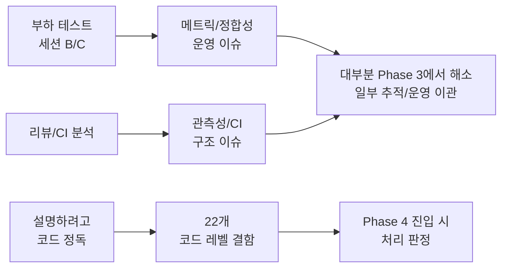
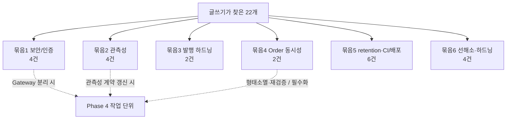
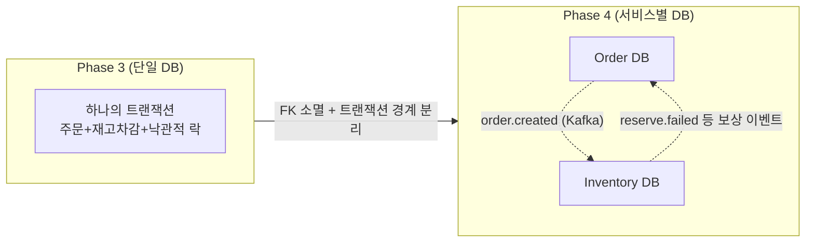
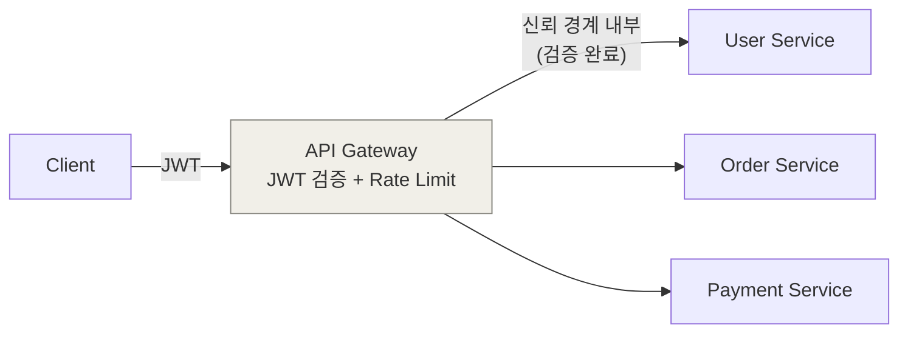

# PeekCart 학습 기록 18: Phase 4로 넘어가기 전에 - 글을 쓰다 발견한 22개의 부채  
  
0편부터 17편까지, 이 연재는 "구현한 것을 복기한다"는 목적으로 시작했다. 그런데 글을 쓰는 동안 예상하지 못한 일이 반복됐다.  
  
> 설명하려고 코드를 다시 열 때마다, "어 이거 왜 이렇게 했지?"가 튀어나왔다.  
  
8편에서 캐시를 설명하다 적중률을 볼 메트릭이 없다는 걸 알았고, 9편에서 분산 락을 설명하다 주문 경로에서 그 락이 사실상 무력화돼 있다는 걸 알았다. 17편에서 부하 결과를 검증하다 검증 SQL 자체에 결함이 있다는 걸 알았다. **글쓰기가 곧 정적 코드 리뷰였다.**  
  
그렇게 쌓인 결함이 스물두 개다. 18편은 이 22개를 정리하는 글이다. 동시에 Phase 3에서 부하·리뷰가 찾아 **대부분 해소한** 부채와 비교하고, Phase 4 MSA 진입 전에 무엇을 가져가고 무엇을 바꾸는지 체크리스트로 만든다.  
  
이 글의 결론을 먼저 적으면 이렇다. 부채는 발견 경로에 따라 성격이 갈린다.  
  
| 부채를 찾은 것 | 성격 | Phase 3 시점 상태 |  
| --- | --- | --- |  
| 부하 테스트 · 리뷰 · CI 분석 | 운영·측정에서 *터진* 것 (시끄러움) | 코드 결함은 **대부분 해소**, 일부는 추적·운영으로 이관 |  
| 학습 글 작성 | 정독에서만 *보인* 것 (조용함) | 22개 목록화, **Phase 4 착수 시 처리 판정** |  
  
앞의 것은 운영이 시켰고, 뒤의 것은 글쓰기가 시켰다. 이 둘의 성격 차이가 18편의 뼈대다.  
  
---  
  
## 용어  
  
| 용어 | 이 글에서의 의미 |  
| --- | --- |  
| 운영이 찾은 부채 | 부하 테스트·리뷰에서 드러난 결함. 런타임 증상(실패율, No-data 패널)으로 *시끄럽게* 보인다 |  
| 글쓰기가 찾은 부채 | 코드를 설명하려 정독하다 보인 결함. 런타임 증상이 없어 *조용히* 잠복한다 |  
| 선해소 | 정식 부채 등록 절차 없이 즉시 고치는 것. 명백한 문서·쿼리 오류에 해당 |  
| 옵션 가치형 부채 | 지금은 비용이 안 보이고, 특정 변경(키 회전·서비스 분리 등)이 필요해진 *시점에야* 비용이 드러나는 부채 |  
| Choreography Saga | 중앙 오케스트레이터 없이 각 서비스가 이벤트를 주고받으며 보상하는 분산 트랜잭션 패턴 |  
| eventual consistency | 즉시가 아니라 일정 시간 뒤 정합성이 맞춰지는 모델. 서비스별 DB 분리의 필연적 결과 |  
| 공유(common) 모듈 | Phase 4 멀티모듈에서 여러 서비스가 함께 쓰는 코드 모듈 |  
| 신뢰 경계 | 그 안쪽이면 "검증된 요청"이라고 믿어도 되는 경계. Phase 4에선 Gateway가 그 입구가 된다 |  
  
---  
  
## 이번 글의 질문  
  
1. 운영이 찾은 부채와 글쓰기가 찾은 부채는 무엇이 다른가? 왜 따로 기록했나?  
2. 학습 글을 쓰면서 부채가 발견된다는 게 무슨 의미인가?  
3. 22개는 어떻게 묶이고, 언제 처리되나?  
4. Phase 4에서 구조적으로 바뀌는 것은 무엇이고, 그대로 가져가는 것은 무엇인가?  
5. 서비스별 DB 분리는 어떤 정합성 문제를 *새로* 만드는가?  
6. 공유 모듈에는 무엇을 둘 수 있고, 무엇을 두면 안 되는가?  
7. Gateway 인증과 내부 서비스 신뢰 경계는 어떻게 설계해야 하나?  
8. 부하·테스트가 아직 검증하지 못한 갭(chaos·상호배제)은 어떻게 들고 가는가?  
  
---  
  
## 문제 상황: 부채는 두 군데서 나온다  
  
Phase 3을 종결할 때 개발 부채 표는 거의 정리돼 있었다. **코드·설계 결함이었던 것들은 전부 해소**됐고, 남은 셋은 *즉시 고칠 코드 결함은 아니라* 추적·운영으로 이관됐다(완전히 손 뗀 건 아니다 — 후속 측정·튜닝과 자동화 권장이 별도로 남아 있다).  
  
```text  
[해결됨]  
· 메트릭 histogram이 설정 병합으로 가려진 것      → 설정을 Java Config로 옮겨 해결 (15편)  
· 관측성 계약이 5개 파일에 흩어진 것              → 한 표로 명시하고 lint로 강제 (15편)  
· Kafka Consumer 로그에 traceId가 안 붙던 것      → 인터셉터로 헤더 전파 (15편)  
· Outbox 발행 시 trace context가 끊기던 것        → 이벤트에 컬럼으로 영속화 (10·15편)  
  (그 외 설정 공통화·테스트 인프라 표준화 등 해결)  
  
[즉시 고칠 코드 결함이 아닌 잔여 — 추적·운영 이관]  
· 캐시 TPS가 목표 ×3에 미달                       → 인프라 용량 한계, 추적 + 후속 튜닝 (16·17편)  
· Grafana pod selector 편의 문제                  → Won't Fix· 부하 도구의 JDK 버전 미지원                      → 운영 지식으로 수용 + 자동화 권장  
```  
  
이것들의 공통점은 **발견 경로**다. 전부 부하 테스트(세션 B/C), 종합 리뷰, CI 분석에서 나왔다. 즉 "돌려보니 터진 것", "리뷰어가 짚은 것"이다.  
  
그런데 학습 글을 쓰기 시작하자 **다른 종류의 부채**가 나오기 시작했다. 부하를 준 것도 아니고 리뷰를 받은 것도 아닌데, **남에게 설명하려고 코드를 정독하는 행위 자체가** 결함을 드러냈다.  
  

  
이 둘을 굳이 나눠 기록한 이유가 있다. **처리 시점이 다르다.** 운영이 찾은 부채는 "지금 운영을 막으니 지금 고친다". 글쓰기가 찾은 부채 대부분은 "지금은 무해하고, Phase 4의 특정 작업과 묶일 때 비로소 고치는 게 자연스럽다". 섞어 버리면 급하지 않은 22개가 급한 표를 오염시킨다.  
  
---  
  
## 무엇을 부채로 적고 무엇을 뺐나  
  
22개를 무작정 모은 게 아니다. 등재에 한 가지 규율을 뒀다.  
  
> **사용자 경험을 바꾸지 않고, 서버 측 하드닝만으로 해소할 수 있는 보안·운영·관측성 결함만 적는다.**  
  
이 기준으로 명시적으로 **뺀** 것들이 있다.  
  
| 제외한 것 | 이유 |  
| --- | --- |  
| MFA, 디바이스별 토큰 격리, OIDC 이행 | *기능 미구현* — 사용자 동작 변화/별도 흐름 필요. 부채가 아니라 미구현 기능 |  
| 메시지 포맷 추출 같은 순수 리팩토링 | *섣부른 추상화*. 실제 변경 driver(다국어 등) 생길 때 부채화 |  
| Outbox 발행 처리량 한계 (순차 동기 발행) | driver(부하 실측) 없이 손대면 *섣부른 최적화*. 발행 지연이 실측되면 그때 |  
  
이게 중요한 이유는, **부채 목록이 "개선하고 싶은 것 전부"가 되면 의미가 없기 때문**이다. "지금 안 했지만 언젠가 좋을 것"은 무한하다. 목록은 그중 *드러난 결함이면서 + 서버 측만으로 닫히는 것*으로 범위를 좁혔다. 나머지는 근거만 따로 남겨 두고 목록엔 올리지 않았다.  
  
---  
  
## 스물두 개를 여섯 묶음으로  
  
하나씩 보는 건 의미가 없다. 처리 시점과 작업 단위로 묶으면 여섯 그룹이 된다. **묶음의 기준은 "Phase 4의 어떤 작업과 같이 처리되는가"** 다.  
  
### 묶음 1 — 보안/인증 (Gateway 분리에 종속)  
  
| 결함 | 처리 트리거 |  
| --- | --- |  
| 비밀번호 인코더가 알고리즘 식별자(prefix) 없이 해시를 저장 — 향후 cost 상향/알고리즘 전환 시 점진 마이그레이션 경로가 끊김 | 비밀번호 모델 변경 시 |  
| 시크릿 저장소(KMS/Vault) 부재 + JWT 키 회전 경로 없음 | JWT를 비대칭 키(RS256/ES256)로 전환 시 |  
| Refresh Token 재사용 탐지 미구현 (토큰 패밀리 추적 없음) → 탈취를 공격 신호로 해석 못 함 | 분산 환경 진입 시 |  
| 인증 실패 경로의 무로그·무알림 — 유효하지 않은 토큰을 조용히 삼키고, 401 폭주에 알람이 없음 | Gateway 인증 경계 재설계 시 |  
  
이 넷은 모두 **Phase 4에서 인증이 앱 내부 필터에서 API Gateway 필터로 이동하는 순간** 자연스럽게 한 작업 단위가 된다. 지금 단독으로 고치는 건 옵션 가치형 투자라 우선순위가 낮다.  
  
### 묶음 2 — 관측성 (관측성 계약 갱신에 연동)  
  
| 결함 | 비고 |  
| --- | --- |  
| 운영 알림이 Slack 단일 채널에 의존 + 발송 실패 자체가 메트릭으로 안 보임 | 메트릭만 부분 적용 가능 |  
| 캐시 적중률 메트릭 부재 (캐시가 메트릭 바인더에 연결 안 됨) | 캐시 fallback(묶음 6)의 선결 표면 |  
| Outbox 발행 파이프라인 메트릭 부재 (backlog 크기·발행 지연·실패율) | 발행 처리량 측정의 선결 표면 |  
| Kafka lag의 consumer group 식별 불가 + 대시보드 범례 공백 | 범례 정정은 즉시 가능 |  
  
핵심 통찰: Phase 3 막바지에 **관측성 계약이 어느 파일·레이어에 사는지, 그리고 각 항목이 Phase 4에서 어느 모듈로 갈지를 미리 한 표에 명시해 뒀다**. 그런데 그 표에 *캐시*와 *Outbox* 항목은 행 자체가 없다. Phase 4에서 멀티모듈로 표를 갱신할 때 이 빠진 행을 추가하며 함께 처리하는 게 자연스럽다.  
  
### 묶음 3 — 발행 경로 한 줄 하드닝  
  
| 결함 | 수정 규모 |  
| --- | --- |  
| Outbox 발행의 동기 대기에 타임아웃이 없어, 브로커 무응답 시 폴링 스레드가 잠식됨 | 타임아웃 인자 추가 |  
| DLQ 발행 결과를 확정하지 않아, DLQ 발행이 실패하면 메시지가 원본에서도 DLQ에서도 사라질 수 있음 | 플래그 한 줄 |  
  
둘 다 **한 줄짜리**다. 정상 경로는 무해하고 드문 장애 경로(브로커 무응답·DLQ 발행 실패)에서만 발현한다. 타임아웃 건은 12편에서 다룬 분산 스케줄러 락의 보유 시간 상한과 "한 손잡이의 양면"이라는 점이 중요하다 — 발행 사이클 상한을 코드로 한정해야 락 보유 시간과 정합되어 중복 발행 경로가 막힌다.  
  
### 묶음 4 — Order 동시성 제어 (Phase 4 분리로 일부 형태 소멸)  
  
| 결함 | Phase 4에서 |  
| --- | --- |  
| 주문 *생성* 경로에서 "락이 트랜잭션을 감싼다"는 불변식이 무력화 (17편에서 실측 확인) | **모놀리스 형태는 소멸** — 단, 재고 차감 경로 동시성 계약은 재검증 |  
| 주문 *상태 전이*의 동시성 무방비 (`Order`에 낙관적 락 없음, 4개 이상 트리거가 같은 주문을 건드림) | **사실상 필수화** — 트리거가 네트워크 경계를 넘음 |  
  
이 묶음이 가장 흥미롭다. **같은 도메인의 두 결함인데 Phase 4가 정반대로 작용**한다.  
  
- **생성 경로 결함**은 17편에서 "오버셀링을 막은 건 분산 락이 아니라 낙관적 락이었다"로 실측됐다. 주문과 재고가 별도 서비스·별도 DB가 되면 바깥 주문 트랜잭션이 차감 트랜잭션을 감쌀 수 없게 된다 → 폐기 후보. 단, 여기서 사라지는 건 **"바깥 주문 트랜잭션이 차감을 감싼다"는 모놀리스 특유의 구조뿐**이다. 재고 서비스 *내부*에서 "락 획득 → 로컬 트랜잭션 커밋 → 락 해제" 순서가 실제로 보장되는지는 **Phase 4에서 별도 재검증 대상**이다. "자연 해소"는 바깥 트랜잭션 문제에 한정된 표현이지, 재고 차감 경로의 동시성 계약 전체가 공짜로 옳아진다는 뜻이 아니다.  
- **상태 전이 결함**은 반대다. 모놀리스에선 트리거 간 경합이 드물어 잠복했지만, 주문/결제가 서비스로 쪼개지면 상태 전이 트리거가 네트워크 경계를 넘어 경합이 **더 흔해진다** → Phase 4에선 사실상 필수.  
  
### 묶음 5 — retention / CI·배포 게이트  
  
| 결함 | 묶음 |  
| --- | --- |  
| 발행 완료(Outbox)·처리 완료(멱등성) 행의 청소(retention) 정책 부재 — 무한 누적 | retention |  
| CI가 빨간불이어도 머지를 기계적으로 막지 못함 (branch protection 미설정) | CI 게이트 |  
| PR에서 Docker 이미지를 빌드·검증하지 않음 (smoke test 부재) → Dockerfile 깨짐이 머지 후에야 드러남 | CI 게이트 |  
| 배포 매니페스트가 `:latest`에 고정 — 떠 있는 버전이 비결정적, 롤백 모호 | 이미지 불변 참조 |  
| 매니페스트의 namespace 누락을 막는 자동 lint 부재 → 엉뚱한 NS로 누출 가능 | CI 게이트 |  
  
retention(두 누적 테이블)은 같은 작업 단위로 묶인다. CI·배포 게이트는 **"CI가 검증·강제·산출물 보존을 온전히 못 한다"는 한 묶음**이라, Phase 4로 서비스가 N개 늘기 전에 함께 해소하는 게 자연스럽다.  
  
### 묶음 6 — 가벼운 선해소·하드닝 후보  
  
| 결함 | 성격 |  
| --- | --- |  
| 비용 정리(cleanup) 명령이 문서↔스크립트 불일치 → 문서대로 실행하면 삭제 실패 → 크레딧 누수 | **명백한 오류 — 즉시 문서 정정** |  
| 부하 검증 SQL이 상태 필터를 LEFT JOIN ON 절에만 둬, 취소/실패 주문을 합산할 수 있음 | **명백한 오류 — 한 줄 수정** |  
| 부하 리포트의 CPU 사용률 해석 오류 (노드 스펙과 Pod request 기준 혼동) | **명백한 오류 — 문서 문구 정정** (17편 본문엔 이미 정정 반영) |  
| Redis 장애 시 조회 캐시 fallback 부재 → 상품 조회가 5xx로 노출 | 오류 아님 — 복원력 *하드닝* |  
  
이 묶음은 성격이 둘로 갈린다. 앞의 세 가지는 *지연된 트레이드오프가 아니라 명백한 오류*라 정식 부채 등록 없이 즉시 고치는 게 원칙이다. 특히 cleanup 불일치는 **방치 시 직접적 금전 손실**(orphan 클러스터·VM 과금)이 걸려 있어 실효 우선순위가 낮지 않다.  
  
반면 **캐시 fallback은 오류가 아니라 복원력 하드닝**이다. 1차 fallback(캐시 예외를 흡수하고 DB 조회로 떨어뜨리기) 자체는 가벼워 같은 묶음에 넣었지만 결이 다르다 — (a) 캐시 적중률 메트릭(묶음 2)이 먼저 있어야 fallback 발동 빈도를 추적할 수 있고, (b) Redis가 서비스 간 공유 인프라가 되거나 장애 시뮬레이션 시나리오가 추가될 때 비로소 값어치가 커진다. 즉 즉시 정정 대상이 아니라 **조건부 하드닝 후보**다.  
  

  
---  
  
## Phase 4에서 가져갈 것과 바꿀 것  
  
부채를 정리하는 진짜 목적은 "Phase 4에 무엇을 들고 가는가"를 정하는 것이다.  
  
### 그대로 가져갈 것 (이미 다음 Phase를 보고 설계해 둠)  
  
| 자산 | Phase 4에서 |  
| --- | --- |  
| Outbox 패턴 (10편) | 도메인별 구현 → 공유 모듈로. 단 테이블 스키마는 서비스별 |  
| trace context 전파 (10·15편) | 표준 헤더(`traceparent`) 한 단계만 추가하면 분산 추적과 호환 |  
| 멱등성 처리 (11편) | 공유 메커니즘 + 서비스별 테이블 |  
| 관측성 계약을 한 표에 명시한 것 (15편) | 각 항목의 Phase 4 위치가 이미 표에 적혀 있음 |  
| Kustomize base/overlays (14편) | `services/` 아래 서비스 디렉토리를 형제로 추가, 기존 수정 0 |  
| 설정 분리 원칙 | 동작 규약은 공통, 환경마다 다른 자격증명만 프로파일 — 서비스별로 동일 적용 |  
  
핵심은 **Phase 3에서 해소한 부채들이 Phase 4의 발판이 되도록 설계됐다는 점**이다. trace context는 "표준 헤더만 추가하면 분산 추적으로 넘어가도록", 관측성 계약은 "각 항목이 어느 모듈로 갈지 미리 정해 두도록" 해소했다. 부채를 해소할 때 이미 다음 Phase를 본 것이다.  
  
### 구조적으로 바뀌는 것  
  
| 항목 | Phase 1~3 | Phase 4 |  
| --- | --- | --- |  
| 프로젝트 구조 | 단일 모듈 | 멀티모듈 |  
| 인증 | 앱 내부 JWT 필터 | API Gateway 필터 |  
| 이벤트 DTO | 도메인 내부 | 공유 모듈 |  
| DB | 단일 통합 DB | 서비스별 분리 |  
| 정합성 보장 | DB 트랜잭션 + 낙관적 락 | Choreography Saga |  
| 외래 키(FK) | DB 레벨 FK | FK 없음 (이벤트 스냅샷 참조) |  
  
---  
  
## 서비스별 DB 분리가 *새로* 만드는 정합성 문제  
  
이게 Phase 4의 가장 큰 함정이다. 모놀리스에서 단일 DB의 트랜잭션과 낙관적 락이 공짜로 주던 정합성이, DB가 쪼개지는 순간 **사라진다**.  
  

  
구체적으로 세 가지가 새로 생긴다.  
  
1. **오버셀링 방어 위치가 바뀐다.** 17편에서 오버셀링을 실제로 막은 건 단일 DB의 낙관적 락이었다. 별도 DB가 되면 낙관적 락은 *한 서비스 안*에서만 유효하다. 서비스 *간* 정합성(주문↔재고)은 이제 Saga 보상 흐름이 책임지는데, 여기엔 **서로 다른 두 가지**가 있다 — (a) 주문 생성 시 재고 예약 실패: `order.created → inventory.reserve.failed → order.cancelled`, (b) 결제 실패 후 재고 복구: `payment.failed → order.cancelled → inventory.restore`. **오버셀링을 직접 막는 건 (a)의 재고 차감 단계**이고, (b)는 이미 차감된 재고를 되돌리는 별개 보상이다. 둘을 한 흐름으로 섞으면 안 된다.  
  
2. **즉시 정합성이 eventual consistency로 바뀐다.** FK 조인 대신 이벤트 수신 시점에 데이터를 스냅샷으로 저장한다(서비스 간엔 FK 제약이 없으므로). 스냅샷과 원본 사이에 *지연 창*이 생긴다.  
  
3. **생성 경로 결함의 형태가 소멸하고 상태 전이 결함이 부상한다.** 트랜잭션 경계가 분리되면 "락 해제 → 커밋" 역순이라는 *모놀리스 특유 전제*가 사라진다(단 재고 서비스 내부 락 순서는 재검증 대상). 반대로 상태 전이 동시성 결함은 트리거가 네트워크 경계를 넘으면서 필수가 된다. **같은 변화가 한 결함은 (형태를) 죽이고 한 결함은 살린다.**  
  
### 모놀리스의 한 줄이 Phase 4의 여러 단계가 된다  
  
가장 구체적으로 와닿는 건 위 가지 (a) "재고 예약 실패 → 주문 취소"다. 모놀리스에서 이건 한 트랜잭션의 자동 rollback이었다. 서비스가 쪼개지면 같은 일이 여러 네트워크 홉으로 흩어진다.  
  
```text  
[Phase 3 — 단일 트랜잭션]  
BEGIN → 주문 생성 → 재고 차감(낙관적 락) → COMMIT  
        (어디서 실패하든 한 번에 rollback)  
[Phase 4 — Choreography Saga, 가지 (a) 재고 예약 실패]  
Order      주문 PENDING 저장 + outbox(order.created)        ┐ 한 DB 트랜잭션  
Inventory  order.created 수신 → 재고 예약(차감) 시도           │           실패 → outbox(inventory.reserve.failed)        │ 각자 다른 DBOrder      inventory.reserve.failed 수신 → 주문 CANCELLED   ┘  
```  
  
가지 (b) 결제 실패 후 복구는 이와 대칭이다 — `payment.failed`를 수신한 Order가 주문을 `CANCELLED`로 바꾸고 `order.cancelled`를 발행하면, Inventory가 그걸 받아 이미 차감한 재고를 `inventory.restore`로 되돌린다.  
  
여기서 모놀리스엔 없던 실패 모드가 생긴다. (a) 각 단계가 *부분 성공*할 수 있고(주문은 됐는데 재고 이벤트가 안 감), (b) 보상 이벤트 자체가 유실될 수 있다. 그래서 **Phase 3에서 마련해 둔 Outbox(10편)·멱등성(11편)·DLQ가 Phase 4에선 선택이 아니라 Saga의 척추**가 된다. 보류해 둔 발행 타임아웃·DLQ 유실 방지(묶음 3)가 여기서 "있으면 좋은 것"에서 "없으면 보상이 새는 것"으로 격상되는 이유다 — 단일 DB rollback이 받쳐줄 때는 드문 장애 경로였지만, Saga에선 그 한 줄이 정합성을 지키는 마지막 안전장치다.  
  
그래서 Phase 4 진입 전 검증해야 할 것이 명확하다: 단일 DB 낙관적 락을 대체하는 **Saga 보상 흐름의 정합성**을, 낙관적 락이 받쳐주던 것과 동등하게 증명할 수 있는가.  
  
---  
  
## 공유 모듈 — 둘 수 있는 것과 두면 안 되는 것  
  
멀티모듈에서 공유 모듈은 양날의 검이다. 공유가 과하면 서비스 독립성이 깨지고, 부족하면 중복이 생긴다.  
  
### 둘 수 있는 것  
  
```text  
common/  
├── event/         OrderCreatedEvent, PaymentCompletedEvent ...  (서비스 간 계약)  
├── outbox/        발행 공통 로직 (인터페이스·추상 클래스)  
├── idempotency/   중복 소비 방지 공통 로직  
├── exception/     공통 예외 / 에러 코드 포맷  
└── response/      표준 응답 포맷  
```  
  
판단 기준은 **"서비스 간 계약이거나 순수 메커니즘인가"** 다. 이벤트 DTO는 발행자와 소비자가 합의해야 하는 *계약*이고, Outbox/멱등성은 비즈니스와 무관한 *메커니즘*이다. 이건 공유가 맞다.  
  
단, 여기서 경계를 한 번 더 좁혀야 한다. 계획안을 그대로 옮기면 발행 이벤트·처리 기록 같은 *저장 엔티티*까지 공유 모듈에 두기 쉬운데, 서비스별 DB·서비스별 마이그레이션으로 가면 **테이블 스키마와 엔티티를 공유 모듈에 강하게 묶는 순간 서비스별 진화가 막힌다** — 한 서비스가 컬럼 하나를 바꾸려 해도 공유 엔티티를 건드려 전 서비스에 영향이 번지기 때문이다. 그래서 더 안전한 경계는 이렇다.  
  
> **계약 DTO + 순수 메커니즘(추상 발행/소비 로직)은 공유 모듈, 서비스별 저장소·마이그레이션·테이블 소유권은 각 서비스.**  
  
공유 모듈은 "어떻게 발행하고 멱등 처리하는가"(인터페이스·추상 클래스)를 주고, "어디에 어떤 스키마로 저장하는가"(엔티티·마이그레이션·구현체)는 각 서비스가 가진다. 같은 발행 로직이라도 이 선을 어디에 긋느냐가 서비스 독립성을 좌우한다.  
  
### 두면 안 되는 것  
  
| 두면 안 되는 것 | 이유 |  
| --- | --- |  
| 도메인 비즈니스 로직 | 서비스의 존재 이유. 공유하면 서비스 경계가 무너짐 |  
| 서비스별 정책(가격·재고 규칙) | 서비스마다 달라야 함 |  
| 환경 자격증명 | 환경 프로파일에 둔다 |  
| 섣부른 공통 추상화 | driver 없이 만들면 그 자체가 부채 |  
  
특히 마지막이 중요하다. 부채 목록에서 "메시지 포맷 추출"을 뺀 것과 같은 원칙이다. **"여러 서비스가 쓸 것 같으니 미리 공유 모듈에 넣자"가 가장 위험한 유혹**이다. 실제 두 번째 서비스가 그걸 요구할 때까지 미룬다.  
  
---  
  
## Gateway 인증과 내부 서비스 신뢰 경계  
  
Phase 4에서 인증은 앱 내부 JWT 필터에서 API Gateway 필터로 이동한다. 이때 설계 결정 두 가지가 있다.  
  

  
1. **인증을 Gateway에서 한 번만 검증한다.** 모든 서비스가 각자 JWT를 검증하면 중복이고, 키 회전 시 N곳을 바꿔야 한다. Gateway가 검증하고, 통과한 요청은 신뢰 경계 *내부*로 들어온다. 내부 서비스는 식별 정보(userId)를 헤더로 받되, *재검증 부담은 덜되 신뢰 경계가 곧 보안 경계가 되는 트레이드오프*를 진다.  
  
   다만 "헤더로 userId를 받는다"는 모델은 **그 자체로는 위험하다.** 외부에서 내부 서비스에 직접 닿을 수 있으면 누구나 `X-User-Id` 헤더를 위조해 타인을 사칭할 수 있기 때문이다. 이 모델은 아래 전제가 **함께 충족될 때만** 성립한다.  
  
   - [ ] 외부 → 내부 서비스 **직접 접근 차단** (NetworkPolicy / 내부 전용 Service — Gateway가 유일한 입구)  
   - [ ] Gateway가 인바운드의 기존 identity 헤더를 **먼저 제거한 뒤** 검증 결과로 재주입 (클라이언트 헤더 위조 무력화)  
   - [ ] 서비스 간 호출 인증 검토 — mTLS 또는 내부 서명 토큰(단명 JWT 등). "내부망이니 신뢰"는 zero-trust 관점에서 불충분  
  
   이 전제 없이 헤더 신뢰만 도입하면 Gateway가 보안을 *집중*시킨 게 아니라 *우회 가능*하게 만든 셈이 된다.  
  
2. **여기서 묶음 1의 보안 부채가 전부 살아난다.** 이 이동 작업이 비대칭 키 회전·토큰 재사용 탐지·인증 실패 관측성의 자연스러운 처리 시점이다. 비대칭 키로 전환하면 Gateway가 공개키로 검증하고 발급 서비스가 개인키로 서명하는 분리가 가능해지는데, 이때 시크릿 저장소가 없으면 키 배포·회전 운영 절차가 빈약해진다.  
  
즉 Gateway 분리는 단순 라우팅 추가가 아니라 **인증 모델 전체를 다시 그리는 작업**이고, 보류해 둔 보안 부채 네 가지가 그 안에서 함께 처리된다.  
  
---  
  
## 부하·테스트가 아직 못 본 것 — 검증 갭 체크리스트  
  
지금까지의 22개는 "코드의 결함"이다. 그런데 18편이 추가로 떠안는 게 하나 더 있다: **"아직 검증하지 못한 것"**. 이건 코드 결함이 아니라 *테스트 커버리지의 구멍*이라 부채 목록과는 따로 적어 뒀다. 단독 항목으로 번호를 붙이기보다, Phase 4 진입 전 체크리스트로 들고 가는 게 맞기 때문이다.  
  
| 검증 갭 | 무엇을 못 봤나 | 왜 Phase 4 전 필요한가 |  
| --- | --- | --- |  
| Outbox chaos 테스트 | at-least-once 중복 창, 브로커 다운 후 재발행, dual-write 롤백 원자성을 장애 주입으로 미검증 | 분산 환경에서 비로소 필수 |  
| 스케줄러 상호배제 | 통합 테스트가 단일 컨텍스트라 "두 인스턴스 경쟁 시 하나만 실행"을 검증 못 함 | Phase 4 서비스별 스케줄러 증가 시 |  
| Saga 보상 정합성 | 단일 DB 낙관적 락을 대체할 보상 흐름의 정합성 미측정 | DB 분리의 핵심 안전망 |  
| 다중 트리거 상태 모순 | 결제 완료 ↔ 타임아웃이 같은 주문에 동시 적용되는 시나리오 미측정 | 트리거가 네트워크 경계 넘으면 흔해짐 |  
  
이것들의 공통점은 **모놀리스에선 무해하거나 드물어 잠복**하지만 **분산에선 일상이 된다**는 것이다. 17편이 동시 주문 정합성을 실측했듯, Phase 4에선 이 갭들을 실측 대상으로 끌어와야 한다.  
  
---  
  
## 한계 — 이 글이 결론 내지 못한 것  
  
| 항목 | 왜 보류했나 |  
| --- | --- |  
| 22개 각각의 처리 여부 | Phase 4 *착수 시점*의 작업 결정에 종속. 지금 단정하면 추측 |  
| 우선순위 절대값 | 대부분 "묶음으로 처리"라 단독 순위가 의미 없음 |  
| 전수 해소 일정 | 일부는 Phase 4에서 형태 소멸, 일부는 필수화. 일정은 구조 결정 후 |  
| 검증 갭의 측정 방법 | chaos/상호배제 측정은 Phase 4 분산 환경이 전제 |  
  
이 글은 "지금 다 고치자"가 아니라 **"무엇이 있는지 알고 들어가자"**가 목적이다. 22개를 인지한 상태로 Phase 4에 진입하는 것과, 모르고 진입해 다시 발견하는 것은 다르다.  
  
---  
  
## 더 읽을거리  
  
| 질문 | 같이 읽을 것 | 연결 지점 |  
| --- | --- | --- |  
| 왜 단계적 MSA인가 | 0편 (전체 서사) | Phase 4 진입 명분 |  
| 분산 락 vs 낙관적 락 실측 | 9편 · 17편 | 어떤 결함은 사라지고 어떤 건 강해지나 |  
| Outbox · 멱등성 · DLQ | 10편 · 11편 | Saga의 척추 |  
| Choreography Saga / eventual consistency | (외부) 분산 트랜잭션·Saga 패턴 자료 | 서비스별 DB 정합성 |  
| 내부 신뢰 경계 / 헤더 위조 방어 | (외부) zero-trust 네트워킹 자료 | Gateway 전제 |  
  
---  
  
## Phase 4로 가져가는 한 문장  
  
이 연재의 마지막 글이 남기는 결론은 단순하다.  
  
> Phase 3은 부하와 리뷰로 부채를 대부분 해소했고, 학습 연재는 *설명하는 행위*로 새 부채 22개를 드러냈다.  
> 전자는 운영이 시켰고, 후자는 글쓰기가 시켰다 — 그리고 후자는 운영 신호 없이도 드러나는, 더 조용한 종류였다.  
> Phase 4는 이 22개 중 일부를 형태 소멸시키고(주문 생성 경로의 락 순서), 일부를 필수로 끌어올리며(상태 전이 동시성), 나머지를 Gateway·공유 모듈·서비스별 DB라는 새 구조 안에서 다시 묻는다.  
  
> 가장 중요한 건 22개의 숫자가 아니라, **"코드를 남에게 설명할 수 있을 만큼 이해하면 그 코드의 결함도 보인다"는 사실**이다. 이 연재가 증명한 건 그것이고, Phase 4에서도 같은 방식으로 부채를 발견하게 될 것이다.
