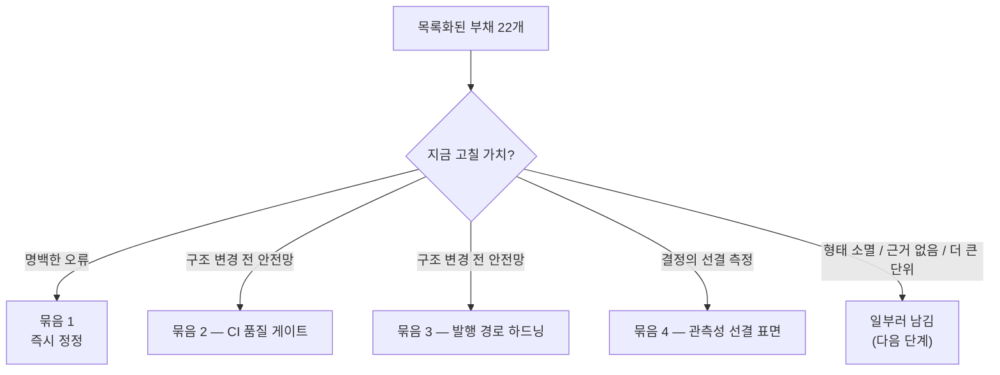

# 부채 해결 회고: MSA로 넘어가기 전에 무엇을 고치고 무엇을 일부러 남겼나  
  
이 글은 대용량 트래픽을 가정한 이커머스 백엔드 프로젝트의 작업 회고다. 단일 애플리케이션(모놀리스)으로 만든 서비스를 여러 서비스로 쪼개는(MSA) 전환을 앞두고, 그 직전에 밀린 기술 부채를 정리한 기록이다.  
  
바로 앞 작업에서 스물두 개의 부채를 목록으로 만들었다. 코드를 남에게 설명하려고 정독하다 보인, 운영 중엔 조용히 잠복하던 결함들이었다. 그런데 목록을 만든 다음 곧장 부딪힌 질문이 있었다.  
  
> 스물두 개를 지금 다 고쳐야 하나?  
  
답은 "아니다"였다. 일부는 서비스를 쪼개는 순간 형태 자체가 사라지고, 일부는 아직 고칠 근거(실측 데이터)가 없으며, 일부는 더 큰 작업에 묶일 때 함께 처리하는 편이 싸다. 그래서 스물두 개에서 **"지금 고칠 가치가 있는 것"만 골라** 네 번의 작업으로 나눠 처리했다. 이 글은 그 선별과 처리 과정의 회고다.  
  
핵심을 먼저 적으면 이렇다. **무엇을 고쳤는가보다, 무엇을 골랐고 무엇을 일부러 남겼는가가 이 작업의 절반이었다.**  
  
---  
  
## 용어  
  
| 용어 | 이 글에서의 의미 |  
| --- | --- |  
| 기술 부채 | 지금 당장은 동작하지만, 방치하면 나중에 더 큰 비용으로 돌아오는 코드·설계·운영상의 미흡함 |  
| 트리아지(triage) | 부채를 "지금 / 나중 / 안 함"으로 분류해 우선순위를 매기는 일. 의료의 환자 분류에서 온 말 |  
| 선해소 | 정식 부채 등록 절차 없이 즉시 고치는 것. 명백한 오류(틀린 문서·쿼리)에 해당 |  
| 품질 게이트(quality gate) | "이걸 통과하지 못하면 합치지 못한다"는 자동 관문. 사람의 양심이 아니라 기계가 강제한다 |  
| 아웃박스(outbox) 패턴 | 메시지를 곧장 외부로 보내지 않고, 우선 자기 DB의 전용 테이블에 업무 데이터와 *같은 트랜잭션*으로 적어 둔 뒤, 별도 작업자가 그걸 읽어 외부로 발행하는 방식. "DB엔 저장됐는데 메시지는 유실"되는 틈을 없앤다 |  
| DLQ (Dead Letter Queue) | 정상 처리에 거듭 실패한 메시지를 따로 모아 두는 별도 큐. 나중에 사람이 들여다보고 수동 재처리한다 |  
| 분산 스케줄러 락 | 같은 주기 작업이 여러 서버 인스턴스에서 *동시에* 도는 것을 막으려고, 한 번에 한 인스턴스만 그 작업을 쥐게 하는 잠금 장치 |  
| 캐시 적중률 | 조회 요청 중 캐시에서 바로 답한 비율. 캐시가 실제로 일하고 있는지를 보여주는 가장 기본 지표 |  
| 게이지(gauge) / 타이머(timer) | 관측 지표의 두 종류. 게이지는 "지금 이 순간의 값"(대기 건수 등), 타이머는 "어떤 일에 걸린 시간과 횟수"(발행 소요 등) |  
  
---  
  
## 이번 글의 질문  
  
1. 스물두 개 중 무엇을 "지금" 고치기로 골랐고, 그 기준은 무엇이었나?  
2. 명백한 오류와 "지금 깔아두면 좋은 하드닝"은 왜 다르게 다뤘나?  
3. "한 줄이면 된다"던 수정이 한 줄이 아니었던 건 어디였고, 왜 그랬나?  
4. 측정 지표를 *결정보다 먼저* 켜두는 게 왜 중요한가?  
5. 무엇을 일부러 다음 단계까지 남겼고, 남기는 것도 결정인 이유는 무엇인가?  
  
---  
  
## 문제 상황: 부채 목록은 "다 고치자"가 되는 순간 무력해진다  
  
부채를 스물두 개나 적어 두면 본능적으로 "하나씩 다 지워나가자"가 된다. 그런데 그렇게 하면 두 가지가 어긋난다.  
  
첫째, **헛수고가 섞인다.** 어떤 부채는 서비스를 쪼개는 과정에서 구조가 바뀌며 *형태 자체가 없어진다*. 예를 들어 "한 트랜잭션이 재고 차감을 감싼다"는 모놀리스 특유의 전제에 기댄 결함은, 주문과 재고가 별도 서비스·별도 DB로 갈라지는 순간 전제가 사라져 같은 모양으로는 존재하지 않게 된다. 그걸 지금 고치면 곧 폐기될 코드에 공을 들이는 셈이다.  
  
둘째, **급한 것과 안 급한 것이 한 표에서 뒤섞인다.** 운영을 당장 막는 결함과, 지금은 무해하고 한참 뒤에야 비용이 드러날 결함을 같은 줄에 두면 우선순위 감각이 무너진다.  
  
그래서 "다 고친다" 대신 **두 가지 기준의 필터**를 먼저 세웠다.  
  
> (a) 방치하면 손해인 **명백한 오류**인가, 아니면  
> (b) 곧 있을 대규모 구조 변경 *전에* 안전망으로 깔아두면 값이 큰가.  
  
이 필터를 통과한 부채를 성격에 따라 네 묶음으로 나눴다.  
  

  
아래 네 절이 각 묶음이고, 마지막에 "남긴 것"을 따로 본다.  
  
---  
  
## 묶음 1 — 명백한 오류는 절차 없이 바로 고친다  
  
부채를 다루는 흔한 형식주의가 있다. "모든 변경은 티켓을 끊고, 검토를 거치고, 이력을 남긴다." 좋은 규율이지만, **틀린 문서 한 줄이나 잘못된 쿼리 한 줄에까지 그 절차를 씌우면 의식(ritual)만 남고 얻는 게 없다.** 명백한 오류는 정식 부채 등록 없이 바로 고치는 편이 맞다. 이 묶음이 그렇다.  
  
세 가지가 여기 있었다.  
  
- **비용 정리 스크립트와 문서의 불일치.** 부하 테스트가 끝나면 클라우드 자원을 지워야 하는데, 삭제 절차를 적은 문서와 실제 정리 스크립트의 인자(자원 위치·이름)가 서로 달랐다. 문서대로 실행하면 일부 자원이 *안 지워진 채 과금이 계속*된다. 런타임 에러도, 빨간 경고도 없이 매달 청구서로만 드러나는 종류의 결함이다. 문서가 단일 진입점(정리 스크립트 그 자체)을 가리키도록 맞췄다.  
- **부하 검증 SQL의 조인 결함.** 취소·실패한 주문을 합계에서 걸러야 하는 상태 필터가, 두 테이블을 잇는 조인(LEFT JOIN)의 연결 조건 쪽에 들어가 있었다. 이 위치에서는 필터가 무력화돼 *걸러내야 할 주문까지 합산*될 수 있다. 검증 SQL 자체가 틀리면 그 위에서 내린 "정합성 PASS" 판정 전체가 흔들린다. 필터를 결과를 거르는 올바른 자리로 옮겼다.  
- **부하 리포트의 CPU 해석 오류.** "CPU 400%"를 노드 전체 기준으로 잘못 읽어, 마치 노드가 한계에 다다른 것처럼 서술돼 있었다. 실제로는 컨테이너에 할당한 자원 요청량 기준의 수치였다. 같은 숫자라도 기준을 틀리면 결론(병목이 어디인가)이 뒤집힌다. 문구를 바로잡았다.  
  
세 가지의 공통점은 **운영 중에 시끄럽게 터지지 않는다**는 것이다. 그래서 우선순위가 낮아 보이지만, 비용 누수처럼 방치 비용이 실재하는 경우가 섞여 있다. "조용한 결함"이라고 안 급한 결함은 아니다.  
  
---  
  
## 묶음 2 — 구조가 N배로 늘기 전에 검증 관문을 세운다  
  
코드를 합치는 파이프라인(CI)은 테스트를 돌리고 있었다. 그런데 *돌리는 것*과 *강제하는 것*은 다르다. 세 군데에 구멍이 있었다.  
  
- 테스트가 빨간불이어도 기계적으로 합치기를 막지 못했다. 결국 사람의 주의력에 기댄다.  
- 합치기 전에 실행 이미지(Docker)를 빌드·기동해 보는 단계가 없었다. 이미지 빌드 설정이 깨져도 합친 *뒤에야* 드러난다.  
- 배포 설정 파일에서 자원이 속할 공간(네임스페이스) 지정이 빠져도 걸러내는 검사가 없었다. 엉뚱한 공간으로 새어 나갈 수 있다.  
  
이걸 지금 고친 이유는 단순하다. **곧 서비스가 여러 개로 쪼개지면 이 구멍도 그 수만큼 늘어난다.** 관문은 대상이 적을 때 세워야 싸다. 하나일 때 한 번 만들어 두면 열 개로 늘어도 그 위에서 동작하지만, 열 개가 된 뒤에 세우면 열 번을 손봐야 한다.  
  
처리는 세 가지였다.  
  
1. 합치기 전 단계에서 실제 이미지를 빌드하고, 컨테이너를 띄운 뒤 상태 점검 엔드포인트가 정상(200)을 반환하는지까지 확인하는 가벼운 점검(smoke test)을 넣었다.  
2. 주요 검사를 통과하지 못하면 합치기 자체가 막히도록, 저장소의 보호 규칙으로 그 검사를 *필수*로 지정했다. 사람이 무시할 수 있는 권고에서, 무시할 수 없는 관문으로 바뀐다.  
3. 배포 설정을 실제로 렌더링해 보고 네임스페이스 누락을 걸러내는 검사를 파이프라인에 추가했다.  
  
이 묶음은 새 기능을 더하지 않는다. 대신 **"검증했다"는 자기 보고를 "기계가 검증했다"로 바꾼다.** 구조가 커지기 전에 해두는 게 핵심이다.  
  
---  
  
## 묶음 3 — "한 줄"이라 적어 둔 것이 한 줄이 아니었던 곳  
  
이 묶음이 이번 작업에서 가장 많이 배운 곳이다. 목록을 만들 때는 "수정 규모: 한 줄"이라 적어 뒀는데, 막상 손대 보니 한 줄이 아니었다.  
  
먼저 배경을 짧게. 주문·결제 같은 사건을 다른 부분에 알릴 때, 메시지를 곧장 외부로 쏘지 않는다. 우선 업무 데이터와 *같은 트랜잭션*으로 자기 DB의 전용 테이블(아웃박스)에 적어 두고, 별도의 주기 작업자가 그 테이블을 읽어 메시지 브로커로 발행한다. "DB엔 저장됐는데 메시지 전송은 실패"하는 틈을 없애기 위한 구조다. 여기에 두 결함이 있었다.  
  
**첫째, DLQ 발행을 확정하지 않았다 — 이건 정말 한 줄이었다.**  
  
소비 측에서 거듭 처리에 실패한 메시지는 따로 빼두는 별도 큐(DLQ)로 보낸다. 그런데 *그 DLQ로 보내는 것조차 실패*할 때, 결과를 확인하지 않으면 메시지가 원래 자리에서도 빠지고 DLQ에도 안 들어가 *양쪽에서 사라질* 수 있다. 발행 결과를 반드시 확인하도록 설정 한 줄을 켜는 것으로 해결됐다. 목록의 추정이 맞았던 경우다.  
  
**둘째, 발행 동기 대기에 타임아웃이 없었다 — 여기가 함정이었다.**  
  
주기 작업자가 메시지를 브로커로 보내고 그 응답을 기다리는데, 기다리는 시간에 상한이 없었다. 브로커가 무응답이면 그 작업 스레드가 *영원히 붙잡힌다*. "응답 대기에 타임아웃 인자 하나 주면 끝"이라 생각했는데, 실제로는 세 값이 하나의 부등식으로 맞물려 있었다.  
  
발행은 한 번에 여러 건(배치 100건)을 순서대로 처리한다. 그래서 *건당* 타임아웃을 줘도 *사이클 전체*의 최악 시간은 `건당 타임아웃 × 건수`까지 늘어난다. 건당 6초면 100건은 최악 600초, 즉 10분이다. 문제는 이 주기 작업이 다중 인스턴스에서 중복 실행되지 않도록 **분산 스케줄러 락**을 쥔다는 점이다. 그 락에는 보유 상한(여기선 5분)이 있어, 보유 시간이 그 상한을 넘으면 *락이 먼저 풀린다*. 그럼 같은 작업을 다른 인스턴스가 또 쥐고 같은 배치를 다시 **중복 발행**한다.  
  
```text
[순진한 수정 — 건당 타임아웃만 추가]  
건당 6초 × 100건 = 최악 600초(10분)  
        └ 락 보유 상한 5분을 넘김 → 락이 먼저 풀림  
                └ 다른 인스턴스가 같은 배치 재발행 → 중복  
  
[실제로 필요한 정합]  
건당 타임아웃(6초)  ← 한 건이 무응답으로 매달리는 것을 막음  
        +사이클 상한(4분)    ← 배치 전체 시간을 락 보유 상한(5분) 아래로 묶음  
```
  
그래서 건당 타임아웃과 별개로, **한 사이클 전체에 상한(4분)을 두고 그 시간을 넘기면 남은 건은 다음 사이클로 넘기도록** 작업자 코드를 고쳤다. 핵심은 부등식 `사이클 상한(4분) < 락 보유 상한(5분)`이다. 사이클이 락보다 먼저 끝나야 락이 풀리기 전에 작업을 내려놓고, 그래야 중복 발행 경로가 막힌다.  
  
여기서 배운 것은 두 가지다. 하나는 **정상 경로에선 무해하고 드문 장애 경로에서만 터지는 결함일수록, 수정 규모를 과소평가하기 쉽다**는 것. 평소엔 6초가 아니라 수 밀리초에 끝나니 타임아웃이 있든 없든 똑같아 보인다. 다른 하나는 **타임아웃 같은 안전장치는 혼자 있는 값이 아니라 다른 상한과 한 묶음으로 맞물린다**는 것. 한쪽만 손대면 정합이 깨진다.  
  
---  
  
## 묶음 4 — 결정보다 측정을 먼저 켠다  
  
마지막 묶음은 성격이 다르다. 앞의 셋은 "지금 문제인 것을 고친다"였다면, 이건 "**나중에 내릴 결정을 위해 지금부터 데이터를 쌓는다**"이다.  
  
다음 단계에서 내려야 할 결정이 둘 있다.  
  
- 캐시 의존도를 어디까지 둘 것인가 (캐시가 죽었을 때의 대비를 얼마나 무겁게 할 것인가).  
- 메시지 발행 처리량이 부채인가 아닌가 (지금의 순차 발행 방식을 손볼 만큼 느린가).  
  
두 결정 모두 **실측 데이터**가 있어야 데이터 기반으로 내릴 수 있다. 그런데 그 측정 표면이 없었다. 캐시는 적중률을 노출하는 지표에 연결돼 있지 않았고, 메시지 발행 쪽은 대기 건수·발행 소요·실패율을 볼 지표가 없었다.  
  
여기서 중요한 통찰이 있다. **측정은 결정하는 시점에 켜면 늦다.** 결정할 때 비로소 지표를 켜면 그 순간부터 데이터가 0에서 쌓이기 시작해, 과거 추세가 없다. 측정을 *미리* 켜둬야 결정 시점에 누적된 데이터가 손에 있다. 그래서 고장이 아닌데도 지금 처리했다.  
  
처리는 두 가지였다.  
  
- 캐시 통계를 활성화해 적중률이 자동으로 지표에 노출되도록 했다. 별도의 수동 배선 없이 프레임워크가 제공하는 표준 경로를 켜는 선에서 끝냈다.  
- 메시지 발행 작업자에 두 종류의 지표를 심었다. 지금 이 순간 대기 중인 건수를 보는 **게이지**(`outbox.backlog`, 대기/소진 상태별)와, 발행 한 건에 걸린 시간과 횟수를 성공·실패로 나눠 보는 **타이머**(`outbox.publish`, result=success/failure)다.  
  
이 묶음은 "지금 무엇을 고쳤나"로 보면 작지만, "다음 결정을 데이터로 내릴 수 있게 됐나"로 보면 핵심이다. 측정 없이 내리는 결정은 추측이고, 추측은 그 자체로 새 부채가 된다.  
  
---  
  
## 무엇을 일부러 남겼나 — 안 고치는 것도 결정이다  
  
스물두 개 중 위 네 묶음에 들지 못한 것들은 *못 고친 게 아니라 안 고친 것*이다. 각각 남긴 이유가 분명하다.  
  
| 남긴 것 | 왜 지금이 아닌가 |  
| --- | --- |  
| 누적 테이블 청소(보존) 정책 | 발행 기록·중복 처리 기록 테이블이 무한히 쌓이는 문제. 다만 "얼마나 오래 보관할 것인가"는 중복 방지 판단 기간의 상한과 함께 정해야 하고, 그 결정은 서비스별 DB를 분리할 때 자연스러운 한 작업 단위가 된다 |  
| 캐시 장애 시 우회(fallback) | 캐시가 죽으면 조회를 DB로 떨어뜨리는 복원력 보강. 이건 오류가 아니라 하드닝이다. (a) 방금 켠 적중률 지표로 *발동 빈도*를 먼저 봐야 값을 판단할 수 있고, (b) 캐시가 여러 서비스의 공유 인프라가 될 때 값이 커진다 |  
| 인증 보안 묶음(키 회전·토큰 재사용 탐지 등) | 인증이 앱 내부에서 외부 관문(Gateway)으로 옮겨 가는 순간이 이 부채들의 자연스러운 처리 시점이다. 지금 단독으로 손대면 그 이동 작업에서 다시 건드리게 된다 |  
| 주문 동시성 제어 | 한쪽은 구조 변경으로 형태가 사라지고, 한쪽은 오히려 필수가 된다. 어느 쪽이든 지금이 아니라 분리 시점에 다뤄야 하고, 실측 게이트를 통과해야 손대는 항목도 있다 |  
  
남기는 데에도 규율이 있었다. **"언젠가 좋을 것"은 무한하다.** 개선하고 싶은 것 전부를 부채로 적으면 목록은 의미를 잃는다. 그래서 남긴 것들에 대해 "왜 지금이 아닌가"를 한 줄씩이라도 분명히 적어, *모르고 빠뜨린 것*이 아니라 *알고 미룬 것*이 되도록 했다. 이게 묶음 1(즉시 정정)과 대칭을 이룬다 — 한쪽은 "지금 아니면 이유가 없다", 다른 쪽은 "지금이면 이유가 없다".  
  
---  
  
## 회고 — 네 가지로 정리하면  
  
이번 작업에서 건진 판단 기준을 네 가지로 추린다.  
  
1. **부채 목록은 트리아지가 절반이다.** 스물두 개를 다 고치는 게 아니라, "지금 고칠 가치"라는 필터로 거르는 일이 본 작업만큼 중요했다. 필터가 없으면 곧 사라질 코드에 공을 들이게 된다.  
2. **명백한 오류와 하드닝은 절차를 달리한다.** 틀린 문서·쿼리는 의식 없이 바로 고치고, 복원력 보강은 발동 빈도를 먼저 측정하고서 값을 따진다. 둘을 같은 트랙에 올리면 급한 게 안 급한 것에 밀린다.  
3. **수정 규모 추정은 자주 틀린다.** 특히 정상 경로에선 무해하고 드문 장애 경로에서만 터지는 결함이 그렇다. "한 줄"이라던 발행 타임아웃은 세 값이 맞물린 부등식이었다.  
4. **측정은 결정보다 먼저 켠다.** 결정 시점에 지표를 켜면 데이터가 0부터 시작한다. 미리 켜둬야 그 결정이 추측이 아닌 데이터가 된다.  
  
### 한계 — 이 작업이 아직 증명하지 못한 것  
  
솔직히 적으면, 이번에 처리한 것들의 효과는 *대부분 아직 증명되지 않았다*. 발행 경로 하드닝은 브로커가 실제로 무응답이 되는 분산 환경에서야 값이 드러나고, 측정 표면은 다음 결정을 내리는 시점에야 쓰인다. 즉 지금은 "깔아둔 것"이고, 그 효용은 다음 단계에서 확인된다. 안전망은 평소엔 보이지 않다가 떨어질 때만 존재가 증명되는 종류라, 이 글은 "효과를 봤다"가 아니라 "근거를 갖고 깔았다"까지만 말할 수 있다.  
  
---  
  
## 다음 단계와의 연결  
  
이번 작업의 진짜 수신자는 *다음 단계의 나*다.  
  
- 검증 관문(묶음 2)은 서비스가 여러 개로 늘어날 때 그 위에서 그대로 동작한다. 늘어난 뒤에 만들지 않아도 된다.  
- 발행 경로 하드닝(묶음 3)은 단일 DB의 트랜잭션이 받쳐줄 때는 드문 장애 대비였지만, 서비스가 쪼개져 보상 흐름이 정합성의 중심이 되면 *없으면 보상이 새는* 필수 안전장치로 격상된다.  
- 측정 표면(묶음 4)은 다음 결정들이 데이터 위에서 내려지도록 미리 깔아 둔 바닥이다.  
- 남긴 부채들(보존 정책·캐시 우회·보안·동시성)은 각자 묶일 다음 작업이 정해져 있다. 그 작업에 흡수된다.  
  
---  
  
## 가져가는 한 문장  
  
> 부채 목록을 만드는 일과 부채를 줄이는 일 사이에는, **무엇을 고르고 무엇을 남길지 정하는 일**이 있다.  
> 스물두 개를 다 고치는 게 성숙이 아니다. 지금 고칠 넷을 고르고, 나머지 열여덟에 "왜 지금이 아닌가"를 적어 두는 것이 성숙이다.  
> 그리고 그렇게 깔아 둔 안전망의 값어치는, 다음 단계에서 그것이 받쳐 줄 때 비로소 증명된다.
