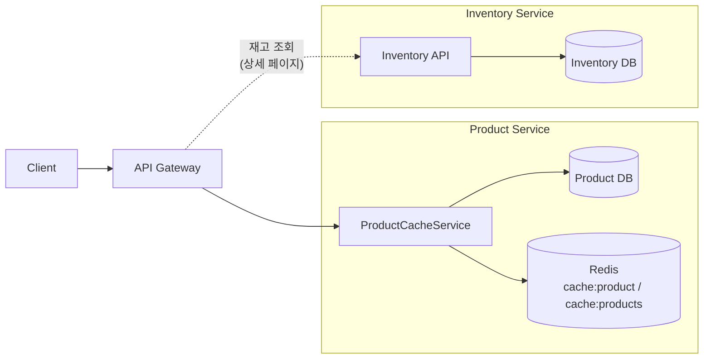

Phase 1을 끝낸 시점의 PeekCart는 모든 요청이 MySQL을 친다. 상품 목록도, 상품 상세도, 그 안에 들어있는 카테고리 조인도 매번 DB로 간다. 부하가 낮을 때는 문제가 아니지만, 상품 페이지는 이커머스에서 가장 자주 호출되는 엔드포인트다. 한 명의 사용자가 한 번 구매하기 전까지 목록과 상세를 수십 번씩 왔다 갔다 한다. Phase 2의 첫 번째 과제(Task 2-1)는 이 트래픽을 Redis 뒤로 옮기는 일이었다. 이번 글에서는 그 작업이 어떤 결정의 연속이었는지를 정리한다.

이 글에서 사용하는 용어는 다음 뜻으로 읽으면 된다.

| 용어                 | 이 글에서의 의미                                                                                       |
| ------------------ | ---------------------------------------------------------------------------------------------- |
| Cache Aside        | 애플리케이션이 "캐시 조회 → 미스면 DB 조회 → 결과를 캐시에 적재"의 순서로 캐시를 직접 다루는 패턴. Read-Through/Write-Through와 구분됨 |
| TTL                | Time To Live. 캐시 엔트리가 자동 만료되는 시간                                                                |
| 캐시 적중률             | 전체 조회 중 캐시에서 응답된 비율 (cache hit / (cache hit + cache miss))                                     |
| `@Cacheable`       | Spring Cache 추상화의 어노테이션. AOP 프록시가 호출을 가로채 캐시 조회/적재를 자동화                                       |
| `@CacheEvict`      | 캐시 엔트리를 명시적으로 무효화하는 어노테이션. `allEntries = true`는 해당 캐시 전체 flush                                |
| Self-invocation 문제 | 같은 빈 내부에서 메서드를 호출하면 AOP 프록시를 거치지 않아 `@Cacheable` 등이 동작하지 않는 Spring AOP의 구조적 한계               |
| `NoOpCacheManager` | Spring이 제공하는 "캐시처럼 행동하지만 아무것도 저장하지 않는" 캐시 매니저. 부하 테스트 baseline 측정에 사용                         |

이번 학습에서 확인하고 싶은 질문은 다음과 같다.

1. 왜 상품 캐시에 재고를 같이 넣지 않았는가?
2. 같은 빈 안에서 `@Cacheable`을 호출하면 왜 동작하지 않는가? 그 해결책으로 빈을 분리한 의미는 무엇인가?
3. 목록 캐시를 "키 하나씩" 무효화하지 않고 `allEntries = true`로 통째로 비운 이유는 무엇인가?
4. `Page<T>`를 Redis에 직렬화하지 못해서 등장한 `CachedPage` 래퍼는 어떤 트레이드오프인가?
5. 캐시 ON에서 목표 3배에 못 미친 ×2.31이 왜 실패가 아닌가?

---

## 문제 상황: 같은 SELECT가 1초에 수백 번

상품 목록 조회는 페이지네이션과 카테고리 필터를 받아 `products WHERE status = 'ON_SALE'`을 페이징으로 잘라 반환한다. 상세 조회는 PK 한 건 SELECT에 카테고리 조인이다. 둘 다 변경 빈도가 낮은 데이터를 다룬다. 상품의 이름, 가격, 설명이 1초에 한 번 바뀌는 일은 없다. 관리자가 가끔 새 상품을 등록하거나 가격을 수정할 뿐이다.

읽기는 잦고, 데이터는 거의 안 바뀐다. 캐시를 도입할 자리는 분명하다. 다만 두 가지 결정이 남는다. **어떤 캐싱 패턴을 쓸 것인가**, 그리고 **캐시 경계를 어디에 그을 것인가**. 두 결정을 차례로 짚는다.

---

## Cache Aside를 선택한 이유

캐시를 도입하는 방법은 하나가 아니다. 애플리케이션과 캐시·DB의 책임을 어떻게 나누느냐에 따라 표준화된 몇 가지 패턴이 있고, 각자 다른 트레이드오프를 가진다.

| 패턴 | 읽기 | 쓰기 | 캐시를 다루는 주체 |
| --- | --- | --- | --- |
| Cache Aside (Lazy Loading) | 앱이 캐시 조회 → 미스면 앱이 DB 조회 → 앱이 캐시 적재 | 앱이 DB 갱신 → 앱이 캐시 invalidate | 애플리케이션 |
| Read-Through | 앱이 캐시에만 요청. 미스 시 캐시 라이브러리가 자기 backend loader로 DB 조회 후 적재 | (별도 결정) | 캐시 라이브러리 |
| Write-Through | (보통 Read-Through와 동반) | 앱이 캐시에 쓰면 캐시 라이브러리가 동기로 DB까지 반영 | 캐시 라이브러리 |
| Write-Behind (Write-Back) | (별도 결정) | 앱이 캐시에 쓰면 캐시가 비동기로 DB에 flush | 캐시 라이브러리 |
| Write-Around | (Read-Through와 동반) | 앱이 DB에만 쓰고 캐시는 건드리지 않음. 다음 read의 미스로 자연 적재 | 애플리케이션 + 캐시 |

PeekCart가 Cache Aside를 택한 이유는 네 가지로 정리된다.

1. **읽기/쓰기 비대칭이 극단적이다**. 상품 조회는 1초에 수백 건, 변경은 관리자 작업이라 하루 수십 건 수준. Write-Through나 Write-Behind는 "쓰기마다 캐시도 갱신한다"는 비용을 전제로 하는데, 우리 쓰기 대부분은 그 직후 읽힐 데이터가 아니다. 차라리 다음 read 시점의 cache miss로 자연 적재되는 게 효율적이다.
2. **무효화 영향 범위가 도메인 지식이다**. 상품 한 건이 수정되면 그 상품의 상세 캐시 한 줄 + 모든 페이지의 목록 캐시가 영향을 받는다(뒤의 `allEntries = true` 절). 이 범위는 도메인이 결정해야 하는데, Read-Through/Write-Through는 캐시 라이브러리에 read/write 책임을 위임하는 구조라 "이 변경이 어떤 키들에 파급되는가"라는 도메인 결정이 끼어들 자리가 좁다. Cache Aside는 갱신/무효화를 애플리케이션이 명시적으로 한다는 점이 오히려 장점이다.
3. **Write-Behind의 정합성 리스크를 받아들일 수 없다**. 상품 정보는 변경이 드물지만, 한 번 바뀌면(예: 가격 수정) 그 순간부터 정확해야 한다. Write-Behind는 "DB 반영이 늦어지는 사이 다른 인스턴스(또는 Phase 4의 다른 서비스)가 옛 DB를 읽는" 윈도우를 만든다. "캐시가 사라져도 DB가 진실"이라는 단순한 정합성 모델을 깨지 않으려면 동기 쓰기가 안전하다.
4. **Spring Cache 추상화와 자연스럽게 맞물린다**. `@Cacheable` + `@CacheEvict`는 사실상 Cache Aside의 문법적 설탕이다. Read-Through를 흉내내려면 별도 캐시 라이브러리(Redisson local cache, Caffeine `LoadingCache` 등)를 끼우거나 `RedisTemplate`를 직접 다뤄야 하고, 추가 의존성과 추가 추상화 표면이 따라온다. 같은 효과를 어노테이션 두 종류로 끝낼 수 있는 길을 일부러 돌아갈 이유가 없다.

요약하면 PeekCart의 워크로드는 **읽기 우세 + 무효화 도메인 의존 + 강한 정합성 요구**의 셋 조합이고, 이 셋을 가장 잘 받아내는 패턴이 Cache Aside다. Write-Around("쓰기는 DB만, 캐시는 다음 read로 채움")도 결과적으로 매우 비슷하지만, 본격적으로 Write-Around로 부르려면 Read-Through 인프라가 깔려 있어야 한다. 우리는 그 인프라를 끌어들이지 않았으므로 "Cache Aside + 쓰기 시 명시적 evict"로 분류하는 게 정확하다.

남은 결정 하나. **캐시 경계를 어디에 긋느냐**가 두 번째 절의 주제다.

---

## ProductCacheService: 상품 정보만, 재고는 빼고

상품 조회 캐싱을 담당하는 `product/application/ProductCacheService.java`는 두 메서드만 가진다.

```java
@Service
@Transactional(readOnly = true)
@RequiredArgsConstructor
public class ProductCacheService {

    private final ProductRepository productRepository;

    @Cacheable(cacheNames = "product", key = "#productId")
    public ProductInfoDto getProductInfo(Long productId) {
        Product product = productRepository.findById(productId)
                .orElseThrow(() -> new ProductException(ErrorCode.PRD_001));
        return ProductInfoDto.of(product);
    }

    @Cacheable(cacheNames = "products",
            key = "'list:' + #categoryId + ':' + #pageable.pageNumber + ':' + #pageable.pageSize")
    public CachedPage<ProductListDto> getProductList(Long categoryId, Pageable pageable) {
        Page<Product> page;
        if (categoryId != null) {
            page = productRepository.findByCategoryIdAndStatus(categoryId, ProductStatus.ON_SALE, pageable);
        } else {
            page = productRepository.findByStatus(ProductStatus.ON_SALE, pageable);
        }
        return CachedPage.of(page.map(ProductListDto::of));
    }
}
```

반환 타입이 `ProductDetailDto`가 아니라 `ProductInfoDto`다. `Info`에는 재고가 없다. 재고는 호출자인 `ProductQueryService`에서 별도로 조회한다.

```java
public ProductDetailDto getProduct(Long productId) {
    ProductInfoDto info = productCacheService.getProductInfo(productId);
    int stock = inventoryRepository.findByProductId(productId)
            .map(Inventory::getStock)
            .orElse(0);

    return new ProductDetailDto(
            info.id(), info.categoryId(), info.categoryName(),
            info.name(), info.description(), info.price(),
            info.imageUrl(), info.status(), stock);
}
```

캐시 hit이 나도 재고 한 줄은 DB로 간다. 얼핏 보면 "그러면 캐시가 무슨 의미인가" 싶지만, 사라진 비용을 따져보면 분명하다. `products` 테이블 + `categories` 조인이 사라지고, 남은 것은 `inventory`의 PK 단건 조회(`WHERE product_id = ?`)다. 인덱스를 탄 PK 조회는 ~1ms이고, DTO 매핑이 빠진다. 반면 캐시에 재고를 함께 넣었다면 주문 한 건마다 캐시를 무효화해야 한다.

재고 변경 빈도와 상품 정보 변경 빈도가 100배 이상 차이 나는데, 둘을 같은 캐시 엔트리에 묶으면 캐시 적중률이 재고의 변경 빈도 쪽으로 끌려간다. "캐시 경계를 변경 빈도가 비슷한 데이터끼리 묶는다"는 원칙이 여기서 자연스럽게 적용된다.

---

## 같은 빈에서 호출하면 왜 안 되는가, 빈을 둘로 쪼갠 이유

`ProductCacheService`가 별도 빈으로 분리되어 있는 게 의아할 수 있다. `ProductQueryService` 안에 두 메서드를 두고 그냥 `@Cacheable`을 붙이면 안 되는가? 처음에는 그렇게 시작했다. 그런데 통합 테스트에서 캐시가 비어 있는 채로만 통과했다. 두 번째 호출도 매번 DB를 쳤다.

원인은 Spring AOP의 self-invocation였다. `@Cacheable`은 AOP 프록시가 메서드 호출을 가로채야 동작한다. 외부 빈이 `productQueryService.getProduct()`를 호출하면 프록시 경유가 보장되지만, `getProduct()` 내부에서 같은 빈의 다른 메서드 `cacheableHelper()`를 호출하면 그건 프록시가 아닌 `this`를 통한 직접 호출이다. AOP가 끼어들 자리가 없다.

해결책 후보는 두 가지였다. 하나는 `@Autowired`로 자기 자신을 주입받는 self-injection. 다른 하나는 캐시 호출만 담당하는 별도 빈으로 분리. 후자를 선택했다. self-injection은 "내가 나를 주입한다"는 표현이 도메인적으로 어색하고, 캐시가 들어가는 메서드를 한 곳에 모으면 캐시 정책의 표면이 좁아진다. `ProductCacheService` 파일 하나만 보면 "어떤 키로 무엇이 캐시되는가"가 끝난다.

레이어 관점에서도 자연스럽다. `ProductQueryService`는 "상품 + 재고를 조합해서 상세를 만든다"는 비즈니스 책임이고, `ProductCacheService`는 "캐시 어느 키 아래에 어떤 DTO를 둔다"는 기술적 책임이다. 둘이 한 클래스 안에서 섞이지 않는 게 읽기에도 편하다.

---

## 키 설계: 무엇으로 캐시를 나누는가

상세 캐시는 `key = "#productId"`로 충분하다. 같은 상품에 대해 한 줄이다.

목록 캐시는 조금 복잡하다. `key = "'list:' + #categoryId + ':' + #pageable.pageNumber + ':' + #pageable.pageSize"`. `categoryId`, `pageNumber`, `pageSize`의 조합마다 별도 엔트리다. `pageable`을 통째로 키로 쓰지 않은 이유가 있다. `Pageable`의 기본 `toString()`은 Sort 정보까지 포함하는데, 컨트롤러에서 `@PageableDefault`로 고정 정렬만 허용하는 현재 설계에서는 Sort가 키에 들어갈 의미가 없다. 명시적으로 필요한 필드만 키에 끌어다 놓으면 키 카디널리티가 통제 가능한 범위에 머문다.

핵심 캐시별 설정은 `CacheConfig`에 모여 있다.

```java
RedisCacheConfiguration defaultConfig = RedisCacheConfiguration.defaultCacheConfig()
        .serializeKeysWith(...StringRedisSerializer())
        .serializeValuesWith(...GenericJackson2JsonRedisSerializer(objectMapper))
        .prefixCacheNameWith("cache:")
        .entryTtl(Duration.ofMinutes(10))
        .disableCachingNullValues();

RedisCacheConfiguration productDetailConfig = defaultConfig
        .entryTtl(Duration.ofMinutes(30));
```

- **`prefixCacheNameWith("cache:")`**: 기존 JWT 블랙리스트(`bl:`)나 Grace Period(`gp:`)와 네임스페이스가 섞이지 않도록 분리한다. Redis는 하나의 인스턴스를 여러 용도로 공유하기 쉬워서 키 프리픽스의 충돌이 운영 사고로 이어진다. 처음부터 다르게 둔다.
- **TTL 분리**: 상세는 30분, 목록은 10분. 목록 캐시는 상품 등록/삭제 시점에 통째로 evict되기 때문에 TTL이 짧아도 손해가 크지 않다. 반면 상세 캐시는 키별 evict가 가능해서 더 오래 들고 있어도 안전하다.
- **`disableCachingNullValues()`**: 존재하지 않는 상품 ID로 조회가 들어왔을 때 `null`을 캐시에 박아두지 않는다. 잘못된 ID 무한 호출이 캐시에 쌓이는 케이스를 막는다.

---

## 무효화: 왜 `allEntries = true`인가

쓰기 경로의 캐시 무효화는 `ProductCommandService`에 어노테이션으로 박혀 있다.

```java
@CacheEvict(cacheNames = "products", allEntries = true)
public ProductDetailDto create(CreateProductCommand command) { ... }

@Caching(evict = {
        @CacheEvict(cacheNames = "product", key = "#productId"),
        @CacheEvict(cacheNames = "products", allEntries = true)
})
public ProductDetailDto update(Long productId, UpdateProductCommand command) { ... }

@Caching(evict = {
        @CacheEvict(cacheNames = "product", key = "#productId"),
        @CacheEvict(cacheNames = "products", allEntries = true)
})
public void delete(Long productId) { ... }
```

상세 캐시는 PK 하나만 골라서 evict한다. 깔끔하다. 그런데 목록 캐시는 전부 비운다. 왜 이렇게 거친가?

목록 캐시 키는 `categoryId × pageNumber × pageSize`의 조합이다. 상품 한 개를 수정했을 때, 그 상품이 영향을 주는 페이지가 어디인지 정확히 계산할 수 없다. 가격이 바뀌어 정렬 순서가 달라지면 모든 페이지가 영향을 받는다. 카테고리가 바뀌면 두 카테고리의 모든 페이지가 영향을 받는다. 페이지별로 핀포인트 evict를 시도하면 누락이 생긴다.

대안 둘이 있다.

1. **세밀한 키 무효화**: 영향 범위를 도메인 로직으로 추론해서 필요한 키만 지운다. 정확성이 높지만, 정렬·필터·페이지네이션 조합이 늘어날 때마다 무효화 로직이 따라가야 한다.
2. **전체 flush**: 그냥 `products` 캐시 전체를 비운다. 거칠지만 안전하다. 트레이드오프는 다음 조회들이 캐시 미스를 한 번씩 겪는다는 것.

상품 변경은 관리자 작업이고 빈도가 낮다. 반면 조회는 1초에 수백 건이다. 관리자 변경 빈도가 조회 빈도에 비해 수십 분의 일 이하라는 비대칭이 있는 한, 관리자가 상품 하나를 등록할 때 다음 짧은 구간의 캐시 미스를 받아들이는 게, "복잡한 무효화 로직을 만들고 그게 정확한지 영원히 의심하는 것"보다 낫다. 정확성이 분명한 게 이길 때다.

---

## CachedPage: `Page<T>` 직렬화 우회

`getProductList`의 반환 타입이 `Page<ProductListDto>`가 아니라 `CachedPage<ProductListDto>`다. 이유는 단순하지만 거치지 않으면 막힌다.

Spring Data의 `PageImpl`은 Jackson이 역직렬화할 표준 방법이 없다. 캐시에 넣을 때까지는 잘 들어가지만, 다시 꺼내려고 하면 역직렬화가 실패한다. 해결 후보는 셋이었다.

1. `PageImpl`을 Jackson이 다룰 수 있게 커스텀 직렬화기를 만든다. 외부 라이브러리 내부 구조에 의존해서 깨지기 쉽다.
2. `Page`를 풀어서 `List<T>`만 캐시하고 페이징 메타는 매번 재계산한다. totalElements를 캐시 밖에서 다시 구해야 해서 의미가 없다.
3. `Page` → 직렬화 친화적인 record → `Page`로 왕복한다.

세 번째를 택했다. `global/cache/CachedPage`는 33줄짜리 record다.

```java
public record CachedPage<T>(
        List<T> content,
        long totalElements,
        int pageNumber,
        int pageSize
) {
    public static <T> CachedPage<T> of(Page<T> page) { ... }

    public Page<T> toPage() {
        return new PageImpl<>(
                content,
                PageRequest.of(pageNumber, pageSize),
                totalElements);
    }
}
```

캐시 경계에서만 사는 타입이고, `ProductQueryService`가 `toPage()`로 즉시 풀어준다. 외부 컨트롤러에서는 여전히 `Page<ProductListDto>`만 보인다. 캐시 레이어의 기술 부채를 한 파일로 가두는 작은 트릭이다.

---

## NoOpCacheManager: 부하 테스트 baseline 측정 장치

`CacheConfig`에는 일반적이지 않은 두 번째 빈이 있다.

```java
@Bean
@ConditionalOnProperty(name = "peekcart.cache.enabled", havingValue = "true", matchIfMissing = true)
public RedisCacheManager cacheManager(...) { ... }

@Bean
@ConditionalOnProperty(name = "peekcart.cache.enabled", havingValue = "false")
public CacheManager noOpCacheManager() {
    return new NoOpCacheManager();
}
```

`peekcart.cache.enabled=false`로 띄우면 Spring의 `NoOpCacheManager`가 주입된다. `@Cacheable` 어노테이션은 그대로 살아 있지만, 모든 호출이 pass-through가 되어 매번 메서드 본문이 실행된다. 코드를 한 줄도 바꾸지 않고 캐시를 통째로 끄는 스위치다.

이게 왜 필요했는가? Phase 3 부하 테스트(16편)에서 캐시 ON/OFF의 TPS 차이를 측정해야 했다. "캐시가 효과 있다"는 주장을 수치로 증명하려면, 그 주장의 반대 조건(캐시 없음)을 같은 환경에서 같은 부하로 측정해야 한다. 코드를 분기하면 분기 자체가 변수가 된다. 같은 이미지에 환경변수만 바꿔서 rollout하는 방식이 비교 가능성을 보장한다.

`@ConditionalOnProperty(matchIfMissing = true)`로 두어 운영 기본값은 캐시 ON이다. 환경변수가 누락된 사고로 캐시가 꺼지는 일은 없다.

---

## 한계와 트레이드오프

### "Stale read"가 가능한 짧은 창

업데이트가 트랜잭션 안에서 일어나고 `@CacheEvict`는 메서드 종료 시점에 동작한다. 트랜잭션 커밋과 캐시 evict 사이에는 짧은 시간차가 있다. 그 사이에 다른 요청이 캐시를 채워 넣으면, 새로 채워진 엔트리는 곧바로 evict 대상이 된다. 결과적으로는 또 한 번의 조회가 DB로 가지만, 사용자 입장에서 "갱신 직후 옛날 데이터를 본다"는 일은 거의 없다. 거의 모든 경우 evict가 충분히 일찍 일어난다. 이 부분은 `@Transactional`과 `@CacheEvict`의 순서를 정밀하게 통제하려면 `TransactionSynchronization`을 끼워 넣어야 하는데, 현재 규모에서는 그 복잡도가 정당화되지 않는다.

### 캐시 적중률을 메트릭으로 보지 않는다

지금 코드에는 캐시 hit/miss를 카운트하는 메트릭이 없다. Spring Boot Actuator의 `cache.*` 메트릭을 활성화하면 `CacheMeterBinder`가 자동으로 hit/miss 카운터를 만들어주지만, 현재 `MetricsConfig`(15편)에는 등록되어 있지 않다. 부하 테스트에서는 nGrinder의 TPS 차이로 캐시 효과를 보지만, 운영 중인 캐시 적중률을 실시간으로 확인할 표면이 비어 있다. Phase 4에서 캐시가 서비스 경계에 걸치게 되면 이 메트릭이 필요해진다.

### Redis 장애에 무방비

Redis가 다운되면 `@Cacheable` 호출이 `RedisConnectionFailureException`을 던지고 그대로 위로 올라온다. 사용자는 상품 조회 자체가 실패한다. 이상적으로는 캐시 장애 시 DB 직조회로 자동 fallback이 있어야 하지만(9편의 분산 락 fallback과 같은 구조), 조회 캐시에는 아직 그 안전장치가 없다. Redis가 죽으면 트래픽이 통째로 DB로 떨어진다는 점도 같이 고려해야 한다(thundering herd). 이 부분은 명시적으로 "남은 부채"로 두고 다음 Phase에서 다룰 영역이다.

### 의도적으로 안 한 것

- **재고 캐싱**: 변경 빈도 차이 때문에 의도적으로 제외. PK 단건 조회로 충분.
- **목록 캐시의 정밀 무효화**: `allEntries = true`로 단순화. 관리자 작업의 저빈도가 이 결정을 정당화한다.
- **2-level 캐시(로컬 + Redis)**: Caffeine을 앞단에 두는 흔한 패턴. 현재 규모에서는 Redis 단일 계층이 충분하고, 멀티 Pod 환경에서 로컬 캐시 일관성 문제를 새로 만들지 않는다.

---

## 통합 테스트로 검증된 것

`ProductCacheIntegrationTest`는 Testcontainers로 MySQL + Redis + Kafka를 띄우고 캐시 동작을 5건의 테스트로 검증한다.

1. **상세 조회 캐시 적중**: 첫 호출 후 `cacheManager.getCache("product").get(productId)`가 not null. 두 번째 호출이 같은 결과 반환.
2. **목록 조회 캐시 적중**: `cacheManager.getCache("products").get("list:null:0:10")`로 직접 키 확인.
3. **상품 수정 시 양쪽 캐시 evict**: `update` 호출 후 두 키 모두 null. 다시 조회하면 갱신된 데이터.
4. **상품 삭제 시 양쪽 캐시 evict**: `delete`도 동일하게 두 캐시 모두 비운다는 사실을 명시 검증.
5. **상품 등록 시 목록 캐시 evict**: 새 상품이 다음 조회에 포함되는지까지 확인.

핵심은 `CacheManager.getCache().get(key)`로 캐시 상태를 직접 들여다본다는 점이다. "두 번째 호출이 빠르더라" 같은 간접 신호가 아니라, Redis에 실제 엔트리가 있는지/없는지를 비교한다. 캐시 통합 테스트는 자칫 "DB가 같은 결과를 두 번 돌려준다"는 사실로 만족하기 쉬워서, 캐시 매니저를 직접 들여다보는 검증이 의미가 있다.

`setUp()`에서 `commandService.create(...)`가 목록 캐시를 evict하는 부수효과까지 의식해서, 테스트 시작 전 `cleanCaches(cacheManager)`를 한 번 더 호출한다. 캐시 어노테이션이 트랜잭션 경계 밖에서 동작하면 테스트가 미묘하게 어긋날 수 있다는 신호다.

---

## 자료는 어떤 질문에 연결해서 읽을까

| 질문                                          | 같이 읽을 자료                                                                                                                | 이 글에서 연결되는 지점                       |
| ------------------------------------------- | ----------------------------------------------------------------------------------------------------------------------- | --------------------------------- |
| Spring `@Cacheable`이 내부 호출에서 동작하지 않는 이유?    | Spring Framework 공식 문서, [Understanding AOP Proxies](https://docs.spring.io/spring-framework/reference/core/aop/proxying.html) | `ProductCacheService` 별도 빈 분리     |
| Cache Aside / Read-Through / Write-Behind 패턴 비교? | Martin Kleppmann, *Designing Data-Intensive Applications* Ch.1 "Caching" 절 / AWS Caching Best Practices | "Cache Aside를 선택한 이유" 전체           |
| `RedisCacheManager`의 키 직렬화·TTL·prefix 옵션?   | Spring Data Redis 공식 문서, [Cache Configuration](https://docs.spring.io/spring-data/redis/reference/redis/redis-cache.html) | `CacheConfig`의 `defaultConfig` 구성 |
| `Page<T>`를 Redis에 직렬화하는 표준 방법?              | Spring Data Commons 이슈 트래커의 `PageImpl` 직렬화 관련 PR 논의                                                                    | `CachedPage` 래퍼 결정                |
| 캐시 적중률을 실시간으로 보는 표면 만들기?                    | Micrometer `CacheMeterBinder` 문서, Spring Boot Actuator `cache.*` 메트릭                                                    | "캐시 적중률을 메트릭으로 보지 않는다" 절          |
| 캐시 무효화의 두 가지 어려움(naming / invalidation)?    | Phil Karlton, "There are only two hard things..." 인용 맥락 / Mnesia·Hibernate cache invalidation 문서                       | `allEntries = true` 결정 정당화        |

---

## Phase 4 MSA에서는 어떻게 바뀌는가

상품 캐시는 Phase 4에서 Product Service의 안쪽으로 이동한다. 핵심 데이터(`products`, `categories`)가 Product Service의 DB로 떨어지고, 그 서비스가 자기 캐시를 들고 있는다.



**그대로 가는 것**

- Cache Aside 패턴 자체. 캐시 hit이 나도 재고는 별도 서비스 호출. 현재 `inventoryRepository` 호출이 `InventoryClient`(HTTP 또는 gRPC) 호출로 바뀔 뿐, "상품 캐시에 재고를 넣지 않는다"는 결정은 더 명확한 이유를 갖는다. 이제는 다른 서비스의 데이터가 되었다.
- `@Cacheable` + `@CacheEvict` 어노테이션 기반 구현, `CachedPage` 래퍼, TTL 설정. 다 그대로다.

**바뀌는 것**

- **상세 페이지 조립이 Gateway 또는 BFF로 이동할 수 있다**. 현재는 `ProductQueryService.getProduct()`가 캐시된 상품 정보와 라이브 재고를 한 메서드 안에서 조립한다. 서비스 분리 후 이 조립을 어디서 할지는 별도 결정이다. Gateway에서 두 호출을 합치면 클라이언트 한 번에 응답을 줄 수 있지만, Gateway에 도메인 결합이 생긴다. Product Service가 Inventory Service를 동기 호출하면 책임은 분명하지만, 한 서비스의 장애가 다른 서비스의 응답을 막는다.
- **캐시 인스턴스의 소유권**. 현재는 하나의 Redis를 JWT 블랙리스트, 분산 락(9편), 상품 캐시가 공유한다. `prefixCacheNameWith("cache:")`로 네임스페이스만 분리한 상태다. Phase 4에서는 Product Service 전용 Redis로 분리하느냐, 공유하되 ACL과 키 프리픽스로만 격리하느냐가 결정 사항이다.
- **이벤트 기반 무효화 가능성**. 현재 무효화는 `ProductCommandService`가 직접 `@CacheEvict`로 한다. 서비스가 분리되면 `product.updated` 이벤트를 받아서 다른 서비스의 캐시도 무효화하는 패턴이 가능해진다. 다만 이는 캐시를 들고 있는 서비스가 둘 이상이 될 때만 의미가 있다.

**그래서 Phase 4 진입 전 짚을 점**

- 상품 캐시 코드 자체는 분리하기 쉽다. 캐시 어노테이션은 도메인 로직과 결합되지 않은 횡단 관심사라 패키지 이동만으로 따라온다.
- 진짜 결정은 "상세 페이지 조립을 누가 하는가"다. Product + Inventory의 합성 책임은 ADR로 남겨둘 필요가 있다. 같이 검토할 자료: `docs/02-architecture.md` Phase 4 섹션, `docs/adr/0002-monolith-to-msa-evolution.md`.
- 캐시 적중률 메트릭 부재(`CacheMeterBinder` 미등록)는 Phase 4 전에 해소하는 게 좋다. 서비스가 늘어나면 어느 서비스의 캐시가 효과적인지 비교해야 하는데, 그 비교의 기본 지표가 hit rate다.
