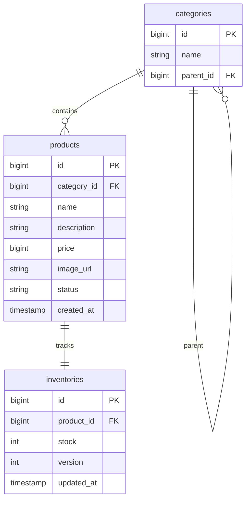
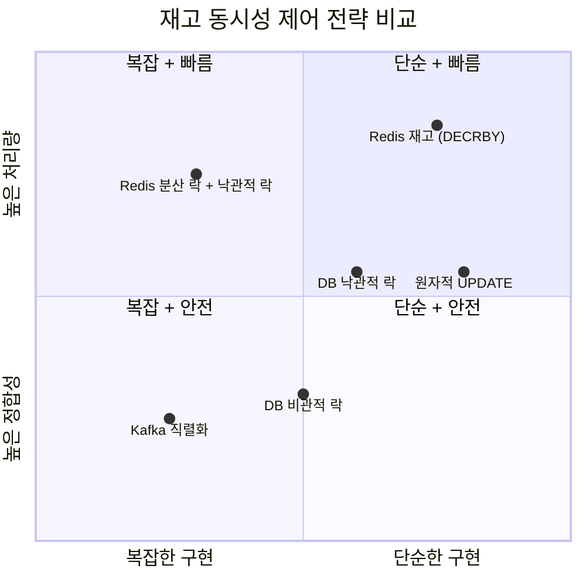
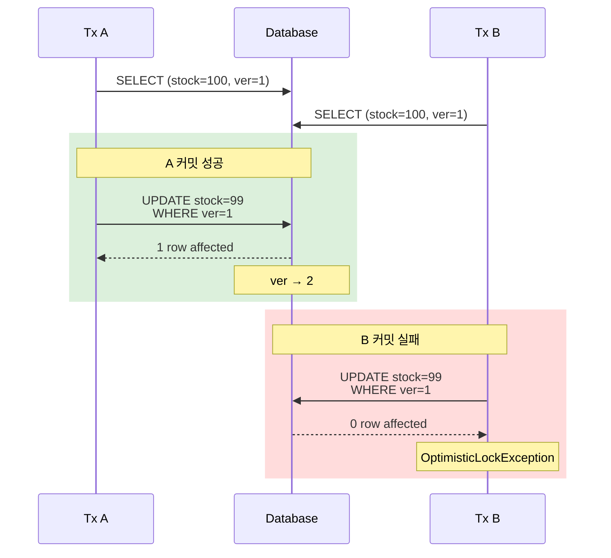
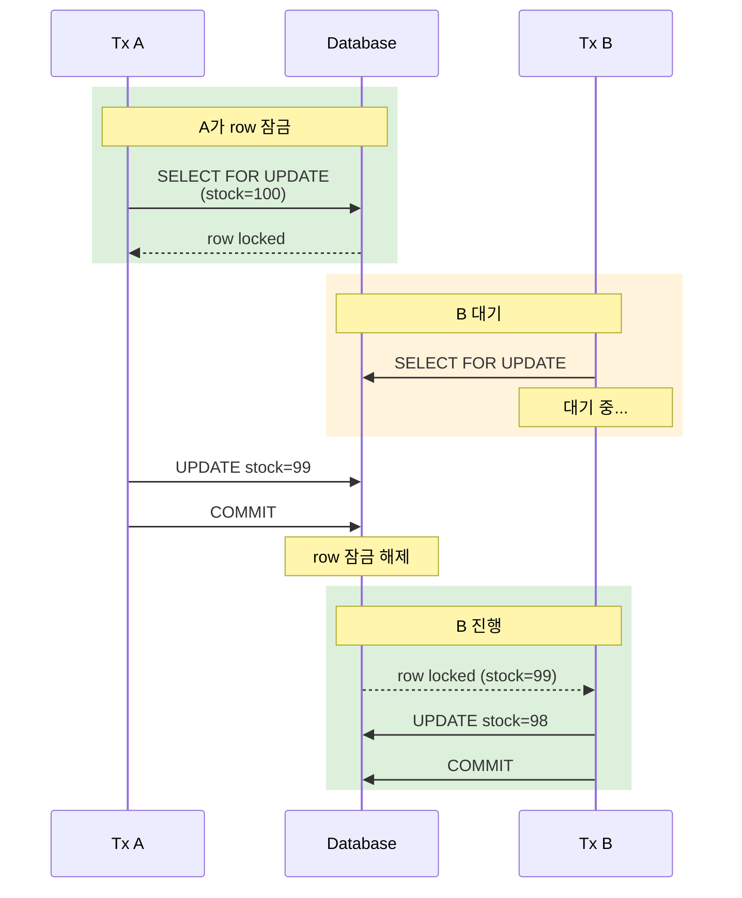
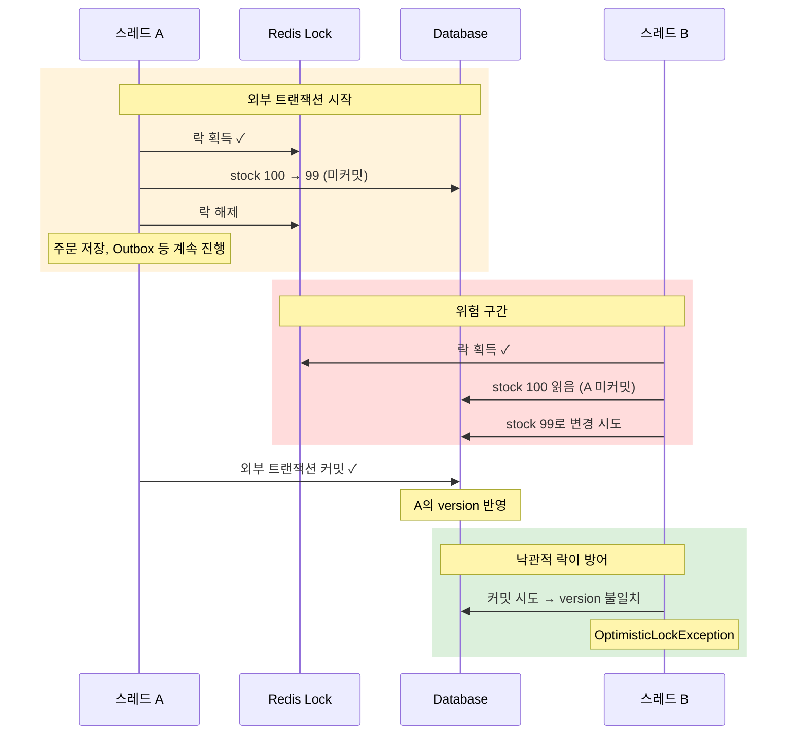
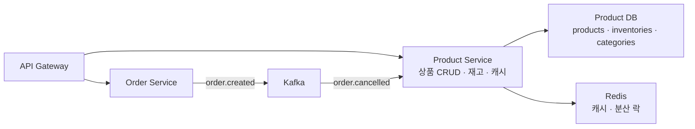

  
  이커머스에서 재고는 단순한 숫자가 아니다. 여러 사용자가 동시에 같은 상품을 주문하면 재고가 음수가 될 수 있고, 결제 실패나 타임아웃이 발생하면 차감한 재고를 다시 돌려놓아야 한다. 상품 정보(이름, 가격, 설명)는 관리자가 가끔 바꾸지만 재고는 주문이 들어올 때마다 바뀐다. 변경 빈도와 동시성 요구사항이 근본적으로 다르다.  
  
이 차이를 무시하고 하나의 엔티티에 모으면 어떤 문제가 생기는지, 그리고 분리하면 어떤 갈림길이 새로 열리는지를 이번 글에서 학습하려고 한다.  
  
이 글에서 사용하는 용어는 다음 뜻으로 읽으면 된다.  
  
| 용어                       | 이 글에서의 의미                                          |     |
| ------------------------ | -------------------------------------------------- | --- |
| 낙관적 락 (Optimistic Lock)  | 충돌이 드물다고 가정하고 커밋 시점에 버전을 비교하여 충돌을 감지하는 방식          |     |
| 비관적 락 (Pessimistic Lock) | 충돌이 잦다고 가정하고 데이터를 읽을 때 미리 잠그는 방식                   |     |
| 분산 락 (Distributed Lock)  | 여러 프로세스/서버가 동일 자원에 접근할 때 외부 저장소(Redis 등)로 동기화하는 방식 |     |
| 오버셀링 (Overselling)       | 실제 재고보다 많은 수량이 판매되어 재고가 음수가 되는 상황                  |     |
| lost update              | 두 트랜잭션이 같은 데이터를 읽고 각각 수정해서 한쪽 변경이 사라지는 현상          |     |
  
이번 학습에서 확인하고 싶은 질문은 다음과 같다.  
  
1. 상품과 재고를 왜 별도 엔티티로 분리했을까?  
2. 재고 동시성 제어에는 어떤 선택지가 있고, 각각의 트레이드오프는 무엇인가?  
3. 낙관적 락은 어떤 상황에서 충분하고, 어떤 상황에서 부족한가?  
4. 분산 락과 낙관적 락을 함께 쓰는 이유는 무엇인가?  
5. 락 범위와 트랜잭션 범위의 순서가 왜 중요한가?  
6. 재고 차감 시점은 언제가 적절한가 — 주문 생성 시점인가, 결제 완료 시점인가?  
7. 캐싱에서 재고를 제외한 이유는 무엇인가?  
8. Phase 4 MSA에서 Product Service는 어떤 책임을 갖게 되는가?  
  
---  
  
## 상품 정보와 재고 정보는 왜 변경 특성이 다른가  
  
이커머스에서 상품 테이블의 데이터를 두 종류로 나눠보면 변경 패턴이 확연히 다르다.  
  
| 구분 | 예시 컬럼 | 변경 주체 | 변경 빈도 | 동시성 경합 |  
| --- | --- | --- | --- | --- |  
| 상품 정보 | name, price, description, image_url, status | 관리자 | 낮음 (하루 수회) | 거의 없음 |  
| 재고 정보 | stock, version | 사용자 주문 | 높음 (초당 수회~수백회) | 인기 상품에서 매우 높음 |  
  
하나의 row에 둘 다 있으면 문제가 두 가지다.  
  
**1. 불필요한 락 경합이 생긴다.** 관리자가 상품 설명을 수정하는 것과 사용자가 재고를 차감하는 것은 완전히 다른 비즈니스 사건이다. 그런데 같은 row를 갱신하면 낙관적 락에서 version 충돌이 발생한다. 관리자가 설명을 수정한 것이 주문 트랜잭션을 실패시킬 수 있다.  
  
**2. 캐싱 전략이 복잡해진다.** 상품 이름이나 가격은 변경이 드물어 캐싱에 적합하다. 하지만 재고는 실시간으로 변해서 캐시에 넣으면 stale 데이터 위험이 크다. 하나의 row에 섞여 있으면 "상품 정보만 캐시하고 재고는 빼라"는 정책을 구현하기 어렵다.  

PeekCart는 이 차이를 반영해 `Product`와 `Inventory`를 별도 엔티티로 분리했다.  
  

  
`products` 테이블에는 `version` 컬럼이 없다. 관리자 수정은 동시 경합이 거의 없기 때문이다. `inventories` 테이블에만 `version`이 있고, 재고 변경 시에만 낙관적 락이 작동한다.  
  
---  
  
## 도메인 모델로 보기  
  
### Product: 상품 정보의 원천  
  
```java  
@Entity  
@Table(name = "products")  
public class Product extends BaseTimeEntity {  
  
    @Id  
    @GeneratedValue(strategy = GenerationType.IDENTITY)  
    private Long id;  
  
    @ManyToOne(fetch = FetchType.LAZY)  
    @JoinColumn(name = "category_id", nullable = false)  
    private Category category;  
  
    @Column(nullable = false)  
    private String name;  
  
    private String description;  
  
    @Column(nullable = false)  
    private long price;  
  
    @Column(name = "image_url")  
    private String imageUrl;  
  
    @Enumerated(EnumType.STRING)  
    @Column(nullable = false)  
    private ProductStatus status;  
  
    public static Product create(Category category, String name,  
            String description, long price, String imageUrl) {  
        return new Product(category, name, description, price, imageUrl);  
    }  
  
    public void update(Category category, String name,  
            String description, long price, String imageUrl) {  
        this.category = category;        this.name = name;        this.description = description;        this.price = price;        this.imageUrl = imageUrl;    }  
  
    public void discontinue() {  
        this.status = ProductStatus.DISCONTINUED;    }  
  
    public boolean isOnSale() {  
        return this.status == ProductStatus.ON_SALE;    }  
}  
```  
  
`Product`에는 비즈니스 메서드가 있지만 동시성 관련 장치는 없다. 생성 시 기본 상태는 `ON_SALE`이고, 가격은 0 이상이어야 한다는 규칙이 생성자에 들어 있다. `discontinue()`는 soft delete로, 물리적 삭제 대신 상태를 `DISCONTINUED`로 바꾼다.  
  
상태는 세 가지다.  
  
```java  
public enum ProductStatus {  
    ON_SALE, SOLD_OUT, DISCONTINUED}  
```  
  
상태 전이 규칙이 enum에 있으면 좋을 수 있지만 PeekCart에서 `ProductStatus`의 전이는 단순하다. `ON_SALE`에서 `DISCONTINUED`로 가는 것과, 재고가 0이 되면 `SOLD_OUT`으로 바꾸는 것 정도다. 현재 복잡도에서는 `discontinue()` 하나면 충분하다.  
  
### Inventory: 재고의 변경 단위  
  
```java  
@Entity  
@Table(name = "inventories")  
public class Inventory {  
  
    @Id  
    @GeneratedValue(strategy = GenerationType.IDENTITY)  
    private Long id;  
  
    @OneToOne(fetch = FetchType.LAZY)  
    @JoinColumn(name = "product_id", nullable = false, unique = true)  
    private Product product;  
  
    @Column(nullable = false)  
    private int stock;  
  
    @Version  
    private int version;  
  
    @UpdateTimestamp  
    @Column(name = "updated_at")  
    private LocalDateTime updatedAt;  
  
    public void decrease(int quantity) {  
        if (this.stock < quantity) {  
            throw new ProductException(ErrorCode.PRD_002);  
        }  
        this.stock -= quantity;    }  
  
    public void restore(int quantity) {  
        if (quantity <= 0)  
            throw new IllegalArgumentException("복구 수량은 1 이상이어야 합니다.");  
        this.stock += quantity;    }  
}  
```  
  
여기서 핵심은 `@Version`이다. JPA의 낙관적 락은 이 필드 하나로 동작한다. Hibernate가 UPDATE 쿼리를 날릴 때 `WHERE version = ?`을 자동으로 붙이고, 영향 받은 row가 0이면 `OptimisticLockException`을 던진다.  
  
```sql  
-- Hibernate가 생성하는 실제 SQLUPDATE inventories  
SET stock = ?, version = version + 1, updated_at = ?  
WHERE id = ? AND version = ?  
```  
  
이 SQL 자체가 낙관적 락의 전부다. 중간에 다른 트랜잭션이 version을 올렸다면 이 UPDATE는 0 row를 갱신하고, Hibernate가 그것을 충돌로 감지한다.  
  
비즈니스 규칙도 `Inventory`에 응집되어 있다. `decrease()`는 재고가 부족하면 PRD-002를 던지고, `restore()`는 복구 수량이 0 이하이면 거절한다. 이 규칙들은 HTTP나 DB를 몰라도 테스트할 수 있다.  
  
```java  
// InventoryTest.java  
@Test  
void decrease_insufficientStock_throwsPRD002() {  
    Inventory inventory = Inventory.create(product(), 10);  
    assertThatThrownBy(() -> inventory.decrease(11))            .isInstanceOf(ProductException.class)            .extracting(e -> ((ProductException) e).getErrorCode())            .isEqualTo(ErrorCode.PRD_002);}  
```  
  
도메인 규칙이 Entity에 있으면 단위 테스트가 가벼워진다. Mock 없이 `Inventory.create(product(), 10)`만으로 테스트 대상을 만들 수 있다.  
  
---  
  
## 갈림길 1. 재고 동시성 제어는 어떤 선택지가 있는가  
  
이커머스에서 재고 동시성은 핵심 문제다. 여러 사용자가 동시에 같은 상품을 주문하면 재고가 음수가 되거나(오버셀링) 한쪽의 변경이 사라질(lost update) 수 있다.  
  
이 문제를 해결하는 방법을 정리하면 다음과 같다.  
  
| 전략                             | 핵심 아이디어                                         | 장점                       | 단점                           |     |
| ------------------------------ | ----------------------------------------------- | ------------------------ | ---------------------------- | --- |
| DB 낙관적 락 (`@Version`)          | 읽을 때 잠그지 않고 커밋 시 version 비교                     | 락 없이 높은 처리량, 경합 적을 때 효율적 | 충돌 시 재시도 필요, 경합 높으면 실패율 증가   |     |
| DB 비관적 락 (`SELECT FOR UPDATE`) | 읽을 때 row를 잠그고 트랜잭션 끝날 때까지 유지                    | 충돌 자체를 예방, 구현 단순         | 데드락 위험, 동시 처리량 저하, 커넥션 점유    |     |
| Redis 분산 락 (Redisson)          | 외부 Redis로 애플리케이션 수준에서 직렬화                       | DB 부하 감소, 다중 Pod에서도 동작   | Redis SPOF, 네트워크 지연, 락 만료 이슈 |     |
| DB 원자적 UPDATE                  | `UPDATE SET stock = stock - ? WHERE stock >= ?` | 가장 단순, 별도 락 불필요          | 비즈니스 로직이 SQL에 묶임, 도메인 모델 약화  |     |
| Kafka + 이벤트 직렬화                | 파티션 키로 순차 처리 보장                                 | 높은 확장성, 비동기              | 응답 지연, 복잡한 보상 로직             |     |
| 재고를 Redis에 유지                  | `DECRBY`로 원자적 차감, 주기적으로 DB 동기화                  | 극히 빠른 차감                 | Redis/DB 정합성 관리, 장애 시 유실 위험  |     |
  
여기서 트레이드오프를 두 축으로 볼 수 있다.  


이 중에서 흔하게 비교되는 두 가지를 좀 더 깊이 보려고 한다. 낙관적 락과 비관적 락이다.  

---  
  
## 갈림길 1-1. 낙관적 락 vs 비관적 락

두 전략은 "충돌을 언제 해결하는가"가 다르다.

### 낙관적 락: 충돌은 드물다고 가정한다



트랜잭션 B는 커밋 시점에야 충돌을 알게 된다. 충돌이 드물면 대부분의 요청이 락 없이 통과하므로 처리량이 높다. 그러나 충돌이 잦아지면 실패 후 재시도 비용이 커진다.

### 비관적 락: 충돌이 잦다고 가정한다



트랜잭션 B는 A가 끝날 때까지 기다린다. 충돌 자체가 발생하지 않으므로 재시도가 필요 없다. 그러나 동시 요청이 많으면 대기 시간이 길어지고, 데드락 위험이 생긴다. 
  
### 어떤 상황에서 어느 쪽이 유리한가  
  
| 판단 기준 | 낙관적 락이 유리 | 비관적 락이 유리 |  
| --- | --- | --- |  
| 동시 경합 빈도 | 낮음 (대부분 충돌 없이 성공) | 높음 (대부분 충돌이 발생) |  
| 트랜잭션 길이 | 짧음 | 길어도 괜찮음 |  
| 실패 시 비용 | 재시도가 저렴 | 재시도가 비쌈 (외부 호출 등) |  
| 데드락 위험 | 없음 (잠그지 않으므로) | 있음 (여러 row를 순서 없이 잠그면) |  
| DB 커넥션 점유 | 짧음 | 대기 중에도 점유 |  
  
이커머스 재고의 경우를 보면 상황이 두 가지로 나뉜다.  
  
- **평소**: 같은 상품을 동시에 주문하는 경우는 드물다. 낙관적 락만으로 충분하다.  
- **인기 상품 타임세일**: 같은 상품에 수백 요청이 몰린다. 낙관적 락만 쓰면 대부분 충돌로 실패하고 재시도 폭풍이 일어난다.  
  
이 두 상황을 모두 커버하려면 낙관적 락 하나로는 부족하다. 그래서 PeekCart는 Redis 분산 락을 앞에 세워 경합을 직렬화하고, 낙관적 락은 최후의 방어선으로 남겨둔다.  
  
---  
  
## 갈림길 1-2. 분산 락은 왜 필요한가  
  
단일 인스턴스에서는 DB 락만으로도 충분할 수 있다. 그러나 다중 Pod 환경에서는 다른 문제가 생긴다.  
  
```  
Pod A: 트랜잭션 시작 → 재고 조회 (stock=10)Pod B: 트랜잭션 시작 → 재고 조회 (stock=10)Pod A: stock = 10 - 1 = 9 → 커밋  
Pod B: stock = 10 - 1 = 9 → 커밋 (version이 같으면 lost update, 다르면 충돌)  
```  
  
낙관적 락이 있으면 lost update는 막을 수 있다. 하지만 충돌로 실패한 요청을 어떻게 처리할 것인가가 문제다. 재시도할 것인가, 사용자에게 실패를 알릴 것인가. 인기 상품에서 10개 요청 중 9개가 충돌로 실패하면 사용자 경험이 나빠진다.  
  
분산 락은 이 충돌 자체를 줄여준다. Redis에서 상품 단위로 락을 잡으면 같은 상품에 대한 재고 차감이 순차적으로 실행된다.  
  
| 전략 | 경합 해결 | 실패 비율 | DB 부하 | 추가 인프라 |  
| --- | --- | --- | --- | --- |  
| 낙관적 락만 | 커밋 시점 충돌 감지 | 경합 시 높음 | 낮음 | 없음 |  
| 비관적 락만 | DB row 잠금 | 없음 (대기) | DB 커넥션 점유 | 없음 |  
| 분산 락만 | 애플리케이션 수준 직렬화 | 락 획득 실패만 | 낮음 | Redis |  
| 분산 락 + 낙관적 락 | 직렬화 + 최후 방어 | 매우 낮음 | 낮음 | Redis |  
  
PeekCart는 네 번째, 분산 락 + 낙관적 락의 이중 방어를 선택했다.  
  
---  
  
## PeekCart의 재고 동시성 구조  
  
### InventoryLockFacade: 락 범위를 트랜잭션 바깥에 둔다  
  
```java  
@Component  
@RequiredArgsConstructor  
public class InventoryLockFacade {  
  
    private static final String LOCK_KEY_PREFIX = "inventory-lock:";    
    private static final long LOCK_WAIT_TIME = 3;    
    private static final long LOCK_LEASE_TIME = 5;  
    private final InventoryService inventoryService;  
    private final DistributedLockManager lockManager;  
  
    public void decreaseStock(Long productId, int quantity) {  
        String lockKey = LOCK_KEY_PREFIX + productId;        
        boolean locked = lockManager.tryLock(  
                lockKey, LOCK_WAIT_TIME, LOCK_LEASE_TIME, TimeUnit.SECONDS);  
        if (!locked) {  
            throw new ProductException(ErrorCode.PRD_004);  
        }  
        try {  
            inventoryService.decreaseStock(productId, quantity);  
        } finally {  
            lockManager.unlock(lockKey);  
        }  
    }  
}  
```  
  
이 코드에서 가장 중요한 것은 `InventoryLockFacade`와 `InventoryService`의 분리다.  
  
`InventoryService`는 `@Transactional`이 붙어 있다(기본 `Propagation.REQUIRED`). `InventoryLockFacade`는 `@Transactional`이 없다. 이 분리의 의도는 "락 획득 → 트랜잭션 시작 → 재고 변경 → 트랜잭션 커밋 → 락 해제" 순서를 보장하는 것이다.

하지만 이 순서가 항상 보장되는 것은 아니다. **호출자의 트랜잭션 컨텍스트에 따라 실제 동작이 달라진다.**

### 경우 1: 단독 호출 — 의도대로 동작

`InventoryLockFacade`를 외부 트랜잭션 없이 직접 호출하면 설계 의도대로 동작한다.

```
1. Redis 분산 락 획득
2. InventoryService 진입 → 새 트랜잭션 시작 (REQUIRED, 기존 없으므로)
3. 재고 조회 → 차감
4. InventoryService 반환 → 트랜잭션 커밋 (DB 반영 완료)
5. Redis 분산 락 해제
```

다른 스레드가 락을 획득하는 시점에는 이미 커밋이 끝나 있다. 분산 락만으로 직렬화가 완성된다.

### 경우 2: 외부 트랜잭션 안에서 호출 — 락이 먼저 풀린다

`OrderCommandService.createOrder()`처럼 이미 `@Transactional`이 열린 컨텍스트에서 호출하면 이야기가 달라진다.

```
1. OrderCommandService 트랜잭션 시작 (외부)
2. Redis 분산 락 획득
3. InventoryService 진입 → 외부 트랜잭션에 참여 (REQUIRED, 기존 있으므로)
4. 재고 조회 → 차감
5. InventoryService 반환 — 트랜잭션은 아직 커밋되지 않음
6. Redis 분산 락 해제                ← DB 반영 전에 락이 풀림!
7. ... 주문 저장, 장바구니 비우기, Outbox 이벤트 저장 ...
8. OrderCommandService 반환 → 외부 트랜잭션 커밋 (여기서야 DB 반영)
```

6번에서 락이 풀린 뒤 8번에서 커밋이 완료되기 전, 다른 스레드가 같은 상품의 락을 획득하고 아직 커밋되지 않은 재고를 읽을 수 있다.



**이것이 낙관적 락(`@Version`)이 "Redis 장애 시 fallback"이 아니라 정상 경로에서도 필요한 진짜 이유다.** 외부 트랜잭션 안에서 호출될 때 분산 락은 경합을 줄여주지만 완전한 직렬화를 보장하지 못한다. 낙관적 락이 커밋 시점에 version을 비교해서 실제 오버셀링을 막는다.

### 두 경우의 비교

PeekCart에서 재고 차감의 주요 경로는 `OrderCommandService.createOrder()` 안이다. 즉 대부분의 실제 호출은 **경우 2**에 해당한다. 분산 락은 동시 경합의 대부분을 걸러주지만, 낙관적 락이 커밋 시점의 최종 정합성을 보장한다. 이것이 이중 방어의 실질적 의미다.

| 호출 컨텍스트 | 트랜잭션 커밋 시점 | 분산 락 효과 | 낙관적 락 역할 |
| --- | --- | --- | --- |
| 단독 호출 | `InventoryService` 반환 시 (락 해제 전) | 완전한 직렬화 | 사실상 불필요 (충돌 0) |
| 외부 트랜잭션 안 | 외부 트랜잭션 반환 시 (락 해제 후) | 경합 감소 (완전하지 않음) | 실제 오버셀링 방어 |

### DistributedLockManager: Redis 장애 시 fallback  
  
```java  
@Component  
@RequiredArgsConstructor  
public class DistributedLockManager {  
  
    private final RedissonClient redissonClient;  
  
    public boolean tryLock(String key, long waitTime, long leaseTime, TimeUnit unit) {  
        try {  
            RLock lock = redissonClient.getLock(key);  
            return lock.tryLock(waitTime, leaseTime, unit);  
        } catch (InterruptedException e) {  
            Thread.currentThread().interrupt();  
            return false;        } catch (Exception e) {  
            log.warn("Redis 분산 락 획득 실패 (Redis 장애), DB 낙관적 락으로 fallback: {}", key, e);  
            return true;  // ← 핵심  
        }  
    }  
}  
```  
  
Redis에 연결할 수 없을 때 `false`를 반환하면 모든 주문이 실패한다. 분산 락이 가용성을 떨어뜨리는 SPOF가 된다. 그래서 PeekCart는 Redis 장애 시 `true`를 반환해서 락 없이 진행하게 한다.  
  
이때 오버셀링은 어떻게 막는가? `Inventory.decrease()`가 실행되면 JPA의 `@Version`이 동작한다. 여러 트랜잭션이 동시에 같은 재고를 차감하면 한쪽은 `OptimisticLockException`으로 실패한다. 즉, 낙관적 락이 최후의 방어선이다.  
  
```
단독 호출:      분산 락 → 완전 직렬화 → 낙관적 락 충돌 거의 0
외부 트랜잭션:  분산 락 → 경합 감소 → 커밋 시점 낙관적 락이 최종 방어
Redis 장애:    분산 락 없음 → 동시 접근 → 낙관적 락이 충돌 감지
```

세 경우 모두에서 오버셀링은 발생하지 않는다. 분산 락의 역할은 상황에 따라 "완전한 직렬화"에서 "경합 감소"까지 달라지지만, 낙관적 락이 항상 최종 정합성을 보장한다. 이것이 이중 방어의 실질적 의미다.  
  
### InventoryService: 트랜잭션 안에서 도메인 로직만  
  
```java  
@Service  
@Transactional  
@RequiredArgsConstructor  
public class InventoryService {  
  
    private final InventoryRepository inventoryRepository;  
  
    public void decreaseStock(Long productId, int quantity) {  
        Inventory inventory = inventoryRepository.findByProductId(productId)  
                .orElseThrow(() -> new ProductException(ErrorCode.PRD_001));  
        inventory.decrease(quantity);  
    }  
  
    public void restoreStock(Long productId, int quantity) {  
        Inventory inventory = inventoryRepository.findByProductId(productId)  
                .orElseThrow(() -> new ProductException(ErrorCode.PRD_001));  
        inventory.restore(quantity);  
    }  
}  
```  
  
`InventoryService`는 분산 락을 모른다. 트랜잭션 안에서 `Inventory`를 꺼내고, 도메인 메서드를 호출한다. dirty checking에 의해 트랜잭션 커밋 시 UPDATE가 나간다.  
  
`restoreStock`에는 분산 락이 없다. 재고 복구는 주문 취소나 결제 실패 시에만 일어나고, 같은 주문에 대해 두 번 복구가 동시에 호출되는 일은 멱등성 처리(Phase 2의 `processed_events`)에서 막기 때문이다.  
  
---  
  
## 테스트로 검증하기  
  
PeekCart는 동시성을 두 가지 수준에서 테스트한다.  
  
### 테스트 1: 낙관적 락만으로 lost update 방지 확인  
  
```java  
@Test  
@DisplayName("동시 재고 차감 시 낙관적 락으로 충돌이 발생하고, 최종 재고가 성공 횟수만큼만 차감된다")  
void concurrentDecrease_optimisticLock_preventsLostUpdate() throws InterruptedException {  
    int threadCount = 10;    // ...10개 스레드가 동시에 재고를 1씩 차감  
  
    // 성공 + 충돌 = 전체 스레드 수  
    assertThat(successCount.get() + conflictCount.get()).isEqualTo(threadCount);  
    // 충돌이 최소 1건 이상 발생해야 낙관적 락이 작동하는 것  
    assertThat(conflictCount.get()).isGreaterThanOrEqualTo(1);  
  
    // 최종 재고 = 초기 재고 - (성공 횟수 × 차감량) — lost update 없음 검증  
    Inventory result = em.find(Inventory.class, inventoryId);  
    assertThat(result.getStock()).isEqualTo(100 - (successCount.get() * decreasePerThread));  
}  
```  
  
이 테스트의 핵심 검증은 마지막 줄이다. 10개 스레드 중 일부만 성공했더라도 최종 재고가 `초기 - (성공 수 × 차감량)`과 정확히 일치해야 한다. 만약 `@Version`이 없었다면 lost update가 발생해 실제 차감보다 재고가 많이 남았을 것이다.  
  
### 테스트 2: 분산 락으로 오버셀링 없이 전부 성공  
  
```java  
@Test  
@DisplayName("50스레드 동시 차감 시 분산 락으로 오버셀링 없이 전부 성공한다")  
void concurrentDecrease_distributedLock_preventsOverselling() throws InterruptedException {  
    int threadCount = 50;    // ...50개 스레드가 동시에 InventoryLockFacade를 통해 차감  
  
    // 50스레드 전부 성공 (분산 락이 순차 실행을 보장)  
    assertThat(successCount.get()).isEqualTo(threadCount);  
    assertThat(failCount.get()).isZero();  
  
    // 최종 재고 = 초기(100) - 50 = 50 — 오버셀링 0건  
    Inventory result = em.find(Inventory.class, inventoryId);  
    assertThat(result.getStock()).isEqualTo(100 - threadCount);  
}  
```  
  
첫 번째 테스트와의 차이는 `InventoryLockFacade`를 통해 호출한다는 것이다. 분산 락이 순차 실행을 보장하므로 50개 스레드가 전부 성공하고, 재고가 정확히 50이 된다. 낙관적 락 충돌은 0건이다(분산 락이 이미 직렬화했으므로).  
  
두 테스트를 비교하면 이중 방어의 의미가 보인다.  
  
| 테스트 | 락 전략 | 성공률 | 충돌 | 최종 재고 정확성 |  
| --- | --- | --- | --- | --- |  
| 테스트 1 | 낙관적 락만 | 일부만 성공 | 발생 | 정확 (lost update 없음) |  
| 테스트 2 | 분산 락 + 낙관적 락 | 전부 성공 | 0건 | 정확 (오버셀링 없음) |  
  
---  
  
## 갈림길 2. 재고 차감 시점 — 주문 생성 시인가, 결제 완료 후인가  
  
재고를 언제 차감하느냐도 큰 갈림길이다. 이것은 동시성 제어와는 별개의 비즈니스 결정이다.  
  
| 전략                  | 재고 차감 시점                       | 장점              | 단점                       |     |
| ------------------- | ------------------------------ | --------------- | ------------------------ | --- |
| 전략 A: 주문 생성 시 즉시 차감 | 주문 트랜잭션 안에서 차감                 | 이중 주문 방지, 구현 단순 | 결제 실패 시 재고가 묶임           |     |
| 전략 B: 결제 완료 후 확정 차감 | 주문 시 예약(soft lock), 결제 성공 시 확정 | 재고 묶임 최소화       | 예약 상태 관리, 예약 만료 처리 복잡    |     |
| 전략 C: 결제 시도 시 차감    | 결제 요청 직전에 차감                   | 묶임 시간 중간        | 결제 실패 시 복구 필요 + 차감 시점 애매 |     |
  
각 전략의 시간 흐름을 비교하면 이렇다.  

```mermaid  
gantt  
    title 재고 차감 시점 비교  
    dateFormat X
    axisFormat %s
    section 전략 A (채택)  
    재고 차감        :active, a1, 0, 1
    주문 생성        :a2, 0, 1
    결제 대기        :a3, 1, 15
    결제 완료/실패   :a4, 15, 16
    실패 시 복구     :crit, a5, 16, 17
    section 전략 B
    재고 예약(soft)  :b1, 0, 1
    주문 생성        :b2, 0, 1
    결제 대기        :b3, 1, 15
    결제 완료 시 확정 :b4, 15, 16
    예약 만료 시 해제 :crit, b5, 15, 16
```  
  

  
PeekCart는 **전략 A**를 선택했다. 주문 생성 트랜잭션 안에서 재고 차감과 주문 저장을 함께 처리한다.  
  
```  
주문 생성 트랜잭션:  
    재고 차감 (Inventory.decrease) + 주문 저장 (Order.create)    + Outbox 이벤트 저장 — 모두 단일 트랜잭션  
```  
  
이 방식의 가장 큰 장점은 **재고 차감과 주문 생성이 원자적**이라는 것이다. 둘 중 하나만 성공하는 상황이 없다. 전략 B는 "예약"과 "확정"이라는 두 단계가 생기면서 중간 상태 관리가 복잡해진다.  
  
단점은 결제 실패 시 재고가 묶인다는 것이다. 사용자가 주문을 생성하고 15분 동안 결제를 하지 않으면 그 기간 동안 다른 사용자가 해당 재고를 구매할 수 없다. PeekCart는 이 문제를 **타임아웃 스케줄러**로 해결한다. `PAYMENT_REQUESTED` 상태가 15분을 초과한 주문을 자동으로 취소하고 재고를 복구한다. 
  
Order 도메인이 재고 차감을 요청할 때는 `ProductPort`를 통한다.  
  
```java  
// ProductPort.java (Order 도메인의 application/port에 정의)  
public interface ProductPort {  
    void verifyProductExists(Long productId);    long decreaseStockAndGetUnitPrice(Long productId, int quantity);    void restoreStock(Long productId, int quantity);}  
```  
  
```java  
// ProductPortAdapter.java (Product 도메인의 infrastructure에 구현)  
@Override  
public long decreaseStockAndGetUnitPrice(Long productId, int quantity) {  
    Product product = productRepository.findById(productId)            .orElseThrow(() -> new ProductException(ErrorCode.PRD_001));    inventoryLockFacade.decreaseStock(productId, quantity);    return product.getPrice();}  
```  
  
여기서 `decreaseStockAndGetUnitPrice`라는 메서드 이름이 중요하다. 이 메서드는 재고를 차감하면서 동시에 주문 시점의 상품 가격을 반환한다. 이 가격은 `order_items.unit_price`에 스냅샷으로 저장되어, 나중에 상품 가격이 바뀌더라도 주문 당시 가격이 보존된다.  
  
Order 도메인은 `ProductPort` 인터페이스만 알고, `Inventory`, `InventoryLockFacade`, `DistributedLockManager`의 존재를 모른다. 재고 차감의 구체적인 동시성 전략이 바뀌더라도 Order 코드는 영향을 받지 않는다.  
  
---  
  
## 갈림길 3. 캐싱에서 재고를 제외한 이유  
  
Product 도메인에서 캐싱 전략도 상품과 재고의 분리에 영향을 받는다.  
  
PeekCart의 `ProductCacheService`는 상품 정보만 캐시하고 재고는 항상 DB에서 조회한다.  
  
```java  
// ProductCacheService.java  
@Cacheable(cacheNames = "product", key = "#productId")  
public ProductInfoDto getProductInfo(Long productId) {  
    Product product = productRepository.findById(productId)            .orElseThrow(() -> new ProductException(ErrorCode.PRD_001));    return ProductInfoDto.of(product);  // 재고 미포함  
}  
```  
  
```java  
// ProductQueryService.java  
public ProductDetailDto getProduct(Long productId) {  
    ProductInfoDto info = productCacheService.getProductInfo(productId);  // 캐시 히트  
  
    int stock = inventoryRepository.findByProductId(productId)            // 항상 DB            .map(Inventory::getStock)            .orElse(0);  
    return new ProductDetailDto(            info.id(), info.categoryId(), info.categoryName(),            info.name(), info.description(), info.price(),            info.imageUrl(), info.status(), stock);}  
```  
  
캐시에 재고를 포함하면 어떤 문제가 생기는가?  
  
1. **stale 재고 표시**: 캐시된 재고가 "10개 남음"인데 실제로는 0개일 수 있다. 사용자가 주문을 시도하면 재고 부족으로 실패한다.  
2. **캐시 무효화 폭풍**: 재고가 변경될 때마다 캐시를 무효화하면 캐시의 의미가 사라진다. 인기 상품은 초당 수십 번 재고가 바뀔 수 있다.  
3. **캐시 TTL과 정합성 트레이드오프**: 짧은 TTL(예: 5초)로 완화할 수 있지만, 그 5초 동안은 여전히 부정확하고 TTL이 짧을수록 캐시 히트율이 떨어진다.  
  
반면 상품 이름, 가격, 설명, 이미지 같은 정보는 관리자가 가끔 바꿀 뿐이다. TTL이 30분이어도 대부분의 경우 정확하다. 관리자가 수정하면 `@CacheEvict`로 즉시 무효화하면 된다.  
  
```java  
// ProductCommandService.java  
@Caching(evict = {  
        @CacheEvict(cacheNames = "product", key = "#productId"),        @CacheEvict(cacheNames = "products", allEntries = true)})  
public ProductDetailDto update(Long productId, UpdateProductCommand command) {  
    // ...}  
```  
  
결국 상품과 재고를 별도 엔티티로 분리한 것이 캐싱 전략에서도 자연스러운 분리를 만들어준다. 상품 정보는 캐시, 재고는 실시간 DB 조회. 이 패턴은 Phase 2의 캐시 부하 테스트(8편에서 다룰 예정)에서 캐시 ON/OFF TPS 차이를 측정하는 기반이 된다.  
  
---  
  
## 한계와 트레이드오프  
  
### 의도적으로 안 한 것  
  
- **재고를 Redis에 두는 방식**: `DECRBY`로 원자적 차감을 하면 DB보다 훨씬 빠르다. 하지만 Redis/DB 간 정합성 동기화 비용이 크고, Redis 장애 시 재고 데이터 유실 위험이 있다. 학습 범위에서는 DB를 SSOT로 유지하는 쪽을 택했다.  
- **비관적 락**: Phase 1 단일 인스턴스에서는 `SELECT FOR UPDATE`가 더 단순할 수 있다. 그러나 Phase 2에서 분산 락으로 가는 흐름을 보여주기 위해 처음부터 낙관적 락을 기반으로 설계했다.  
- **재고 예약(soft lock) 패턴**: 전략 B를 채택하면 재고 묶임을 줄일 수 있지만, 예약 상태 관리와 예약 만료 처리의 복잡도가 크다. 타임아웃 스케줄러(15분)로 묶임 시간을 제한하는 것이 현재 범위에서는 더 단순하다.  
- **`SOLD_OUT` 자동 전이**: 현재 `decrease()` 후 재고가 0이 되어도 `ProductStatus`를 `SOLD_OUT`으로 자동 변경하지 않는다. `Inventory`가 `Product`의 상태를 직접 바꾸면 도메인 간 결합이 생기기 때문이다. 이벤트 기반으로 Product 상태를 갱신하는 것이 Phase 2 이후의 후보다.  
  
### 남아 있는 리스크  
  
- **분산 락 lease time(5초) 초과**: 트랜잭션이 5초 안에 끝나지 않으면 락이 풀리고 다른 요청이 들어온다. 그때 낙관적 락이 방어하지만, 정상 시나리오에서 5초를 넘기면 설계를 재점검해야 한다.  
- **Redis 장애 fallback의 UX 영향**: Redis 장애 시 모든 요청이 낙관적 락 경쟁으로 전환되면 충돌 실패율이 급등한다. 사용자에게 "일시적으로 주문이 어렵습니다"를 보여줄지, 재시도를 할지는 아직 결정되지 않았다.  
  
---  
  
## 참고 자료
  
| 질문                          | 같이 읽을 자료                                                                                                                                                                                                                       | 이 글에서 연결되는 지점                                        |     |
| --------------------------- | ------------------------------------------------------------------------------------------------------------------------------------------------------------------------------------------------------------------------------ | ---------------------------------------------------- | --- |
| 낙관적 락과 비관적 락은 어떻게 다른가?      | Martin Fowler, [Optimistic Offline Lock](https://martinfowler.com/eaaCatalog/optimisticOfflineLock.html), [Pessimistic Offline Lock](https://martinfowler.com/eaaCatalog/pessimisticOfflineLock.html)                          | `@Version`과 `SELECT FOR UPDATE`의 트레이드오프를 비교          |     |
| JPA의 낙관적 락은 내부에서 어떻게 동작하는가? | Vlad Mihalcea, [A beginner's guide to database locking and the lost update phenomena](https://vladmihalcea.com/a-beginners-guide-to-database-locking-and-the-lost-update-phenomena/)                                           | Hibernate가 `version`을 어떻게 붙이는지, lost update를 어떻게 막는지 |     |
| 분산 락은 어떤 보장을 하고 어떤 한계가 있는가? | Martin Kleppmann, [How to do distributed locking](https://martin.kleppmann.com/2016/02/08/how-to-do-distributed-locking.html), Redis, [Distributed Locks with Redis](https://redis.io/docs/manual/patterns/distributed-locks/) | Redlock의 위험성과 단일 Redis 락의 트레이드오프                     |     |
| 재고 차감 시점은 언제가 좋은가?          | 쿠팡 기술 블로그 등 이커머스 사례, AWS, [Saga Pattern](https://docs.aws.amazon.com/prescriptive-guidance/latest/modernization-data-persistence/saga-pattern.html)                                                                            | 전략 A/B 선택과 보상 트랜잭션의 관계                               |     |
| 캐시 전략은 어떻게 설계하는가?           | Martin Fowler, [Two Hard Things](https://martinfowler.com/bliki/TwoHardThings.html), AWS, [Caching Best Practices](https://aws.amazon.com/caching/best-practices/)                                                             | 상품 정보 캐시와 재고 실시간 조회의 분리 설계                           |     |
| 엔티티 분리와 애그리거트 설계의 기준은 무엇인가? | Vaughn Vernon, [Effective Aggregate Design](https://www.dddcommunity.org/library/vernon_2011/)                                                                                                                                 | Product와 Inventory를 왜 별도 애그리거트로 볼 수 있는가를 판단할 때       |     |
  
---  
  
## Phase 4 MSA에서는 어떻게 바뀌는가  
  
Phase 4에서 Product Service는 독립 서비스가 된다. 현재 모놀리스 안에서 `ProductPort`로 분리해둔 경계가 서비스 간 경계로 올라간다.  
  

  
여기서 새로 생기는 질문들이 있다.  
  
- **Order Service가 재고를 어떻게 차감할 것인가**: 현재는 `ProductPort.decreaseStockAndGetUnitPrice()`를 같은 트랜잭션 안에서 호출한다. MSA에서는 동기 HTTP 호출(API) 또는 비동기 이벤트(Saga) 중 하나를 선택해야 한다. 동기 호출이면 분산 트랜잭션 문제가 생기고, 비동기면 즉시 재고 차감을 보장하기 어렵다.  
- **재고 복구는 Saga 보상 트랜잭션이 된다**: `payment.failed → order.cancelled → inventory.restore` 흐름이 이벤트 기반으로 바뀐다. 이미 Phase 2에서 Outbox + Kafka + 멱등성 처리를 갖추고 있으므로 인프라는 준비돼 있다.  
- **상품 가격 스냅샷은 Order Service에 남는다**: `order_items.unit_price`에 주문 시점 가격을 저장하는 패턴은 MSA에서도 그대로 유효하다. FK 없이도 주문 시점의 상품 정보가 보존된다.  
- **캐시 소유권은 Product Service에 간다**: 상품 목록/상세 캐시와 분산 락 Redis는 Product Service의 책임으로 이동한다. Order Service는 Product API를 호출하거나 CQRS 로컬 캐시를 유지한다.  
- **Product DB가 독립되면 FK가 사라진다**: 현재 `cart_items.product_id`나 `order_items.product_id`가 Product DB를 직접 FK로 참조한다. MSA에서는 이 FK가 사라지고, 논리적 ID로만 연결된다. 존재하지 않는 상품을 참조하는 경우를 애플리케이션 레벨에서 처리해야 한다.  
  
핵심은, Product/Inventory 분리와 `ProductPort` 추상화가 이미 서비스 경계의 후보를 보여준다는 점이다. 지금은 같은 JVM 안에서 메서드 호출로 연결되지만, 그 호출 계약(인터페이스)이 나중에 HTTP API나 이벤트 계약으로 변환될 수 있다.  
