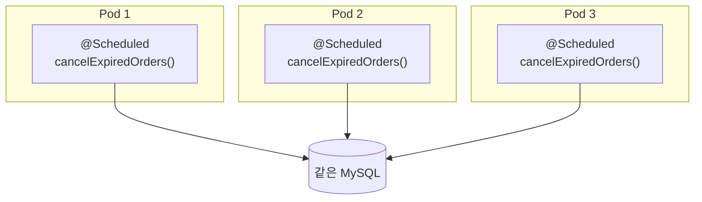
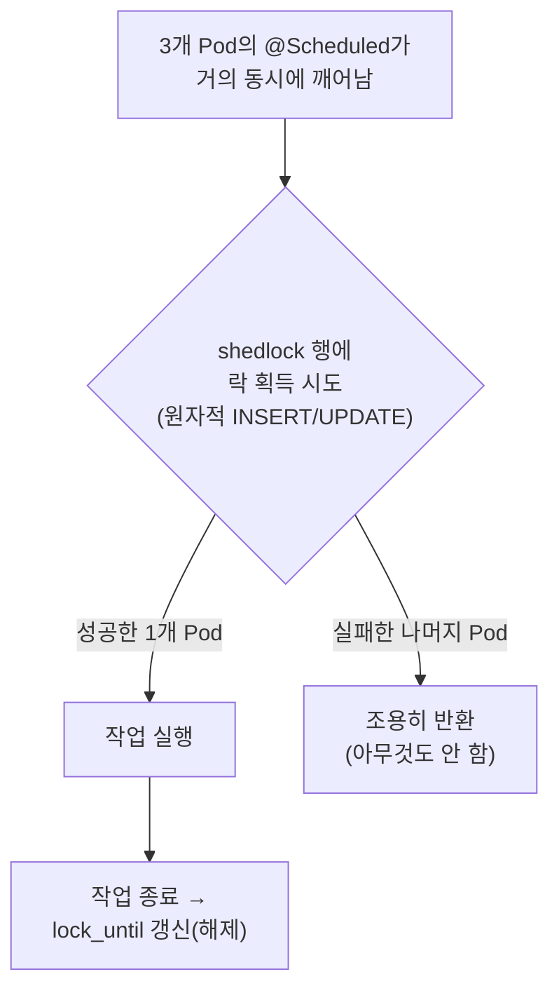
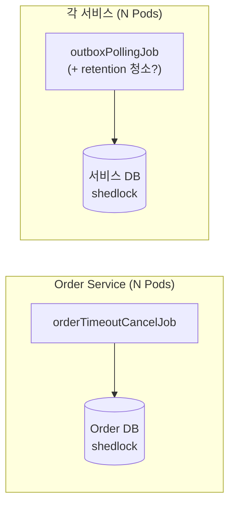

문제는 단순하다. `@Scheduled`는 **각 JVM 프로세스 안에서** 타이머를 돌린다. Pod이 하나일 땐 타이머도 하나라 아무 문제가 없다. 그런데 Phase 3에서 HPA가 Pod을 1→3으로 늘리면(`k8s/overlays/gke/hpa.yml`), 똑같은 `@Scheduled` 메서드가 **세 Pod에서 각자의 타이머로 동시에** 깨어난다. 60초마다 한 번 돌아야 할 주문 취소가 세 번 돌고, 5초마다 한 번이어야 할 Outbox 폴링이 세 번 돈다. "한 번만 일어나야 하는 일"이 인스턴스 수만큼 중복된다.

ShedLock은 이걸 DB 테이블 한 개와 락 레코드 한 행으로 푼다. 발상은 9편의 분산 락과 같은 결이지만 — "여러 주체가 한 자원에 동시에 손대지 못하게 한다" — 대상이 *재고 같은 도메인 자원*이 아니라 **주기 작업 그 자체**라는 점, 락 제공자가 *Redis(Redisson)*가 아니라 **DB(JDBC)**라는 점이 다르다. 왜 같은 프로젝트가 한쪽은 Redis 락, 한쪽은 DB 락을 쓰는지도 이 글에서 짚는다.

이 글에서 쓰는 용어는 다음 뜻으로 읽으면 된다.

| 용어                              | 이 글에서의 의미                                                                                                                                                |
| ------------------------------- | -------------------------------------------------------------------------------------------------------------------------------------------------------- |
| Pod / replica                   | Kubernetes의 애플리케이션 실행 단위. 이 글 맥락에선 **"PeekCart jar를 돌리는 컨테이너 하나 = JVM 프로세스 하나"**. 같은 앱을 여러 개 띄운 복제본을 replica라 하고, 그 수가 곧 동시에 같은 코드를 돌리는 JVM 개수다          |
| HPA (Horizontal Pod Autoscaler) | 부하(여기선 CPU 사용률)를 보고 Pod 수를 자동으로 늘렸다 줄였다 하는 Kubernetes 컨트롤러. PeekCart는 `min 1 / max 3 / CPU 60%`로 설정. 요청 처리량을 분산하려 Pod을 늘리지만, 그 부수효과로 `@Scheduled`까지 복제된다 |
| 스케줄러 중복 실행                      | 같은 `@Scheduled` 메서드가 여러 Pod에서 동시에 깨어나 같은 주기 작업을 N번 수행하는 현상                                                                                               |
| ShedLock                        | 분산 환경에서 "스케줄된 작업을 동시에 한 노드에서만" 실행시키는 라이브러리. 공유 저장소(여기선 MySQL)에 락 레코드를 두고 경쟁                                                                              |
| `@SchedulerLock`                | ShedLock이 가로채는 메서드 애너테이션. `name`(락 식별자), `lockAtMostFor`, `lockAtLeastFor`를 받는다                                                                          |
| `lockAtMostFor`                 | 락의 **최대 보유 시간**. 락을 쥔 노드가 죽어도 이 시간이 지나면 락이 강제로 풀려 다른 노드가 이어받는다. 일종의 안전장치(safety net)                                                                     |
| `lockAtLeastFor`                | 락의 **최소 보유 시간**. 작업이 아무리 빨리 끝나도 이 시간 전에는 락을 놓지 않는다. 노드 간 시계 오차로 인한 같은 주기 내 중복을 막는다                                                                       |
| `usingDbTime()`                 | 락 만료 비교를 **앱 JVM 시계가 아니라 DB 서버 시계**로 한다. 여러 앱 노드의 시계가 어긋나도 비교 기준이 하나로 통일된다                                                                               |
| `shedlock` 테이블                  | 락 상태를 담는 테이블. `name`이 PK라 락 이름 하나당 행 하나. `lock_until`, `locked_at`, `locked_by` 컬럼                                                                       |
| 상호 배제(mutual exclusion)         | ShedLock이 보장하는 것. "**같은 시점에 최대 한 노드에서만** 실행". "주기당 정확히 한 번"이나 "반드시 한 번"(at-least-once)을 보장하지는 않는다 — 트리거 편차나 락 조기 만료에 따라 같은 주기에 두 번 돌 수도, 아예 건너뛸 수도 있다    |

이번 학습에서 확인하고 싶은 질문은 다음과 같다.

1. `@Scheduled`는 어느 범위에서 도는가? Pod이 늘면 왜 그대로 N배가 되는가?
2. 스케줄러 중복 실행이 PeekCart의 두 작업(주문 취소 / Outbox 폴링)에서 각각 무엇을 깨뜨리는가?
3. ShedLock은 DB 행 하나로 "지금 누가 돌고 있다"를 어떻게 표현하는가? `@SchedulerLock`을 붙이면 정확히 무슨 SQL이 도는가?
4. `lockAtMostFor`와 `lockAtLeastFor`는 각각 어떤 실패를 막는가? 왜 둘 다 필요한가?
5. `usingDbTime()`은 왜 분산 환경에서 사실상 필수인가?
6. 9편의 Redis 분산 락이 이미 있는데, 왜 스케줄러 락은 DB로 갔는가?
7. Phase 2는 단일 인스턴스인데 왜 그때 ShedLock을 미리 박았는가? 그게 정말 이득인가?
8. 통합 테스트는 "여러 Pod 중 하나만 돈다"를 정말 증명했는가?

---

## 문제 상황: `@Scheduled`는 프로세스마다 돈다

`@Scheduled`의 실행 단위를 먼저 정확히 못 박자. 이 애너테이션은 Spring이 각 애플리케이션 컨텍스트 안에 띄우는 `TaskScheduler`(스레드 풀)에 타이머를 등록한다. 즉 **JVM 프로세스 하나에 타이머 하나**다. 클러스터를 알지 못하고, 다른 Pod의 존재도 모른다. 그래서 같은 jar를 세 Pod에 띄우면, 세 개의 독립된 `TaskScheduler`가 각자 60초·5초 타이머를 돌린다. 조율자는 어디에도 없다.

여기서 **Pod**이 무엇인지 한 줄로 짚어두자(자세한 건 13~14편). Kubernetes에서 Pod은 *애플리케이션의 실행 단위*다 — PeekCart 맥락에선 **"우리 jar를 돌리는 컨테이너 하나 = JVM 프로세스 하나"**라고 보면 된다. 같은 앱을 여러 Pod으로 띄우는 걸 **replica(복제본)**라 하고, 그 수가 곧 "지금 몇 개의 JVM이 같은 코드를 동시에 돌리고 있나"다. 앞 문단의 "JVM 프로세스 하나에 타이머 하나"를 여기 겹치면 **Pod이 N개면 같은 `@Scheduled` 타이머도 N개**라는 결론이 바로 나온다.

Pod이 하나인 Phase 2까지는 이게 정확히 의도대로다 replica가 1이라 타이머도 하나. 문제는 Phase 3에서 **HPA(Horizontal Pod Autoscaler)**가 들어오면서다. HPA는 Kubernetes가 **부하(여기선 CPU 사용률)를 보고 Pod 수를 자동으로 늘렸다 줄였다** 하는 컨트롤러다. "트래픽이 몰리면 인스턴스를 더 띄워 분산 처리한다"는, 대용량을 다루는 서비스라면 당연히 켜는 기능이다.

```yaml
# k8s/overlays/gke/hpa.yml
spec:
  minReplicas: 1          # 평소 최소 1개
  maxReplicas: 3          # 부하 시 최대 3개까지
  metrics:
    - type: Resource
      resource:
        name: cpu
        target:
          type: Utilization
          averageUtilization: 60   # Pod 평균 CPU가 60%를 넘으면 증설
```

즉 평상시 1개로 돌다가, Pod 평균 CPU가 60%를 넘으면 Kubernetes가 알아서 Pod을 최대 3개까지 늘린다(부하가 가라앉으면 다시 줄인다). 부하 테스트 세션 C(17편)에서 실제로 이 설정으로 1→3 scale-out이 관측됐다. 그런데 HPA는 **요청 처리량을 분산하려고** Pod을 늘리는 것이지, "백그라운드 스케줄러는 하나만 돌려야 한다"는 사정은 전혀 모른다. HPA에게 Pod은 다 똑같은 복제본이고, 복제본은 *코드 전체*를 복제하므로 `@Scheduled`도 함께 복제된다. 그래서 처리량을 위해 Pod을 늘린 부수효과로, **의도치 않게 스케줄러까지 3중으로 돌게** 된다. Pod이 3개가 되는 순간 두 스케줄러는 이렇게 된다.



세 Pod이 거의 동시에 깨어나 **같은 만료 주문 목록**을 조회하고, 각자 취소·재고 복구를 시도한다. 두 작업에서 구체적으로 무엇이 깨지는지 보자.

**(1) 결제 타임아웃 스케줄러 — 막는 주체는 ORD-002가 아니다**  
  
세 Pod이 같은 만료 주문 `#42`를 조회하고, 셋 다 `cancelExpiredOrder(42)`를 부른다. 각 호출은 `@Transactional(REQUIRES_NEW)`라 건별 독립 트랜잭션이고, 안에서 세 가지가 일어난다(`OrderCommandService`).  
  
```text
order.cancel()  →  재고 복구(restoreStock 루프)  →  order.cancelled 이벤트 발행
```
  
직관적으로는 "첫 Pod이 취소하면 나머지는 `ORD-002`(이미 취소됨)로 막히겠지"라고 생각하기 쉽다. **하지만 그렇지 않다.** 핵심은 **`Order` 엔티티에 `@Version`도 행 잠금도 없다**는 점이다(`Order.java`). 그래서 두 가지 경합이 다르게 갈린다.  
  
- **시차 경합** — Pod A가 *커밋을 끝낸 뒤* Pod B가 읽는 경우. B는 이미 `CANCELLED`인 `#42`를 보고 `cancel()`에서 `ORD-002`를 맞는다. 여기서만 `ORD-002`가 발화한다.  
- **동시 경합** — 두 Pod이 *둘 다 커밋 전*에 읽는 경우. 둘 다 상태가 `PAYMENT_REQUESTED`라 **둘 다 `cancel()` 가드를 통과한다.** `@Version`이 없으니 충돌도 감지되지 않는다. 즉 진짜 동시 경합에서 `ORD-002`는 아무것도 막지 못한다.  
  
그럼 동시 경합에서 정합성을 받치는 건 무엇인가? **`Inventory`의 `@Version`이다**(`Inventory.java`). 두 트랜잭션이 같은 재고를 복구하려 하면 하나만 커밋되고 나머지는 `OptimisticLockingFailureException`을 맞는다. 그러면 `REQUIRES_NEW` 트랜잭션 전체가 롤백되어 그 안의 `order.cancel()`과 Outbox INSERT까지 함께 되돌아간다. 이 예외는 `cancelSafely`의 `catch (Exception)`가 에러 로그로 흡수한다(7편). 9편에서 본 **"낙관적 락이 최후 방어선"** 구도가 여기서 다시 작동하는 셈이다.  
  
그런데 이 방어는 깔끔하지도, 무조건적이지도 않다.  
  
- 막는 주체가 `cancel()`의 도메인 가드가 아니라 **엉뚱하게도 재고 엔티티의 낙관적 락**이다. 그래서 "모든 주문에 재고 항목이 있다"는 전제와 격리 수준(InnoDB 기본 `REPEATABLE READ`)에 기댄다.  
- `ORD-002` 스킵처럼 조용히 넘어가는 게 아니라 **예외·롤백·에러 로그**를 동반한다.  
  
그래서 결론은 **ShedLock은 단순 부하 최적화가 아니라 현재 구현의 정합성 방어선이기도 하다.** `Order` 자체에 동시성 제어가 없는 상태에서, 경합이 2차 방어선(재고 `@Version`)까지 내려가기 *전에* 1차에서 끊어주기 때문이다.  
  
부수적인 비용도 있다. ShedLock이 없으면 **세 Pod이 같은 조회(`findByStatusAndOrderedAtBefore`)를 1분마다 반복**한다. 이 조회는 `idx_orders_status_ordered_at (status, ordered_at)` 인덱스를 타는 범위 조회라 풀스캔은 아니지만, 동일 범위 조회가 인스턴스 수만큼 중복되며 헛돌고 롤백·로그를 남긴다.  
  
**(2) Outbox 폴링 스케줄러 — 중복 발행으로 이어진다**  
  
이쪽은 더 직접적이다. 세 Pod이 5초마다 `findPendingEvents(100)`로 같은 `PENDING` 이벤트를 조회하고, 각자 `kafkaTemplate.send()`로 발행한다. 결과적으로 같은 `event_id`가 토픽에 **세 번** 들어간다.  
  
물론 이 중복은 11편의 Consumer 멱등성(`processed_events`)이 받아내도록 설계돼 있다 — at-least-once는 어차피 중복을 전제하니까. 하지만 "받아낼 수 있다"와 "일부러 3배로 만든다"는 다르다. 발행량이 인스턴스 수만큼 부풀고, Kafka·Consumer·`processed_events` UK 충돌 처리에 불필요한 부하가 걸린다. 게다가 Outbox 행을 `PUBLISHED`로 바꾸는 UPDATE까지 세 Pod이 경합한다.  
  
**정리하면** 스케줄러 중복 실행이 나도, 하위 방어선(재고 `@Version`, Consumer 멱등성)이 받쳐주는 한 최종 정합성은 지켜진다. 하지만 그 방어는 `Order`처럼 동시성 제어가 없는 곳에서는 *조건부*(재고 항목 존재, 격리 수준)이고 깔끔하지도 않다. 게다가 "한 번이면 될 일을 N번" 하면서 불필요한 부하·로그 소음·발행 증폭을 만든다.  
  
이건 9편의 "1차 방어선은 충돌을 *예방*하고, 2차 방어선은 *최후에 막는다*"는 구도와 똑같다. **ShedLock이 1차 방어선**(중복 자체를 안 만든다)이고, 재고 `@Version`·Consumer 멱등성이 2차 방어선(만들어져도 흡수한다)이다. 그리고 1차가 빠지면, 정합성은 통째로 2차의 *조건*에 매달리게 된다.

---

## 선택한 설계: "지금 누가 돌고 있다"를 DB 한 행으로 표현한다

ShedLock의 발상은 단순하다. 클러스터 어디에도 조율자가 없으니, **모두가 공유하는 한 곳**(여기선 MySQL)에 "이 작업은 지금 누가, 언제까지 쥐고 있다"를 적어 두고, 스케줄러가 깨어날 때마다 그 행을 보고 들어갈지 말지를 정한다.



핵심은 "모든 Pod이 깨어나긴 한다"는 점이다. ShedLock은 타이머를 끄지 않는다. 세 Pod 모두 `@Scheduled`가 정상적으로 발화하고 셋 다 락을 잡으러 DB로 달려간다. 다만 **락을 잡는 데 성공한 하나만 실제 작업을 하고 나머지는 즉시 빠진다.** 이건 11편에서 "`exists()`는 정확성의 근거가 아니라 fast path일 뿐, 정확성은 UK가 보장한다"고 했던 것과 같은 사고방식이다. ShedLock의 정확성도 전적으로 **DB 락 레코드의 원자적 획득**이 보장한다. "Pod 하나만 스케줄링한다"가 아니라 "모두 스케줄링하되 하나만 이긴다"가 정확한 멘탈 모델이다.

이 설계의 결정 두 가지를 짚는다.

### 왜 Redis가 아니라 DB인가

PeekCart엔 이미 분산 락이 있다. 9편의 재고 차감 락은 Redisson(Redis)으로 구현했다. 그런데 스케줄러 락은 `JdbcTemplateLockProvider` 즉 **MySQL**을 쓴다. 같은 프로젝트가 두 가지 분산 락 인프라를 쓰는 셈인데, 이건 의도된 선택이다.

| | 9편 재고 분산 락 (Redisson) | 12편 스케줄러 락 (ShedLock / JDBC) |
| --- | --- | --- |
| 보호 대상 | 도메인 자원 (특정 상품 재고) | 주기 작업 (스케줄러 메서드) |
| 락 생명주기 | 요청 단위 (수십 ms~수 초) | 주기 단위 (5초~분 단위) |
| 경합 빈도 | 높음 (동시 주문 폭주 시 초당 수백) | 낮음 (5초/60초에 한 번) |
| 요구 성능 | 낮은 지연이 중요 (주문 응답 경로) | 지연 무관 (백그라운드) |
| 저장소 | Redis | MySQL |

재고 락은 **사용자 주문 응답 경로**에 있어 매 요청 수 ms 안에 잡고 풀어야 하고 경합이 격심하다. 인메모리 Redis가 맞다. 반면 스케줄러 락은 5초·60초에 한 번, 백그라운드에서 잡힌다. PeekCart에 Redis가 이미 있더라도, 이 저빈도 작업은 ShedLock이 제공하는 JDBC 저장소를 써서 애플리케이션이 이미 의존하는 MySQL 안에서 단순하게 관리할 수 있다. PHASE2 기록의 표현대로 "이미 MySQL을 쓰고 있으므로 별도 인프라가 불필요"하다. DB 행으로 락 상태가 남으니 `locked_at`, `locked_by`, `lock_until`을 SQL로 바로 조회할 수 있다는 운영상 장점도 있다.

물론 공짜는 아니다. 스케줄러 락 쿼리가 MySQL에 추가 부하를 준다. 특히 Outbox 폴링은 5초마다라, Pod마다 5초에 한 번씩 `shedlock` 행에 락 쿼리를 날린다. D-002 부하 테스트에서 MySQL이 병목 후보로 지목된 걸 생각하면 무시할 수만은 없지만 — 5초에 PK 한 행을 UPDATE하는 비용은 폴링 쿼리(`findPendingEvents`) 자체에 비하면 미미해서, 실용적으론 받아들일 만한 트레이드오프다.

### 왜 작업 자체가 멱등/재진입 가능해야 하는가 — ShedLock은 상호 배제다

여기가 ShedLock을 안전하게 쓰는 전제다. ShedLock이 보장하는 건 정확히 **"같은 시점에 최대 한 노드에서만"(상호 배제)**이지, "주기당 정확히 한 번"도 "반드시 한 번"(at-least-once)도 아니다. 두 방향으로 어긋날 수 있다. (1) 락을 잡은 Pod이 작업 도중 죽으면 그 작업은 **그냥 안 일어나고** `lockAtMostFor` 만료 후 *다음* 발화 때 누군가 다시 잡아 처리한다(건너뜀). (2) 반대로 트리거 편차가 `lockAtLeastFor`보다 크거나 `lockAtMostFor`가 실행 중 만료되면, **같은 주기에 두 번** 돌 수도 있다(겹침). 즉 "주기 경계"라는 전역 개념은 ShedLock에 없다. 있는 건 "지금 이 순간 둘이 동시에 들어오지 못한다"뿐이다.

그래서 두 스케줄러는 "한 주기를 건너뛰어도 다음 주기가 메꾼다"가 성립하도록 짜여 있어야 한다. 실제로 그렇다.

- **주문 취소**: 한 주기를 건너뛰어도 `#42`는 여전히 `PAYMENT_REQUESTED`에 컷오프 이전이라, 다음 60초 주기의 `findByStatusAndOrderedAtBefore`가 또 잡는다. 쿼리 자체가 "아직 처리 안 된 것"을 정의하므로 재진입이 자연스럽다.
- **Outbox 폴링**: 한 주기를 건너뛰어도 그 이벤트는 여전히 `PENDING`이라, 다음 5초 주기가 또 발행한다(10편).

즉 두 작업 다 **상태를 기준으로 다시 시도할 수 있는 작업**이라, 건너뛰어도("이번 주기에 못 했으면 다음 주기에") 겹쳐도(같은 후보를 두 Pod이 다시 시도 → 앞 절의 재고 `@Version`/`processed_events`가 흡수) 결과가 수렴한다. 작업 본문이 언제나 완전히 멱등한 것은 아니지만, 하위 방어선까지 포함한 시스템은 재시도 후 수렴하도록 설계되어 있다. 이 성질이 있어야 ShedLock의 상호 배제 *만으로* 충분하다. 만약 "정확히 이 시각에 반드시 한 번"이 요구되는 작업(예: 외부에 한 번만 보내야 하는 정산 마감)이었다면, 건너뜀·겹침 양쪽 다 사고가 되므로 ShedLock만으로는 부족하고 별도 보장이 필요했을 것이다. 다행히 PeekCart의 두 작업은 그렇지 않다.

---

## 구현 구조

### 1. `shedlock` 테이블 — 락 이름 하나당 행 하나

Flyway 마이그레이션으로 테이블을 만든다. 구조는 ShedLock이 요구하는 표준 스키마 그대로다.

```sql
CREATE TABLE shedlock (
    name       VARCHAR(64)  NOT NULL,
    lock_until TIMESTAMP(3) NOT NULL,
    locked_at  TIMESTAMP(3) NOT NULL DEFAULT CURRENT_TIMESTAMP(3),
    locked_by  VARCHAR(255) NOT NULL,
    PRIMARY KEY (name)
) ENGINE=InnoDB DEFAULT CHARSET=utf8mb4;
```

네 컬럼의 의미가 곧 ShedLock의 동작이다.

- `name`: 락 식별자이자 **PK**. `@SchedulerLock(name = ...)`의 값이 그대로 들어간다. PK라서 **락 이름 하나당 행은 영원히 하나**다. 행이 새로 쌓이지 않고 같은 행이 계속 갱신된다(11편 `processed_events`가 처리마다 행이 쌓이는 것과 대조적이다).
- `lock_until`: **이 시각까지 락이 유효하다.** 다른 노드는 `lock_until <= now`일 때만 락을 빼앗을 수 있다. `TIMESTAMP(3)`로 밀리초 정밀도를 둔 건 5초 주기처럼 짧은 작업에서 시각 비교가 거칠면 안 되기 때문이다.
- `locked_at`: 락을 마지막으로 잡은 시각. `lockAtLeastFor` 계산의 기준점이다.
- `locked_by`: 누가 잡았는지(호스트명/Pod명). 사람이 "지금 어느 Pod이 쥐고 있나"를 보는 디버깅 용도이기도 하지만, **기능적 역할도 있다** — 해제 SQL의 `WHERE`에 `locked_by`가 들어가, 노드는 **자기가 잡은 락만 풀 수 있다**(§4). 락이 `lockAtMostFor` 만료로 다른 Pod에 넘어간 뒤 원래 Pod이 뒤늦게 해제를 시도해도, `locked_by`가 안 맞아 남의 락을 풀지 못한다.

### 2. `ShedLockConfig` — 한 번의 설정

설정은 클래스 하나가 전부다.

```java
@Configuration
@EnableSchedulerLock(defaultLockAtMostFor = "PT10M")
public class ShedLockConfig {

    @Bean
    public LockProvider lockProvider(DataSource dataSource) {
        return new JdbcTemplateLockProvider(
                JdbcTemplateLockProvider.Configuration.builder()
                        .withJdbcTemplate(new JdbcTemplate(dataSource))
                        .usingDbTime()                    // ← DB 서버 시계로 락 만료 비교
                        .build()
        );
    }
}
```

두 가지가 핵심이다.

**`@EnableSchedulerLock`**: ShedLock의 AOP를 켠다. `@SchedulerLock`이 붙은 메서드를 가로채, 실행 전에 락 획득을 시도하고 실패하면 메서드 본문을 통째로 건너뛰는 어드바이스를 끼운다. `defaultLockAtMostFor = "PT10M"`은 `lockAtMostFor`를 명시 안 한 `@SchedulerLock`에 적용될 기본값인데 PeekCart의 두 스케줄러는 둘 다 자기 값을 명시하므로(아래), 이 기본값은 사실상 안전망일 뿐 실제로 쓰이지 않는다.

**`usingDbTime()`**: 이게 분산 환경에서 사실상 필수인 설정이다. ShedLock의 모든 판단은 "지금이 `lock_until`을 지났나"라는 시각 비교다. 이 비교를 **각 앱 Pod의 로컬 JVM 시계**로 하면, Pod들의 시계가 조금만 어긋나도(클라우드 VM에서 흔하다) 한 Pod은 "아직 락 유효"라 보고 다른 Pod은 "이미 만료"라 봐서 **둘 다 작업을 실행**하는 사고가 난다. `usingDbTime()`을 켜면 락 획득/해제 SQL이 `NOW()` 같은 **DB 서버 시각**을 쓰도록 바뀐다. 비교 기준이 MySQL 하나로 통일돼, 앱 노드 간 시계 오차가 방정식에서 빠진다.

### 3. 두 스케줄러에 `@SchedulerLock` 한 줄

```java
// OrderTimeoutScheduler — 60초 주기
@Scheduled(fixedDelay = 60_000)
@SchedulerLock(name = "orderTimeoutCancelJob", lockAtMostFor = "PT10M", lockAtLeastFor = "PT30S")
public void cancelExpiredOrders() { ... }

// OutboxPollingScheduler — 5초 주기
@Scheduled(fixedDelay = 5000)
@SchedulerLock(name = "outboxPollingJob", lockAtMostFor = "PT5M", lockAtLeastFor = "PT4S")
public void pollAndPublish() { ... }
```

`name`은 두 작업이 서로 다른 락을 쓰도록 구분한다. `orderTimeoutCancelJob`과 `outboxPollingJob`은 `shedlock` 테이블의 별개 행이라 주문 취소와 Outbox 폴링은 서로를 막지 않고 각자 독립적으로 "하나만 실행"된다. `lockAtMostFor`/`lockAtLeastFor` 두 값이 이 절의 핵심이라 따로 본다.

### 4. `@SchedulerLock`이 붙으면 도는 SQL

추상적인 "락을 잡는다"를 SQL로 내려보자. 아래는 ShedLock 6.3.1의 `usingDbTime()` 경로(`MySqlServerTimeStatementsSource`)가 실제로 쓰는 문장이다(`:name` 같은 named parameter는 그대로 두었다). 락을 잡을 때 하는 일은 두 단계다.

**락 획득** — 먼저 `INSERT IGNORE`를 시도한다.

```sql
INSERT IGNORE INTO shedlock (name, lock_until, locked_at, locked_by)
VALUES (:name,
        TIMESTAMPADD(MICROSECOND, :lockAtMostForMicros, UTC_TIMESTAMP(3)),  -- lock_until = now + lockAtMostFor
        UTC_TIMESTAMP(3),
        :lockedBy);
```

행이 없으면(최초 실행) 삽입에 성공하고 락을 얻는다. 행이 이미 있으면 `INSERT IGNORE`라 **PK 충돌을 조용히 무시**하고 0행이 들어간다. 그러면 UPDATE로 넘어간다.

```sql
UPDATE shedlock
   SET lock_until = TIMESTAMPADD(MICROSECOND, :lockAtMostForMicros, UTC_TIMESTAMP(3)),
       locked_at  = UTC_TIMESTAMP(3),
       locked_by  = :lockedBy
 WHERE name = :name
   AND lock_until <= UTC_TIMESTAMP(3);   -- ← 이전 락이 이미 만료된 경우에만
```

이 UPDATE가 **원자적 경쟁의 핵심**이다. `WHERE lock_until <= UTC_TIMESTAMP(3)`는 "현재 락이 만료됐을 때만" 갱신한다. 세 Pod이 동시에 이 UPDATE를 날려도, MySQL의 행 잠금이 직렬화해서 **딱 한 Pod의 UPDATE만 1행을 affect**하고 나머지는 0행이 된다. ShedLock은 "1행이 바뀌었으면 락 획득 성공, 0행이면 실패"로 판단한다. 시각이 전부 `UTC_TIMESTAMP(3)`(DB 서버 시각)인 게 `usingDbTime()`의 효과다.

**락 해제** — 작업이 끝나면 락을 푼다. 그런데 그냥 지우는 게 아니라 `lock_until`을 갱신한다.

```sql
UPDATE shedlock
   SET lock_until = IF(TIMESTAMPADD(MICROSECOND, :lockAtLeastForMicros, locked_at) > UTC_TIMESTAMP(3),
                       TIMESTAMPADD(MICROSECOND, :lockAtLeastForMicros, locked_at),
                       UTC_TIMESTAMP(3))
 WHERE name = :name
   AND locked_by = :lockedBy;            -- ← 자기가 잡은 락만 푼다
```

두 가지를 짚는다. (1) `IF(...)`는 "작업이 `lockAtLeastFor`보다 빨리 끝났으면 `locked_at + lockAtLeastFor` 시각까지 락을 유지하고, 그보다 오래 걸렸으면 지금 즉시 푼다"이다. `lockAtLeastFor`가 이렇게 강제된다. (2) `WHERE`의 `AND locked_by = :lockedBy`가 §1에서 말한 "자기 락만 해제" 보호다. 만약 이 작업이 `lockAtMostFor`를 넘겨 락이 이미 다른 Pod으로 넘어갔다면(`locked_by`가 바뀜), 뒤늦은 이 해제는 0행을 affect해 **남의 락을 풀지 못한다.** 해제가 삭제가 아니라 `lock_until` 갱신인 덕에 행은 영구히 재사용된다.

### 5. `lockAtMostFor`와 `lockAtLeastFor` — 막는 실패가 다르다

이 두 값이 ShedLock 설정의 전부이자 가장 헷갈리는 부분이다. 둘은 **정반대 방향의 실패**를 막는다.

**`lockAtMostFor` — "락을 쥔 채 죽는" 실패를 막는다 (상한)**

락을 잡은 Pod이 작업 도중 크래시하면(OOM, Pod 강제 종료 등) 정상적인 해제 SQL을 실행할 기회가 없다. `lockAtMostFor`는 락을 잡을 때부터 `lock_until = now + lockAtMostFor`로 강제 만료선을 기록한다. 죽은 Pod의 락도 이 시간이 지나면 만료된 것으로 취급되어, 다른 Pod이 이어받을 수 있다.

값 선정의 트레이드오프가 여기 있다. `lockAtMostFor`는 **작업의 최대 실행 시간보다 반드시 길어야** 한다. 너무 짧으면 작업이 그 시간보다 오래 실행 중인데 락이 만료돼버려, **다른 Pod이 같은 작업을 동시에 시작**한다(중복 실행 재발!). 너무 길면 진짜로 죽었을 때 그 시간만큼 작업이 멈춰 있는다. PeekCart는 주문 취소 `PT10M`, Outbox 폴링 `PT5M`로 잡았다. 분 단위로 크게 잡은 건 **"중복 실행 위험"보다 "크래시 시 복구 지연"을 택한** 보수적 선택이다. 중복은 더 비싼 사고이므로 안전 마진을 뒀다. 다만 여기엔 함정이 있다. "작업의 최대 실행 시간"이 코드로 한정돼 있지 않다(특히 Outbox 폴링). 정상 경로에선 수 초로 끝나지만, 브로커가 느려지면 그렇지 않다. 「한계」절에서 자세히 본다.

**`lockAtLeastFor` — "너무 빨리 풀려서 같은 주기에 또 도는" 실패를 막는다 (하한)**

이쪽이 덜 직관적이다. 작업이 아주 빨리 끝나는 경우를 생각하자. Outbox 폴링이 `PENDING` 이벤트가 하나도 없어 10ms 만에 끝났다고 하자. `lockAtLeastFor`가 없으면 락이 10ms 만에 풀린다. 그런데 Pod A의 5초 타이머와 Pod B의 5초 타이머는 시작 시각이 미세하게 어긋나 있다(시계 오차 + 스케줄링 지터). Pod A가 락을 잡아 10ms 만에 끝내고 풀었는데, 50ms 뒤 Pod B의 타이머가 깨어나 보니 락이 비어 있다 → Pod B가 또 같은 주기 작업을 한다. **같은 5초 구간에 두 번 실행**된 것이다. `lockAtLeastFor`는 "아무리 빨리 끝나도 최소 이만큼은 락을 쥐고 있어라"라고 해서, 이 시계 오차 창을 덮는다.

그래서 `lockAtLeastFor`는 **같은 주기 안의 예상 지터를 덮되 정상적인 다음 주기는 막지 않는 값**으로 잡는다. PHASE2 기록의 근거 그대로다 — 주문 취소는 60초 주기에 `PT30S`, Outbox는 5초 주기에 `PT4S`. 주기 전체를 잠그는 게 아니라, 작업이 너무 빨리 끝난 직후 다른 Pod이 뒤늦게 들어오는 창을 닫는 값이다.

| | 막는 실패 | 방향 | PeekCart 값 |
| --- | --- | --- | --- |
| `lockAtMostFor` | 락 쥔 채 노드 크래시 → 영구 교착 | 상한 (최대 보유) | 주문 PT10M / Outbox PT5M |
| `lockAtLeastFor` | 작업 조기 종료 + 시계 오차 → 같은 주기 중복 | 하한 (최소 보유) | 주문 PT30S / Outbox PT4S |

두 값은 "크래시 복구"와 "중복 방지"라는 양쪽 끝을 각각 잡는다. 하나만 있으면 반대쪽이 뚫린다.

---

## 한계와 트레이드오프

### Phase 2에서는 ShedLock이 사실상 dead weight다

가장 정직하게 짚어야 할 점이다. Phase 2는 **단일 인스턴스**다. Pod이 하나면 스케줄러 중복 실행 자체가 일어날 수 없으니, ShedLock이 막을 문제가 없다. 그런데도 Phase 2에 ShedLock을 넣었다. `shedlock` 행을 잡고 푸는 SQL이 5초·60초마다 도는데, 그게 막아주는 사고는 Phase 2엔 존재하지 않는다. 순수하게 보면 **부하만 더하고 이득은 0인 코드**다.

설계 단계에서는 이걸 명시적 선택으로 두었다. "Phase 2에서는 단일 인스턴스이므로 ShedLock의 분산 락 기능이 즉시 필요하지 않다. 그러나 스케줄러 구현 시점(Phase 2)에 함께 적용하여 Phase 3~4 분산 환경 전환 시 추가 작업 비용을 제거한다." 즉 **마이그레이션 비용의 선지급**이다. 7편 말미의 "지금은 단일 인스턴스지만, 분산을 가정한 형태로 미리 염두에둔다"와 같은 논리. 이게 정당한지는 갈린다. (1) 적용 비용이 애너테이션 한 줄 + 설정 한 클래스로 극히 작고, (2) Phase 3 HPA가 **확정된 로드맵**이라 "쓸지 안 쓸지 모르는 유연성"이 아니라 "곧 반드시 필요한 것"이며, (3) 나중에 분산 사고가 터진 뒤 붙이면 이미 중복 실행된 데이터를 수습해야 한다. 투기가 아니라 **예정된 부채의 선상환**에 가깝다. 그래도 "Phase 2 시점엔 끄고 Phase 3 overlay에서 켜는" 선택지도 있었다는 건 인정해야 한다.

### `lockAtMostFor`는 작업 시간을 *추측*한 값이다.

`lockAtMostFor`의 안전성은 "작업이 이 시간 안에 끝난다"는 전제 위에 선다. 그런데 Outbox 폴링의 실제 최대 실행 시간은 코드로 한정돼 있지 않다. 10편에서 본 `OutboxPollingService`의 `kafkaTemplate.send(...).get()`은 **타임아웃 인자가 없고** 한 사이클이 `BATCH_SIZE=100`건을 **순차로** `.get()` 한다. 여기서 흔한 오해를 짚어야 한다. `delivery.timeout.ms`(기본 120초)는 **레코드 한 건의 상한**이지 사이클 전체의 상한이 아니다. 브로커가 느려지면 건당 최대 ~120초가 100건에 누적될 수 있어, 산술적으로 **3건째부터도 5분(`PT5M`)을 넘길 수 있다.** 게다가 `send()` 자체가 메타데이터 확보를 위해 블록하는 `max.block.ms`(기본 60초)도 별도로 더해질 수 있다.

그래서 결론은 "지금 값이 우연히 안전하다"가 아니라 **"현재 코드는 폴링 사이클의 실행 시간 상한을 증명하지 못한다"**이다. 사이클이 `PT5M`을 넘기면 ShedLock이 락을 만료시켜 **다른 Pod이 폴링을 동시에 시작**한다 → 중복 발행. 다행히 그 중복마저 11편의 Consumer 멱등성이 받아내도록 설계돼 있어 정합성은 안 깨지지만, "ShedLock의 `lockAtMostFor`와 producer 타임아웃은 한 손잡이의 양면"이라는 건 분명하다. L-010(`.get()` 타임아웃 부재)을 고칠 때 `.get(timeout)`·`delivery.timeout.ms`·`max.block.ms`로 **사이클 상한을 먼저 한정하고**, 그 상한과 정합하도록 `lockAtMostFor`를 잡아야 비로소 "락보다 오래 사는 작업"이 닫힌다.

### `@Scheduled(fixedDelay)`와 ShedLock의 미묘한 어긋남

`fixedDelay`는 "이전 실행 **종료** 후 N ms 뒤 다음 실행"이다. 그런데 ShedLock으로 락을 못 잡아 즉시 빠진 Pod에서는, 그 "실행"이 사실상 0ms 만에 끝난 것으로 처리된다. 그래서 락을 계속 놓치는 Pod의 타이머는 `fixedDelay` 간격으로 계속 헛돈다. 5초마다 깨어나 락 시도 → 실패 → 즉시 반환 → 5초 뒤 또. 무해하지만 "락을 못 잡는 Pod들도 주기마다 DB 락 쿼리를 날린다"는 비용은 있다. Pod 3개면 Outbox 락 쿼리가 5초에 3번 발생하고, 그중 2번은 "0행 UPDATE"로 헛친다. 앞서 말한 MySQL 추가 부하의 실체가 이것이다. 단일 인스턴스 대비 락 경쟁 쿼리가 인스턴스 수만큼 는다.

### 락 이름 충돌은 컴파일 타임에 안 잡힌다

`@SchedulerLock(name = "...")`의 `name`은 문자열 상수다. 만약 두 다른 스케줄러에 같은 `name`을 실수로 주면, ShedLock은 둘을 **같은 락으로 취급**해 한쪽이 돌 때 다른 쪽이 막힌다. 전혀 무관한 두 작업이 서로를 배제하는 silent bug다. 컴파일러도 ShedLock도 이걸 잡아주지 않는다. 현재는 `orderTimeoutCancelJob`/`outboxPollingJob` 둘뿐이라 문제없지만, 작업이 늘면 락 이름을 상수로 모아 관리하거나 네이밍 규칙을 두는 편이 안전하다. Phase 4에서 서비스가 쪼개지면 더 그렇다.

### 락이 DB에 묶이는 건 LockProvider 선택의 결과다 (usingDbTime의 책임이 아니다)

스케줄러 락이 MySQL의 가용성에 묶이는 건 **`JdbcTemplateLockProvider`를 고른 시점**에 생긴 의존성이다. 락 상태를 DB 테이블에 두기로 한 결정 그 자체. `usingDbTime()`은 그 의존성을 *만드는* 게 아니라, 이미 DB에 둔 락의 **만료 비교 기준을 앱 시계가 아니라 DB 시계로 통일**하는 별개의 선택이다(둘을 혼동하면 안 된다). MySQL이 죽으면 락을 잡을 수도 풀 수도 없어 스케줄러가 멈추지만 이건 ShedLock만의 문제가 아니라 애초에 앱 자체가 그 MySQL에 의존하므로 "DB가 죽으면 어차피 다 멈춘다"는 큰 그림 안에 있다. Phase 4에서 서비스별 DB로 쪼개지면 각 서비스의 스케줄러가 자기 DB의 `shedlock`을 쓰게 돼 그 의존 범위가 서비스 단위로 좁아진다(뒤 절).

---

## 통합 테스트로 검증된 것 (과 못한 것)

`ShedLockIntegrationTest`는 Testcontainers로 MySQL + Redis + Kafka를 띄우고 실제 스케줄러가 도는 걸 관찰한다. `spring.task.scheduling.pool.size=1`로 스케줄러 스레드를 묶어두고 두 가지를 단언한다.

**1. `shedlock` 테이블이 Flyway로 생성되고, 스케줄러 실행 시 락 레코드가 기록된다**

```java
// 테이블 존재 확인
Integer tableCount = jdbcTemplate.queryForObject(
        "SELECT COUNT(*) FROM information_schema.tables WHERE table_schema = DATABASE() AND table_name = 'shedlock'",
        Integer.class);
assertThat(tableCount).isEqualTo(1);

// 스케줄러가 돌면 락 레코드가 생긴다
await().atMost(Duration.ofSeconds(15)).pollInterval(Duration.ofSeconds(1))
        .untilAsserted(() -> {
            Integer lockCount = jdbcTemplate.queryForObject("SELECT COUNT(*) FROM shedlock", Integer.class);
            assertThat(lockCount).isGreaterThanOrEqualTo(1);
        });
```

**2. `outboxPollingJob` 락 레코드가 생성된다** — `name = 'outboxPollingJob'` 행이 정확히 1건 생기는지 확인한다. 락 이름이 의도대로 행으로 매핑되는지를 본다.

이 두 테스트가 증명하는 건 **"배선이 됐다"**는 것이다. Flyway가 테이블을 만들고, `@EnableSchedulerLock`이 동작해 스케줄러 실행이 `shedlock` 행으로 이어진다. 즉 ShedLock이 *켜져 있고 락을 기록한다.*

**그런데 이 테스트가 증명하지 *못한* 것이 ShedLock의 존재 이유 그 자체다.**

- **상호 배제(여러 인스턴스 중 하나만 실행)를 검증하지 않는다.** 테스트는 **단일 Spring 컨텍스트**에서 돈다. Pod이 하나뿐이니 애초에 경쟁이 없다. "두 인스턴스가 같은 주기에 깨어났을 때 *하나만* 작업을 실행하더라"라는, ShedLock을 도입한 유일한 이유는 코드 어디서도 단언되지 않는다. 11편에서 "동시 중복(UK 충돌 경로)을 재현하지 않는다"가 멱등성의 핵심 검증 공백이었던 것과 **정확히 같은 종류의 공백**이다 — 헤드라인 보장이 테스트되지 않았다.
- **`lockAtLeastFor`/`lockAtMostFor`의 효과를 검증하지 않는다.** 조기 종료 시 락이 최소 시간 유지되는지, 크래시 시 최대 시간 후 풀리는지 — 둘 다 코드 읽기와 ShedLock 라이브러리 신뢰에 맡겨져 있다.
- **`usingDbTime()`의 시계 오차 방어를 검증하지 않는다.** 노드 간 시계를 어긋나게 만드는 시나리오가 없으니, DB 시각 사용이 실제로 무엇을 막는지는 논증으로만 남는다.

상호 배제를 통합 테스트로 박으려면 **두 개의 독립된 락 제공자(또는 두 컨텍스트)가 같은 `shedlock` 테이블을 두고 경쟁**하게 만들어, 동시에 작업을 트리거했을 때 한쪽만 실행 카운터를 올리는 걸 단언해야 한다. 지금은 그게 없다. 정리하면, 테스트는 **"ShedLock이 배선되어 락을 기록한다"**는 단단히 잡지만, **"경쟁 시 하나만 이긴다"**는 설계의 본질은 검증 공백으로 남아 있다.

---

## 자료는 어떤 질문에 연결해서 읽을까

| 질문 | 같이 읽을 자료 | 이 글에서 연결되는 지점 |
| --- | --- | --- |
| `@Scheduled`는 어느 범위에서 도는가 | Spring Framework Reference, *Task Execution and Scheduling* | "문제 상황" 절 |
| 분산 환경 스케줄러 중복 실행과 ShedLock | ShedLock 공식 README, `04-design-deep-dive.md` §9-10 | 전반 |
| `lockAtMostFor`/`lockAtLeastFor` 의미 | ShedLock README, *Lock at most/least for* | §5 두 값 비교 |
| `usingDbTime()`과 시계 오차 | ShedLock README, *Caveats / using database time* | §2 설정 절 |
| DB 락 vs Redis 락 선택 | 9편(Redisson 분산 락), `docs/progress/PHASE2.md` Task 2-6 | "왜 DB인가" 절 |
| 스케줄러가 푸는 두 작업의 원형 | 7편(타임아웃 스케줄러), 10편(Outbox 폴링) | "문제 상황" 두 작업 |
| 중복 발행을 받아내는 하위 방어선 | 11편(Consumer 멱등성·`processed_events`) | Outbox 중복 / lockAtMostFor 초과 |
| HPA scale-out 실측 | `loadtest/reports/2026-04-29/REPORT.md`, 17편 | HPA 1→3 절 |

---

## Phase 4 MSA에서는 어떻게 바뀌는가

ShedLock은 Phase 2에 만들었지만 Phase 3 HPA에서 비로소 일을 시작했고, Phase 4에서는 그 필요가 더 커진다. 서비스가 쪼개져도 각 서비스가 여러 Pod으로 뜨는 한 스케줄러 중복 문제는 그대로 남기 때문이다.



**그대로 가는 것**

- **상호 배제 + 재시도 후 수렴하는 작업이라는 전제.** 서비스가 쪼개져도 "건너뛰면 다음 주기가 메꾸고, 겹쳐도 하위 방어선이 흡수한다"는 성질은 변하지 않는다. 오히려 분산에서 노드 크래시가 더 흔해지므로, 이 전제 위에 선 ShedLock의 상호 배제가 더 잘 맞는다.
- **DB 기반 락 선택.** 각 서비스가 자기 DB를 갖게 되면, 스케줄러 락도 그 서비스 DB의 `shedlock`을 쓰면 된다. 별도 락 인프라가 필요 없다는 9편 대비 장점이 서비스마다 그대로 산다.
- **`lockAtMostFor`/`lockAtLeastFor`의 의미.** 7편에서 "ShedLock은 Phase 4에서도 그대로 유효하다"고 한 그대로다.

**바뀌는 것**

- **`shedlock` 테이블이 서비스별로 분산된다.** 단일 테이블이 N개가 된다. `orderTimeoutCancelJob`은 Order Service DB의 `shedlock`에, Outbox 폴링은 각 발행 서비스의 DB에 산다. SPOF 범위가 "전체 MySQL"에서 "서비스별 DB"로 좁아지는 건 이득이다 — 한 서비스 DB가 죽어도 다른 서비스 스케줄러는 멀쩡하다.
- **락 이름의 전역 유일성 부담이 사라진다.** 모놀리스에선 모든 락이 한 테이블을 공유해 이름 충돌(앞 「한계」절)이 위험이었지만, 서비스별 테이블로 갈라지면 같은 이름이 다른 서비스에 있어도 무관하다 — 다만 한 서비스 안에서의 유일성은 여전히 챙겨야 한다.
- **스케줄러의 소속이 결정된다.** 7편에서 본 대로 주문 취소 스케줄러는 Order Service로 가고, 재고 복구는 동기 호출에서 `order.cancelled` 이벤트로 바뀐다. Outbox 폴링은 이벤트를 발행하는 **각 서비스가 자기 Outbox 폴러를 갖는다**(10편). 즉 `outboxPollingJob`이 서비스 수만큼 복제되고, 각자 자기 서비스 DB의 `shedlock`으로 보호된다.

**그래서 Phase 4 진입 전 짚을 점**

- **retention 청소 스케줄러도 ShedLock으로 묶인다.** 10편(L-008 `outbox_events` 누적)과 11편(L-011 `processed_events` 누적)에서 미뤄둔 청소 정책을 실제 구현할 때, 그 배치 삭제 스케줄러 역시 다중 Pod에서 한 번만 돌아야 한다 — 12편의 `@SchedulerLock` 패턴을 그대로 재사용하면 된다. 두 누적 테이블 청소를 한 작업 단위로 묶고, 그 위에 ShedLock을 입히는 게 자연스러운 경로다.
- **상호 배제를 카오스/멀티노드 테스트로 박아야 한다.** 지금 통합 테스트는 단일 컨텍스트라 "경쟁 시 하나만 이긴다"를 증명하지 못한다(앞 「검증」절). 분산에선 이게 선택이 아니라 필수 검증이 된다 — 11편의 동시 중복·실패 재처리 검증 공백과 함께, Phase 4 전에 "두 인스턴스가 같은 락을 두고 경쟁할 때 정말 하나만 실행되는가"를 박아두는 게 18편(부채 정리)에서 챙길 항목이다.
- **`lockAtMostFor`와 producer/작업 타임아웃의 결합을 명시화한다.** L-010(`.get()` 타임아웃 부재)을 고칠 때, Outbox 폴링의 `lockAtMostFor`와 producer `delivery.timeout.ms`를 정합하는 상한으로 함께 잡아야 "작업이 락보다 오래 살아 중복 실행"되는 경로가 닫힌다.
