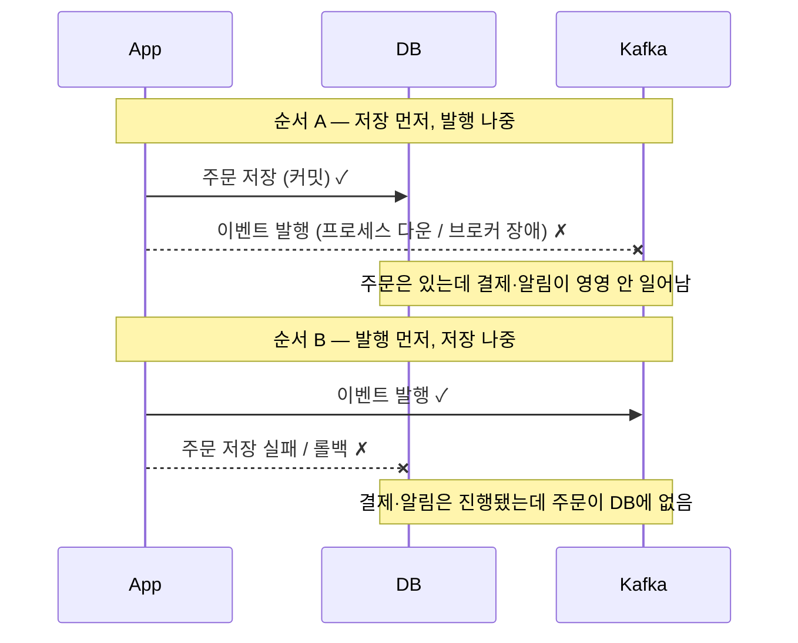
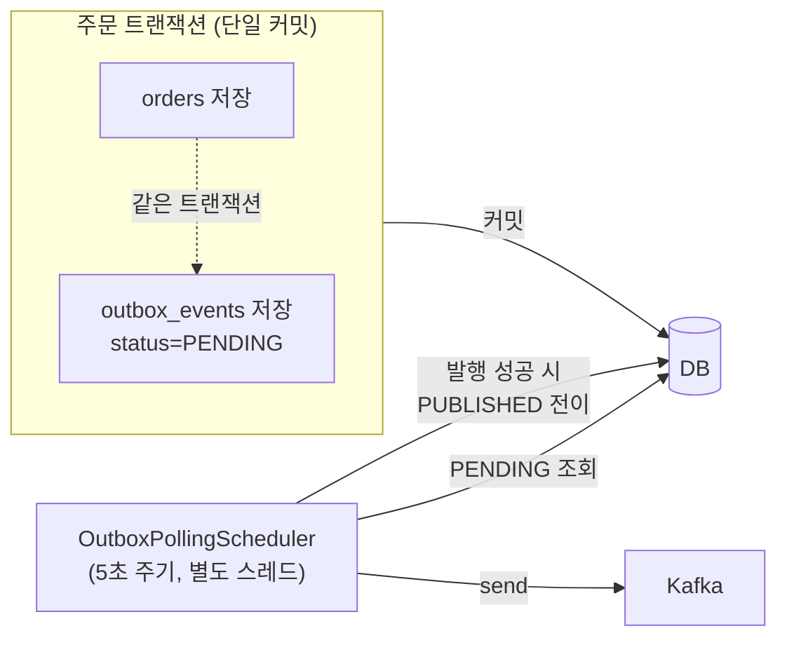
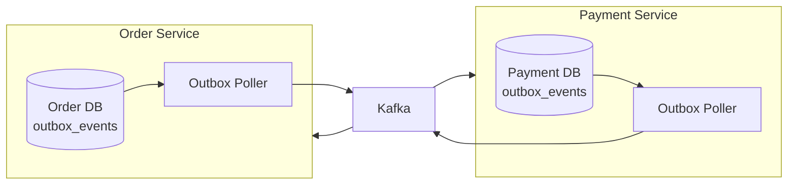

Phase 1의 도메인 간 통신은 한 프로세스 안에서 일어났다. 주문이 생성되면 `ApplicationEventPublisher`로 `OrderCreatedEvent`를 던지고, `@TransactionalEventListener(AFTER_COMMIT)`를 단 리스너가 그 이벤트를 받아 결제 준비와 알림을 처리했다. 같은 JVM, 같은 스레드에서 호출이 이어지니 "메시지가 시스템 사이에서 사라진다"는 문제가 적어도 외부 전달만큼 명시적으로 드러나지는 않았다. (엄밀히는 커밋 직후 핸들러가 돌기 전에 프로세스가 죽으면 후속 처리가 유실될 수 있다. 뒤에서 보듯 `AFTER_COMMIT`에도 같은 구멍이 있다. 다만 그 구멍이 네트워크 너머 발행만큼 눈에 띄지 않았을 뿐이다.)
Phase 2에서 Order, Payment, Notification을 Kafka로 느슨하게 잇기 시작하자 이 그림이 깨졌다. 이제 "주문을 DB에 저장하는 일"과 "주문 생성 이벤트를 Kafka에 발행하는 일"은 **서로 다른 두 시스템에 대한 두 번의 쓰기**다. 둘 사이 어딘가에서 프로세스가 죽으면, DB에는 주문이 있는데 Kafka에는 이벤트가 없는, 혹은 그 반대의 상태가 남는다. 결제도 알림도 영영 트리거되지 않는 주문이 생기는 것이다.
이번 글은 이 **dual-write 문제**를 왜 `@TransactionalEventListener`로는 못 막는지, 그리고 PeekCart가 **Transactional Outbox** 패턴으로 그것을 어떻게 "한 번의 쓰기"로 되돌렸는지를 정리한다. 정확히는 Producer(발행) 측 이야기다.

이 글에서 쓰는 용어는 다음 뜻으로 읽으면 된다.

| 용어 | 이 글에서의 의미 |
| --- | --- |
| Dual-write | 한 비즈니스 동작이 서로 다른 두 저장소(DB와 Kafka)에 각각 써야 하는 상황. 둘을 원자적으로 묶을 수 없는 게 문제의 핵심 |
| Transactional Outbox | 이벤트를 메시지 브로커에 직접 쏘는 대신, **같은 DB 트랜잭션 안의 outbox 테이블에 한 행으로 저장**하고, 별도 프로세스가 그 행을 읽어 발행하는 패턴 |
| `@TransactionalEventListener(AFTER_COMMIT)` | 트랜잭션이 **커밋된 뒤** 리스너를 실행하는 Spring 기능. 커밋 후이므로 리스너가 실패해도 원본 트랜잭션을 되돌릴 수 없다 |
| Polling Publisher | outbox 테이블을 주기적으로 조회해 `PENDING` 이벤트를 Kafka로 발행하는 스케줄러. PeekCart는 5초 주기 |
| at-least-once | "최소 한 번" 전달 보장. 발행이 성공했는지 불확실하면 다시 보내므로, 같은 이벤트가 **두 번 이상** 도착할 수 있다 |
| Outbox `FAILED` vs DLQ | 전자는 **Producer**가 Kafka에 못 보낸 실패(발행 실패), 후자는 **Consumer**가 받아서 처리하다 난 실패. 완전히 다른 단계의 두 메커니즘 |
| CDC (Change Data Capture) | DB의 변경 로그(MySQL binlog)를 직접 읽어 이벤트로 흘리는 방식. Debezium이 대표. polling의 대안 |

이번 학습에서 확인하고 싶은 질문은 다음과 같다.

1. `@TransactionalEventListener(AFTER_COMMIT)`는 무엇을 보장하고, 정확히 어디서 무너지는가?
2. "DB 저장과 이벤트 저장을 한 트랜잭션으로 묶는다"는 말은 코드에서 어떻게 강제되는가?
3. Outbox는 이벤트 유실을 막는 대신 무엇을 대가로 내놓는가? (지연, 중복)
4. Producer 발행 실패(`FAILED`)와 Consumer 처리 실패(DLQ)는 왜 같은 알림 채널을 쓰면서도 다른 문제인가?
5. polling 방식은 Debezium CDC와 비교해 무엇을 포기했는가?
6. 통합 테스트는 "이벤트가 유실되지 않는다"를 정말 증명했는가, 아니면 정상 경로만 봤는가?

---

## 문제 상황: 두 번의 쓰기는 원자적이지 않다

주문 생성이 끝나면 두 가지가 일어나야 한다. **(1) 주문을 DB에 저장**하고, **(2) "주문이 생겼다"를 Payment·Notification에게 알린다.** Phase 1에서는 (2)가 같은 프로세스 안의 메서드 호출이었으니 (1)과 묶기 쉬웠다. Phase 2에서 (2)가 Kafka 발행이 되는 순간, (1)과 (2)는 서로 다른 시스템에 대한 두 번의 독립적인 쓰기가 된다.

문제는 이 둘을 감쌀 공통 트랜잭션이 없다는 데 있다. DB 트랜잭션은 DB만 롤백할 수 있고, Kafka 발행은 트랜잭션 바깥의 네트워크 호출이다. 그래서 다음 두 순서 모두 유실 구멍이 있다.



`@TransactionalEventListener(AFTER_COMMIT)`는 순서 A를 좀 더 정교하게 만든 것일 뿐, 구멍 자체를 막지는 못한다. 이 리스너는 **트랜잭션이 커밋된 뒤에** 핸들러를 실행한다. 커밋 전에 발행했다가 롤백되면 "있지도 않은 주문"의 이벤트가 나가는 사고(순서 B의 유령 이벤트)를 막아주는 건 분명한 장점이다. 하지만 그 대가로, 핸들러가 도는 시점은 이미 트랜잭션이 닫힌 뒤다.

```java
@TransactionalEventListener(phase = TransactionPhase.AFTER_COMMIT)
public void handleOrderCreated(OrderCreatedEvent event) {
    kafkaTemplate.send("order.created", ...);   // 여기서 프로세스가 죽으면?
    // 주문은 이미 커밋됨 → 롤백 불가 → 이벤트만 증발
}
```

커밋은 끝났는데 이 `send`가 브로커 장애나 프로세스 강제 종료로 실패하면, 되돌릴 트랜잭션이 없다. 주문은 DB에 남고 이벤트는 사라진다. 설계 문서가 이 한계를 "Phase 2 전환의 직접적 이유"로 못 박아둔 이유가 이것이다(`04-design-deep-dive.md` §10-5). `AFTER_COMMIT`는 **유령 이벤트는 막지만 유실 이벤트는 못 막는다.** 우리에게 필요한 건 "DB 저장과 이벤트 기록이 같이 살고 같이 죽는" 원자성이었다.

---

## 선택한 설계: 이벤트를 "또 하나의 행"으로 저장한다

Outbox 패턴의 발상은 단순하다. **Kafka에 직접 쏘지 말고, 같은 DB의 `outbox_events` 테이블에 한 행으로 저장하라.** 그러면 "주문 저장"과 "이벤트 저장"이 둘 다 같은 DB에 대한 쓰기가 되고, 하나의 로컬 트랜잭션으로 묶을 수 있다. 둘은 같이 커밋되거나 같이 롤백된다. 정확히 말하면, 원자적으로 묶여야 했던 부분이 **하나의 DB 트랜잭션**으로 축소되고, DB→Kafka 전달이라는 두 번째 홉은 사라지는 게 아니라 폴러가 **재시도 가능한 형태로** 이어받는다. 서로 다른 두 시스템에 대한 동시 쓰기 문제를 로컬 트랜잭션과 재시도 가능한 전달 문제로 바꾼 것이다.



발행은 트랜잭션 바깥으로 분리한다. 별도 스케줄러가 `PENDING` 행을 주기적으로 읽어 Kafka에 보내고, 성공하면 그 행을 `PUBLISHED`로 바꾼다. 핵심 트레이드오프는 여기서 갈린다.

- **얻는 것**: 이벤트는 일단 DB에 안전하게 적혀 있으므로, 발행이 한 번 실패해도 다음 폴링이 다시 시도한다. 프로세스가 죽어도 행은 `PENDING`으로 남아 있다가 재기동 후 발행된다. **DB 커밋과 Kafka 발행 사이의 dual-write 창에서 이벤트가 사라지는 문제를 피한다.**
- **내놓는 것**: (a) 발행이 폴링 주기만큼 **지연**된다(5초 주기 + 직전 폴링 처리 시간). (b) "발행은 성공했는데 `PUBLISHED` 표시 직전에 죽는" 창이 있어, 같은 이벤트가 **두 번 발행될 수 있다**(at-least-once). 이 중복은 Consumer 멱등성으로 받아야 하고, 그게 11편 주제다.

**왜 polling인가. Debezium CDC와의 갈림길**

발행을 "어떻게 outbox에서 꺼내 Kafka로 보내느냐"에는 두 갈래가 있다. PeekCart가 택한 **polling**과, 대안으로 검토한 **Debezium CDC**다. 둘은 같은 outbox 테이블을 쓰지만 꺼내는 방식이 정반대다.

- **Polling (pull 방식)**: 애플리케이션 안의 스케줄러가 5초마다 `SELECT ... WHERE status='PENDING'`으로 DB에 **물어본다**. DB는 수동적이고, 애플리케이션이 능동적으로 당겨 온다. 이벤트가 없어도 5초마다 빈 쿼리가 한 번씩 돈다(idle polling 비용). 구현은 `@Scheduled` 메서드 하나면 되고, 추가 프로세스가 없다.
- **CDC (push 방식)**: Debezium이 MySQL의 **binlog**(모든 커밋된 행 변경이 순서대로 적히는 복제 로그)를 실시간으로 tail한다. `outbox_events`에 INSERT가 커밋되는 순간 그 변경이 binlog에 적히고, Debezium이 그걸 읽어 Kafka로 **밀어낸다**. 폴링 주기라는 개념 자체가 없어 발행 지연을 polling 방식보다 낮출 수 있다. DB에 반복 SELECT를 던지지 않으므로 outbox 조회 부하도 없다.

Debezium은 단순히 binlog를 읽기만 하는 게 아니라 **Outbox Event Router**라는 전용 SMT(Single Message Transform)를 제공한다. 이건 outbox 테이블의 행을 읽어 한 컬럼을 Kafka 메시지 key로, 다른 컬럼을 토픽 라우팅 기준으로, `payload` 컬럼을 메시지 본문으로 매핑해 준다. 다만 **기본값이 우리 스키마와 딱 맞지는 않는다.** 라우터는 기본적으로 `id`/`aggregatetype`/`aggregateid`/`type`/`payload` 컬럼명을 기대하고, 토픽도 기본 `outbox.event.${aggregatetype값}` 형태로 만든다. 우리 `event_id`/`aggregate_id`/`event_type` 컬럼과 `order.created` 같은 토픽명을 그대로 쓰려면 `table.field.event.id`, `table.field.event.key`, `table.field.event.type`, `route.by.field`, `route.topic.replacement` 같은 커넥터 설정으로 매핑을 맞춰야 한다. 그래도 바꾸는 건 주로 **커넥터 설정과 운영 방식**이다. outbox 행의 핵심 의미와 메시지 payload는 재사용할 수 있다.

그렇다면 왜 더 빠르고 DB 부하도 적은 CDC를 안 쓰는가. 속도가 아니라 **운영 인프라의 무게** 때문이다. Debezium은 보통 **Kafka Connect 클러스터** 위에서 커넥터로 돌아가는데, 이게 통째로 새 운영 표면을 만든다.

- Kafka Connect 워커 프로세스(보통 별도 클러스터)를 띄우고 살려야 한다.
- Debezium 커넥터의 수명주기(등록, 설정, 재시작, 버전 업)를 관리해야 한다.
- 커넥터가 "binlog의 어디까지 읽었는지"(offset)와 스키마 이력을 별도 Kafka 토픽에 저장하므로 그 토픽들도 관리 대상이다.
- MySQL 쪽도 `binlog_format=ROW`, binlog 보존 기간, 복제 권한을 가진 전용 계정 등 전제 설정이 붙는다.
- 커넥터 자체의 lag·장애·재시작을 감시할 모니터링이 또 필요하다.

요약하면 CDC는 "발행 지연"이라는 문제를 "운영해야 할 분산 컴포넌트 한 덩어리"와 맞바꾼다.

| | Polling (채택) | Debezium CDC |
| --- | --- | --- |
| 발행 지연 | 폴링 주기 5초 + 처리 시간 | 폴링보다 낮출 수 있음 (환경 의존) |
| 추가 인프라 | 없음 (`@Scheduled` + ShedLock) | Kafka Connect 클러스터 + 커넥터 |
| DB 부하 | idle 시에도 주기적 SELECT | binlog 읽기 (반복 SELECT 없음) |
| outbox 테이블 | 그대로 사용 | 행 의미 재사용 (Event Router 매핑 설정 필요) |
| 운영 복잡도 | 낮음 | 커넥터·offset·스키마 토픽·모니터링 추가 |

토이 프로젝트 범위에서 수백 ms~수 초의 발행 지연은 허용 가능한 값이고(§10-1), Spring Scheduler 하나로 끝나는 단순함이 Kafka Connect 클러스터를 운영하는 비용보다 명백히 싸다. 무엇보다 **갈아탈 길을 막지 않는 설계**라는 점이 결정을 가볍게 했다 — payload는 표준 `KafkaEventEnvelope` JSON이고, outbox 행에 라우팅에 필요한 정보(`aggregate_id`/`event_type`/`payload`)가 이미 다 들어 있다. 바뀌는 건 발행 메커니즘(polling 스케줄러 → Debezium 커넥터)과 위에서 본 커넥터 매핑 설정뿐이고, Producer·Consumer 코드와 outbox 스키마·메시지 본문은 건드리지 않는다. 트래픽이 커져 발행 지연이 실제 병목이 되는 날(그 신호를 측정할 메트릭은 아직 없다 — 「한계」 절 참고) Debezium으로 옮기면 된다.

---

## 구현 구조

### 1. outbox 테이블과 엔티티 — 발행 상태를 가진 한 행

`outbox_events`는 이벤트 본문(`payload`)과 발행 수명주기(`status`, `retry_count`)를 함께 담는다.

```sql
CREATE TABLE outbox_events (
    id                BIGINT AUTO_INCREMENT PRIMARY KEY,
    aggregate_type    VARCHAR(50)  NOT NULL,   -- "ORDER", "PAYMENT"
    aggregate_id      VARCHAR(50)  NOT NULL,   -- 파티션 키로 쓰임 (order_id)
    event_type        VARCHAR(50)  NOT NULL,   -- 토픽명 "order.created"
    event_id          VARCHAR(36)  NOT NULL,   -- UUID, Consumer 멱등성 키
    payload           TEXT         NOT NULL,
    status            VARCHAR(20)  NOT NULL DEFAULT 'PENDING',
    retry_count       INT          NOT NULL DEFAULT 0,
    last_attempted_at DATETIME(6)  NULL,
    created_at        DATETIME(6)  NOT NULL,
    published_at      DATETIME(6)  NULL,
    trace_id          VARCHAR(64)  NULL,
    user_id           VARCHAR(64)  NULL,
    CONSTRAINT uk_outbox_event_id UNIQUE (event_id)
) ENGINE=InnoDB DEFAULT CHARSET=utf8mb4;

CREATE INDEX idx_outbox_status_created ON outbox_events (status, created_at);
```

상태는 셋이다. `PENDING`(저장됨, 미발행) → `PUBLISHED`(발행 완료) 또는 `FAILED`(재시도 소진). 엔티티는 이 전이를 메서드로 캡슐화한다.

```java
@Entity
@Table(name = "outbox_events")
public class OutboxEvent {
    // ...
    private OutboxEventStatus status;   // PENDING / PUBLISHED / FAILED
    private int retryCount;

    public void markPublished() {
        this.status = OutboxEventStatus.PUBLISHED;
        this.publishedAt = LocalDateTime.now();
    }
    public void incrementRetry() {
        this.retryCount++;
        this.lastAttemptedAt = LocalDateTime.now();
    }
    public void markFailed() {
        this.status = OutboxEventStatus.FAILED;
        this.lastAttemptedAt = LocalDateTime.now();
    }
}
```

`event_id`의 `UNIQUE` 제약과 `aggregate_id`(파티션 키)는 11편(Consumer 멱등성)과 파티션 순서 보장에서 다시 등장한다. 지금 단계에서 기억할 것은 `idx_outbox_status_created` 인덱스다. 폴링이 매번 `status='PENDING' ORDER BY created_at` 으로 조회하므로, 이 인덱스가 없으면 테이블이 커질수록 폴링이 풀스캔이 된다. 한 가지 덧붙이면, 정렬이 `created_at ASC` 단독이라 `created_at`(마이크로초)이 동률인 두 이벤트의 상대 순서는 비결정적이다. 같은 aggregate에 거의 동시에 쌓인 이벤트의 파티션 내 순서를 엄밀히 보장하려면 `ORDER BY created_at, id`처럼 `id`를 tiebreaker로 더해야 한다(현재는 미적용 — 동일 트랜잭션당 이벤트가 대개 1건이라 충돌 빈도가 낮다).

### 2. Publisher — 이벤트 저장이 도메인 트랜잭션에 합류한다

패턴의 심장은 "어디서 저장하느냐"다. `OrderOutboxEventPublisher.publishOrderCreated`는 Kafka를 전혀 모른다. 그저 `outboxEventRepository.save()`를 호출할 뿐이다.

```java
@Component
public class OrderOutboxEventPublisher {

    public void publishOrderCreated(Order order) {
        OrderCreatedPayload payload = new OrderCreatedPayload(/* ... */);
        saveOutboxEvent(ORDER_CREATED, order.getId().toString(), payload);
    }

    private void saveOutboxEvent(String eventType, String aggregateId, Object payload) {
        MdcSnapshot.Snapshot mdc = MdcSnapshot.current();    // traceId/userId 캡처 (ADR-0008)
        OutboxEvent outboxEvent = OutboxEvent.create(AGGREGATE_TYPE, aggregateId, eventType,
                mdc.traceId(), mdc.userId(),
                eventId -> serialize(new KafkaEventEnvelope(eventId, eventType, LocalDateTime.now(), payload)));
        outboxEventRepository.save(outboxEvent);             // ← 별도 send 없음. 그냥 DB save
    }
}
```

그리고 이 Publisher는 도메인 서비스의 트랜잭션 **안에서** 호출된다. `OrderCommandService`는 클래스 레벨 `@Transactional`이라, `createOrder` 전체가 한 트랜잭션이다.

```java
@Service
@Transactional                       // ← createOrder 전체가 한 트랜잭션
public class OrderCommandService {

    public OrderDetailDto createOrder(Long userId, CreateOrderCommand command) {
        // ... 재고 차감 ...
        orderRepository.save(order);              // (1) 주문 저장
        cart.clear();
        outboxEventPublisher.publishOrderCreated(order);   // (2) 이벤트 저장 — 같은 트랜잭션
        return OrderDetailDto.from(order);
        // ← 메서드가 리턴될 때 (1)과 (2)가 함께 커밋된다
    }
}
```

여기가 서로 다른 두 시스템에 걸친 dual-write를 하나의 로컬 트랜잭션으로 바꾸는 지점이다. `orderRepository.save`와 `outboxEventRepository.save`는 둘 다 같은 트랜잭션에 묶인 DB 쓰기이므로, `createOrder`가 리턴되며 커밋될 때 **둘 다 적히거나 둘 다 사라진다.** 적어도 주문 생성 로컬 트랜잭션의 커밋·롤백 범위에서는 주문만 있고 outbox 이벤트는 없는 상태가 생기지 않는다. `@TransactionalEventListener`로는 표현할 수 없던 원자성이, "이벤트도 그냥 DB 행으로 저장한다"는 한 수로 확보된다.

`PaymentOutboxEventPublisher`도 대칭이다. 결제 성공/실패 시 `payment.completed` / `payment.failed`를 같은 방식으로 `PaymentCommandService`의 트랜잭션 안에서 outbox에 적는다.

### 3. Polling Publisher. 트랜잭션 바깥에서 발행하고 표시한다

저장과 발행을 분리했으니, 발행은 별도 스케줄러가 맡는다. `OutboxPollingScheduler`는 5초마다 깨어나고, ShedLock으로 다중 Pod 중복 실행을 막는다(12편 주제).

```java
@Component
public class OutboxPollingScheduler {
    @Scheduled(fixedDelay = 5000)
    @SchedulerLock(name = "outboxPollingJob", lockAtMostFor = "PT5M", lockAtLeastFor = "PT4S")
    public void pollAndPublish() {
        outboxPollingService.pollAndPublish();
    }
}
```

실제 발행 로직은 `OutboxPollingService`다. `PENDING`을 배치로 읽고, 한 건씩 보내고, 결과에 따라 상태를 갱신한다.

```java
public void pollAndPublish() {
    List<OutboxEvent> pendingEvents = outboxEventRepository.findPendingEvents(BATCH_SIZE);  // 100건

    for (OutboxEvent event : pendingEvents) {
        try {
            kafkaTemplate.send(buildRecord(event)).get();   // ← 동기 대기. 발행 확정까지 블록
            event.markPublished();
            outboxEventRepository.save(event);
        } catch (Exception e) {
            event.incrementRetry();
            if (event.getRetryCount() >= MAX_RETRY) {        // 5회 소진
                event.markFailed();
                slackPort.send("[Outbox FAILED] ...");       // 운영자 통지 (실제 코드는 try-catch로 Slack 실패 격리)
            }
            outboxEventRepository.save(event);
        }
    }
}
```

설계상 짚을 점이 셋이다.

- **`.get()`으로 동기 대기한다.** `kafkaTemplate.send(...)`는 `CompletableFuture`를 돌려주는데, 여기에 `.get()`을 붙여 **브로커 ack 결과를 받을 때까지 블록**한다. ack의 강도는 Producer `acks` 설정에 달려 있는데, PeekCart는 `acks=all` + `enable.idempotence=true`라 leader가 모든 in-sync replica의 ack를 확인한 뒤 Future가 완료된다. 비동기로 보내고 바로 `markPublished()`를 하면, 발행이 실패했는데도 `PUBLISHED`로 표시해버려 유실이 난다. 동기 대기는 polling 처리량을 깎는 대가로 "브로커 ack 확인 후에만 PUBLISHED" 불변식을 지킨다. 다만 타임아웃 없는 `.get()`은 브로커가 응답을 멈추면 폴링 스레드가 무한정 블록될 수 있어, `.get(timeout, unit)`이 더 안전하다 — 현재는 무한 `.get()`이라 개선 여지가 남는다.
- **성공과 실패 모두 상태를 영속한다.** 발행 성공이면 `PUBLISHED`, 실패면 `retry_count++`. 실패한 행은 여전히 `PENDING`이라 다음 폴링이 다시 집어 든다. 이게 "자동 재시도"의 정체다 — 별도 재시도 큐가 아니라, 그냥 `PENDING`으로 남겨두면 5초 뒤 또 시도된다.
- **`PENDING` → `PUBLISHED` 전이가 안전 방향이다.** 발행은 성공했는데 `markPublished()` 저장 직전에 프로세스가 죽으면, 그 행은 `PENDING`으로 남아 다음 폴링이 **다시 발행**한다. 즉 중복이 날 수 있다. 반대로 발행 안 됐는데 `PUBLISHED`가 되는 경우는 `.get()` 덕에 없다. **유실 대신 중복을 택한** 설계이고, 이게 at-least-once의 본질이다.

---

## 한계와 트레이드오프

### 발행은 폴링 주기만큼 지연된다

`fixedDelay = 5000`은 직전 폴링이 **끝난 뒤** 5초를 센다. 그래서 이벤트가 outbox에 저장된 뒤 Kafka로 나가기까지는 5초 주기에 더해 직전·현재 폴링의 처리 시간만큼 더 걸린다 — 한산할 땐 5초 안팎이지만 폴링이 무겁거나 backlog가 쌓이면 여러 사이클만큼 더 벌어진다(고정 상한이 아니다). 주문 생성 → 결제 준비 → 알림의 체감 지연이 그만큼 늘어난다. 포트폴리오 범위에서 허용한 값이지만, 결제 같은 사용자 대기 흐름에서 이 지연은 길 수 있다. 줄이는 길은 주기 단축(부하↑)이나 Debezium CDC 전환(인프라↑)인데, 둘 다 "지연 vs 비용" 트레이드오프의 다른 점일 뿐이다.

### at-least-once. 중복 발행은 버그가 아니라 설계의 일부다

위에서 본 "발행 성공 후 `markPublished` 직전 다운" 창 때문에, 같은 이벤트가 두 번 나갈 수 있다. 이건 Outbox + polling 조합의 **불가피한 성질**이지 결함이 아니다. DB 쓰기와 Kafka 발행을 하나의 원자적 커밋으로 묶으려면 2PC 같은 분산 트랜잭션이 필요한데, 그 비용이 중복을 Consumer에서 흡수하는 비용보다 훨씬 크다. 멱등 Consumer로 중복을 걸러 effectively-once에 도달하는 편이 실용적이다. 그래서 "Producer는 최소 한 번 보낸다, Consumer가 중복을 거른다"로 책임을 나눴다. **이 글이 막은 건 유실이고, 중복 방어는 11편(`processed_events` 멱등성)이 받는다.**

### `FAILED`가 되면 자동 복구가 멈춘다. 발행 실패와 처리 실패는 다른 문제

`retry_count`가 5에 도달하면 `markFailed()`로 `FAILED` 전이하고 Slack으로 알린다. 그런데 `FAILED`는 더 이상 `PENDING`이 아니므로 **폴링 대상에서 빠진다.** 즉 자동 재시도가 거기서 끝나고, 운영자의 수동 개입을 기다린다. 여기서 Phase 4 전 꼭 구분해야 할 두 실패가 갈린다.

| | Outbox `FAILED` | DLQ (11편) |
| --- | --- | --- |
| 발생 단계 | **Producer** 발행 실패 | **Consumer** 처리 실패 |
| 원인 | Kafka 브로커 장애, 네트워크 단절 | 비즈니스 로직 에러, 데이터 정합성 위반 |
| 위치 | `outbox_events.status = FAILED` | `{topic}.dlq` 토픽 |
| 공통점 | 둘 다 Slack 알림 + 수동 재처리 | 둘 다 Slack 알림 + 수동 재처리 |

둘 다 같은 Slack 채널로 통지되지만(그래서 헷갈리기 쉽지만), 하나는 "이벤트가 아예 못 나갔다"이고 다른 하나는 "나가긴 했는데 받는 쪽이 못 삼켰다"이다. 대응도 다르다. `FAILED`는 브로커가 살아난 뒤 재발행, DLQ는 데이터를 고친 뒤 원본 토픽으로 재투입.

### 발행 처리량. 한 폴링이 100건을 순차 동기 발행한다

`BATCH_SIZE = 100`을 읽어 `for` 루프에서 `.get()`으로 한 건씩 기다린다. 발행이 직렬이라, 브로커 왕복이 수 ms라도 100건이면 수백 ms가 한 폴링에 쌓인다. 평상시 트래픽에선 문제없지만, 이벤트가 폭증해 한 폴링 주기(5초)에 쌓이는 양이 100건을 넘기면 backlog가 누적된다. 개선 여지는 배치 발행이나 비동기 파이프라이닝인데, 비동기로 가면 "발행 확정 후 PUBLISHED" 불변식을 지키기 위한 콜백 정합이 새 복잡도로 들어온다. 현재는 단순성을 택했다.

### PUBLISHED 행이 무한히 쌓인다

폴링 쿼리는 `PENDING`만 조회하므로 `PUBLISHED` 행은 테이블에 계속 남는다. `processed_events`는 30일 배치 삭제 정책이 문서화돼 있지만(§9-7), `outbox_events`의 청소 정책은 아직 없다. 테이블이 커지면 인덱스도 비대해지고 폴링 비용이 슬금슬금 오른다. 운영 단계에서 `PUBLISHED` + `published_at` 기준 아카이빙/삭제가 필요한 잠재 부채다.

---

## 통합 테스트로 검증된 것 (과 못한 것)

`OutboxKafkaIntegrationTest`는 Testcontainers로 MySQL + Redis + Kafka를 띄우고 **Outbox 저장 → 폴링 → Kafka 발행 → Consumer 처리**의 E2E를 검증한다. 단위 테스트 `OutboxPollingServiceTest`는 발행 실패/재시도/헤더 주입 같은 분기를 Mockito로 좁혀 본다.

**1. 정상 E2E — 저장이 발행으로, 발행이 처리로 이어진다**

```java
orderOutboxEventPublisher.publishOrderCreated(order);
assertThat(outboxEventRepository.findPendingEvents(100)).hasSize(1);   // PENDING으로 저장됨

outboxPollingService.pollAndPublish();                                  // 발행
assertThat(outboxEventRepository.findPendingEvents(100)).isEmpty();     // PUBLISHED 전이 → 더 이상 PENDING 아님

await().atMost(10, SECONDS).untilAsserted(() -> {                       // Consumer가 받아 처리
    assertThat(paymentRepository.findByOrderId(order.getId())).isPresent();
    assertThat(notifications).anyMatch(n -> n.getType() == ORDER_CREATED);
});
```

핵심은 "저장 직후엔 `PENDING` 1건, 폴링 후엔 `PENDING` 0건"이라는 상태 전이를 직접 단언한다는 점이다. `payment.completed`, `payment.failed`(주문 취소 + 재고 복구), `order.cancelled` 각 시나리오가 같은 골격으로 검증된다.

**2. 정상 재폴링 시 재발행 방지**

```java
orderOutboxEventPublisher.publishOrderCancelled(order);
outboxPollingService.pollAndPublish();
// ... 알림 1건 생성 확인 ...
outboxPollingService.pollAndPublish();              // 재폴링
assertThat(outboxEventRepository.findPendingEvents(100)).isEmpty();   // PUBLISHED라 재발행 안 됨
assertThat(notifications).hasSize(1);               // 알림도 그대로 1건
```

한 번 `PUBLISHED`된 이벤트는 `PENDING`이 아니라 재폴링에도 다시 안 나간다 — "정상 경로에서는" 중복이 없음을 보인다.

**3. 발행 실패 → 재시도 소진 → FAILED + Slack (단위 테스트)**

```java
given(kafkaTemplate.send(any())).willThrow(new RuntimeException("Kafka down"));
// retryCount=4인 이벤트 → 이번 실패로 5 도달
outboxPollingService.pollAndPublish();
assertThat(event.getStatus()).isEqualTo(FAILED);
verify(slackPort).send(contains("[Outbox FAILED]"));
```

Slack 발송 자체가 또 실패해도 `FAILED` 저장이 수행되고 예외가 전파되지 않는다(`slackFailureIsIsolated`). 발행 실패가 폴링 루프 전체를 멈추지 않도록 격리한 것이다.

**이 테스트들이 증명하지 못하는 것**도 분명히 해야 한다.

- **at-least-once의 중복 창은 재현하지 않는다.** 위 2번은 "`PUBLISHED`면 재발행 안 함"을 보일 뿐, "발행 성공 후 `markPublished` 저장 직전에 죽어 다음 폴링이 재발행하는" 시나리오 — 즉 진짜 중복이 나는 경로는 건드리지 않는다. 프로세스를 그 좁은 창에서 강제 종료시키는 카오스 테스트가 없다. 그래서 "중복은 날 수 있다"는 설계상 사실이지 테스트로 박힌 사실이 아니다.
- **dual-write 원자성 자체를 음성으로 검증하지 않는다.** "주문 커밋 후 outbox 저장이 롤백되면 둘 다 사라지는가"를 보려면 트랜잭션 중간에 예외를 주입해야 하는데, 그 테스트는 없다. 원자성은 `@Transactional` 의미론에 기대고 있고, 통합 테스트는 정상 커밋 경로만 본다.
- **유실 0건을 장애 주입으로 증명하지 않았다.** 브로커를 폴링 중간에 끊고 재기동 후 `PENDING`이 발행되는지를 보는 시나리오는 단위 테스트의 mock 예외로 흉내 냈을 뿐, 실제 Kafka 컨테이너를 죽였다 살리는 검증은 아니다.
- **발행 실패 테스트가 동기 예외만 흉내 낸다.** 단위 테스트는 `kafkaTemplate.send(...)`가 호출 즉시 `RuntimeException`을 던지게 mock한다. 그러나 실제 브로커 장애는 `send()`가 정상 반환한 뒤 **`Future`가 예외로 완료**되고 `.get()`이 `ExecutionException`으로 풀어내는 경로로 나타난다. 현재 `catch (Exception)`이 둘 다 잡으므로 런타임 동작은 같지만, 테스트가 실제로 검증하는 건 전자(동기 throw)뿐이다.

요약하면, 테스트는 **정상 경로의 상태 전이와 발행 실패의 격리**는 단단히 잡지만, **유실/중복이 실제로 나는 비정상 타이밍**은 설계 논증에 맡겨두고 있다.

---

## 자료는 어떤 질문에 연결해서 읽을까

| 질문 | 같이 읽을 자료 | 이 글에서 연결되는 지점 |
| --- | --- | --- |
| dual-write는 왜 트랜잭션으로 못 묶는가 | Chris Richardson, *Microservices Patterns* — Transactional Outbox / Polling Publisher | "두 번의 쓰기" 절 |
| `@TransactionalEventListener`의 phase별 동작 | Spring 공식 문서, *Transaction-bound Events* (`AFTER_COMMIT` vs `BEFORE_COMMIT`) | "AFTER_COMMIT는 유령은 막고 유실은 못 막는다" |
| polling vs CDC 트레이드오프 | Debezium 공식 문서, *Outbox Event Router* | §10-1 발행 지연 절 |
| at-least-once와 중복 흡수 | Kafka 공식 문서, *Message Delivery Semantics* | "중복은 설계의 일부" 절 |
| 발행 확정과 `Future.get()` | Spring for Apache Kafka, `KafkaTemplate` send 결과 처리 | `.get()` 동기 대기 절 |
| Outbox trace context 전파 | `docs/adr/0008-outbox-trace-context-propagation.md` | Publisher `MdcSnapshot.current()` |
| Producer 실패 vs Consumer 실패 | `04-design-deep-dive.md` §9-3, §8-3 | `FAILED` vs DLQ 표 |

---

## Phase 4 MSA에서는 어떻게 바뀌는가

지금은 Order, Payment, Notification이 한 프로세스, 한 DB 안에 있다. 그래서 `outbox_events`도 단일 테이블 하나고, ShedLock으로 단일 폴링만 보장하면 됐다. Phase 4에서 서비스와 DB가 쪼개지면 이 그림이 서비스 수만큼 복제된다.



**그대로 가는 것**

- **패턴 자체.** 서비스마다 자기 DB 안에 `outbox_events`를 두고, 자기 폴러가 발행한다. "로컬 트랜잭션으로 dual-write를 막는다"는 원리는 서비스가 쪼개질수록 **더 본질적**이 된다 — 분산 트랜잭션을 안 쓰기로 한 이상, 각 서비스의 "한 DB 안 원자성"이 유일하게 믿을 수 있는 보장이기 때문이다.
- **`event_id` 멱등성 키와 `aggregate_id` 파티션 키.** 서비스 경계를 넘어도 Consumer 멱등성과 파티션 순서의 토대로 그대로 쓰인다.
- **at-least-once 계약.** Producer는 여전히 최소 한 번 보내고, Consumer가 중복을 거른다. 책임 분담이 서비스 경계와 정확히 겹친다.

**바뀌는 것**

- **`outbox_events`가 서비스별로 분산된다.** 단일 테이블이 N개가 되고, 폴러도 N개가 된다. ShedLock 락 이름도 서비스별로 분리돼야 한다(12편). 한 서비스의 폴러 장애가 그 서비스 이벤트만 지연시키도록 격리되는 건 장점이다.
- **Choreography Saga의 발행 지점이 된다.** `payment.failed → order.cancelled → inventory restore`의 보상 흐름(§8-5)에서, 각 단계의 이벤트가 바로 이 outbox를 거쳐 나간다. 지금 모놀리스에서 한 트랜잭션 안의 메서드 호출로 처리되는 보상이, Phase 4에선 outbox 발행 → Kafka → 다른 서비스 소비로 풀린다. **Outbox가 Saga의 신뢰성 토대**가 되는 것이다.
- **trace context가 cross-service로 확장된다.** ADR-0008이 모놀리스 단계에서 미리 깔아둔 `trace_id`/`user_id` 헤더 전파는, Phase 4에서 W3C `traceparent` 주입·추출과 OpenTelemetry 계측을 붙일 수 있는 기반이 된다. "HTTP 요청 → outbox 저장 → 발행 → 다른 서비스 소비 → DLQ"를 단일 traceId로 묶기 위한 선결 작업 일부가 끝나 있다.
- **CDC 전환이 현실적 선택지가 된다.** 서비스가 많아지고 발행 지연이 누적되면, 서비스별 polling을 Debezium Outbox Event Router로 갈아탈 수 있다. payload 스키마(`KafkaEventEnvelope`)와 outbox 컬럼을 안 바꾸고 발행 메커니즘만 교체하도록 설계해둔 게 여기서 값을 한다.

**그래서 Phase 4 진입 전 짚을 점**

- **`FAILED`/DLQ 구분이 운영의 기본 어휘가 된다.** 서비스가 늘면 "어느 단계에서 멈췄나"를 빠르게 가르는 게 장애 대응 속도를 좌우한다. Producer 발행 실패(`FAILED`)와 Consumer 처리 실패(DLQ)를 같은 Slack 채널에 섞어 보내는 현재 구조(L-004)는 그 전에 분리하는 게 좋다.
- **`outbox_events` 청소 정책**을 서비스별로 정해야 한다. 모놀리스에선 미뤄도 됐지만, 서비스마다 쌓이는 `PUBLISHED` 행은 폴링 비용으로 직결된다.
- **유실/중복을 장애 주입으로 증명하는 테스트**가 Phase 4에선 선택이 아니라 필수가 된다. 지금은 정상 경로만 검증하지만, 분산 환경에선 "브로커를 끊었다 살리면 PENDING이 발행되는가", "중복 창에서 같은 이벤트가 두 번 나가도 Consumer가 한 번만 처리하는가"를 카오스 테스트로 박아야 한다. 그 절반(Consumer 멱등성)이 바로 다음 11편이다.
